# TiDB简介

TiDB 是一个开源的、兼容 MySQL、可以横向扩展的、可以完美替代分库分表的原生分布式关系型数据库，且支持 HTAP。2015 年在 GitHub 开源立项。

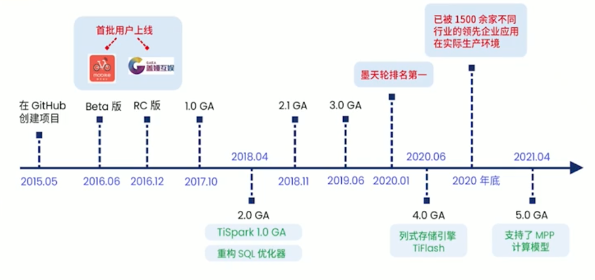


# TiDB架构

## 主要模块

TiDB 架构主要分为四个模块：

* TiDB Server
* TiKV Server
* TiSpark 
* PD（Placement Drive）Server
TiKV Server：负责数据存储，一个分布式的提供事务的Key-Value存储引擎，维护多副本（默认三副本），支持高可用和自动故障转移。

PD Server：整个 TiDB 集群的元信息管理模块，负责存储每个 TiKV 节点实时的数据分布情况和集群的整体拓扑结构，提供 TiDB Dashboard 管控界面，并未分布式事务分配事务 ID。还会根据 TiKV 节点实时上报数据分布状态，下发数据调度命令给具体的 TiKV 节点（如热点 region 调度），可以说是整个集群的“大脑”。

TiDB Server：SQL 层，对外暴露 MySQL 协议连接 endpoint，负责接受客户端的连接，执行 SQL 解析和优化，最终生成分布式执行计划，也支持所有 SQL 算子实现。TiDB 层本身无状态，内部可提供多个实例，通过负载均衡组件（如 LVS、HAProxy、F5）对外提供统一的接入。

TiFlash：用来做重型 IP 的 SQL 或者作业查询，做一些分布式计算。

## 整体架构

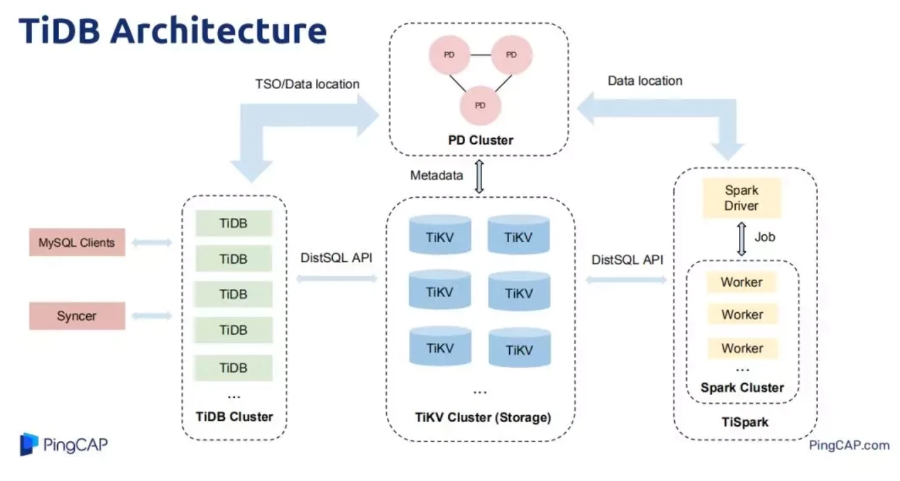


# TiKV

## 概述

本文依次从下向上按照数据结构、表模型、分片策略、复制、多版本控制、分布式事务等维度的介绍 TiKV 的选择与平衡。

## 数据结构

传统的 OLTP 系统中，写操作是最昂贵的成本。

* 传统的 B-tree 索引至少要写两次数据：预写日志（WAL）和树本身。
* B-tree是一个严格平衡的数据结构，整体设计对读友好。数据写入触发的 B-tree 分裂和平衡的成本非常高，对写相对不够友好。
* 传统的主从架构中，集群的写入容量无法扩展，集群的写入容量完全由主库的机器配置决定，扩容只能通过非常昂贵的集群拆分，即分库来实现。
LSM-tree 结构本质上是一个用空间置换写入延迟，用顺序写入替换随机写入的数据结构。

TiKV节点选择了基于 LSM-tree 的 RocksDB 引擎。其支持很多特性：

* 批量写入（事务）
* 无锁的快照读（数据副本迁移）
## 数据副本与复制

数据冗余决定了系统的可用性，如何选择复制协议尤为重要。

Raft 是一种用于替代 Paxos 的共识算法。相比 Paxos，Raft 的目标是提供更清晰的逻辑分工使得算法本身能被更好地理解，同时它的安全性更好，并能提供一些额外的特性。

Raft 算法通过先选出 leader 节点、有序日志等方式简化流程、提高效率，并通过约束减少了不确定性的状态空间。相对 Paxos 它的逻辑更加清晰、容易理解以及工程化实现。

所以利用 Raft 可以基于 RocksDB 构建一个多副本的集群。

## 分片

数据分片是分布式数据里的关键设计，从底层技术来看实现扩展就是要做分片。分片分为：

* 预先分片（静态分片）
* 自动分片（动态分片）
创传统的分库分表或者分区的方案都是预先分片。这种分片只解决了表的容量问题，没有解决更细粒度的弹性问题。所以，第一要实现扩展要使用自动分片的算法，其次分片需要一个维度和算法。常见的分片算法有：

* 哈希（hash）
* 范围（range）
* 列举（list）
TiKV 使用了 Range 算法，原因如下：

* 更高效的扫描数据记录
>支持范围查询，如 >= 的查询。Range 分片可以更高效的扫描数据行数。而使用另外两种算法，由于数据被打散，扫描操作的 I/O 成本会更跳跃、开销会更大。

* 简单实现自动完成分裂与合并
>对弹性本身比较重要

* 弹性优先，分片可以自由调度
Range 分片的问题是热点分片问题（最新的分片往往最热）。一般通过再分片来解决热点问题。

### 分离与扩展

当 Region 大小超过一定限制（默认144MB），TiKV 会将它分裂为两个或更多个 Region，以保证各个Region大小大致接近，这样有利于 PD（Placement Driver）进行调度决策。反之亦然，两个相邻的比较小的Region会自动合并。

### 调度机制

* 分片数量、Leader、吞吐量自动平衡
* 自定义调度接口
    * 支持跨 IDC 表级同时写入


### TiKV整体架构

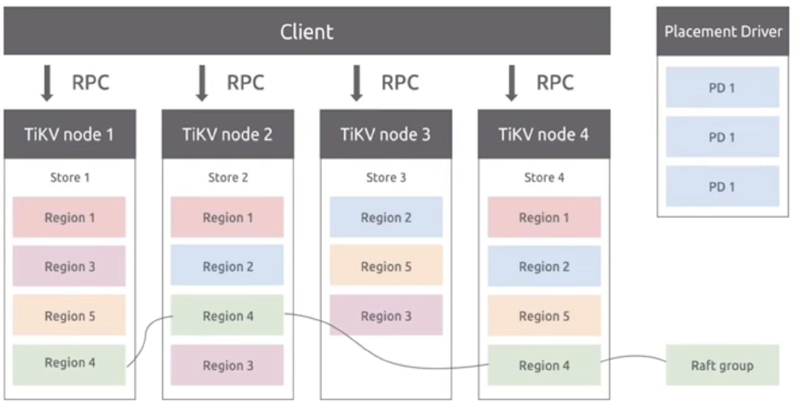


## 多版本控制(MVCC)

TiKV 的 MVCC 实现是通过在 Key 后面添加版本号来实现。

### 分布式事务模型

* 去中心化的两阶段提交
    * 每个 TiKV 节点分配单独区域存放锁信息（CF lock）
    * 通过 PD 全局授时（TSO）
    * ~4M timestamps 每秒
* Google Percolator 事务模型
* TiKV 支持完整事务 KV API
* 默认乐观事务模型
    * 支持悲观事务模型（3.0+版本）
* 默认隔离级别 Snapshot Isolation（SI，和RR接近，没有幻读）
传统的两阶段提交需要一个事务管理器 GTM，其往往会成为整个集群的性能瓶颈，而 TiKV 采取了一个去中心化的两阶段提交。在每个 TiKV 存储节点上，会单独分配一个存储锁信息的地方。TiKV 的锁是基于列簇，锁信息称为 CF Lock。通过该机制将锁信息放在不同的存储节点，而不是像传统的数据库将锁信息放在行上的方式。然后通过 PD 全局授时。

### 协作处理器（Coprocessor）

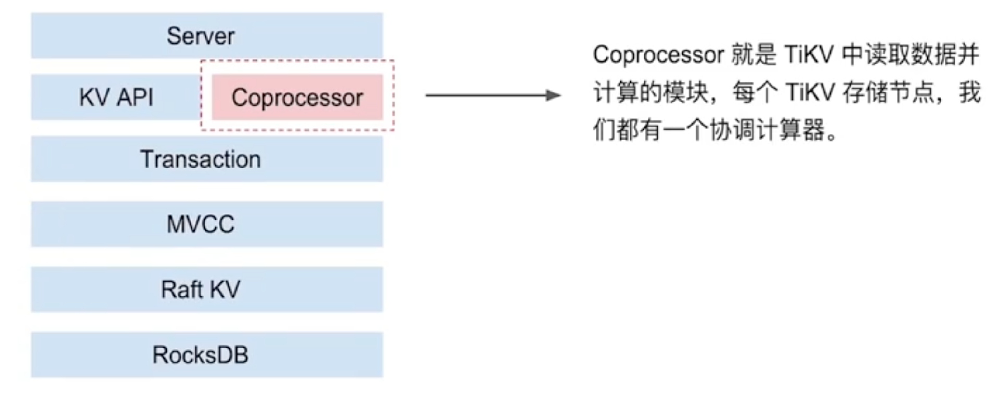


整体结构：


# SQL引擎

## 基于KV实现逻辑表

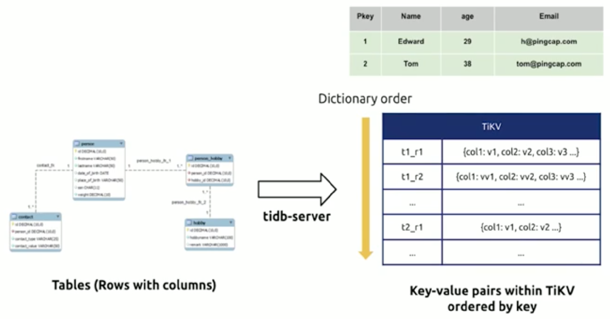


对于已经有的**全局有序**的分布式的 Key-Value 的存储引擎。

* 对于快速获取一个数据，找到具体的Key（主键），能够通过 TiKV 提供的一个 Seek 方法快速定位这一行数据所在的位置，找到 Value（其它列的数据）。
* 对于扫描全表的需求，如果能映射为一个 Key 的范围，可以从 StartKey 扫描到 EndKey，通过该方式获取全表数据。类似 Index 的思路。
TiKV的实现：

TiKV对于每个表分配一个 TableID，每个索引分配一个 IndexID，每行数据分配一个 RowID，如果表示有整数的 Primary Key（主键），可以把 RowID + IndexID 简单看做 Key，Value 看成所有的列按照等位偏移的方式进行 connect 进行连接。数据查询过程中通过等位偏移量进行对 Value 进行反解析，然后再对应与 Schema 的元信息进行列信息映射。

### 基于KV的二级索引设计

TiKV 中，二级索引也是一个全局有序的 Key-Value map，简单理解为 Key 就是索引的列信息，Value 是原表的 Primary key 主键，通过该主键在原表的 Key-Value map 进行再一次扫描找到 Value，然后再按照等位偏移量进行列信息解析。该过程和传统数据库 B-tree 的回表逻辑类似。

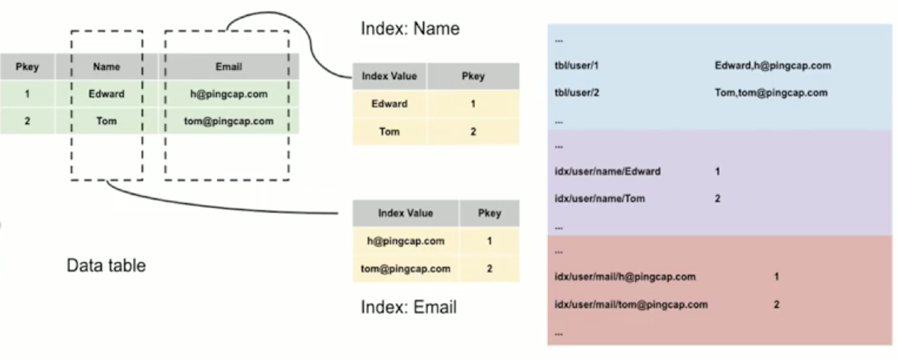


### SQL引擎过程

SQL 引擎层：

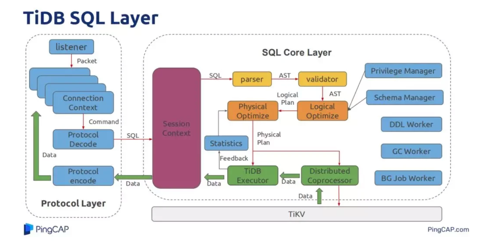


SQL 引擎很重要的模块就是优化器，负责从很多执行计划中找到最优的执行计划。简单理解为车子出行中的交通工具如：数据寻址或者数据计算的各种算子，比如常见的 hash join、Index reader、Table Scan 等。路况：表、索引、列的数据分布统计信息等。

除了优化器，还有如下必须的组成部分，如 SQL 引擎过程：

1. SQL
    1. 词法解析
    2. 语法解析
    3. 语义解析
    4. 权限控制等
2. AST（抽象语法树）
    1. 将 SQL 从文本解析成一个结构化的数据，生成 AST 文件
3. Logical Plan
    1. SQL 逻辑部分将各种 SQL 等价改写以及优化，如将子查询改成表关联、各种不必要的信息裁剪（列裁剪、分区裁剪、left join 裁剪等）
4. Optimized Logical Plan
    1. 物理优化会基于统计信息与成本进行生产执行计划
>SQL优化中最重要、优化空间最大的部分

5. 执行器
    1. 执行引擎与根据优化器定下来的执行路径进行相应的数据的寻址、数据的计算


## 关键算子

### 基于成本优化器

* Power CBO Optimizer
    * Hash join、Sort merge、Index join、Apply（Nested loop）
    * table_reader、table_scan、index_reader、index_scan、index_lookup
    * Steam aggregation、Hash agg
* Cost
    * Cost(p) = N(p)*FN+M(p)*FM+C(p)*FC, N stands for the network cost, M stands for the memory cost and C stands for the CPU cost.
* task ( handle on TiDB or TiKV )
    * corp、root


### 分布式SQL引擎主要优化策略

最大程度让数据在分布式存储层尽快的完成过滤以及计算，即最大下推策略（Push Down）。

用户表在不同存储节点的分片进行预计算，完成本地的数据过滤以及统计，然后再将本地存储节点的临时结果、中间结果上报到 Server 层进行再一次 SUM 返回最终结果，利用了分布式多节点的计算能力。而不是上传到 Server 端进行统一的过滤及计算，没有利用 TiKV 的并行能力。

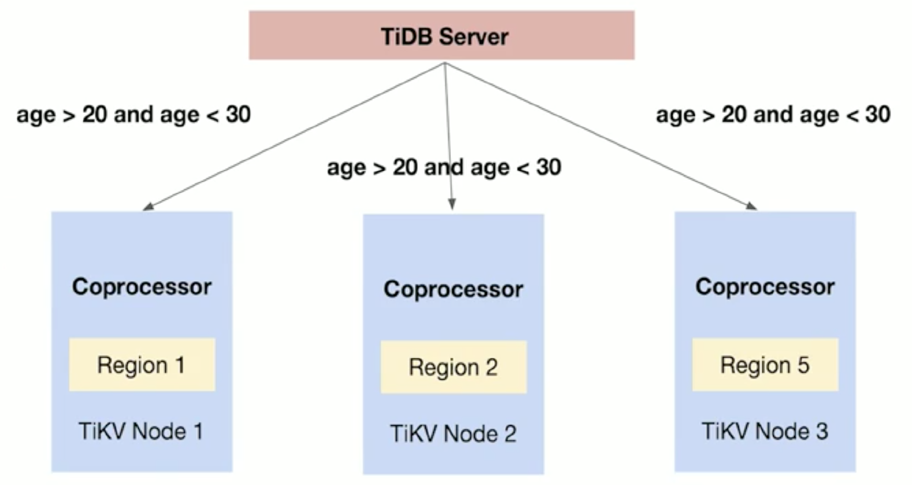


### 关键算子分布式化

TiDB-Server 中的 Hash Join 不管是在数据寻址，还是在内层进行分批匹配，都可以通过并行与分批的处理。这也是在大表 Join 的场景，比传统的 MySQL 的 join 的场景要快很多的原因。

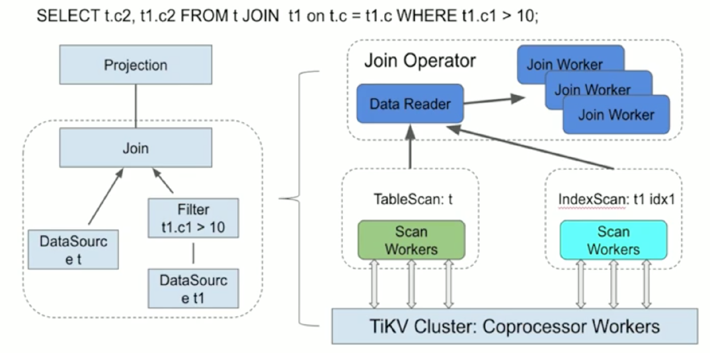


### Online DDL算法

* TiDB 没有分表概念，整个 DDL 完成过程非常快速
    1. Schema（表结构）只存储一份，新增字段时，新增数据按照新的Schema进行存储，老数据只需要在读到（默认值）和变更时，才需要进行新 Schema 的重组。
* 保证多个计算节点的Schema信息一致：根据 Google 的 F1 论文算法，将 Schema 变更异步分成了多个版本，把 DDL 过程分成 Public、Delete-only、Write-only 等几个相邻状态，每个相邻状态在多节点之间互相同步和一致，最终完成完整的 DDL。
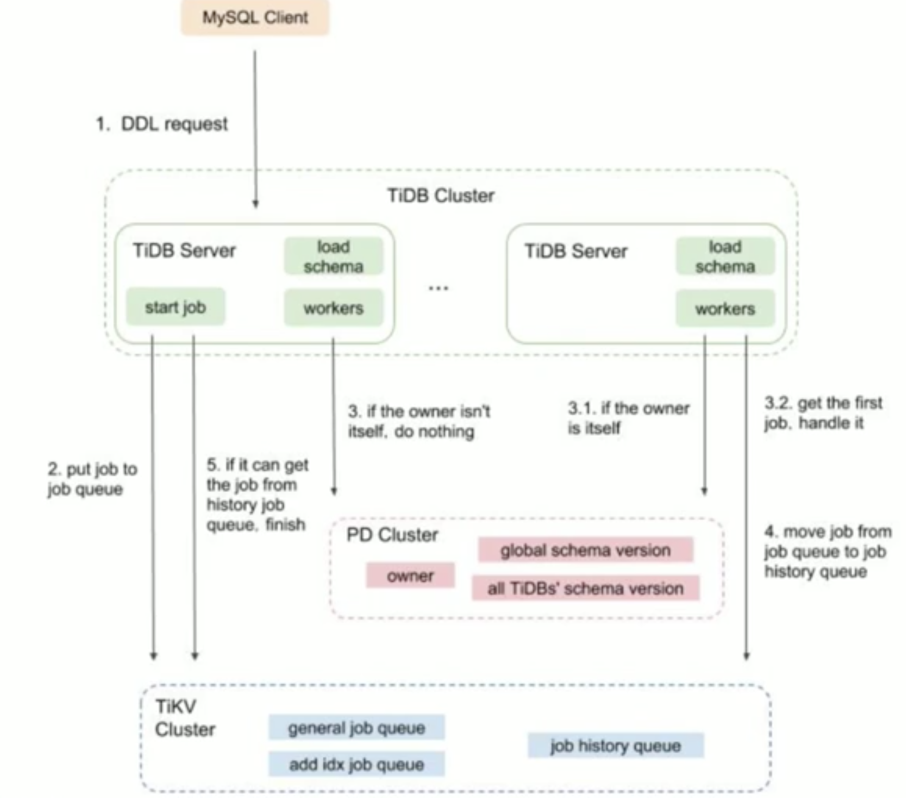


## TiDB-Server

TiDB-Server 是一个对等、无状态的，可横向扩展，支持多点写入，直接承接用户 SQL 入口。

连接到 TiDB-Server：

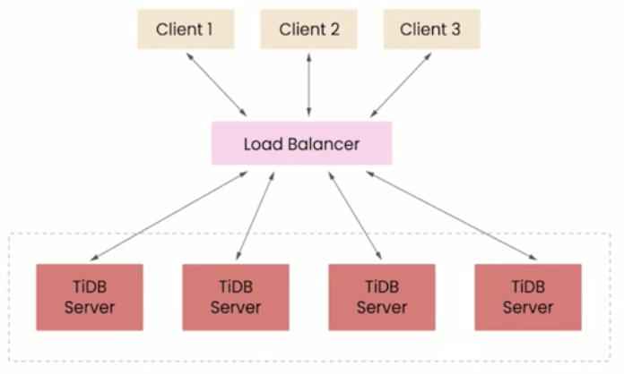


从进程角度看 TiDB-Server

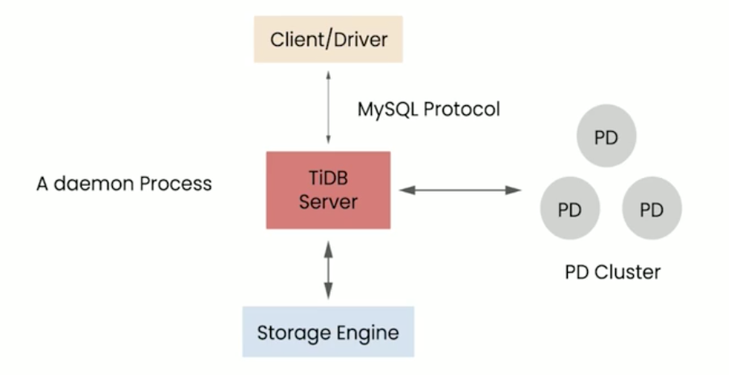


从内部结构看 TiDB-Server

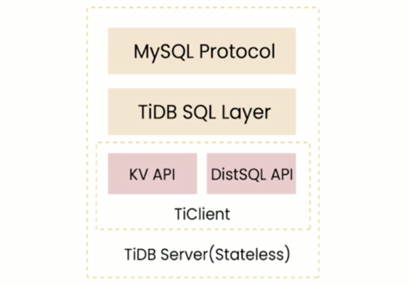


### 其它功能

前台功能：

* 管理链接和账号权限管理
* MySQL 协议编码解码
* 独立的 SQL 执行
* 库表元信息以及系统变量
后台功能：

* 垃圾回收（GC）
* 执行 DDL
* 统计信息管理
* SQL 优化器与执行器
## TiDB与TiKV关系

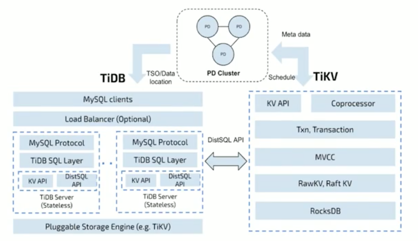


# 分布式HTAP数据库

* TiDB 是一款支撑 HTAP 数据服务的数据库
* 理解 TiDB 在 HTAP 场景下的体系架构与产品迭代
* 了解 HTAP 应用场景
## HATP 发展的必然性

HTAP 数据库需要同时支持 OLTP 和 OLAP 场景。基于创建的计算存储框架，在同一份数据上保证了事物的同时又支持实时分析，省去了费时的 ETL 过程。

在线分析事务（OLAP）相关技术：并行计算、物化视图、列存、Partition、Bitmap、索引等。

数据技术驱动的两个关键性因素：

* 数据容量
* 业务创建导致的场景多样性
在数据容量爆发性的前提下，OLTP 与 OLTP 技术开始分道扬镳，OLTP 业务更加追求吞吐的高并发、低延迟（小汽车：灵活、快速），OLAP 业务更加关注整个数据的吞吐量（大轮船：装载量和吞吐量）。因此形成了狭义的数据和大数据两个方向。

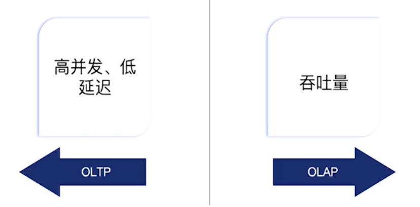


而分布式技术的发展，逐步解决了数据容量爆炸的问题，分布式关系型数据库，同时满足了 OLTP 的需求，也解决了数据容量的问题。在此基础上，很多传统的 OLAP 技术可以在此架构上进行再融合，实现了更大数据容量的混合数据库，也就是 HTAP。同时业务创新的场景多样性，在使用层面开始模糊了 OLTP 和 OLAP 的划分，比如业财一体、后台运营、客服后台、大屏展示、报表系统。从该角度，HTAP 又是一个数据服务的需求，其核心诉求是数据服务的统一。

## TiDB用于数据中台

* 海量存储允许多数据源汇聚，数据实时同步
* 支持标准SQL，多表关联快速出结果
* 透明多业务模块、支持分表聚合后可以任务维度查询
* TiDB 最大下推机制、以及并行 hash join 等算子，决定 TiDB 在表关联上的优势
这些特性适用于后台运营系统、财务报表、大屏展现、用户画像等数据中台的一些业务。

## 引入spark缓解数据中台算力

TiDB-Server 虽然有上面说到的诸多特性，但其还是主要面向 OLTP 的业务，对于 OLAP 中间结果过大的查询还会造成内存使用过量，甚至 OOM 的问题。为了满足用户的需求，借助社区的力量，引入了大数据技术 Spark 的生态， 让 Spark 识别 TiKV 的数据格式、统计信息、索引、执行器，最终构建了一个能跑在 TiKV 上的 Spark 的计算引擎，并封装为 TiSpark。

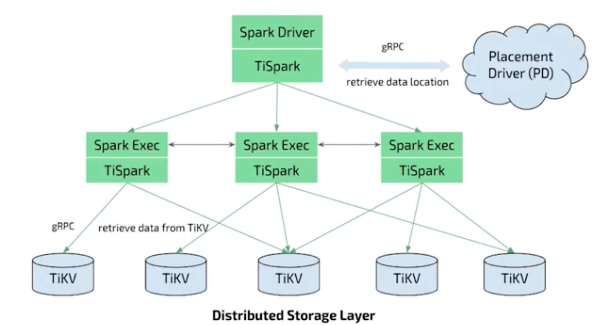
进而实现了一个分布式的技术平台，在面对大批量数据的报表和重量级的 Adhoc 里提供了一个可行的方案。

Spark 只能提供低并发的重量级查询，在应用场景，很多中小规模的轻量 AP 查询，也需要高并发、相对技术低延迟计数能力，该场景下，Spark 的技术模型重，资源消耗高的缺点就会暴露。

## 物理隔离是最好的资源隔离

OLTP 和 OLAP 的资源隔离很难通过软件层面彻底解决好，从数据库资源隔离的角度看，依次是数据库软件层、副本调度、容器、虚拟机、物理机等，越接近物理机的隔离性会越好。

在传统的主从架构下，读写分离其实也是资源隔离的问题。隔离就需要有一个单独的副本进行 AP 的查询。列存天然对 OLAP 查询类友好，所以选择将这个副本放到一个列式存储引擎上。列式存储引擎需要按照列的单位进行存储，每个列是一个独立的对象。这种引擎对批量写入友好，最大的挑战在于对实时跟新不友好。

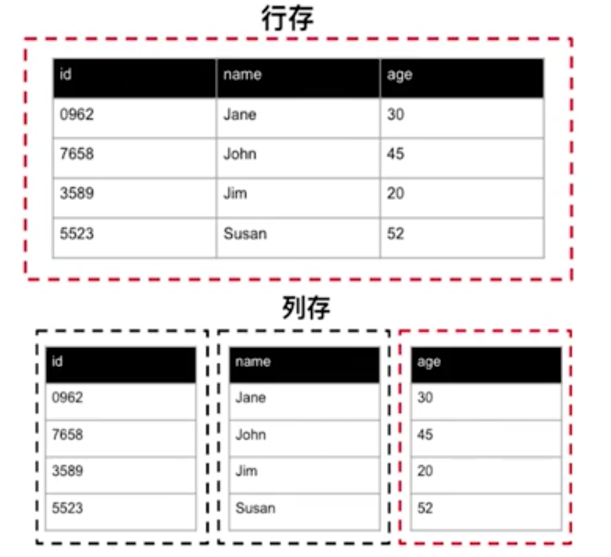


借助列式引擎的思想，引入了 Delta tree 的方法，最终实现了一个支持准实时更新的列式引擎 TiFlash。

TiFlash 以 Raft Learner 方式接入 Multi-Raft 组，使用异步方式传输数据，对 TiKV 产生非常小的负担。当数据同步到 TiFlash 时，会被从行格式拆解为列格式。

>一般可以采用 binlog 方式，为了高效采用 raft 复制。

## 计算统一

构建好一个支持标准 SQL 的 TiDB-Server，将列存的信息暴露给 TiDB-Server，设计成一个新的统计信息规则——CBO cost 模型。让 TiDB-Server 的优化器可以通过新的 cost 模型来自由地选择数据寻址的方式，形成一个既包括了行式的存储和列式存储的统一的执行计划。

比如：

```sql
select avg(s.price) from prod p, sales s where p.pid = s.pid and p.batch_id = 'A1234'
```
该语句典型的有表关联、表过滤、聚合等操作。
TiDB-Server 会根据数据统计期评估，最终只需要计算 sales 表中的 price 列的平均值，没有必要读取其他列的信息，同时因为在 batch_id 列上有二级索引，最优的方式可能是通过二级索引进行数据过滤，过滤完的数据再去 TiSpark 进行寻址，然后并在列存里进行读取和聚合。这样既节省了 IO，又降低了网络传输的带宽。整个 SQL 一部分是通过了行存进行过滤，一部分通过列存进行了预聚合，通过优化器串联在一起。

## MMP引擎

MMP引擎也就是并行计算。MMP架构是将任务并行地分散到多个服务器和节点上，在每个节点上，计算完成后，将各自部分的结果汇聚到一起得到结果。

**如何实现 join 下推**

如果要让一个 join 多个节点并行计算，需要将 join 的两个表的分片在节点的分布尽量一致，不一致需要通过网络将分片临时拷贝为一份临时数据进行 join 和计算，该过程就是 shuffle。MMP 计算模型本质上是通过网络与存储成本来置换计算资源。

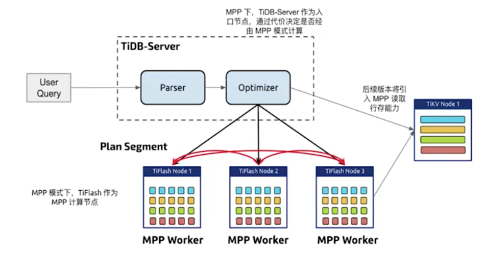


如果启动 MMP 计算，首先在各个 TiFlash 节点将多表关联的结果进行数据分布一致，即上图中 TiFlash 上的红色箭头。接下来每个 TiFlash 节点上面的 MPP Worker 负责将表 Join 在多个节点的并行进行计算，最终将每个节点的临时结果返回到 TiDB-Server 进行再计算。

## HTAP下一步探索

* 分布式数据库在大数据规模下提供 HTAP 的基础
* TiDB-Server 最大程度下推算法与 Hash Join 关键算子提供基础 AP 能力
* 借助生态，让 Spark 运行在 TiKV 之上
* 行列混合引擎，列式引擎提供实时写入能力
* 行列引擎采取 Raft-Base replication，解决数据同步效率
* TiDB-Server 统一技术服务
* MPP 解决技术节点的扩展性与并行计算
TiDB HTAP 的发展路径中既有产品内嵌功能，又有生态的数据连同，这是两套工程化的思路。

HTAP 会逐步转化为是**数据服务统一**的代名词：

* 产品内嵌功能的迭代，由一些具体产品完成 HTAP
* 整合多个技术栈与产品，并进行数据的连通，形成服务的 HTAP
过去一段时间，OLAP的场景基本基于数仓，流计算的发展将数仓分了几个阶段，最早的批处理，即 ETL 的离线数仓；批、流结合的 Lambda 架构；流计算为主的 Kappa 架构。在此基础上又可以和 OLTP 技术进行融合，如分区、列式存储、并行计算等。

流计算在复杂计算中的天然限制可以在分布式 HTAP 中得到解决。流计算的实时计算能力为不同的数据技术栈，以产品提供了丰富多样的数据连同能力。流计算加基于分布式关系数据的 HTAP 产品，将形成更有爆发力的 HTAP 的数据服务。

# TiDB关键技术创新

## 分层的分布式架构

三个分布式系统：

* 分布式的 KV 存储系统
* 分布式的 SQL 计算系统
* 分布式的 HTAP 架构系统
## 自动分片与调度

自动分片技术时更细维度弹性的基础：

* 全局有序的 KV map
* 按照等长大小策略自动分片（96M）
* 每个分片是连续的 KV，通过 Start/End Key 来寻址
* 称分片为 Region，是复制、调度的最小单位
自动merge：

* 96 MB 自增分片
* 20 MB 合并分片
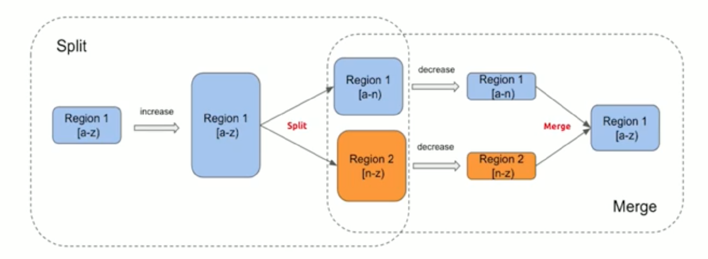


Multi-Raft 将复制组更离散

* Raft、Multi-raft
* leader、follower、learner
* 强主模式、读写在 leader 上
* 4.0 版本开启 follower read
Raft 是一个强一致算法，保证了 RPO 为0，业务数据所能容忍的数据丢失量为零，在很多金融级的场景里至关重要。TiKV 设计中，把自动分片也就是 Region 机制与 Raft 进行了结合，形成了以分片为单位的复制组，即 Region base Multi-Raft。一套集群可以同时存在几十万个独立的复制组，这种设计大大提升了整个集群的整体可用性以及多点写入，同时大大优化了 RTO 灾难发生时恢复的时长。

基于 Multi-Raft 实现写入的线性扩展：新增一个物理节点时，意味着整个集群的写入容量会进行线性增长。

## 跨IDC单表多点写入

Region base Multi-Raft 机制，实现了一个表可以同时有多个写入点，TiKV 的调度机制，可以识别单个节点的物理信息，比如 IDC、REC（机柜）、Host（机架）、宿主机等，并进行约束与绑定。

## 去中心化的分布式事务

去中心化的两阶段提交，解决了事务能力的扩展性。

TiDB 5.0 以上版本，针对 OLTP 常见的高并发、小数据量的写入场景，TiDB 事务在第二阶段提交采取了异步处理的方式（Async commit），变相实现了 1PC 的效果，大大优化了分布式事务里 2PC 通用的延迟问题。

其中也有两个大的挑战：

* 如何确定所有 key 已被 prewrite
* 如何确定事务提交的时间戳
解决：

* 将所有事物的行的 key 与事物的 Primary key（状态位）进行索引的 mapping
* 通过统一 PD 来保障全局时间递增
## Local Read and Geo-partition

Geo-partition 指多滴多活跨地域数据分布。

TiDB 5.0 中将中央的授时服务改为了分布式授时服务，能够提高场景的数据性能以及降低延迟。可以在多个 IDC 甚至跨洲际同时提供数据服务，也可以按照本地提供数据安全合规，不出境的方式来访问数据的场景。

总结：

* 多地部署支持，低延时访问
* 数据安全合规，符合数据不出境的场景
* 支持异步多活容灾
* 支持冷热数据分离
## TP和AP融合

更大数据容量下的 TP 和 AP 融合：

* TiDB 引入了实时更新的列式引擎，既解决了资源隔离，又提升了 AP 效率
* 列存上引入 MPP 模型，实现 SQL join 的下推与并行处理
* 通过 Raft-base replication 实现时效性
* 融合大数据生态，比如 TiSpark
## 数据服务统一

TiDB 的 CBO 可以采集行列 Cost 模型进行配置，并同步收集不同引擎的统计信息，统一进行最佳执行路径的选择。

