# 简介

## 对比单体数据库

这里主要针对关系型数据，像 MongoDB 这样的 NoSQL 产品不是这里的重点。

传统的单体数据需要做好 查询、事务、存储、复制和其它 等五个方面，分布式数据库在单体数据库的基础上还需要增加对 分片 的处理。并且难点重点在 查询、事务、复制和分片 这四个方面。

单体数据库：

* 查询
* 事务
* 存储
* 复制
* 其它
分布式数据库：

* 查询
    * 计算下推
    * 多表关联
* 事务
    * 隔离性
    * 原子性
* 分片
    * 分片元数据存储
    * 合并拆分
    * 调度
* 存储
    * 写入效率
    * 读取效率
    * 存储成本
* 复制
    * 主从复制
    * Quorum
* 其它
    * 客户端接入
    * 权限管理
    * 元数据存储
## 定义

### 外部视角

业务应用系统可以按照交易类型分为联机交易（OLTP）场景和联机分析（OLAP）场景两大类。OLTP 是面向交易的处理过程，单笔交易的数据量小，但要在短时间内响应，典型场景包括电商、转账等；而 OLAP 场景通常是基于大数据集的运算，典型场景包括生成年度账单和财务报表等。

从外部视角可以有如下定义：

* OLTP 关系型数据库
写多读少；低延迟；高并发

* 海量并发
* 高可靠
* 海量存储
所以从外部视角最终定义可以是：分布式数据库是服务于写多读少、低延时、海量并发 OLTP 场景的，具备海量数据存储能力和高可靠性的关系型数据库。

### 内部视角

* 客户端组件 + 单体数据库
典型的客户端组件就是 Sharding-JDBC。

* 代理中间件 + 单体数据库
典型的就是中间件产品就是 MyCat。

* 单元化架构 + 单体数据库
单元化架构对业务应用系统需要彻底重构，应用系统被拆分成若干实例，配置独立的单体数据库，让每个实例管理一定范围的数据。当出现跨实例事务时通过分布式事务组件保证，不同的分布式事务模型，应用系统都需要配合改造。该方案改造量最大，实施难度最高。

总结：

传统的单体数据库仍然能够被应用系统感知到。而分布式数据库对外单体数据库是透明的，将技术细节收敛到产品内部，以一个整体面对业务应用。

# 一致性

分布式数据库的一致性，一般是指数据一致性和事务一致性两个方面。

## 数据一致性

数据一致性可分为：

* 状态一致性（State Consistency）
数据所处的客观、实际状态所体现的一致性。

* 操作一致性（Operation Consistency）
外部用户通过协议约定的操作，能够读取到的数据一致性。

### 状态一致性

#### 强一致性

如 MySQL 全同步复制。

问题：

* 性能差：主库必须等多个从库均返回成功后，才向客户端返回成功。主库的响应时间取决于多个从库中延时最长的那个。
* 可用性问题：全同步复制模式下，多个节点被串联，如果单机可用性 99%，那么集群可用性为 99%*99%*99%，比单机更低。
#### 弱一致性

如 NoSQL 最终一致性。也就是 BASE 理论中的 E 代表的最终一致性（Eventually Consistency）。

最终一致性可以理解为：主副本执行写操作成功后直接响应客户端，不要求其他副本与主副本实时保持一致，经过一段时间，其它副本会逐渐追赶上主副本。

### 操作一致性

### 读写一致性

写后读一致性（Read after Write Consistency），它也称为 读写一致性 或 读自己写一致性（Read My Writes Consistency）。表示自己写入的数据，下一刻一定能够读取。

#### 单调读一致性

之前能读到，刷新了之后依然能够读到。避免出现上一刻读副本A，下一刻读副本B，导致前后数据不一致。避免这种问题就需要实现 单调读一致性。

#### 前缀一致性

保持因果关系的一致性，被称为前缀读或前缀一致性（Consistent Prefix）。举例出现时间上的扭曲：评论A在评论B之前，避免出现时间上的乱序。

#### 线性一致性

分布式数据库无法要求应用系统每次变更操作都附带显式声明，如变更是因为读取哪些数据导致。更可靠的方式是将自然语义的因果关系转变为事件发生的先后顺序。

线性一致性（Linearizability）就是建立在事件的先后顺序之上。整个系统的所有操作被记录在一条时间线下且被原子化，表现得就像只有一个副本。

因为各个节点都是各自的时间线，所以做到全局线性一致性需要一个**全局时钟**。主流数据大多以实现线性一致性为目标，在设计之初就引入了全局时钟（如 Spanner、TiDB、OceanBase、GoldenDB 和巨杉），多数采用单点授时（TSO）。

对于线性一致性，当然也有一些争议，反对者认为没有绝对时间，时间都是相对的，自然不存在全序的事件顺序，不同的观察者对于事件的发生顺序无法达成一致（相对论）。

#### 因果一致性

线性一致性存在争议，那可以不依赖绝对时间。

因果一致性的基础是偏序关系，即部分事件顺序可以比较。如一个节点内的事件可以排序，仅依靠节点的本地时钟，如果节点发生通讯，则按照接收方事件晚于调用方事件来处理。

基于这种偏序关系，Leslie Lamport 在论文“Time, Clocks, and the Ordering of Events in a Distributed System”中提出了**逻辑时钟**的概念。

借助逻辑时钟也可以建立全序关系，只不过这个全序关系不够精确，如两个事件没有相关性，逻辑时钟给出的大小就没有意义。

因果一致性弱于线性一致性，但在并发性能上具有优势，也足以处理多数的异常现象，所以因果一致性也在工业界得到了应用。CockroachDB 和 YugabyteDB 都在设计中采用了逻辑混合时钟（Hybrid Logical Clocks）。

## 事务一致性

（事务一致性在 MySQL 章节已详细介绍，这里简单介绍）

事务的 ACID 四大特性，将广义上的事务一致性具化到了：

* 原子性：事务中的所有变更要么全部发生，要么一个也不发生。
* 一致性：事务要保持数据的完整性。
* 隔离性：多事务并行执行所得到的结果，与串行执行（一个接一个）完全相同。
* 持久性：一旦事务提交，它对数据的改变将被永久保留，不应受到任何系统故障的影响。
### 隔离性

隔离级别：

* 未提交读（RU）
* 以提交读（RC）
* 可重复读（RR）
* 可串行化（Serializable）
隔离性是事务的核心。降低隔离级别就是在正确性上做妥协，将一些异常现象交给业务去处理，从而获得更好的性能。除 串行化 以外的隔离级别，都有无法处理的异常现象。

# 原子性

## 事务原子性

原子性要求事务只有两种状态：

* 成功，所有操作全部成功；
* 失败，任何操作都没有被执行，即使过程中执行了部分操作，也要保证回滚这些操作。
原子性提交协议有不少，按照其作用范围可以分为面向应用层和面向资源层。下面介绍两种协议：

* 面向应用层的 TCC
* 数据库领域常用的 2PC
## TCC

TCC 是 Try、Confirm 和 Cancel 三个单词的缩写，是事务过程中的三个操作。

## 2PC

两阶段提交协议（Two-Phase Commit，2PC），这也是面向资源层的典型协议。

2PC 的首次正式提出是在 Jim Gray 1977 年发表的一份文稿中，文稿的题目是“[Notes on Data Base Operating Systems](https://cs.nyu.edu/courses/fall18/CSCI-GA.3033-002/papers/Gray1978.pdf)”，对当时数据库系统研究成果和实践进行了总结，而 2PC 在工程中的应用还要再早上几年。

2PC 的处理过程也分为准备和提交两个阶段，每个阶段都由事务管理器与资源管理器共同完成。其中，事务管理器作为事务的协调者只有一个，而资源管理器作为参与者执行具体操作允许有多个。

### 问题

相比于 TCC，2PC 的优点是借助了数据库的提交和回滚操作，不侵入业务逻辑。但是，它也存在一些明显的问题：

* 同步阻塞
执行过程中，数据库要锁定对应的数据行。如果其他事务刚好也要操作这些数据行，那就只能等待。其实同步阻塞只是设计方式，真正的问题在于这种设计会导致分布式事务出现高延迟和性能的显著下降。

* 单点故障
事务管理器非常重要，一旦发生故障，数据库会一直阻塞下去。尤其是在第二阶段发生故障的话，所有数据库还都处于锁定事务资源的状态中，从而无法继续完成事务操作。

* 数据不一致
在第二阶段，当事务管理器向参与者发送 Commit 请求之后，发生了局部网络异常，导致只有部分数据库接收到请求，但是其他数据库未接到请求所以无法提交事务，整个系统就会出现数据不一致性的现象。比如转账余额已经能够扣减，但另一方余额没有增加，就不符合原子性的要求。

## 两个2PC改进模型

### NewSQL阵营：Percolator

Percolator 来自 Google 的论文“[Large-scale Incremental Processing Using Distributed Transactions and Notifications](https://www.cs.princeton.edu/courses/archive/fall10/cos597B/papers/percolator-osdi10.pdf)”，因为它是基于分布式存储系统 BigTable 建立的模型，所以可以和 NewSQL 无缝链接。

Percolator 模型同时涉及了隔离性和原子性的处理，本节仅介绍原子性的部分。

改进：

* 数据不一致
2PC 的一致性问题主要缘自第二阶段，不能确保事务管理器与多个参与者的通讯始终正常。但在 Percolator 的第二阶段，事务管理器只需要与一个分片通讯，这个 Commit 操作本身就是原子的。所以，事务的状态自然也是原子的，一致性问题被完美解决了。

* 单点故障
Percolator 通过日志和异步线程的方式弱化了该问题。

    * Percolator 引入的异步线程可以在事务管理器宕机后，回滚各个分片上的事务，提供了善后手段，不会让分片上被占用的资源无法释放。
    * 事务管理器可以用记录日志的方式使自身无状态化，日志通过共识算法同时保存在系统的多个节点上。事务管理器宕机后，可以在其他节点启动新的事务管理器，基于日志恢复事务操作。
### Proxy阵营：GoldenDB一阶段提交

GoldenDB 展现了另外一种改良思路，称之为“一阶段提交”。GoldenDB 遵循 Proxy 架构，包含了四种角色：协调节点、数据节点、全局事务器和管理节点，其中协调节点和数据节点均有多个。GoldenDB 的数据节点由 MySQL 担任，后者是独立的单体数据库。


虽然叫做“一阶段提交”，但流程仍可以分为两个阶段：

第一阶段，GoldenDB 的协调节点接到事务后，在全局事务管理器（GTM）的全局事务列表中将事务标记成活跃的状态。这个标记过程是 GoldenDB 的主要改进点，实质是通过全局事务列表来申请资源，规避可能存在的事务竞争。

>好处是避免了与所有参与者的通讯，也减少了很多无效的资源锁定动作。

第二阶段，协调节点把一个全局事务分拆成若干子事务，分配给对应的 MySQL 去执行。如果所有操作成功，协调者节点会将全局事务列表中的事务标记为结束，整个事务处理完成。如果失败，子事务在单机上自动回滚，而后反馈给协调者节点，后者向所有数据节点下发回滚指令。

本质上是改变了资源的申请方式，更准确的说法是，并发控制手段从锁调度变为时间戳排序（Timestamp Ordering）。在正常情况下协调节点与数据节点只通讯一次，降低了网络不确定性的影响，数据库的整体性能有明显提升。因为第一阶段不涉及数据节点的操作，也就弱化了数据一致性和单点故障的问题。

## 事务延迟

优化方法如下

### 缓存写提交

第一个办法是将所有写操作缓存起来，直到 commit 语句时一起执行，这种方式称为 Buffering Writes until Commit，这里称为“缓存写提交”。

### 管道

Pipe 既能缩短延迟，又能保持交互事务。CockroachDB 就是采用这种方式，具体过程就是在准备阶段是按照顺序将 SQL 转换为 K/V 操作并执行，但是并不等待返回结果，直接执行下一个 K/V 操作。

### 并行提交

（Parallel Commits）

在执行意向写的同时，写入事务标志，这时不能确定事务是否提交成功，要引入一个新的状态“Staging”，表示事务正在进行。

客户端得到所有意向写的成功反馈后，可以直接返回调用方事务提交成功。注意：这个地方是关键，客户端只在当前进程内判断事务提交成功后，不维护事务状态，而直接返回调用方；事后由异步线程根据事务表中的线索，再次确认事务的状态，并落盘维护状态记录。这样事务操作中就减少了一轮共识算法开销。

# 隔离性

多版本并发控制（Multi-Version Concurrency Control，MVCC）就是通过记录数据项历史版本的方式，来提升系统应对多事务访问的并发处理能力。

## 单体数据库的MVCC

### MVCC存储方式

MVCC 有三类存储方式，一类是将历史版本直接存在数据表中的，称为 Append-Only，典型代表是 PostgreSQL。另外两类都是在独立的表空间存储历史版本，它们区别在于存储的方式是全量还是增量。增量存储就是只存储与版本间变更的部分，这种方式称为 Delta，也就是数学中常作为增量符号的那个 Delta，典型代表是 MySQL 和 Oracle。全量存储则是将每个版本的数据全部存储下来，这种方式称为 Time-Travle，典型代表是 HANA。

#### Append-Only方式

优点：

* 在事务包含大量更新操作时也能保持较高效率。因为更新操作被转换为 Delete + Insert，数据并未被迁移，只是有当前版本被标记为历史版本，磁盘操作的开销较小。
* 可以追溯更多的历史版本，不必担心回滚段被用完。
* 因为执行更新操作时，历史版本仍然留在数据表中，所以如果出现问题，事务能够快速完成回滚操作。
缺点：

* 新老数据放在一起，会增加磁盘寻址的开销，随着历史版本增多，会导致查询速度变慢。
#### Delta方式

优点：

* 因为历史版本独立存储，所以不会影响当前读的执行效率。
* 因为存储的只是变化的增量部分，所以占用存储空间较小。
缺点：

* 历史版本存储在回滚段中，而回滚段由所有事务共享，并且还是循环使用的。如果一个事务执行持续的时间较长，历史版本可能会被其他数据覆盖，无法查询。
* 这个模式下读取的历史版本，实际上是基于当前版本和多个增量版本计算追溯回来的，那么计算开销自然就比较大。
Oracle 早期版本中经常会出现的 ORA-01555 “快照过旧”（Snapshot Too Old），就是回滚段中的历史版本被覆盖造成的。一般设置更大的回滚段和缩短事务执行时间可以解决这个问题。随着 Oracle 后续版本采用自动管理回滚段的设计该问题也得到缓解。

#### Time-Travel方式

优点：

* 将历史版本独立存储，不会影响当前读的执行效率。
* 相对 Delta 方式，历史版本是全量独立存储的，直接访问即可，计算开销小。
缺点：

* 相对 Delta 方式，需要占用更大的存储空间。
## MVCC工作过程

最低可接受的隔离级别就是“已提交读”（Read Committed，RC）。RC隔离级别下 MVCC 的工作过程：

1. 当前事务的更新所产生的数据。
2. 当前事务启动前，已经提交事务更新的数据。
### 快照工作原理

快照是基于 MVCC 实现的一个重要功能，用“快照”来实现 RR 是很方便的。

RC 与 RR 的区别在于 RC 下每个 SQL 语句会有一个自己的快照，所以看到的数据库是不同的，而 RR 下，所有 SQL 语句使用同一个快照，所以会看到同样的数据库。

为了提升效率，快照不是单纯的事务 ID 列表，它会统计最小活动事务 ID 和最大已提交事务 ID。因此多数事务 ID 通过比较边界值就能被快速排除掉，如果事务 ID 恰好在边界范围内，再进一步查找是否与活跃事务 ID 匹配。

快照在 MySQL 中称为 ReadView，在 PostgreSQL 中称为 SnapshotData，组织方式都是类似的。

### Proxy读写冲突处理

Proxy 架构实现 RR 时遇到的两个挑战，也就是实现快照的两个挑战：

* 如何保证产生单调递增事务 ID。每个数据节点自行处理显然不行，这就需要由一个集中点来统一生成。
* 如何提供全局快照。每个事务要把自己的状态发送给一个集中点，由它维护一个全局事务列表，并向所有事务提供快照。
Proxy 架构的分布式数据库都有一个集中点，通常称为全局事务管理器（GTM）。又因为事务 ID 是单调递增的，用来衡量事务发生的先后顺序，和时间戳作用相近，所以全局事务管理器也被称为“全局时钟”。

### NewSQL读写冲突处理

没有普遍采用快照解决读写冲突问题，其中 TiDB 是由于权衡全局事务列表的代价，CockroachDB 则是因为要实现更高的隔离级别。无论哪种原因都造成了读写并行能力的下降。

## 隐式读写冲突

### 不确定时间窗口

当两个时间窗口时重叠时，无法判断时间先后关系。只有通过避免时间窗口出现重叠来解决，而避免重叠只能是等待（waiting out the uncertainty”，用等待来消除不确定性）。

### 写等待：Spanner

Spanner 选择了写等待方式，更准确地说是用提交等待（commit-wait）来消除不确定性。

Spanner 是直接将时间误差暴露出来的，所以调用当前时间函数 TT.now() 时，会获得的是一个区间对象 TTinterval。它的两个边界值 earliest 和 latest 分别代表了最早可能时间和最晚可能时间，而绝对时间就在这两者之间。另外，Spanner 还提供了 TT.before() 和 TT.after() 作为辅助函数，其中 TT.after() 用于判断当前时间是否晚于指定时间。

### 理论等待时间

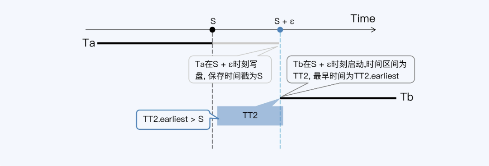


写等待的处理方式是：

事务 Ta 在获得“提交时间戳”S 后，再等待ɛ时间后才写盘并提交事务。真正的提交时间是晚于“提交时间戳”的，中间这段时间就是等待。这样 Tb 事务启动后，能够得到的最早时间 TT2.earliet 肯定不会早于 S 时刻，所以 Tb 就一定能够读取到 Ta。这样就符合线性一致性的要求了。

事务获得“提交时间戳”后必须等待ɛ时间才能写入磁盘，即 commit-wait。

### 实际等待时间

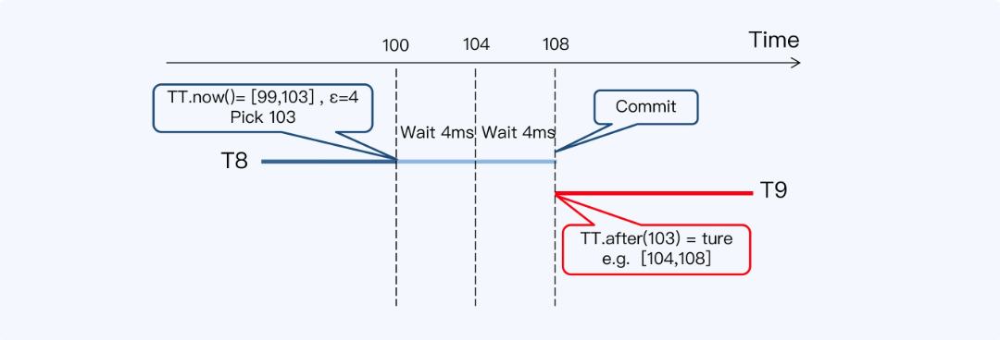


针对同一个数据项，事务 T8 和 T9 分别对进行写入和读取操作。T8 在绝对时间 100ms 的时候，调用 TT.now() 函数，得到一个时间区间[99,103]，选择最大值 103 作为提交时间戳，而后等待 8 毫秒（即 2ɛ）后提交。

无论如何 T9 事务启动时间都晚于 T8 的“提交时间戳”，也就能读取到 T8 的更新。

回顾一下这个过程，第一个时间差是 2PC 带来的，如果换成其他事务模型也许可以避免，而第二个时间差是真正的 commit-wait，来自时间的不确定性，是不能避免的。

TrueTime 的平均误差是 4 毫秒，commit-wait 需要等待两个周期，那 Spanner 读写事务的平均延迟必然大于等于 8 毫秒。为啥有人会说 Spanner 的 TPS 是 125 呢？原因就是这个。其实，这只是事务操作数据出现重叠时的吞吐量，而无关的读写事务是可以并行处理的。

对数据库来说 8 毫秒的延迟虽然不能说短，但对多数场景来说还是能接受的。可是，TrueTime 是 Google 的独门招式，其他分布式数据库的时间误差远大于 8 毫秒，难道也用 commit-wait 可不太行，所以要用到第二种方式：读等待。

### 读等待：CockroachDB

读等待的代表产品是 CockroachDB。

CockroachDB 采用混合逻辑时钟（HLC），对于没有直接关联的事务，只能用物理时钟比较先后关系。CockroachDB 各节点的物理时钟使用 NTP 机制同步，误差在几十至几百毫秒之间，用户可以基于网络情况通过参数”maximum clock offset”设置这个误差，默认配置是 250 毫秒。

写等待模式下，所有包含写操作的事务都受到影响，要延后提交；而读等待只在特殊条件下才被触发，影响的范围要小得多。

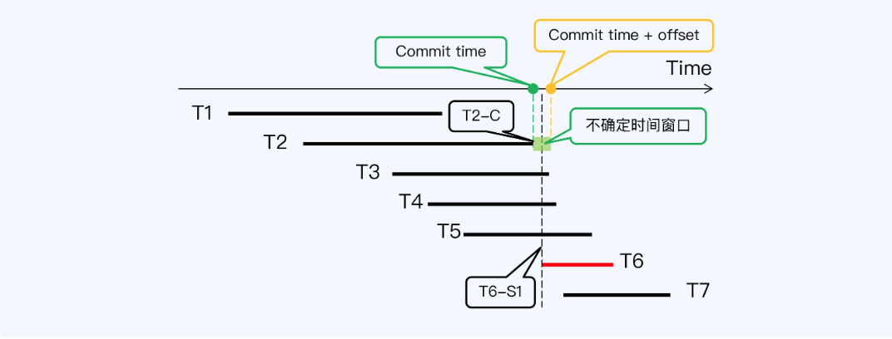


这时，CockroachDB 的办法是重启（Restart）读操作的事务，就是让 T6 获得一个更晚的时间戳 T6-S2，使得 T6-S2 与 T2-C 的间隔大于 offset，那么就能读取 T2 的写入了。

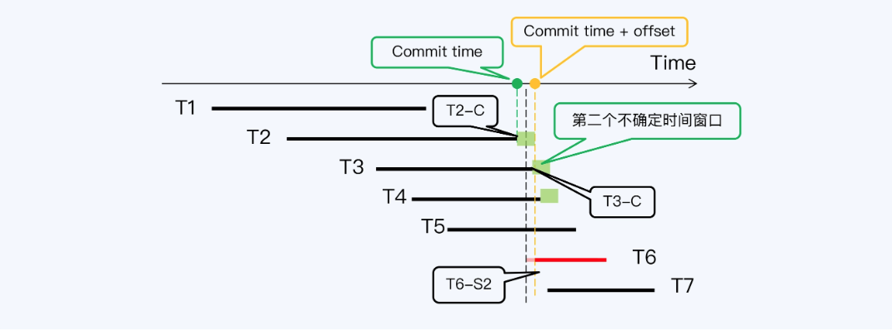


不过，接下来又出现更复杂的情况， T6-S2 与 T3 的提交时间戳 T3-C 间隔太近，又落入了 T3 的不确定时间窗口，所以 T6 事务还需要再次重启。而 T3 之后，T6 还要重启越过 T4 的不确定时间窗口。

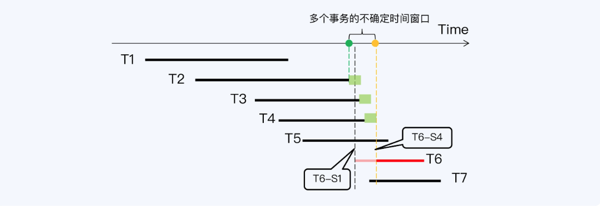


最后，当 T6 拿到时间戳 T6-S4 后，终于跳过了所有不确定时间窗口，读等待过程到此结束，T6 可以正式开始它的工作了。

在这个过程中，可以看到读等待的两个特点：一是偶发，只有当读操作与已提交事务间隔小于设置的时间误差时才会发生；二是等待时间的更长，因为事务在重启后可能落入下一个不确定时间窗口，所以也许需要经过多次重启。

## 并发控制技术

并发控制技术的分类：

* 乐观协议
* 悲观协议
悲观协议是使用锁的，而乐观协议是不使用锁的。

### 乐观锁：TiDB

TiDB 的乐观锁基本上就是 Percolator 模型，运行过程分为三个阶段：

1. 选择Primary Row
收集所有参与修改的行，从中随机选择一行，作为这个事务的 Primary Row，这一行是拥有锁的，称为 Primary Lock，而且这个锁会负责标记整个事务的完成状态。所有其他修改行也有锁，称为 Secondary Lock，都会保留指向 Primary Row 的指针。

2. 写入阶段
按照两阶段提交的顺序，执行第一阶段。每个修改行都会执行上锁并执行“prewrite”，prewrite 就是将数据写入私有版本，其他事务不可见。注意这时候每个修改行都可能碰到锁冲突的情况，如果冲突就终止事务，返回给 TiDB，整个事务也就终止。如果所有修改行都顺利上锁，完成 prewrite，第一阶段结束。

3. 提交阶段
这是两阶段提交的第二阶段，提交 Primary Row，也就是写入新版本的提交记录并清除 Primary Lock，如果顺利完成，那么这个事务整体也就完成了，反之就是失败。而 Secondary Rows 上的锁，则会交给异步线程根据 Primary Lock 的状态去清理。

### 并发控制阶段

1. 读阶段
每个事务对数据项的局部拷贝进行更新。

注意此时的更新结果对于其他事务不可见。这个阶段的命名容易让人误解，明明做了写操作，却叫做“读阶段”。大意为后面要写入的内容，先要暂时加载到一个仅自己可见的临时空间内。

2. 有效性确认阶段
验证准备提交的事务。检查这些更新是否可以保证数据库的一致性，如果检查通过进入下一个阶段，否则取消事务。

首先这里提到的检查与隔离性目标有直接联系；其次就是检查可以有不同的手段，也就是不同的并发控制技术，比如可以是基于锁的检查，也可以是基于时间戳排序。

3. 写阶段
将读阶段的更新结果写入到数据库中，接受事务的提交结果。

还有一种关于乐观与悲观的表述，也与三阶段的顺序相呼应。**乐观重在事后检测**，在事务提交时检查是否满足隔离级别，如果满足则提交，否则回滚并自动重新执行。**悲观重在事前预防**，在事务执行时检查是否满足隔离级别，如果满足则继续执行，否则等待或回滚。

回到 TiDB 的乐观锁。虽然对于每一个修改行来说，TiDB 都做了有效性验证，而且顺序是 VRW，可以说是悲观的，但这只是局部的有效性验证；从整体看，TiDB 没有做全局有效性验证，不符合 VRW 顺序，所以还是相对乐观的。

### 狭义乐观并发控制（OCC）

“[Transactional Information Systems : Theory, Algorithms, and the Practice of Concurrency Control and Recovery](http://www.gbv.de/dms/weimar/toc/647210940_toc.pdf)”给出了一个专用于 RVW 的三阶段定义，专门描述乐观协议的。其中主要差别在“有效性确认阶段”，是针对可串行化的检查，检查采用基于时间戳的特定算法。

这个定义是一个更加具体的乐观协议，严格符合 RVW 顺序，所以我把它称为狭义上的乐观并发控制（Optimistic Concurrency Control），也称为基于有效性确认的并发控制（Validation-Based Concurrency Control）。很多学术论文中的 OCC 就是指这个。在工业界真正生产级的分布式数据库还很少使用狭义 OCC 进行并发控制，唯一的例外就是 FoundationDB。与之相对应的，则是 TiDB 这种广义上的乐观并发控制，说它乐观是因为它没有严格遵循 VRW 顺序。

### 乐观协议的挑战

主要两方面：

* 事务冲突少是使用乐观协议的前提，但这个前提是否普遍成立？
* 现有应用系统使用的单体数据库多是悲观协议，兼容性上的挑战。
#### 事务频繁冲突

金融业务频繁冲突，很可能一直在重试、回滚，永远无法执行完成，而使用悲观锁就很容易解决。

#### 兼容性要求

保证对遗留应用系统的兼容性。单体数据库都是悲观协议，甚至多数都是基于锁的悲观协议，所以在 SQL 运行效果上与乐观协议有直接的区别。一个非常典型的例子就是 select for update。这是一个显式的加锁操作，或者说是显式的方式进行有效性确认，广义的乐观协议都不提供严格的 RVW，所以也就无法支持这个操作。

### 乐观锁的改变

基于上面这些挑战，TiDB 的并发控制机制也做出了改变，增加了“悲观锁”并作为默认选项。TiDB 悲观锁的理论基础很简单，就是在原有的局部有效性确认前，增加一轮全局有效性确认。这样就是严格的 VRW，自然就是标准的悲观协议了。具体采用的方式就是增加了悲观锁，这个锁是实际存在的，表现为一个占位符，随着 SQL 的执行即时向存储系统（TiKV）发出，这样事务就可以在第一时间发现是否有其他事务与自己冲突。

悲观锁还触发了一个变化。TiDB 原有的事务模型并不是一个交互事务，它会把所有的写 SQL 都攒在一起，在 commit 阶段一起提交，所以有很大的并行度，锁的时间较短，死锁的概率也就较低。因为增加了悲观锁的加锁动作，变回了一个可交互事务，TiDB 还要增加一个死锁检测机制。

## 悲观锁

### 分类

悲观协议又分为基于锁和非锁两大类，其中基于锁的协议是数量最多的。

### 两阶段封锁

Two-Phase Locking，2PL。就是事务具备两阶段特点的并发控制协议，两阶段指加锁阶段和释放锁阶段，并且加锁阶段严格区别于紧接着的释放锁阶段。

保守两阶段封锁协议（Conservative 2PL，C2PL），事务在开始时设置它需要的所有锁。

严格两阶段封锁协议（Strict 2PL，S2PL），事务一直持有已经获得的所有写锁，直到事务终止。

强两阶段封锁协议（Strong Strict 2PL，SS2PL），事务一直持有已经获得的所有锁，包括写锁和读锁，直到事务终止。SS2PL 与 S2PL 差别只在于一直持有的锁的类型，所以它们的图形是相同的。

### 串行化图检测（SGT）

SSI 是一种隔离级别的命名，最早来自 PostgreSQL，CockroachDB 沿用了这个名称。它是在 SI 基础上实现的可串行化隔离。作为 SSI 核心的 SGT 也不是 CockroachDB 首创，学术界早就提出了这个理论，真正的工程化实现要晚得多。

#### 理论来源：PostgreSQL

事务之间的边又分为三类情况：

* 写读依赖（WR-Dependencies），第二个操作读取了第一个操作写入的值。
* 写写依赖（WW-Dependencies），第二个操作覆盖了第一个操作写入的值。
* 读写反依赖（RW-Antidependencies），第二个操作覆盖了第一个操作读取的值，可能导致读取值过期。
#### 工程实现：CockroachDB

RW 反向依赖是一个非常特别的存在，而特别之处就在于传统的锁机制无法记录这种情况。因此在论文“[Serializable Snapshot Isolation in PostgreSQL](http://vldb.org/pvldb/vol5/p1850_danrkports_vldb2012.pdf)”中提出，增加一种锁 SIREAD，用来记录快照隔离（SI）上所有执行过的读操作（Read），从而识别 RW 反向依赖。本质上，SIREAD 并不是锁，只是一种标识。但这个方案面临的困境是，读操作涉及到的数据范围实在太大，跟踪标识带来的成本可能比 S2PL 还要高，也就无法达到最初的目标。

针对这个问题，CockroachDB 做了一个关键设计，读时间戳缓存（Read Timestamp Cache），简称 RTC。

基于 RTC 的新方案是这样的，当执行任何的读取操作时，操作的时间戳都会被记录在所访问节点的本地 RTC 中。当任何写操作访问这个节点时，都会以将要访问的 Key 为输入，向 RTC 查询最大的读时间戳（MRT），如果 MRT 大于这个写入操作的时间戳，那继续写入就会形成 RW 依赖。这时就必须终止并重启写入事务，让写入事务拿到一个更大的时间戳重新尝试。

具体来说，RTC 是以 Key 的范围来组织读时间戳的。这样，当读取操作携带了谓词条件，比如 where 子句，对应的操作就是一个范围读取，会覆盖若干个 Key，那么整个 Key 的范围也可以被记录在 RTC 中。这样处理的好处是，可以兼容一种特殊情况。

# 架构演进

单体数据往分布式数据库演进主要有两种方式，一种是通过增加中间件如 MyCat 来分库分表，实际就是在多个单体数据库之前增加代理节点，这里称作 Proxy 吧。另一种是提供一个完整的分布式数据库。

## Proxy

在多个单体数据库之前增加代理节点，本质上是增加 SQL 的路由功能。随着分布式事务和跨节点等功能的加入，代理节点不再仅仅承担路由功能，还会承担分布式事务管理，可以成为协调节点。主要实现以下功能：

* 客户端接入
* 简单的查询处理器
* 进程管理中的访问控制
* 分布式事务管理
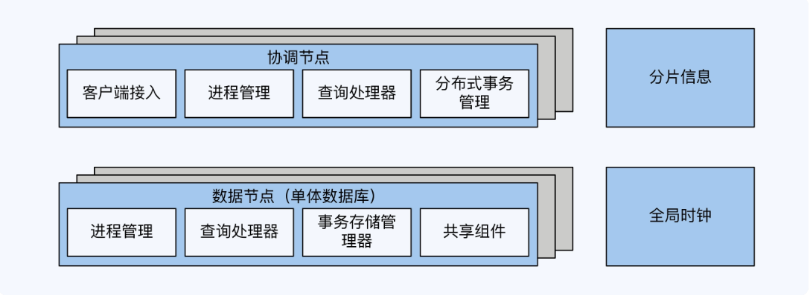


## NewSQL

NewSQL 也叫原生分布式数据，在架构上更加先进，每个层次的设计都是以分布式为目标，是从分布式键值对系统演进而来。在 NoSQL 的基础上增加了数据库事务处理能力。主要的工作负载由计算节点和存储节点承担，另外由管理节点承担全局时钟和分片信息管理功能。存储引擎层使用 LSM-Tree 模型替换 B+ Tree 模型，大幅提升了写入性能。

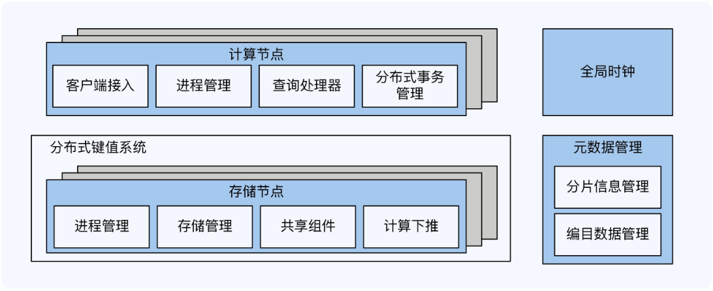


Spanner 是 NewSQL 的开山鼻祖，其它的知名度较高的还有 CockroachDB、TiDB 和 YugabyteDB。

# 全局时钟

分布式数据库的很多设计都和时间有关，更确切地说是和全局时钟有关。比如前面提到的线性一致性，其基础就是全局时钟，还有多版本并发控制（MVCC）、快照、乐观协议与悲观协议，都和时间有关。

## 常见授时方案

授时机制三要素：

* 时间源：单个还是多个
* 时钟类型：物理时钟还是混合逻辑时钟
* 授时点：一个还是多个
排列组合一共 8 种可能性，其中 NTP（Network Time Protocol）误差大，也不能保证递增，基本没有使用其的产品。还有一些方案在实际中不适用（N/A），因此常见方案只有 4 类。

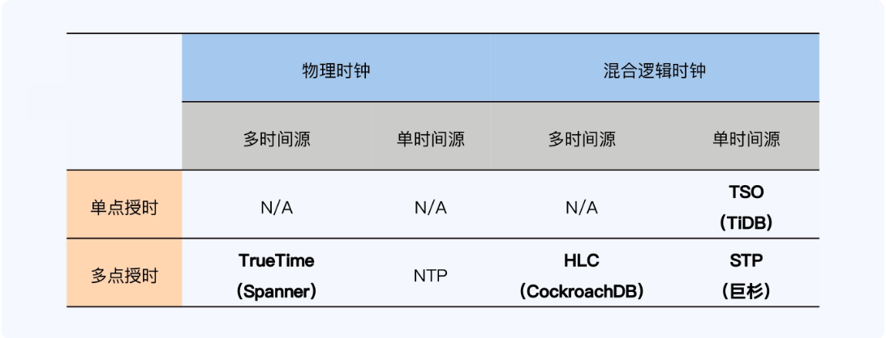


## TrueTime

Spanner 采用的方案是 TrueTime，其时间源是 GPS 和原子钟，属于多时间源和物理时钟，同时它也采用了多点授时机制，就是说集群内有多个时间服务器都可以提供授时服务。Truetime 是 Google 的独门绝技，依赖于特定硬件设备的思路，不适用于开源软件。

TrueTime 会出现时光倒流，不只是 TrueTime，任何物理时钟都会存在时钟偏移甚至回拨。

单个物理时钟会产生误差，多点授时又会带来整体性的误差。

TrueTime 的优势：

* 高可靠高性能，多时间源和多授时点实现了完全的去中心化设计，不存在单点问题
* 支持全球化部署，客户端和时间服务器的距离可控，不会因为二者通讯延迟过长导致时钟失效
## HLC

CockroachDB 和 YugabyteDB 也是以高性能高可靠和全球化部署为目标，因为 TrueTime 的限制，其使用了混合逻辑时钟（Hybrid Logical Clock，HLC）。同样是多时间源、多点授时，但时钟采用了物理时钟与逻辑时钟混合的方式。HLC 在实现机制上较复杂的，且和 TrueTime 同样有整体性的时间误差。

### 实现（CockroachDB）

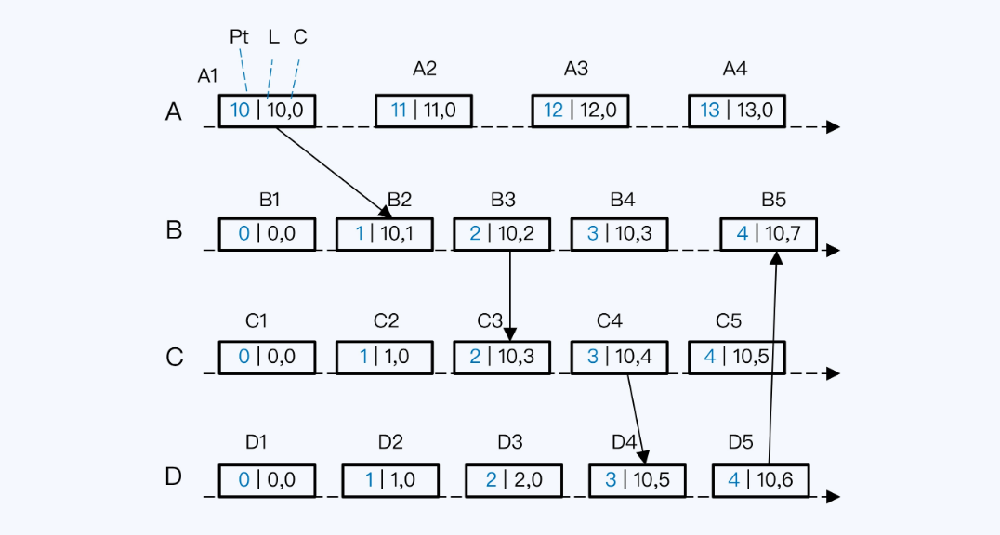


方框是节点上发生的事件，方框内的三个数字依次是节点的本地物理时间（简称本地时间，Pt）、HLC 的高位（简称 L 值）和 HLC 的低位（简称 C 值）。

分析一：

事件 D2 发生时，首先取上一个事件 D1 的 L 值和本地时间比较。L 值等于 0，本地时间已经递增变为 1，取最大值，那么用本地时间作为 D2 的 L 值。高位变更了，低位要归零，所以 D2 的 HLC 就是 (1,0)。

分析二：

如果节点间有调用关系，计时逻辑会更复杂一点。我们看事件 B2，要先判断 B2 的 L 值，就有三个备选：本节点上前一个事件 B1 的 L 值当前本地时间调用事件 A1 的 L 值，A1 的 HLC 是随着函数调用传给 B 节点的。

这三个值分别是 0、1 和 10。按照规则取最大值，所以 B2 的 L 值是 10，也就是 A1 的 L 值，而 C 值就在 A1 的 C 值上加 1，最终 B2 的 HLC 就是 (10,1)。

分析三：

B3 事件发生时，发现当前本地时间比 B2 的 L 值还要小，所以沿用了 B2 的 L 值，而 C 值是在 B2 的 C 值上加一，最终 B3 的 HLC 就是 (10,2)。

## TSO

在 NewSQL 架构中使用单时间源、单点授时的方式往往被称为 TSO（Timestamp Oracle），在 Proxy 架构风格中被称为全局事务管理器（Golobal Transcation Manager，GTM）。也就是一个单点递增的时间戳和全局事务号基本等效。

优点是实现简便，能够保证时钟单调递增，可以简化事务冲突时的设计。缺点是集群不能大范围部署，性能有上限。

TiDB、OceanBase、GoldenDB 和 TBase 等选择使用 TSO。

### 实现（TiDB）

中心化授时。

TiDB 的全局时钟是一个数值，由两部分构成，其中高位是物理时间，也就是操作系统的毫秒时间；低位是逻辑时间，是一个 18 位的数值。从存储空间看，1 毫秒最多可以产生 262,144 个时间戳（2^18），这个数字很大一般来说足够使用。

单点授时首先需要解决单点故障问题。TiDB 中提供授时服务的节点被称为 PD（Placement Driver）。多个 PD 节点构成一个 Raft 组，通过共识算法可以保证主节点宕机后马上选出新主，在短时间内恢复授时服务。

问题是如何保证新主产生的时间戳一定大于旧主。必须将旧主的时间戳持久化存储，存储必须高可靠，TiDB 使用了 etcd。不是每产生一个时间戳都要保存的，那样时间戳的产生速度直接与磁盘 I/O 能力相关存在瓶颈。TiDB 采用预申请时间窗口的方式，如下过程：

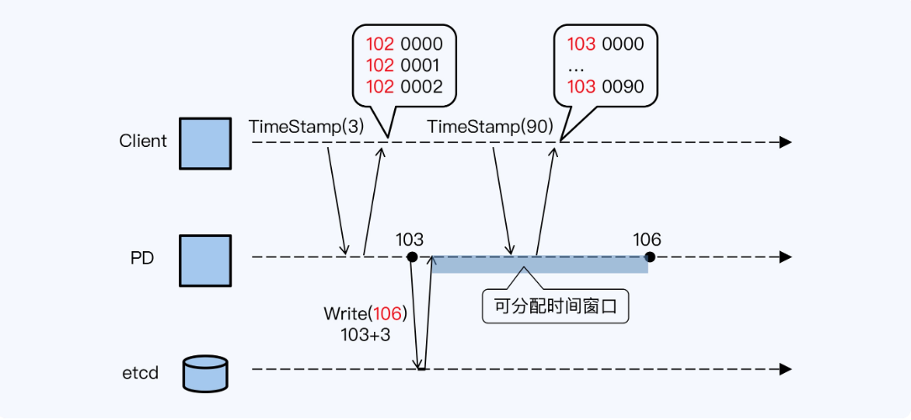


PD（主节点）系统时间是 103 毫秒，PD 向 etcd 申请了一个 可分配的时间窗口（可以通过参数指定，默认配置是 3 毫秒），所以该窗口起点是 PD 当前时间 103，时间窗口的终点就在 106 毫秒。写入 etcd 成功后，PD 将得到一个从 103 到 106 的 可分配时间窗口，这个时间窗口内 PD 可以使用系统的物理时间作为高位，拼接其在内存中累加的逻辑时间，对外分配时间戳。

这种设计意味着所有 PD 已分配时间戳的高位，即物理时间，永远小于 etcd 存储的最大值。如果 PD 主节点宕机，新主可以读取 etcd 中存储的最大值，在这个基础上申请新的 可分配时间窗口，这样新主分配的时间戳肯定大于旧主。

其次，客户端可以一次申请多个时间戳，但如果客户端缓存，多个客户端之间就不是严格单调递增的。

## STP

这是一个小众的方案，如 巨杉的 STP(SequoiaDB Time Protoco)，采用了单时间源、多点授时的方式，优缺点介于 HLC 和 TSO 之间。

STP 是独立于分布式数据库的授时方案，与巨杉其他角色没有必然联系。

STP 下的所有角色统称为 STP Node，分为两类：

* STP Server：STP 是独立于分布式数据库的授时方案。
* STP Client：按照固定的时间间隔，从 Primary Server 同步时间。
巨杉数据库的其他角色节点，如编目节点（CATALOG）、协调节点（COORD）和数据节点（DATA）等，都从本地的 STP Node 节点获得时间。

# 分片机制

## 分片策略

主要是：

* Hash（哈希）
* Range（范围）
>Key 和 List 可以看做 Hash 和 Range 的特殊情况。其机制类似。

## 分片调度机制

分为两种：

* 静态：分片在节点上的分布基本固定，移动需要人工介入
* 动态：通过调度管理器基于算法在各节点之间自动地移动分片
分片机制与架构风格对应关系：

|    |静态|动态|
|:----|:----|:----|
|Hash|Proxy / NewSQL|N/A|
|Range|Proxy|NewSQL|

## Hash分片

就是按照数据记录中指定关键字的 Hash 值将数据记录映射到不同的分片中。

Hash 计算会过滤掉数据原有的业务特性，可以保证数据非常均匀地分布到多个分片上，这是 其最大优势，且实现也很简洁。如果直接用节点数作为模，当系统节点数量变动时模也随之改变，就要重新 Hash 计算，会带来大规模的数据迁移，对于扩展性非常不友好。

于是引入了一致性 Hash。工业实践中应用一致性 Hash 算法，会引入虚拟节点，每个虚拟节点就是一个分片。一开始设定的分片数量决定了集群的最大规模，通常远大于初始集群节点。

**节点和数据都通过 Hash 函数映射到 Hash 环上，数据按照顺时针找到最近的节点。**

## Range静态分片

Range 分片的特点恰恰是能够加入对于业务的预估，比如数据较多时可以更细分，数据较少时可以使用较粗的分类。

Range 分片的适用范围更加广泛。主要因为 Range 分片可以更高效地扫描数据记录，而 Hash 分片由于数据被打散，扫描操作的 I/O 开销更大。

## Range动态分片

多数是用主键作为关键字来分片的，当然主键可以是系统自动生成的，也可以是用户指定的。

一般来说动态分片可以自动分裂和合并、根据访问压力调度分片，即**存储均衡**和**访问压力均衡**。

分片调度还应具有两项能力：

* 减少分布式事务：将频繁跨副本的事务数据转移到同一个节点，从而转换成本地事务。
* 缩短服务延时：调度到较近的数据中心。
# 数据复制协议

动态分片，满足高可靠的同时还要考虑元数据的多副本一致性，必须选择合适的复制协议。

如果搭建独立的、小规模元数据集群，则可以使用 Paxos 或 Raft 等协议，传播特点是广播。如果元数据存在工作节点上，数量较多则可以考虑 Gossip 协议，传播特点是谣言传播。

复制协议的选择和数据副本数量有很大关系：如果副本少，参与节点少，可以采用广播方式，也就是 Paxos、Raft 等协议；如果副本多，节点多，更适合采用 Gossip 协议。

## Gossip协议

CockroachDB 采用了 P2P 架构，每个节点都要保存完整的元数据，这样节点规模就非常大，不适用广播机制。而 Gossip 协议的原理是谣言传播机制，每一次谣言都在几个人的小范围内传播，但最终会成为众人皆知的谣言。这种方式达成的数据一致性是 “最终一致性”，即执行数据更新操作后，经过一定的时间，集群内各个节点所存储的数据最终会达成一致。

虽然 Gossip 是最终一致性，但通过一些寻址过程中的巧妙设计，基于“最终一致性”的元数据也可以实现强一致性。

### 实现强一致性

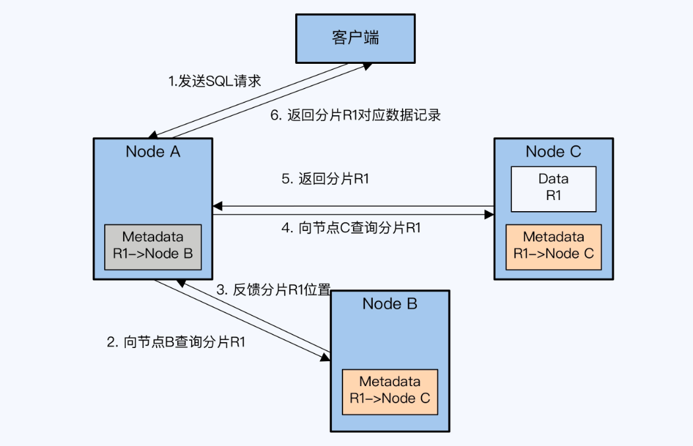


1. 节点 A 接到客户端的 SQL 请求，要查询数据表 T1 的记录，根据主键范围确定记录可能在分片 R1 上，而本地元数据显示 R1 存储在节点 B 上。
2. 节点 A 向节点 B 发送请求。很不幸，节点 A 的元数据已经过时，R1 已经重新分配到节点 C。
3. 此时节点 B 会回复给节点 A 一个非常重要的信息，R1 存储在节点 C。
4. 节点 A 得到该信息后，向节点 C 再次发起查询请求，这次运气很好 R1 确实在节点 C。
5. 节点 A 收到节点 C 返回的 R1。节点 A 向客户端返回 R1 上的记录，同时会更新本地元数据。
CockroachDB 在寻址过程中会不断地更新分片元数据，促成各节点元数据达成一致。

## Raft协议

Raft 日志复制过程：

1. Leader 收到客户端的请求。
2. Leader 将请求内容（Log Entry）追加（Append）到本地 Log。
3. Leader 将 Log Entry 发送给其他的 Follower。
4. Leader 等待 Follower 的结果，如果大多数节点提交了该 Log，那么该 Log Entry 就是 Committed Entry，Leader 就可以将它应用（Apply）到本地的状态机。
5. Leader 返回客户端提交成功。
6. Leader 继续处理下一次请求。
### 顺序投票阻塞问题

当多事务并行操作时，由于前面的事务没有超过半数的响应，Leader 必须等待一个明确的失败信号，如通讯超时等，才能结束这次操作。因为有顺序投票的规则，会阻塞后续事务的进行。

### 优化方法（TiDB）

可以借鉴下 TiDB 的优化点：

* 批操作（Batch）：Leader 缓存多个客户端请求，将一批日志批量发送给 Follower。减少通讯成本。
* 流水线（Pipeline）：Leader 本地增加一个变量（称为 NextIndex），每次发送一个 Batch 后，更新 NextIndex 记录下一个 Batch 的位置，不等待 Follower 返回立刻发送下一个 Batch。当出现网络问题，Leader 重新调整 NextIndex 再次发送 Batch。
* 并行追加日志（Append Log Parallelly）：Leader 将 Batch 发送给 Follower 的同时，并发执行本地的 Append 操作，可以减少部分开销。同时可以调整 Committed Entry 的判断规则，并行操作下，即使 Leader 没有 Append 成功，只要有半数以上的 Follower 节点 Append 成功，那就依然可以视为一个 Committed Entry，Entry 可以被 Apply。
* 异步应用日志（Asynchronous Apply）：任何处于 Committed 状态的 Log Entry 都确保是不会丢失的。Apply 仅仅是为了保证状态能够在下次被正确地读取到，一般提交数据后不会马上读取，可以将 Apply 修改异步执行，同时改造读操作。
# 自增主键

## 特性

自增主键给开发人员提供了很大的便利。主键必须要保证唯一，且多数设计规范都会要求，主键不带有业务属性。如果数据库没有内置这个特性，应用开发人员就必须自己设计一套主键的生成逻辑，数据库原生提供的自增主键免去了这些工作量。

## 单体数据库自增主键

### 无法连续递增

事务发生冲突时，主键就会跳跃留下空洞。可以参考 MySQL 章节。

### 无法单调递增

当主键生成的速度能够满足应用系统的并发需求时，自增主键确实可以做到单调自增。但在高并发场景下，如果自增主键称为瓶颈，那么需要优化。

Oracle 数据库常见的优化方式就是由 Sequence 负责生成主键的高位，由应用服务器负责生成低位数字，拼接起来形成完整的主键。

这样只能保证全局唯一，但数据表中最终保存的主键不再是单调递增。

因此，在一个海量并发场景下，即使借助单体数据库的自增主键特性，也不能实现单调递增的主键。

## 自增主键的问题

分布式数据库中自增主键的问题更多，如：

* 在自增主键的产生环节
* 在自增主键的使用环节
可以发现自增主键的单调递增和全局时钟中的 TSO 很相似。

### 尾部热点

>参考：[https://www.cockroachlabs.com/blog/unpacking-competitive-benchmarks/](https://www.cockroachlabs.com/blog/unpacking-competitive-benchmarks/)

性能问题的根因是同时使用自增主键和 Range 分片。Range 分片有很多优势，使得其成为一个不能轻易放弃的选择。因此主流产品的默认方案是保持 Range 分片，放弃自增主键，转而用随机主键来代替。

## 随机主键

### 内置UUID

UUID 是由 32 个的 16 进制数字组成，长度是 128 位（16^32 = 2^128）。UUID 作为一种广泛使用标准，有多个实现版本，影响它的因素包括时间、网卡 MAC 地址、自定义 Namesapce 等等。

缺点是键值长度过长（128 位），存储和计算的代价都会增加。

### 内置Random ID

TiDB 默认是支持自增主键的，对未声明主键的表会提供了一个隐式主键 _tidb_rowid。因为这个主键大体上是单调递增的，所以也会出现尾部热点问题。

TiDB 除了提供了 UUID 函数，在 4.0 版本中还提供了一种解决方案 AutoRandom。TiDB 模仿 MySQL 的 AutoIncrement，提供了 AutoRandom 关键字用于生成一个随机 ID 填充指定列。

这个随机 ID 是一个 64 位整型，分为三个部分。

* 第一部分的符号位没有实际作用。
* 第二部分是事务开始时间，默认为 5 位，可以理解成事务时间戳的一种映射。
* 第三部分则是自增的序列号，使用其余位。
### 外置Snowflake

雪花算法（Snowflake）是 Twitter 公司分布式项目采用的 ID 生成算法。

生成的 ID 是一个 64 位的长整型，由四个部分构成：

* 第一部分是 1 位的符号位，并没有实际用处，主要为了兼容长整型的格式。
* 第二部分是 41 位的时间戳用来记录本地的毫秒时间。
* 第三部分是机器 ID，这里说的机器就是生成 ID 的节点，用 10 位长度给机器做编码，那意味着最大规模可以达到 1024 个节点（2^10）。
* 最后是 12 位序列，序列的长度直接决定了一个节点 1 毫秒能够产生的 ID 数量，12 位就是 4096（2^12）。
注意时钟回拨导致产生的 ID 重复，需要特殊处理。

# 关联查询

查询中的多表关联，也就是 join 操作，在分布式数据库中如何优化呢。

## 关联算法

常见的关联算法有三大类，分别是嵌套循环（Nested Loop Join）、排序归并（Sort-Merge Join）和哈希（Hash Join）。

### 嵌套循环连接算法

所有的嵌套循环算法都由内外两个循环构成，分别从两张表中顺序取数据。其中，外层循环表称为外表（Outer 表），内层循环表则称为内表（Inner 表）。算法过程是由遍历 Outer 表开始，Outer 表也称为驱动表。在最终得到的结果集中，记录的排列顺序与 Outer 表的记录顺序是一致的。

根据在处理环节上的不同，嵌套循环算法又可以细分为三种，分别是 Simple Nested-Loop Join（SNLJ）、Block Nested-Loop Join（BNJ）和 Index Lookup Join（ILJ）。

#### Simple Nested-Loop Join

SNLJ 是最简单粗暴的算法，有些资料会用 NLJ 指代 SNLJ。

SNLJ 执行过程：

1. 遍历 Outer 表，取一条记录 r1；
2. 遍历 Inner 表，对于 Inner 表中的每条记录，与 r1 做 join 操作并输出结果；
3. 重复步骤 1 和 2，直至遍历完 Outer 表中的所有数据，就得到了最后的结果集。
性能问题：每次为了匹配 Outer 表的一条记录，都要对 Inner 表做一次全表扫描操作。而全表扫描的磁盘 I/O 开销很大。

#### Block Nested-Loop Join

BNJ 是对 SNLJ 的一种优化，改进点是减少 Inner 表的全表扫描次数。BNJ 的变化主要在于步骤 1，读取 Outer 表时不再只取一条记录，而是读取一个批次的 x 条记录加载到内存中。这样执行一次 Inner 表的全表扫描就可以比较 x 条记录。MySQL 中这个 x 对应一个叫做 Join Buffer 的设置项，直接影响了 BNJ 的执行效率。

与 SNLJ 相比，BNJ 虽然在时间复杂度都是 O(m*n)（m 和 n 分别是 Outer 表和 Inner 表的记录行数），但磁盘 I/O 的开销却明显降低了，所以效果优于 SNLJ

#### Index Lookup Join

SNLJ 和 BNJ 都是直接在数据行上扫描，并没有使用索引。所以这两种算法的磁盘 I/O 开销比较大。

Index Lookup Join（ILJ）在 BNJ 的基础上使用了索引，执行过程：

1. 遍历 Outer 表，取一个批次的记录 ri；
2. 通过连接键（Join Key）和 ri 可以确定对 Inner 表索引的扫描范围，再通过索引得到对应的若干条数据记录，记为 sj；
3. 将 ri 的每一条记录与 sj 的每一条记录做 Join 操作并输出结果；
4. 重复前三步，直到遍历完 Outer 表中的所有数据，就得到了最后结果集。
ILJ 的主要优化点很明显就是对 Inner 表进行索引扫描。BNJ 在 Inner 表上要做多次全表扫描成本最高，所以 Inner 表上使用索引的效果最显著，也就成为了算法的重点，而 Outer 表因为扫描结果集要放入内存中暂存，意味着它的记录数比较有限，索引带来的效果也就没有 Inner 表那么显著。

### 排序归并链接算法

排序归并算法就是 Sort-Merge Join（SMJ），也被称为 Merge Join。

SMJ 可以分为排序和归并两个阶段：

1. 对 Outer 表和 Inner 表进行排序，排序的依据就是每条记录在连接键上的数值。
2. 归并，两张表已经按照同样的顺序排列，Outer 表和 Inner 表各一次循环遍历就能完成比对工作。
SMJ 就是先要把两个数据集合变成两个数据序列（有序的数据单元），然后再做循环比对。计算成本是两次排序再加两次循环。所以选择 SMJ 的前提是表的记录本身就是有序的，否则成本较高。而索引天然有序，如果表的连接键刚好是索引列，那么 SMJ 就是三种嵌套循环算法中成本最低的，它的时间复杂度只有 O(m+n)。

### 哈希连接算法

哈希连接是一种分治思想，基本思想是取关联表的记录，计算连接键上数据项的哈希值，再根据哈希值映射为若干组，然后分组进行匹配。

常见的哈希连接算法有三种，分别是 Simple Hash Join、Grace Hash Join 和 Hybrid Hash Join。

#### Simple Hash Join

执行过程:

1. 建立阶段（Build Phase）
选择一张表作为 Inner 表，对其中每条记录上的连接属性（Join Attribute）使用哈希函数得到哈希值，从而建立一个哈希表。在计算逻辑允许的情况下，建立阶段选择数据量较小的表作为 Inner 表，以减少生成哈希表的时间和空间开销。

2. 探测阶段（Probe Phase）
另一个表作为 Outer 表，扫描它的每一行并计算连接属性的哈希值，与建立阶段生成的哈希表进行对比。当然哈希值相等不代表连接属性相等，需要再做一次判断，返回最终满足条件的记录。

这里做了非常理想化的假设，即 Inner 表形成的哈希表小到能够放入内存中。但实际上哈希表也有可能超过内存容量。所以引入了 Grace Hash Join 算法。

#### Grace Hash Join

GHJ 中的 Grace 并不是指某项技术，而是首个采用该算法的数据库名称。Grace 将哈希表分块缓存在磁盘上。

执行过程：

1. Inner 表的记录会根据哈希值分成若干个块（Bucket）写入磁盘，每个 Bucket 必须小于内存容量。Outer 表也按照同样的方法被分为若干 Bucket 写入磁盘，但大小并不受到内存容量限制。
2. 和 SHJ 类似，先将 Inner 表的 Bucket 加载到内存，再读取 Outer 表对应 Bucket 的记录进行匹配，所有 Inner 表和 Outer 表的 Bucket 都读取完毕后，就得到了最终的结果集。
#### Hybrid Hash Join

也就是混合哈希，字面上是指 Simple Hash Join 和 Grace Hash Join 的混合。实际上主要是针对 Grace Hash Join 的优化，内存够用下，可以将 Inner 表的第一个 Bucket 和 Outer 表的第一个 Bucket 都保留在内存中，这样建立阶段一结束就可以进行匹配，节省了先写入磁盘再读取的两次 I/O 操作。

总体来说，哈希连接的核心思想和排序归并很相似，都是对内外表的记录分别只做一次循环。哈希连接算法不仅能够处理大小表关联，对提升大表之间关联的效率也有明显效果，但限制条件就是适用于等值连接。

## 并行框架

### 大小表关联（复制表）

大小表关联时，可以把小表复制到相关存储节点，这样全局关联就被转换为一系列的本地关联，再汇总起来就得到了最终结果。

具体实现有静态和动态两种方式。

#### 静态方式

创建表时直接使用关键字将表声明为复制表，每个节点上都会保留一份数据副本。当与大表关联时，计算节点就可以将关联操作下推到每个存储节点进行。很多分布式数据库，比如 TBase、TDSQL 等，都支持定义复制表。

#### 动态方式

动态方式也称为“小表广播”，不需要人工预先定义，在关联发生时系统自行处理。当关联的某张表足够小时，在整个集群中分发不会带来太大的网络开销，系统就将其即时地复制到相关的数据节点上，实现本地关联。

### 大表关联（重分布）

复制表解决了大小表关联的问题，还剩下最棘手的大表间关联，它的解决方案通常就是重分布。

例如，A、B 两张大表，c 作为关联字段。

```sql
select * from A,B where A.c = B.c;
```
那么可能引起两种不同的重分布操作：
* c 是 A 表的分区键，但不是 B 表的分区键，则 B 表按照 c 做重分布，推送到 A 的各个分片上，实现本地关联。
* 两张表的分区键都不是 c，则两张表都要按照 c 做重分布，然后在多个节点上再做本地关联。（执行代价很高）
重分布的思想和 MapReduce、Spark 等并行计算引擎一致，基本等同于 Shuffle 操作：

1. shuffle 阶段：分别将两个表按照连接键进行分区，将相同连接键的记录重分布到同一节点，数据就会被分配到尽量多的节点上，增大并行度。
2. hash join 阶段：每个分区节点上的数据单独执行单机 hash join 算法。
# 查询执行引擎

## 火山模型

火山模型（Volcano Model）也称为迭代模型（Iterator Model），是最著名的查询执行模型。1990 年提出，长期流行的查询执行模型，主流的 OLTP 数据库 Oracle、MySQL 都采用了这种模型。但面对海量数据时，火山模型有 CPU 使用率低的问题，性能有待提升。

火山模型中，一个查询计划会被分解为多个代数运算符（Operator）。每个 Operator 就是一个迭代器，都要实现一个 next() 接口，通常包括三个步骤：

1. 调用子节点 Operator 的 next() 接口，获取一个元组（Tuple）；
2. 对元组执行 Operator 特定的处理；
3. 返回处理后的元组。
### 优缺点

火山模型的优点是处理逻辑清晰，每个 Operator 只要关心自己的处理逻辑即可，耦合性低。但是它的缺点也非常明显，主要是两点：

* 虚函数调用次数过多，造成 CPU 资源的浪费。
* 数据以行为单位进行处理，不利于发挥现代 CPU 的特性。
### 运算符融合

最简单的方法就是减少执行过程中 Operator 的函数调用。通常来说 Project 和 Filter 都是常见的 Operator，在很多查询计划中都会出现。OceanBase1.0 就将两个 Operator 融合到了其它的 Operator 中。这样做有两个好处：

* 降低了整个查询计划中 Operator 的数量，也就简化了 Operator 间的嵌套调用关系，最终减少了虚函数调用次数。
* 单个 Operator 的处理逻辑更集中，增强了代码局部性能力，更容易发挥 CPU 的分支预测能力。
火山模型仍有一些优化空间，比如运算符融合，可以适度减少虚函数调用，但提升空间有限。学术界提出的两种优化方案是向量化和代码生成。

### 分支预测能力

分支预测是指 CPU 执行跳转指令时的一种优化技术。当出现程序分支时 CPU 需要执行跳转指令，在跳转的目的地址之前无法确定下一条指令，就只能让流水线等待，这就降低了 CPU 效率。为了提高效率，设计者在 CPU 中引入了一组寄存器，用来专门记录最近几次某个地址的跳转指令。

当下次执行到这个跳转指令时，就可以直接取出上次保存的指令，放入流水线。等到真正获取到指令时，如果证明取错了则推翻当前流水线中的指令，执行真正的指令。

## 向量化模型

向量化模型就是一系列向量化运算符组成的执行模型。向量化模型首先在 OLAP 数据库和大数据领域广泛使用，配合列式存储取得很好的效果。虽然 OLTP 数据库的场景不适于列式存储，但将其与行式存储结合也取得了明显的性能提升。

向量化模型与火山模型的最大差异就是，其中的 Operator 是向量化运算符，是基于列来重写查询处理算法的。简单来说向量化模型是由一系列支持向量化运算的 Operator 组成的执行模型。

向量化模型依然采用了拉取式模型。和火山模型的唯一区别就是 Operator 的 next() 函数每次返回的是一个向量块，而不是一个元组。向量块是访问数据的基本单元，由固定的一组向量组成，这些向量和列 / 字段一一对应。

向量处理背后的主要思想是，按列组织数据和计算，充分利用 CPU，把从多列到元组的转化推迟到较晚的时候执行。这种方法在不同的操作符间平摊了函数调用的开销。

向量化模型首先在 OLAP 数据库中采用，与列式存储搭配使用可以获得更好的效果，例如 ClickHouse。

这里的分布式数据库都是面向 OLTP 场景的，不能直接使用列式存储。但是可以采用折中的方式来实现向量化模型，即在底层的 Operator 中完成多行到向量块的转化，上层的 Operator 都是以向量块作为输入。这样改造后即使是与行式存储结合，仍然能够显著提升性能。在 TiDB 和 CockroachDB 的实践中，性能提升可以达到数倍甚至数十倍。

## 代码生成

与向量化模型并列的另一种高效查询执行引擎就是 代码生成。代码生成的全称是以数据为中心的代码生成（Data-Centric Code Generation），也被称为编译执行（Compilation）。

代码生成消除了火山模型中的大量虚函数调用，让大部分指令可以直接从寄存器取数，极大地提高了 CPU 的执行效率。

代码生成是现代编译器与 CPU 结合的产物，也可以大幅提升查询执行效率。代码生成的基础逻辑是，针对性的代码在执行效率上必然优于通用运算符嵌套。代码生成根据算法会被划分成多个在 Pipeline 执行的单元，提升 CPU 效率。代码生成有不同的粒度，包括整体代码生成和表达式代码生成，粒度越大实现难度越大。

# Reference

[https://www.cs.princeton.edu/courses/archive/fall10/cos597B/papers/percolator-osdi10.pdf](https://www.cs.princeton.edu/courses/archive/fall10/cos597B/papers/percolator-osdi10.pdf)

[https://cse.buffalo.edu/~demirbas/publications/hlc.pdf](https://cse.buffalo.edu/~demirbas/publications/hlc.pdf)

[http://cs.brown.edu/courses/cs296-2/papers/consistent.pdf](http://cs.brown.edu/courses/cs296-2/papers/consistent.pdf)

[https://core.ac.uk/download/pdf/54846488.pdf](https://core.ac.uk/download/pdf/54846488.pdf)

