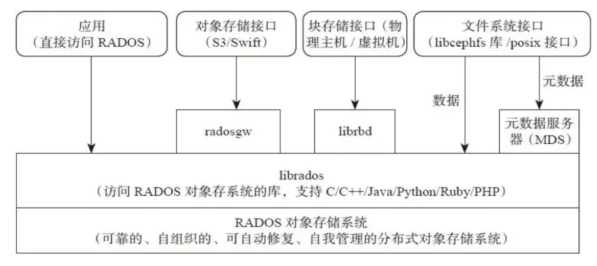

# 简介

Ceph是一个C++开发的开源分布式存储系统，设计初衷是提供较好的性能、可靠性和可扩展性。可以提供块、文件和对象存储，被广泛应用于云计算、大数据等领域。

Ceph 项目最早起源于 Sage 就读博士期间的工作（最早的成果于 2004 年发表），并随后贡献给开源社区。在经过了数年的发展之后，目前已得到众多云计算厂商的支持并被广泛应用。

Ceph的核心组件是RADOS（Reliable Autonomic Distributed Object Store）存储系统，它将数据分成多个对象，并将这些对象分布在不同的物理服务器上存储。Ceph使用CRUSH算法来管理数据和存储节点，CRUSH算法是一种自适应的分布式数据放置算法，能够实现数据的负载均衡和故障恢复。Ceph还提供了一套完整的API接口，支持块存储、对象存储、文件存储等多种数据存储方式，同时还支持多种数据访问协议，如CephFS、RADOS Gateway等。RedHat 及 OpenStack 都可与 Ceph 整合以支持虚拟机镜像的后端存储。

## 优势

Ceph的优势可以概括为以下几个方面：

* 高性能
    * 摒弃了传统的集中式存储元数据寻址的方案，采用CRUSH算法，数据分布均衡，并行度高
    * 考虑了容灾域的隔离，能够实现各类负载的副本放置规则，例如跨机房、机架感知等
    * 能够支持上千个存储节点的规模。支持TB到PB级的数据
* 高可用
    * 副本数可以灵活控制
    * 支持故障域分隔，数据强一致性
    * 多种故障场景自动进行修复自愈
    * 没有单点故障，自动管理
* 高扩展性
    * 去中心化
    * 扩展灵活
    * 随着节点增加，性能线性增长
* 特性丰富
    * 支持三种存储接口：对象存储，块设备存储，文件存储
    * 支持自定义接口，支持多种语言驱动
* 开源自由
    * Ceph是一款完全开源的存储系统，采用LGPLv2.1许可证，用户可以自由使用和修改其源代码。
# 架构

Ceph的架构可以分为三个层次：RADOS、Ceph OSD和Ceph Client。

## RADOS层

RADOS（Reliable Autonomic Distributed Object Store）将数据分成多个对象，并将这些对象分布在不同的物理服务器上存储。RADOS使用CRUSH算法来管理数据和存储节点，CRUSH算法是一种自适应的分布式数据放置算法，能够实现数据的负载均衡和故障恢复。RADOS还提供了多种数据访问协议，如RADOS Block Device（RBD）、RADOS Gateway等。

## Ceph OSD层

Ceph OSD（Object Storage Device）是一个运行在每个存储节点上的进程，负责管理RADOS中的对象存储和数据副本的复制。每个Ceph OSD都可以处理读取和写入请求，并保持与其他OSD节点之间的数据同步。此外，Ceph OSD还提供了一套完整的API接口，支持块存储、对象存储、文件存储等多种数据存储方式。

## Ceph Client层

Ceph Client是Ceph的用户访问层，它提供了多种数据访问协议，如CephFS、RADOS Gateway等，以满足不同的数据访问需求。Ceph Client还负责将数据请求分发给Ceph OSD节点进行处理，并将结果返回给用户。

总体来说，Ceph的架构设计具有高度的可扩展性和可靠性，能够满足大规模分布式存储系统的需求。

# 基本概念

## Object

Ceph 最底层的存储单元是 Object 对象，每个 Object 包含元数据和原始数据。

## PG

PG 全称 Placement Grouops，是一个逻辑的概念，一个 PG 包含多个 OSD。引入 PG 这一层其实是为了更好的分配数据和定位数据。

## RADOS

RADOS 全称 Reliable Autonomic Distributed Object Store，是 Ceph 集群的精华，用户实现数据分配、Failover 等集群操作。

## Libradio

Librados 是 Rados 提供库，因为 RADOS 是协议很难直接访问，因此上层的 RBD、RGW 和 CephFS 都是通过 librados 访问的，目前提供 PHP、Ruby、Java、Python、C 和 C++支持。

## CRUSH

CRUSH 是 Ceph 使用的数据分布算法，类似一致性哈希，让数据分配到预期的地方。

## RBD

RBD 全称 RADOS block device，是 Ceph 对外提供的块设备服务。

## RGW

RGW 全称 RADOS gateway，是 Ceph 对外提供的对象存储服务，接口与 S3 和 Swift 兼容。

## CephFS

CephFS 全称 Ceph File System，是 Ceph 对外提供的文件系统服务。

# 相关组件

## OSD

Ceph OSD（Object-based Storage Device）是一个运行在每个存储节点上的进程，负责管理RADOS中的对象存储和数据副本的复制。每个Ceph OSD都可以处理读取和写入请求，并保持与其他OSD节点之间的数据同步。一个 Ceph 集群一般都有很多个 OSD。

## Monitor

Ceph Monitor用于管理和监控Ceph集群的状态、健康状况和配置信息。它是一个运行在独立的服务器上的进程，通常建议在集群中部署3个或以上的Monitor实例以保证高可用性。

Ceph Monitor主要负责以下任务：

1. 集群监控和管理：Ceph Monitor可以实时监控集群中的状态和健康状况，包括存储节点的在线状态、磁盘使用情况、数据副本数等。它还可以处理集群中的故障，如处理掉线的存储节点或OSD。
2. 集群状态同步：Ceph Monitor会维护一个集群状态的数据库，并将状态信息发送给其他Ceph组件，如OSD和MDS。这样可以保证整个集群中所有的组件都具有相同的状态视图，以便它们能够协同工作。
3. 配置管理：Ceph Monitor还负责管理集群的配置信息，包括节点、用户、权限等。管理员可以使用Ceph Monitor来管理和修改集群的配置，以满足不同的需求。
总之，Ceph Monitor是Ceph分布式存储系统中非常重要的组件，它能够确保整个集群的状态和配置保持一致，并能够及时响应故障，保证Ceph集群的高可用性和可靠性。

## MDS

MDS (Metadata Server) 用于管理文件系统的元数据。元数据是文件系统中关于文件、目录和权限等信息的描述。Ceph MDS 通常运行在一个或多个专用的计算机上，可以支持高度并发的元数据操作。

MDS 可以实现多个客户端同时访问同一个文件系统，并且可以提供高可用性和容错能力。当一个 MDS 服务器出现故障时，Ceph 可以自动地将其上的元数据转移到其他可用的 MDS 服务器上。

MDS 的设计目标是支持大规模、高并发的文件系统操作。它使用了一些优化技术来提高元数据的访问效率，如 B+ 树索引、目录缓存、异步 I/O 等。这些技术可以使 Ceph MDS 能够快速地处理大量的文件和目录，从而提供良好的性能和可伸缩性。

# 工作原理

## 数据存储过程

无论使用哪种存储方式（对象、块、挂载），存储的数据都会被切分成对象（Objects）。（Objects size大小通常为2M或4M）。

每个对象都有一个唯一的 OID（由ino和ono组成），ino是文件的File ID，用于在全局唯一标识每个文件。ono是分片编号。oid可以唯一标识每个不同的对象。

对象并不会直接存储在 OSD 中，因为对象的 size 很小，在一个大规模的集群中可能有几百到几千万个对象。遍历寻址速度很慢；如果将对象通过某种固定哈希映射到OSD中，当OSD损坏时，对象也无法自动迁移到其他OSD上（哈希映射不允许）。因此引入了归置组的概念，即PG。

PG是一个逻辑概念，在数据寻址时类似于数据库中的索引：每个对象都会固定映射进一个PG中，当寻找一个对象时，只需要先找到对象所属的PG，然后遍历PG即可，无需遍历所有对象。数据迁移时，也是以PG作为基本单位进行迁移，Ceph不会直接操作对象。

对象映射到PG：

首先使用静态hash函数对OID做哈希取出特征码，用特征码于PG的数量取模得到序号就是PGID，这种设计方式PG的数量多寡直接决定了数据分布的均匀性，所以合理设置PG数量可以很好地提升集群的性能并使数据均匀分布。

最后PG会根据管理员设置的副本数量进行复制，然后通过CRUSH算法存储到不同的OSD节点上（第一个为主节点，其余为从节点）。

### 映射关系

* file到object：存储一个file需要将其切分成若干个object。（object的size由RADOS配置）
* object到PG：每个object都会被映射（哈希）到一个PG中，然后以PG为单位进行副本备份、进一步映射到具体的OSD上。
* PG到OSD：通过CRUSH算法来实现，PG会最终存储到 r（设置的冗余存储个数）个OSD上。
### RADOS系统逻辑结构

RADOS能够在动态变化和异质结构的存储设备机群之上提供一种稳定、可扩展、高性能的单一逻辑对象（Object）存储接口和能够实现节点的自适应和自管理的存储系统。

服务端 RADOS 集群主要由两种节点组成：

* 多个负责数据存储和维护功能的OSD（Object Storage Device）
* 若干个负责系统状态检测和维护的monitor（至少一个推荐3个起）
### Cluster Map

Ceph集群通过monitor集群操作cluster map来实现集群成员的管理。

cluster map 描述了哪些OSD被包含进存储集群以及所有数据在存储集群中的分布。cluster map不仅存储在monitor节点，还被复制到集群中的每一个存储节点，以及和集群交互的client。 

当发生设备崩溃、数据迁移等，cluster map内容需要变更时，cluster map的版本号会增加，使通信双方确认自己的map是否需要更新，然后进行后续操作。

RADOS也通过cluster map实现存储半自动化的功能，cluster map会被复制到集群中的其它节点，如存储节点、控制节点，甚至是客户端等。通过在每个存储节点存储完整的Cluster map，来进行数据备份、更新，错误检测、数据迁移等等操作。减轻了 monitor cluster（少部分节点）的负担。

## 存储方式

### 对象网关radosgw

Ceph对象网关是一个对象存储接口，建立在该对象之上，librados为应用程序提供了通往Ceph存储集群的RESTful网关接口。Ceph支持两个接口：

* 与S3兼容：为对象存储功能提供Amazon S3 RESTful API的大部分子集兼容的接口。
* 兼容Swift：通过与OpenStack Swift API的大部分子集兼容的接口，为对象存储功能提供支持。
Ceph对象存储使用Ceph对象网关守护进程（radosgw）用于与集群进行交互的HTTP服务器。由于其提供与OpenStack Swift和Amazon S3兼容的接口，因此Ceph对象网关具有其自己的用户管理。Ceph对象网关可以将数据存储在Ceph文件系统客户端或Ceph块设备客户端的同一Ceph存储集群中。S3和Swift API共享一个公共的名称空间，因此可以额使用一个API编写数据、另一个检索数据。

### Ceph文件系统

Ceph文件系统（Ceph FS）是个POSIX兼容的文件系统，使用Ceph存储集群来存储数据。Ceph文件系统与Ceph块设备、同时提供S3和Swift API的Ceph对象存储、原生库（librados）都是用着相同的Ceph存储集群系统。

### Ceph块存储

块是一个字节序列（如一个512字节的数据块）。基于块的存储接口是最常见的存储数据方法，它们基于旋转介质像硬盘、CD、软盘。各种块设备接口使虚拟块设备成为与Ceph这种海量存储系统交互的理想之选。

Ceph块设备是精简配置的、大小可调且将数据条带化存储到集群内的多个OSD。Ceph块设备利用RADOS的多种能力，如快照、复制和一致性。Ceph的RADOS块设备（RBD）使用内核模块或librbd库与OSD交互。

# Reference

[https://github.com/ceph/ceph](https://github.com/ceph/ceph)

[https://docs.ceph.com/en/quincy/](https://docs.ceph.com/en/quincy/)

[http://ceph.org.cn/category/docs/](http://ceph.org.cn/category/docs/)

