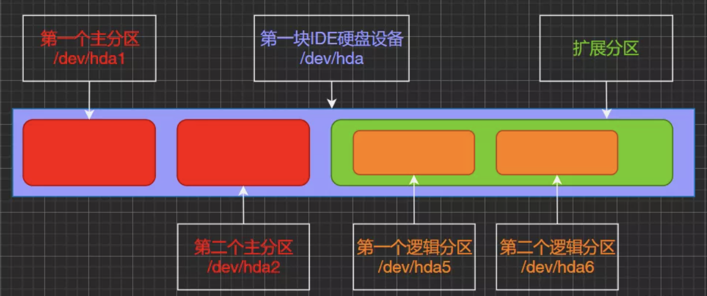

# Linux文件系统

## 简介

Linux有多种文件系统，不同的文件系统支持不同的体系。文件系统是管理数据的，而存储数据的物理设备有硬盘、 U盘、 SD卡、 NAND FLASH、 NOR FLASH、网络存储设备等。不同的存储设备有不同的物理结构，因此就需要不同的文件系统去管理，比如管理 NAND FLASH 使用YAFFS 文件系统，管理硬盘/SD卡使用ext文件系统等。

## 分类

Linux支持很多文件系统格式，大体可分以下几类：

### 磁盘文件系统

指本地主机中实际可以访问到的文件系统，包括硬盘、CD-ROM、DVD、USB存储器、磁盘阵列等。常见格式有：Ext2、Ext3、Ext4、JFS、NTFS、UFS、FAT、FAT16、FAT32等

### 网络文件系统

是可以远程访问的文件系统，在服务器端仍是本地磁盘文件系统，客户机通过网络远程访问数据。 常见格式有：NFS、Samba等

### 专有/虚拟文件系统

不驻留在磁盘上的文件系统。常见格式有：TMPFS、PROCFS等。

# 磁盘文件系统

目前Ext4（Extended File sytem，扩展文件系统）是广泛使用的一种磁盘文件系统格式。是在Ext3基础上发展起来的，对有效性保护、数据完整性、数据访问速度、向下兼容性等方面做了改进，其特点是日志文件系统：可将整个磁盘的写入动作完整地记录在磁盘的某个区域上，以便在必要时回溯追踪。

磁盘是一种计算机的外部存储器设备，由一个或多个覆盖有磁性材料的铝制或玻璃制的碟片组成，用来存储用户的信息，这种信息可以反复地被读取和改写。磁盘主要分为一下几类：

## IDE磁盘

Integrated Drive Electronics，价格低廉，兼容性强，性价比高，但是数据传输慢，不支持热插拔等。

## SCSI磁盘

Small Computer System Interface，传输速率高，读写性能好，运行稳定，可连接多个设备，支持热插拔，占用CPU低，但是价格相对较贵，一般用于工作站或服务器上。

## SATA磁盘

Serial Advanced Technology Attachment，结构简单、支持热插拔。

# 磁盘分区

为了便于管理和使用，通常会对磁盘进行分区。




## 主分区

必须要存在的分区，最多能创建4个，最少1个，编号只能是1 - 4 （比如sda1、sda2、sda3、sda4），可以直接格式化，然后安装系统直接存放文件。

## 扩展分区

会占用主分区位置，即主分区+扩展分区之和最多4个。相当于独立的磁盘，有独立的分区表，但不能独立的存放数据

## 逻辑分区

扩展分区不能直接存放数据，必须经过再次分割成为逻辑分区后才能存放数据。一个扩展分区中的逻辑分区可以有任意多个，编号只能从5开始。

## 交换分区

安装系统时建立的，一块特殊的硬盘空间，当实际内存不够用时，操作系统会从内存中取出部分暂时不用的数据，放在swap中，为当前程序腾出足够的内存空间。swap不会使用到目录树的挂载，无需指定挂载点（即cd无法进入）。

# 设备

设备接入系统后都是以文件的形式存在

## 设备文件名称

|设备类型|文件名称|
|:----|:----|
|SATA/SAS/USB|/dev/sda,/dev/sdb （s= SATA, d=DISK a=第几块）|
|IDE|/dev/hd0,/dev/hd1 （h= hard）|
|VIRTIO-BLOCK|/dev/vda,/dev/vdb （v=virtio）虚拟io输出|
|M2（SSD）|/dev/nvme0,/dev/nvme1（nvme=m2）|
|SD/MMC/EMMC(卡)|/dev/mmcblk0,/dev/mmcblk1（mmcblk=mmc卡 ）|
|光驱|/cdrom,/dev/sr0,/dev/sr1|

## 设备命令规则

```plain
/dev/sd  a  5
-1   -2 -3 -4
分别以数字代替上述位置
-1：硬件设备所在目录
-2：设备，sd表示SCSI设备，hd表示IDE设备
-3：磁盘的顺序号以字母a、b、c...表示
-4：分区的顺序号，以1、2、3...表示
```
举例：
```plain
/dev/sda  # 表示第一个SCSI硬盘
/dev/sda1 # 表示第一个SCSI硬盘的第一个主分区
/dev/sdb3 # 表示第二个SCSI硬盘的第3个主分区
/dev/hdb  # 表示第二个IDE硬盘的第2个主分区
```

# 文件系统结构

除了swap分区外，其他主分区、扩展分区、逻辑分区都是在根分区（/）目录上操作的。Linux文件系统是一个树形的分层组织结构，根作为整个文件系统的唯一起点，其他所有目录都从该点出发。根分区下的一级目录有：

* bin
* boot
* dev
* etc
* home
* lib
* mnt
* opt
* proc
* root
* sbin
* srv
* sys
* tmp
* usr
* var
# 操作命令

## fdisk

磁盘分区表操作工具。命令格式：

```shell
fdisk [-l]
```
常用选项：
```shell
-l: 输出后面接的装置所有的分区内容。
```

## file

file命令用于辨识文件类型。命令的格式为：

```shell
file [-b -c -L -v -z][-f <名称文件>][-m <魔法数字文件>...][文件或目录...]
```
常用选项：
```shell
-b: 列出辨识结果时不显示文件名称
-c: 详细列出指令执行过程
-f <名称文件>: 执行名称文件
-L: 直接显示符号链接所指向的文件的类别
-m <魔法数字文件>: 执行魔法数字文件
-v: 显示版本信息
-z: 尝试解读压缩文件内容
[文件或目录...]: 要确定类型的文件列表，多个文件之间以空格隔开，也可以使用shell通配符匹配
```
## ln

link files的缩写，是为某一个文件在另外一个位置建立一个同步的链接。

命令格式：

```shell
ln [参数][源文件或目录][目标文件或目录]
```
常用选项：
```shell
-b: 删除、覆盖之前建立的链接
-d: 允许超级用户制作目录的硬链接
-f: 强制执行
-i: 交互模式，文件存在则提示是否覆盖
-n: 把符号连接视为一般目录
-s: 软链接(符号链接)
-v: 显示详细处理过程
```

## mount

对分区/dev/sda3的操作命令：

1、挂载：mount /dev/sda1 /mnt/asd，这样挂载分区到文件系统上，才能看/mnt/asd里的东西。

2、查看：ls -hl /mnt/asd

3、卸载：umount /dev/sda1

文件系统：指定要卸载的文件系统或者其对应的设备文件名

(1)、通过设备名卸载：umount -v /dev/sda1

(2)、通过挂载点卸载：umount -v /mnt/mymount/

## 设备查看

|命令|作用|
|:----|:----|
|fdisk -l|查看磁盘分区情况|
|lsblk|设备使用情况|
|blkid|设备管理方式及设备ID|
|df|查看正在被系统挂载的设备|
|cat /proc/partitions|查看系统识别设备|


# Reference

[https://docs.aws.amazon.com/zh_cn/AWSEC2/latest/UserGuide/device_naming.html](https://docs.aws.amazon.com/zh_cn/AWSEC2/latest/UserGuide/device_naming.html)

[Linux存储设备管理](https://blog.csdn.net/qq_43114229/article/details/120826140?utm_medium=distribute.pc_relevant.none-task-blog-2~default~baidujs_baidulandingword~default-1-120826140-blog-104561836.235^v27^pc_relevant_3mothn_strategy_recovery&spm=1001.2101.3001.4242.2&utm_relevant_index=4)

[https://blog.51cto.com/u_15467009/5575719](https://blog.51cto.com/u_15467009/5575719)

