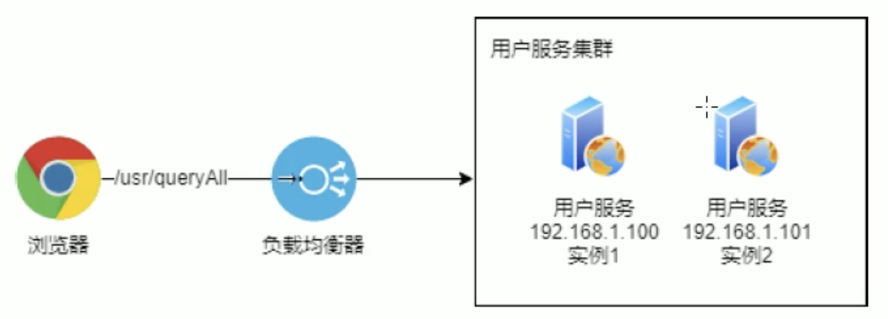
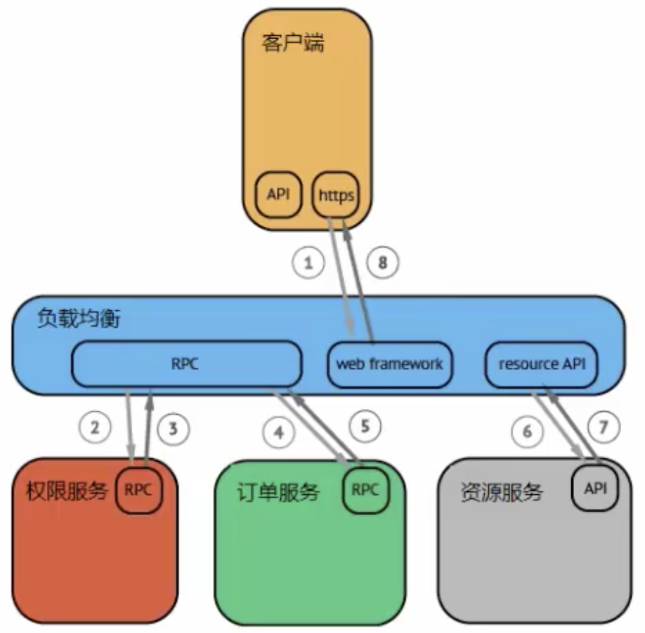
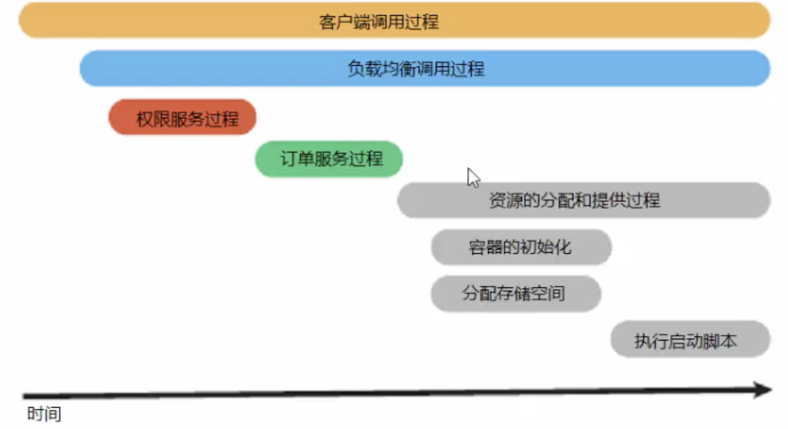
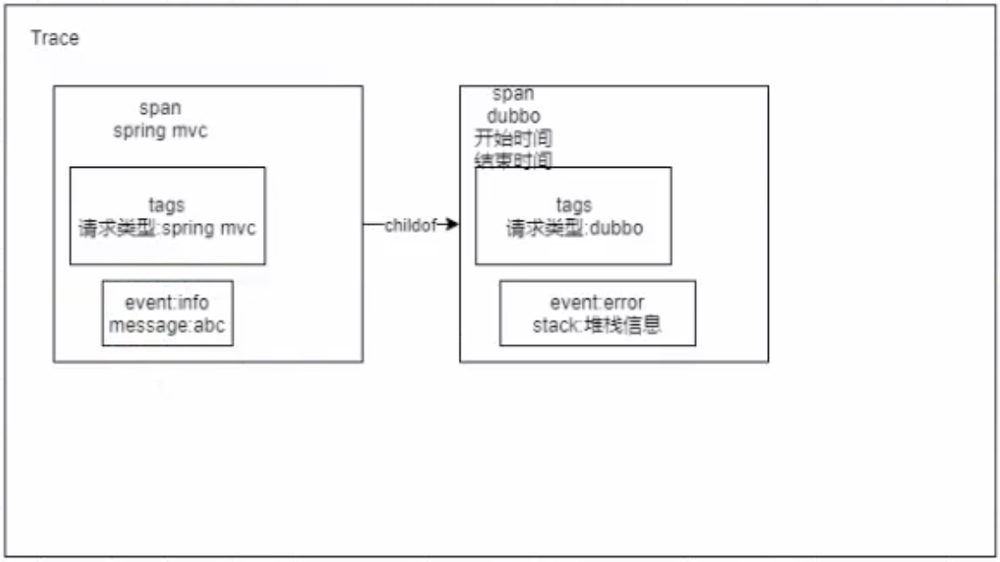

# Skywalking概述

## 什么是Skywalking

### 概述

Skywalking主要概念包括：

* 服务（Service）
* 端点（EndPoint）
* 实例（Instance）



端点就是服务暴露的端口如/usr/queryAll

# 安装

## 安装ES

替换默认的h2存储，因为h2存储在内存中。

1、下载并解压ES安装包

```shell
tar -zxvf elasticsearch-6.x.x.tar.gz
```
2、修改Linux系统的限制配置，将文件创建数修改为65536个。
1）修改系统中允许应用最多创建多少文件等的限制权限。Linux默认一般限制创建的文件数为65535个。但是ES至少需要65536的文件创建数的权限。

2）修改系统中允许用户启动的进程开启多少个线程。Linux默认root用户可以开启任意数量的线程，其他用户的进程可以开启1024个线程。必须修改限制数为4096+。因为ES至少需要4096个线程池预备。

```shell
vi /etc/security/limits.conf

# 在 limits.conf 文件中追加以下内容，保存完自动生效
es soft nofile 65536
es hard nofile 65536
es soft nproc 4096
es hard nproc 4096
```
3、修改系统控制权限，ES需要开辟一个65536字节以上空间的虚拟缓存。Linux不允许任何用户和应用程序直接开辟这么的虚拟内存。
```shell
vi /etc/sysctl.conf

# 在 sysctl.conf 文件中追加如下内容尾部，当前用户拥有的内存权限大小
vm.max_map_count=262144

# 退出文件编辑，并执行以下命令，让系统控制权限配置生效
sysctl -p
```
4、创建一个用户，用于ES启动
因为ES在5.x版本后，强制在Linux中不能使用root用户启动ES进程。

```shell
# 创建用户
useradd es
# 修改上述用户的密码
passwd es
# 修改目录拥有者
chown -R es elasticsearch-6.x.x
```
5、启动ES
```shell
# 切换用户
su es
cd bin
# 后台启动ES
./elasticsearch -d
```
6、测试启动
ES默认不支持跨域访问，在不修改配置的情况下只能在本机上访问测试是否成功

```shell
curl http://localhost:9200
```
## 安装Skywalking

两个步骤：

1、安装后端服务

2、安装UI

```shell
# 首先切回root用户
su root
cd /usr/local/skywalking
tar -zxvf apache-skywalking-apm-6.4.0.tar.gz
```
修改Skywalking存储的数据源配置
```shell
cd apache-skywalking-apm-bin
vi config/application.xml
# 注释掉h2存储配置
# 把ES的注释打开
```
webapp配置
```shell
vi webapp/webapp.xml
# 修改端口8080，防止冲突
```
启动程序
```shell
oapService.sh  # 启动backend后端服务
webappService.sh  # 启动UI服务
./startup.sh   # 启动两个部分
```
日志
```shell
tail -f logs/webapp.log
```
浏览器访问skywalking网页页面
# 基础

## agent使用

agent探针在java中使用java agent技术实现的，不需要更改任何代码，java agent会通过虚拟机接口来在运行期更改代码

Agent探针支持JDK1.6-12的版本，Agent探针所有的文件在Skywalking的agent文件夹下。文件目录如下：

```shell
agent
  activations
  // 配置文件
  config
  // 组件的所有插件
  plugins
  // 可选插件
  optional-plugins
  
```
>部分插件在使用上会影响整体的性能或者由于版权问题放置于可选插件包中，不会直接加载，如果需要使用，将可选插件中的jar包拷贝到plugins包下

```shell
cd apache-skywalking-apm-bin
vi agent/config/agent.config
```
修改agent.service_name
```shell
agent.service_name=${SW_AGENT_NAME:Your_ApplicationName}
```
配置含义是可以读到SW_AGENT_NAME配置属性，如果该配置没有指定，那么默认名称为Your_xx，这里替换成skywalking_tomcat
然后将tomcat重启

```shell
./shutdown.sh
./startup.sh
```

### Linux下tomcat7和8中使用

1、要使用Skywalking监控Tomcat中的应用，需要先准备一个Spring mvc项目，这里准备好一个打包好的文件：skywalking_springmvc-1.0-SNAPSHOT.war

内容为一个简单的hello world controller接口.

2、将war包上传至 xx/apache-tomcat-xx/webapps/下。编辑xx/apache-tomcat-xx/bin/catalina.sh文件，在文件顶部添加：

```shell
CATALINA_OPTS="$CATALINA_OPTS -javaagent:/usr/local/skywalking/apache-skywalking-apm-bin/agent/skywalking-agent.jar";
export CATALINA_OPTS
```
修改tomcat启动端口
```shell
vi conf/server.xml
# port = 8081，防止冲突
```
启动项目，访问接口，然后访问skywalking UI页面，即可查询各项指标
### Windows下tomcat7和8中使用

windows下只需要修改 tomcat目录下 bin/catalina.bat文件的第一行为：

```shell
set CATALINA_OPTS="=-javaagent:/path/to/skywalking-agent/skywalking-agent.jar"
```

### Spring Boot中使用

Skywalking与spring boot集成提供了完善的支持

1、首先复制一份agent，防止与tomcat使用时冲突

```shell
cd /usr/local/skywalking/apapche-skywalking-apm-bin/
cp -r agent agent_boot
vi agent_boot/config/agent.config
```
修改配置的应用名为 skywalking_boot（同上，略）
2、同上准备web应用 skywalking_springboot.jar，提供一个正常和异常controller接口

将文件上传至 xx 目录下。

3、使用命令启动spring boot项目

```shell
java -javaagent:/usr/local/skywalking/apache-skywalking-apm-bin/agent_boot/skywalking-agent.jar
-Dserver.port=8082 -jar skywalking_boot.jar &
# 指定端口号防止冲突
# 末尾 & 表示后台启动
```
访问接口，然后访问skywalking UI页面，即可查询各项指标
## RocketBot的使用

Skywalking的监控UI页面称为RocketBot，可以通过修改webapp/webapp.yml来更改端口：

```yaml
server:
  port: 8080  
```

# Skywalking高级

## Rpc调用监控

## MySQL调用监控

启动docker

```shell
docker -v # ce版本，可以使用systemctl
systemctl start docker
```
使用docker启动MySQL
```shell
docker images
docker run -id --name=skywalking_mysql -p 33306:3306 -e
MYSQL_ROOT_PASSWORD=123456 centos/mysql-57-centos57
```

## Skywalking常用插件

### 配置覆盖

#### 系统配置

使用skywalking. +配置文件中的配置名作为系统配置项来进行覆盖

1、为什么添加前缀

agent的系统配置和环境与目标应用共享，所以加上前缀可以有效的避免冲突

2、案例

通过如下进行agent.service_name的覆盖

```json
-Dskywalking.agent.service_name=skywalking_mysql
```

#### 探针配置

Add the properties after the agent  path in JVM arguments

```shell
-javaagent:/path/to/skywalking-agent.jar=[option1]=[value1],[option2]=[value2]
```
1、案例
通过如下进行agent.service_name覆盖

```shell
-javaagent:/path/to/skywalking-agent.jar=agent.service_name=skywalking_mysql
```
2、特殊字符
如果配置中包含分隔符（，或者=），就必须使用引号包裹起来

```shell
-javaagent:/path/to/skywalking-agent.jar=agent.ignore_suffix='.jpg,.jpeg'
```
#### 系统环境变量

1、案例

由于agent.service_name配置项如下所示：

```shell
agent.service_name=${SW_AGENT_NAME:Your_ApplicationName}
```
可以在环境变量中设置SW_AGENT_NAME的值来制定服务名
### 覆盖优先级

探针配置 > 系统配置 > 系统环境变量配置 > 配置文件中的值

所以我们的启动命令可以修改为：

```shell
java -javaagent:/usr/local/skywaling/apache-skywalking-apm-bin/agent_mysql/skywalking-agent.jar
-Dskywalking.agent.service_name=skywalking_mysql -jar skywalking_mysql.jar &
```
或
```shell
java -javaagent:/usr/local/skywaling/apache-skywalking-apm-bin/agent_mysql/skywalking-agent.jar
=agent.service_name=skywalking_mysql -jar skywalking_mysql.jar &
```

### 过滤指定端点

1、将skywalking_plugins.jar上传至/usr/local/wkywalking目录下

2、将agent中的/agent/optional-plugins/apm-trace-ignore-plugin-6.4.0.jar插件拷贝到plugins目录中

```shell
cd /usr/local/skywalking/apache-skywalking-apm-bin
cp optional-plugins/apm-trace-ignore-plugin-6.4.0.jar plugins/apm-trace-ignore-plugin-6.4.0.jar
```
3、启动skywalk_plugins应用
```shell
java -javaagent:/usr/local/skwalking/apache-skywalking-apm-bin/agent/skywalking-agent.jar
-Dskywalking.agent.service_name=skywalking_plugins -Dskywalking.trace.ignore_path=/exclude -jar skywalking_plugins.jar &
```
>这里添加-Dskywalking.trace.ignore_path=/exclude参数来标识需要过滤哪些请求，支持Ant Path表达式：
>/path/*, /path/**, /path/?
>- ?匹配任何单字符
>- *匹配0或者任意数量的字符

## 告警功能

### 告警功能简介

Skywalking每隔一段时间根据收集到的链路追踪的数据和配置的告警规则（如服务响应时间、服务响应时间百分比等），判断如果达到阈值则发送响应的告警信息。发送告警信息是通过调用webhook接口完成，具体的webhook接口可以使用者自行定义，从而开发者可以在指定的webhook接口编写各种告警方式，比如邮件、短信等。告警的信息也可以在RocketBot中查看。

以下是默认的告警规则配置，位于skywalking安装目录下的config文件夹下alarm-settings.yml文件中：

```yaml
rules: 
  # Rule unique name, must be ended with `_rule`.
  service_resp_time_rule:
    metrics-name: service_resp_time
    op: ">"
    threshold: 1000
    period: 10
    count: 3
    silence-perild: 5
    message: Response time of serice {name} is more thran 1000ms in 3 minutes of last 10 minutes.
    
webhooks: 
  - http:127.0.0.1/notify/  
```
>满足规则的告警信息将调用通过webhooks配置的接口

# Skywalking原理

## Java agent原理

**Javaagent是什么？**

Java agent是java命令的一个参数。参数javaagent可以用于指定一个jar包。

1、这个jar包的MANIFEST.MF文件必须指定Premain-Class项。

2、Premain-Class指定的那个类必须实现premain()方法

当java虚拟机启动时，在执行main函数之前，JVM会先运行-javaagent所指定jar包内Premain-Class这个类的premain方法。

**如何使用java agent？**

步骤：

1. 定义一个MANIFEST.MF文件，必须包含Premain-Class选项，通常也会加入Can-Redefine-Classes和Can-Retransform-Class选项
2. 创建一个Premain-Class指定的类，类中包含premain方法，方法逻辑由用户自己指定
3. 将premain的类和MANIFEST.MF文件打成jar包
4. 使用参数-javaagent:jar包路径 启动要代理的方法

### 搭建java agent工程

PreMainAgent.java

```java
public class PreMainAgent {
  public static void premain(String agentparam, Instrumenttation inst) {
    System.out.println("premain start");
    System.out.println(agentparam);
  }
  public static void premain(String agentparam) {
    System.out.println("premain start2");
    System.out.println(agentparam);
  }
}
```
>优先调用两个参数的方法

MANIFEST.MF

在maven中添加插件 maven-assembly-plugin

```xml
<build>
  <plugins>
    <plugin>
      <artifactId>maven-assembly-plugin</artifactId>
      <configuration>
        <appendAssemblyId>false</appendAssemblyId>
        <descriptorRefs>
          <descriptorRef>jar-with-dependecies</descriptorRefs>
        </descriptorRefs>
        <archive>
          <!-- 自动添加META-INF/MANIFEST.MF -->
          <manifest>
            <addClassPath>true</addClassPath>
          </manifest>
          <mainfestEntries>
            <Premain-Class>PreMainAgent</Premain-Class>
            <Agent-Class>PreMainAgent</Agent-Class>
            <Can-Redefine-Classes>true</Can-Redefine-Classes>
            <Can-Retransform-Classes>true</Can-Retransform-Classes>
          </mainfestEntries>
        </archive>
      </configuration>
      <executions>
        <execution>
          <id>make-assembly</id>
          <phase>package</phase>
          <goals>
            <goal>single</goal>
          </goals>
        </execution>
      <executions>
    </plugin>
  </plugins>
</build>    
```

### 统计方法调用时间

Skywalking中对每个调用的市场都进行了统计。这一小节中我们会使用**ByteBuddy和Java agent技术**来统计方法的调用时长

Byte Buddy是开源的、基于Apache 2.0许可证的库，它致力于解决字节码操作和Instrumentation API的复杂性。Byte Buddy所声称的目标是将显式的字节码操作隐藏在一个类型安全的领域特定语言背后。通过使用Byte Buddy，任何熟悉Java编程语言的人都有望非常容易地进行字节码操作。Byte Buddy提供了额外的API来声称Java agent，可以轻松的增强我们已有的代码。

添加依赖：

```xml
<dependencies>
  <dependency>
    <groupId>net.bytebuddy</groupId>
    <artifactId>byte-buddy</artifactId>
    <version>1.9.2</version>
  </dependency>
  <dependency>
    <groupId>net.bytebuddy</groupId>
    <artifactId>byte-buddy-agent</artifactId>
    <version>1.9.2</version>
  </dependency>
</dependencies>
```
PreMainAgent.java
```java
public class PreMainAgent {
  public static void premain(String agentparam, Instrumentation inst) {
    AgentBuilder.Transformer transformer = new AgentBuilder.Transformer() {
      public DynamicType.Builder<?> transform(DynamicType.Builder<?> builder, TypeDescription typeDescription) {
        // mothod指定哪些方法需要被拦截，ElementMatchers.any指定了所有方法
        // 声明intercept拦截器
        return builder.method(ElementMathcers.<MethodDescription>any())
             .intercept(MthodDelegation.to(MyInterceptor.class));
      }
    };
    new AgentBuilder.Default().type(ElementMathcers.<TypeDescripttion>nameStartsWith("com.agent"))
    .transform(transformer).installOn(inst);
  }
```
MyInterceptor.java
```java
public class MyInterceptor {
  @RuntimeType
  public static Object intercept(@Origin Method method, @SuperCall Callable<?> callable) {
    Long start = System.currentTimeMillis();
    try {
      return callable.call();
    } finally {
      System.out.println(method.getName() + ":" + (System.currentTimeMillis()-start) + "ms");
    }
  }
}
```

## Open Tracing介绍

Open Tracing通过提供平台无关、厂商无关API，使得开发人员能够方便的添加/更换追踪系统的实现。OpenTracing 最核心的概念就是 Trace 

### Trace的概念

广义上，一个trace代表了一个事务或者流程在（分布式）系统中的执行过程。在OpenTracing标准中，trace是多个span组成的一个有向无环图（DAG），每一个span代表trace中被明明并计时的连续性的执行片段。



例如客户端发起的一次请求，就可以认为是一个trace。将上面的图通过Open Tracing的语义修改完之后做可视化，得到下面的图：



图中每一个色块其实就是一个span.

### Span的概念

每一个Span代表系统中具有开始时间和执行市场的逻辑运行单元。span之间通过嵌套或者顺序排列简历逻辑因果关系。

Span里面的信息包括：操作的名字，开始时间和结束时间，可以附带多个key:value构成的Tags（key必须是String，value可以是String/bool/数字），还可以附带Logs信息（不一定所有的实现都支持）也是key:value形式。

一个Span可以和一个或多个Span间存在因果关系。OpenTracing定义了两种关系：childOf和FollowsFrom。这两种引用类型代表了子节点和父节点间的直接因果关系。未来，OpenTracing将支持非因果关系的span引用关系。（例如：多个span被批量处理，span在同一个队列等）

### Log的概念

每个span可以进行多次Logs操作，每一次Logs操作，都需要一个带时间戳的时间名称，以及可选的任意大小的存储结构。

### Tags的概念

每个span可以有多个键值对（key:value）形式的Tags，Tags是没有时间戳的，支持简单的对span进行注解和补充。


