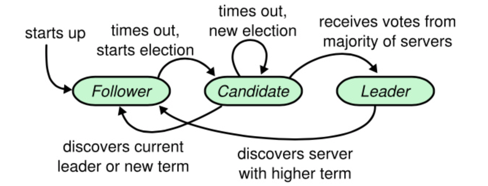
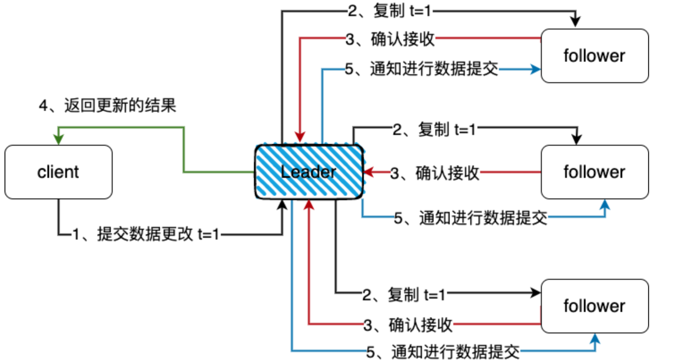
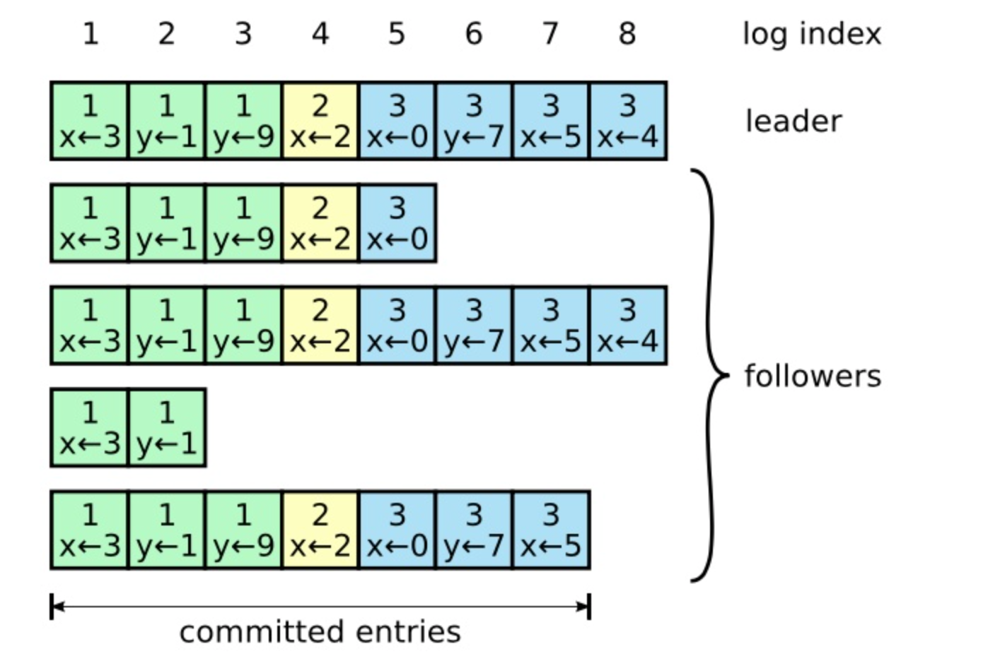
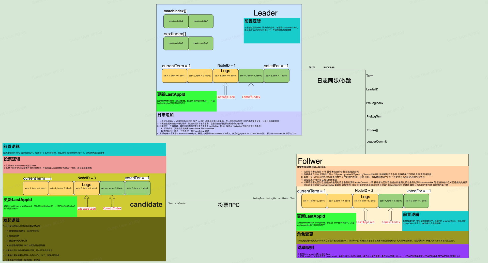
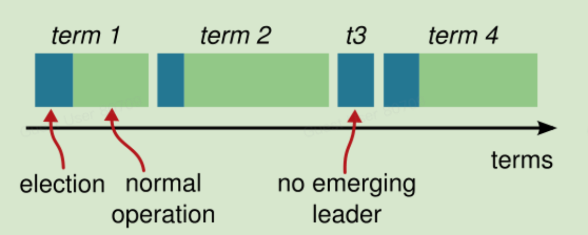
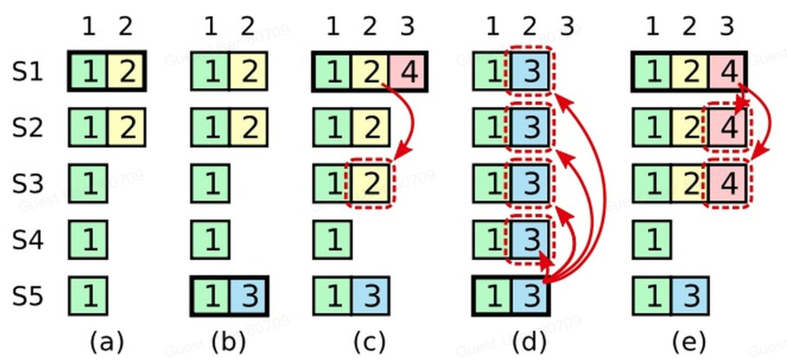
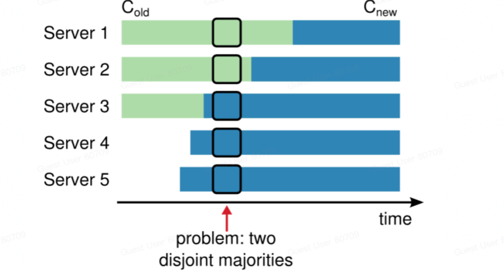
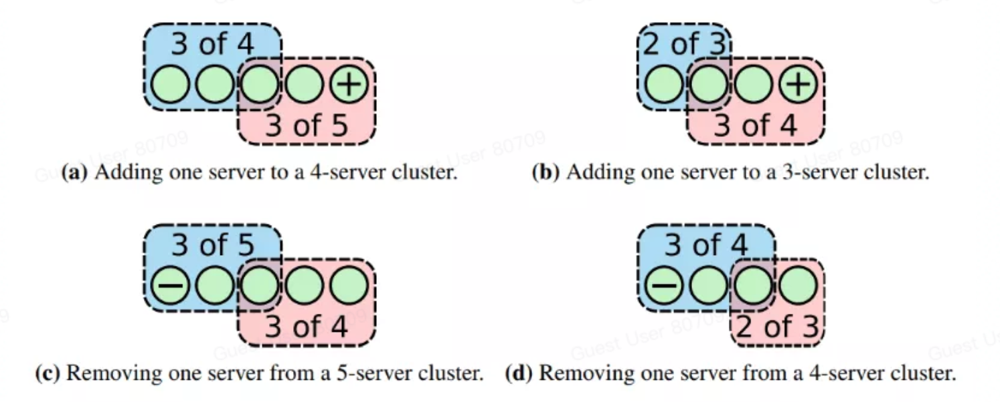

# 简介

Raft 算法可以说是目前最成功的分布式共识算法，包括 TiDB、FaunaDB、Redis 等都使用了这种技术。原因是 Multi-Paxos 没有具体的实现细节，虽然它给了开发者想象空间，但共识算法一般居于核心位置，一旦存在潜在问题必然带给系统灾难性的后果。而 Raft 算法给出了大量的实现细节，且处理方式相比于 Multi-Paxos 有两点优势。

## 相关术语

|英文|中文|
|:----|:----|
|Term|选举任期，每次选举之后递增1|
|Vote|选举投票(的ID)|
|Entry|Raft算法的日志数据条目|
|candidate|候选人|
|leader|领导者|
|follower|跟随者|
|commit|提交|
|propose|提议|

# Raft 基本原理

## 对比Paxos

Zookeeper的ZAB，Viewstamped Replication（VR），raft，multi-paxos，这些都可以被称之为Leader-based一致性协议。不同的是，multi-paxos leader是作为对经典 paxos 的优化而提出，通过选择一个 proposer 作为 leader 降低多个 proposer 引起冲突的频率，提升性能将一次决议的平均消息代价缩小到最优的两次，实际上就算有多个leader存在，算法还是安全的，只是退化为经典的paxos算法。

相同点：

1、Multi-paxos和Raft都用一个数字来标识leader的合法性，multi-paxos中叫proposer-id，Raft叫term

2、法定数量(半数以上)的follows确认之后才会进行commit

不同点：

1、proposer & leader

Paxos 的 proposer是可以有多个，所以他叫做proposer，而不叫 Leader。Raft协议比Paxos的优点是 容易理解，容易实现。它强化了leader的地位，把整个协议可以清楚的分割成两个部分，并利用日志的连续性做了一些简化：

（1）Leader在时。由Leader向Follower同步日志

（2）Leader挂掉了，选一个新Leader，Leader选举算法。

2、日志的连续性

Raft协议强调日志的连续性，multi-paxos 则允许日志有空洞。 日志的连续性蕴含了这样一条性质：如果两个不同节点上相同序号的日志，term相同，那么这和这之前的日志必然也相同的。

Raft 可以看成是 Multi-Paxos 的改进算法。相比而言 Raft 算法给出了大量的实现细节，且处理方式相比于 Multi-Paxos 有两点优势。

1. 发送的请求的是连续的，也就是说 Raft 的写日志操作必须是连续的；而 Multi-Paxos 可以并发修改日志，这也体现了“Multi”的特点。
2. 选主必须是最新、最全的日志节点才可以当选，这一点与 ZAB 算法有相同的原则；而 Multi-Paxo 是随机的。因此 Raft 可以看成是简化版本的 Multi-Paxos，正是这个简化，造就了 Raft 的流行。
## 定义问题

1. 输入：输入命令
2. 输出：所有节点最终处于相同状态
3. 约束
    1. 网络不确定性：在非拜占庭情况下（即非受信网络），出现网络 分区/冗余/丢失/乱序 等问题下要保证数据状态正确
    2. 基本可用性：集群中大部分节点能够保持相互通信，集群就应该能够正确响应客户端
    3. 不依赖时序：不依赖物理时钟或极端的消息延迟来保证一致性
    4. 快速响应：对客户端请求的响应不能依赖集群中最慢的节点
## 拆解问题

raft 将一致性问题分解为3个子问题：

1. 领导者选举
>现有领导者失效时，需要选举新的领导者

2. 日志复制
>领导者需要通过复制保持所有服务器的日志与自己的同步

3. 安全性
>如果其中一个服务器在特定索引上提交了日志条目，那么其它服务器不能在该索引应用不同的日志条目

## 一个可行解

1. 初始化时有一个领导者节点，负责发送日志到其他跟随者，并决定日志的顺序
2. 当读请求到来时，在任意节点都可以读，而写请求只能重定向到领导者处理
3. 领导者先写入自身的日志，然后同步给半数以上节点，跟随者成功复制日志，领导者才提交日志
4. 日志最终由领导者先按顺序应用于状态机，其它跟随者随机应用到状态机
5. 当领导者崩溃后，其它跟随者通过心跳感知并选举出新的领导者继续集群的正常运转
6. 当有新的节点加入或退出集群，需要将配置信息同步给整个集群

# Raft 选举

## 状态机

在 raft 算法中，任意时刻每个服务器节点都处于这三个状态之一：

* Follower：追随者
>跟随者都是被动的，不会发送任何请求，只是简单的响应来自领导者或候选人的请求

* Candidate：候选人
>如果跟随者接收不到消息，那么它就会变成候选人并发起一次选举，获得集群中大多数选票的候选人将成为领导者

* Leader：领导者
>系统中只有一个领导者并且其它节点全部都是跟随者，领导者处理所有的客户端请求（如果一个客户端和跟随者联系，那么跟随者会把请求重定向给领导者）

## 任期

Raft 将时间划分为任意长度的任期，每个任期都以一次选举开始。如果一个候选者赢得选举，在剩下的任期时间内都是领导者。每个任期最多有一个领导者（投票出现分歧则没有领导者）。

任期号单调递增，每个服务器存储当前任期号，并在每次通信中交换该任期编号。

如果一个服务器的当前任期号小于其他服务器，那么它将把当前任期更新为更大的值。如果候选人或领导者发现其任期已过期，则立即转化为追随者状态。如果服务器接收到带有过期任期号的请求，将拒绝请求。

## Leader 选举

领导者定期向跟随者发送心跳来维持自己的 Leader 角色。如果跟随者在一定的时间内没有接收到任何的消息，也就是选举超时，那么它就会认为系统中没有可用的领导者，并且发起选举以选出新的领导者。

开始一次选举，跟随者先要增加自己的当前任期号并且转换到候选人状态。然后并行地向集群中的其它服务器节点发送请求投票的 RPCs 来给自己投票。

候选人的选举会有下面三种结果：

1、候选人自己成为 Leader；

2、其他服务成为 Leader

3、候选人没有选出 Leader，可能是多个跟随者同时成为候选人，然后选票被瓜分导致没有候选人能获得最大的票数。

对于选举过程选票被瓜分的情况，Raft 算法使用随机候选超时时间的方法来确保很少会发生选票瓜分的情况，就算发生也能很快地解决。如下选举的随机算法：

1. 为了防止选票期初就被瓜分，候选超时时间是从一个固定的区间（如：150-300ms）随机选择；
2. 这个候选超时时间就是 Follower 要等待成为 Candidate 的时间；
3. 每个候选人在开始一次选举时会重置一个随机候选的时间，也就是 150-300ms 中的随机值；
4. 这个时间结束后 Follower 变成 Candidate 开始选举，不同时间苏醒竞争 Leader，苏醒时间早就有竞争优势；
5. 这样大大减少选票被瓜分的情况，如果选票还是被瓜分就继续从第 1 步开始。
## 日志复制

一旦 Leader 被选举成功，就可以对客户端提供服务。客户端提交的每一条命令都会被顺序记录到 Leader 的命令中，每一条命令都包含 Term 编号和顺序索引，然后向其它节点并行发送 AppendEntries RPC 命令用以复制命令（如果命令丢失会不断重发），当大多数节点复制成功后，Leader 就会提交命令，即执行该命令并且将执行结果返回给客户端，Raft 保证已经提交的命令最终也会被其它节点成功执行。

具体流程如下：

1. 所有请求都先经过 Leader，每个请求首先以日志的形式保存在 Leader 中，然后日志的状态是 uncommited 状态；
2. Leader 将这些更改的请求发送到 Follower；
3. Leader 等待大多数的 Follower 确定提交；
4. Leader 在等待大多数的 Follower 确定提交后，commit 这些更改，提交这个信息到自己的状态机中，然后通知客户端更新的结果；
5. 同时 Leader 会不断的尝试通知 Follower 去存储所有更新的信息。

日志由有序编号（log index）的日志条目组成。每个日志包含它被创建时的任期号（term），和用于状态机执行的命令。如果一个日志条目被复制到大多数服务器上，就被认为可以提交（commit）了。

Raft 日志同步保证如下两点：

* 如果不同日志中的两个条目有相同的索引和任期号，则它们所储存的命令是相同的
* 如果不同日志中的两个条目有相同的索引和任期号，则它们之前的所有日志条目都是相同的
第一条特性源于Leader在一个 term 内在给定的一个 log index 最多创建一条日志条目，同时该条目在日志中的位置也从来不会改变。

第二条特性：Raft算法在发送日志复制请求时会携带前置日志的 term 和 logIndex 值（即 prevLogTerm 和 prevLogIndex），只有在 prevLogTerm 和 prevLogIndex 匹配的情况下才能成功响应请求。如果 prevLogTerm 和 prevLogIndex 不匹配，则说明当前节点可能是新加入的、或者之前服从于其它 Leader，亦或当前节点之前是 Leader 节点。为了兑现承诺二，Leader 节点需要与该 Follower 节点向前追溯找到 term 和 logIndex 匹配的那条日志，并使用Leader节点的日志强行覆盖该 Follower 此后的日志数据。

# Raft 详细实现

## 数据结构

## 各类状态

### 通用持久性状态

|参数|解释|
|:----|:----|
|currentTerm|服务器已知最新任期（服务器首次启动时初始化为0，单调递增）|
|votedFor|当前任期内收到选票的候选者id，如果没有投给任何候选者则为空|
|log[]|日志条目；每个条目包含用于状态机的命令，以及领导者接收到该条目时的任期（第一个索引为1）|

### 通用易失性状态

|参数|解释|
|:----|:----|
|commitIndex|已知已提交的最高的日志条目的索引（初始值为0，单调递增）|
|lastApplied|已知被应用到状态机的最高的日志条目的索引（初始值为0，单调递增）|

### 领导者上的易失性状态

|参数|解释|
|:----|:----|
|nextIndex[]|对于每一台服务器，发送到该服务的下一个日志条目的索引（初始值为领导者最后的日志条目的索引+1）|
|matchIndex[]|对于每一台服务器，已知的已经复制到该服务器的最高日志条目的索引（初始值为0，单调递增）|

## RPC

候选人发起选举投票RPC到跟随者或候选人

由领导者发起RPC到跟随者

a. 日志追加

b. 心跳通知

### 请求投票

1. 跟随者变更为候选人后
2. 选举超时后
#### 请求参数

|参数|解释|
|:----|:----|
|term|候选人的任期号|
|candidateId|请求选票的候选人的id|
|lastLogIndex|候选人的最后日志条目的索引值|
|lastLogTerm|候选人最后日志条目的任期号|

#### 返回值

|返回值|解释|
|:----|:----|
|term|当前任期号，以便于候选人去更新自己的任期号|
|voteGranted|候选人赢得了此张选票时为真|

### 追加日志&心跳（领导者调用）

>1. 客户端发起写命令请求时
>2. 发送心跳时
>3. 日志匹配失败时

#### 请求参数

|参数|解释|
|:----|:----|
|term|当前领导者的任期|
|leaderId|领导者ID，因此跟随者可以对客户端进行重定向|
|prevLogIndex|紧邻新日志条目之前的那个日志条目的索引|
|prevLogTerm|紧邻新日志条目之前的那个日志条目的任期|
|entries[]|需要被保存的日志条目（被当做心跳使用时 则日志条目内容为空；为了提高效率可能一次性发送多个）|
|leaderCommit|领导者的已知已提交的最高的日志条目的索引|

#### 返回值

|返回值|解释|
|:----|:----|
|term|当前任期，对于领导者而言会更新自己的任期|
|success|结果为真，如果跟随者所含有的条目和prevLogIndex以及prevLogTerm匹配上了|

# Raft 算法原理与证明

## 基本原则与特性

### 选举安全特性

对于一个给定的任期号，最多只会有一个领导人被选举出来

>在一个任期内半数以上的票数才能当选，保证每个任期要么0个领导要么1个领导

### 领导人只附加原则

领导人绝对不会删除或者覆盖自己的日志，只会增加

### 日志匹配原则

如果两个日志在相同的索引位置的日志条目的任期号相同，那么就认为这个日志从头到这个索引位置之间全部完全相同

1. 因为 集群在任意时刻最多有一个 leader 存在，leader在一个任期内只会在同一个索引处写入一次日志
2. 又因为 领导者从来不会删除或者覆盖自己的日志，并且日志一旦写入就不允许修改
3. 所以 只要任期和索引相同，那么在任何节点上的日志也都相同
4. 因为跟随者每次只会从与 leader 的 PreLog 匹配出追加日志，如果不匹配则 nextIndex-1 重试
5. 所以 由递归的性质可知一旦跟随者和 leader 在 PreLog 处匹配，那么之前的所有日志就都是匹配的
6. 所以 只要把 PreLog 之后的日志全部按此次 Leader 同步 RPC 的日志顺序覆盖即可保证二者的一致性

### 领导人完全特性

如果某个日志条目在某个任期号中已经被提交，那么这个条目必然出现在更大任期号的所有领导者中

### 状态机安全特性

如果一个领导者已经将给定的索引值位置的日志条目应用到状态机中，那么其它任何的服务器在这个索引位置不会应用到一个不同的日志

## 安全性

每一任的领导者是否一定会有所有任期内领导者的全部已提交日志？

### 选举限制

选民只会投票给任期比自己大，最后一条日志比自己新（任期大于 或 等于时索引更大）的候选人。

这个存在一个问题，如下图示：

1. 时刻a，S1 是任期2的领导者并且想部分节点（S1和S2）复制了2号位置的日志条目，然后宕机
2. 时刻b，S5 获得了 S3、S4（S5 的日志与 S3 和 S4 的一样新，最新的日志的任期号都是1）和自己的选票赢得了选举，成了3号任期的领导者，并且在2号位置上写入了一个任期号为3的日志条目。在新日志条目复制到其他节点之前，S5 宕机了。
3. 时刻c，S1 重启，并且通过 S2、S3、S4 和自己的选票赢得了选举，成了4号任期的领导人，并且继续向 S3 复制2号位置的日志。此时，任期2的日志条目已经在大多数节点上完成了复制。
4. 时刻d，S1 发生故障，S5 通过 S2、S3 的选票再次成为领导者（因为 S5 最后一条日制条目的任期号是 3，比 S2、S3、S4 中任意一个节点上日志都更加新些），任期号为5。然后 S5 用自己的本地日志也写了其它节点上的日志
5. 上面这个例子生动地说明了，即使日志条目被半数以上的节点写盘（复制）了，也并不代表它已经被提交了（commited）到 Raft 集群了——因为一旦某条日志被提交，那么它将永远没法被删除或修改。这个例子同时也说明了，领导人无法单纯地依靠之前任期的日志条目信息判断它的提交状态
6. 因此针对以上场景，Raft算法对日志提交条件增加了一个额外的限制：要求Leader在当前任期至少有一条日志被提交，即被超过半数的节点写盘。
7. 正如上图中e描述的那样，S1 作为 Leader，在崩溃之前，将3号位置的日志（任期号为4）在大多数节点上复制了一条日志条目（指的是条目3，term 4），那么即使这时 S1 宕机了，S5 也不可能赢得票。无法赢得选举，这就意味着2号位置的日志条目不会被覆写。
**所以新上任的领导者在接受客户端写入命令之前，需要提交一个 no-op（空命令），携带自己任期号的日志复制到大多数集群节点上才能真正的保证选举限制的成立。**

### 状态机安全性证明(三段论)

1. 定义 A为上个任期最后一条已提交日志，B为当前任期的 leader
2. 因为 A必然同步到了集群中的半数以上节点
3. 又因为 B只有获得集群中半数以上节点的选票后才能成为 leader
4. 所以 B的选民必然存在拥有A日志的节点
5. 又因为 选举限制，B成为leader的前提是比给它投票的所有选民都要新
6. 所以 B的日志中必然要包含A
7. 又因为 日志完全匹配规则，如果A被包含，那么比A小的所有日志都被B包含
8. 因为 lastAppied <= commitIndex
9. 又因为 raft保证已提交日志在所有集群节点上的顺序一致
10. 所以 应用日志必然在所有节点上顺序一致
11. 因为 状态机只能按序执行应用日志部分
12. 得证 状态机在整个集群所有节点上必然 最终一致
### 状态机安全性证明(反证法)

1. 当日志条目L被同步给半数以上节点时，leader A会移动 commitIndex 指针提交日志，此时的日志被提交
2. 当 leader 崩溃后，由一个新节点成为 leader B，假设 leader B 是第一个未包含 leader A 最后已提交日志的领导者
3. 选举过程中，只有获得半数以上节点认可才能成为 leader，因此至少有一个投票给当前 leader B 的节点中含有已经提交的那条日志L。
4. 那么根据选举限制，节点只会将选票投给至少与自己一样新的节点
    1. 节点C作为包含 leader A 最后提交日志条目的投票者，如果 leader B 与节点 C 的最后一条日志的任期号一样大时，节点 C 的条目数一定大于 leader B，因为 leader B 是第一个未包含最后一条 leader A 日志的领导者。这与选举限制相矛盾，节点 C 不会投票给 leader B
    2. 如果 leader B 最后一条日志的任期号大于节点 C 最后一条日志的任期号，那么 leader B 的前任领导中必然包含了 leader A 已经提交的日志（leader B 是第一个不包含 leader A 已提交日志的领导者 这一假设）。根据日志匹配特性 leader B 也必包含 leader A 最后的已提交日志，这与假设矛盾。
5. 所以证明 未来所有的临高这必然包含过去领导者已提交的日志，并且日志匹配原则，所有已提交日志的顺序一定是一致的。
6. 又因为 任意节点仅会将已提交日志按顺序应用于自身的状态机，更新 lastApplied 指针，因此所有节点的状态机都会最终顺序一致。
7. 得证 raft 算法能够保证节点之间的协同工作。
### 常见问题

#### 新Leader未同步前任committed数据

问题描述：

>Leader 宕机后选出的新 Leader 没有同步前任 committed 数据，新leader节点会强行覆盖集群中其它节点与自己冲突的日志数据。

解决方法：

>这种情况 Raft 会对参加选举的节点进行限制，只有包含已经 committed 日志的节点才有机会竞选成功。
>1. 参选节点的 term 值大于等于投票节点的 term 值
>2. 如果 term 值相等，则参选节点的 lastLogIndex 大于等于投票节点的 lastLogIndex 值

#### Leader在将日志复制给Follower节点之前宕机

如果在复制之前宕机，这时消息处于uncommitted状态，新选出的 Leader 一定不包含这些日志信息，所以新的 Leader 会强制覆盖 Follower 中跟自己冲突的日志，也就是刚刚宕机的Leader，如果变成follower，它未同步的信息会被新的 Leader 覆盖掉。

#### Leader在将日志复制给Follower节点之间宕机

在复制的过程中宕机，会有两种情况：

1. 只有少数的 Follower 被同步到了；
>如果只有少数的 Follower 被同步了，新的 Leader 不会包含这些信息，新的 Leader 会覆盖那些已经同步的节点的信息。

2. 大多数的 Follower 被同步到了。
>Leader 在复制的过程中宕机，消息肯定没有 commit ，新的 Leader 需要再次尝试将其复制给各个 Follower 节点，并依据自己的复制状态决定是否提交这些日志。

#### Leader在响应客户端之前宕机

这种情况根据上面的同步机制可以知道，消息肯定是 committed 状态，新的 Leader 肯定包含这个信息，但是新任 Leader 可能还未被通知该日志已经被提交，不过这个信息在之后一定会被新任 Leader 标记为 committed。

不过对于客户端可能超时拿不到结果，认为本次消息失败了，客户端需要考虑幂等性。

## 时间和可用性

Raft 的要求之一就是安全性不能依赖时间：整个系统不能因为某些事件运行的比预期快一点或者慢一点就产生了错误的结果。但是可用性（系统可以及时的响应客户端）不可避免的要依赖于时间。

领导人选举是 Raft 中对时间要求最为关键的方面。Raft 可以选举并维持一个稳定的领导人，只要系统满足下面的时间要求：

>广播时间（broadcastTime） << 候选超时时间（electionTimeout） << 平均故障间隔时间（MTBF）

# 工程优化

## 容错性

1. 领导者崩溃通过选举可以解决，但跟随者与候选人崩溃呢？
>基础的 raft 算法，通过无限次幂等的附加复制 rpc 进行重试来解决

2. 当平均故障时间大于信息交换时间，系统将没有一个稳定的领导者，集群无法工作
>广播时间 << 心跳超时时间 << 平均故障时间

3. 客户端如何连接 raft 的 server 节点？
>客户端随机选择一个节点去访问，如果是跟随者，跟随者会把自己知道的领导者告知客户端

4. 领导者提交后返回时崩溃，客户端重试不就导致相同的命令反复执行了吗？
>客户端为每次请求标记唯一序列号，服务端在状态中维护客户端最新的序列号标记，进行幂等处理

5. 客户端给领导者 set a=3 并进行了提交，此时客户端如果从一个未被同步的节点读取a读不到写后的值
>每个客户端应该维持一个 latestIdx 值，每个节点在接受请求的时候与自己的 lastApplied 值比较，如果这个值大于自己的 lastApplied，则拒绝此次请求，客户端重定向到一个 lastApplied 大于等于自己 latestIdx 的请求，并且每次读取请求都会返回这个节点的 lastApplied 值，客户端将 lastestIdx 更新为此值，保证读取的线性一致。

6. 如果 leader 被孤立，其它跟随者选举出 leader，但是当前 leader 还是向外提供脏数据怎么办？
>写入数据由于无法提交，因此会立即失败，但无法防止读到脏数据。
>解决办法是：心跳超过半数失败，leader 感知到自己处于少数分区而被孤立进而拒绝提供读写服务

7. 当出现网络分区后，被孤立少数集合的节点无法选举，只会不断地增加自己的任期，分区恢复后由于失联的节点任期更大，会强行更新所有节点的任期，触发一次重新选举，而又因为其日志不够新，被孤立的节点不可能成为新的 leader 。所以其状态机是安全的，只是触发了一次重新选举，使得集群有一定时间的不可用。这是完全可以避免的。
>在跟随者成为候选人时，先发送一轮 pre-vote rpc 来判断自己是否在大多数分区内（是否有半数节点回应自己），如果是则任期加 1 进行选举。否则的话就不断尝试 pre-vote 请求。

## 扩展性

1. 集群的成员发生变化时，存在某一时刻新老配置共存，进而有选举出两个领导者的可能

1. 新集群节点在配置变更期间必须获得老配置的多数派投票才能成为 leader
2. 发送新配置 c-new 给集群的领导者
3. 领导者将自己的 c-old 配置与 c-new 合并为一个 c-old-new 配置【123-45】
4. 然后下发给其他所有跟随者
    1. 当 c-old-new 被同步给半数以上节点后，那么此配置已经提交，遵循 raft 安全性机制
    2. 当 leader 在将 c-old-new 写入半数以上跟随者之前崩溃了，那么选举出来的新 leader 会退回到老的配置，此时重试更新配置即可
5. 当 c-old-new 被提交之后，leader 会真正的提交 c-new 配置
    1. 如果提交给了半数节点，则 c-new 真正地被提交
    2. 如果未提交给半数节点时崩溃，则新选举的 leader 必定包含已提交的 c-old-new 那么接着更新配置即可
**集群变更过于复杂，因此可以简化这一过程，使用单节点变更机制，即每一次只添加或删除一个节点**

1. 单节点变更时，如果 leader 挂了造成一致性问题（丢失已提交日志）如何处理？
>新 leader 先发一条 no-op 日志再开始配置变更
>可参考：[Raft成员变更的工程实践](https://zhuanlan.zhihu.com/p/359206808)

2. 单节点变更时偶数节点遇到网络分区，则没有办法选举 leader 了怎么办？
>重新定义偶数节点情况下的 法定人数模型下的大多数情况(n/2 或 n/2-1)
>可参考：
>[TiDB 在 Raft 成员变更上踩的坑](https://blog.openacid.com/distributed/raft-bug/)
>[后分布式时代: 多数派读写的’少数派’实现](https://blog.openacid.com/algo/quorum/)

3. 新的服务器没有存储任何日志，领导要复制很长一段时间，此时不能参加选举否则会使得整体不可用
>新加入的节点设置一个保护期，再次保护期内不会参加选举与日志提交决策，只用来同步日志

4. 如果集群的领导不是新集群中的一员，该如何处理？
>在提交 c-new 时，不将自己算作半数提交，并且在提交后要主动退位

5. 被移除的节点如果不及时关闭，会导致选举超时后强行发起投票请求干扰在线集群
>每个节点如果未达到最小心跳时间，则不会进行投票

## 性能提升

1. 生成快照
1）日志如果无线增长会将本地磁盘打满，会造成可用性问题

>定期地将状态机中的状态生成快照，而将之前的日志全部删除，是一种常见的压缩方式
>1. 将节点的状态保存为 LSM Tree，然后存储最后应用日志的索引与任期，以保证日志匹配特性
>2. 为支持集群的配置更新，快照中也要将最后应用的集群配置也当做状态保存下来
>3. 当跟随者需要的日志已经在领导者上面被删除时（netxtIndex--），需要将快照通过RPC发送过去
>>注意：由领导人调用以将快照的分块发送给跟随者。领导者总是按顺序发送分块。

|参数|解释|
|:----|:----|
|term|领导人的任期号|
|leaderId|领导人的Id，以便于跟随者重定向请求|
|lastIncludedIndex|快照中包含的最后日志条目的索引值|
|lastincludedTerm|快照中包含的最后日志条目的任期号|
|offset|分块在快照中的字节偏移量|
|data[]|从偏移量开始的快照分块的原始字节|
|done|如果这时最后一个分块则为 true|

|结果|解释|
|:----|:----|
|term|当前任期号（currentTerm），便于领导人更新自己|

2）快照何时创建？过于频繁会浪费性能，过于低频日志占用磁盘的量更大，重建时间更长。

>限定日志文件大小到达某一个阈值后立刻生成快照

3）写入快照花费的时间昂贵如何处理？如何保证不影响节点的正常工作？

>使用写时复制技术，状态机的函数式顺序性天然支持

2. 调节参数
>1. 心跳的随机时间，过快会增加网络负载，过慢则会导致告知领导者崩溃的时间更长
>2. 选举的随机事件，如果大部分跟随者同时变为候选人则会导致选票被瓜分

3. 流批组合
>首先可以做的就是 batch，很多情况下 batch 可以明显提升性能，譬如对于 RocksDB 的写入来说，通过不会每次写入一个值，而是会用一个 WriteBatch 缓存一批修改，然后再整个写入。对于 Raft 来说，Leader 可以一次收集多个 requests，然后一批发送给 Follower。当然需要有一个最大发送 size 来限制每次最多可以发送数据
>>如果只是用 batch，Leader 还是需要等待 Follower 返回才能继续后面的流程，这里还可以使用 Pipeline 来进行加速。大家知道，Leader 会维护一个 NextIndex 的变量来表示下一个给 Follower 发送的 log 位置，通常情况下只要 Leader 跟 Follower 建立起了连接，都会认为网络是稳定互通的。所以只要当 Leader 给 Follower 发送了一批 log 后，可以直接更新 NextIndex，并且立刻发送后面的 log，不需要等待 Follower 的返回。如果网络出现了错误，或者 Follower 返回一些错误，Leader 就需要重新调整 NextIndex，然后重新发送 log 了。

4. 并行追加
>对于上面提到的一次 request 简易 Raft 流程来说，Leader 可以先并行地将 log 发送给 Followers，然后再将 log append。这么做的原因主要是因为在 Raft 里面，如果一个 log 被大多数的节点 append，我们就可以认为这个 log 是被 committed 了，所以即使 Leader 再给 Follower 发送 log 之后，自己 append log 失败 panic 了，只要 N/2+1 个 Follower 能接收都这个 log 并成功 append，仍然认为这个 log 是被 commited 了，被 commited 的 log 后续就一定能被成功 apply。
>>这么做的原因主要是因为 append log 会涉及到落盘，有开销，所以完全可以在 Leader 落盘的同时让 Follower 也尽快地收到 log 并 append
>这里还需要注意，虽然 Leader 能在 append log 之前给 Follower 发 log，但是 Follower 却不能在 append log 之前告诉 Leader 已经成功 append 这个 log。如果 Follower 提前告诉 Leader 说已经成功 append，但实际后面 append log 时失败了，Leader 仍然会认为这个 log 是被 committed 了，这样系统就有丢失数据的风险了。

5. 异步应用
>上面提到，当一个 log 被大部分节点 append 后，就可以认为这个 log 被 committed 了，被 committed 的 log 在什么时候被 apply 都不会再影响数据的一致性。所以当一个 log 被 committed 之后，可以用另一个线程去异步地 apply 这个 log。
>所以整个 Raft 流程就可以变成：
>1. Leader 接收一个 client 发送的 request
>2. Leader 将对应的 log 发送给其他 follower 并本地 append
>3. Leader 继续接受其他 client 的 requests，持续进行步骤2
>4. Leader 发现 log 已经被 committed，在另外一个线程 apply
>5. Leader 异步 apply log 之后，返回结果给对应的 client
>使用 asychronous apply 的好处在于现在可以完全地并行处理 append log 和 apply log，虽然对于一个 client 来说，它的一次 request 仍然要走完完整的 Raft 流程，但对于多个 clients 来说，整体的并发和吞吐量是提升了。

# Reference

[Raft 官网](https://raft.github.io/)

[Raft 算法动画演示](http://thesecretlivesofdata.com/raft/#election)

[Raft 算法演示](https://ongardie.github.io/raft-talk-archive/2015/buildstuff/raftscope-replay/)

[etcd学习(5)-etcd的Raft一致性算法原理](https://www.cnblogs.com/ricklz/p/15094389.html)

[TiKV 功能介绍 - Raft 的优化](https://pingcap.com/zh/blog/optimizing-raft-in-tikv)

[TiDB 在 Raft 成员变更上踩的坑](https://blog.openacid.com/distributed/raft-bug/)

[Raft算法原理](https://www.codedump.info/post/20180921-raft/)

