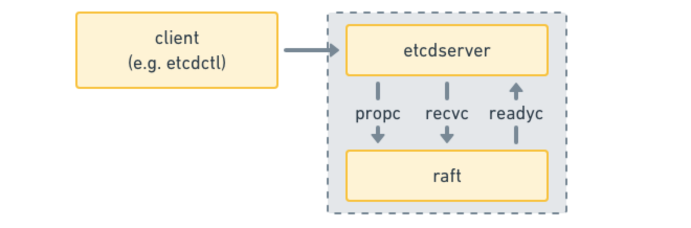
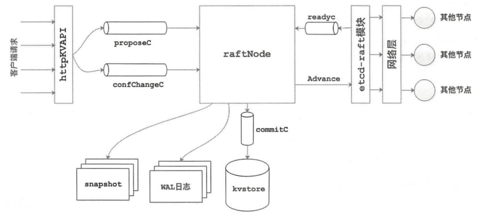
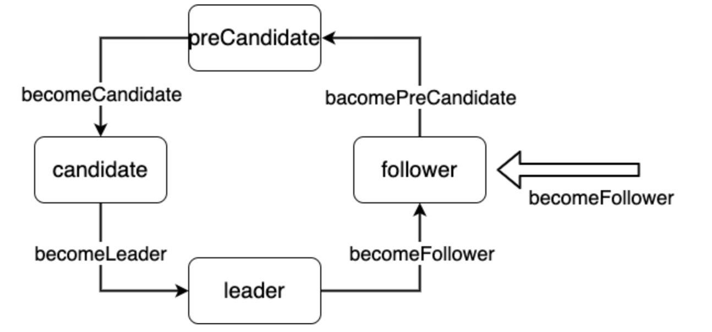
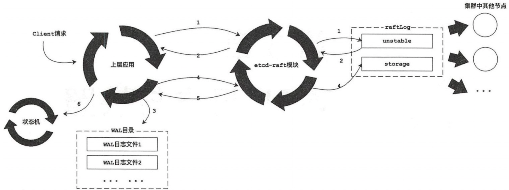
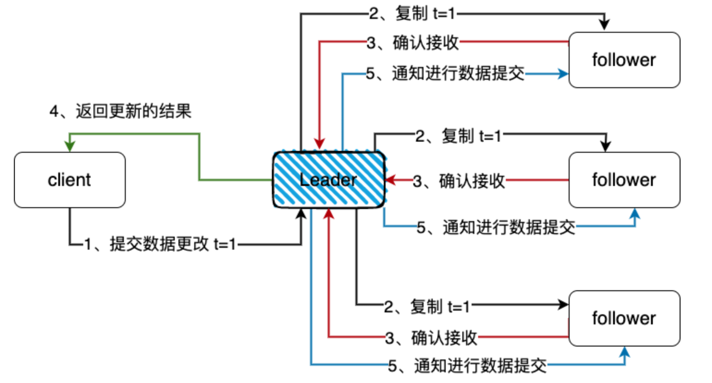
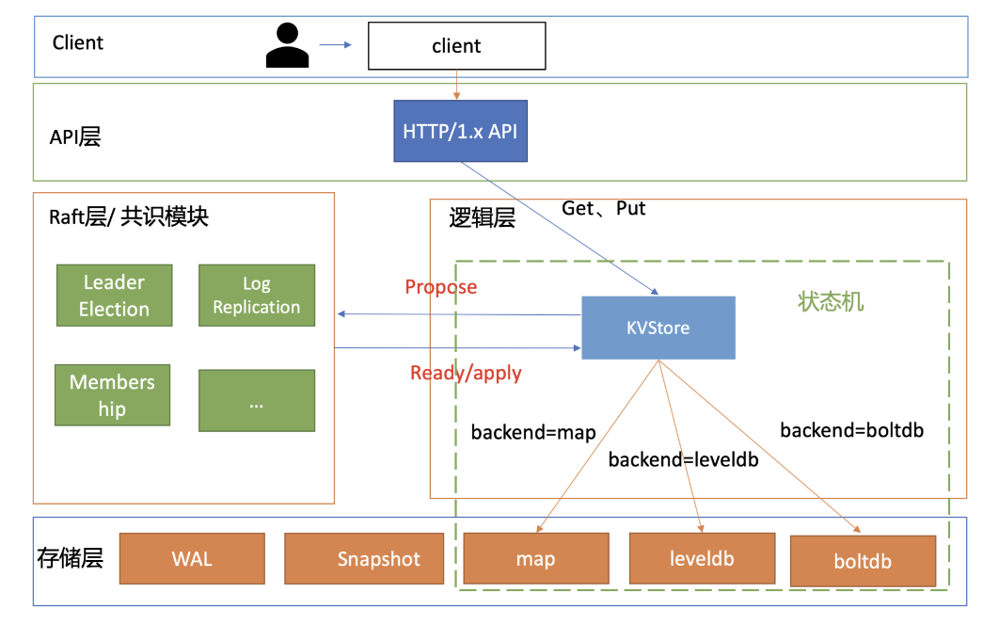
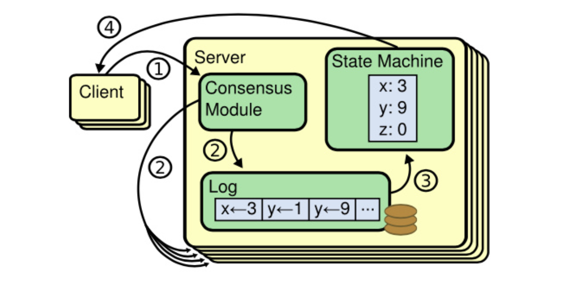
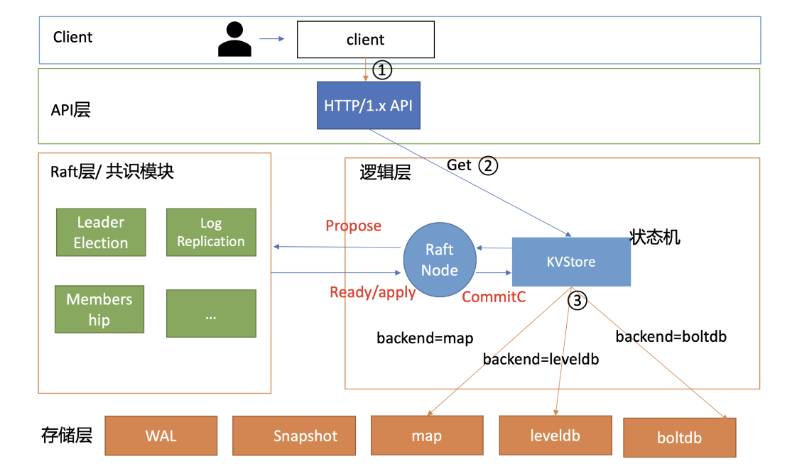

# 前言

本文源码分析代码参考 etcd v3.5.0 中 raft 代码：

[https://github.com/etcd-io/etcd/tree/v3.5.0/contrib/raftexample](https://github.com/etcd-io/etcd/tree/v3.5.0/contrib/raftexample)

Etcd 将 raft 协议实现为一个 library，然后本身作为一个应用使用它。此外，etcd 还提供了一个叫 raftexample 的示例程序。

在 etcd 中，raft 作为底层的共识模块，运行在一个 goroutine 里，通过 channel 接受上层（etcdserver）的消息，并将处理结果通过另一个 channel 返回给上层应用，交互过程大致如下：




这种全异步地交互方式好处是提高了性能，坏处是难以测试，增加代码阅读难度。


# 基本概念

源码中定义的一些变量概念

* Node: 对 etcd-raft 模块具体实现的一层封装，方便上层模块使用 etcd-raft 模块；
* 上层模块: etcd-raft 的调用者，上层模块通过Node提供的API与底层的 etcd-raft 模块进行交互；
* Cluster: 表示一个集群,其中记录了该集群的基础信息；
* Member: 组层Cluster的元素之一，其中封装了一个节点的基本信息；
* Peer: 集群中某个节点对集群中另一个节点的称呼；
* Entry记录: 节点之间的传递是通过 message 进行的，每条消息中可以携带多条 Entry 记录,每条Entry对应一条一个独立的操作
```go
type Entry struct {
	// Term：表示该Entry所在的任期。
	Term  uint64    `protobuf:"varint,2,opt,name=Term" json:"Term"`
	// Index:当前这个entry在整个raft日志中的位置索引,有了Term和Index之后，一个`log entry`就能被唯一标识。  
	Index uint64    `protobuf:"varint,3,opt,name=Index" json:"Index"`
	// 当前entry的类型
	// 目前etcd支持两种类型：EntryNormal和EntryConfChange 
	// EntryNormaln表示普通的数据操作
	// EntryConfChange表示集群的变更操作
	Type  EntryType `protobuf:"varint,1,opt,name=Type,enum=raftpb.EntryType" json:"Type"`
	// 序列化后的具体操作数据
	Data  []byte    `protobuf:"bytes,4,opt,name=Data" json:"Data,omitempty"`
}
```

* Message: 是所有消息的抽象，包括各种消息所需要的字段，raft集群中各个节点之前的通讯都是通过这个message进行的。
```go
type Message struct {
	// 该字段定义了不同的消息类型，etcd-raft就是通过不同的消息类型来进行处理的，etcd中一共定义了19种类型
	Type MessageType `protobuf:"varint,1,opt,name=type,enum=raftpb.MessageType" json:"type"`
	// 消息的目标节点 ID，在急群中每个节点都有一个唯一的id作为标识
	To   uint64      `protobuf:"varint,2,opt,name=to" json:"to"`
	// 发送消息的节点ID
	From uint64      `protobuf:"varint,3,opt,name=from" json:"from"`
	// 整个消息发出去时，所处的任期
	Term uint64      `protobuf:"varint,4,opt,name=term" json:"term"`
	// 该消息携带的第一条Entry记录的的Term值
	LogTerm    uint64   `protobuf:"varint,5,opt,name=logTerm" json:"logTerm"`
	// 索引值，该索引值和消息的类型有关,不同的消息类型代表的含义不同
	Index      uint64   `protobuf:"varint,6,opt,name=index" json:"index"`
	// 需要存储的日志信息
	Entries    []Entry  `protobuf:"bytes,7,rep,name=entries" json:"entries"`
	// 已经提交的日志的索引值，用来向别人同步日志的提交信息。
	Commit     uint64   `protobuf:"varint,8,opt,name=commit" json:"commit"`
	// 在传输快照时，该字段保存了快照数据
	Snapshot   Snapshot `protobuf:"bytes,9,opt,name=snapshot" json:"snapshot"`
	// 主要用于响应类型的消息，表示是否拒绝收到的消息。  
	Reject     bool     `protobuf:"varint,10,opt,name=reject" json:"reject"`
	// Follower 节点拒绝 eader 节点的消息之后，会在该字段记录 一个Entry索引值供Leader节点。
	RejectHint uint64   `protobuf:"varint,11,opt,name=rejectHint" json:"rejectHint"`
	// 携带的一些上下文的信息
	Context    []byte   `protobuf:"bytes,12,opt,name=context" json:"context,omitempty"`
}
```

* raftLog: Raft中日志同步的核心就是集群中leader如何同步日志到各个follower。日志的管理是在raftLog结构上完成的。
```go
type raftLog struct {
	// 用于保存自从最后一次snapshot之后提交的数据
	storage Storage
	// 用于保存还没有持久化的数据和快照，这些数据最终都会保存到storage中
	unstable unstable
	// 当天提交的日志数据索引
	committed uint64
	// committed保存是写入持久化存储中的最高index，而applied保存的是传入状态机中的最高index
	// 即一条日志首先要提交成功（即committed），才能被applied到状态机中
	// 因此以下不等式一直成立：applied <= committed
	applied uint64
	logger Logger
	// 调用 nextEnts 时，返回的日志项集合的最大的大小
	// nextEnts 函数返回应用程序已经可以应用到状态机的日志项集合
	maxNextEntsSize uint64
}
```

# raftexample

## 简介

raftexample 是一个 etcd raft library 的使用示例。它为Raft一致性算法的键值对集群存储提供了一个简单的 REST API。

## 总体架构图




## 启动

该包提供了goreman启动集群的方式，按照 README 使用 goreman start 启动，可以很清楚的看到 raft 在启动过程中的选举过程，能够很好的帮助理解 raft 的选举过程。

程序入口：

```go
contrib/raftexample/main.go:24
```

下面介绍主要的函数

## newRaftNode

在该函数中主要完成了 raftNode 的初始化 。在该方法中会使用上层模块传入的配置信息（其中包括 proposeC 通道和 confChangeC 通道）来创建raftNode实例，同时会创建 commitC 通道和 errorC 通道返回给上层模块使用 。这样上层模块就可以通过这几个通道与 rafeNode 实例进行交互。另外，newRaftNode() 函数中还会启动一个独立的后台 goroutine 来完成回放 WAL 日志、 启动网络组件等初始化操作。

```go
// contrib/raftexample/raft.go:87
// raftNode 初始化
// 使用上层模块传入的配置信息来创建 raftNode 实例，
// 同时创建 commitC 通道和 errorC 通道返回给上层模块使用
// 上层应用通过这几个 channel 就能和 raftNode 进行交互
func newRaftNode(id int, peers []string, join bool, getSnapshot func() ([]byte, error), proposeC <-chan string,
   confChangeC <-chan raftpb.ConfChange) (<-chan *commit, <-chan error, <-chan *snap.Snapshotter) {
   // channel，主要传输 Entry 记录
   // raftNode 会将 etcd-raft 模块返回的待应用 Entry 记录（封装在Ready实例中〉写入commitC通道，
   // 另一方面，kvstore 会从 commitC 通道中读取这些待应用的 Entry 记录井保存其中的键值对信息。
   commitC := make(chan *commit)
   errorC := make(chan error)
   rc := &raftNode{
      proposeC:    proposeC,
      confChangeC: confChangeC,
      commitC:     commitC,
      errorC:      errorC,
      id:          id,
      peers:       peers,
      join:        join,
      // 初始化存放 WAL 日志和 Snapshot 文件的的目录
      waldir:      fmt.Sprintf("raftexample-%d", id),
      snapdir:     fmt.Sprintf("raftexample-%d-snap", id),
      getSnapshot: getSnapshot,
      snapCount:   defaultSnapshotCount,
      stopc:       make(chan struct{}),
      httpstopc:   make(chan struct{}),
      httpdonec:   make(chan struct{}),
      logger: zap.NewExample(),
      snapshotterReady: make(chan *snap.Snapshotter, 1),
      // rest of structure populated after WAL replay
   }
   // 启动一个goroutine，完成剩余的初始化工作
   go rc.startRaft()
   return commitC, errorC, rc.snapshotterReady
}
```


## startRaft

1. 创建 Snapshotter，并将该 Snapshotter 实例返回给上层模块；
2. 创建 WAL 实例，然后加载快照并回放 WAL 日志；
3. 创建 raft.Config 实例，其中包含了启动 etcd-raft 模块的所有配置；
4. 初始化底层 etcd-raft 模块，得到 node 实例；
5. 创建 Transport 实例，该实例负责集群中各个节点之间的网络通信，其具体实现在 raft-http 包中；
6. 建立与集群中其他节点的网络连接；
7. 启动网络组件，其中会监听当前节点与集群中其他节点之间的网络连接，并进行节点之间的消息读写；
8. 启动两个后台的 goroutine，它们主要工作是处理上层模块与底层 etcd-raft 模块的交互，但处理的具体内容不同，后面会详细介绍这两个 goroutine 的处理流程。

```go
func (rc *raftNode) startRaft() {
   if !fileutil.Exist(rc.snapdir) {
      if err := os.Mkdir(rc.snapdir, 0750); err != nil {
         log.Fatalf("raftexample: cannot create dir for snapshot (%v)", err)
      }
   }
   rc.snapshotter = snap.New(zap.NewExample(), rc.snapdir)
   // 创建 WAL 实例，然后加载快照并回放 WAL 日志
   oldwal := wal.Exist(rc.waldir)
   // replayWAL() 方法首先会读取快照数据，
   // 在快照数据中记录了该快照包含的最后一条 Entry 记录的 Term 值 和 索引值。
   // 然后根据 Term 值 和 索引值确定读取 WAL 日志文件的位置，读取日志记录。
   rc.wal = rc.replayWAL()
   // signal replay has finished
   rc.snapshotterReady <- rc.snapshotter
   rpeers := make([]raft.Peer, len(rc.peers))
   for i := range rpeers {
      rpeers[i] = raft.Peer{ID: uint64(i + 1)}
   }
   // 创建 raft.Config 实例
   c := &raft.Config{
      ID:                        uint64(rc.id),
      // 选举超时
      ElectionTick:              10,
      // 心跳超时
      HeartbeatTick:             1,
      Storage:                   rc.raftStorage,
      MaxSizePerMsg:             1024 * 1024,
      MaxInflightMsgs:           256,
      MaxUncommittedEntriesSize: 1 << 30,
   }
   // 初始化底层的 etcd-raft 模块，根据 WAL 日志回放情况判断首次启动还是重新启动
   if oldwal || rc.join {
      rc.node = raft.RestartNode(c)
   } else {
      // 首次启动 
      rc.node = raft.StartNode(c, rpeers)
   }
   // 创建 Transport 实例并启动，其负责 raft 节点之间的网络通信服务
   rc.transport = &rafthttp.Transport{
      Logger:      rc.logger,
      ID:          types.ID(rc.id),
      ClusterID:   0x1000,
      Raft:        rc,
      ServerStats: stats.NewServerStats("", ""),
      LeaderStats: stats.NewLeaderStats(zap.NewExample(), strconv.Itoa(rc.id)),
      ErrorC:      make(chan error),
   }
   // 启动网络服务相关组件
   rc.transport.Start()
   // 建立与集群中其它节点的连接
   for i := range rc.peers {
      if i+1 != rc.id {
         rc.transport.AddPeer(types.ID(i+1), []string{rc.peers[i]})
      }
   }
   // 启动协程，监听当前节点与集群中其他节点之间的网络连接
   go rc.serveRaft()
   // 启动后台协程，处理上层应用与底层 etcd-raft 模块的交互
   go rc.serveChannels()
}
```

## serveChannels

用于处理上次应用于底层 etcd-raft 模块的交互

```go
// 单独启动一个后台协程负责上层模块传递给 etcd-raft 模块的数据
// 主要是 proposeC、confChangeC 两个通道
func (rc *raftNode) serveChannels() {
   // 获取快照数据和快照元数据
   snap, err := rc.raftStorage.Snapshot()
   if err != nil {
      panic(err)
   }
   rc.confState = snap.Metadata.ConfState
   rc.snapshotIndex = snap.Metadata.Index
   rc.appliedIndex = snap.Metadata.Index
   defer rc.wal.Close()
   // 定时器，推进逻辑时钟。100ms 是 etcd-raft 组件的最小时间单位
   ticker := time.NewTicker(100 * time.Millisecond)
   defer ticker.Stop()
   // 单独的协程负责接收 proposeC、confChangeC 的数据传递给 etcd-raft 组件处理 
   // send proposals over raft
   go func() {
      confChangeCount := uint64(0)
      for rc.proposeC != nil && rc.confChangeC != nil {
         select {
         case prop, ok := <-rc.proposeC:
            if !ok {
               // 异常时将 proposeC 置空
               rc.proposeC = nil
            } else {
               // 阻塞知道消息处理
               // blocks until accepted by raft state machine
               rc.node.Propose(context.TODO(), []byte(prop))
            }
         // 接收上层应用通过 confChangeC 传递的数据
         case cc, ok := <-rc.confChangeC:
            if !ok {
               // 异常时将 confChangeC 置空
               rc.confChangeC = nil
            } else {
               confChangeCount++
               cc.ID = confChangeCount
               rc.node.ProposeConfChange(context.TODO(), cc)
            }
         }
      }
      // 关闭 stopc 通道，触发调用 rafeNode.stop()
      // client closed channel; shutdown raft if not already
      close(rc.stopc)
   }()
   // 处理 etcd-raft 模块返回给上层模块的数据及其他相关操作
   // event loop on raft state machine updates
   for {
      select {
      case <-ticker.C:
         // 触发 tricker 定时器
         rc.node.Tick()
      // 读取 node.readyc 通道(etcd-raft组件与上层应用交互的主要channel之一)
      // Ready 实例封装了很多信息
      // store raft entries to wal, then publish over commit channel
      case rd := <-rc.node.Ready():
         // 将当前组件状态信息和待持久化的 Entry 记录保存到 WAL 日志文件中
         // 这样即使宕机，信息也可以在节点下次启动时，通过前面回放 WAL 日志的方式恢复
         rc.wal.Save(rd.HardState, rd.Entries)
         // 检测组件生成新的快照数据
         if !raft.IsEmptySnap(rd.Snapshot) {
            // 新的快照数据写入到快照文件中
            rc.saveSnap(rd.Snapshot)
            // 将新快照持久化到 raftStorage
            rc.raftStorage.ApplySnapshot(rd.Snapshot)
            // 通知上层应用加载新快照
            rc.publishSnapshot(rd.Snapshot)
         }
         // 将待持久化的 Entry 记录追加到 raftStorage 中完成初始化
         rc.raftStorage.Append(rd.Entries)
         // 将待发送消息发送到指定节点
         rc.transport.Send(rd.Messages)
         // 将已提交、待应用的 Entry 记录应用到上层应用的状态机中
         applyDoneC, ok := rc.publishEntries(rc.entriesToApply(rd.CommittedEntries))
         if !ok {
            rc.stop()
            return
         }
         // WAL 日志量和 raftLog.storage 中的 Entry 记录会不断增加
         // 节点每处理 1000 条(默认值) Entry 记录会触发一次创建快照的记录
         // 同时 WAL 会释放一些日志文件的句柄，raftLog.storage 也会压缩其保存的 Entry 记录
         rc.maybeTriggerSnapshot(applyDoneC)
         // 上层应用处理完该 Ready 实例，通知组件准备返回下一个 Ready 实例
         rc.node.Advance()
      case err := <-rc.transport.ErrorC:
         rc.writeError(err)
         return
      case <-rc.stopc:
         rc.stop()
         return
      }
   }
}
```

# 领导者选举

## 启动节点

Node 初始化时是 Follower 状态，集群的节点初次启动时会通过 StartNode() 启动创建对应的 node 实例和底层的 raft 实例。StartNode() 方法根据传入的 config 配置创建 raft 实例并初始raft 使用的相关组件。

代码入口：

```plain
newRaftNode() -> startRaft() -> StartNode()
```
StartNode 启动节点
```plain
// raft/node.go:218
// Peer封装了节点 ID, 且记录了当前集群中全部节点 ID
func StartNode(c *Config, peers []Peer) Node {
   if len(peers) == 0 {
      panic("no peers given; use RestartNode instead")
   }
   // 根据 config 初始化 RawNode，并且也初始化一个 raft
   rn, err := NewRawNode(c)
   if err != nil {
      panic(err)
   }
   // 第一次使用初始化 RawNode
   err = rn.Bootstrap(peers)
   if err != nil {
      c.Logger.Warningf("error occurred during starting a new node: %v", err)
   }
   // 初始化 node 实例
   n := newNode(rn)

   go n.run()
   return &n
}

func NewRawNode(config *Config) (*RawNode, error) {
   // 调用初始化 newRaft
   r := newRaft(config)
   rn := &RawNode{
      raft: r,
   }
   rn.prevSoftSt = r.softState()
   rn.prevHardSt = r.hardState()
   return rn, nil
}

func newRaft(c *Config) *raft {
   if err := c.validate(); err != nil {
      panic(err.Error())
   }
   raftlog := newLogWithSize(c.Storage, c.Logger, c.MaxCommittedSizePerReady)
   hs, cs, err := c.Storage.InitialState()
   if err != nil {
      panic(err) // TODO(bdarnell)
   }
   r := &raft{
      id:                        c.ID,
      lead:                      None,
      isLearner:                 false,
      raftLog:                   raftlog,
      maxMsgSize:                c.MaxSizePerMsg,
      maxUncommittedSize:        c.MaxUncommittedEntriesSize,
      prs:                       tracker.MakeProgressTracker(c.MaxInflightMsgs),
      electionTimeout:           c.ElectionTick,
      heartbeatTimeout:          c.HeartbeatTick,
      logger:                    c.Logger,
      checkQuorum:               c.CheckQuorum,
      preVote:                   c.PreVote,
      readOnly:                  newReadOnly(c.ReadOnlyOption),
      disableProposalForwarding: c.DisableProposalForwarding,
   }
   ...
   // 启动时都是 Follower 状态
   r.becomeFollower(r.Term, None)
   var nodesStrs []string
   for _, n := range r.prs.VoterNodes() {
      nodesStrs = append(nodesStrs, fmt.Sprintf("%x", n))
   }
   r.logger.Infof("newRaft %x [peers: [%s], term: %d, commit: %d, applied: %d, lastindex: %d, lastterm: %d]",
      r.id, strings.Join(nodesStrs, ","), r.Term, r.raftLog.committed, r.raftLog.applied, r.raftLog.lastIndex(), r.raftLog.lastTerm())
   return r
}
```
node 节点初始化时，所有 node 开始都被初始化为 Follower 状态。
run方法调用：

```plain
StartNode() -> go n.run()
```
run方法：
```go
func (n *node) run() {
   ...
   for {
      ...
      select {
      case pm := <-propc:
         ...
         err := r.Step(m)
         ...
      case m := <-n.recvc:
         // filter out response message from unknown From.
         if pr := r.prs.Progress[m.From]; pr != nil || !IsResponseMsg(m.Type) {
            r.Step(m)
         }
      case cc := <-n.confc:
         ...
      case <-n.tickc:
         n.rn.Tick()
      case readyc <- rd:
         n.rn.acceptReady(rd)
         advancec = n.advancec
      case <-advancec:
         n.rn.Advance(rd)
         rd = Ready{}
         advancec = nil
      case c := <-n.status:
         c <- getStatus(r)
      case <-n.stop:
         close(n.done)
         return
      }
   }
}
```
这里主要是通过 for - select - channel 监听 channel 信息来处理不同请求。
其中 propc 和 recvc 拿到上层应用传来的消息会提交给 raft 层的 Step 函数处理。

Step 函数是 etcd-raft 模块负责各类信息的入口。

```go
func (r *raft) Step(m pb.Message) error {
   ...
   switch m.Type {
   case pb.MsgHup:
      ...
   case pb.MsgVote, pb.MsgPreVote:
      ...
   default:
      err := r.step(r, m)
      ...
   }
   return nil
}
```
Step 函数中最后的 default 里的 step 被实现为一个状态机，其 step 属性是一个函数指针，根据当前节点的不同角色指向不同的消息处理函数：stepLeader/stepFollower/stepCandidate。同样还有一个 tick 函数指针，根据角色不同也有有不同的处理函数 tickHeartbeat 和 tickElection，分别用来触发定时心跳和选举检测。
## 发送心跳包

### Leader

当一个节点成为 Leader 时，会将节点的定时器设置为 tickHearbeat，然后周期性调用以维持 Leader 地位。

```go
// raft/raft.go:724
func (r *raft) becomeLeader() {
   // 检测当前节点的状态，禁止从 Follower 状态切换成 Leader 状态
   // TODO(xiangli) remove the panic when the raft implementation is stable
   if r.state == StateFollower {
      panic("invalid transition [follower -> leader]")
   }
   // 将 step 设置为 stepLeader
   r.step = stepLeader
   r.reset(r.Term)
   // 设置心跳函数
   r.tick = r.tickHeartbeat
   // 设置 lead 的 id
   r.lead = r.id
   // 更新当前角色
   r.state = StateLeader   
}

func (r *raft) tickHeartbeat() {
   // 心跳计数器递增
   r.heartbeatElapsed++
   // 选举计数器递增
   r.electionElapsed++
   if r.electionElapsed >= r.electionTimeout {
      r.electionElapsed = 0
      // 检测当前节点时大多数节点保持连通
      if r.checkQuorum {
         if err := r.Step(pb.Message{From: r.id, Type: pb.MsgCheckQuorum}); err != nil {
            r.logger.Debugf("error occurred during checking sending heartbeat: %v", err)
         }
      }
      // If current leader cannot transfer leadership in electionTimeout, it becomes leader again.
      if r.state == StateLeader && r.leadTransferee != None {
         r.abortLeaderTransfer()
      }
   }
   if r.state != StateLeader {
      return
   }
   if r.heartbeatElapsed >= r.heartbeatTimeout {
      r.heartbeatElapsed = 0
      if err := r.Step(pb.Message{From: r.id, Type: pb.MsgBeat}); err != nil {
         r.logger.Debugf("error occurred during checking sending heartbeat: %v", err)
      }
   }
}
```
becomeLeader 中 step 被设置成 stepLeader，所以会调用 stepLeader 来处理 leader 中对应的消息。然后调用 bcastHeartbeat 向所有节点发送心跳。
```go
func stepLeader(r *raft, m pb.Message) error {
	// These message types do not require any progress for m.From.
	switch m.Type {
	case pb.MsgBeat:
		// 向所有节点发送心跳
		r.bcastHeartbeat()
		return nil
	case pb.MsgCheckQuorum:
		// 检测是否和大部分节点保持连通
		// 如果不连通则切换到 Follower 状态
		if !r.prs.QuorumActive() {
			r.logger.Warningf("%x stepped down to follower since quorum is not active", r.id)
			r.becomeFollower(r.Term, None)
		}
		return nil
		...
	}
}

// bcastHeartbeat sends RPC, without entries to all the peers.
func (r *raft) bcastHeartbeat() {
   lastCtx := r.readOnly.lastPendingRequestCtx()
   // 下面函数都会调用 sendHeartbeat
   if len(lastCtx) == 0 {
      r.bcastHeartbeatWithCtx(nil)
   } else {
      r.bcastHeartbeatWithCtx([]byte(lastCtx))
   }
}

// 向指定的节点发送消息
// sendHeartbeat sends a heartbeat RPC to the given peer.
func (r *raft) sendHeartbeat(to uint64, ctx []byte) {
   // Attach the commit as min(to.matched, r.committed).
   // When the leader sends out heartbeat message,
   // the receiver(follower) might not be matched with the leader
   // or it might not have all the committed entries.
   // The leader MUST NOT forward the follower's commit to
   // an unmatched index.
   commit := min(r.prs.Progress[to].Match, r.raftLog.committed)
   m := pb.Message{
      To:      to,
      // 发送 MsgHeartbeat 类型的数据
      Type:    pb.MsgHeartbeat,
      Commit:  commit,
      Context: ctx,
   }
   r.send(m)
}
```
最终的心跳通过 MsgHeartbeat 的消息类型进行发送，通知它们目前 Leader 的存活状态，重置所有 Follower 持有的超时计时器。
### Follower

Follower 节点行为：

1. 接收来自 Leader 的 RPC 消息 MsgHearbeat；
2. 重置当前节点的选举超时时间；
3. 回复 Leader 自己存活。
```go
nc stepFollower(r *raft, m pb.Message) error {
	switch m.Type {
	case pb.MsgProp:
		...
	case pb.MsgHeartbeat:
		r.electionElapsed = 0
		r.lead = m.From
		r.handleHeartbeat(m)
		...
	}
	return nil
}
func (r *raft) handleHeartbeat(m pb.Message) {
	r.raftLog.commitTo(m.Commit)
	r.send(pb.Message{To: m.From, Type: pb.MsgHeartbeatResp, Context: m.Context})
}
```

### Candidate

Candidate 来处理 MsgHeartbeat 的信息，是先把自己变成 Follower，然后和上面的 Follower 一样，回复 Leader 自己存活。

```go
// stepCandidate is shared by StateCandidate and StatePreCandidate; the difference is
// whether they respond to MsgVoteResp or MsgPreVoteResp.
func stepCandidate(r *raft, m pb.Message) error {
   ...
   switch m.Type {
   ...
   case pb.MsgHeartbeat:
      r.becomeFollower(m.Term, m.From) // always m.Term == r.Term
      r.handleHeartbeat(m)
   }
   ...
   return nil
}

func (r *raft) handleHeartbeat(m pb.Message) {
   r.raftLog.commitTo(m.Commit)
   r.send(pb.Message{To: m.From, Type: pb.MsgHeartbeatResp, Context: m.Context})
}
```
当 Leader 收到返回信息时，会将对应节点设置为 RecentActive，表示该节点目前存活。
```go
func stepLeader(r *raft, m pb.Message) error {
	...
	// 根据 from，取出当前的 Follower 的 Progress
	pr := r.prs.Progress[m.From]
	if pr == nil {
		r.logger.Debugf("%x no progress available for %x", r.id, m.From)
		return nil
	}
	switch m.Type {
	case pb.MsgHeartbeatResp:
		pr.RecentActive = true
		...
	}
	return nil
}
```
如果 Follower 在一定的时间内，没有收到 Leader 节点的消息，就会发起新一轮的选举，重新选一个 Leader 节点。
## Leader 选举

### 接收心跳

```go
func (r *raft) becomeFollower(term uint64, lead uint64) {
	r.step = stepFollower
	r.reset(term)
	r.tick = r.tickElection
	r.lead = lead
	r.state = StateFollower
	r.logger.Infof("%x became follower at term %d", r.id, r.Term)
}
// follower以及candidate的tick函数，在r.electionTimeout之后被调用
func (r *raft) tickElection() {
	r.electionElapsed++
	// promotable返回是否可以被提升为leader
	// pastElectionTimeout检测当前的候选超时间是否过期
	if r.promotable() && r.pastElectionTimeout() {
		r.electionElapsed = 0
		// 发起选举
		r.Step(pb.Message{From: r.id, Type: pb.MsgHup})
	}
}
```
小结：
1. 如果可以成为 Leader
2. 当没有收到 Leader 心跳且候选超时时间过期；
3. 则重新发起新的选举请求；
### 发起竞选

Step 函数接收 MsgHup 这个类型的消息后会调用 campaign 函数，进入竞选状态。

```go
func (r *raft) Step(m pb.Message) error {
	//...
	switch m.Type {
	case pb.MsgHup:
		if r.preVote {
			r.hup(campaignPreElection)
		} else {
			r.hup(campaignElection)
		}
	}
}
func (r *raft) hup(t CampaignType) {
	...
	r.campaign(t)
}
func (r *raft) campaign(t CampaignType) {
	...
	if t == campaignPreElection {
		r.becomePreCandidate()
		voteMsg = pb.MsgPreVote
		// PreVote RPCs are sent for the next term before we've incremented r.Term.
		term = r.Term + 1
	} else {
		// 切换到Candidate状态
		r.becomeCandidate()
		voteMsg = pb.MsgVote
		term = r.Term
	}
	// 统计当前节点收到的选票 并统计其得票数是否超过半数，这次检测主要是为单节点设置的
	// 判断是否是单节点
	if _, _, res := r.poll(r.id, voteRespMsgType(voteMsg), true); res == quorum.VoteWon {
		if t == campaignPreElection {
			r.campaign(campaignElection)
		} else {
			// 是单节点的话直接变成 Leader
			r.becomeLeader()
		}
		return
	}
	...
	// 向集群中的所有节点发送信息请求投票
	for _, id := range ids {
		// 跳过自身的节点
		if id == r.id {
			continue
		}
		r.logger.Infof("%x [logterm: %d, index: %d] sent %s request to %x at term %d",
			r.id, r.raftLog.lastTerm(), r.raftLog.lastIndex(), voteMsg, id, r.Term)
		var ctx []byte
		if t == campaignTransfer {
			ctx = []byte(t)
		}
		r.send(pb.Message{Term: term, To: id, Type: voteMsg, Index: r.raftLog.lastIndex(), LogTerm: r.raftLog.lastTerm(), Context: ctx})
	}
}
```
切换到 campaign 状态，然后发送自己的 term 消息，请求投票。
campaignPreElection 的作用：

>当系统之前出现分区，在分区消失后恢复时，可能会造成某个被 split 的 Followe r的 Term 数值很大。
>对服务器进行分区时，它将不会收到 heartbeat 包，每次 electionTimeout 后成为 Candidate 都会递增 Term。
>服务器在一段时间后恢复连接时，Term 的值将会变得很大，然后引入的重新选举会导致导致临时的延迟与可用性问题。
>PreElection 阶段并不会真正增加当前节点的 Term，它的主要作用是得到当前集群能否成功选举出一个 Leader 的答案，避免上面这种情况的发生。

### 接受消息并投票

投票需要满足的条件：

1. **当前节点没有给任何节点投票**或者 **投票的节点 term 大于本节点的**或者 **是之前已经投票的节点**；
2. 该节点的消息是最新的。

```go
func (r *raft) Step(m pb.Message) error {
	...
	switch m.Type {
	case pb.MsgVote, pb.MsgPreVote:
		// We can vote if this is a repeat of a vote we've already cast...
		canVote := r.Vote == m.From ||
			// ...we haven't voted and we don't think there's a leader yet in this term...
			(r.Vote == None && r.lead == None) ||
			// ...or this is a PreVote for a future term...
			(m.Type == pb.MsgPreVote && m.Term > r.Term)
		// ...and we believe the candidate is up to date.
		if canVote && r.raftLog.isUpToDate(m.Index, m.LogTerm) {
			// 如果当前没有给任何节点投票（r.Vote == None） 
            // 或者 投票的节点 term 大于本节点的（m.Term > r.Term）
			// 或者 是之前已经投票的节点（r.Vote == m.From）
			// 同时还满足该节点的消息是最新的（r.raftLog.isUpToDate(m.Index, m.LogTerm)），
            // 那么就接收这个节点的投票
			r.logger.Infof("%x [logterm: %d, index: %d, vote: %x] cast %s for %x [logterm: %d, index: %d] at term %d",
				r.id, r.raftLog.lastTerm(), r.raftLog.lastIndex(), r.Vote, m.Type, m.From, m.LogTerm, m.Index, r.Term)
			r.send(pb.Message{To: m.From, Term: m.Term, Type: voteRespMsgType(m.Type)})
			if m.Type == pb.MsgVote {
				// 保存给哪个节点投票
				r.electionElapsed = 0
				r.Vote = m.From
			}
		} else {
			r.logger.Infof("%x [logterm: %d, index: %d, vote: %x] rejected %s from %x [logterm: %d, index: %d] at term %d",
				r.id, r.raftLog.lastTerm(), r.raftLog.lastIndex(), r.Vote, m.Type, m.From, m.LogTerm, m.Index, r.Term)
			r.send(pb.Message{To: m.From, Term: r.Term, Type: voteRespMsgType(m.Type), Reject: true})
		}
		...
	}
	return nil
}
```

### Candidate 统计投票

Candidate 节点接收到投票信息，然后统计投票数量

1. 如果投票数大于节点数的一半，成为 Leader；
2. 如果不满足则变成 Follower；

```go
func stepCandidate(r *raft, m pb.Message) error {
	// Only handle vote responses corresponding to our candidacy (while in
	// StateCandidate, we may get stale MsgPreVoteResp messages in this term from
	// our pre-candidate state).
	var myVoteRespType pb.MessageType
	if r.state == StatePreCandidate {
		myVoteRespType = pb.MsgPreVoteResp
	} else {
		myVoteRespType = pb.MsgVoteResp
	}
	switch m.Type {
	case myVoteRespType:
		// 计算当前集群中给自己投票的节点数
		gr, rj, res := r.poll(m.From, m.Type, !m.Reject)
		r.logger.Infof("%x has received %d %s votes and %d vote rejections", r.id, gr, m.Type, rj)
		switch res {
		// 大多数得票
		case quorum.VoteWon:
			if r.state == StatePreCandidate {
				r.campaign(campaignElection)
			} else {
				// 如果进行投票的节点数量正好是半数以上节点数量
				r.becomeLeader()
				// 向集群中其他节点广播 MsgApp 消息
				r.bcastAppend()
			}
			// 票数不够
		case quorum.VoteLost:
			// pb.MsgPreVoteResp contains future term of pre-candidate
			// m.Term > r.Term; reuse r.Term
			// 切换到 Follower
			r.becomeFollower(r.Term, None)
		}
		...
	}
	return nil
}
```
每当收到一个 MsgVoteResp 类型的消息时，就会设置当前节点持有的 votes 数组，更新其中存储的节点投票状态，如果收到大多数的节点票数，切换成 Leader，向其他的节点发送当前节点当选的消息，通知其余节点更新 Raft 结构体中的 Term 等信息。
状态切换：




PreCandidate 是为了防止在分区的情况下，某个 split 的 Follower 的 Term 数值变得很大。

不同节点之间的切换，调用对应的 bacome* 方法就可以。需要注意每个 bacome* 中的 step 和 tick。

```go
func (r *raft) becomeFollower(term uint64, lead uint64) {
	r.step = stepFollower
	r.reset(term)
	r.tick = r.tickElection
	r.lead = lead
	r.state = StateFollower
	r.logger.Infof("%x became follower at term %d", r.id, r.Term)
}
func (r *raft) becomeCandidate() {
	// TODO(xiangli) remove the panic when the raft implementation is stable
	if r.state == StateLeader {
		panic("invalid transition [leader -> candidate]")
	}
	r.step = stepCandidate
	r.reset(r.Term + 1)
	r.tick = r.tickElection
	r.Vote = r.id
	r.state = StateCandidate
	r.logger.Infof("%x became candidate at term %d", r.id, r.Term)
}
```
step 属性是一个函数指针，根据当前节点的不同角色，指向不同的消息处理函数，如 stepLeader/stepFollower/stepCandidate。
tick 也是一个函数指针，根据角色的不同，也会在 tickHeartbeat 和 tickElection 之间来回切换，分别用来触发定时心跳和选举检测。

# 日志同步

## WAL 日志

WAL（Write Ahead Log）主要的作用是记录整个数据变化的全部历程。etcd 中所有数据的修改在提交前，都要先写入到 WAL 中。这使得etcd拥有两个重要功能：

* 故障快速恢复
>数据遭到破坏时，可以通过执行所有 WAL 中记录的修改操作，快速从最原始的数据恢复到数据损坏前的状态。

* 数据回滚（undo）/重做（redo）
>所有的修改操作都被记录在 WAL 中，需要回滚或重做，只需要反向或正向执行日志中的操作即可，类似 MySQL 。

etcd中处理 Entry 记录的流程图（摘自【etcd技术内幕】)




具体流程如下：

1. 客户端向 etcd 集群发起一次请求，请求中封装的 Entry 首先会交给 etcd-raft 处理，etcd-raft 会将 Entry 记录保存到 raftLog.unstable 中；
2. etcd-raft 将 Entry 记录封装到 Ready 实例中，返回给上层模块进行持久化；
3. 上层模块收到持久化的 Ready 记录后，会记录到 WAL 文件中然后持久化，最后通知 etcd-raft 模块进行处理；
4. etcd-raft 将该 Entry 记录从 unstable 中移到 storage 中保存；
5. 当 Entry 记录被复制到集群中的半数以上节点时，该记录会被 Leader 节点认为已经提交，封装到 Ready 实例中通知上层模块；
6. 此时上层模块将该 Ready 实例封装的 Entry 记录应用到状态机上。
## 同步日志

etcd 中 Leader 节点数据 同步 到 Follower 流程图：




etcd 日志保存的总体流程如下：

1、集群某个节点收到 client 的 put 请求要求修改数据。节点会生成一个 Type 为 MsgProp 的Message，发送给 Leader。

```go
// 生成MsgProp消息
func (n *node) Propose(ctx context.Context, data []byte) error {
	return n.stepWait(ctx, pb.Message{Type: pb.MsgProp, Entries: []pb.Entry{{Data: data}}})
}
func stepFollower(r *raft, m pb.Message) error {
	switch m.Type {
	case pb.MsgProp:
		if r.lead == None {
			r.logger.Infof("%x no leader at term %d; dropping proposal", r.id, r.Term)
			return ErrProposalDropped
		} else if r.disableProposalForwarding {
			r.logger.Infof("%x not forwarding to leader %x at term %d; dropping proposal", r.id, r.lead, r.Term)
			return ErrProposalDropped
		}
		// 设置发送的目标为leader
		// 将信息发送给leader
		m.To = r.lead
		r.send(m)
	}
	return nil
}
```
2、Leader 收到 Message 后，会处理 Message 中的日志条目，将其 append 到 raftLog 的unstable 的日志中，并且调用 bcastAppend() 广播 append 日志的消息。
```go
func stepLeader(r *raft, m pb.Message) error {
	// These message types do not require any progress for m.From.
	switch m.Type {
		...
	case pb.MsgProp:
		...
		// 将Entry记录追加到当前节点的raftlog中
		if !r.appendEntry(m.Entries...) {
			return ErrProposalDropped
		}
		// 向其他节点复制Entry记录
		r.bcastAppend()
		return nil
		...
	}
	return nil
}
func (r *raft) maybeSendAppend(to uint64, sendIfEmpty bool) bool {
	pr := r.prs.Progress[to]
	if pr.IsPaused() {
		return false
	}
	m := pb.Message{}
	m.To = to
	...
	m.Type = pb.MsgApp
	m.Index = pr.Next - 1
	m.LogTerm = term
	m.Entries = ents
	m.Commit = r.raftLog.committed
	if n := len(m.Entries); n != 0 {
		switch pr.State {
		// optimistically increase the next when in StateReplicate
		case tracker.StateReplicate:
			last := m.Entries[n-1].Index
			pr.OptimisticUpdate(last)
			pr.Inflights.Add(last)
		case tracker.StateProbe:
			pr.ProbeSent = true
		default:
			r.logger.Panicf("%x is sending append in unhandled state %s", r.id, pr.State)
		}
	}
	r.send(m)
	return true
}
```
3、Leader 中的消息最终会以 MsgApp 类型的消息通知 Follower，Follower 收到信息之后，同 Leader 一样先将缓存中的日志条目持久化到磁盘中，并将当前已经持久化的最新日志 index 返回给 Leader。
```go
func stepFollower(r *raft, m pb.Message) error {
	switch m.Type {
	case pb.MsgApp:
		r.electionElapsed = 0
		r.lead = m.From
		r.handleAppendEntries(m)
	}
	return nil
}
func (r *raft) handleAppendEntries(m pb.Message) {
	....
	if mlastIndex, ok := r.raftLog.maybeAppend(m.Index, m.LogTerm, m.Commit, m.Entries...); ok {
		r.send(pb.Message{To: m.From, Type: pb.MsgAppResp, Index: mlastIndex})
	}
	...
}
// maybeAppend returns (0, false) if the entries cannot be appended. Otherwise,
// it returns (last index of new entries, true).
func (l *raftLog) maybeAppend(index, logTerm, committed uint64, ents ...pb.Entry) (lastnewi uint64, ok bool) {
	...
	l.commitTo(min(committed, lastnewi))
	...
	return 0, false
}
func (l *raftLog) commitTo(tocommit uint64) {
	// never decrease commit
	if l.committed < tocommit {
		if l.lastIndex() < tocommit {
			l.logger.Panicf("tocommit(%d) is out of range [lastIndex(%d)]. Was the raft log corrupted, truncated, or lost?", tocommit, l.lastIndex())
		}
		l.committed = tocommit
	}
}
```
4、最后leader收到大多数的follower的确认，commit自己的log，同时再次广播通知follower自己已经提交了。
```go
func stepLeader(r *raft, m pb.Message) error {
	// These message types do not require any progress for m.From.
	switch m.Type {
		...
	case pb.MsgAppResp:
		pr.RecentActive = true
		if r.maybeCommit() {
			releasePendingReadIndexMessages(r)
			// 如果可以commit日志，那么广播append消息
			r.bcastAppend()
		} else if oldPaused {
			// 如果该节点之前状态是暂停，继续发送append消息给它
			r.sendAppend(m.From)
		}
		...
	}
	return nil
}
// 尝试提交索引，如果已经提交返回true
// 然后应该调用bcastAppend通知所有的follower
func (r *raft) maybeCommit() bool {
	mci := r.prs.Committed()
	return r.raftLog.maybeCommit(mci, r.Term)
}
// 提交修改committed就可以了
func (l *raftLog) commitTo(tocommit uint64) {
	// never decrease commit
	if l.committed < tocommit {
		if l.lastIndex() < tocommit {
			l.logger.Panicf("tocommit(%d) is out of range [lastIndex(%d)]. Was the raft log corrupted, truncated, or lost?", tocommit, l.lastIndex())
		}
		l.committed = tocommit
	}
}
```

# 实战

利用 raft 算法库实现一个分布式存储，此算法库已被广泛应用在 etcd、cockroachdb、dgraph 等开源项目中。

总体架构：




## API 设计

API 由一组接口定义和协议组成，设计 API 会考虑如下因素：

* 性能
如 etcd v2 使用的是 HTTP/1.x，性能上无法满足大规模 Kubernetes 集群等场景的诉求，etcd v3 使用的是基于 HTTP/2 的 gRPC 协议

* 易用性、可调试性
有的内部高并发服务为了性能会使用 UDP 协议，相比 HTTP 协议，UDP 协议在易用性、可调试性存在一定差距

* 开发效率、跨平台、可移植性
相比基于裸 UDP、TCP 协议设计的接口，如果使用 Protobuf 等 IDL 语言，支持跨平台、代码自动生成，开发效率更高。

* 安全性
使用 HTTPS 协议可对通信数据加密更安全，可适用于不安全的网络环境（比如公网传输）

* 接口幂等性
基于 raftexample 定制开发，因此日志持久化存储、网络都使用的是 etcd 自带的 WAL 和 rafthttp 模块。

WAL模块中提供了核心的保存未持久化的日志条目和快照功能接口；rafthttp模块基于 HTTP 协议提供了各个节点间的消息发送能力

## 复制状态机

复制状态机由共识模块、日志模块、状态机组成。




复制状态机的写请求流程：

* client 发起一个写请求；
* server 向 Raft 共识模块提交请求，共识模块生成一个写提案日志条目。若 server 是 Leader，则把日志条目广播给其他节点，并持久化日志条目到 WAL 中；
* 当一半以上节点持久化日志条目后，Leader 的共识模块将此日志条目标记为已提交（committed），并通知其他节点提交；
* server 从共识模块获取已经提交的日志条目，异步应用到状态机存储中（boltdb/leveldb/memory），然后返回给 client。
## 多存储引擎

raftexample 本身只支持内存存储。通过将 KV 存储接口进行抽象化设计，实现支持多存储引擎。KVStore interface 的定义如下所示。

```go
type KVStore interface {
   // LookUp get key value
   Lookup(key string) (string, bool)

   // Propose propose kv request into raft state machine
   Propose(k, v string)

   // ReadCommits consume entry from raft state machine into KvStore map until error
   ReadCommits(commitC <-chan *string, errorC <-chan error)

   // Snapshot return KvStore snapshot
   Snapshot() ([]byte, error)

   // RecoverFromSnapshot recover data from snapshot
   RecoverFromSnapshot(snapshot []byte) error

   // Close close backend databases
   Close() err
}
```

存储引擎的选型及基本原理

### boltdb

github 链接：[https://github.com/etcd-io/bbolt](https://github.com/etcd-io/bbolt)

boltdb 是一个基于 B+ tree 实现的存储引擎库。

boltdb 适用于读多写少，一般情况下可直接从内存中基于 B+ tree 遍历，快速获取数据返回给 client，不涉及经过磁盘 I/O。

对于写请求，基于 B+ tree 查找写入位置，更新 key-value。事务提交时，写请求包括 B+ tree 重平衡、分裂、持久化 dirty page、持久化 freelist、持久化 meta page 流程。同时，dirty page 分布位置可能分散，这里是随机写磁盘 I/O。

### leveldb

github 链接：[https://github.com/google/leveldb](https://github.com/google/leveldb) 和 [https://github.com/syndtr/goleveldb](https://github.com/syndtr/goleveldb)

写多读少最简单的自然就是通过写内存最快，但是内存空间有限，无法支撑大容量的数据存储，且不持久化数据会丢失。

可以通过将数据顺序追加到文件末尾（AOF）来提升写速度。[Bitcask](https://en.wikipedia.org/wiki/Bitcask)存储模型就是采用 AOF 模式，把写请求顺序追加到文件。Facebook 的图片存储[Haystack](https://www.usenix.org/legacy/event/osdi10/tech/full_papers/Beaver.pdf)也是使用类似的方案来解决大规模写入痛点。

[Bitcask](https://en.wikipedia.org/wiki/Bitcask)存储模型通过内存哈希表维护各个 key-value 数据的索引，实现了快速查找 key-value 数据。虽然内存只保存 key 索引信息，但是当 key 较多时对内存要求依然较高。

leveldb 是基于 LSM tree(log-structured merge-tree) 实现的 key-value 存储（架构可参考：[https://microsoft.github.io/MLOS/notebooks/LevelDbTuning/](https://microsoft.github.io/MLOS/notebooks/LevelDbTuning/)），提升写性能的核心思路同样是将随机写转化为顺序写磁盘 WAL 文件和内存。

## 读写流程

写流程：

* client 通过 curl 发送 HTTP PUT 请求到 server；
* server 收到后，将消息写入到 KVStore 的 ProposeC 管道；
* raftNode 循环逻辑将消息通过 Raft 模块的 Propose 接口提交；
* Raft 模块输出 Ready 结构，server 将日志条目持久化后，并发送给其他节点；
* 集群多数节点持久化此日志条目后，这个日志条目被提交给存储状态机 KVStore 执行；
* KVStore 根据启动的 backend 存储引擎名称，调用对应的 Put 接口即可。


读流程：

* client 通过 curl 发送 HTTP Get 请求到 server；
* server 收到后，根据 KVStore 的存储引擎，从后端查询出对应的 key-value 数据。



# 总结

1. etcd 中的 raft 是作为一个 library 被使用的。这个库仅仅实现了对应的 raft 算法；
2. etcd-raft 这种实现的过程，其中的 step 和 tick 被设计成了函数指针，根据不同的角色来防止不同的函数；
3. 为了防止出现网络分区 Term 数值变得很大的场景，引入了 PreCandidate；
4. etcd 中所有的数据都是通过 Leader 分发到 Follower，通过日志的复制确认机制，保证绝大多数的 Follower 都能同步到消息。
# Reference

[Raft 在 etcd 中的实现](https://blog.betacat.io/post/raft-implementation-in-etcd/)

[etcd Raft库解析](https://www.codedump.info/post/20180922-etcd-raft/)

[etcd Raft 源码注释解析](https://github.com/lichuang/etcd-3.1.10-codedump)

[etcd学习(6)-etcd实现raft源码解读](https://www.cnblogs.com/ricklz/p/15155095.html)

《etcd技术内幕》

[raftexample 源码解读](https://zhuanlan.zhihu.com/p/91314329)

