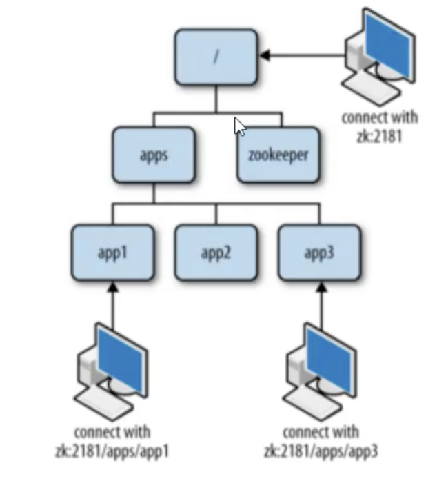
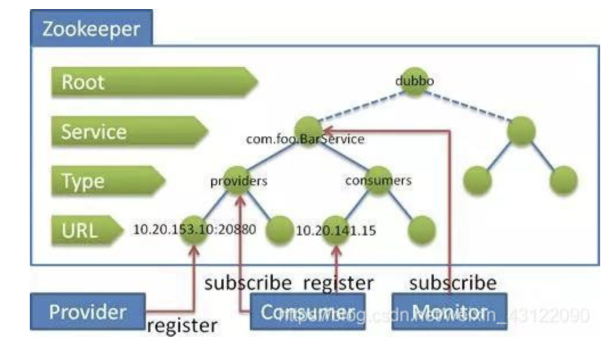
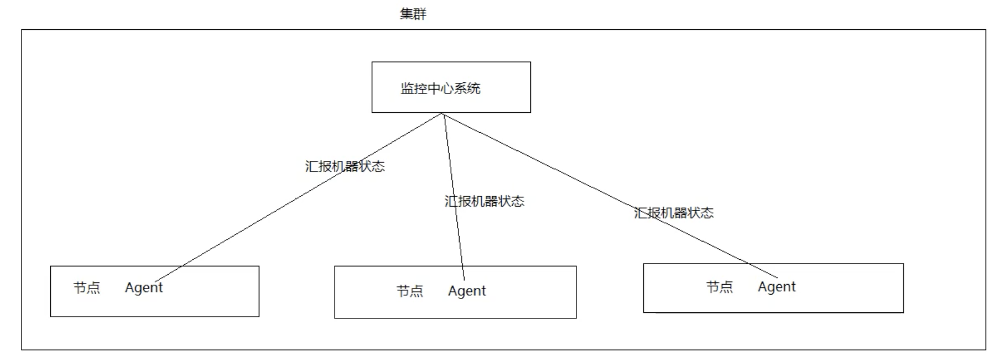

# 安装

## 单机坏境安装

1、安装jdk

2、上传压缩包到linux系统

```shell
put /xxxx/zookeeper-xxx.tar.gz
rz
```
3、解压缩
```shell
tar -zxvf zookeeper-xxx.tar.gz
```
4、进去zookeeper-xx目录，创建data文件夹
```shell
mddir data
cd conf
mv zoo_sample.cfg zoo.cfg
```
5、修改zoo.cfg中的data属性
```shell
dataDir=/root/zookeeper-xx/data
```
## 集群环境安装

通常搭建伪集群，用端口进行区分

**准备工作**

1、安装JDK

2、上传压缩包

3、将zookeeper解压到/usr/local/zkcluster，复制3份文件，并分别创建data目录，将conf下zoo_sample.cfg复制三份文件并改名为zoo1.cfg、zoo2.cfg、zoo3.cfg

```shell
tar -zxvf zookeeper-xxx.tar.gz -C /root/zkclouster/
```
4、在解压后的zookeeper目录下创建data目录，并分别创建三个子目录data1、data2、data3
5、修改zoo.cfg中的data属性和端口信息

```shell
dataDir=/root/zookeeper-01/data
clientPort=2181
```
**配置集群**
(1) 在每个zookeeper的data目录下创建一个myid文件, 内容分别是1、2、3。这个文件就是记录

每个服务器的ID

(2) 在每一个zookeeper的zoo. cfg配置客户端访问端口〔(clientPort) 和集群服务器IP列表。

```xml
Server.1= 192.168.25.129:2881:3881
Server.2= 192.168.25.129:2882:3882
Server.3= 192.168.25.129:2883:3883
Server.服务器ID=服务器IP地址:服务器之间通信端口:服务器之间投票选举端口
```
**启动集群**
依次启动三个zk实例，其中有一个leader和两个follower

```shell
cd bin/
./zkServer.sh start
# 查看状态
./zkServer.sh status
# 关闭
./zkServer.sh stop
```

# zookeeper基本使用

数据结构

Zookeeper数据模型的结构与Unix文件系统很类似，整体上可以看做是一棵树，每个节点称作一个ZNode，每个ZNode都可以通过其路径唯一标识



## ZNode节点类型

### 持久节点

持久化目录节点（PRESISTENT）

客户端与zookeeper断开连接后，该节点依旧存在

### 持久顺序节点

持久化顺序编号目录节点（PRESISTENT_SEQUENTIAL）

客户端与zookeeper断开连接后，该节点依旧存在，Zookeeper会给该节点按照顺序编号

### 临时节点

临时目录节点（EPHENERAL）

客户端与zookeeper断开连接后，该节点被删除

### 临时顺序节点

临时顺序编号目录节点（EPHENERAL_SEQUENTIAL）

客户端与zookeeper断开连接后，该节点被删除，Zookeeper会给该节点按照顺序编号

实战经验：

当被用作注册中心时，对于服务节点是永久节点，服务下的机器是临时节点



## 命令行使用

```shell
./zkCli.sh  # 进入zk命令行
help
# {path}为路径
ls {path} [watch]  # 查看当前znode中所包含的内容，监听该节点下面节点的变化
ls2 {path} [watch]   # 查看当前节点数据并能看到更新次数等数据
create {path} {value}  # 创建节点-s含有序列-e临时
get {path} [watch]   # 获得节点的值，监听该节点的变化
set                  # 设置节点的值
stat {path}          # 查看节点状态
delte {path}         # 删除节点
rmr {path}           # 递归删除节点
```
## API使用

导入依赖包

```xml
<dependency>
    <groupId>org.apache.zookeeper</groupId>
    <artifactId>zookeeper</artifactId>
    <version>3.4.7</version>
</dependency>
```

```java
package com.huangbo;
import org.apache.zookeeper.*;
import org.apache.zookeeper.data.Stat;
import org.testng.annotations.Test;
import java.util.List;
public class ZkApiDemo {
    @Test
    public void test() throws Exception {
        // 1、创建连接
        ZooKeeper zooKeeper = new ZooKeeper("192.xxx.xxx.xxx.5181", 2000, new Watcher() {
            @Override
            public void process(WatchedEvent watchedEvent) {
                System.out.println("触发" + watchedEvent.getType() + "事件");
            }
        });
        // 2、创建父节点
        String path = zooKeeper.create("/ripple", "rippleValue".getBytes(), ZooDefs.Ids.OPEN_ACL_UNSAFE, CreateMode.EPHEMERAL);
        System.out.println(path);
        // 3、创建子节点
        String chaildrenPath = zooKeeper.create("/ripple/children", "rippleValue".getBytes(), ZooDefs.Ids.OPEN_ACL_UNSAFE, CreateMode.EPHEMERAL);
        System.out.println(chaildrenPath);
        // 4、获取节点中的值(父节点和子节点)
        byte[] data = zooKeeper.getData("/ripple", false, null);
        System.out.println(new String(data));
        List<String> children = zooKeeper.getChildren("/ripple", false);
        for (String child : children) {
            System.out.println(child);
        }
        // 5、修改节点的值
        zooKeeper.setData("ripple", "rippleUpdate".getBytes(), -1);
        // 6、判断节点是否存在
        Stat exists = zooKeeper.exists("ripple", false);
        System.out.println(exists);
        // 7、删除节点
        zooKeeper.delete("ripple/children", -1);
    }
}
```


# zookeeper应用场景

## 配置中心

在平常的业务开发过程中, 我们通常需要将系统的一些通用的全局配置, 例如机器列表配置, 运行时开关配置, 数据库配置信息等统一集中存储, 让集群所有机器共享配置信息, 系统在启动会首先从配置中心读取配置信息, 进行初始化。传统的实现方式将配置存储在本地文件和内存中, 一旦机器规模更大, 配置变更频繁情况下, 本地文件和内存方式的配置维护成本较高, 使用zookeeper作为分布式的配置中心就可以解决这个问题。

我们将配置信息存在zk中的一个节点中, 同时给该节点注册一个数据节点变更的watcher监听, 一旦节点数据发生变更, 所有的订阅该节点的客户端都可以获取数据变更通知。

## 负载均衡

Nginx，如果服务器列表产生更新，如何让反向代理服务器知道服务器列表的变更，从而更新负载均衡算法。

建立server节点, 并建立监听器监视servers子节点的状态(用于在服务器增添时及时同步当前集群中服务器列表) 。在每个服务器启动时, 在Servers节点下建立具体服务器地址的子节点, 并在对应的字节点下存入服务器的相关信息。这样, 我们在zookeeper服务器上可以获取当前集群中的服务器列表及相关信息, 可以自定义一个负载均衡算法, 在每个请求过来时从zookeeper服务器中获取当前集群服务器列表, 根据算法选出其中一个服务器来处理请求。

## 命名服务

命名服务是分布式系统中的基本功能之一。裤命名的实体通常可以是集群中的机器、提供的服务地址或者远程对象, 这些都可以称作为名字。常见的就是一些分布式服务框架(RPC、RMI) 中的服务地址列表, 通过使用名称服务客户端可以获取资源的实体、服务地址和提供者信息。命名服务就是通过一个资源引用的方式来实现对资源的定位和使用。在分布式环境中, 上层应用仅仅需要一个全局唯一名称, 就像数据库中的主键。

在单库单表系统中可以通过自增ID来标识每一条记录, 但是随着规模变大分库分表很常见, 那么自增ID有仅能针对单一表生成ID, 所以在这种情况下无法依靠这个来标识唯一D。UUID就是一种全局唯一标识符。但是长度过长不易识别。

## DNS服务

### 1、域名配置

在分布式系统应用中, 每一个应用都需要分配一个域名, 日常开发中, 往往使用本地HOST绑定域名解析, 开发阶段可以随时修改域名和IP的映射, 大大提高开发的调试效率。如果应用的机器规模达到一定程度后, 需要频繁更新域名节点来进行域名配置, 需要在规模的集群中变更, 无法保证实时性。所有我们在zk上创建一个节点来进行域名配置

### 2、域名解析

应用解析时, 首先从zk域名节点中获取域名映射的IP和端口。

### 3、域名变更

每个应用都会在在对应的域名节点注册一个数据变更的watcher监听, 一旦监听的域名节点数据变更, zk会向所有订阅的客户端发送域名变更通知。

### 4、集群管理

1、集群控制：对集群中节点进行操作与控制

2、集群监控：对集群节点运行状态的收集

在日常开发和运维过程中, 我们经常会有类似于如下的需求：

1）希望知道当前集群中究竟有多少机器在工作。

2）对集群中每台机器的运行时状态进行数据收集。

3）对集群中机器进行上下线操作

在传统的基于Agent的分布式集群管理体系中, 都是通过在集群中的每台机嘴上部罪一个Agent, 由这个Agent负责主动向指定的一个监控中心系统(监控中心系统负责案所有数据进行集中处理, 形成一系列报表, 并负责实时报警, 以下简称“监控中心“) 汇报自己所在机器的状态。在集群规模适中的场景下, 这确实是一种在生产实践中广泛使用的解决方案, 能够快速有效地实现分家集群监控, 但是一旦系统的业务场景增多, 集群规模变大之后, 该解决方案的弊端也就显现出来了。



弊端：大规模升级困难（Agent也需要升级）、编程语言多样性

随着分布式系统规模日益扩大，集群中机器的数量越来越多。有效的集群管理越来越重要，zookeeper集群管理主要利用了watcher机制和创建临时节点来实现。以机器上下线和机器监控为例：

1、机器上下线

新增机器的时候, 将Agent部署到新增的机器上, 当Agent部署启动时, 会向zookeeper指定的节

点下创建一个临时子节点, 当Agent在zk上创建完这个临时节点后, 当关注的节点

zookeeperymachines下的子节点新加入新的节点时或删除郭会发送譬知, 这样就对机器的上下线进行监控。

2、机器监控

在机器运行过程中, Agent会定时将主机的的运行状态信息写入到/ machines/ host主机节点, 监控中心通过订阅这些节点的数据变化来获取主机的运行信息。

# Reference

[Zookeeper 的五个核心知识点](https://mp.weixin.qq.com/s/iSU3BO-_57v1V5THF4sNdQ)

[zookeeper连环9问](https://mp.weixin.qq.com/s/1PieoXY8IMucUWV7yMMEhQ)
