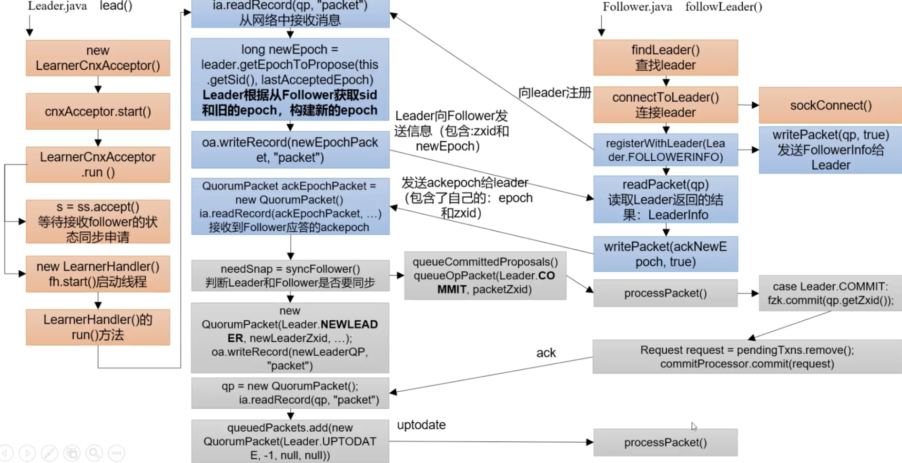

zookeeper github地址：[https://github.com/apache/zookeeper](https://github.com/apache/zookeeper)

本文拉取分支后以3.5.7版本为例

```shell
git checkout -b branch-3.5.7 remotes/origin/branch-3.5.7
```
# 基本知识

1、zk中的数据模型是一棵树 DataTree，每个节点叫做 DataNode

2、zk集群中的 DataTree 时刻保持状态同步

3、**Zookeeper 集群中的每个zk节点中，数据在内存和磁盘中都有一份完整的数据。**

* 内存数据：DataTree
* 磁盘数据：快照文件 + 编辑日志

# 总体流程


## 

# 启动入口

根据bin目录下的启动脚本zkServer.sh中加载启动类QuorumPeerMain类

```java
// org.apache.zookeeper.server.quorum.QuorumPeerMain
public static void main(String[] args) {
    QuorumPeerMain main = new QuorumPeerMain();
    try {
        main.initializeAndRun(args);
        xxx }
    LOG.info("Exiting normally");
    ServiceUtils.requestSystemExit(ExitCode.EXECUTION_FINISHED.getValue());
}
```
然后进入到 initailizeAndRun方法中
```java
// org.apache.zookeeper.server.quorum.QuorumPeerMain#initializeAndRun
// 1.加载配置文件
QuorumPeerConfig config = new QuorumPeerConfig();
if (args.length == 1) {
    // 解析参数
    config.parse(args[0]);
}
// 2.启动定时清除任务，主要清除旧的快照和日志文件，默认关闭
DatadirCleanupManager purgeMgr = new DatadirCleanupManager(config
        .getDataDir(), config.getDataLogDir(), config
        .getSnapRetainCount(), config.getPurgeInterval());
purgeMgr.start();

// 3.启动zk zookeeper启动方式分为两种：单机启动和集群启动
if (args.length == 1 && config.servers.size() > 0) {
    runFromConfig(config);
} else {
    LOG.warn("Either no config or no quorum defined in config, running "
            + " in standalone mode");
    // there is only server in the quorum -- run as standalone
    // 单机启动
    ZooKeeperServerMain.main(args);
}
```
# 解析参数

这里path默认是 zoo.cfg，可以查看启动脚本

```java
// org.apache.zookeeper.server.quorum.QuorumPeerConfig#parse
public void parse(String path) throws ConfigException {
    try {
        File configFile = (new VerifyingFileFactory.Builder(LOG)
            .warnForRelativePath()
            .failForNonExistingPath()
            .build()).create(path);
        Properties cfg = new Properties();
        try (FileInputStream in = new FileInputStream(configFile)) {
            cfg.load(in);
            configFileStr = path;
        }
        /* Read entire config file as initial configuration */
        initialConfig = new String(Files.readAllBytes(configFile.toPath()));
        parseProperties(cfg);
```
parseProperties函数中可以看到常用的属性值，这里重点介绍其调用的setupQuorumPeerConfig方法
## setupQuorumPeerConfig

这里setupMyId方法初始化了服务的serverId

```java
// org.apache.zookeeper.server.quorum.QuorumPeerConfig#setupQuorumPeerConfig
void setupQuorumPeerConfig(Properties prop, boolean configBackwardCompatibilityMode)
        throws IOException, ConfigException {
    quorumVerifier = parseDynamicConfig(prop, electionAlg, true, configBackwardCompatibilityMode);
    // 初始化myid，zkData目录有个文件 myid
    setupMyId();
    setupClientPort();
    setupPeerType();
    checkValidity();
}
```

# 过期快照删除

## 任务启动

```java
// org.apache.zookeeper.server.DatadirCleanupManager#start
public void start() {
    if (PurgeTaskStatus.STARTED == purgeTaskStatus) {
        LOG.warn("Purge task is already running.");
        return;
    }
    // Don't schedule the purge task with zero or negative purge interval.
    if (purgeInterval <= 0) {
        LOG.info("Purge task is not scheduled.");
        return;
    }
    timer = new Timer("PurgeTask", true);
    TimerTask task = new PurgeTask(dataLogDir, snapDir, snapRetainCount);
    timer.scheduleAtFixedRate(task, 0, TimeUnit.HOURS.toMillis(purgeInterval));
    purgeTaskStatus = PurgeTaskStatus.STARTED;
}
```

### 定时任务

```java
// org.apache.zookeeper.server.DatadirCleanupManager.PurgeTask#run
public void run() {
    LOG.info("Purge task started.");
    try {
        PurgeTxnLog.purge(logsDir, snapsDir, snapRetainCount);
    } catch (Exception e) {
        LOG.error("Error occurred while purging.", e);
    }
    LOG.info("Purge task completed.");
}
```
## 小结

```java
config.getSnapRetainCount() // 默认3，表示最少保留的快照个数
config.getPurgeInterval() // 默认0，表示关闭该任务
```

# 通信初始化

```java
// org.apache.zookeeper.server.quorum.QuorumPeerMain#runFromConfig
public void runFromConfig(QuorumPeerConfig config)
        throws IOException, AdminServerException
{
  try {
      ManagedUtil.registerLog4jMBeans();
  } catch (JMException e) {
      LOG.warn("Unable to register log4j JMX control", e);
  }
  LOG.info("Starting quorum peer");
  try {
      ServerCnxnFactory cnxnFactory = null;
      ServerCnxnFactory secureCnxnFactory = null;
      if (config.getClientPortAddress() != null) {
          // 获取工厂
          cnxnFactory = ServerCnxnFactory.createFactory();
          // 配置工厂，绑定通信端口等
          cnxnFactory.configure(config.getClientPortAddress(),
                  config.getMaxClientCnxns(),
                  false);
      }
      if (config.getSecureClientPortAddress() != null) {
          secureCnxnFactory = ServerCnxnFactory.createFactory();
          secureCnxnFactory.configure(config.getSecureClientPortAddress(),
                  config.getMaxClientCnxns(),
                  true);
      quorumPeer = getQuorumPeer();
      xxx
      quorumPeer.initialize();
      // 启动zk
      quorumPeer.start();
      quorumPeer.join();
}
```
## 创建工厂

```java
// org.apache.zookeeper.server.ServerCnxnFactory#createFactory()
public static final String ZOOKEEPER_SERVER_CNXN_FACTORY = "zookeeper.serverCnxnFactory";
static public ServerCnxnFactory createFactory() throws IOException {
    String serverCnxnFactoryName =
        System.getProperty(ZOOKEEPER_SERVER_CNXN_FACTORY);
    if (serverCnxnFactoryName == null) {
        serverCnxnFactoryName = NIOServerCnxnFactory.class.getName();
    }
    try {
        ServerCnxnFactory serverCnxnFactory = (ServerCnxnFactory) Class.forName(serverCnxnFactoryName)
                .getDeclaredConstructor().newInstance();
        LOG.info("Using {} as server connection factory", serverCnxnFactoryName);
        return serverCnxnFactory;
    } catch (Exception e) {
        IOException ioe = new IOException("Couldn't instantiate "
                + serverCnxnFactoryName);
        ioe.initCause(e);
        throw ioe;
    }
}
```
查找zookeeperAdmin.md文件
```java
// zookeeper-docs/src/main/resources/markdown/zookeeperAdmin.md:699
* *serverCnxnFactory* :
    (Java system property: **zookeeper.serverCnxnFactory**)
    Specifies ServerCnxnFactory implementation. 
    This should be set to `NettyServerCnxnFactory` in order to use TLS based server communication.
    Default is `NIOServerCnxnFactory`.
```
定义了 serverCnxnFactory 为 NIOServerCnxnFactory
## 工厂配置

```java
// org.apache.zookeeper.server.NIOServerCnxnFactory#configure
public void configure(InetSocketAddress addr, int maxcc, boolean secure) throws IOException {
    
    this.ss = ServerSocketChannel.open();
    ss.socket().setReuseAddress(true);
    LOG.info("binding to port " + addr);
    ss.socket().bind(addr);
    ss.configureBlocking(false);
    acceptThread = new AcceptThread(ss, addr, selectorThreads);
}
```

# 启动zk

## 总体流程


启动 zk 代码在 runFromConfig中

```java
// org.apache.zookeeper.server.quorum.QuorumPeerMain#runFromConfig
public void runFromConfig(QuorumPeerConfig config)
        throws IOException, AdminServerException
{
  // 启动zk
  quorumPeer.start();
  quorumPeer.join();
}
```
## 启动函数

```java
// org.apache.zookeeper.server.quorum.QuorumPeer#start
public synchronized void start() {
    if (!getView().containsKey(myid)) {
        throw new RuntimeException("My id " + myid + " not in the peer list");
     }
    // 加载数据
    loadDataBase();
    startServerCnxnFactory();
    try {
        adminServer.start();
    } catch (AdminServerException e) {
        LOG.warn("Problem starting AdminServer", e);
        System.out.println(e);
    }
    // 启动Leader选举
    startLeaderElection();
    super.start();
}
```
## 加载数据

```java
// org.apache.zookeeper.server.persistence.FileTxnSnapLog#restore
public long restore(DataTree dt, Map<Long, Integer> sessions,
                    PlayBackListener listener) throws IOException {
    // 反序列化磁盘中的数据
    long deserializeResult = snapLog.deserialize(dt, sessions);
    FileTxnLog txnLog = new FileTxnLog(dataDir);
    RestoreFinalizer finalizer = () -> {
        // 从编辑日志中恢复数据
        long highestZxid = fastForwardFromEdits(dt, sessions, listener);
        return highestZxid;
    };
```
### 恢复快照

```java
// org.apache.zookeeper.server.persistence.FileSnap#deserialize
public long deserialize(DataTree dt, Map<Long, Integer> sessions)
        throws IOException {
    // we run through 100 snapshots (not all of them)
    // if we cannot get it running within 100 snapshots
    // we should  give up
    List<File> snapList = findNValidSnapshots(100);
    if (snapList.size() == 0) {
        return -1L;
    }
    File snap = null;
    boolean foundValid = false;
    // 循环编译每一个快照文件
    for (int i = 0, snapListSize = snapList.size(); i < snapListSize; i++) {
        snap = snapList.get(i);
        LOG.info("Reading snapshot " + snap);
        try (InputStream snapIS = new BufferedInputStream(new FileInputStream(snap));
             CheckedInputStream crcIn = new CheckedInputStream(snapIS, new Adler32())) {
            InputArchive ia = BinaryInputArchive.getArchive(crcIn);
            // 反序列化
            deserialize(dt, sessions, ia);
            long checkSum = crcIn.getChecksum().getValue();
            long val = ia.readLong("val");
            if (val != checkSum) {
                throw new IOException("CRC corruption in snapshot :  " + snap);
            }
            foundValid = true;
            break;
        } catch (IOException e) {
            LOG.warn("problem reading snap file " + snap, e);
        }
    }
    if (!foundValid) {
        throw new IOException("Not able to find valid snapshots in " + snapDir);
    }
    dt.lastProcessedZxid = Util.getZxidFromName(snap.getName(), SNAPSHOT_FILE_PREFIX);
    return dt.lastProcessedZxid;
}
```
更详细代码不一一贴出，可自行查看
### 
### 恢复日志

```java
// org.apache.zookeeper.server.persistence.FileTxnSnapLog#fastForwardFromEdits
public long fastForwardFromEdits(DataTree dt, Map<Long, Integer> sessions,
                                 PlayBackListener listener) throws IOException {
    TxnIterator itr = txnLog.read(dt.lastProcessedZxid+1);
    long highestZxid = dt.lastProcessedZxid;
    TxnHeader hdr;
    try {
        while (true) {
            // iterator points to
            // the first valid txn when initialized
            hdr = itr.getHeader();
            if (hdr == null) {
                //empty logs
                return dt.lastProcessedZxid;
            }
            if (hdr.getZxid() < highestZxid && highestZxid != 0) {
                LOG.error("{}(highestZxid) > {}(next log) for type {}",
                        highestZxid, hdr.getZxid(), hdr.getType());
            } else {
                highestZxid = hdr.getZxid();
            }
            try {
                // 处理datatree的事务
                processTransaction(hdr,dt,sessions, itr.getTxn());
            } catch(KeeperException.NoNodeException e) {
               throw new IOException("Failed to process transaction type: " +
                     hdr.getType() + " error: " + e.getMessage(), e);
            }
            listener.onTxnLoaded(hdr, itr.getTxn());
            if (!itr.next())
                break;
        }
    } finally {
        if (itr != null) {
            itr.close();
        }
    }
    return highestZxid;
}
```
#### 处理DataTree的事务

```java
// org.apache.zookeeper.server.persistence.FileTxnSnapLog#processTransaction
public void processTransaction(TxnHeader hdr,DataTree dt,
        Map<Long, Integer> sessions, Record txn)
    throws KeeperException.NoNodeException {
    ProcessTxnResult rc;
    switch (hdr.getType()) {
    case OpCode.createSession:
        sessions.put(hdr.getClientId(),
                ((CreateSessionTxn) txn).getTimeOut());
        // give dataTree a chance to sync its lastProcessedZxid
        rc = dt.processTxn(hdr, txn);
        break;
    case OpCode.closeSession:
        sessions.remove(hdr.getClientId());
        rc = dt.processTxn(hdr, txn);
        break;
    default:
        rc = dt.processTxn(hdr, txn);
    }
}
```

#### processTxn

```java
// org.apache.zookeeper.server.DataTree#processTxn
public ProcessTxnResult processTxn(TxnHeader header, Record txn, boolean isSubTxn)
{
    ProcessTxnResult rc = new ProcessTxnResult();
    try {
        rc.clientId = header.getClientId();
        rc.cxid = header.getCxid();
        rc.zxid = header.getZxid();
        rc.type = header.getType();
        rc.err = 0;
        rc.multiResult = null;
        switch (header.getType()) {
            case OpCode.create:
                CreateTxn createTxn = (CreateTxn) txn;
                rc.path = createTxn.getPath();
                // 创建节点
                createNode(
                        createTxn.getPath(),
                        createTxn.getData(),
                        createTxn.getAcl(),
                        createTxn.getEphemeral() ? header.getClientId() : 0,
                        createTxn.getParentCVersion(),
                        header.getZxid(), header.getTime(), null);
                break;
            case OpCode.create2:
                CreateTxn create2Txn = (CreateTxn) txn;
                rc.path = create2Txn.getPath();
                Stat stat = new Stat();
                createNode(
                        create2Txn.getPath(),
                        create2Txn.getData(),
                        create2Txn.getAcl(),
                        create2Txn.getEphemeral() ? header.getClientId() : 0,
                        create2Txn.getParentCVersion(),
                        header.getZxid(), header.getTime(), stat);
                rc.stat = stat;
                break;
            xxxx
        }
    }
}
```
#### createNode

```java
// org.apache.zookeeper.server.DataTree#createNode
```

# 选举准备

## 基本概念

SID：服务器ID，用来标识唯一一台ZooKeeper集群中的机器，每台机器不能重复，和myid一致。

ZXID：事务ID。ZXID是一个事务ID，用来标识一次服务器状态的变更。在某一个时刻，集群中的每台机器ZXID值不一定完全一致，这和ZooKeeper服务器对于客户端“更新请求”的处理逻辑有关。

Epoch：每个Leader任期的代号。没有Leader时统一轮投票过程中的逻辑时钟值是相同的。每投完一次票这个数据就会增加

一般投票是 (EPOCH, ZXID, SID) 【任期，事务ID，服务器ID】

选举Leader规则：

1、EPOCH 大的直接胜出

2、EPOCH 相同，事务id大的胜出

3、事务id相同，服务器id大的胜出

## 基本流程


## 开始选举准备

接上，加载完数据之后，开始Leader选举

```java
// org.apache.zookeeper.server.quorum.QuorumPeer#start
@Override
public synchronized void start() {
    if (!getView().containsKey(myid)) {
        throw new RuntimeException("My id " + myid + " not in the peer list");
     }
    loadDataBase();
    startServerCnxnFactory();
    try {
        adminServer.start();
    } catch (AdminServerException e) {
        LOG.warn("Problem starting AdminServer", e);
        System.out.println(e);
    }
    startLeaderElection();
    super.start();
}
```

## 开始Leader选举准备

```java
// org.apache.zookeeper.server.quorum.QuorumPeer#startLeaderElection
synchronized public void startLeaderElection() {
   try {
       if (getPeerState() == ServerState.LOOKING) {
           // 创建选票
           currentVote = new Vote(myid, getLastLoggedZxid(), getCurrentEpoch());
       }
   } catch(IOException e) {
   }
    if (electionType == 0) {
        try {
            udpSocket = new DatagramSocket(getQuorumAddress().getPort());
            responder = new ResponderThread();
            responder.start();
        } catch (SocketException e) {
        }
    }
    // 创建选票实例
    this.electionAlg = createElectionAlgorithm(electionType);
}
```
## 创建选票实例

```java
// org.apache.zookeeper.server.quorum.QuorumPeer#createElectionAlgorithm
protected Election createElectionAlgorithm(int electionAlgorithm){
    Election le=null;
    //TODO: use a factory rather than a switch
    switch (electionAlgorithm) {
    case 0:
        le = new LeaderElection(this);
        break;
    case 1:
        le = new AuthFastLeaderElection(this);
        break;
    case 2:
        le = new AuthFastLeaderElection(this, true);
        break;
    case 3:
        // 创建CnxnManager
        QuorumCnxManager qcm = createCnxnManager();
        QuorumCnxManager oldQcm = qcmRef.getAndSet(qcm);
        if (oldQcm != null) {
            LOG.warn("Clobbering already-set QuorumCnxManager (restarting leader election?)");
            oldQcm.halt();
        }
        QuorumCnxManager.Listener listener = qcm.listener;
        if(listener != null){
            // 启动监听线程
            listener.start();
            // 准备开始选举
            FastLeaderElection fle = new FastLeaderElection(this, qcm);
            fle.start();
            le = fle;
        } else {
            LOG.error("Null listener when initializing cnx manager");
        }
x'x'x    
        break;
    default:
        assert false;
    }
    return le;
}
```
### 创建CnxnManage

负责选举过程中网络通信

```java
// org.apache.zookeeper.server.quorum.QuorumPeer#createCnxnManager
public QuorumCnxManager createCnxnManager() {
    return new QuorumCnxManager(this,
            this.getId(),
            this.getView(),
            this.authServer,
            this.authLearner,
            this.tickTime * this.syncLimit,
            this.getQuorumListenOnAllIPs(),
            this.quorumCnxnThreadsSize,
            this.isQuorumSaslAuthEnabled());
}
```
new QuorumCnxManager创建各种队列
### 启动监听线程

client = ss.accept()

阻塞，等待请求处理

### 准备开始选举

初始化各种队列

```java
// org.apache.zookeeper.server.quorum.FastLeaderElection#FastLeaderElection
public FastLeaderElection(QuorumPeer self, QuorumCnxManager manager){
    this.stop = false;
    this.manager = manager;
    starter(self, manager);
}

// org.apache.zookeeper.server.quorum.FastLeaderElection#starter
private void starter(QuorumPeer self, QuorumCnxManager manager) {
    this.self = self;
    proposedLeader = -1;
    proposedZxid = -1;
    sendqueue = new LinkedBlockingQueue<ToSend>();
    recvqueue = new LinkedBlockingQueue<Notification>();
    this.messenger = new Messenger(manager);
}
```


# Leader选举

## 整体结构


## 基本流程


## 开始选举执行

入口在上一节 开始Leader选举准备的 QuorumPeer 的 start方法中

```java
// org.apache.zookeeper.server.quorum.QuorumPeer#start
public synchronized void start() {
    xxx
    super.start();
}
```
因为 QuorumPeer -> ZooKeeperThread -> Thread，所以super.start方法执行的是 QuorumPeer 的run方法。直接看run方法。
```java
// org.apache.zookeeper.server.quorum.QuorumPeer#run
public void run() {
  xxxx;
  while (running) {
      switch (getPeerState()) {
      case LOOKING:
          xxx;
          // 更新当前选票，lookForLeader进行选举
          setCurrentVote(makeLEStrategy().lookForLeader());
          // leader的选举在org.apache.zookeeper.server.quorum.FastLeaderElection#lookForLeader中
      }
  }
```
### lookForLeader

```java
// org.apache.zookeeper.server.quorum.FastLeaderElection#lookForLeader
public Vote lookForLeader() throws InterruptedException {
    xxxxx
    synchronized(this){
        // 更新逻辑时钟,
        logicalclock.incrementAndGet();
        // 更新选票，给自己投票
        updateProposal(getInitId(), getInitLastLoggedZxid(), getPeerEpoch());
    }
    // 发送选票通知
    sendNotifications();
    xxx
    Notification n = recvqueue.poll(notTimeout, TimeUnit.MILLISECONDS);

```
lookForLeader方法中，有两个变量, **一个recvset, 用来保存当前server的接受其他server的本轮投票信息, key为当前server的id**, 也即是我们在配置文件中配置的myid, 而另外一个变量**outofelection保存选举结束以后法定的server的投票信息**, 这里的法定指的是FOLLOWING和LEADING状态的server, 不包活OBSERVING状态的server。
更新逻辑时钟，此处逻辑时钟是为了在选举leader时比较其他选票中的server中的epoch和本地谁最新, 然后将自己的选票proposal|发送给其他所有server。

选出的选票信息封装在一个Notification对象中，如果取出的选票为null我们通过

QuorumCnxManager 检查发送队列中是否投递过选票, 如果投递过说明连接并没有断开，则重新发送选票到其他sever，否则说明连接断开，重连所有Server即可。那么连接没有断开，为什么会收不到选票信息呢，有可能是选票超时时限导致没有收到选票, 所有将选票时限延长了一倍。

如果选出的选票Notification不为null, 校验投票server和选举leader是否合法, 然后根据选票状态执行不同分支, 选举过程定LOOKING分支, 接下来比较选票epoch和当前逻辑时钟。

如果选票epoch > 逻辑时钟, 说明选票是最新的, 自己的选票这一轮已经过时, 应该更新当前自己 Server的逻辑时钟, 并清空当前收到的其他server的选票, 然后比较自己和选票中谁更适合做leader, 发送新的投票给其他所有server。

#### updateProposal

#### sendNotifications

```java
private void sendNotifications() {
    for (long sid : self.getCurrentAndNextConfigVoters()) {
        QuorumVerifier qv = self.getQuorumVerifier();
        ToSend notmsg = new ToSend(ToSend.mType.notification,
                proposedLeader,
                proposedZxid,
                logicalclock.get(),
                QuorumPeer.ServerState.LOOKING,
                sid,
                proposedEpoch, qv.toString().getBytes());
        sendqueue.offer(notmsg);
    }
}
```
此方法遍历所有投票参与者集合，将选票信息构造成一个ToSend对象，分别发送消息放置到队列 sendqueue 中。同理集群中每一个server节点都会将自己的选票发送给其他servgqr。既然有发送选票，肯定存在接受选票信息。下文 WorkerRecv将介绍
#### WorkerSender发送消息

上文将发送消息放置到队列 sendqueue 中后，由WorkerSender发送消息。它是一个线程，直接看run方法

```java
// org.apache.zookeeper.server.quorum.FastLeaderElection.Messenger.WorkerSender
class WorkerSender extends ZooKeeperThread {
    volatile boolean stop;
    QuorumCnxManager manager;
    WorkerSender(QuorumCnxManager manager){
        super("WorkerSender");
        this.stop = false;
        this.manager = manager;
    }
    public void run() {
        while (!stop) {
            try {
                ToSend m = sendqueue.poll(3000, TimeUnit.MILLISECONDS);
                if(m == null) continue;
                process(m);
            } catch (InterruptedException e) {
                break;
            }
        }
        LOG.info("WorkerSender is down");
    }    
```
处理消息
process方法

```java
// org.apache.zookeeper.server.quorum.FastLeaderElection.Messenger.WorkerSender#process
void process(ToSend m) {
    ByteBuffer requestBuffer = buildMsg(m.state.ordinal(),
                                        m.leader,
                                        m.zxid,
                                        m.electionEpoch,
                                        m.peerEpoch,
                                        m.configData);
    manager.toSend(m.sid, requestBuffer);
```
manager.toSend方法
```java
// org.apache.zookeeper.server.quorum.QuorumCnxManager#toSend
public void toSend(Long sid, ByteBuffer b) {
    /*
     * If sending message to myself, then simply enqueue it (loopback).
     */
    if (this.mySid == sid) {
         b.position(0);
         addToRecvQueue(new Message(b.duplicate(), sid));
    } else {
         ArrayBlockingQueue<ByteBuffer> bq = new ArrayBlockingQueue<ByteBuffer>(
            SEND_CAPACITY);
         ArrayBlockingQueue<ByteBuffer> oldq = queueSendMap.putIfAbsent(sid, bq);
         if (oldq != null) {
             addToSendQueue(oldq, b);
         } else {
             addToSendQueue(bq, b);
         }
         // 同对应的服务建议连接
         connectOne(sid);
    }
}
```
如果发送的服务器id和myid相同，直接添加到自己的 recvQueue 中。否则往外发送消息，发给谁先发给对应的队列中。
#### 建立连接

connectOne

```java
// org.apache.zookeeper.server.quorum.QuorumCnxManager#connectOne(long)
// 嵌套
// org.apache.zookeeper.server.quorum.QuorumCnxManager#connectOne(long, java.net.InetSocketAddress)
// 同步或异步
// 创建socket连接
```
各种嵌套，这里选择其中同步的建立连接分析
```java
// org.apache.zookeeper.server.quorum.QuorumCnxManager#startConnection
private boolean startConnection(Socket sock, Long sid)
        throws IOException {
        xxxx
        // If lost the challenge, then drop the new connection
        if (sid > self.getId()) {
            LOG.info("Have smaller server identifier, so dropping the " +
                    "connection: (" + sid + ", " + self.getId() + ")");
            closeSocket(sock);
            // Otherwise proceed with the connection
        } else {
            SendWorker sw = new SendWorker(sock, sid);
            RecvWorker rw = new RecvWorker(sock, din, sid, sw);
            sw.setRecv(rw);
            SendWorker vsw = senderWorkerMap.get(sid);
            if(vsw != null)
                vsw.finish();
            senderWorkerMap.put(sid, sw);
            queueSendMap.putIfAbsent(sid, new ArrayBlockingQueue<ByteBuffer>(
                    SEND_CAPACITY));
            sw.start();
            rw.start();
            return true;
        }
        xxx
}
```
这里如果自己的id小于sid（对方的服务器id），则不发送消息。
#### SendWorker

因为这也是个线程类，直接找run方法

```java
// org.apache.zookeeper.server.quorum.QuorumCnxManager.SendWorker#run
public void run() {
    调用send方法，不断往外写
}
```
#### RecvWorker

同上也是个线程类，直接找run方法

```java
// org.apache.zookeeper.server.quorum.QuorumCnxManager.RecvWorker#run
public void run() {
    addToRecvQueue(new Message(message.duplicate(), sid));
```
添加消息到recvQueue中
#### WorkerRecv接受消息

因为该类为线程，直接看其run方法

```java
// org.apache.zookeeper.server.quorum.FastLeaderElection.Messenger.WorkerReceiver#run
public void run() {
    response = manager.pollRecvQueue(3000, TimeUnit.MILLISECONDS);
    
```

# Follower和Leader状态同步

选举结束后，每个节点都需要根据自己的角色更新自己的状态。

Leader更新状态入口：leader.lead()

Follower更新状态入口：follower.followerLeader()

同步策略：

1、DIFF（差异化同步）

2、TRUNC（回滚同步）

3、SNAP（全量同步）

同步过程中，有可能重复提议或提交

注意事项：

1、follower必须要让leader知道自己的状态：epoch/zxid/sid

2、leader得知follower状态后，要确定以何种方式的数据同步DIFF、TRUNC、SNAP

3、执行数据同步

4、当leader接收到超过半数follower的ack之后，进入正常工作状态，集群启动完成

最终同步的方式：

1、DIFF一样，无需任何动作

2、TRUNC follower的zxid比leader的zxid大，follower要回滚

3、COMMIT leader的zxid比follower的zxid大，发送Proposal给follower提交执行

4、如果follower没有任何数据，直接使用SNAP的方式同步数据（直接把数据全部序列同步给follower）

## 基本流程



## 入口

还是在QuorumPeer的run方法中

```java
// org.apache.zookeeper.server.quorum.QuorumPeer#run
case FOLLOWING:
    try {
       LOG.info("FOLLOWING");
        setFollower(makeFollower(logFactory));
        follower.followLeader();
case LEADING:
    LOG.info("LEADING");
    try {
        setLeader(makeLeader(logFactory));
        leader.lead();
        setLeader(null);
```

## lead方法

```java
// org.apache.zookeeper.server.quorum.Leader#lead
void lead() throws IOException, InterruptedException {
    xxxx
    cnxAcceptor.start();
```
调用线程start方法，直接看本类run方法
```java
// org.apache.zookeeper.server.quorum.Leader.LearnerCnxAcceptor#run
@Override
public void run() {
    try {
        while (!stop) {
            Socket s = null;
            boolean error = false;
            try {
                s = ss.accept();
```

## followLead方法

```java
// org.apache.zookeeper.server.quorum.Follower#followLeader
void followLeader() throws InterruptedException {
    // 找leader
    QuorumServer leaderServer = findLeader();            
    try {
        // 连接leader
        connectToLeader(leaderServer.addr, leaderServer.hostname);
        // 注册到leader，同步信息
        long newEpochZxid = registerWithLeader(Leader.FOLLOWERINFO);
        xxxx
        while (this.isRunning()) {
            // 读取 packet
            readPacket(qp);
            // 处理 packet
            processPacket(qp);
        }      
```


# 服务端Leader启动

## 基本流程


## startZkServer

该方法调用在上文介绍的lead方法中

```java
// org.apache.zookeeper.server.quorum.Leader#startZkServer
private synchronized void startZkServer() {
    zk.startup();
```
startup方法
```java
// org.apache.zookeeper.server.ZooKeeperServer#startup
public synchronized void startup() {
    if (sessionTracker == null) {
        createSessionTracker();
    }
    startSessionTracker();
    // 接收请求处理
    setupRequestProcessors();
    registerJMX();
    setState(State.RUNNING);
    notifyAll();
}
```
继续分析 setupRequestProcessors，((PrepRequestProcessor)firstProcessor).start();
```java
// org.apache.zookeeper.server.PrepRequestProcessor#run
public void run() {
    // 真正处理请求
    pRequest(request);
```

# 服务端Follower启动

## 基本流程


入口在上文分析的followLeader方法中

```java
// org.apache.zookeeper.server.quorum.Follower#followLeader
void followLeader() throws InterruptedException {
    xxx
    while (this.isRunning()) {
        // 接收请求
        readPacket(qp);
        // 处理请求
        processPacket(qp);
    }
    xxx
```

# 客户端启动

## 基本流程


## 启动入口

客户端是通过 ZkCli.sh 脚本启动的，调用了 org.apache.zookeeper.ZooKeeperMain 函数

```java
// org.apache.zookeeper.ZooKeeperMain#main
public static void main(String args[]) throws CliException, IOException, InterruptedException
{
    ZooKeeperMain main = new ZooKeeperMain(args);
    main.run();
}
```
ZooKeeperMain
```plain
// org.apache.zookeeper.ZooKeeperMain#ZooKeeperMain(java.lang.String[])
public ZooKeeperMain(String args[]) throws IOException, InterruptedException {
    cl.parseOptions(args);
    System.out.println("Connecting to " + cl.getOption("server"));
    // 连接zk
    connectToZK(cl.getOption("server"));
}
```
## 连接zk

```java
// org.apache.zookeeper.ZooKeeperMain#connectToZK
protected void connectToZK(String newHost) throws InterruptedException, IOException {
    xxxx
    zk = new ZooKeeperAdmin(host, Integer.parseInt(cl.getOption("timeout")), new MyWatcher(), readOnly);
}
```
创建ZooKeeperAdmin，继续递归super调用
```java
// org.apache.zookeeper.ZooKeeper#ZooKeeper
public ZooKeeper(String connectString, int sessionTimeout, Watcher watcher,
        boolean canBeReadOnly, HostProvider aHostProvider,
        ZKClientConfig clientConfig) throws IOException {
    LOG.info("Initiating client connection, connectString=" + connectString
            + " sessionTimeout=" + sessionTimeout + " watcher=" + watcher);
    if (clientConfig == null) {
        clientConfig = new ZKClientConfig();
    }
    this.clientConfig = clientConfig;
    watchManager = defaultWatchManager();
    // 设置watcher
    watchManager.defaultWatcher = watcher;
    ConnectStringParser connectStringParser = new ConnectStringParser(
            connectString);
    hostProvider = aHostProvider;
    // 创建连接
    cnxn = createConnection(connectStringParser.getChrootPath(),
            hostProvider, sessionTimeout, this, watchManager,
            getClientCnxnSocket(), canBeReadOnly);
    // 启动
    cnxn.start();
}
```

### 创建连接

接上文 createConnection

```java
// org.apache.zookeeper.ClientCnxn#ClientCnxn
public ClientCnxn(String chrootPath, HostProvider hostProvider, int sessionTimeout, ZooKeeper zooKeeper,
        ClientWatchManager watcher, ClientCnxnSocket clientCnxnSocket,
        long sessionId, byte[] sessionPasswd, boolean canBeReadOnly) {
    xxxx
    // 发送消息线程
    sendThread = new SendThread(clientCnxnSocket);
    eventThread = new EventThread();
    this.clientConfig=zooKeeper.getClientConfig();
    initRequestTimeout();
}
```
继续找当前类run方法
```java
// org.apache.zookeeper.ClientCnxn.SendThread#run
public void run() {
    // 开始连接
    startConnect(serverAddress);
    xxxx
    // 处理消息
    clientCnxnSocket.doTransport(to, pendingQueue, ClientCnxn.this);
    
```

### 开始连接

```java
// org.apache.zookeeper.ClientCnxn.SendThread#startConnect
private void startConnect(InetSocketAddress addr) throws IOException {
    xxx 
    clientCnxnSocket.connect(addr);
}
```
这里注册并连接
### 处理消息

```java
// org.apache.zookeeper.ClientCnxnSocketNIO#doTransport
// 主要是数据处理应答等
```

## main.run方法

```java
// org.apache.zookeeper.ZooKeeperMain#run
void run() throws CliException, IOException, InterruptedException {
    while ((line = (String)readLine.invoke(console, getPrompt())) != null) {
    executeLine(line);
}
```

### 执行命令

```java
// org.apache.zookeeper.ZooKeeperMain#executeLine
public void executeLine(String line) throws CliException, InterruptedException, IOException {
  if (!line.equals("")) {
    cl.parseCommand(line);
    addToHistory(commandCount,line);
    // 处理命令
    processCmd(cl);
    commandCount++;
  }
}
```

### 处理命令

```java
// org.apache.zookeeper.ZooKeeperMain#processCmd
protected boolean processCmd(MyCommandOptions co) throws CliException, IOException, InterruptedException {
    boolean watch = false;
    try {
        watch = processZKCmd(co);
        exitCode = 0;
    } catch (CliException ex) {
    }
    return watch;
}
```
processZKCmd即处理服务端发来的命令
