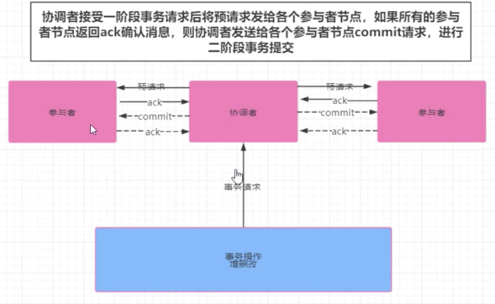
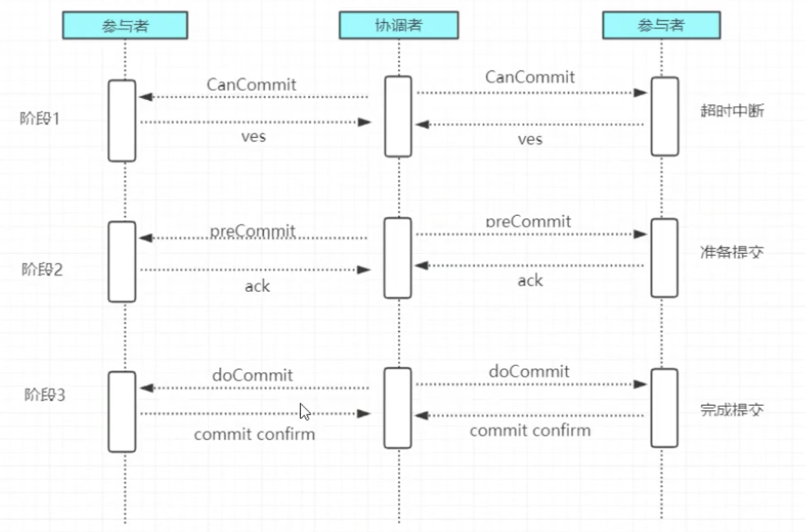
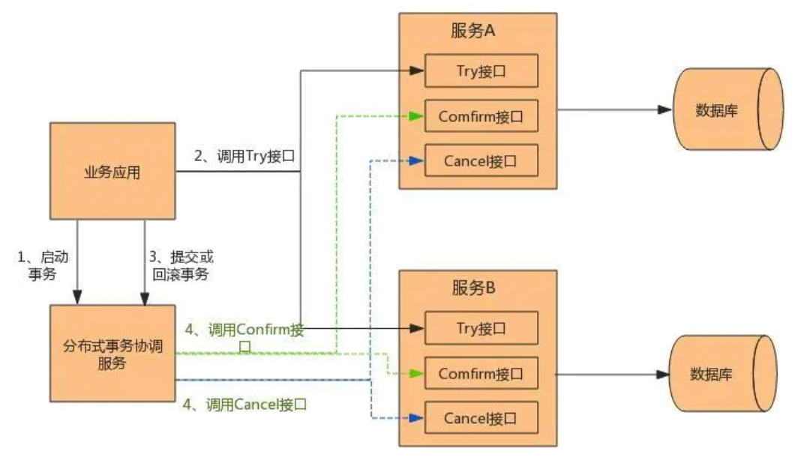
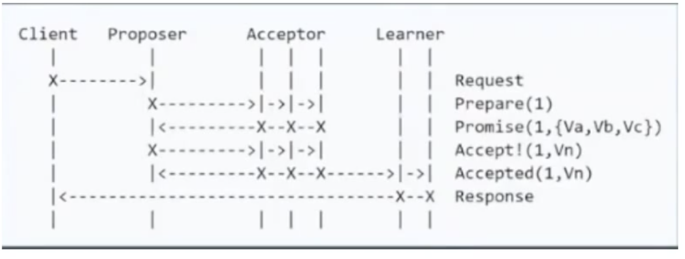
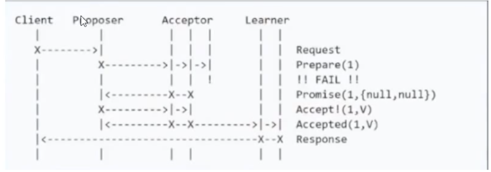
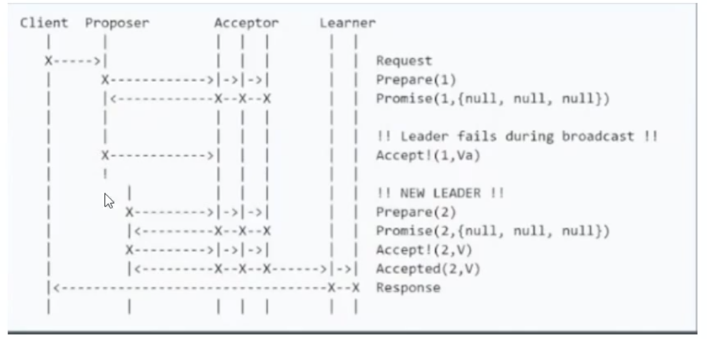
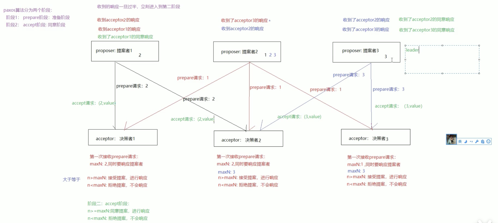
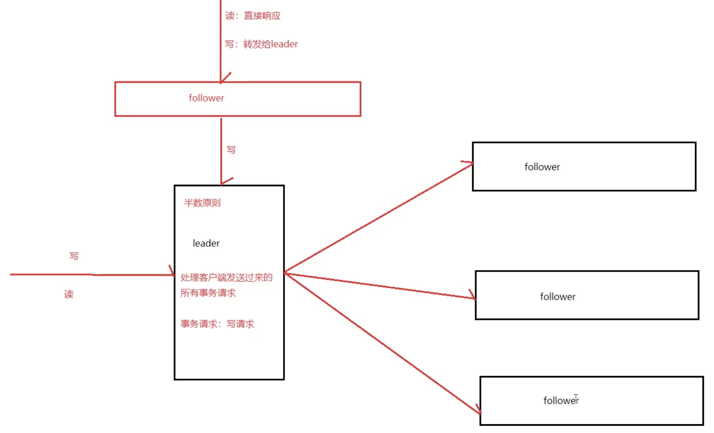
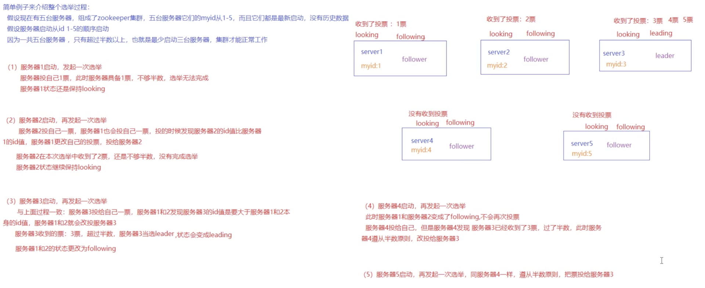
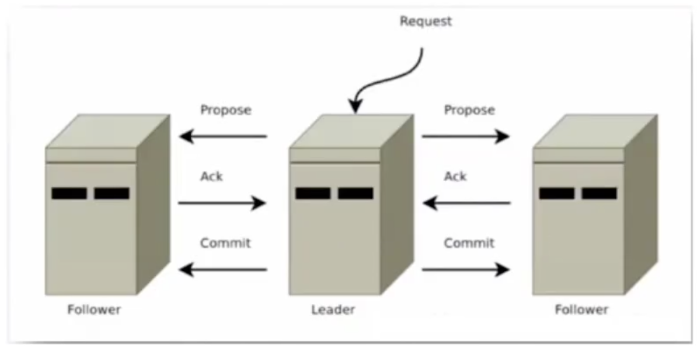

# 基本概念

## CAP

C：一致性

A：可用性

P：分区容错性

CP或者AP

## **BASE 理论**

BASE理论指的是基本可用 Basically Available，软状态Soft State，最终一致性 Eventual Consistency，核心思想是即便无法做到强一致性，但应该采用适合的方式保证最终一致性。

BASE，Basically Available Soft State Eventual Consistency 的简写：

**BA**：Basically Available 基本可用，分布式系统在出现故障的时候，允许损失部分可用性，即保证核心可用。

**S**：Soft State 软状态，允许系统存在中间状态，而该中间状态不会影响系统整体可用性。

**E**：Consistency 最终一致性，系统中的所有数据副本经过一定时间后，最终能够达到一致的状态。

BASE 理论本质上是对 CAP 理论的延伸，是对 CAP 中 AP 方案的一个补充。

## XA简单介绍

XA是由X / Open发布的规范，用于DTP（分布式事务处理）。

DTP分布式模型主要含有

* AP： 应用程序
* TM: 事务管理器
* RM: 资源管理器(如数据库)
* CRM: 通讯资源管理器（如消息队列）

**XA主要就是TM和RM之间的通讯桥梁。**

## 分布式一致性算法前提

### 拜占庭将军问题

士兵（信息通道）可以伪造虚假信息

## **分布式一致性算法考虑的原则**

* safety : 在非拜占庭的情况下，不会返回错误的结果
* available: 在大多数server运行且可以和别的server以及client通信的情况下，系统保证可用
* 不依赖时间来保证一致性，时钟错误，信息延迟会导致可用性不好

# 2PC 二阶段提交

两阶段提交协议（The two-phase commit protocol，2PC）是 XA 用于在全局事务中协调多个资源的机制

## 1、阶段一提交事务请求

1、协调者向所有的参与者节点发送事务内容,询问是否可以执行事务操作,并等待其他参与者节点的反馈

2、各参与者节点执行事务操作

3、各参与者节点反馈给协调者,事务是否可以执行

## 2、阶段二事务提交

根据一阶段各个参与者节点反馈的ack如果所有参与者节点反馈ack,则执行事务提交,否则中断事务

### 事务提交:

1、协调者向各个参与者节点发送commit请求

2、参与者节点接受到commit请求后,执行事务的提交操作

3、各参与者节点完成事务提交后,向协调者返送提交commit成功确认消息

4、协调者接受各个参与者节点的ack后,完成事务commit

### 中断事务:

1、发送回滚请求

2、各个参与者节点回滚事务

3、反馈给协调者事务回滚结果

4、协调者接受各参与者节点ack后回滚事务

## 二阶段提交存在的问题:

### 1、同步阻塞

二阶段提交过程中,所有参与事务操作的节点处于同步阻塞状态,无法进行其他的操作

### 2、单点问题

一旦协调者出现单点故障,无法保证事务的一致性操作

### 3、数据不一致

如果分布式节点出现网络分区,标些参与者未收到Commit提交命令。则出现部分参与者完成数据提交。未收到commit的命令的参与者则无法进行事务提交,整个分布式系统便出现了数据不一致性现象。

总结三种场景：协调者挂了；参与者挂了；两者都挂了。问题：不知道执行到哪一步才挂的，事物是否提交。所以多增加一个阶段提交，这样好歹知道是在事物提交之前挂的。

2PC不考虑超时回滚的情况下它是安全的, 2PC可以保证safety但是不保证liveness.

# 3PC 三阶段提交

3PC是2PC的改进版,实质是将2PC中提交事务请求拆分为两步,形成了anCommit、PreCommit、doCommit三个阶段的事务一致性协议

## 阶段一: CanCommit

1、事务询问

2、各参与者节点向协调者反馈事务询问的响应

## 阶段二: PreCcommit

根据阶段一的反馈结果分为两种情况

### 1、执行事务预提交

1）发送预提交请求

协调者创沂有参与者节点发送preCcommit请求,进入prepared阶段

2）事务预提交

各参与者节点接受到preCommit请求后,执行事务操作

3)各参与者节点向协调者反馈事务执行

### 2、中断事务

任意一个参与者节点反馈给协调者响应No时,或者在等待超时后,协调者还未收到参与者的反

馈,就中断事务,中断事务分为两步:

1)协调者向各个参与者节点发送abort请求

2)参与者收到abort请求,或者等待超时时间后,中断事务

## 阶段三: doCommit

### 1、执行提交

1) 发送提交请求

协调者向所有参与者节点发送doCommit请求

2) 事务提交

各参与者节点接受到doCommit请求后,执行事务提交操作

3) 反馈事务提交结果

各参与者节点完成事务提交以后,向协调者发送ack

4) 事务完成

协调者接受各个参与者反馈的ack后,完成事务

### 2、中断事务

1) 参与者接受到abort请求后,执行事务回滚

2) 参与者完成事务回滚以后,向协调者发送ack

3) 协调者接受回滚ack后,回滚事务

## 三阶段解决的问题

1、引入超时时间，解决了同步阻塞

2、参与者长时间接收不到协调者响应，就会将事务进行提交，使用这个机制解决了单点问题

3PC是2PC的改进版, 实质是将2PC中提交事务请求拆分为两步, 形成了CanCommit、PreCommit、doCommit三个阶段的事务一致性协议（减少同步阻塞的发生范围）

**简单概括一下就是，如果挂掉的那台机器已经执行了commit，那么协调者可以从所有未挂掉的参与者的状态中分析出来，并执行commit。如果挂掉的那个参与者执行了rollback，那么协调者和其他的参与者执行的肯定也是rollback操作。**

所以，再多引入一个阶段之后，3PC解决了2PC中存在的那种由于协调者和参与者同时挂掉有可能导致的数据一致性问题。

### 3PC存在的问题

在doCommit阶段，如果参与者无法及时接收到来自协调者的doCommit或者rebort请求时，会在等待超时之后，会继续进行事务的提交。

所以，由于网络原因，协调者发送的abort响应没有及时被参与者接收到，那么参与者在等待超时之后执行了commit操作。这样就和其他接到abort命令并执行回滚的参与者之间存在数据不一致的情况

参考：[分布式事务中2PC与3PC的区别](https://blog.csdn.net/yyd19921214/article/details/68953629?utm_source=app&app_version=4.6.1)

# PC的应用

## 注意

一般的主从同步并不涉及相关的分布式协议，基本都是异步使用日志或镜像进行主从同步，达成最终一致性。比如：DHFS的namenode，redis的主从同步以及MySQL的主从同步。不要把2pc，3pc，paxos等分布式一致性算法想象为处理主从复制这个过程的算法。

## mysql的2pc应用

参考：[https://www.cnblogs.com/hustcat/p/3577584.html](https://www.cnblogs.com/hustcat/p/3577584.html)

## flink的2pc应用

参考：[https://www.cnblogs.com/zhipeng-wang/p/14082806.html](https://www.cnblogs.com/zhipeng-wang/p/14082806.html)

# 补偿事务（TCC）

TCC（**Try-Confirm-Cancel**）又称补偿事务。其核心思想是："针对每个操作都要注册一个与其对应的确认和补偿（撤销操作）"。它分为三个操作：

*  Try阶段：主要是对业务系统做检测及资源预留。 
*  Confirm阶段：确认执行业务操作。 
*  Cancel阶段：取消执行业务操作。

TCC是应用层的2PC实现

TCC事务的处理流程与2PC两阶段提交类似，不过2PC通常都是在跨库的DB层面，而TCC本质上就是一个应用层面的2PC，**需要通过业务逻辑来实现**。这种分布式事务的实现方式的优势在于，可以让**应用自己定义数据库操作的粒度，使得降低锁冲突、提高吞吐量成为可能**。

而不足之处则在于**对应用的侵入性非常强**，业务逻辑的每个分支都需要实现try、confirm、cancel三个操作。此外，其实现难度也比较大，需要按照网络状态、系统故障等不同的失败原因实现不同的回滚策略。为了满足一致性的要求，**confirm和cancel接口还必须实现幂等**。

 TCC的具体原理图如👇：

## 2PC比较：数据库VS应用

比较容易取得共识的结论：不同业务系统之间使用2PC。

那剩下的问题就简单了, 相同业务系统之间是使用数据访问层2PC还是TCC？一般而言，基于研发成本考虑，会建议：新系统由数据库层来实现统一的分布式事务。

但对热点数据，例如商品（票券等）库存，建议使用TCC方案，因为TCC的主要优势正是可以避免长时间锁定数据库资源进而提高并发性。

2PC、3PC、TCC都是基于XA协议思想，TCC是应用层/业务层，TCC实际上为2PC的变种。

## 2PC与Paxos

有一种广为流传的观点:"2PC到3PC到Paxos到Raft"，即认为:

• 2PC是Paxos的残次版本

• 3PC是2PC的改进

上述2个观点都是我所不认同的，更倾向于如下认知：

• 2PC与Paxos解决的问题不同：2PC是用于解决数据分片后，不同数据之间的分布式事务问题；而Paxos是解决相同数据多副本下的数据一致性问题。例如，UP-2PC的数据存储节点可以使用MGR来管理统一数据分片的高可用

• 3PC只是2PC的一个实践方法：一方面并没有完整解决事务管理器宕机和资源管理器宕机等异常，反而因为增加了一个处理阶段让问题更加复杂

# Paxos算法

读音：/pakses/

Paxos算法是LeslieLamport1990年提出的一种一致性算法, 该算法是一种提高分布式系统容错性的一致性算法, 解决了3PC中网络分区的问题, paxos算法可以在节点失效、网络分区、网络延迟等各种异常情况下保证所有节点都处于同一状态, 同时paxos算法引入了“过半“理念, 即少数服从多数原则。

**paxos有三个版本:**

* BasicPaxos
* MultiPaxos
* FastPaxos

## 四种角色

在paxos算法中, 有四种种角色, 分别具有三种不同的行为, 但多数情况, 一个进程可能同时充当多种角色。

* client: 系统外部角色, 请求发起者, 不参与决策
* proposer: 提案提议者
* acceptor: 提案的表决者, 即是否accept该提案, 只有超过半数以上的acceptor接受了提案, 该提案才被认为被“选定“
* learners: 提案的学习者, 当提案被选定后, 其同步执行提案, 不参与决策

## 两个阶段

prepare阶段（准备解决）、accept阶段（同意阶段）

1、prepare阶段

<1> proposer提出一个提案, 编号为N, 发送给所有的acceptor。

<2> 每个表决者都保存自己的accept的最大提案编号maxN, 当表决者收到prepare(N) 请求时, 会比较N与maxN的值, 若N小于maxN, 则提案已过时, 拒绝prepare(N) 请求。若N大于等于maxN, 则接受提案, 并将该表决者曾经接受过的编号最大的提案Proposal(myid, maxN, wvalue) 反馈给提议者: 其中myid表示表决者acceptor的标识id, maxN表示接受过的最大提案编号maxN, value表示提案内容。若当前表决者未曾accept任何提议, 会将proposal(myid, nullnull) 反馈给提议者。

2、accept阶段

<1> 提议者proposa|发出prepare(N) , 若收到超过半数表决者acceptor的反馈, proposal将真正的提案内容proposal(N, wvalue) 发送给所有表决者。

<2> 表决者aCCeptor接受提议者发送的proposal提案后, 会将自己曾经accept过的最大

提案编号maxN和反馈过的prepare的最大编号, 若N大于这两个编号, 则当前表决者accept该提

案, 并反馈给提议者。否则拒绝该提议。

<3> 若提议者没有收到半数以上的表决者accept反馈, 则重新进入prepare阶段, 递增提案编号, 

重新提出prepare请求。若收到半数以上的accept, 则其他未向提议者反馈的表决者称为

learner, 主动同步提议者的提案。

正常流程

单点故障，部分节点失败

proposer失败

Basic Paxos算法存在活锁问题（liveness）或全序问题

>活锁：并发导致的你让我我让你，如对面走路互相让路还是会冲突。避免活锁：执行时间错开。
>注意Basic Paxos的活锁原因是proposer1在发送请求给accepter之后挂掉了，然后proposer2又向accepter发送了新的请求，然后导致的活锁问题。更深层proposer可以有多个，所以mutil paxos采用了leader（单个）替代proposer（多个）解决活锁问题，如果leader挂掉就重新选举，都是leader说了算就不会产生活锁问题了。

## 消化理解

### paxos算法

基于消息传递一关有高度容错性的一种算法, 是目前公认的解决分布式一致性问题最有效的算法

### 重要概念

半数原则: 少数服从多数

### 解决问题

在分布式系统中, 如果产生容机或者网络异常情况, 快速的正确的在集群内部对染个数据的信达成一致, 并玟不管发生任何异常, 都不会破坏整个系统的一致性

#### 复杂度问题

为了解决活锁问题，出现了multi-paxos；

为了解决通信次数较多的问题，出现了fast-paxos；

为了尽量减少冲突，出现了epaxos。

可以看到，工业级实现需要考虑更多的方面，诸如性能，异常等等。这也是许多分布式的一致性框架并非真正基于paxos来实现的原因。

#### 全序问题

对于paxos算法来说，不能保证两次提交最终的顺序，而zookeeper需要做到这点。

### 理解basic paxos细节

* proposer是可以有多个，所以他叫做proposer，而不叫leader
* proposer并不强制要发送propose到全部acceptor，也可以发送70%的acceptor，只要通过的有半数以上，就认为协议是成功的
* 容易看出，第二阶段的时候client仍需要等着，只有在第二阶段大半acceptor返回accepted后，client才能得到成功的信息
* 有一些错误场景中，proposer会互相锁住对方的递交，详细可以看wiki，这里不多阐述：[Paxos (computer science)](https://en.wikipedia.org/wiki/Paxos_(computer_science))

## Multi Paxos

### 改进点

* Multi Paxos中采用了 Leader election 保证了只有一个Proposer，避免了活锁的问题
* Basic Paxos中只有Proposer知道 选择了哪个value，如果其他server想知道选择了哪个，那么就得按照paxos协议发起请求。
* multi paxos 目标是实现复制日志序列；实现的时候我们在Prepare和accept的时候，加上日志记录的序号即可。

## **Fast Paxos**

在Multi Paxos中，**proposer -> leader -> acceptor -> learner**，从提议到完成决议共经过3次通信，能不能减少通信步骤？

对Multi Paxos phase2a，如果可以自由提议value，则可以让proposer直接发起提议、leader退出通信过程，变为**proposer -> acceptor -> learner**，这就是Fast Paxos[2]的由来。

Multi Paxos里提议都由leader提出，因而不存在一次决议出现多个value，Fast Paxos里由proposer直接提议，一次决议里可能有多个proposer提议、出现多个value，即出现提议冲突(collision)。**leader起到初始化决议进程(progress)和解决冲突的作用，当冲突发生时leader重新参与决议过程、回退到3次通信步骤。**

Paxos自身隐含的一个特性也可以达到减少通信步骤的目标，如果acceptor上一次确定(chosen)的提议来自proposerA，则当次决议proposerA可以直接提议减少一次通信步骤。如果想实现这样的效果，需要在proposer、acceptor记录上一次决议确定(chosen)的历史，用以在提议前知道哪个proposer的提议上一次被确定、当次决议能不能节省一次通信步骤。

## **EPaxos**

除了从减少通信步骤的角度提高Paxos决议效率外，还有其他方面可以降低Paxos决议时延，比如Generalized Paxos[3]提出不冲突的提议(例如对不同key的写请求)可以同时决议、以降低Paxos时延。

更进一步地，EPaxos[4](Egalitarian Paxos)提出一种既支持不冲突提议同时提交降低时延、还均衡各节点负载、同时将通信步骤减少到最少的Paxos优化方法。

为达到这些目标，EPaxos的实现有几个要点：

* 一是EPaxos中没有全局的leader，而是每一次提议发起提议的proposer作为当次提议的leader(command leader)；
* 二是不相互影响(interfere)的提议可以同时提交；
* 三是跳过prepare，直接进入accept阶段。

# ZAB协议

由于paxos算法窍现起来较难, 存在活锁和全序问题(无法保证两次最终提交的顺序) , 所以zookeeper并没有使用paxos作为一致性协议, 而是使用了ZAB协议。

ZAB（zookeeper atomic broadcast) : 是一种支持崖溃恢复的原子广播协议, 基于**multi** **paxos**实现

ZooKeeper使用**单一主进程Leader用于处理客户端所有事务请求, , 即写请求**。当服务器数据发生变更好, 集群采用ZAB原子广播协议, 以事务提交proposal的形式广播到所有的副本进程, 每一个事务分配一个全局的递增的事务编号xid。

**若客户端提交的请求为读请求时, 则接受请求的节点直接根据自己保存的数据响应**。**若是写请求, 且当前节点不是leader, 那么该节点就会将请求转发给leader, leader会以提案的方式广播此写请求, 如果超过半数的节点同意写请求, 则该写请求就会提交。**leader会通知所有的订阅者同步数据。

## 三种角色

* leader
负责处理集群的写请求，并发起投票，只有超过半数的节点同意后才会提交该写请求

* follower
处理读请求，响应结果。转发写请求到leader，在选举leader过程中参与投票

* observer
可以理解为没有投票权的follower，主要职责是协助follower处理读请求。那么当整个zk集群读请求负载很高时（此时会使用observer缓解读请求压力），为什么不直接增加follow节点而是增加observer节点呢？原因是增加follower节点会让leader在提出写请求提案时，需要半数以上的follower投票节点同意，这样会增加leader和foloower的通信压力，降低写操作效率

## 两种模式

### 恢复模式

当服务启动或领导崩溃后, zk进入恢复状态, 选举leader, leader选出后, 将完成leader别其他机器的数据同步, 当大多数server完成和leader的同步后, 恢复模式结束

### 广播模式

**一旦Leader已经和多数的Follower进行了状态同步后, 进入广播模式**。进入广播模式后, 如果有

新加入的服务器, 会自动从leader中同步数据。leader在接收客户端请求后, 会生成事务提案广播

给其他机器, 有超过半数以上的follower同意该提议后, 再提交事务。

**注意在ZAB的事务的二阶段提交中, 移除了事务中断的逻辑, follower要么ack, 要么放弃, leader无需等待所有的follower的ack。**

## zxid

zxid是64位长度的Long类型, 其中高32位表示纪元epoch, 低32位表示事务标识xid。即zxid由两部分构成: epoch和xid

每个leader都会具有不同的epoch值, 表示一个纪元, 每一个新的选举开启时都会生成一个新的

epoch, 新的leader产生, 会更新所有的zKServer的zxid的epoch, xid是一个依次递增的事务编号。

## leader选举算法

### 三个核心选举原则

1、集群中只有超过了半数以上的服务器启动，集群才能正常工作

2、在集群正常工作之前，myid小的服务器会给myid大的服务器进行，持续到集群正常工作，选出leader

3、选择leader之后，之前的服务器状态由looking改变为following，以后的服务器都是follower

### 启动过程

* 每一个server发出一个投票给集群中其他节点
* 收到各个服务器的投票后, 判断该投票有效性, 比如是否是本轮投票（解决活锁问题）, 是否是looking状态
* 处理投票, pk别人的投票和自己的投票比较规则xid > myid“取大原则“
* 统计是否超过半数的接受相同的选票
* 确认leader, 改变服务器状态
* 添加新server, leader已经选举出来, 只能以follower身份加入集群中

### 崩溃恢复过程

* leader挂掉后, 集群中其他follower会将状态从FOLLOWING变为LOOKING, 重新进入leader选举
* 同上启动过程

### 消息广播算法

一旦进入广播模式, 集群中非leader节点接受到事务请求, 首先会将事务请求转发给服务器, leader服务器为其生成对应的事务提案proposal，并发送给集群中其他节点，如果过半则事务提交；

* leader接收到消息后, 消息通过全局唯一的64位自增事务id，zxid标识
* leader发送给follower的提案是有序的, leader会创建一个FIFFO队列, 将提案顺序写入队列中发送给follower
* follower接受到提案后, 会比较提案zxid和本地事务日志最大的zxid, 若提案zxid比本地事务id大（保证全序）, 将提案记录到本地日志中, 反馈ack给leader, 否则拒绝
* leader接收到过半ack后, leader向所有的follower发送commit, 通知每个follower执行本地事务

## ZAB与Paxos比较

ZAB和Paxos最大的不同是，**ZAB主要是为分布式主备系统设计的，而Paxos的实现是一致性状态机(state machine replication)**

尽管ZAB不是Paxos的实现，但是ZAB也参考了一些Paxos的一些设计思想，比如：

* leader向follows提出提案(proposal)
* leader 需要在达到法定数量(半数以上)的follows确认之后才会进行commit
* 每一个proposal都有一个纪元(epoch)号，类似于Paxos中的选票(ballot)

# Reference

[zookeeper工作原理](https://www.cnblogs.com/raphael5200/p/5285583.html)

[Paxos基本入门](https://b23.tv/UpL9jf)
