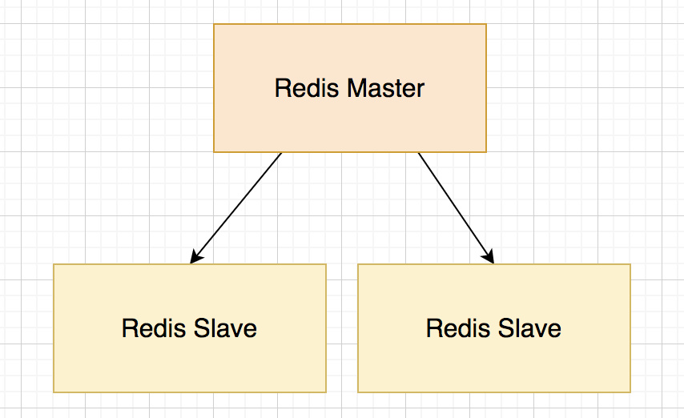
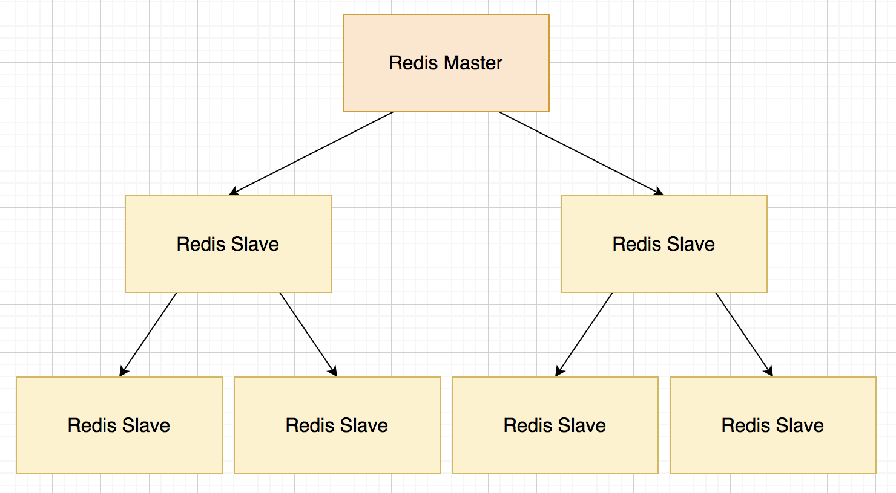
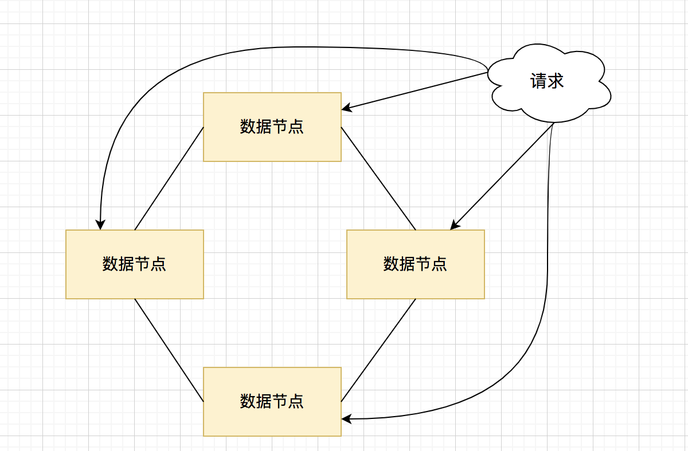
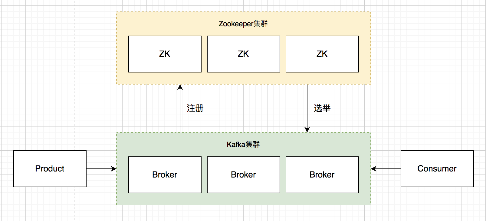
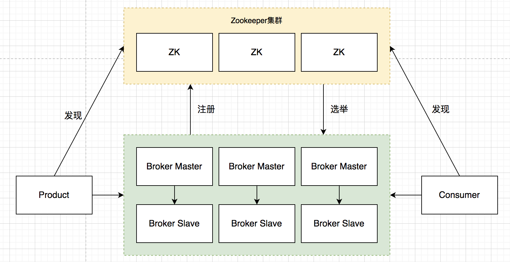

# 背景

分布式架构一般有以下几种结构：

* 主从架构
* 去中心化架构
* 混合型架构
# Redis分布式模式

Redis一般有两种模式：

* 主从模式
* 集群模式（Redis Cluster）
## 主从模式

### 标准主从模式

标准的Redis主从模式，只有 Master 节点接收写入请求，并将写入的数据复制给一个或多个Slave，形成良好的读写分离机制，多个 Slave 可以分担读请求。Redis 主从是标准的分布式中心化思想。

### 树形主从模式

Redis 应用场景大多是极高并发的内存 I/O，常见应用场景是作为数据库的防护网，防止数据库被击穿，因此标准的主从模式中的 Master 对外既要承担写入，对内又要承担各个节点的复制操作，资源消耗很大，且随着 slave 节点增多问题越发明显。因此又形成主从的一个变形形式。

## 集群模式

对于高并发的业务场景，Master 始终是一个隐患。因为 Master 承担着所有的写操作，如果没有HA解决方案一旦宕机，集群将不可用。因此 Redis 社区推出集群方案，主要是为了解决 Master 压力，即集群的分布式无中心模式。

无中心模式采用虚拟槽概念，独立于物理节点。虚拟槽有 0～16383 个，数据会进行 key 的hash计算，确定进入哪个槽位。而物理节点负责哪些虚拟槽，即对应关系可以自行指定。

每个节点（数据节点）都是**对等节点**。此外，为了高可靠HA，每个节点也可以再演变成 Master 和 Slave 的主从模式部署。

## 小结

Redis 最成熟的方案还是主从模式，Redis Cluster 带来的性能优势无法抵消去中心化带来的不成熟和不可靠问题，导致人工运维的复杂度和难度。生产中慎用 Redis Cluster。

# Kafka

## 架构

Kafka 集群使用 Zookeeper 集群来管理，Broker 的注册发现等都是依靠 zookeeper 来协助完成。每个 Broker 会以一主二从（Leader 和 Follower）的方式均匀分布。

生产者（Product）从任意节点获取 Meta 信息，找到 Broker 中的 Leader 分区副本，会向里面写分配好的数据，Leader 会向集群中其他 Broker 的 Follower 分区副本复制。

## 小结

Broker 分区信息是分布在每一台 Broker 的 meta 缓存里面，生产者和消费者可以在任意一台 Borker 上获取需要操作的 Leader 分区信息，Kafka 这种设计有点去中心化的意思。但是这些 meta 缓存信息实质是来自 Zookeeper（强依赖），所以本质上 Kafka 依然是中心化管理。

# RocketMQ

## 架构

RocketMQ 总体结构与 Kafka 类似，更适合高并发场景，使用 NameServer 替代了 Zookeeper。

NameServer 是无中心节点的，都通过锁注册表的方式共享信息。NameServer 是 Broker 的注册表，Broker 新注册或者异常退出，对应的 NameSever 都会感知到。NameServer 增加/删除所辖 Broker 信息到该注册表，并定时读取最新的集群所有broker信息。

生产者（Producet）连接一个 NameServer，便能获取到想要发送分区数据的 Brokers（消费者同理）。

每个 Borker 可以再分成主从模式，Master 进行队列操作，Slave 只做数据同步，Master 出现故障时进行替换。

## 小结

NameSever 相对于 Zookeeper 的结构更简单，生产者和消费者对 Broker 以及分区的获取必须来自 NameSever，尽管 NameSever 集群本身是无中心的，但整个 RocketMQ 的 Brokers 是被 NameSever 中心化管理的，但整体上 Product、Consumer、Brokers集群对这种集中管理的依赖程度并不高，只是提供了很简单的 Broker 元信息服务，真正的数据流还是交给各个Broker 自行解决。

