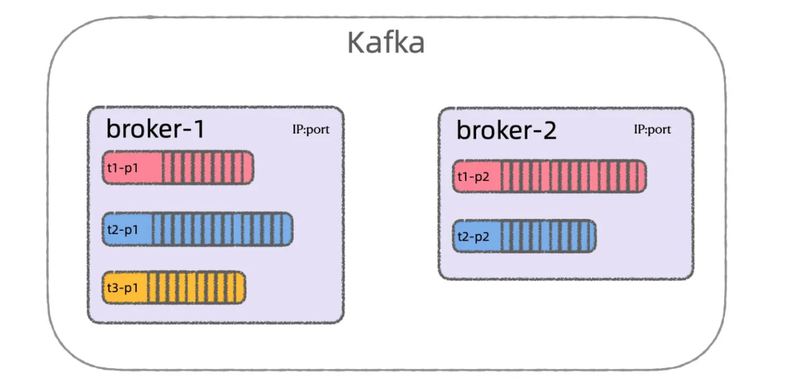
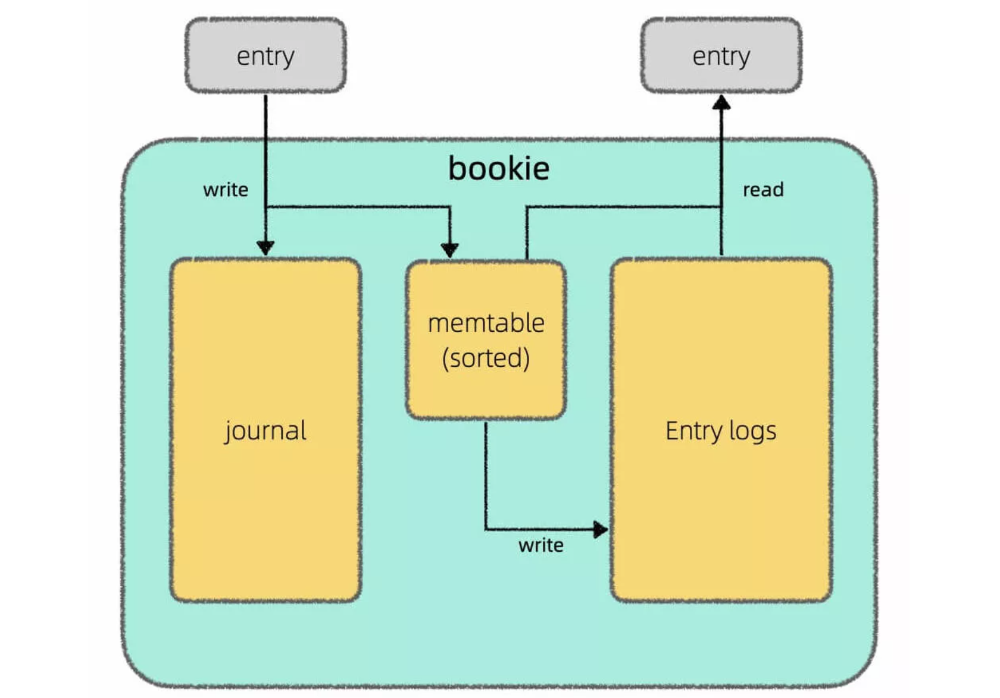

# 背景

## Pulsar介绍

Apache Pulsar 是一个云原生、分布式的流式处理和消息队列的平台。

关键特性：

* 云原生架构（计算与存储分离），无缝支持跨集群复制
* 比kafka更高的吞吐量和低延迟
* 无缝支持上百万个topics支持多种消息订阅模式 (exclusive & shared & failover)
* 通过持久化存储BookKeeper保障消息的传递
* 轻量级Serverless计算框架Pulsar Functions提供了流式数据处理能力。
* 提供分层存储能力，释放BookKeeper的空间：将老数据or长期不用的数据放到AWS S3等
# 传统MQ问题

以 Kafka 举例，Kafka 把 broker 和 partition 的数据存储牢牢绑定在一起，会产生很多问题。




## 数据全量复制

Kafka 的很多操作都涉及 partition 数据的全量复制。

* 扩容broker
假设有 broker1, broker2 两个节点，分别负责若干个 partition，如果新加入一个 broker3 节点分摊 broker1 的部分负载，那么 broker1 得分出一些 partition 给到 broker3。必须复制 partition 的全量数据之后，broker3 才能提供服务。不仅消耗 IO 以及网络资源，且如果复制数据的速度小于 partition 的写入速度，那就无法完成复制。 

* 增加follower副本
新增 follower 副本必须要跟 leader 副本同步全量数据。

* partition迁移
如果某些 partition 中的数据特别多（数据倾斜），对应 broker 的磁盘可能很快被写满，会涉及到 partition 的迁移，数据复制无法避免。

虽然 Kafka 提供了现成的脚本可以完成这些事情，但实际面临的问题较多，操作也较复杂，数据迁移也是一件耗时耗力的事，远远做不到集群级别的自动的平滑操作。

## 依赖Page Cache

Page Cache 实际上就是文件的读写缓存，Linux 文件系统会利用该机制优化性能，写入数据时 Linux 返回成功，实际上数据并没有真正写入磁盘中，而是写到了 Page Cache 缓存中，等后续刷新写入到磁盘中。当出现断电等系统故障时，如果缓存中数据没有写入磁盘中，那么会出现数据丢失的情况。

Kafka 底层完全依赖 Page Cache，没有要求 Linux 强制刷新磁盘，对于一些强一致的需求场景是不可接受的，如金融、电商等。

另外 Page Cache 也是有可能出现性能问题的。消费者消费数据可以分为以下两种情况：

* 追尾读（Tailing Reads）
定义：就是消费者的消费速度很快，生产者生产消息，消费者立刻能够消费。

broker处理过程：生产者生产消息，broker 写入到 Page Cache 写缓存，消费者立刻来读取消息，这时 broker 可以快速从 Page Cache 读取消息发送给消费者。

* 追赶读（Catch-up Reads）
定义：消费者的消费速度很慢，生产者生产了很多新消息，但消费者还在读取比较旧的消息。

broker处理过程：Page Cache 缓存里没有消费者想读取的旧消息，broker 必须从磁盘中读取数据并存储在 Page Cache 读缓存中。这样读写操作都依赖 Page Cache，就会导致读写操作会互相影响，对一个 partition 的大量读可能影响写性能，大量写也可能会影响读性能，并且读写缓存会互相争抢内存资源，可能会造成 IO 性能问题。

# 架构设计

基于传统 MQ 的一些问题，Pulsar 在系统架构上做了一些重新设计，如计算存储分离、读写分离。

## 分层架构

### Broker无状态层

与kafka不同，Pulsar Broker不存储实际的数据，而是将消息存储在 BookKeeper 中，仅仅拥有 Topic/Partitions 的代理权。屏蔽了 message 复杂的读写流程，保证了数据一致性和负载均衡。meta 信息是存储在 zookeeper 中，消息存储到 BookKeeper 中。

### BookKeeper存储层

BookKeeper 是一个分布式的预写日志（WAL）系统，Pulsar 使用 Apache BookKeeper 作为持久化存储。

主要特性有：

* 支持创建多个独立的 ledgers（Fragment/Segment）随着时间的推移，底层数据以 Ledger形式存储，Pulsar会为Topic创建多个 ledgers。
* 为按条目复制的顺序数据提供了非常高效的存储。
* 保证了多系统挂掉时ledgers的读取一致性。
* 提供不同的Bookies（BookKeeper实例）均匀的IO分布的特性。
* 容量和吞吐量都能水平扩展。并且容量可以通过在集群内添加更多的Bookies立刻提升。
* 被设计成可以承载数千的并发读写的ledgers。 使用多个磁盘设备，一个用于日志，另一个用于一般存储，可以将读操作的影响和对于写操作的延迟分隔开。

## 计算存储分离

解决的问题：避免 broker 扩容时 partition 的数据迁移。

解决方案：原来 broker 同时负责计算（提供服务给生产者和消费者）和存储（消息的持久化）。Plusar 将两者分离，改用多层的计算存储分离架构，broker 只负责计算，将存储交给底层存储引擎 Bookkeeper。

Kafka 中可以把每个 partition 理解成一个存储消息的大文件，在 broker 之间转移 partition 需要复制数据。在 Pulsar 中可以把每个 partition 理解成一个文件描述符，broker 只需要持有该文件描述符即可，可以把数据的处理全部交给存储引擎 Bookkeeper。且因为 broker 是无状态的，可以非常方便地借助 kubernetes 实现弹性扩缩容等。

如果某个 broker 节点压力很大，增加 broker 节点去分担 partition 即可。与之类似的如果某个 broker 节点宕机，直接转移 partition 到其它 broker 即可，这些操作都不涉及数据复制。

## 对等节点

Kafka 使用主从复制的方式实现高可用；Bookkeeper 采用 Quorum 机制实现高可用。

Bookkeeper 集群由若干 bookie 节点（运行着 bookie 进程的服务器）组成的，和 Kafka 的主从复制机制不同，这些 bookie 节点都是对等的没有主从之分。

数据写入方式，条带化写入：当 broker 要求 Bookkeeper 集群存储一条消息（entry）时，该消息会被并发地同时写入多个 bookie 节点进行存储。之后的消息会以滚动的方式选取不同的 bookie 节点进行写入。

这种写入方式既实现了数据的冗余存储，又使得数据能够均匀分布在多个存储节点上，从而避免数据倾斜导致某个存储节点压力过大。

对等节点的好处在于可以进行快速故障恢复和扩容。

Bookkeeper 中维护了类似下面的一组元数据：

```plain
[bookie1, bookie2, bookie3], 0
[bookie1, bookie3, bookie4], 100
```
这组元数据的含义是：entry0 ~ entry99 都写到了 bookie1, bookie2, bookie3 中，entry100及之后的消息都写到了 bookie1, bookie3, bookie4 中。
这组元数据记录了每条 entry 具体的位置，即便 bookie2 节点故障，还有其它节点如 bookie1, bookie3 节点可以读取。 

## 读写分离

bookie 节点实现读写隔离，不再依赖操作系统的 Page Cache，而是自行维护缓存，保证了数据可靠性和高性能。




每个 bookie 节点都拥有两块磁盘，其中 Journal 磁盘专门用于写入数据，Entry Log 磁盘专门用于读取数据，而 memtable 是 bookie 节点自行维护的读写缓存。

其中 Journal 盘的写入不依赖 Page Cache，直接强制刷盘（可以配置），写入完成后 bookie 节点就会返回 ACK 写入成功。

写 Journal 盘的同时，数据还会在 memotable 缓存中写一份，memotable 会对数据进行排序，一段时间后刷入 Entry Log 盘。

这样不仅多了一层缓存，而且 Entry Log 盘中的数据有一定的有序性，在读取数据时可以一定程度上提高性能。

### 写流程

Broker 数据写入流程如下：

1. 将写请求记入 WAL
>一般工程实践上建议把 WAL 和数据存储文件分别存储到两种存储盘上，如把 WAL 存入一个 SSD 盘，而数据文件存入另一个 SSD 或者 SATA 盘。

2. 将数据写入内存缓存中
3. 写缓存写满后，进行数据排序并进行 Flush 操作，排序时将同一个 Ledger 的数据聚合后以时间先后进行排序，以便数据读取时快速顺序读取；
4. 将 <(LedgerID, EntryID), EntryLogID> 写入 RocksDB。
>LedgerID 相当于 kafka 的 ParitionID，EntryID 即是 Log Message 的逻辑 ID，EntryLogId 就是 Log消息在 Pulsar Fragment文件的物理 Offset。
>这里把这个映射关系存储 RocksDB 只是为了加快写入速度，其自身并不是 Pulsar Bookie 的关键组件。

### 读流程

Bookie 数据读取流程如下：

1. 从写缓存读取数据，写缓存有最新的数据；
2. 如果写缓存不命中，则从读缓存读取数据；
3. 如果读缓存不命中，则根据 RocksDB 存储的映射关系查找消息对应的物理存储位置，然后从磁盘上读取数据；
4. 把从磁盘读取的数据回填到读缓存中；
5. 返回数据给 Broker。
### 优缺点

这样设计的缺点是一份数据要存两次，消耗磁盘空间，但优势也很明显：

1、可靠性得到保证，不会丢失数据。因为 Journal 落盘后才判定为写入成功，即使机器断电数据也不会丢失。

2、数据读写不依赖操作系统的 Page Cache，即便读写压力较大，也可以保证稳定的性能。

3、可以灵活配置。Journal 盘的数据可以定时迁出，可以采用存储空间较小但写入速度快的存储设备来提高写入性能。

# 对比Kafka

## 名词对应表

|Pulsar|Kafka|
|:----|:----|
|Topic|Topic|
|Partition|Partition|
|Ledger(Segment)/Fragment|Fragment/Segment|
|Bookie|Broker|
|Broker|Client SDK|
|Ensemble Size|metadata.broker.list|
|Write Quorum Size (Qw)|Replica Number|
|Ack Quorum Size (Qa)|request.required.acks|

## 优劣势

优势：

* 计算存储分离，避免数据拷贝
* 无状态：可以快速扩容、故障恢复
* 稳定性更佳：[https://openmessaging.cloud/docs/benchmarks/pulsar/](https://openmessaging.cloud/docs/benchmarks/pulsar/)
* 更多的特性支持：Pulsar 提供了很多与 Kafka 相似的特性，比如跨域复制、流式消息处理（Pulsar Functions）、连接器（Pulsar IO）、基于 SQL 的主题查询（Pulsar SQL）、schema registry，还有一些 Kafka 没有的特性，比如分层存储和多租户。
劣势：

* Pulsar 项目较新，社区活跃不足，而 Kafka 更加成熟，社区更活跃
* kafka 仅依赖 broker 和 zookeeper，而 Pulsar 还依赖 bookKeeper，增加了系统的复杂性。
# Reference

[Pulsar](https://pulsar.apache.org/docs/2.11.x/concepts-overview/)

[https://alexstocks.github.io/html/pulsar.html](https://alexstocks.github.io/html/pulsar.html)

[比拼 Kafka, 大数据分析新秀 Pulsar 到底好在哪](https://www.infoq.cn/article/1uaxfkwuhukty1t_5gpq)

[https://alexstocks.github.io/html/pulsar.html](https://alexstocks.github.io/html/pulsar.html)

[重构Kafka](https://zhuanlan.zhihu.com/p/596415690)

