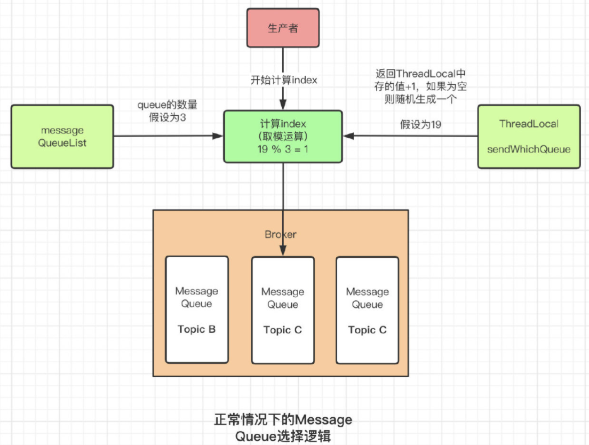

# 源码环境搭建

## 源码下载

[https://github.com/apache/rocketmq](https://github.com/apache/rocketmq)

可直接clone或下载压缩包，这里以 release-4.7.1 版本为例分析。

## 模块启动

主要模块：

1、broker：broker 模块

2、client：客户端（生产者、消费者）

3、example：示例代码

4、namesrv：NameServer 实现相关类

Tips：配置关键代码提示，类似 todo、fixme

在 IDEA 下方的 TODO 中，点击 Filter 图标的 Edit Filters。配置 Patterns，如  `\bk1` 、  `\bk2` 、 `\bkkk` 等；配置 Filters ，选择 刚才配置的 patterns。

参考链接：[https://www.jetbrains.com.cn/help/idea/using-todo.html](https://www.jetbrains.com.cn/help/idea/using-todo.html)

### 源码调试

Execute Maven Goal（IDEA 右边栏 maven 图标）

```shell
clean install -Dmaven.test.skip=true
```
### 配置文件

在根目录下新建 conf 文件夹，将 distribution/conf 下 broker.conf、logback_broker.xml、logback_namesrv.xml、logback_tools.xml 拷贝到该目录下。

### 启动 namesrv

```java
org.apache.rocketmq.namesrv.NamesrvStartup
// 指定环境变量，项目根目录，用于找其下的 conf 目录
ROCKETMQ_HOME=/Users/bo/source_code/rocketmq

// 启动成功，会出现如下日志
The Name Server boot success. serializeType=JSON
```

### 启动 broker

```java
org.apache.rocketmq.broker.BrokerStartup
// 指定环境变量，项目根目录，用于找其下的 conf 目录
ROCKETMQ_HOME=/Users/bo/source_code/rocketmq;NAMESRV_ADDR=127.0.0.1:9876
// 指定程序参数
-c /Users/bo/source_code/rocketmq/conf/broker.conf

// 启动成功
The broker[broker-a, 192.168.2.104:10911] boot success. serializeType=JSON and name server is 127.0.0.1:9876
```

### 启动 consumer

```java
org.apache.rocketmq.example.quickstart.Consumer
// 在 consumer.setConsumeFromWhere xx 前指定 namesrv addr
consumer.setNamesrvAddr("127.0.0.1:9876");
// 或配置环境变量
NAMESRV_ADDR=127.0.0.1:9876
```

### 启动 producer

```java
org.apache.rocketmq.example.quickstart.Producer
// 在 producer.start(); 前指定 namesrv addr
producer.setNamesrvAddr("127.0.0.1:9876");
// 或配置环境变量
NAMESRV_ADDR=127.0.0.1:9876
```

# NameSrv

## NameServer整体结构


# Broker

## Broker架构图


## Broker 注册


 

# sendDefaultImpl

```java
org.apache.rocketmq.client.impl.producer.DefaultMQProducerImpl#sendDefaultImpl
```
## checkMessage

```java
Validators.checkMessage(msg, this.defaultMQProducer);
```

## tryToFindTopicPublishInfo

```java
this.tryToFindTopicPublishInfo(msg.getTopic());
```

## selectOneMessageQueue

```java
this.selectOneMessageQueue(topicPublishInfo, lastBrokerName);
```
Message Queue选择机制
## updateFaultItem

```java
this.updateFaultItem(mq.getBrokerName(), endTimestamp - beginTimestampPrev, true);
```
容错机制下的选择逻辑
# Producer

## Producer 功能

Producer 有两种：

1、普通发送者 DefaultMQProducer。只需要构建一个 Netty 客户端，往 Broker 发送消息即可。

注意：异步回调只是在 Producer 接收到 Broker 的响应后自行调整流程，不需要提供 Netty 服务。

2、事务消息发送者 TransactionMQProducer。需要构建一个 Netty 客户端，往 Broker 发送消息。同时也要构建 Netty 服务端，供 Broker 回查本地事务状态。

## Producer 总体流程


## 检查消息合法性

**org.apache.rocketmq.client.Validators#checkMessage**

* Topic名称中是否包含了非法字符
* Topic名称长度是否超过了最大的长度限制，由常量TOPIC_MAX_LENGTH来决定，其默认值为127
* 当前消息体是否是NULL或者是空消息
* 当前消息体是否超过了最大限制，由常量maxMessageSize决定，值为1024 * 1024 * 4，也就是4M。


## 获取Topic的详情

```java
org.apache.rocketmq.client.impl.producer.DefaultMQProducerImpl#tryToFindTopicPublishInfo
```
当通过了消息的合法性校验之后，需要知道应该把消息发送给谁，此时就需要通过当前消息所属的Topic拿到Topic的详细数据。


获取Topic的方法源码在上面已经给出来了，首先会从内存中维护的一份Map中获取数据。顺带一提，这里的Map是ConcurrentHashMap，是线程安全的，和Golang中的Sync.Map类似。

当然，首次发送 Map 肯定是空的，此时会调用NameServer的接口，通过Topic去获取详情的Topic数据，会在上面的方法中将其加入到Map中去，这样一来下次再往该Topic发送消息就能够直接从内存中获取。这里就是简单的实现的缓存机制 。

从方法名称来看，是通过Topic获取路由数据。实际上该方法，通过调用NameServer提供的API，更新了两部分数据，分别是：

1）Topic路由信息

2）Topic下的Broker相关信息

而这两部分数据都来源于同一个结构体TopicRouteData。

注意 TopicPublishInfo 这个结构体，包含 TopicRouteData

## Producer 路由信息

当获取到了需要发送到的Broker详情，包括地址和MessageQueue，那么此时问题的关注点是具体发送到哪一个Message Queue中去。

核心代码：

```java
org.apache.rocketmq.client.impl.producer.DefaultMQProducerImpl#tryToFindTopicPublishInfo
```
路由信息的管理流程


## Producer 负载均衡

默认会把消息平均地发送到所有 MessageQueue 里，这时设计到 Message Queue 的选择机制

### MessageQueue 核心选择逻辑

流程图




核心逻辑，用大白话讲就是将一个随机数和 Message Queue（TopicPublishInfo中）的容量取模。这个随机数存储在 Thread Local 中，首次计算的时候，会直接随机一个数。

```java
org.apache.rocketmq.client.common.ThreadLocalIndex#getAndIncrement
org.apache.rocketmq.client.latency.MQFaultStrategy#selectOneMessageQueue
```
可以看到，主逻辑被变量 sendLatencyFaultEnable 分为了两部分。
### 容错机制下的选择逻辑

该变量表意为发送延迟故障。本质上是一种容错的策略，在原有的MessageQueue选择基础上，再过滤掉不可用的Broker，对之前失败的Broker，按一定的时间做退避。


```java
this.updateFaultItem(mq.getBrokerName(), endTimestamp - beginTimestampPrev, true);
```
可以看到，如果调用Broker信息发生了异常，那么就会调用 updateFault 这个方法，来更新Broker 的 Aviable 情况。注意这个参数 isolation 的值为 true。接下来从源码级别来验证上面说的退避 3000ms 的事实。
可以看到，isolation 值是 true，则 duration 通过三元运算符计算出来结果为 30000，也就是 30 秒。所以可以得出结论，如果发送消息抛出了异常，那么直接会将该 Broker 设置为 30 秒内不可用。

而如果只是发送延迟较高，则会根据如下的 map，根据延迟的具体时间，来判断该设置多少时间的不可用。

### 正常情况下的选择逻辑

而正常情况下，如果当前发送故障延迟没有启用，则会走常规逻辑，同样的会去for循环计算，循环中取到了 MessageQueue 之后会去判断是否和上次选择的 MessageQueue 属于同一个Broker，如果是同一个 Broker，则会重新选择，直到选择到不属于同一个 Broker 的 MessageQueue，或者直到循环结束。这也是为了将消息均匀的分发存储，防止数据倾斜。


## 发送消息

选到了具体的Message Queue之后就会开始执行发送消息的逻辑，就会调用底层Netty的接口给发送出去，这块暂时没啥可看的。

# Broker的启动流程

## 主从同步

在上面提到过，RocketMQ有自己的主从同步，但是有两个不同的版本，版本的分水岭是在4.5版本。这两个版本区别是什么呢？

1）4.5之前：有点类似于Redis中，我们手动的将某台机器通过命令slave of 变成另一台Redis的Slave节点，这样一来就变成了一个较为原始的一主一从的架构。为什么说原始呢？因为如果此时Master节点宕机，我们需要人肉的去做故障转移。RocketMQ的主从架构也是这种情况。

2）4.5之后：引入了Dleger，可以实现一主多从，并且实现自动的故障转移。这就跟Redis后续推出了Sentinel是一样的。Dleger也是类似的作用。

下图是Broker启动代码中的源码。


可以看到判断了是否开启了Dleger，默认是不开启的。所以就会执行其中的逻辑。

刚好我们就看到了，里面有**Rocket主从同步数据**的相关代码。


如果当前Broker节点的角色是Slave，则会启动一个周期性的定时任务，定期（也就是10秒）去Master Broker同步全量的数据。同步的数据包括：

1）Topic的相关配置

2）Cosumer的消费偏移量

3）延迟消息的Offset

4）订阅组的相关数据和配置

## 注册Broker

完成了主动同步定时任务的启动之后，就会去调用registerBrokerAll去注册Broker。可能这里会有点疑问，我这里是Broker启动，只有当前一个Broker实例，那这个All是什么意思呢？

All是指所有的NameServer，Broker启动的时候会将自己注册到每一个NameServer上去。为什么不只注册到一个NameServer就完事了呢？这样一来还可以提高效率。归根结底还是高可用的问题。

如果Broker只注册到了一台NameServer上，万一这台NameServer挂了呢？这个Broker对所有客户端就都不可见了。实际上Broker还在正常的运行。

进到registerBrokerAll中去。


可以看到，这里会判断是否需要进行注册。通过上面的截图可以看到，此时forceRegister的值为true，而是否要注册，决定权就交给了needRegister

为什么需要判断是否需要注册呢？因为Broker一旦注册到了NameServer之后，由于Producer不停的在写入数据，Consumer也在不停的消费数据，Broker也可能因为故障导致某些Topic下的Message Queue等关键的路由信息发生变动。

这样一来，NameServer中的数据和Broker中的数据就会不一致。

## 如何判断是否需要注册

大致的思路是，Broker会从每一个NameServer中获取到当前Broker的数据，并和当前Broker节点中的数据做对比。但凡有一台NameServer数据和当前Broker不一致，都会进行注册操作。


接下来，我们从源码层面验证这个逻辑。关键的逻辑在图中也标注了出来。


可以看到， 就是通过对比Broker中的数据版本和NameServer中的数据版本来实现的。这个版本，注册的时候会写到注册的数据中存入NameServer中。

这里由于是有多个，所以RocketMQ用线程池来实现了多线程操作，并且用CountDownLatch来等待所有的返回结果。经典的用空间换时间，Golang里面也有类似的操作，那就是sync.waitGroup。

关于任何一个数据不匹配，都会进行重新注册的事实，我们也从源码层面来验证一下。


可以看到，如果任何一台NameServer的数据发生了Change，都会break，返回true。

这里的结果列表使用的是CopyOnWriteList来实现的。


因为这里是多线程去执行的判断逻辑，而正常的列表不是线程安全的。CopyOnWriteArrayList之所以是线程安全的，这归功于COW（Copy On Write），读请求时共用同一个List，涉及到写请求时，会复制出一个List，并在写入数据的时候加入独占锁。比起直接对所有操作加锁，读写锁的形式分离了读、写请求，使其互不影响，只对写请求加锁，降低了加锁的次数、减少了加锁的消耗，提升了整体操作的并发。

## 执行注册逻辑

这块就是构建数据，然后多线程并发的去发送请求，用CopyOnWriteArrayList来保存结果。不过，上面我们提到过，Broker注册的时候，会把数据版本发送到NameServer并且存储起来，这块我们可以看看发送到NameServer的数据结构。


可以看到，Topic的数据分为了两部分，一部分是核心的逻辑，另一部分是DataVersion，也就是我们刚刚一直提到的数据版本。

# 消息存储

 

源码入口：

```plain
org.apache.rocketmq.store.DefaultMessageStore#start
```

## Commit log

流程图


Producer 发送的消息是存储在一种叫 commit log 的文件中的，Producer 端每次写入的消息是不等长的，当该 CommitLog 文件写入满 1G，就会新建另一个新的 CommitLog，继续写入。此次采取的是顺序写入。

那么问题来了，Consumer 来消费的时候，Broker 是如何快速找到对应的消息的呢？首先排除遍历文件查找的方法， 因为 RocketMQ 是以高吞吐、高性能著称的，肯定不可能采取这种对于很慢的操作。那RocketMQ是如何做的呢？答案是 ConsumerQueue。

## ConsumerQueue

ConsumerQueue是什么？是文件。引入的目的是什么呢？提高消费的性能。

Broker在收到一条消息的时候，写入Commit Log的同时，还会将当前这条消息在commit log中的offset、消息的size和对应的Tag的Hash写入到consumer queue文件中去。

每个 MessageQueue 都会有对应的 ConsumerQueue 文件存储在磁盘上，每个 ConsumerQueue 文件包含了30W条消息，每条消息的 size 大小为 20 字节，包含了 8 字节 CommitLog 的 Offset、4 字节的消息长度、8 字节的 Tag 的哈希值。这样一来，每个ConsumerQueue 的文件大小就约为5.72M。


当该 ConsumerQueue 文件写满了之后，就会再新建一个 ConsumerQueue 文件，继续写入。

所以，ConsumerQueue 文件可以看成是 CommitLog 文件的索引。

## 文件同步刷盘与异步刷盘

源码入口：

```plain
org.apache.rocketmq.store.CommitLog#putMessage ->
org.apache.rocketmq.store.CommitLog#handleDiskFlush
```
其中主要涉及到是否开启了对外内存 TransientStorePoolEnable。如果开启了堆外内存，会在启动时申请一个跟 CommitLog 文件大小一致的堆外内存，这部分内存可以确保不会被交换到虚拟内存中。
 

## 过期文件删除

入口：在 DefaultMessageStore 的 start 方法中调用

```plain
org.apache.rocketmq.store.DefaultMessageStore#addScheduleTask
```
 
默认情况下，Broker 会启动后台线程，每 60 秒检查 CommitLog、ConsumeQueue 文件。然后对超过 72 小时的数据进行删除。也就是说，默认情况下，RocketMQ 只会保存 3 天内的数据。这个时间可以通过 fileReservedTime 来配置。注意删除时，并不会检查消息是否被消费了。

 

整个文件存储的核心入口在 DefaultMessageStore 的 start 方法中。


 

## 文件存储小结

RocketMQ 的存储文件包括消息文件（CommitLog）、消息消费队列文件（ConsumerQueue）、Hash 索引文件（IndexFile）、监测点文件（checkPoint）、abort（关闭异常文件）。单个消息存储文件、消息消费队列文件、Hash 索引文件长度固定以便使用内存映射机制进行文件的读写操作。

 

RocketMQ 组织文件以文件的起始偏移量来命名文件，这样能够根据偏移量快读定位到真实的物理文件。RocketMQ 基于内存映射文件机制提供了同步刷盘和异步刷盘两种机制，异步刷盘是指在消息存储时先追加到内存映射文件，然后启动专门的刷盘线程定时将内存中的文件数据刷写到磁盘。

 

CommitLog，消息存储文件，RocketMQ 为了保证消息发送的高吞吐量，采用单一文件存储所有主题消息，保证消息存储时完全的顺序写，但这样给文件读取带来了不便，为此 RocketMQ 为了方便消息消费构建了消息消费队列文件，基于主题与队列进行组织，同时 RocketMQ 为消息实现了 Hash 索引，可以为消息设置索引键，根据索引能够快速从 CommitLog 文件中检索消息。


# Consumer

## 消费者功能

1、消费者分为 拉模式消费者 和 推模式消费者。

消费者的使用过程也跟生产者差不多，都是先 start 然后开始消费

2、消费者以消费者组的模式开展。消费者组之间有集群模式和广播模式两种消费模式。

3、消费者负载均衡，即消费者如何绑定消费队列的

4、推模式的消费者，MessageListenerConcurrently 和 MessageListenerOrderly 两种消息监听器的处理逻辑，为什么后者能否保证消息顺序

 

## consumer 启动

源码入口：

```plain
org.apache.rocketmq.client.consumer.DefaultMQPushConsumer#start
```
PullMessageService 主要处理拉取消息服务，RebalanceService 主要处理客户端的负载均衡。
## 消费模型

在Consumer中，默认都是采用集群消费，这块在Consumer的代码中也有体现。


而消费模式的不同，会影响到管理offset的具体实现。


可以看到，当消费模型是广播模式时，Offset的持久化管理会使用实现LocalFileOffsetStorage

当消费模式是集群消费时，则会使用RemoteBrokerOffsetStore。

具体原因是什么呢？首先我们得知道广播模式和集群模式的区别在哪儿：

1）广播模式下，一条消息会被ConsumerGroup中的每一台机器所消费

2）集群模式下，一条消息只会被ConsumerGroup中的一台机器消费

所以在广播模式下，每个ConsumerGroup的消费进度都不一样，所以需要由Consumer自身来管理Offset。而集群模式下，同个ConsumerGroup下的消费进度其实是一样的，所以可以交由Broker统一管理。

## 消费模式

消费模式则分为顺序消费和并发消费，分别对应实现MessageListenerOrderly和MessageListenerConcurrently两种方式。


不同的消费方式会采取不同的底层实现，配置完成之后就会调用start。

## 消息拉取

拉模式：PullMessageService

PullRequests 里有 messageQueue 和 processQueue，其中 messageQueue 负责拉取消息，拉取后将消息存入 processQueue，进行处理。存入后就可以清空 messageQueue，继续拉取。


 

接下来来看一个跟最最相关的问题，那就是平时消费的消息到底是怎么样从 Broker 发到的 Consumer。在靠近启动 Rebalance 的地方，Consumer 也开启了一个定时拉取消息的线程。


这个线程做了什么事呢？它会不停的从一个维护在内存中的Queue中获取一个在写入的时候就构建好的 PullRequest 对象，调用具体实现去不停的拉取消息了。


## 处理消息结果

在这里是否开启AutoCommit，所做的处理差不了很多，大家也都知道，唯一区别就在于是否自动的提交Offset。对于处理成功的逻辑也差不多，我们平时业务逻辑中可能也并不关心消费成功的消息。我们更多关注的是如果消费失败了，RocketMQ是怎么处理的？


这是在AutoCommit下，如果消费失败了的处理逻辑。会记录一个失败的TPS，然后这里有一个非常关键的逻辑，那就是checkReconsumeTimes。


如果当前消息的重试次数，如果大于了最大的重试消费次数，就会把消费发回给Broker。那最大重试次数是如何定义的。


如果值为-1，那么最大次数就是MAX_VALUE，也就是2147483647。这里有点奇怪啊，按照我们平常的认知，难道不是重试16次吗？然后就看到了很骚的一句注释。


-1 means 16 times，这代码确实有点，一言难尽。

然后，如果超过了最大的次数限制，就会将该消息调用Prodcuer的默认实现，将其发送到死信队列中。当然，死信队列也不是什么特殊的存在，就是一个单独的Topic而已。


通过getRetryTopic来获取的，默认是给当前的ConsumerGroup名称加上一个前缀。

## 客户端负载均衡策略

在消费者示例的 start 方法中，启动 RebalanceService，这个是客户端进行负载均衡策略的启动服务。只负责根据负载均衡策略获取当前客户端分配到的 MessageQueue 示例。

 

5 种负载均衡策略，可以由 Consumer 的 allocateMessageQueueStrategy 属性来选择。

 

最常用的是 AllocateMessageQueueAveragely 平均分配和 AllocateMessageQueueAveragelyByCircle 平均轮询分配。

 

平均分配是把 MessageQueue 按组内的消费者个数平均分配。

而平均轮询分配就是把 MessageQueue 按组内的消费者一个一个轮询分配。

举例：6 个队列 q1、q2、q3、q4、q5、q6，分配给 3 个消费者 c1、c2、c3。

平均分配的结果就是：c1:{q1, q2}, c2:{q3, q4}, c3:{q5, q6}；

平均轮询分配的结果就是：c1:{q1, q4}, c2:{q2 q5}, c3:{q3, q6}。

 

## 并发消费与顺序消费

消费过程依然是 DefaultMQPushConsumerImpl 的 consumeMessageService。它有 2 个子类 ConsumeMessageServiceConcurrentlyService 和 ConsumeMessageOrderlyService。其中最主要的差别是 ConsumeMessageOrderlyService 会在消费前把队列锁起来，优先保证拉取同一个队列里的消息。

 

消费过程的入口在 DefaultMQPushConsumerImpl 的 pullMessage 中定义的 PullCallBack 中。

# 负载均衡

什么意思呢？假设我们总共有6个MessageQueue，然后此时分布在了3台Broker上，每个Broker上包含了两个queue。此时Consumer有3台，我们可以大致的认为每个Consumer负责2个MessageQueue的消费。但是这里有一个原则，那就是一个MessageQueue只能被一台Consumer消费，而一台Consumer可以消费多个MessageQueue。

>为什么？道理很简单，RocketMQ支持的顺序消费，是指的分区顺序性，也就是在单个MessageQueue中，消息是具有顺序性的，而如果多台Consumer去消费同一个MessageQueue，就很难去保证顺序消费了。

由于有很多个Consumer在消费多个MessageQueue，所以为了不出现数据倾斜，也为了资源的合理分配利用，在Producer发送消息的时候，需要尽可能的将消息均匀的分发给多个MessageQueue。

同时，上面那种一个Consumer消费了2个MessageQueue的情况，万一这台Consumer挂了呢？这两个MessageQueue不就没人消费了？

以上两种情况分别是Producer端的负载均衡、Consumer端的负载均衡。

## Producer端负载均衡

关于Producer端上面的负载均衡，上面的流程图已经给了出来，并且给出了源码的验证。首先是容错策略，会去避开一段时间有问题的Broker，并且加上如果选择了上次的Broker，就会重新进行选择。

## Consumer端负载均衡

首先Consumer端的负责均衡可以由两个对象触发：

1）Broker

2）Consumer自身

Consumer 也会向所有的 Broker 发送心跳，将消息的消费组名称、订阅关系集合、消息的通信模式和客户端的ID等等。Broker 收到了 Consumer 的心跳之后，会将其存在 Broker 维护的一个 Manager 中，名字叫 ConsumerManager。当Broker监听到了 Consumer 数量发生了变动，就会通知 Consume r进行 Rebalance。

但是如果 Broker 通知 Consumer 进行 Rebalance 的消息丢了呢？这也就是为什么需要第Consumer 自身进行触发的原因。Consumer会在启动的时候启动定时任务，周期性的执行rebalance操作。


默认是20秒执行一次。具体的代码如下。


### 具体流程

首先，Consumer的Rebalance会获取到本地缓存的Topic的全部数据，然后向Broker发起请求，拉取该Topic和ConsumerGroup下的所有的消费者信息。此处的Broker数据来源就是Consumer之前的心跳发送过去的数据。然后会对Topic中MessageQueue和消费者ID进行排序，然后用消息队列默认分配算法来进行分配，这里的默认分配策略是平均分配。


首先会均匀的按照类似分页的思想，将MessageQueue分配给Consumer，如果分配的不均匀，则会依次的将剩下的MessageQueue按照排序的顺序，从上往下的分配。所以在这里Consumer 1被分配到了4个MessageQueue，而Consumer 2被分配到了3个MessageQueue。

Rebalance完了之后，会将结果和Consumer缓存的数据做对比，移除不在ReBalance结果中的MessageQueue，将原本没有的MessageQueue给新增到缓存中。

### 触发时机

1）Consumer启动时 启动之后会立马进行Rebalance

2）Consumer运行中 运行中会监听Broker发送过来的Rebalance消息，以及Consumer自身的定时任务触发的Rebalance

3）Consumer停止运行 停止时没有直接的调用Rebalance，而是会通知Broker自己下线了，然后Broker会通知其余的Consumer进行Rebalance。

换一个角度来分析，其实就是两个方面，一个是队列信息发生了变化，另一种是消费者发生了变化。

### 源码验证

然后给出核心的代码验证，获取数据的逻辑如下


验证了我们刚刚说的获取了本地的Topic数据缓存，和从Broker端拉取所有的ConsumerID。

接下来是验证刚说的排序逻辑。


接下来是看判断结果是否发生了变化的源码。


可以看到，Consumer通知Broker策略，其本质上就是发送心跳，将更新后的数据通过心跳发送给所有的Broker。

# 延迟消息

## 延迟消息功能

延迟消息的核心使用方法就是在 Message 中设定一个 MessageDelayLevel 参数，对应 18 个延迟级别。然后 Broker 中会创建一个默认的 Schedule_Topic 主题，这个主题下有 18 个队列，对应 18 个延迟级别。消息发过来之后，会把消息存入 Schedule_Topic 主题中对应的队列。然后等延迟消息到了，再转发到目标队列，推送给消费者进行消费。

```plain
msg.setDelayTimeLevel(2); // 设置延迟级别
```
延迟消息整体流程


 

 

延迟消息的处理入口在 scheduleMessageService 这个组件中，它会在 broker 启动时也一起加载。

## 延迟消息写入

代码见 CommitLog.putMessage 方法

在 CommitLog 写入消息时，会判断消息的延迟级别，然后修改 Message 的 Topic 和 Queue，达到转储 Message 的目的。

 

## 延迟消息转储到目标 Topic

核心服务是 ScheduleMessageService，也是 Broker 启动过程中的一个功能组件。

然后 ScheduleMessageService 每隔 1 秒钟执行一个 executeOnTimeup 任务，将消息从延迟队列中写入正常 Topic 中。代码见 ScheduleMessageService 中的 DeliverDelayedMessageTimerTask.executeOnTimeup 方法。

 

其中有个需要注意的点事 ScheduleMessageService 的 start 方法中，有一个很关键的 CAS 操作：

```plain
if (started.compareAndSet(false, true)) {
```
保证同一时间只会有一个 DeliveDelayedMessageTimerTask 执行。保证了消息安全的同时业限制了消息进行回传的效率。这也是很多互联网公司在使用 RocketMQ 时，对源码进行定制的一个重点。
 


