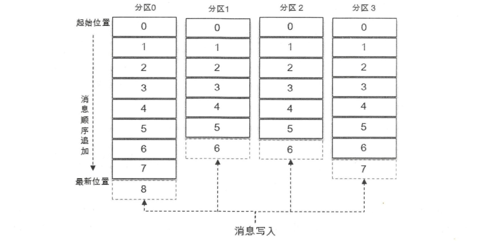
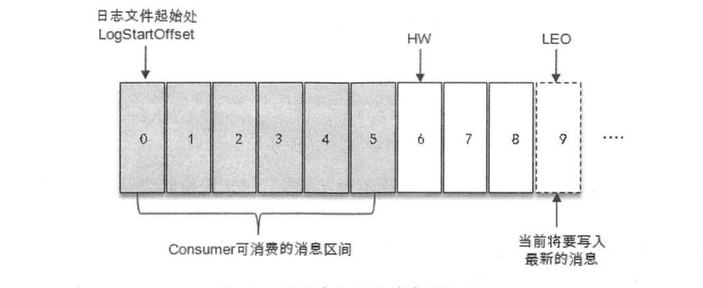

# 01 初始Kafka

“扮演“的三大角色： 

1、消息系统：解耦、冗余存储、流量削峰、缓冲、异步通信、扩展性、可恢复性等。此外，kafka还提供了消息顺序性保障及回溯消费的功能。 

2、存储系统：kafka把消息持久化到磁盘，相比于其他基于内存存储的系统而言，有效地降低了数据丢失的风险。得益于kafka的消息持久化功能和多副本机制，可以把kafka作为长期的数据存储系统来使用，只需要把对应的数据保留策略设置为”永久“或启用主体的日志压缩功能即可。 

3、流式处理平台 

## 1.1 基本概念 

一个典型的Kafka体系架构包括若干Producer、若干Broker、若干Consumer，以及一个ZooKeeper集群。 

（1）Producer：生产者，发消息的一方。负责创建消息，然后投递到Kafka中。 

（2）Consumer：消费者，也就是接收消息的一方。连接到Kafka上并接收消息，进而进行相应的业务逻辑处理。 

（3）Broker：服务代理节点。可以简单看作成一个独立的Kafka服务节点或Kafka服务实例。 

主题分区。kafka保证的是分区有序而不是主题有序。

 

Kafka的分区可以分布在不同的服务器（broker）上，一个主题可以横跨多个broker，以此来提供比单个broker更强大的性能。

Kafka为分区引入了多副本（Replica）机制，通过增加副本数量可以提升容灾能力。同一分区的不同副本中保存的是相同的消息（同一时刻，副本之间并非完全一样），副本之间是“一主多从”的关系，其中leader副本负责处理读写请求，follower副本只负责与leader副本消息同步。副本处于不同的broker中，当leader副本出现故障时，从follower副本中重新选举新的leader副本对外提供服务。

分区中的所有副本统称为 AR（Assigned Replicas）。所有与leader副本保持一定程度同步的副本（包括leader副本在内）组成ISR（In-Sync Replicas）。与leader副本同步滞后过多的副本（不包括leader副本）组成OSR（Out-of-Sync Replicas），**AR=ISR+OSR**。正常情况下，所有follower副本与leader副本保持一定程度的同步，即AR=ISR。

HW(High Watermark)：高水位。消费者只能拉取这个offset之前的消息。

LEO(Log End Offset)：标识当前日志文件中下一条待写入消息的offset。 

同步消息时（从leader副本到follower副本），不同的follower的同步效率不尽相同，HW取所有LEO中的最小值。

## 1.2 安装与配置 

1、JDK的安装与配置 

2、ZooKeeper安装与配置 

ZooKeeper实现诸如数据发布/订阅、负载均衡、命名服务、分布式协调/通知、集群管理、Master选举、配置维护等功能。ZooKeeper中共有3中角色：leader、follower和observer。observer不参与投票，默认情况下ZooKeeper中只有leader和follower两种角色。 

3、Kafka的安装与配置 

## 1.3 生产与消费 

shell和Java编程 

## 1.4 服务端参数配置 

1、zookeeper.connect 该参数指明broker要连接的ZooKeeper集群的服务地址（包含端口号），没有默认值，为必填项。如localhost:2181，如集群有多个节点，用多个逗号将每个节点隔开。（升华：复用ZooKeeper集群，增加chroot路径） 

2、 listeners 该参数指明broker监听客户端连接的地址列表，即为客户端要连接的broker的入口地址列表，配置格式为protocol1://hostname1:port1, protocol2://hostname2:port2，其中protocol代表协议类型，Kafka目前支持PLAINTEXT、SSL、SASL_SSL等，如未开启安全认证，使用简单的PLAINTEXT即可。 

3、 broker.id Kafka集群中broker的唯一标识，默认值为-1。 

4、log.dir和log.dirs Kafka把所有的消息都保存在磁盘上，而这两个参数用来配置Kafka日志文件存放的根目录。前者配置单个根目录，后者配置多个根目录（以逗号隔开），但没有严格限制，两者都可配置单个/多个根目录。后者优先级比前者高。前者默认值：/tmp/kafka-logs。 

5、message.max.bytes 该参数用来指定broker所能接收消息的最大值，默认值为1000012(B)，约等于976.6KB。如果Producer发送的消息大于该值，会报出RecordTooLargeException的异常。修改需考虑max.request.size（客户端参数）、max.message.bytes（topic端参数）等的影响，建议另考虑分拆消息的可行性。 

## 1.5 总结 

# 02 生产者

## 2.1 客户端开发 

正常的生产逻辑步骤： 

1、配置生产者客户端参数及创建相应的生产者实例； 

2、构建待发送的消息； 

3、发送消息； 

4、关闭生产者实例。 

### 2.1.2 消息的发送 

发送消息的三种模式：发后即忘（fire-and-forget）、同步（sync）及异步（async）。 

### 2.1.3 序列化 

### 2.1.4 分区器 

send()方法发往broker的过程中，有可能需要经过拦截器（Interceptor）（非必须）、序列化器（Serializer）（必须）和分区器（Partitioner）的一系列作用之后才能被真正地发往broker。如果ProducerRecord中指定了partition字段，就不需要分区器，因为该字段代表了分区号。 

### 2.1.5 生产者拦截器 

生产者拦截器既可以用来在消息发送前做一些准备工作，比如按照某个规则过滤不符合要求的消息、修改消息的内容等，也可以用来在发送回调逻辑前做一些定制化的需求，比如统计类工作。 

## 2.2 原理分析 

### 2.2.1 整体架构 

### 2.2.2 元数据的更新 

## 2.3 重要的生产者参数 

1、acks 

2、max.request.size 生产者客户端能发送的消息的最大值，默认1MB 

3、retries（重试次数）和retry.backoff.ms（重试时间间隔） 

4、compression.type（消息的压缩方式） 

5、connections.max.idle.ms（多久关闭限制的链接） 

6、linger.ms 

7、receive.buffer.bytes（Socket接收消息缓冲区SO_RECBUF的大小） 

8、send.buffer.bytes（Socket发送消息缓冲区SO_RECBUF的大小） 

9、request.timeout.ms（Producer等待请求响应的最长时间） 

## 2.4 总结 

KafkaProducer是线程安全的，可以在多线程的环境中复用，而对于下一章的消费者客户端KafkaConsumer而言，是非线程安全的，因为它具备了状态。 

# 03 消费者

## 3.1 消费者与消费组 

对于消息中间件而言，一般有两种消息投递模式：点对点（P2P，Point-to-Point）模式和发布/订阅（Pub/Sub）模式。点对点模式是基于队列的，消息生产者发送消息到队列，消息消费者从队列中接收消息。发布订阅模式定义了如何向一个内容节点发布和订阅消息，这个内容节点成为主体（Topic），主体可以认为是消息传递的中介，消息发布者将消息发布到某个主题，而消息订阅者从主题中订阅消息。主题使得消息的订阅者和发布者互相保持独立，不需要进行接触即可保证消息的传递，发布/订阅模式在消息的一对多广播时采用。Kafka同时支持两种消息投递模式，而这正是得益于消费者与消费者模式的契合： 

* 如果所有的消费者都隶属于同一个消费组，那么所有的消息都会被均衡地投递给每一个消费者，即每条消息只会被一个消费者处理，这就相当于点对点模式的应用。 
* 如果所有的消费者都隶属于不同的消费组，那么所有的消息都会被广播给所有的消费者，即每条消息会被所有的消费者处理，这就相当于发布/订阅模式的应用。 

## 3.2 客户端开发 

一个正常的消费逻辑需要具备以下几个步骤： 

1、配置消费者客户端参数及创建相应的消费者实例 

2、订阅主题 

3、拉取消息并消费 

4、提交消费位移 

5、关闭消费者实例 

### 3.2.1 必要的参数配置 

* bootstrap.serviers：释义与生产者客户端KafkaProducer中的相同，指定连接Kafka集群所需的broker地址清单，形式为host1:port1,host2:post2，可以设置一个或多个 
* group.id：消费者隶属的消费组的名称，默认值为“”。为空会抛出异常。一般会设置成具有一定的业务意义的名称。 
* key.deserializer和value.deserializer：与生产者客户端KafkaProducer中的key.serializer和value.serializer参数对应。必须填写全限定名如org.apache.kafka.common.serialization.StringDeserializer。 
* client.id：设定KafkaConsumer对应的客户端id，默认值也为""。不设置会自动生成一个非空字符串，如“consumer-1”“consumer-2”。 

### 3.2.2 订阅主题与分区 

### 3.2.3 反序列化 

### 3.2.4 消息消费 

Kafka中的消费是基于拉模式的。消息的消费一般有两种模式：推模式和拉模式。 

Kafka中的消息消费是一个不断轮询的过程，消费者索要做的就是重复地调用poll()方法，而该方法返回的所订阅的主题（分区）上的一组消息。 

### 3.2.5 位移提交 

* 偏移量：消息在分区中的位置（存储层面） 
* 位移（消费位移）：消费者消费到的位置（消费层面）

位移提交（难点），采用自动提交，带来的问题：重复消费、消息丢失。 

### 3.2.6 控制或关闭消费 

### 3.2.7 指定位移消费 

当消费者找不到消费位移时（如新的消费组），就会根据消费者客户端参数auto.offset.reset的配置来决定，默认值为”latest”，表示从分区末尾开始消费消息。如果 

参数配置为"earliest"，那么消费者会从起始处开始消费。 

### 3.2.8 再均衡 

再均衡是指分区的所属权从一个消费者转移到另一消费者的行为，它为消费组具备高可用性和伸缩性提供保障，使我们可以既方便又安全地删除消费组内的消费者或往消费组内添加消费者。再均衡期间，消费者无法读取消息。 

“重复消费”问题：再均衡之前消费了一次，之后又消费了一次。一般情况下应避免不必要的再均衡的发生。 

再均衡监听器用来设定发生再均衡动作前后的一些准备或收尾的动作。 

### 3.2.9 消费者拦截器 

### 3.2.10 多线程实现 

KafkaProducer是线程安全的，但KafaConsumer是非线程安全的。KafaConsumer中定义了一个acquire()方法，用来检测当前是否只有一个线程在操作，若有其它线程正在操作则会抛出异常。 

方块大小和滑动窗口的大小同时决定了消费线程的并发数：一个方格对应一个消费线程，对于窗口大小固定的情况，方格越小并行度越高；对于方格大小固定的情况，窗口越大并行度越高。 

### 3.2.11 重要的消费者参数 

1、fetch.min.bytes：配置Consumer在一次拉取请求（调用poll()方法）中能从Kafka中拉取的最小数据量，默认值为1(B)。 

2、fetch.max.bytes：与上个参数相反，默认值为52428800(B)，也就是50MB。 

3、fetch.max.wait.ms： 

… 

# 04 主题与分区

## 4.1 主题的管理 

### 4.1.1 创建主题 

### 4.1.2 分区副本的分配 

### 4.1.3 查看主题 

### 4.1.4 修改主题 

问：为什么不支持减少分区？ 

答：按照kafka现有的代码逻辑，此功能完全可以实现，不过也会使代码的复杂度急剧增大。实现此功能需要考虑的因素很多，比如删除的分区中的消息该如何处理？如果随着分区一起消失则消息的可靠性得不到保障；如果需要保留则又需要考虑如何保留。直接存储到现有分区的尾部，消息的时间戳就不会递增，如此对于Spark、Flink这类需要消息时间戳（事件时间）的组件将会受到影响；如果分散插入现有的分区，那么在消息量很大的时候，内部的数据复制会占用很大的资源，而且在复制期间，此主题的可用性又如何得到保障？与此同时，顺序性问题、事务性问题，以及分区和副本的状态机切换问题都是不得不面对的。反观这个功能的受益点确是很低的，如果真的需要实现此类功能，则完全可以重新创建一个分区数较小的主题，然后将现有主题中的消息按照既定的逻辑复制过去即可。 

### 4.1.5 配置管理 

kafka-configs.sh脚本专门用来对配置进行操作。 

### 4.1.6 主题端参数 

### 4.1.7 删除主题 

## 4.2 初识KafkaAdminClient 

一般使用kafka-topic.sh脚本来管理主题，但有时候希望将主题管理类功能集成到公司内部的系统中，打造集管理、监控、运维、告警为一体的生态平台，那么需要以程序调用API的方式去实现。 

### 4.2.1 基本使用 

### 4.2.2 主题合法性验证 

## 4.3 分区的管理 

### 4.3.1 优先副本的选举 

### 4.3.2 分区重分配 

### 4.3.3 复制限流 

### 4.3.4 修改副本因子 

## 4.4 如何选择合适的分区数 

根据实际的业务场景、软件条件、硬件条件、负载情况等来做具体的考量。 

### 4.4.1 性能测试工具 

Kafka本身提供的用于生产者性能测试的kafka-producer-perf-test.sh和用于消费者性能测试的kafka-consumer-perf-test.sh。 

### 4.4.2 分区数越多吞吐量就越高吗 

消息中间件的性能一般是指吞吐量（广义来说还包括延迟）。抛开硬件资源的影响，消息写入的吞吐量还会受到消息大小、消息压缩方式、消息发送方式（同步/异步）、消息确认类型（acks）、副本因子等参数的影响，消息消费的吞吐量还会受到应用逻辑处理速度的影响。 

一般情况下，根据预估的吞吐量及是否与key相关的规则来设定分区数即可，后期可以通过增加分区数、增加broker或分区重分配等手段来进行改进。如果一定要一个准则，则建议将分区数设定为集群中broker的倍数，即假定集群中有3个broker节点，可以设定分区数为3、6、9等，至于倍数的选定可以参考预估的吞吐量。不过，如果集群中的broker节点数有很多，比如大几十或上百、上千，那么这种准则也不太适用，在选定分区数时进一步可以引入基架等参考因素。 

# 05 日志存储

## 5.1 文件目录布局 

不考虑多副本的情况，一个分区对应一个日志（Log）。为了防止Log过大，Kafka又引入了日志分段（LogSegment）的概念，将Log切分为多个LogSegment，相当于一个巨型文件被平均分配为多个相对较小的文件，这样也便于消息的维护和清理。事实上，Log和LogSegment也不是纯粹物理意义上的概念，Log在物理上只以文件夹的形式存储，而每个LogSegment对应于磁盘上的一个日志文件和两个索引文件，以及可能的其他文件（比如以“.txnindex”为后缀的事务索引文件）。 

向Log中追加消息时是顺序写入的，只有最后一个LogSegment才能执行写入操作。在此之前所有的LogSegment都不能写入数据。为了方便描述，我们将最后一个LogSegment称为“activeSegment”，即表示当前活跃的的日志分段。 

为了便于消息的检索，每个LogSegment中的日志文件（以“.log”为文件后缀）都有对应的两个索引文件：偏移量索引文件（以“.index”为文件后缀）和时间戳索引文件（以“.timeindex”为文件后缀）。每个LogSegment都有一个基准偏移量baseOffset，用来表示当前LogSegment中第一条消息的offerset。偏移量是一个64位的长整型数，日志文件和两个索引文件都是根据基准偏移量（baseOffset）命名的，名称固定为20位数字，没有达到的位数则用0填充。比如第一个LogSegment的基准偏移量为0，对应的日志文件为00000000000000000000.log。 

## 5.2 日志格式的演变 

Kafka的消息格式也经历了3个版本：v0版本、v1版本和v2版本。 

### 5.2.1 v0版本 

Kafka消息格式的第一个版本通常称为v0版本，在Kafka 0.10.0之前都采用的这个消息格式（在0.8.x版本之前还是用过一个更古老的消息格式，忽略） 

#### 5.2.2 v1版本 

Kafka从0.10.0版本开始到0.11.0版本之前所使用的消息格式版本为v1，比v0版本就多了一个timestamp字段，表示消息的时间戳。 

### 5.2.3 消息压缩 

常见的压缩算法是数据量越大压缩效果越好，一条消息通常不会太大，这就导致压缩效果并不是太好。而Kafka实现的压缩方式是将多条消息一起进行压缩，这样可以保证较好的压缩效果。 

### 5.2.4 变长字段 

Kafka从0.11.0版本开始所使用的的消息格式版本为v2，这个版本的消息相比v0和v1的版本而言改动很大，同时还参考了Protocol Buffer而引入了变长整型（Varints）和ZigZag编码。 

Varints是使用一个或多个字节来序列化整数的一种方法。数值越小，其占用的字节数就越少。Varints中的每个字节都有一个位于最高位的msb位（most significant bit），除最后一个字节外，其余msb位都设置为1，最后一个字节的msb位为0。 

### 5.3 日志索引 

偏移量索引文件用来建立消息偏移量（offset）到物理地址之间的映射关系，方便快速定位消息所在的物理文件位置；时间戳索引文件则根据指定的时间戳（timestamp）来查找对应的偏移量信息。 

Kafka中的索引文件以稀疏索引（sparse index）的方式构造消息的索引，它并不保证每个消息在索引文件中都有对应的索引项。 

稀疏索引通过MappedByteBuffer将索引文件映射到内存中，以加快索引的查询速度。偏移量索引文件中的偏移量是单调递增的，查询指定偏移量时，使用二分查找法来快速定位偏移量的位置，如果指定的偏移量不在索引文件中，则会返回小于指定偏移量的最大偏移量。时间戳索引文件中的时间戳也保持严格的单调递增，查询指定时间戳时，也根据二分查找法来查找不大于该时间戳的最大偏移量，至于要找到对应的物理文件位置还需要根据偏移量索引文件来进行再次定位。稀疏索引的方式是在磁盘空间、内存空间、查找时间等多方面之间的一个折中。 

### 5.3.1 偏移量索引 

偏移量索引项分为两个部分： 

（1）relativeOffset：相对偏移量 

（2）position：物理地址 

### 5.3.2 时间戳索引 

## 5.4 日志清理 

Kafka提供了两种日志清理策略： 

（1）日志删除（Log Retention） 

（2）日志压缩（Log Compaction） 

### 5.4.1 日志删除 

日志分段的保留策略： 

（1）基于时间 

（2）基于日志大小 

（3）基于日志起始偏移量 

### 5.4.2 日志压缩 

## 5.5 磁盘存储 

### 5.5.1 页缓存 

### 5.5.2 磁盘I/O流程 

### 5.5.3 零拷贝 

所谓的零拷贝是指将数据直接从磁盘文件复制到网卡设备中，而不需要经由应用程序之手。 

## 5.6 总结 

# 06 深入服务端

6.1 协议设计 

6.2 时间轮 

6.3 延时操作 

6.4 控制器 

6.4.1 控制器的选举及异常恢复 

6.4.2 优雅关闭 

6.4.3 分区leader的选举 

6.5 参数解密 

6.5.1 broker.id 

6.5.2 bootstrap.servers 

6.5.3 服务端参数列表 

6.6 总结 

# 07 深入客户端

7.1 分区分配策略 

7.1.1 RangeAssignor分配策略 

7.1.2 RoundRobinAssignor分配策略 

7.1.3 StickyAssignor分配策略 

7.1.4 自定义分区分配策略 

7.2 消费者协调器和组协调器 

7.2.1 旧版消费者客户端的问题 

7.2.2 再均衡的原理 

7.3 __consumer_offsets剖析 

7.4 事务 

7.4.1 消息传输保障 

7.4.2 幂等 

7.4.3 事务 

7.5 总结 

# 08 可靠性探究

8.1 副本剖析 

8.1.1 失效副本 

8.1.2 ISR的伸缩 

8.1.3 LEO与HW 

8.1.4 Leader Epoch的介入 

8.1.5 为什么不支持读写分离 

（1）数据一致性问题 

（2）延时问题 

8.2 日志同步机制 

8.3 可靠性分析 

8.4 总结 

# 09 Kafka应用

## 9.1 命令行工具 

### 9.1.1 消费组管理 

### 9.1.2 消费位移管理 

### 9.1.3 手动删除消息 

## 9.2 kafka Connect 

Kafka Connect是一个工具，它为在Kafka和外部数据存储系统之间移动数据提供了一种可靠的且可伸缩的实现方式。 

Kafka Connect有两个核心概念：Source和Sink。Source负责导入数据到Kafka，Sink负责从Kafka导出数据，它们都被称为Connector（连接器）。 

两个重要概念：Task和Worker。Task是Kafka Connect数据模型的主角，每一个Connector都会协调一系列的Task去执行任务，Connector可以把一项工作分割成许多Task，然后把Task分发到各个Worker进程中去执行（分布式模式下），Task不保存自己的状态信息，而是交给特定的Kafka主题去保存。Connector和Task都是逻辑工作单位，必须安排在进程中执行，而在Kafka Connect中，这些进程就是Worker。 

Kafka Connect提供了以下特性： 

* 通用性：规范化其他数据系统与Kafka的继承，简化了连接器的开发、部署和管理。 
* 支持独立模式（standalone）和分布式模式（distributed）。 
* REST接口：使用REST API提交和管理Connector。 
* 自动位移管理：自动管理位移提交，不需要开发人员干预，降低了开发成本。 
* 分布式和可扩展性：Kafka Connect基于现有的组管理协议来实现扩展Kafka Connect集群。 
* 流式计算/批处理的集成。 
### 9.2.1 独立模式 

Kafka中的connect-standalone.sh脚本用来实现以独立的模式运行Kafka Connect。 

### 9.2.2 REST API 

默认端口号为8083，可以通过Worker进程的配置文件中的rest.port参数来修改端口号。 

### 9.2.3 分布式模式 

以分布式模式启动的连接器并不支持在启动时通过加载连接器配置文件来创建一个连接器，只能通过访问REST API来创建连接器。 

### 9.4 Kafka Streams 

Kafka实现了高吞吐、高可用和低延时的消息传输能力，这让它成为流式处理系统中完美的数据来源。目前通用的一些流式处理框架如Apache Spark、Apache Flink、Apache Storm等都可以将Kafka作为可靠的数据来源。但遗憾的是，在0.10.x版本之前，Kafka还并不具备任何数据处理的能力，但在此之后，Kafka Streams应运而生。 

Kafka Streams直接解决了流式处理中的很多问题 

* 毫秒级延迟的逐个事件处理 
* 有状态的处理，包括连接（join）和聚合类操作 
* 提供了必要的流处理原语，包括高级流处理DSL和低级处理器API。高级流处理DSL提供了常用流处理变换操作，低级处理器API支持客户端自定义处理器并与状态仓库交互 
* 使用类似DataFlow的模型对无序数据进行窗口化处理 
* 具有快速故障切换的分布式处理和容错能力 
* 无停机滚动部署 

## 9.5 总结 

# 10 Kafka监控

以Kafka manager为例，它提供的监控功能也是相对比较完善的，在实际应用中具有很高的使用价值。但有一个遗憾就是其难以和公司内部系统平台关联，对于业务资源的使用情况、相应的预防及告警的联动无法顺利贯通。  

## 10.1 监控数据的来源 

### 10.1.1 OneMinuteRate 

### 10.1.2 获取监控指标 

## 10.2 消费滞后（Lag） 

消息堆积是消息中间件的一大特色，消息中间件的流量削峰、冗余存储等功能正是得益于消息中间件的消息堆积能力。这是一把双刃剑。有些中间件如RabbitMQ在发生消息堆积时还会影响自身的性能。对Kafka而言，虽然消息堆积不会给其自身性能带来太大的困扰，但难免会影响上下游的业务，堆积过多有可能造成磁盘爆满，或者触发日志清楚操作而造成消息丢失的情况。 

（1）普通情况： 

Lag = HW - ConsumerOffset（消费位移） 

（2）引入事务： 

1）消费者客户端的isolation.level参数配置为read_uncommitted（默认），Lag计算方式不受影响。 

2）上述参数配置为read_commmitted，引入LSO来计算。LSO是LastStableOffset的缩写。 

对未完成的事务而言，LSO的值等于事务中第一条消息的位置（firstUnstableOffset）； 

Lag = LSO - ConsumerOffset 

对已完成的事务而言，它的值同HW相同，结论：LSO<=HW<=LEO。 

## 10.3 同步失效分区 

消费Lag是Kafka的普通使用者特别关心的一项指标，而同步失效分区（under-replicated）的多少是Kafka运维人员非常关心的一项指标。8.1.1节中的概念：处于同步失效或功能失效（比如处于非活跃状态）的副本统称为失效副本。而包含失效副本的分区也就称为同步失效分区。 

Kafka本身提供了一个相关的指标来表征失效分区的个数，即UnderReplicatedPartitions，可以通过JMX访问来获取其值： 

kafka.server:type=ReplicaManager,name=UnderRelicatedPartitions 

注意：如果Kafka集群正在做分区重分配（参考4.3.2节），该值也大于0. 

如果集群中有多个broker的UnderReplicatedPartitions保持一个大于0的稳定值，则一般暗示集群中有broker已经处于下线状态。该情况下，这个broker中的分区个数与集群中的所有UnderRepliatedPartitions（处于下线的broker是不会上报任何指标值得）之和是相等的。通常这类问题是由于机器硬件原因引起的，但也有可能是由于操作系统或JVM引起的，可以往这个方向继续做进一步的深入调查。 

如果集群中存在broker的UnderReplicatedPartitions频繁变动，或者处于一个稳定的大于0的值（这里特指没有broker下线的情况）时，一般暗示集群出现了性能问题。确定某个broker，然后针对单一的broker做专项调查，比如操作系统、GC、网络状态或磁盘状态（如iowait、ioutil等指标）。 

如果多个broker中都出现了under-replicated分区，则一般是整个集群的问题，但也有可能是单个broker出现了问题。对于后者，如果单个broker在消息同步方面出了问题，那么其上的follower副本就无法及时有效地与其他broker上的leader副本进行同步，就出现了多个broker都存在under-replicated分区的现象。 

集群层面的问题一般也就是两个方面：资源瓶颈和负载不均衡。资源瓶颈指的是broker在某硬件资源的使用上遇到了瓶颈，比如网络、CPU、I/O等层面。就以I/O而论，Kafka中的消息都是存盘的，生产者线程将消息写入leader副本的性能和I/O有着直接的关联，follower副本的同步线程及消费者的消费线程又要通过I/O从磁盘中拉取消息，如果I/O层面出现了瓶颈，那么势必影响全局的走向，与此同时消息的流入/流出又都需要和网络打交道。建议硬件层面的指标可以关注CPU的使用率、网络流入/流出速度、磁盘的读/写速度、iowait、ioutil等，也可以适当地关注下文件句柄数、Socket句柄数及内存等方面。 

## 10.4 监控指标说明 

Kafka自身提供的JMX监控指标已经超过了500个，这里挑选部分重要及常用指标进行说明。 

## 10.5 监控模块 

Kafka的监控架构主要分为数据采集、数据存储和数据展示这3个部分。数据采集主要指从各个数据源采集监控数据并做一些必要的运算，然后发送给数据存储模块进行存储。数据源可以是Kafka配套的Zookeeper、Kafka自身提供的内部运行指标（通过JMX获取）、Kafka内部的一些数据（比如__consumer_ooffset中存储的信息，通过Kafka自定义协议获取）、Falcon/Zabbix等第三方工具（或者其他类似的工具、主要用来监控集群的硬件指标）。 

数据存储可以采用OpenTSDB之类的基于时间序列的数据库，方便做一些聚合计算，也可以附加采用Redis、MySQL等存储特定数据。 

## 10.6 总结 

# 11 高级应用

高级应用类的需求，比如消费回溯，可以通过原生Kafka提供的KafkaConsumer.seek()方法来实现，然而类似延迟队列、消息轨迹等应用需求在原生Kafka中就没有提供了。本章讲述如何扩展类高级应用。  

11.1 过期时间（TTL） 

11.2 延时队列 

11.3 死信队列和重试队列 

11.4 消息路由 

11.5 消息轨迹 

11.6 消息审计 

11.7 消息代理 

11.7.1 快速入门 

11.7.2 REST API介绍及示例 

11.7.3 服务端配置及部署 

11.7.4 应用思考 

11.8 消息中间件选型 

11.8.1 各类消息中间件简述 

11.8.2 选型要点概述 

11.8.3 消息中间件选型误区探讨 

11.9 总结 

# 12 Kafka与Spark的集成

12.1 Spark的安装及简单应用 

12.2 Spark编程模型 

12.3 Spark的运行结构 

12.4 Spark Streaming简介 

12.5 Kafka与Spark Streaming的整合 

12.6 Spark SQL 

12.7 Structured Streaming 

12.8 Kafka与Structured Streaming的整合 

12.9 总结 

# 附录A Kafka源码环境搭建

