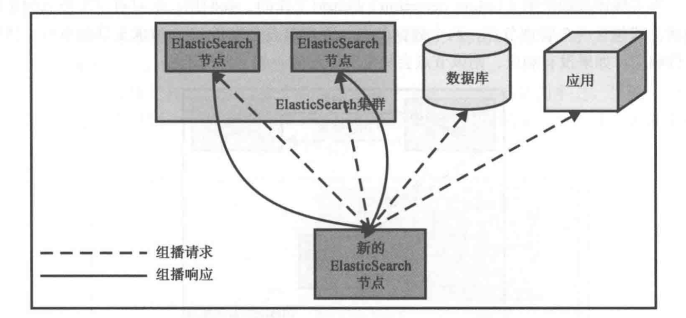
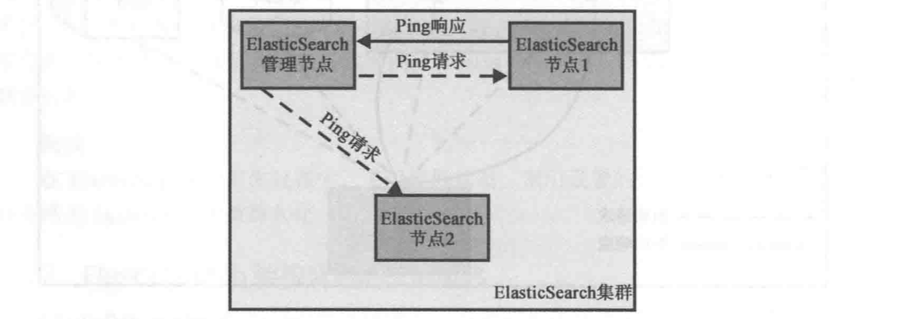
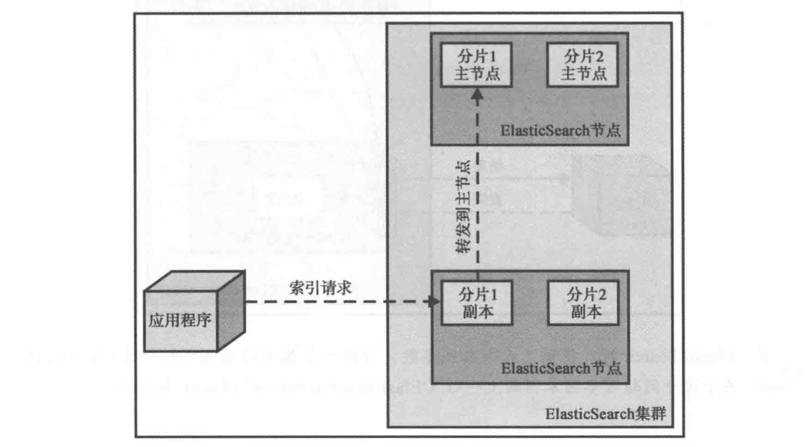
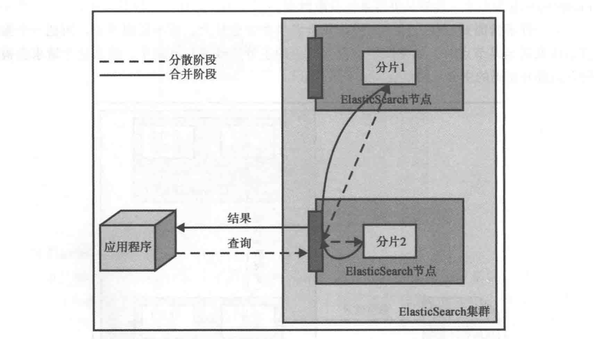

## Apache Lucene简介

### 熟悉Lucene

ES的创始人使用 Apache Lucene 而不是从头开发全文检索库？可能是因为 Lucene 的以下特点：成熟、高性能、可扩展、轻量级以及强大的功能。

Lucene 内核可以创建为独立的 Java 库文件并且不依赖第三方代码，用户可以使用它提供的各种所见即所得的全文检索功能进行索引和搜索操作。

Lucene的许多扩展提供了各种各样的功能，如多语言处理、拼写检查、高亮显示等。

### Lucene的总体架构

Lucene 的架构：

文档（document）：索引和搜索的主要数据载体，它包含一个或多个字段，存放将要写入索引或将从索引搜索出来的数据。

字段（field）：文档的一个片段，它包括两个部分：字段的名称和内容。

词项（term）：搜索时的一个单位，代表文本中的某个词。

词条（token）：词项在字段中的一次出现，包括词项的文本、开始和结束的位移以及类型。

Lucene 将写入索引的所有信息组织成一种名为倒排索引（inverted index）的结构。该结构是一种将词项映射到文档的数据结构，其工作方式与传统的关系数据库不同，可以认为倒排索引时面向词项而不是面向文档的。

索引中不仅保存词项和在文档中出现的次数，还会存储其他信息，如词向量（为单个字段创建的小索引，存储该字段中所有的词条）、各字段的原始信息、文档删除标记等。

每个索引由多个段（segment）组成，每个段只会被创建一次但会被查询多次。索引期间，段经创建就不会再被修改。例如文档被删除后，删除信息被单独保存在一个文件中，而段本身并没有修改。

多个段汇在一起叫做段合并（segments merge），要么强制执行要么由 Lucene 的内在机制决定在某个时刻执行，合并后段的数量更少但更大。段合并非常消耗IO且会清除掉不再使用的信息，如被删除的文档。对于容纳相同数据的索引，段的数量较少时，搜索速度更快。

### 分析你的数据

查询串转换为用于搜索的词项的过程称为分析（analysis）

文本分析由分析器来执行，而分析器由分词器（tokenizer）、过滤器（filter）和字符映射器组成（character mapper）。

分词器将文本切割成词条，其中携带各种额外信息的词项，包括：词项在原始文本中的位置、词项的长度。分词器的工作成果成为词条流，因为这些词条一个一个推送给过滤器处理。

过滤器的数额可选（0个、1个或多个），用于处理词条流中的词条。它可以移除、修改甚至创造新的词条。过滤器的一些例子：

* 小写过滤器
* ASCII 过滤器：移除词条中所有非 ASCII 字符
* 同义词过滤器
* 多语言词干还原过滤器：词干还原，将词条的文本部分规约到其词根形式
**索引与查询**

不同的字段可以不同的分析器，如 title 和 description。

检索时如果使用了某个查询分析器（query parser），可以进行查询分析也可以不。如前缀查询（prefix query）不会被分析，而匹配查询（match query）会被分析。

### Lucene查询语言

ES 提供的一些查询类型（query type）支持 Lucene 的查询解析语法。

#### **理解基本概念**

Lucene 中一个查询通常被分割为词项与操作符，词项可以是单个词也可以是一个短语。

查询汇总也可以包含布尔操作符，用于连接多个词项，使之构成从句（clause）。有以下布尔操作符：

* AND
* OR
* NOT
* +：表示只有包含 + 操作符后面词项的文档才会被认为是与从句匹配
* -：表示与从句匹配的文档不能出现 - 操作符后的词项
当然还可以使用圆括号对从句进行分组，以构造更复杂的从句。

#### 在字段中查询

Lucene 中所有数据都存储在字段（field）中，而字段又是文档的组成单位。对某个字段查询的语法：字段名称加上冒号以及将要在该字段中执行查询的从句。如：

title 字段中包含词项 elasticsearch 的文档：

title: elasticsearch

title 字段中同时包含词项 elasticsearch 和短语 mastering book 的文档：

title: (elasticsearch +"mastering book")

当然也可以写成下面这种形式：

+tile:ealsticsearch +titile:"mastering book"

#### 词项修饰符

除了使用简单词项和从句的常规字段查询意外，Lucene 还允许用户使用修饰符（modifier）修改传入查询对象的词项。最常见的修饰符就是通配符（wildcard）。Lucene 支持两种通配符：? 和 *。（匹配任意一个字符 和 匹配多个字符）。

>注意：处于对性能的考虑，通配符不能作为词项的第一个字符出现

除通配符之外，Lucene 还支持模糊（fuzzy and proximity）查询，通过使用 ~ 字符以及一个紧随其后的整数值（表示近似词项与原始词项的最大编辑距离）。如 writer~2 包含匹配词项 writer 和 writers 的文档。

当修饰符 ~ 用于短语时，也是同理。如 title:"mastering elasticsearch"~2，可以包含"mastering elasticsearch" 和 "mastering book elasticsearch"。

使用 ^ 字符并赋以一个浮点数对词项加权（boosting），以提高该词项的重要程度。

使用方括号和花括号来构建范围查询。如：price: [10.00 TO 15.00] 或 name: [Adam To Adria]。使用花括号则表示排除边界。

#### 特殊字符处理

需要搜索某个特殊字符（包含+、-、&&、||、!、(、)、{}、[]、^、"、~、*、?、:、\、/），先试用反斜杠对这些特殊字符进行转义。

## ElasticSearch简介

ElasticSearch 是一个可用于构建搜索应用的成品软件。它最早是由 Shay Banon 创建并与2010年2月发布。之后的几年 ElasticSearch 迅速流行开来，成为商业解决方案之外且开源的一个重要选择，也是下载量最多的开源软件之一，每月下载量超过20万次。

### 基本概念

#### 索引

数据存储在一个或多个索引（index）中，类似 SQL 领域术语的数据库。

>注意：ElasticSearch 中的索引可能有一个或多个 Lucene 索引构成，具体细节有 ElasticSearch 的索引分片（shard）、复制（replica）机制及其配置决定。

#### 文档

文档（document）是 ElasticSearch 中的重要实体（对 Luecene 来说也是如此）。文档由字段构成，每个字段有它的字段名以及一个或多个字段值（这种情况该字段被称为多值的，即文档中有多个同名字段）。文档之间可能有各自不同的字段集合，且文档并没有固定的模式或强制的结构（这些规则也适用于 Lucene 文档）。从客户端的角度来看文档是一个 JSON 对象。

#### 映射

所有文档在写入索引前都需要先进行分析。用户可以设置一些参数，来决定如何将输入文本分割成词条。ES 也提供了各种特性，如排序时所需的字段内容信息。这就是映射（mapping）扮演的角色，存储所有这种元信息。虽然 ES 能根据字段值自动检测字段的类型，但为了避免一些不可预期的意外，还是用户自行配置映射。

#### 类型

每个文档都有与之对应的类型（type）定义。这允许用户在一个索引中存储多种文档类型，并为不同文档类型提供不同的映射。

#### 节点

单个 ES 服务实例成为节点（node）。

#### 集群

当数据量或查询压力超过单机负载时，需要多个节点来协同处理，所有这些节点组成的系统称为集群（cluster）。集群也是无间断提供服务的一种解决方案，即便在某些节点因为宕机或执行管理任务（如升级）不可用时。ES 几乎无缝集成了集群功能。

#### 分片

集群允许系统存储的数据总量超过单机容量，为了满足这个需求，ES 将数据散步到多个物理 Lucene 索引上。这些 Lucene 索引称为分片（shard），而散步这些分片的过程叫做分片处理（sharding）。ES 会自动完成分片处理，并且让这些分片呈现出一个大索引的样子。

>ES 本身自动进行分片处理外，用户为具体的应用进行参数调优也是直观重要的，因为分片的数量在索引创建时就已经配置好，而且之后无法改变，至少目前的版本是这样的。

#### 副本

分片处理允许用户向 ES 集群推送超过单机容量的数据。副本（replica）则解决了访问压力过大时单机无法处理所有请求的问题。即wield每个分片创建冗余的副本，处理查询时可以把这些副本用作最初的主分片（primary shard）。节点宕机 ES 可以使用其副本，不会造成数据丢失，且支持任意时间点添加或移除副本。

#### 网关

ES 工作过程中，集群状态、索引设置的各种信息都会被收集起来，并在网关（gateway）中被持久化。

### 架构背后关键概念

从架构的角度出发，ES 具有下面这些主要特征：

* 合理的默认配置，使得用户简单安装后能直接使用而不需要任何额外的调试，包括内置的发现（如字段类型检测）和自动配置功能。
* 默认的分布式工作模式。每个节点总是假定自己是某个集群的一部分或将是某个集群的一部分，一旦工作启动节点便会加入某个集群。
* 对等架构（P2P）可以避免单点故障（SPOF）。节点会自动连接到集群中的其他节点，进行相互的数据交换和监控操作。包括索引分片的自动复制。
* 易于向集群扩充新节点，不论是从数据容量的角度还是数量角度。
* 没有对索引中的数据结构强加任何限制，从而允许用户调整现有的数据模型。ES 支持在一个索引中存在多种数据类型，并允许用户调整业务模型，包括处理文档之间的关联（尽管这种功能非常有限）。
* 准实时（Near Real Time，NRT）搜索和版本同步（versioning）。因为分布式特性，查询延迟和节点之间临时的数据不同步是难以避免的。ES 尝试消除这些问题并且提供额外的机制用于版本同步。
### 工作流程

#### 启动过程

节点启动时，使用广播技术（也可配置为单播）发现统一集群中的其它节点（配置集群名称）并与之连接。




集群中会有一个节点被选为管理节点（master node）。该节点负责集群的状态管理以及在集群拓扑变化时做出反应，分发索引分片至集群的相应节点上。

>从用户角度来看，管理节点并不比其它节点重要，这与其它某些分布式系统不同（如数据库）。实际上，不需要知道哪些是管理节点，所有操作可以发送至任意接地那，ES 内部会自行处理。（ES 是基于对等架构的）。

管理节点读取集群的状态信息，并在必要时进行恢复处理。该阶段管理节点会检查所有索引分片并决定哪些分片将用于主分片。然后集群进入黄色状态。

这意味集群可以执行查询，但系统的吞吐量以及各种可能的状态未知（可以简单理解为主分片分配出去，副本没有），接下来寻找冗余的分片并作用副本。若某个主分片的副本数过少，管理节点将决定基于某个主分片创建分片和副本。一切顺利集群将进入绿色状态（即所有主分片和副本均已分配好）。

#### 故障检测

集群正常工作时，管理节点会监控所有可用节点检查是否正在工作。如果任何节点在预定义的超时时间内没有响应，则认为该节点已断开，然后开始启动错误处理过程。即在集群 - 分片之间重新做平衡。




#### 与ES通信

ES 对外公开了一个设计精巧的API（基于REST），并在实践中能轻松整合到任何支持HTTP协议的系统中去。

>ES 内部也使用 Java API 进行节点间通信。

#### 索引数据

ES 提供四种方式来创建索引。最简单的是使用索引API，允许用户发送一个文档至特定的索引。如使用 curl 工具（详见 [http://curl.haxx.se/](http://curl.haxx.se/) ）：

```shell
curl -XPUT http://localhost:9200/blog/article/1 -d '{"title": "New version of Elastic Search released!", "content": "...", "tags": ["announce", "elaticsearch", "release"]}'
```
第二、三种方式允许用户通过 bulk API 或 UDP bulk API 一次性发送多个文档至集群。两者的区别在于网络连接方式（HTTP协议、UDP协议）。
第四种方式是使用插件发送数据，称为河流（river），河流运行在ES节点上，能够从外部系统获取数据。

>建所以操作只会发生在主分片上，而不是副本上。当一个索引请求发送至某节点时，如果该节点没有对应的主分片或者只有副本，那么会被转发到拥有正确的主分片的节点上。如下图所示：
>

#### 查询数据

查询 API 占据了 ES API 的大部分内容。使用 DSL（基于JSON的可用于构建复杂查询的语言）：

* 使用各种查询类型，包括：简单的词项查询、短语查询、范围查询、布尔查询、模糊查询、区间查询、通配符查询、空间查询等。
* 组合简单查询构建复杂查询。
* 文档过滤，不影响评分的前提下抛弃不满足特定查询条件的文档。
* 查询与特定文档想死的文档。
* 查询特定短语的查询建议和拼写检查。
* 使用切面构建动态导航和计算各种统计量。
* 使用预搜索（prospective search）并查找与指定文件匹配的query集合。
查询分为两个阶段：分散阶段（scatter phase）和合并阶段（gather phase）。分散阶段将 query 分发到包含相关文档的多个分片中执行查询，合并阶段则从众多分片中收集返回结果，然后进行合并、排序、后续处理，再返回给客户端。




#### 索引配置

ES 提供了自动索引配置以及发现识别文档字段类型和结构的功能。也提供了一些功能使得用户能手动配置，例如通过映射配置自定义的文档结构，或设置索引的分片和副本数，抑或定制文本分析过程等。

#### 系统管理和监控

ES 中系统管理和监控相关的 API 允许用户改变集群的设置，如调节集群发现机制和索引放置策略等。且提供集群状态信息后每个节点、索引的统计信息。

## 小结

本章介绍了 Apache Lucene 的一般架构，如工作原理、文本分析过程以及使用查询语言。此外还介绍了 ElasticSearch 的一些基本概念，如基本架构和内部通讯机制。

