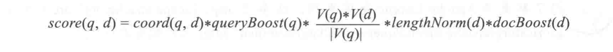
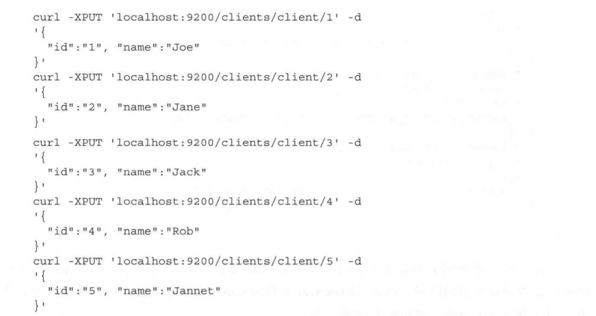
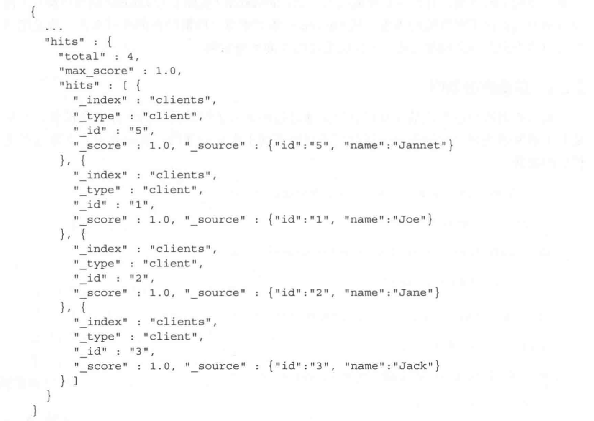

本章涵盖内容：

* Lucene默认评分公式如何工作
* 什么是查询重写
* 查询二次评分如何工作
* 单次请求中实现批量准实时读取操作
* 单次请求中发送多个查询
* 对包括嵌套文档和多值字段的数据排序
* 更新已索引的文档
* 使用过滤器来优化查询
* 在切面计算机制中使用过滤器和作用域
## Lucene默认评分公式

查询相关性重点是理解文档对查询的得分是如何计算出来的。文档得分是一个刻画文档与查询匹配程度的参数。Lucene 的默认评分机制：TF/IDF（词频/逆文档频率）算法以及其如何影响文档召回。

### 文档被匹配

每个被查询返回的文档都有一个得分，得分越高，文档相关度更高。

>注意：同一个文档针对不同查询的得分是不同的，比较某文档在不同查询中的得分是没有意义的，不同查询返回文档中的最高得分也不具备可比较性。因为文档得分依赖多个因子，除了权重和查询本身的结构，还包括匹配的词项数目，词项所在字段，以及查询规范化的匹配类型等。

计算文档得分考虑以下因子：

* 文档权重（document boost）：索引期赋予某个文档的权重值
* 字段权重（field boost）：查询期赋予某个字段的权重值
* 协调因子（coord）：基于文档中词项命中个数的协调因子，一个文档命中了查询的词项越多，得分越高。
* 逆文档频率（inverse document frequency）：一个基于词项的因子，用来告诉评分公式该词项多么罕见。逆文档频率越低，词项越罕见。评分共识利用该因子为包含罕见词项的文档加权。
* 长度范数（length norm）：每个字段的基于词项个数的归一化因子（在索引期计算出来并存储在索引中）。一个字段包含的词项数越多，该因子的权重月底，这意味着 Lucene 评分公式更“喜欢”包含更少词项的字段。
* 词频（term frequency）：一个基于词项的因子，用来表示一个词项在某个文档中出现了多少次。词频越高，文档得分越高。
* 查询范数（query norm）：一个基于查询的归一化因子，等于查询中词项的权重平方和。查询范数使不同查询的得分能相互比较，尽管这种比较通常是困难的不可行的。
### TF/IDF评分公式

#### Lucene理论评分公式

TF/IDF公式的理论形式如下：




上面的公式糅合了布尔检索模型和向量空间检索模型。

#### Lucene实际评分公式


得分公式是一个关于查询 q 和文档 d 的函数，有两个因子 coord 和queryNorm 并不直接依赖查询词项，而是与查询词项的一个求和公式想成。

求和公式中每个加数由以下因子连乘所得：词频、逆文档频率、词项权重、范数（长度范数）。从公式可以得出一些基本原则：

* 越多罕见的词项被匹配上，文档得分越高
* 文档字段越短（包含更少的词项），文档得分越高
* 权重越高（不论是索引期还是查询期赋予的权重值），文档得分越高
### ES如何看评分

ES 使用了 Lucene 的评分功能但不限于其评分功能（可以替换默认的评分算法），用户可以使用各种不同的查询类型以精确控制文档评分的计算（如 custom_boost_factor 查询、constant_score 查询、custom_score 查询等），还可以使用脚本（scripting）来改变文档得分，还可以使用 ES 0.90 中出现的二次评分功能，通过在返回文档集上执行另一个查询，重新计算前 N 个文档的得分。

>更多查询类型可参考：[https://lucene.apache.org/core/4_5_0/queries/org/apache/lucene/queries/package-summary.html](https://lucene.apache.org/core/4_5_0/queries/org/apache/lucene/queries/package-summary.html)

## 查询改写

诸如前缀查询或通配符查询之类的查询类型都是基于多词项的查询，且都涉及查询改写。ES（实际上是 Lucene 执行该操作）使用查询改写是出于对性能的考虑。从 Lucene 的角度查询改写操作就是把费时的原始查询类型实例改写成一个性能更高的查询类型实例。

### 前缀查询范例

PUT数据




查询数据：

```shell
curl -XGET 'localhost:9200/clients/_search?pretty' -d '{
  "query": {
    "prefix": {
      "name": "j",
      "rewrite": "constant_score_boolean"
    }
  }
}'
```
查询结果：



验证 ES 设置 name 字段的映射：

```shell
curl -XGET 'localhost:9200/clients/client/_mapping?pretty'
```
ES 返回结果：
```plain
{
  "client": {
    "properties": {
      "id": {
        "type": "string"
      },
      "name": {
        "type": "string"
      }
    }
  }
}
```

### 回顾Lucene

Term 这列非常重要，探究 ES 和 Lucene 的内部实现，会发现前缀查询已经改写为下面这种查询：

```plain
ConstantScore(name:jack name:jane name:joe)
```
这意味着前缀查询已经改写为常数得分查询（constant score query），该查询有一个布尔查询构成，而这个布尔查询又由三个词项查询构成。Lucene 做的事就是枚举索引中的词项，并利用这些词项的信息来构建新的查询。比较改写前后两个查询的执行效果，会发现改写后的查询性能有所提升，尤其是当索引中有大量不同词项时。
手动构建改写后的查询：

```json
{
  "query": {
    "constant_score": {
      "query": {
        "bool": {
          "should": [
          {
            "term": {
              "name": "jack"
            }
          },
          {
            "term": {
              "name": "jane"
            }
          },
          {
            "term": {
              "name": "joe"
            }
          }
          ]
        }
      }
    }
  }
}
```

### 查询改写的属性

对任何多词项查询（如前缀和通配符查询）使用rewite来控制查询改写。如：

```json
{
  "query": {
    "prefix": {
      "name": "j",
      "rewrite": "constant_score_boolean"
    }
  }
}
```
rewrite 参数配置选项：
* scoring_boolean：将每个生成的词项转化为布尔查询中的一个或从句（should clause）。比较消耗CPU（计算和保存每个词项得分），查询生成的词项太多会超出布尔查询的限制（默认1024个从句，可修改 elasticsearch.yaml 文件的 index.query.bool.max_clause_count 属性，注意会降低查询性能）。
* constant_score_boolean：与 scoring_boolean 类似，但CPU消耗较少，因为该过程不计算每个从句得分，而是每个从句得到一个与查询权重相同的常规得分（默认情况下等于1）。同上也有布尔从句数的限制。
* constant_score_filter：通过顺序遍历每个词项来创建一个私有的过滤器，标记跟每个词项相关的所有文档。命中的文档被赋予一个跟查询权重相同的常量得分。当命中词项数或文档数较大时，该方法比前两种执行速度更快。
* top_terms_N：该选项将每个生成的词项转化为布尔查询中的一个或从句，并保存计算出来的查询得分。与 scoring_boolean 不同在于这里只保留了最佳的前 N 个词项，从而避免超出布尔从句数的限制。
* top_terms_boost_N：与 top_terms_N 类似，不同之处在于该选项产生的从句类型为常量得分查询，得分为从句的权重。
>当 rewrite 属性设置为 constant_score_auto 或者根本不设置时，constant_score_filter 或 constant_score_boolean 属性的取值依赖于查询类型及其构造方式。

何时采用何种查询写法？

取决于具体应用场景。接受低精度（往往伴随着高性能），可以采用 top N 查询改写方法。需要更高的查询精度（往往伴随着低性能），应该使用布尔方法。

## 二次评分

改变查询返回文档的顺序有很多好处，如提升性能（在整个文档集计算文档顺序非常耗时，原始查询的返回文档的子集上做这种计算则非常省事）。二次评分给了用户很多机会定制业务逻辑。

### 理解二次评分

ES 的二次评分是指重新计算查询返回文档中指定个数文档的得分，意味着 ES 会截取查询返回文档的前 N 个，并使用预定义的二次评分方法来重新计算它们的得分。

### 范例数据

范例数据保存在 docements.json 文件中，可以使用以下命令添加到索引中：

```shell
curl -XPOST localhost:9200/_bulk?pretty --data-binary @documents.json
```

### 查询

```json
{
  "fields": ["title", "available"],
  "query": {
    "match_all": {}
  }
}
```
该查询将返回索引中的所有文档。因为使用了 match_all 查询类型，所以每个返回文档的得分都等于 1.0。
### 二次评分查询结构

二次评分查询范例：

query.json

```json
{
  "fields": ["title", "available"],
  "query": {
    "match_all": {}
  },
  "rescore": {
    "query": {
      "rescore_query": {
        "custom_score": {
          "query": {
            "match_all": {}
          },
          "script": "doc['year'].value"
        }
      }
    }
  }
}
```
这个查询将每个文档的得分改写为该文档的 year 字段中的值。
```shell
curl localhost:9200/library/book/_search?pretty -d @query.json
```

### 二次评分参数配置

在 rescore 对象中的查询中，必须配置以下这些参数：

* window_size：窗口大小，该参数默认设置为 form 和 size 参数值之和，指定了每个分片上参与二次评分的文档个数
* query_weight：查询权重值，默认等于1，原始查询的得分与二次评分的得分相加之前将乘以该值
* rescore_query_weight：二次评分查询的权重值，默认等于1，二次评分查询的的饭与原始查询德丰相加之前将乘以该值
* rescore_mode：二次评分的模式，默认为total。ES 0.90.3 引入了该参数。定义了二次评分中文档得分的计算方式，可选项有total（文档得分为原始得分与二次评分得分之和）、max、min、avg和multiply（乘积）。
例如：当 rescore_mode 为 total 时，文档得分计算公式如下：

```plain
original_query_score * query_weight + rescore_query_score * rescore_query_weight
```

## 批量查询

ES 提供了批量操作功能来读取数据和检索，这些操作与批量索引类似，允许用户将多个请求归到一组，尽管每个请求可能有各自的目标索引和类型。

### 批量取

批量取（MultiGet）可以通过 _mget 端点（endpoint）操作，它允许使用一个请求获取多个文档。

### 批量查询

批量查询允许用户将多个查询请求打包一组。

## 排序

默认按文档得分降序排序。可以自定义排序方式。如：

```json
{
  "query": {
    "terms": {
      "title": ["crime", "front", "puishment"],
      "minimum_match": 1
    }
  },
  "sort": [
    {"section": "desc"}
  ]
}
```

### 多值字段排序

```json
{
  "query": {
    "match_all": {}
  },
  "sort": [
    {"release_dates": {"order": "asc", "mode": "min"}}
  ]
}
```
mode参数可以设置为以下值：
* min：升序排序的默认值，按照字段的最小值进行排序
* max：降序排序的默认值，按照字段的最大值进行排序
* avg：按照该字段的平均值进行排序
* sum：按照字段的总和进行排序
### 多值geo字段排序

ES 0.92.0RC2 版本提供了基于多维作为数据的排序。

### 嵌套对象排序

ES 0.90 及以上版本中，可以基于字段中定义的嵌套对象排序。 

## 数据更新API

### 简单字段更新

### 使用脚本按条件更新

ES 允许用户结合脚本使用更新 API，如：

```shell
curl localhost:9200:library/book/1/_update -d '{
  "script": "if(ctx._source.year == start_date) ctx._source.year = new_date; else ctx._source.year = alt_date;",
  "params": {
    "start_date": 1935,
    "new_date": 1936,
    "alt_date": 1934
  }
}'
```

### 使用更新API创建或删除

更新 API 不仅可以用来修改字段，也可以用来操作整个文档。upsert 属性允许用户在当 URL 中地址不存在时创建一个新的文档。如：

```shell
curl localhost:9200:library/book/1/_update -d '{
  "doc": {
    "year": 1900
  },
  "upsert": {
    "title": "Unknown Book"
  }
}'
```

## 过滤器优化查询

ES 允许创建各种不同的查询类型。仅有查询本身不足以满足文档的查询匹配。ES 查询 DSL 提供的大多数查询类型都有它们的相似物，并且能将相似物包装（wrapping）成以下这些查询类型：

* constant_score
* filtered
* custom_filters_score
### 过滤器与缓存

过滤器是很好的缓存候选方案。ES 提供了过滤器缓存（filter cache），用来存储过滤器的结果。不需要消耗过多的内存，因为只存储了哪些文档能与过滤器相匹配的相关信息。可供后续所有阈值相关的查询重复使用，极大提高了查询性能。

#### 不是所有过滤都默认缓存

因为 ES 中某些过滤器使用了字段数据缓存，可以在基于字段数据的排序时使用，也能在计算切面结果时使用。一下过滤器默认不缓存：

* numeric_range
* script
* geo_bbox
* geo_distance
* geo_distance_range
* geo_ploygon
* geo_shape
* and
* or
* not
上面最后三个本身不适用字段缓存，但它们操作其它过滤器，因此也不缓存。

#### 改变ES的缓存行为

通过设置 _cache 和 _cache_key 属性来开启或关闭过滤器的缓存机制。配置缓存词项过滤器结果，如：

```json
{
  "query": {
   "filtered": {
     "query": {
       "term": {
         "name": "joe"
       }
     },
     "filter": {
       "term": {
         "year": 1981,
         "_cache_key": "year_1981_cache"
       }
     }
   } 
  }
}
```

关闭该查询的词项过滤器缓存：

```json
{
  "query": {
   "filtered": {
     "query": {
       "term": {
         "name": "joe"
       }
     },
     "filter": {
       "term": {
         "year": 1981,
         "_cache": false
       }
     }
   } 
  }
}
```

#### 为什么命名cache的key

必要时可以让 ES 自动处理，精细地控制缓存行为就需要手动处理。如已知某些查询很少执行，又想周期性地清除之前查询的缓存。如果不设置 _cache_key，将不得不强制清理全部的过滤器缓存，而如果设置了 _cache_key，那么执行下面命令即可：

```shell
curl -XPOST 'localhost:9200/users/_cache/clear?filter_keys=year_1981_cache'
```

#### 何时改变ES过滤器缓存行为

用户比 ES 更清楚自己想要什么。

将数据存放在缓存中会消耗资源，因而在不需要时应及时清理数据。

### 词项查找过滤器

缓存和各种标准查询并不是 ES 的全部家当。ES 0.90 支持了一个精巧的过滤器，用于给一个具体的查询传递从 ES 取回的多个词项（与 SQL 的 IN 操作符类似）。

将两个查询合并为一个过滤查询（filtered query）：

```json
{
  "query": {
   "filtered": {
     "query": {
       "match_all": {}
     },
     "filter": {
       "terms": {
         "id": {
           "index": "clients",
           "type": "client",
           "id": "1",
           "path": "books"
         },
         "_cache_key": "terms_lookup_client_1_books"
       }
     }
   } 
  }
}
```

## ES切面机制中的过滤器和作用域

使用切面机制时，需要注意：

* 系统只在查询结果之上计算切面结果。filter对象内部且在query对象外部包含了过滤器，这些过滤器不会对参与切面计算的文档产生影响。
* 作用域（scope）能扩充用于切面计算的文档
### 切面计算和过滤

ES 的切面在进行计算式并不考虑过滤器的因素。

示例：

```json
{
  "query": {
   "filtered": {
     "query": {
       "match_all": {}
     },
     "filter": {
       "term": {
         "category": "book"
       }
     },
     "facets": {
       "price": {
         "range": {
           "field": "price",
           "ranges": [
             {"to": 30}, 
             {"from": 30}
           ]
         }
       }
     }
   } 
  }
}
```
尽管查询被限制为只返回 category 字段值为 book 的文档，但是对切面计算来说不是这样的。切面作用于 books 索引的所有文档（因为使用了 match_all 查询）。
### 过滤器作为查询一部分

切面计算作用于查询返回结果上，因为过滤器成为了查询的一部分。在上面的案例中，切面计算结果包含两个范围，每个范围只有一个文档。

### 切面过滤器

如果只想为 title 字段包含词项2的书籍计算分组，可以在查询使用第二个过滤器，虽然能减少查询返回结果，但不够优雅。更明智的做法是使用切面过滤器（facet filter）。

```json
{
  ...
  "facets": {
       "price": {
         "range": {
           "field": "price",
           "ranges": [
             {"to": 30}, 
             {"from": 30}
           ]
         },
         "facet_filter": {
           "term": {
             "title": "2"
           }
         }
       }
     }
}
```

### 全局作用域

如果想查询所有书名中包含词项2的文档，但同时又要显示索引中所有文档的基于范围的切面计算结果。这时并不需要强制运行第二个查询，可以使用全局切面作用域（global faceting scope）来达成目的，设置切面类型的 global 属性配置为 true 来实现。

```json
{
  "query": {
   "filtered": {
     "query": {
       "match_all": {}
     },
     "filter": {
       "term": {
         "category": "book"
       }
     },
     "facets": {
       "price": {
         "range": {
           "field": "price",
           "ranges": [
             {"to": 30}, 
             {"from": 30}
           ]
         },
         "global": true
       }
     }
   } 
  }
}
```
案例：用户输入查询之后显示一个顶级导航，如使用基于词项的切面计算来枚举所有电子商务网站的顶级目录。这种案例中 global 作用域就显得尤为有用。
## 小结

本章介绍了 Apache Lucene 的默认评分公式、查询重写过程（query rewrite process）以及它如何工作。还讨论了 ES 的一些功能，例如查询的二次评分（query rescore）、准实时批量获取（multi near real-time get）、批量搜索操作（bulk search operations）。以及如何使用 update API 来部分改变文档、对数据进行排序、如何使用过滤功能（filterring）来改进查询的性能和如何在切面机制中使用过滤器（filters）和作用域（scope）。

