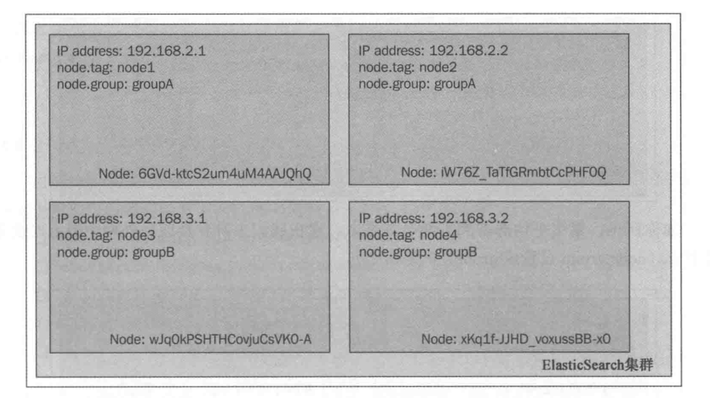
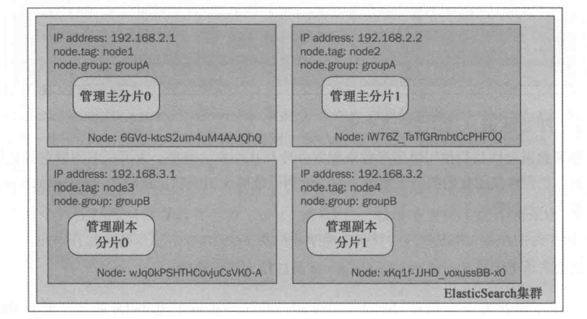
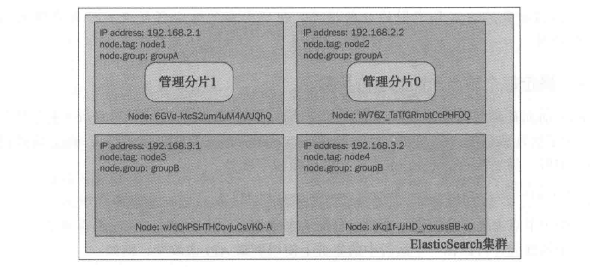
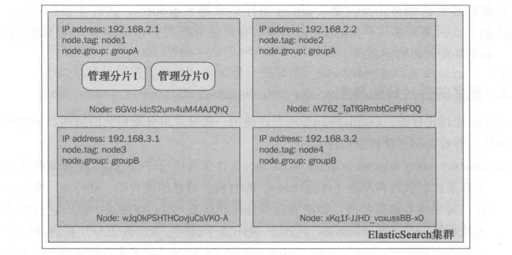
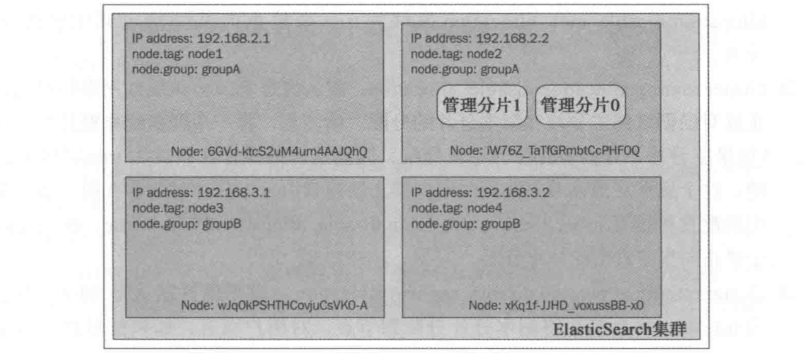
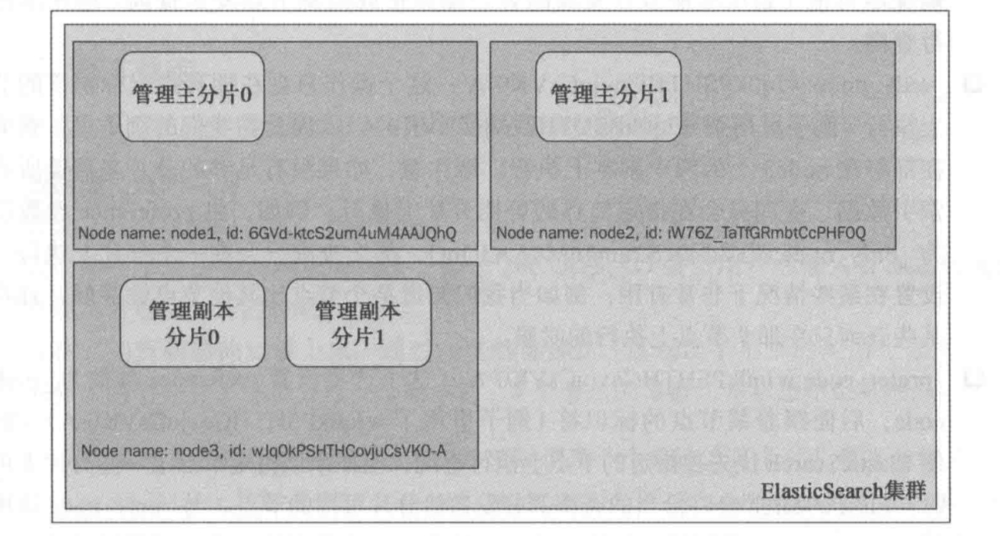
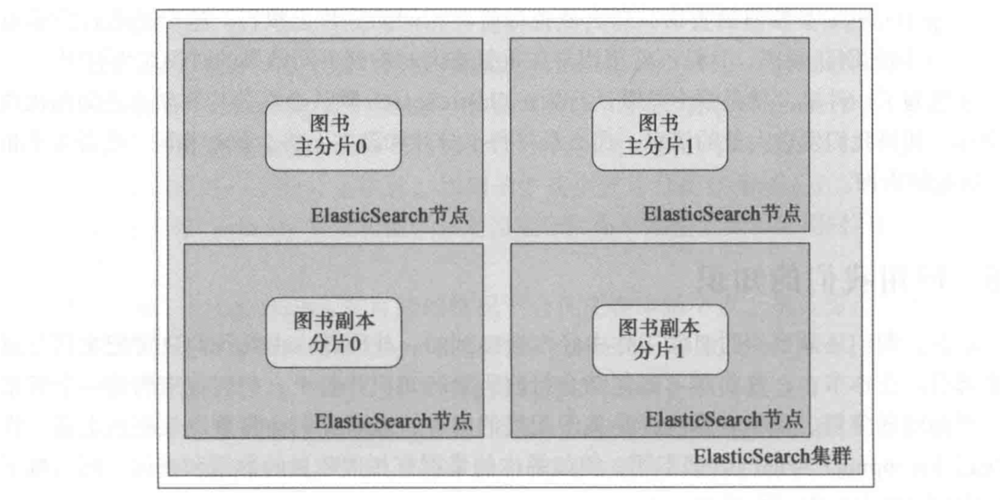

本章将学习以下内容：

* 如何为集群选择合适的分片数和副本数
* 路由是什么以及它对ES的意义
* 分片分配器如何工作、配置
* 怎样调节分片分配机制以满足应用需求
* 怎样确定应该在哪个分片上执行指定的操作
* 如何应对数据和查询数量的增长
## 选择合适的分片和副本数

随着应用的增长，需要规划索引及其配置使其适应应用的变化。每个应用程序都有各自的特性和需求，没有确切的秘诀，不仅索引结构如此，配置也是如此。例如，文档或索引的大小、查询类型以及期望的吞吐量都是其影响因素。

### 分片和过度分配

分片处理是将一个索引分割成若干更小索引的过程，从而能够在同一集群的不同节点上散布它们。查询时结果是索引中每个分片返回结果的汇总（如果某个分片包含所有数据就不是真的汇总）。ES 默认为每个索引创建 5 个分片，即使在单节点环境下也是如此。这种冗余称为过度分配（over allocation）。目前看起来没有必要，仅在索引（散布文档到分片）和处理查询（查询多个分片合并结果）时就增加了更多的复杂性。幸运的是复杂性被自动处理了。

如果一个索引由一个分片构成，那当应用程序的增长超过单一服务器的容量时就会遇到问题。因为当前的 ES 版本不能将索引分割成多份，必须在创建索引时就指定好需要的分片数量。用户所能做的就是只有创建一个拥有更多分片的新索引，并重新索引数据。ES 设计者选择的默认配置（5个分片和1个副本）使数据量增长和多分片搜索结果合并之间达到平衡。

如果有一个有限且明确的数据集，可以只使用一个分片。如果没有依照经验，最理想的分片数量应该依赖于节点的数量。因此，如果计划将来使用10个节点，需要给索引配置10个分片。为了保证高可用和查询的吞吐量，同样需要配置副本数，且它与普通分片一样需要节点上的空间。简单的计算公式为：节点最大数 = 分片数 * （ 副本数 + 1 ）

### 过度分配的正面例子

一般应该使用更少的分片，但更多的分片意味着每个在较小的 Lucene 索引上执行的操作会更快（尤其是索引过程）。当然，将查询分散成对每个分片的请求，然后合并结果，也是有代价的，但这对于使用固定参数来过滤查询的应用程序是可以避免的。

案例：每个查询大偶在指定用户的上下文中执行的多租户系统。即把每个用户的数据都索引到一个独立分片中，查询时只查询该用户的分片（需要使用路由）。

### 多分片与多索引

如果一个分片是一个小的 lucene 索引，那什么是真正的 ES 索引？技术上来讲是一样的，差别只在一些针对索引或分片的额外特性上。对分片处理来说，目标查询的处理可能存在这些可能：查询被路由至特定分片执行，不同的查询又各自的执行偏好。对于索引，一个更通用的机制被应用于寻址，使用 /index1, /index2 等这样的记，查询可以被发送给不同的索引。可以使用别名让多个索引看起来像一个索引，类似分片处理。更多的不同可以从分片和索引的平衡逻辑上看出来，尽管自动化索引的不足一定程度上可以由手工部署索引（到指定节点）来掩盖。

### 副本

分片处理能存储超过单机容量的数据，而使用副本则解决了日渐增长的吞吐量和数据安全方面的问题。当一个存放主分片的节点失效后，ES 能将一个可用的副本升级为新的主分片。查询吞吐量会随着用户的增长而增长，而使用副本则可以应对增长的并发查询。使用过多副本的缺点也很明显：各个分片的副本占用了额外的存储空间，主分片及其副本之间的数据拷贝也存在时间开销。因此选择分片数量时，应当考虑所需要的副本数量。如果选择太多的副本，可能会耗光磁盘空间和ES的资源，而事实上这些副本很多时候根本用不到。但不创建副本则可能导致主分片发生问题时的数据丢失。

## 路由

路由是限定查询在单个分片上执行的一个解决方案，由此来应对增长的查询吞吐量。

### 分片和数据

通常情况下，ES将数据分发到哪个分片，以及哪个分片上存放特定的文档都不重要。查询时请求会发送至所有的分片，最关键的事情是使用一个能均匀分发数据的算法。当删除或增加一个文档的新版时，ES需要知道文档在哪个分片，这就是路由要做的事情。

### 测试路由功能

通过一个例子演示如何将文档存放到特定的分片上。

安装 Paramedic 插件：

```shell
bin/plugin -install karmi/elasticsearch-paramedic
```
重启 ES 后，通过浏览器访问 [http://lcoalhost:9200/_plugin/paramedic/index.html](http://lcoalhost:9200/_plugin/paramedic/index.html) ，上面有索引相关的各种统计量和其它信息。这里重点关注象征集群状态的集群颜色以及各个索引的分片和副本列表。
创建索引：

```shell
curl -XPUT localhost:9200/ducuments -d '{
 settings: {
   number_of_replicas: 0,
   number_of_shards: 2
 } 
}'
```
创建了只有 2 个分片但没有副本的索引。
索引文档：

```shell
curl -XPUT localhost:9200/documents/doc/1 -d '{"title": "Document No.1"}'
curl -XPUT localhost:9200/documents/doc/1 -d '{"title": "Document No.2"}'
curl -XPUT localhost:9200/documents/doc/1 -d '{"title": "Document No.3"}'
curl -XPUT localhost:9200/documents/doc/1 -d '{"title": "Document No.4"}'
```
Paramedic 会展示 2 个主分片。集群中的每个节点都精准地容纳了 2 个文档。可以得出结论：分片算法完美地完成工作，文档在分片之间均匀分布。
人为关闭一个节点，集群状态会变成红色，丢失了一个主分片后数据的某些部分会缺失。尽管如此，ES还允许查询，至于是返回失败还是挂起查询，由应用构建者决定。这里查询所有文档，ES 会返回失败信息和命中的 2 个文档信息。

#### 索引过程中使用路由

可以通过路由来控制 ES 将文档发送到哪个分片。路由参数值无关紧要可以取任何值。重要的是将不同文档放到同一个分片上时，需要使用相同的值。

向ES提供路由信息有多种途径，

第一种方法：

最简单的办法是在索引文档时加一个 URI 参数 routing，如：

```shell
curl -XPUT localhost:9200/documents/doc/1?routing=A -d '{"title": "Document"}'
```

第二种方法：

还可以在文档里放一个 _routing 字段，如：

```shell
curl -XPUT localhost:9200/documents/doc/1 -d '{"title": "Document", "_routing": "A"}'
```
这种情况仅在 mappings 中定义了 _routing 字段时才会生效，如：
```json
"mappings": {
  "doc": {
    "_routing": {
      "required": true,
      "path": "_routing"
    },
    "properties": {
      "title": {"type": "string"}
    }
  }
}
```
值得一提的是 path 参数可以指向文档中任意未分词字段。这个功能十分强大，也是路由特性最主要的优势所在。例如使用图书所在的图书馆的 library_id 字段扩展文档，那么当基于 library_id 设置路由时，有理由认为所有基于图书馆的查询更有效率。
第三种方法：

最后一种方式是在执行批量索引时使用路由。使用时路由值在每个文档的头部给出，如：

```shell
curl -XPUT localhost:9200/_bulk --data-binary '\
{
  "index":
  {
    "_index": "documents",
    "_type": "doc",
    "_routing": "A"
  }
}
{"title": "Document No.1"}
'
```

### 索引时使用路由

仍然使用上面的例子，只是这次使用路由。先删除旧数据，否则使用相同的标识符添加文档时，路由会把相同的文档存放到另一个分片中。因此，删除旧数据：

```shell
curl -XDELETE localhost:9200/documents/_query?q=*:*
```
重新索引数据，添加这次的路由信息。索引文档的命令如下：
```shell
curl -XPUT localhost:9200/documents/doc/1?routing=A -d '{"title": "Document No.1"}'
curl -XPUT localhost:9200/documents/doc/2?routing=B -d '{"title": "Document No.2"}'
curl -XPUT localhost:9200/documents/doc/3?routing=A -d '{"title": "Document No.3"}'
curl -XPUT localhost:9200/documents/doc/4?routing=A -d '{"title": "Document No.4"}'
```
可通过 Paramedic 页面验证文档路由到哪个分片。一个节点只有1个文档（路由值为B），另一个节点有3个文档（路由值为A）。停掉一个节点，Paramedic 会再次显示红色的集群状态。
#### 查询

路由允许用户构建更有效率的查询，并且用户也可以使用路由，不必把查询发送到所有节点。如：

```shell
curl -XGET 'localhost:9200/documents/_search?pretty&q=*:*&routing=A'
```
会发现返回了3个文档（第一个节点挂掉），看起来很顺利，但第一个节点挂掉了并未启动，由此可见尽管没有一个完整的索引视图，ES 的响应中并未包含分片失败的信息。这证明了使用路由的查询只命中选定的分片，而忽略其它分片。如果改用路由值 B 会发现返回了异常。
需要注意，虽然路由确保了在索引时拥有相同路由值的文档会索引到相同的分片上，但一个给定的分片上可以有很多拥有不同路由值的文档。路由可以限制查询时使用的节点数，但是不能替代过滤功能。这意味着一个查询有没有使用路由都应该相同的过滤器。

### 别名

对程序员隐藏一些配置信息，让其可以快速工作而不必关心搜索细节如路由、分片、副本。创建别名：

```shell
curl -XPOST 'http://localhost:9200/_aliases' -d '
{
  "actions": [
    {
      "add": {
        "index": "documents",
        "alias": "documentsA",
        "routing": "A"
      }
    }
  ]
}'
```
创建了一个叫 documentsA 的虚拟索引（一个别名），用来代表来自 documents 索引的信息。除了这个查询还被限定在路由值 A 相关的分片上。
### 多个路由值

ES 允许在一次查询中使用多个路由值。文档放置在哪个分片上依赖于文档的路由值，多路由值查询意味在一个或多个分片上查询。如：

```shell
curl -XGET 'localhost:9200/documents/_search?routing=A,B'
```
另外，多路由值也支持别名，如：
```shell
curl -XPOST 'http://localhost:9200/_aliases' -d '
{
  "actions": [
    {
      "add": {
        "index": "documents",
        "alias": "documentsA",
        "search_routing": "A,B",
        "index_routing": "A"
      }
    }
  ]
}'
```
上面的例子可以为查询和索引配置不同的路由。定义查询时（search_routing参数）使用两个路由值（A和B），而索引时（index_routing参数）仅使用了一个路由值（A）。注意：索引时不支持多个路由值，同时要做适当的过滤（可以把它加到别名中）
## 调整默认分片分配行为

### 分片分配器简介

分片分配器 ShardAllocator 是承担分片分配职责最主要的类。ES集群上的数据分布发生变动时，分片也有相应的变动。例如集群的拓扑结构发生改变（当加入或移除节点）或通过强制重新平衡时。在内部分配器是 org.elasticsearch.cluster.routing.allocation.allocator.shardsAllocator 接口的一个实现。ES提供了下面两种类型的分配器：

* even_shard
* balanced（默认）
通过在 elasticsearch.yml 中设置 cluster.rounting.allocation.type 属性或者使用设置 API，可以指定具体的分配器实现。

### even_shard分片分配器

ES 0.90.0 之前的版本就有这个分配器了。它能确保每个节点上就有相同数量的分片（当然，并不是总能满足这样的情形），同时也能禁止主分片及其副本存储在同一节点上。在需要重新分配且使用 even_shard 分片分配器时，ES从存储负载最高的节点向存储负载较低的节点移动分片，直到集群完全平衡或者无法移动。需要注意，这个分配器并排工作在索引级别。意味着只要分片及其副本在不同的节点上，分配器就认为工作正常，而不关心来自同一索引的不同分片存放在哪里。

### balanced分片分配器

ES 0.90.0 之后新引入的。基于一些可控制的权重进行分配。相比 even_shard 分片分配器，通过暴露一些参数而引入调整分配过程的能力，从而可以通过使用集群更新 API（update API）动态改变这些参数，可调整的参数如下：

* cluster.routing.allocation.balance.shard：默认值为 0.45。基于分片总数的权重。告诉ES基于所有的分片数，每个节点都分配数量相近的分片的重要性。
* cluster.routing.allocation.balance.index：默认值为 0.5。基于给定索引的分片数的权重。基于同一个索引的分片数，每个节点都分配数量相近的分片的重要性。
* cluster.routing.allocation.balance.primary：默认值为 0.05。基于主分片的权重。将主分片平均分配到节点的重要性。
* cluster.routing.allocation.balance.threshold：默认值为 1.0
如果集群的所有节点上平均分配很重要，应该提高 cluster.routing.allocation.balance.primary 的权重值，并适当降低出阈值外的其他权重值。

如果所有因子与其权重乘机的总和大于已定义的阈值，那么这类索引的分片就需要重新分配了。如果需要忽略一个或多个因子，将它们的权重设置为 0 就可以。

### 自定义分片分配器

内置的分片分配器肯跟不适合应用场景，如需要在分配时考虑索引大小的不同。或者继承各种不同硬件的大集群，不同的 CPU、内存容量或磁盘容量。所有这些因素都可能导致集群数据分布的低效。

可以定制解决方案，cluster.routing.allocation.type 必须设置成一个类的全限定名，且该类需要实现 org.elasticsearch.cluster.routing.allocation.allocator.ShardsAllocator 接口。

### 裁决者

分片分配器如何决定决定分片移动的时机和目标节点，主要是ES内部的裁决者（decider）做出分配决定的大脑。ES允许同时使用多个裁决者，而且它们会在裁决过程中投票。有个规则共识：如果某裁决者投票反对重新分配一个分片的操作，那么该分片就不能移动。裁决者只有固定的十来个，如果想添加新的决策者，只能通过修改 ES 源码。

#### SameShardAllocationDecider

该裁决者禁止将相同数据的拷贝（分片和其副本）放到相同的节点上。原因很明显：不希望再保存主数据的地方保留其备份数据。但 cluster.routing.allocation.same_shard.host 属性控制了 ES 是否需要考虑分片放到物理机器上的位置。默认为 false，因为许多节点可能运行在同一台运行着多个虚拟机的服务器上。当设置成 true 时，这个裁决者会禁止将分片和其副本放置在同一台物理机器上。不过最好还是依赖像 index.routing.allocation 属性族的配置。

#### ShardsLimitAllocationDecider

该裁决者确保一个给定索引在某节点上的分片不会超过给定数量。该数量是由 index.routing.allocation.total_shards_per_node 属性控制的，可以在 elasticsearch.yml 文件中设置，或者通过索引更新 API 在线更新。属性的默认值是 -1，表明没有限制。注意：调低该值会强制重新分配，在重新平衡期间会给集群带来额外额外的负载。

#### FilterAllocationDecider

该裁决者只在增加了控制分片分配的参数时才会用到。这类参数需要匹配 *.rounting.allocation.* 名称模式。

#### ReplicaAfterPrimaryActiveAllocationDecider

该裁决者使得ES仅在主分片都分配好之后才开始分配副本。

#### ClusterRebalanceAllocationDecider

该裁决者允许根据集群的当前状态改变集群进行重新平衡的时机。可以通过 cluster.routing.allocation.allow_rebalance 属性来控制，它支持以下这些值：

* indices_all_active：默认值表明重新平衡仅在集群中所有已存在的分片都分配好后才能进行
* indice_primaries_active：表明重新平衡只在主分片分配好以后才进行
* always：设置表明重新平衡总是可以进行，甚至在主分片和副本还没有分配好时可以
注意：这些设置在运行时不能更改。

#### ConcurrentRebalanceAllocationDecider

该裁决者用于调节重新部署操作，并基于 cluster.routing.allocation.cluster_concurrent_rebalance 属性。该属性可以设置给定集群上可以并发执行的重新部署操作的数量，默认是 2 个，意味着在集群上只有不超过 2 个的分片可以同时移动。可这个值设为 -1 将取消限制，从而使重新部署操作的并发数量没有限制。

#### DisableAllocationDecider

该裁决者可以调整自身行为来满足应用需求的裁决者。为了利用该裁决者的特性，可以更改下面的这些设置（修改 elasticsearch.yml 或使用集群设置 API）：

* cluster.routing.allocation.disable_allocation：设置允许禁止所有的分配。
* cluster.routing.allocation.disable_new_allocation：设置允许禁止新主分片的分配。
* cluster.routing.allocation.disable_replica_allocation：设置允许禁止副本的分配。
设置的默认值都是 false。在完全控制分配时非常有用。当要快速地重新分配和重新启动一些节点时，可以禁止重新分配。尽管在 elasticsearch.yml 文件里设置前面提到的那些属性，使用更新 API 会更有意义。

#### AwarenessAllocationDecider

该裁决者用来处理意识部署功能的。任何时候使用了 cluster.routing.allocation.awareness.attributes 设置都会起作用。

#### ThrottlingAllocationDecider

与 ConcurrentRebalanceAllocationDecider 类似，允许限制分配过程产生的负载。可以使用下面的属性控制恢复过程：

* cluster.routing.allocation.node_initial_primaries_recoveries：默认值为 4。描述了单节点所允许的最初始的主分片恢复操作的数量。
* cluster.routing.allocation.node_concurrent_recoveries：默认值为 2。定义了单节点并发恢复操作的数量。
#### RebalanceOnlyWhenActiveAllocationDecider

该裁决者限制重新平衡过程仅在分片组（主分片和其副本们）内的所有分片都是活动的（active）情况下进行。

#### DiskThresholdDecider

该裁决者在 ES 0.90.4 版本引入，允许基于服务器上的空余磁盘容量来部署分片。默认禁用，必须设置 cluster.routing.allocation.disk.threshold_enabled 属性为 true 来启用。且允许配置一些阈值来决定何时将分片放到某个节点上以及 ES 应该何时将分片迁移到另一个节点。

* cluster.routing.allocation.disk.watermark.low 允许在分片分配可用时指定一个阈值或绝对值。默认值是 0.7，即告诉 ES 新分片可以分配到一个磁盘使用率低于 70% 的节点上。
* cluster.routing.allocation.disk.watermark.high 允许在某分片分配器试图将分片迁移到另一个节点时指定一个阈值或绝对值。默认值是 0.85，意味着 ES 会在磁盘空间使用率上升到 85% 时重新分配分片。
这两个属性都可以设置成百分数（如0.7或0.85），或者绝对值（如1000mb）。另外，本节提到的所有属性都可以在 elasticsearch.yml 里静态设置，或使用 ES API 动态更新。

## 调整分片分配

除了可以使用单个 API 命令在集群内移动分片，对于分片分配而言，还可以定义一系列分片分配的规则。

例如，假设有 4 个节点的集群，每个节点都绑定了一个指定的 IP 地址，且都被赋予了一个 tag 属性和一个 group 属性（在 elasticsearch.yml 文件里对应的是 node.tag 和 node.group 属性）。这个集群用来展示分片分配的过滤处理如何工作。可以给 tag 和 group 属性任意命名，只需要给期望的属性名前面加上 node 前缀即可。如将 party 作为属性名，只需要把 node.party: party1 加入到 elasticsearch.yml 文件里。




### 部署意识

部署意识允许使用通用参数来配置分片及其副本的部署。使用这里的例子集群来证明部署意识如何工作的。在 elasticsearch.yml 文件里加入下列属性：

```plain
cluster.routing.allocation.awareness.attributes: group
```
这会告诉 ES 使用 node.group 属性作为意识参数。
>可以指定多个值给该属性，如：cluster.routing.allocation.awareness.attributes: group, node

然后先启动前两个节点，即 node.group 属性值是 groupA 的那两个。接下来创建一个索引：

```shell
curl -XPOST 'localhost:9200/mastering' -d '{
  "settings": {
    "index": {
      "number_of_shards": 2,
      "number_of_replicas": 1
    }
  }
}'
```
执行前面的命令后，两个节点的集群看起来类似于下面的截图：


索引平均部署到了两个节点上。换成另外两个节点时会发生什么（node.group 设置成 groupB 的那两个）：




注意区别：主分片没有从原来部署的节点上移动，但是副本分片却移动到了有不同 node.group 值的节点上。这恰恰是正确的。当使用分片部署意识时，ES不会将分片和副本放到拥有相同属性值（用来决定部署意识，如例子中的 node.group）的节点上。例如从虚拟机或物理位置的角度分割集群的拓扑结构，以确保不会有单点故障。

>在使用部署意识时，分片不会被部署到没有设定指定属性的节点上，所以对这里的例子来说，一个没有设置 node.group 属性的节点时不会被部署机制考虑的。

#### 强制部署意识

预先知道意识参数需要接受几个值，且不超过部署到集群中的副本数时（如不想因过多的副本而使集群过载），有了强制部署意识就很方便。可以强制部署意识由特定属性激活来实现这个。通过使用 cluster.routing.allocation.awareness.force.zone.values 属性并给它提供一个用逗号分隔的列表来指定这些属性值。例如，希望对于部署意识来说只使用 node.group 属性的 groupA 和 groupB 两个值，应该把下面的代码加到 elasticsearch.yml 文件中：

```plain
cluster.routing.allocation.awareness.attributes: group
cluster.routing.allocation.awareness.force.zone.values: groupA, groupB
```

### 过滤

ES允许在整个集群或是索引的级别配置分片的分配。其中在集群级别上可以使用带有下面前缀的属性：

* cluster.routing.allocation.include
* cluster.routing.allocaiton.require
* cluster.routing.allocation.exclude
而处理索引级分配时，使用带有下面前缀的属性：

* index.routing.allocation.include
* index.routing.allocation.require
* index.routing.allocation.exclude
上述前缀可以在 elasticsearch.yml 文件里定义的属性一起使用（ tag 属性和 group 属性）。只需使用一个名为 _ip 的特殊属性，就可以使用 IP 地址来进行包含或排除特定的节点。

例如：

```plain
cluster.routing.allocation.include._ip: 192.168.2.1
```
如果希望包含一组 group 属性是 groupA 的节点，应该设置下面的属性：
```plain
cluster.routing.allocation.include.group: groupA
```
注意，这里已经使用了 cluster.routing.allocation.include 前缀，并把它和属性名 group 连接在一起。
属性含义：

* include：包含所有定义了某参数的节点，如果定义了多个条件，那么至少匹配一个条件的节点都会在分配分片时被考虑进去。如增加两个 cluster.routing.allocation.include.tag 参数到配置中，一个赋值 node1，另一个赋值 node2，那么索引（确切地说是它们的分片）会被分配到第一个和第三个节点上（从左向右）。总结：拥有 include 参数类型的节点，ES 在选择防止分片的节点时会加以考虑，但这并不意味 ES 一定会把分片放到这些节点上。
* require：该属性在 ES 0.90 版本的分配过滤器中引入的。要求所有节点都必须拥有和这个属性相匹配的值。如向配置中添加 cluster.routing.allocation.require.tag 参数并赋值 node1，添加 cluster.routing.allocation.require.group 参数并赋值 groupA，那么所有的分片都分配在第一个节点上（IP地址为 192.168.2.1 的节点）。
* exclude：该属性允许在分片分配过程中排除具有特定属性的节点。例如，给 cluster.routing.allocation.include.tag 赋值 groupA，那么索引只分配在 IP 地址是 192.168.3.1 和 192.168.3.2 的节点上（例子中的第三个和第四个节点）
>属性值可以使用简单的通配符。例如，要包含所有 group 属性值以 group 开头的节点，应当设置 cluster.routing.allocation.include.group 属性的值为 group*。就样例集群来说。这会导致匹配 group 参数值是 groupA 和 groupB 的节点。

### 运行时更新分配策略

除了在 elasticsearch.yml 文件里设置这些属性外，在集群已经启动运行后，也可以通过更新 API 来实时更新这些设置。

#### 索引级更新

更新一个给定索引（如 mastering 索引）的设置，执行下面的命令：

```shell
curl -XPUT 'localhost:9200/mastering/_settings' -d '{
  "index.routing.allocation.require.group": "groupA"
}'
```
命令发送到了指定索引的 _settings 端点，可以在一次调用中包含多个属性。
#### 集群级更新

更新整个集群的设置，执行下面的命令：

```shell
curl -XPUT 'localhost:9200/_cluster/settings' -d '{
  "transient": {
    "cluster.routing.allocation.require.group": "groupA"
  }
}'
```
>依据命令的内容和索引的分配情况，执行前面的命令可能造成分片在节点间的移动。

### 确定每个节点允许的总分片数

除了前面提到的属性，还能定义每个节点可分配给索引的分片总数（主分片和副本）。为了实现该目的，需要给 index.routing.allocation.total_shards_per_node 属性设置一个期望值。如在 elasticsearch.yml 文件里做如下设置：

```plain
index.routing.allocation.total_shards_per_node: 4
```
这样单个节点上最多会为同一个索引分配 4 个分片。
该属性同样可以在一个运行中的集群上使用更新 API 来改变，如：

```shell
url -XPUT 'localhost:9200/mastering/_settings' -d '{
  "index.routing.allocation.total_shards_per_node": "4"
}'
```
下面举例说明 elasticsearch.yml 文件中使用分片分配属性后，以及创建单一索引时集群是什么样子。
#### include（包含）

创建 mastering 索引：

```shell
curl -XPOST 'localhost:9200/mastering' -d '{
  "settings": {
    "index": {
      "number_of_shards": 2,
      "number_of_replicas": 0
    }
  }
}'
```
然后执行下面的命令：
```shell
curl -XPUT 'localhost:9200/mastering/_settings' -d '{
  "index.routing.allocation.include.tag": "node1",
  "index.routing.allocation.include.group": "groupA",
  "index.routing.allocation.total_shards_per_node": 1
}'
```
如果把索引状态命令的响应可视化，那么集群与下图类似：



masterting 索引的分片部署到了 tag 属性为 node1 或 group 属性为 groupA 的节点上。

#### require（必须）

仍然使用前面的范例集群（假定集群里没有任何索引），观察 require（必须）分配如何工作。创建 mastering 索引：

```shell
curl -XPOST 'localhost:9200/mastering' -d '{
  "settings": {
    "index": {
      "number_of_shards": 2,
      "number_of_replica": 0
    }
  }
}'
```
然后执行下面的命令：
```shell
curl -XPUT 'localhost:9200/mastering/_settings' -d '{
  "index.routing.allocation.require.tag": "node1",
  "index.routing.allocation.require.group": "groupA"
}'
```
如果把索引状态命令的响应可视化，那么集群与下图类似：



该视图跟前面使用 include 选项的不一样。这是由于 ES 将 mastering 索引的分片仅分配到与两个 require 参数都匹配的节点上，而例子中满足两个都匹配的只有第一个节点。

#### 排除

还使用前面的范例集群，创建 mastering 索引：

```shell
curl -XPOST 'localhost:9200/mastering' -d '{
  "settings": {
    "index": {
      "number_of_shards": 2,
      "number_of_replica": 0
    }
  }
}'
```
然后执行下面的命令测试 exclude（排除）分配：
```shell
curl -XPUT 'localhost:9200/mastering/_settings' -d '{
  "index.routing.allocation.require.tag": "node1",
  "index.routing.allocation.require.group": "groupA"
}'
```
再看看集群：



如图所实施，要求 group 属性必须等于 groupA，同时希望排除 tag 等于 node1 的节点。这导致一个 mastering 索引的分片被分配到了 IP 地址为 192.168.2.2 的节点，如期望一致。

### 更多的分片分配属性

除了上面讨论过的，ES还允许使用一些分片来分配相关的属性。

* cluster.routing.allocation.allow_rebalance：该属性允许基于集群中所有分片的状态来控制执行再平衡（rebanlance）的时机。可选的值包括：always，使用该值时再平衡会按需执行，而不管索引分片的状态（谨慎使用该值，会造成很高的负载）；indices_primaries_active，使用该值当所有主分片时活动状态时在平衡会立刻执行；indices_all_active，使用该值再平衡在所有分片（主分片和副本）都分配好以后执行。默认值是 indices_all_active。
* cluster.routing.allocation.cluster_concurrent_rebanlance：该属性控制集群内有多少分片可以并发参与再平衡处理，默认值为2。该值设置较高会造成较高的I/O，并增加网络开销和节点的负载。
* cluster.routing.allocation.node_initial_primairies_recoveries：该属性指定了每个节点可以并发恢复的主分片数量。基于主分片恢复通畅比较快，即使把属性值设置得比较大， 也不会给节点本身带来过多压力。默认值为4。
* cluster.routing.allocation.node_concurrent_recoveries：该属性指定了每个节点允许的最大并发恢复分片数，默认值是2。指定过多的并发恢复的分片数会造成非常频繁的I/O活动。
* cluster.routing.allocation.disable_new_allocation：默认值为false。该属性用来控制是否禁止为新创建的索引分配新分片（包括主分片和副本分片）。该属性在希望延期分配新建的索引或分片时非常有用。也可以通过设置 index.routing.allocation.disable_new_allocation 属性为 true 来禁止向某个给定索引分配新的分片。
* cluster.routing.allocation.disable_allocation：默认值为false。用来控制是否禁止针对已创建的主分片和副本分片的分配。注意将一个副本分片提升为主分片（如果主分片不存在）的行为不算分配，因此这样的操作在属性为 true 时也是允许的。该属性在希望某段时间内禁止新建索引分配分片时非常有用。通过在索引的配置里设置 index.routing.allocation.disable_allocation 属性为 true，可以完全禁止向指定索引的分片分配。
* cluster.routing.allocation.disable_replica_allocation：默认值为false。设置为 true 时将会禁止将副本分片分配到节点。某时段停止分配副本分片时非常有用。也可以通过设置 index.routing.allocation.disable_replica_allocation 属性为 true 来禁止向一个给定索引分配副本。
前面所有的属性既可以在 elasticsearch.yml 文件里设置，也可以通过更新 API 来设置。在实践中通常只使用更新 API 来配置一些属性，如 cluster.routing.allocation.disable_new_allocation 、cluster.routing.allocation.disable_allocation 、 cluster.routing.allocation.disable_replica_allocation。

## 查询执行偏好

还可以指定查询（以及其他操作，如实时获取）在哪里执行。

了解细节之前，先查看范例集群：




如图集群中有三个节点和一个叫作 mastering 的索引。索引被分割为两个主分片，每个主分片有一个副本。

#### 介绍preference参数

为了控制所发送查询（和其他操作）执行的地点，可以使用preference参数，可以取下面这些值：

* _primary：使用这个属性，发送的操作仅会在主分片上执行。如果想 mastering 索引发送一个查询请求，并将 preference 参数设置为 _primary，那么请求会在 node1 和 node2 上执行。如用户知道主分片在某个机柜，而副本在其它机柜，可能希望通过在主分片上执行操作来避免网络开销。
* _primary_first：该属性的行为很像 _primary，只是当主分片由于某些原因不可用时可以转而使用其副本，但它有一个自动故障恢复机制。如果向 mastering 索引发送一个查询请求，并设置 preference 参数为 _primary_first，那么查询会在 node1 和 node2 上执行。而一旦一个（或多个）主分片失败，查询会在另一个分片上执行，比如例子中这个分片分配在 node3 上。
* _local：ES在可能的情况下会优先在本地节点上执行操作。如发送一个查询请求给 node3 同时将 preference 参数设置为 _local，那么查询就会在该节点上执行。在最小化网络延时时尤为有用。
* _only_node:xxx：该操作只会在拥有置顶标识符的节点上执行。注意：如果没有足够的分片来覆盖所有的索引数据，查询只会在指定节点的可用分片上执行。
* _prefer_node:xxx：该选项设置 preference 参数为 _prefer_node，后面跟着某节点的标识符。使ES优先在指定的节点上执行查询，但如果该节点上一些分片不可用时，ES会将恰当的查询部分发送给分片可用的节点。与 _only_node 选项类似，_prefer_node 可以用来选择一个特定的节点，只是当特定节点不可用时可以转而使用其他节点。
* _shards:0,1：既指定操作将在哪个分片上执行，也是唯一一个可以和其他选项值组合的 preference 参数值。如：0,1;_local，表示为了在本地的 0 和 1 分片上执行查询，用分号连接 0,1 和 _local。对调试而言允许在一个分片上执行查询非常有用。
* custom：自定义值，确保具有相同值的查询会在相同的分片上执行。例如，发送一个 preference 参数值为 masterIng_elasticsearch 的查询，那么查询会在名称是 node1 和 node2 的节点的主分片上执行。如果发送另一个具有相同 preference 参数值的查询，那么该查询将在相同的分片上执行。该功能在需要有不同的刷新频率，并且不希望用户在重复查询时看到不同结果时尤为有用。
ES 默认会在分片和副本之间随机执行操作。如果发送大量请求，那么最终每个分片和副本上将会执行相同（或者几乎相同）数量的查询。

## 应用知识

### 基本假定

#### 数据量和查询说明

假设有一个在线图书馆，当前销售着大约 10 万本不同语言的图书。

期望平均的查询响应时间小于等于 200 毫秒，避免用户在输入查询之后或搜索结果呈现之前等待太长时间。

通过一些性能测试（暂略），发现当数据分成两个分片，每个分片一个副本时，4个节点的集群工作状态时最好的。

>可以使用开源工具来对集群发起请求做性能测试，例如 ApacheJMter（参见 [http://jmeter.apache.org/](http://jmeter.apache.org/) ）或 ActionGenerator（参见 [https://github.com/sematext/ActionGenerator](https://github.com/sematext/ActionGenerator) ）。此外还可以使用 ES API （通过类似 paramedic 的插件（参见 [https://github.com/karmi/elasticsearch-paramedic](https://github.com/karmi/elasticsearch-paramedic) ））来查看统计记录，或者使用 BigDesk（参见 [https://github.com/lukas-vlcek/bigdesk](https://github.com/lukas-vlcek/bigdesk），) ），又或者使用一个全面监控和可调节的解决方案，类似于来自 Sematext 的 SPM for ElasticSearch（参见 [http://sematext.com/spm/elasticsearch-performance-monitoring/index.html](http://sematext.com/spm/elasticsearch-performance-monitoring/index.html) ）

集群类似：




当然确切地分片和副本的位置可能不同，但背后的逻辑相同，即：每个节点上有一个分片。

### 配置

创建集群的配置信息：

```plain
cluster.name: books
# node configuration
node.master: true
node.data: true
node.max_local_storage_nodes: 1
# indices configuration
index.number_of_shards: 2
index.number_of_replicas: 1
index.routing.allocation.total_shards_per_node: 1
# instance paths
path.conf: /usr/share/elasticsearch/conf
path.plugins: /usr/share/elasticsearch/plugins
path.data: /mnt/data/elasticsearch
path.work: /usr/share/elasticsearch/work
path.logs: /var/log/elasticsearch
# swapping
bootstrap.mlockall: true
# gateway
gateway.type: local
gateway.recover_after_nodes: 3
gateway.recover_after_time: 30s
gateway.expected_nodes: 4
# recovery
cluster.routing.allocation.node_initial_primaries_recoveries: 1
cluster.routing.allocstion.node_concurrent_recoveries: 1
indices.recovery.concurrent_streams: 8
# discovery
discovery.zen.minimum_master_nodes: 3
# search and fetch logging
index.search.slowlog.threshold.query.info: 500ms
index.search.slowlog.threshold.query.debug: 100ms
index.search.slowlog.threshold.fetch.info: 1s
index.search.slowlog.threshold.fetch.debug: 200ms
# JVM gargabe collection work logging
monitor.jvm.gc.ParNew.info: 700ms
monitor.jvm.gc.ParNew.debug: 400ms
monitor.jvm.gc.ConcurrentMarkSweep.info: 5s
monitor.jvm.gc.ConcurrentMarkSweep.debug: 2s
```

#### 节点级配置

指定了集群名（使用 cluster.name 属性）来识别集群。如果相同网络内存在多个集群，那么拥有相同集群名称的节点会尝试相互连接并组成集群。将节点设置为可被选举为主节点（node.master 属性为 true），并使之能容纳索引数据（node.data: true）。除此之外，将 node.max_local_storage_nodes 属性设为 1，为了避免单个节点上运行多个 ES 实例。

#### 索引级配置

这里只有一个索引且不会增加。设置默认的分片数为 2 （index.number_of_shards 属性），默认的副本数为 1（index.number_of_replicas 属性）。设置 index.routing.allocation.total_shards_per_node 属性为 1，意味着 ES 会针对每个索引在相应节点上放置一个分片，这里集群有 4 个节点，分片能够在节点上平均分配。

#### 目录布局

将 ES 安装到 /usr/share/elasticsearch，因而 conf、plugins 和 work 目录也都相应配置到了该目录中。数据放置在一个特别指定的硬盘驱动器上，可通过 /mnt/data/elasticsearch 挂载点访问。日志文件存储在 /var/log/elasticsearch 目录中。这样的目录布局，在更改时只需要考虑 /usr/share/elasticsearch 目录，而不用关心其它目录。

#### 网关配置

网关是负责存储索引及其元数据的模块。这里选择了推荐的并且唯一未废弃的网关类型，即 local（gateway.type 属性）。另外也希望恢复进程在有 3 个节点时（gateway.recover_after_nodes 属性），且在至少 3 个节点相互连接上 30 秒（gateway.recover_after_time 属性）之后立即执行。此外通过设置 gateway.expected_nodes 能告知 ES 集群将由 4 个节点组成。

#### 恢复

集群恢复是一个最关键的配置。设置 cluster.routing.allocation.node_initial_primaries_recoveries 属性为 1，意味着仅允许每个节点上同时回复 1 个主分片。因为已设置每个节点上只运行一个 ES 实例。这个操作对于 local 网关类型非常快，因此如果每个节点存在一个以上的主分片则该值可以设置得更大些。也将 cluster.routing.allocation.node_concurrent_recoveries 属性设为 1 来限制每个节点上同时进行的恢复操作数（每个节点上只有一个分片，因此没有命中该规则，但如果每个节点有更多分片且 I/O 负荷允许，那么可以设置一个较大值）。此外将 indices.recovery.concurrent_streams 属性设为 8，因为在恢复操作的初始测试期间，网络和服务器在从对等分片回复一个分片时可以轻松使用 8 个并发文件流，基本上意味 8 个索引文件被同时读取。

#### 发现

发现模块的配置仅设置了一个属性 discovery.zen.minimum_master_nodes 的属性值为 3。它能指定组成集群所需的且可以成为主节点的最小节点数，取值至少是集群节点的一半加 1，这里的例子是 3。会避免出现集群中的节点由于一些故障断开组成了一个同名的新集群（所谓的脑裂状况）。这种情形非常危险，会造成数据损坏（因为两个新组成的集群会同时索引和改变数据）。

#### 记录慢查询

协同ES工作时，记录执行时间大于等于某个阈值的查询非常重要。注意：这个日志记录的不是查询的全部执行时间，而是查询在每个分片上执行的时间，意味着日志记录的只是执行时间的一部分。这个例子里，想使用 INFO 级日志记录超过 500 毫秒的查询和执行超过 1 秒的实时读取操作。对于调试级日志，分别设置为 100 毫秒和 200 毫秒。配置片段如下：

```plain
index.search.slowlog.threshold.query.info: 500ms
index.search.slowlog.threshold.query.debug: 100ms
index.search.slowlog.threshold.fetch.info: 1s
index.search.slowlog.threshold.fetch.debug: 200ms
```

#### 记录垃圾回收器的工作情况

想要搞清楚是否以及何时垃圾回收器消耗了太多时间，在 elasticsearch.yml 文件中加入下面几行：

```plain
monitor.jvm.gc.ParNew.info: 700ms
monitor.jvm.gc.ParNew.debug: 400ms
monitor.jvm.gc.ConcurrentMarkSweep.info: 5s
monitor.jvm.gc.ConcurrentMarkSweep.debug: 2s
```
通过使用 INFO 级日志，当并发标记清除（concurrent mark sweep）执行等于或超过 5 秒时，以及新生代收集（younger generation collection）执行超过 700 毫秒时，ES 会记录垃圾回收器工作超时的信息。同时也加上 DEBUG 级日志，用来应对我们想要调试或者修复问题的情况。
#### 内存设置

假设节点各有 16G 内存，通常的建议是不要使 Java 虚拟机堆的大小超过可用内存总量的 50%，对当前这个例子来说也是一样。将 Xmx 和 Xms Java 的属性设为 8G，对这个例子来说足够了，因为索引不大，另外数据里也没有父子关系（parent-child relationships），更没有在高基数字段上做切面计算。前面设置了 ES 记录垃圾回收器的信息，为了长期监控，可能还需要使用类似 SPM（[http://sematext.com/spm/index.html](http://sematext.com/spm/index.html）或) ）或 Munin（[http://munin-monitoring.org/](http://munin-monitoring.org/) ）的监控工具。

>注意：举例如果索引占用了约 30G 的磁盘空间，即使共有 128G 内存，但是由于大量的父子关系和高基数字段 faceting，还是发生了内存溢出异常，甚至已经给 Java 虚拟机堆分配了 64G 内存。这种情况不必完全避免分配超过 50% 的总可用内存给 Java 虚拟机。应该要具体情况具体分析，前面的例子索引大小远远小于从 128G 分出 64G 给 Java 虚拟机后剩余的可用内存，可以增加 Java 虚拟机的内存使用量，但是要记得留下足够的内存，这样交换（swapping）就不会在系统里发生了。

还有一个属性 bootstrap.mlockall 属性，设置为 true 表示允许 ES 锁定堆内存，确保内存不会被交换。同时，也建议把 ES_MIN_MEM 和 ES_MAX_MEM 变量设置成同样的值，以确保服务器有足够的空余物理内存来启动 ES，且留有足够的内存给操作系统，使其能完美工作。

### 变化

如果图书文档数量扩大 20 倍，意味着需要调整 ES 集群，保证用户又相同或者更好的搜索体验。最容易做的无需额外工作的事情就是增加副本的数量，但缺点是副本需要更多的磁盘空间，其次要确保额外的副本可以分配到集群的节点中（参考本章最开始的公式）。此外还需要做性能测试，因为最终的吞吐量总是依赖很多因素，不能通过数学公式来描述。

如果过度分配了分片，就为预期的增长留下了空间，但这个例子中只有 2 个分片，对于 10 万的数据量来说非常合适，但是对于处理 210 万的数据量来说太小了。

#### 重新索引

方案一是删除老的索引，然后新建一个新的有着更大分片数的索引。这是最简单的解决方案，但会导致服务在重建索引期间不可用。因为索引文档的成本很高，而且索引整个数据库的时间很长。公司的业务方会认为因重建索引而暂停这么长时间的服务是不可接受的。

第二个方案是再建一个新索引，向它灌数据然后在合适时将应用程序切到新索引上。作为一个选择，可以通过别名来使用新索引，而不用影响应用程序的配置。但是这样仍存在一个小问题，即创建新索引需要额外的磁盘空间，当然可以购买有着更大磁盘的新机器（必须索引新的大数据），但是在它们到位前，也应该能应付所有这些耗时的任务。

#### 路由

使用路由最明显的好处是能创建有效查询（仅返回我们的基础数据集或属于我们业务伙伴的图书），这是因为路由能允许我们只在部分索引中查询。必须谨记应使用适当的过滤器，路由不能保证来自两个数据源的数据分别处在不同的分片上。所以引入路由也需要重建索引，该方案被否决。

#### 多个索引

ES 允许无需额外的开销就可以在多个索引上进行搜索。可以在 API 端点上使用多个索引，如 /books,partner1/。还有一个更有弹性的方式允许方便快速添加另一个伙伴，而不用对应用程序做任何改动，也不需要停止服务。可以使用别名定义虚拟索引，不需要改变应用程序代码。

头脑风暴之后决定选择最后的解决方案，同时加上一些让 ES 在索引期间承受较小压力的额外改进。如下所示：禁用刷新率（refresh rate）同时删除分片副本：

```shell
curl -XPUT localhost:9200/books/_settings -d '{
  "index": {
    "refresh_interval": -1,
    "number_of_replicas": 0
  }
}'
```

### 小结

本章学习了如何为 ES 的部署选择正确的副本分片数。也了解了在查询和索引时路由如何起作用。同时学习了分片分配器如何工作以及需要怎样的配置才能满足需求。然后按照需求配置了分片的分配机制，学习了如何选择查询执行偏好来指定操作在哪个节点上执行。最后配置了一个贴近现实的范例集群，并在需要时扩展了它。


