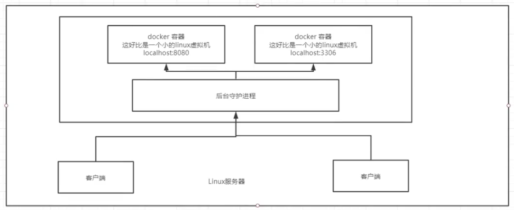

官方文档：[https://docs.docker.com](https://docs.docker.com)

## 概述


## 安装卸载

### 安装

CentOS安装：[https://docs.docker.com/engine/install/centos/](https://docs.docker.com/engine/install/centos/)


mac安装：[https://yeasy.gitbook.io/docker_practice/install/mac](https://yeasy.gitbook.io/docker_practice/install/mac)

```shell
# 启动docker
systemctl start docker

# hello-world
docker run hello-world

# 查看下载的hellow-world镜像
docker images
```

### 卸载

```shell
# 卸载依赖
yum remove docker-ce docker-ce-cli containerd.io
# 删除资源，docker的默认工作路径
rm -rf /var/lib/docker  
```

### run的流程


### 底层原理

Docker是怎么工作的？

Docker是一个Client-Server结构的系统，Docker的守护进程运行在主机上。通过socket从客户端访问

DockerServer接收到Docker-Client的指令，就会执行这个命令



Docker为什么比VM快？

1、Docker有着比虚拟机更少的抽象层

2、Docker利用的是宿主机的内核，vm需要Guest OS

## 
## 常用命令

官方命令文档：[https://docs.docker.com/engine/reference/commandline/info/](https://docs.docker.com/engine/reference/commandline/info/)

### Demo

```shell
// 官方demo
docker run -d -p 80:80 docker/getting-started

// nginx服务器，通过http://localhost访问证明docker已安装成功
docker run -d -p 80:80 --name webserver nginx
docker stop webserver
docker rm webserver
```


### 帮助命令

```shell
docker version
docker info 
docker 命令 help # 万能命令
```
### 镜像命令

镜像官方：[https://hub.docker.com/](https://hub.docker.com/)

#### 查看镜像 images

```shell
docker images # 查看所有镜像
# REPOSITORY 镜像的仓库源
# TAG         镜像的标签
# IMAGE ID    镜像的ID
# CREATED     镜像的创建时间
# SIZE        镜像的大小 
# 可选项
-a, -all    # 列出所有镜像
-q, --quiet  # 只显示镜像的ID
```
#### 列出镜像 image ls

```shell
docker image ls  # 注意：image而不是images。等同docker images
# 镜像下载到本地后，展开的大小，准确说，是展开后的各层所占空间的总和.
# 列表中的镜像体积总和并非是所有镜像实际硬盘消耗。
# 由于 Docker 镜像是多层存储结构，并且可以继承、复用，因此不同镜像可能会因为使用相同的基础镜像，从而拥有共同的层。

docker image ls -a # 中间层镜像
docker image ls ubuntu  # 列举部分镜像
docker image ls ubuntu:18.04  # 列举部分镜像
# 过滤镜像
docker image ls -f since=mongo:3.2
docker image ls -f label=com.example.version=0.1  
```
#### 搜索镜像 search

```shell
docker search 镜像名
# 可选项
--filter=STARS=3000 # 搜索出来的镜像STARS大于3000
```
#### 下载镜像 pull

```shell
docker pull 镜像名[:tag]  
# 不写tage，默认就是latest

# 举例
docker pull mysql   
# 等价于
docker pull docker.io/library/mysql:latest
```

#### 删除镜像

**注意ID可用短ID，保证不重复即可，完整的ID也称为长ID**

```shell
docker rmi -f 镜像id # 删除指定镜像
docker image rm 501a # 短id 删除
docker image rm centos   # 镜像名 删除

docker rmi -f $(docker images -aq)  # 删除所有的镜像
```

#### 镜像体积 system df

```shell
docker system df  // 实际占用空间，因为各层复用，实际空间相比较小
```

#### 利用commit理解镜像构成

参考：[https://yeasy.gitbook.io/docker_practice/image/commit](https://yeasy.gitbook.io/docker_practice/image/commit)

入侵后保存现场等.

不要用作定制镜像，应使用Dockerfile完成

```shell
$ docker exec -it webserver bash
root@3729b97e8226:/# echo '<h1>Hello, Docker!</h1>' > /usr/share/nginx/html/index.html
root@3729b97e8226:/# exit
exit
docker diff webserver # 查看具体改动

docker commit [选项] <容器ID或容器名> [<仓库名>[:<标签>]]
docker commit \
--author "Tao Wang <twang2218@gmail.com>" \
--message "修改了默认网页" \
webserver \
nginx:v2

docker image ls  # 查看新定制的镜像
docker history  # 查看镜像内的历史记录
docker history nginx:v2  # 比较 nginx:latest 的历史记录
```
慎用：简单修改文件会发现大量无关内容被改动，导致镜像臃肿。生成的镜像也被称为 **黑箱镜像**
### 容器命令

说明：有了镜像才能创建容器，下载一个centos镜像来测试学习

```shell
docker pull centos
```
#### 新建容器并启动 run

```shell
docker run [可选参数] image

# 参数说明
--name="Name"  容器名字，tomcat01 tomcat02，用来区分容器
-d             后台方式运行
-it            使用交互方式运行，进入容器查看内容
-p             指定容器的端口 -p 8080:8080
  -p ip:主机端口:容器端口
  -p 主机端口:容器端口  (常用)
  -p 容器端口
-P             随机指定端口
--rm           容器退出后随之将其删除

# 测试，启动并进入容器
docker run -it centos /bin/bash
// docker run -it --rm ubuntu:18.04 bash

exit # 退出容器
```

#### exec

在运行的容器中执行命令

```shell
docker exec [OPTIONS] CONTAINER COMMAND [ARG...]
-d :分离模式: 在后台运行
example: 
# 开启一个交互模式的终端
docker exec -it webserver bash
# 以交互模式执行容器内 /root/runoob.sh 脚本
docker exec -it mynginx /bin/sh /root/runoob.sh
# 对指定的容器执行 bash
docker exec -it 9df70f9a0714 /bin/bash

# 启动已终止容器
docker container start
```
#### 列出所有的运行的容器 ps

```shell
docker ps
# 参数说明
    # 列出当前正在运行的容器
-a  # 列出当前正在运行的容器+带出历史运行过的容器
-n=? # 显示最近创建的容器
-q  # 只显示容器的编号

docker container ls
-a 
```
#### 退出容器

```shell
exit # 直接容器停止并退出
Ctrl+P+Q  # 容器不停止退出

docker container stop
```
#### 删除容器

```shell
docker rm 容器id  # 删除指定的容器，不能删除正在运行的容器，强制删除：rm -f
docker rm -f $(docker ps -aq)   # 删除所有的容器
docker ps -a -q|xargs docker rm # 删除所有的容器
```
#### 启动和停止容器的操作

```shell
docker start 容器id  # 启动容器
docker restart 容器id  # 重启容器
docker stop 容器id
docker kill 容器id   # 强制停止当前容器
```
#### 常用其他命令

后台启动容器

```shell
docker run -d 镜像名
docker run -d centos

# 问题：docker ps，发现centos停止了
# 常见的坑，docker容器使用后台运行，就必须要有一个前台进程，
# docker发现没有应用，就会自动停止，如nginx
```

查看日志

```shell
docker logs
docker logs -f container_id  # 实时查看对应容器日志，如启动时等
docker logs -tf --tail 10 container_id  # tail 10条

# 自己写一段脚本
docker run -d centos /bin/sh -c "while true;do echo test123456;sleep 1;done"

# 可选参数
-tf   # 显示日志
--tail number  # 要显示日志条数
```

查看容器中进程信息

```shell
docker top 容器id
```

查看镜像的元数据

```shell
docker inspect 容器id
```

进入当前正在运行的容器

```shell
# 通常容器都是后台运行
# 方式1
docker exec -it 容器id bashShell
docker exec -it 容器id /bin/bash

# 方式2
docker attach -it 容器id

# docker exec  # 进入容器后开启一个新的终端，可以在里面操作(常用)
# docker attach # 进入容器正在执行的终端，不会启动新的进程
```

从容器内拷贝文件到主机上

```shell
docker cp 容器id:/xxx/xxx.xx  /xxx
```

查看映射端口配置

```shell
docker port fa 80
```

### 练习

官网：[https://hub.docker.com](https://hub.docker.com/_/elasticsearch)

#### 部署Nginx

```shell
docker pull nginx

docker images

# -d 后台运行， --name 取名  -p 宿主机端口，容器内部端口
docker run -d --name nginx01 -p 3344:80 nginx

docker ps

curl localhost:3344

# 进入容器
docker exec -it nginx01 /bin/bash
whereis nginx
cd /etc/nginx

```
端口暴露


思考问题：每次改动Nginx配置文件，都需要进入容器内部，十分麻烦。需要可以在容器外部提供一个映射路径，达到在容器外部修改文件名，容器内部可以自动修改？-v 数据卷

#### 部署Tomcat

```shell
# 官方的使用
docker run -t --rm tomcat:9.0
# 之前的启动都是后台，停止容器之后，容器还可以查到， 上面的命令一般用来测试，用完即删

# 下载
docker pull tomcat:9.0
# 启动
docker run -d -p 3355:8080 --name tomcat01 tomcat
# 无法访问，但是程序本身没问题
# 进入容器
docker exec -it tomcat01 /bin/bash
# 问题：1、linux命令少了，如ll；2、没有webapps
# 原因：阿里云镜像的原因。默认最小的镜像，所有不必要的都剔除掉，保证最小的运行环境
cp -r webapps.dist/* webapps
```
思考问题：部署项目，每次进入容器十分麻烦。在容器外部提供一个映射路径，webapps，在外部放置项目，自动同步到内部就行了
#### 部署es+kibana

[https://hub.docker.com/_/elasticsearch](https://hub.docker.com/_/elasticsearch)

es暴露接口多

es十分消耗内存

es的数据一般需要防止

```shell
--net somenetwork ? 网络配置

# 启动elasticsearch
docker run -d --name elasticsearch --net somenetwork -p 9200:9200 
-p 9300:9300 -e "discovery.type=single-node" elasticsearch:7.6.2

# 启动了，linux就卡

curl localhost:9200

# 查看cpu状态
docker stats 容器id

# 增加内存限制
docker run -d --name elasticsearch02 --net somenetwork -p 9200:9200 
-p 9300:9300 -e "discovery.type=single-node" 
-e ES_JAVA_OPTS="-Xms64m -Xmx512m" elasticsearch:7.6.2
```


### 可视化

* portainer（先用这个）
```shell
docker run -d -p 8088:9000 
--restart=always -v /var/run/docker.sock:/var/run/docker.sock 
--privileged=true portainer/portainer
```
* Rancher（CI/CD再用）

#### 什么是portainer

Docker图形化界面管理工具，提供一个后台面板供我们操作

使用：[http://ip:8088](http://ip:8088)

## Docker镜像讲解

镜像是什么

### Docker镜像加载原理

>UnionFS（联合文件系统）

UnionFS（联合文件系统）：Union文件系统（UnionFS）是一种分层、轻量级并且高性能的文件系统，它支持对文件系统的修改作为一次提交来一层层的叠加，同时可以讲不同目录挂在到同一个虚拟文件系统下（unite several directories into a single virtual filesystem）。Union文件系统是Docker镜像的基础。镜像可以通过分层来进行继承，基于镜像（没有父镜像），可以制作各种具体的应用镜像。

特性：一次同时加载多个文件系统，但从外面看起来，只能看到一个文件系统，联合加载会把各层文件系统叠加起来，这样最终的文件系统会包含所有底层的文件和目录。

下载时一层层的记录就是这个。。

>Docker镜像加载原理

docker的镜像实际上由一层一层的文件系统组成，这种层级的文件系统UnionFS。

bootfs(boot file system)主要包含bootloader和kernel，bootloader主要是引导加载kernel，Linux刚启动时会加载bootfs文件系统，在Docker镜像的最底层是bootfs。这一层与我们典型的Linux/Unix系统十一样的，包含boot加载器和内核。当boot加载完成之后整个内核都在内存中了，此时内存的使用权已由bootfs转交给内核，此时系统也会卸载bootfs。

rootfs(root file system)，在bootfs之上。包含的就是典型Linux系统中的/dev, /proc, /bin, /etc等标准目录和文件。rootfs就是各种不同的操作系统发行版，比如Ubuntu，Centos等。

平时安装的CentOS都是好几个G，为什么Docker这里才200M？

对于一个精简的OS，rootfs可是很小，只需要包含最基本的命令、工具和程序库就可以了，因为底层直接用Host的kernel，自己只需要提供rootfs就可以了。由此可见对于不同的linux发行版，bootfs基本是一致的，因此不同的发行版可以共用bootfs。

### 分层理解

>分层的镜像

```shell
docker image inspect redis:latest
```
拉去镜像时，显示6层


查看Layers详情时，刚好6层


>特点

Docker镜像都是只读的，当容器启动时，一个新的可写层被加载到镜像的顶部！

这一层就是我们通常说的容器层，容器之下的都叫镜像层

### commit镜像

```shell
docker commit 提交容器成为一个新的版本

# 命令和git原理类似
docker commit -m="提交的描述信息" -a="作者" 容器id 目标镜像名:[Tag]
```
实战测试
```shell
# 启动一个默认的tomcat

# 发现这个默认的tomcat是没有webapps应用，镜像的默认配置

# 拷贝文件到tomcat的webapp下

# commit镜像，以后可使用自己修改过的镜像

# 查看镜像
docker images 
```


## 容器数据卷

什么是容器数据卷

如果数据都在容器中，那么我们容器删除，数据就会丢失！需求：数据持久化

MySQL，容器删了，删除跑路！需求：MySQL数据可以存储在本地

容器之间可以有一个数据共享的技术！Docker容器中产生的数据，同步到本地！

这就是卷技术，目录的挂在，将我们容器内的目录，挂在到Linux上面！


总结一句话：容器的持久化和同步操作！容器间也是可以数据共享的！

### 使用数据卷

>方式一：直接使用命令来挂载 -v

```shell
docker run -it -v 主机目录:容器内目录 # -p 主机端口:容器内端口
# 例子
docker run -it -v /home/ceshi:/home centos /bin/bash

# 换个终端，在容器外查看目录或者容器相关信息
cd /home/ceshi
docker inspect 容器id
```


容器内创建的文件，会在容器外创建，反之亦然。

### 实战：安装MySQL

### 具名和匿名挂载

```shell
docker volume --help

# 匿名挂载
-v 容器内路径
docker run -d -P --name nginx01 -v /etc/nginx nginx

# 查看所有的volume的情况
docker volume ls 

# 具名挂载
docker run -d -P --name nginx02 -v juming-nginx:/etc/nignx nginx 
# -v 卷名：容器内路径
# 查看卷
docker volume inspect juming-nginx
```
所有docker容器内的卷，没有指定目录的情况下都是在
```shell
# /var/lib/docker/volumes/xxxx/_data
```
大多数情况下使用具名挂载
```shell
# 如何确定是具名挂载还是匿名挂载，还是指定路径挂载！
-v 容器内路径  # 匿名挂载
-v 卷名：容器内路径  # 具名挂载
-v /宿主机路径:容器内路径 # 指定路径挂载
```
拓展：
```shell
# 通过 -v 容器内路径:ro rw改变读写权限
ro  readonly  # 只读
rw  readWrite  # 可读可写 
docker run -d -P --name nginx02 -v juming-nginx:/etc/nginx:ro nginx
docker run -d -P --name nginx02 -v juming-nginx:/etc/nginx:rw nginx
# ro 只要看到ro就说明这个路径只能通过宿主机来操作，容器内部无法操作
```
### 初识DockerFile

DockerFile就是用来构建docker镜像的构建文件！命令脚本

通过脚本可以生成镜像，镜像是一层一层的，脚本一个个的命令，每个命令都是一层

```shell
# 创建一个dockerfile文件，名字可以随机，建议dockerfile
# 文件名的内容 指定(大写) 参数
FROM centos

VOLUME ["volume01","volume02"]  # 匿名挂载

CMD echo "-----end-----"

CMD /bin/bash
# 每个命令都是镜像的一层

# 创建镜像
docker build -f /home/docker-test-volume/dockfile1 
-t kuangshen/centos:1.0 .    # 镜像名不能用/开头
```
通过dockerfile这种方式也能卷挂载
### 数据卷容器

```shell
# 使用上面创建的镜像创建容器
docker run -it --name docker01 kuangshen/centos:1.0

# 创建第2个容器，共享容器1的数据
docker run -it --name docker02 --volumes-from docker01 kuangshen/centos:1.0

# 创建第3个容器，共享容器1的数据
docker run -it --name docker03 --volumes-from docker01 kuangshen/centos:1.0

# 数据共享，即使其中的任意容器删除了，也不影响数据
```
多个MySQL实现数据共享
```shell
# 路径挂载，忽略
docker run -d -p 3310:3306 -v /home/mysql/conf:/etc/mysql/conf.d -v 
/home/mysql/data:/var/lib/mysql -e MYSQL_ROOT_PASSWORD=123456 --name
mysql01 mysql:5.7

# 匿名挂载
docker run -d -p 3310:3306 -v /etc/mysql/conf.d -v /var/lib/mysql
 -e MYSQL_ROOT_PASSWORD=123456 --name mysql01 mysql:5.7
 
# 共享数据
docker run -d -p 3310:3306 -e MYSQL_ROOT_PASSWORD=123456 
--name mysql02 --volumes-from mysql01 mysql:5.7
```
结论：
容器之间配置信息的传递，数据卷容器的声明周期一直持续到没有容器使用为止。

但是一旦持久化到了本地，本地的数据时不会删除的。

## Dockerfile

Dockerfile就是用来构建docker镜像的构建文件

构建步骤：

1、编写一个dockerfile文件

2、docker build 构建成为一个镜像

3、docker run 运行镜像

4、docker push 发布镜像（DockerHub、阿里云镜像仓库）

### DockerFile构建过程

基础知识：

1、每个保留关键字（指令）

2、从上到下顺序执行

3、#表示注释

4、每一个指令都会创建一个新的镜像层，并提交


### DockerFile的指令


```shell
FROM    # 基础镜像，一切从这里开始构建
MAINTAINER  # 镜像是谁写的，姓名+邮箱
RUN        # 镜像构建的时候需要运行的命令
ADD        # 步骤：添加内容
WORKDIER   # 镜像的工作目录
VOLUME     # 挂载的目录
EXPOST     # 保留端口配置
CMD        # 指定容器启动的时候需要运行的命令，只有最后一个会生效，可被替代
ENTRYPOINT # 指定容器启动的时候需要运行的命令，可追加命令
ONBUILD    # 当构建一个被继承DockerFile这个时候就会运行 ONBUILD 的命令。触发指令。
COPY       # 类似ADD，将文件拷贝到镜像中
ENV        # 构建的时候设置环境变量
```
### Dockerfile定制镜像

参考：[https://yeasy.gitbook.io/docker_practice/image/build](https://yeasy.gitbook.io/docker_practice/image/build)

Dockerfile 支持 Shell 类的行尾添加 `\` 的命令换行方式，以及行首 `#` 进行注释的格式。良好的格式，比如换行、缩进、注释等，会让维护、排障更为容易，这是一个比较好的习惯。 

#### FROM指定基础镜像

官方镜像都是基础包，很多功能没有，通常会自己搭建自己的镜像

除了选择现有镜像为基础镜像外，Docker 还存在一个特殊的镜像，名为 `scratch`。这个镜像是虚拟的概念，并不实际存在，它表示一个空白的镜像。 

```shell
FROM scratch
```
#### RUN执行命令

两种格式

* shell格式：RUN <命令>
```dockerfile
RUN echo '<h1>Hello, Docker!</h1>' > /usr/share/nginx/html/index.html
```
* exec格式：RUN ["可执行文件", "参数1", "参数2"]
```dockerfile
FROM debian:stretch

RUN apt-get update
RUN apt-get install -y gcc libc6-dev make wget
RUN wget -O redis.tar.gz "http://download.redis.io/releases/redis-5.0.3.tar.gz"
RUN mkdir -p /usr/src/redis
RUN tar -xzf redis.tar.gz -C /usr/src/redis --strip-components=1
RUN make -C /usr/src/redis
RUN make -C /usr/src/redis install
```
**Dockerfile 中每一个指令都会建立一层**，上述非常臃肿、非常多层的镜像，正确写法
```dockerfile
FROM debian:stretch

RUN set -x; buildDeps='gcc libc6-dev make wget' \
&& apt-get update \
&& apt-get install -y $buildDeps \
&& wget -O redis.tar.gz "http://download.redis.io/releases/redis-5.0.3.tar.gz" \
&& mkdir -p /usr/src/redis \
&& tar -xzf redis.tar.gz -C /usr/src/redis --strip-components=1 \
&& make -C /usr/src/redis \
&& make -C /usr/src/redis install \
&& rm -rf /var/lib/apt/lists/* \
&& rm redis.tar.gz \
&& rm -r /usr/src/redis \
&& apt-get purge -y --auto-remove $buildDeps
```
还可以看到这一组命令的最后添加了清理工作的命令，删除了为了编译构建所需要的软件，清理了所有下载、展开的文件，并且还清理了 apt 缓存文件。这是很重要的一步，我们之前说过，镜像是多层存储，每一层的东西并不会在下一层被删除，会一直跟随着镜像。因此镜像构建时，一定要确保每一层只添加真正需要添加的东西，任何无关的东西都应该清理掉。
#### 构建镜像

命令格式

docker build [选项] <上下文路径/URL/->

在 Dockerfile 文件所在路径执行

```shell
$ docker build -t nginx:v3 .
Sending build context to Docker daemon 2.048 kB
Step 1 : FROM nginx
 ---> e43d811ce2f4
Step 2 : RUN echo '<h1>Hello, Docker!</h1>' > /usr/share/nginx/html/index.html
 ---> Running in 9cdc27646c7b
 ---> 44aa4490ce2c
Removing intermediate container 9cdc27646c7b
Successfully built 44aa4490ce2c
```
默认`Dockerfile` 的文件名为但并不要求必须为 `Dockerfile`，而且并不要求必须位于上下文目录中，比如可以用 `-f ../Dockerfile.php` 参数指定某个文件作为 `Dockerfile`。 
#### 镜像构建上下文（Context） 

构建命令最后有个“.”，指定上下文路径。

Docker 在运行时分为 Docker 引擎（也就是服务端守护进程）和客户端工具。

虽然表面上我们好像是在本机执行各种 `docker` 功能，但实际上，一切都是使用的远程调用形式在服务端（Docker 引擎）完成。也因为这种 C/S 设计，让我们操作远程服务器的 Docker 引擎变得轻而易举。 

当我们进行镜像构建的时候，并非所有定制都会通过 `RUN` 指令完成，经常会需要将一些本地文件复制进镜像，比如通过 `COPY` 指令、`ADD` 指令等。而 `docker build` 命令构建镜像，其实并非在本地构建，而是在服务端，也就是 Docker 引擎中构建的。那么在这种客户端/服务端的架构中，如何才能让服务端获得本地文件呢？

这就引入了上下文的概念。当构建的时候，用户会指定构建镜像上下文的路径，`docker build` 命令得知这个路径后，会将路径下的所有内容打包，然后上传给 Docker 引擎。这样 Docker 引擎收到这个上下文包后，展开就会获得构建镜像所需的一切文件。

一般来说，应该会将 `Dockerfile` 置于一个空目录下，或者项目根目录下。如果该目录下没有所需文件，那么应该把所需文件复制一份过来。如果目录下有些东西确实不希望构建时传给 Docker 引擎，那么可以用 `.gitignore` 一样的语法写一个 `.dockerignore`，该文件是用于剔除不需要作为上下文传递给 Docker 引擎的。 

 

### 其它docker build的用法

#### 直接用 Git repo 进行构建

```shell
# $env:DOCKER_BUILDKIT=0
# export DOCKER_BUILDKIT=0
$ docker build -t hello-world https://github.com/docker-library/hello-world.git#master:amd64/hello-world
Step 1/3 : FROM scratch
 --->
Step 2/3 : COPY hello /
 ---> ac779757d46e
Step 3/3 : CMD ["/hello"]
 ---> Running in d2a513a760ed
Removing intermediate container d2a513a760ed
 ---> 038ad4142d2b
Successfully built 038ad4142d2b
```
这行命令指定了构建所需的 Git repo，并且指定分支为 `master`，构建目录为 `/amd64/hello-world/`，然后 Docker 就会自己去 `git clone` 这个项目、切换到指定分支、并进入到指定目录后开始构建。 
#### 用给定的 tar 压缩包构建

```shell
$ docker build http://server/context.tar.gz
```
如果所给出的 URL 不是个 Git repo，而是个 `tar` 压缩包，那么 Docker 引擎会下载这个包，并自动解压缩，以其作为上下文，开始构建。 
#### 从标准输入中读取 Dockerfile 进行构建

```shell
docker build - < Dockerfile
# 或
cat Dockerfile | docker build -
```
如果标准输入传入的是文本文件，则将其视为 `Dockerfile`，并开始构建。这种形式由于直接从标准输入中读取 Dockerfile 的内容，它没有上下文，因此不可以像其他方法那样可以将本地文件 `COPY` 进镜像之类的事情。 
#### 从标准输入中读取上下文压缩包进行构建

```shell
$ docker build - < context.tar.gz
```
如果发现标准输入的文件格式是 `gzip`、`bzip2` 以及 `xz` 的话，将会使其为上下文压缩包，直接将其展开，将里面视为上下文，并开始构建。 
### Dockerfile指令详解

参考：[https://yeasy.gitbook.io/docker_practice/image/dockerfile](https://yeasy.gitbook.io/docker_practice/image/dockerfile)

#### COPY 复制文件

两种格式：类似于命令行、类似于函数调用

```dockerfile
COPY [--chown=<user>:<group>] <源路径>... <目标路径>

COPY [--chown=<user>:<group>] ["<源路径1>",... "<目标路径>"]
```

使用 `COPY` 指令，源文件的各种元数据都会保留。比如读、写、执行权限、文件变更时间等。这个特性对于镜像定制很有用。特别是构建相关文件都在使用 Git 进行管理的时候。 

在使用该指令的时候还可以加上 `--chown=<user>:<group>` 选项来改变文件的所属用户及所属组。 

```dockerfile
COPY --chown=55:mygroup files* /mydir/
COPY --chown=bin files* /mydir/
COPY --chown=1 files* /mydir/
COPY --chown=10:11 files* /mydir/
```
#### ADD 更高级的复制文件

不太常用的命令。

在 `COPY` 和 `ADD` 指令中选择的时候，可以遵循这样的原则，所有的文件复制均使用 `COPY` 指令，仅在需要自动解压缩的场合使用 `ADD`。 

#### CMD 容器启动命令

#### ENTRYPOINT 入口点

可以在原来的命令后面增加参数

#### ENV 设置环境变量

格式有两种：

```dockerfile
ENV <key> <value>
ENV <key1>=<value1> <key2>=<value2>...

ENV VERSION=1.0 DEBUG=on \
NAME="Happy Feet"
```
#### ARG 构建参数

`Dockerfile` 中的 `ARG` 指令是定义参数名称，以及定义其默认值。该默认值可以在构建命令 `docker build` 中用 `--build-arg <参数名>=<值>` 来覆盖。

灵活的使用 `ARG` 指令，能够在不修改 Dockerfile 的情况下，构建出不同的镜像。

ARG 指令有生效范围，如果在 `FROM` 指令之前指定，那么只能用于 `FROM` 指令中。但是多个FROM中可以生效，各个阶段必须重新指定

 

#### VOLUME 定义匿名卷

#### EXPOSE 暴露端口

#### WORKDIR 指定工作目录

```dockerfile
RUN cd /app
RUN echo "hello" > world.txt
```
如果将这个 `Dockerfile` 进行构建镜像运行后，会发现找不到 `/app/world.txt` 文件，或者其内容不是 `hello`。原因其实很简单，**在 Shell 中，连续两行是同一个进程执行环境，因此前一个命令修改的内存状态，会直接影响后一个命令；而在**`Dockerfile`**中，这两行**`RUN`**命令的执行环境根本不同，是两个完全不同的容器。**这就是对 `Dockerfile` 构建分层存储的概念不了解所导致的错误。 
**之前说过每一个**`RUN`**都是启动一个容器、执行命令、然后提交存储层文件变更。**第一层 `RUN cd /app` 的执行仅仅是当前进程的工作目录变更，一个内存上的变化而已，其结果不会造成任何文件变更。而到第二层的时候，启动的是一个全新的容器，跟第一层的容器更完全没关系，自然不可能继承前一层构建过程中的内存变化。 

因此如果需要改变以后各层的工作目录的位置，那么应该使用 `WORKDIR` 指令。 

```dockerfile
WORKDIR /app
RUN echo "hello" > world.txt
```
如果你的 `WORKDIR` 指令使用的相对路径，那么所切换的路径与之前的 `WORKDIR` 有关： 
```dockerfile
WORKDIR /a
WORKDIR b
WORKDIR c
RUN pwd
```
`RUN pwd` 的工作目录为 `/a/b/c`。 
#### USER 指定当前用户

如果以 `root` 执行的脚本，在执行期间希望改变身份，比如希望以某个已经建立好的用户来运行某个服务进程，不要使用 `su` 或者 `sudo`，这些都需要比较麻烦的配置，而且在 TTY 缺失的环境下经常出错。建议使用 `gosu`。 

#### HEALTHCHECK 健康检查

* `HEALTHCHECK [选项] CMD <命令>`：设置检查容器健康状况的命令
* `HEALTHCHECK NONE`：如果基础镜像有健康检查指令，使用这行可以屏蔽掉其健康检查指令
支持下列选项：

* `--interval=<间隔>`：两次健康检查的间隔，默认为 30 秒；
* `--timeout=<时长>`：健康检查命令运行超时时间，如果超过这个时间，本次健康检查就被视为失败，默认 30 秒；
* `--retries=<次数>`：当连续失败指定次数后，则将容器状态视为 `unhealthy`，默认 3 次。
和 `CMD`, `ENTRYPOINT` 一样，`HEALTHCHECK` 只可以出现一次，如果写了多个，只有最后一个生效。

Web Demo

```dockerfile
FROM nginx
RUN apt-get update && apt-get install -y curl && rm -rf /var/lib/apt/lists/*
HEALTHCHECK --interval=5s --timeout=3s \
  CMD curl -fs http://localhost/ || exit 1
```
shell
```shell
$ docker build -t myweb:v1 .
$ docker run -d --name web -p 80:80 myweb:v1
# 多次运行，观察status
docker container ls
# 排除故障
$ docker inspect --format '{{json .State.Health}}' web | python -m json.tool
```

#### ONBUILD 为他人做嫁衣

#### LABEL 为镜像添加云数据

#### SHELL 指令

#### 参考文档

### 实战：构建自己的Centos

Docker Hub中99%的镜像都是从这个基础镜像过来的 FROM scratch，然后配置需要的软件和配置来进行构建

```dockerfile
# 1、编写DockerFile的文件
FROM centos
MAINTAINER kuangshen<xxx@xx.com>

ENV MYPATH /usr/local
WORKDIR $MYPATH

RUN yum -y install vim
RUN yum -y install net-tools

EXPOSE 80

CMD echo $MYPATH
CMD echo "-----end----"
CMD /bin/bash

# 2、通过这个文件构建镜像
docker build -f dockerfile文件路径 -t 镜像名:[tag] .
# 或者在 Dockerfile 文件所在目录执行
docker build -t 镜像名:[tag] .

# 3、测试运行
docker run -it mycentos:0.1
```
额外技巧：查看其它官方镜像的步骤
```shell
docker images
docker history 镜像id  # 查看当前镜像的步骤
```
### CMD和ENTRYPOINT对比

```shell
CMD        # 指定容器启动的时候需要运行的命令，只有最后一个会生效，可被替代
ENTRYPOINT # 指定容器启动的时候需要运行的命令，可追加命令
```
CMD测试
```shell
# dockerfile-cmd-test
FROM centos
CMD ["ls","-a"]

# 构建镜像
docker build -f dockerfile-cmd-test -t cmdtest .

# run运行，发现ls -a命令生效
docker run 镜像id

# 追加一个命令 -l     ls -al
docker run 镜像id -l  # 报错，-l替换了CMD["ls","-a"]命令，-l不是命令所以报错
docker run 镜像id ls -al # 正常
```
ENTRYPOINT测试
```shell
# dockerfile-cmd-entrypoint
FROM centos
ENTRYPOINT ["ls","-a"]

# 构建镜像
docker build -f dockerfile-cmd-entrypoint -t entrypoint_test .

# run运行，发现ls -a命令生效
docker run 镜像id
docker run 镜像id -l
```

### 实战：DockerFile制作Tomcat镜像

1、准备镜像文件tomcat压缩包、JDK压缩包

2、编写dockerfile文件，官方明明`Dockerfile`，build会自动寻找这个文件，就不需要-f指定了

```shell
FROM centos
MAINTAINER kuanshane<xx@qq.com>

COPY reame.txt /usr/local/readme.txt

ADD jdk-8u11-linux-x64.tar.gz /usr/local/
ADD apache-tomcat-xx.tar.gz /usr/local/

RUN yum -y install vim

ENV MYAPTH /usr/local
WORKDIR $MYPATH

ENV JAVA_HOME /usr/local/jdk1.8.0_11
ENV CLASSPATH $JAVA_HOME/lib/dt.jar:$JAVA_HOME/lib/tools.jar
ENV CATALINA_HOME /usr/local/apache-tomcat-9.0.22
ENV CATALINA_BASE /usr/local/apache-tomcat-9.0.22
ENV PATH $PATH:$JAVA_HOME/bin:$CLASSPATH/lib:$CATALINA_HOME/bin

EXPOSE 8080

CMD /usr/local/apache-tomcat-9.0.22/bin/startup.sh && tail -F 
/usr/local/apache-tomcat-9.0.22/bin/logs/catalina.out
```
3、构建镜像
```shell
docker build -t diytomcat .
```
4、运行
```shell
docker run -d -p 9090:8080 --name kuangshentomcat 
-v /home/kuangshen/build/tomcat/test:/usr/local/apache-tomcat-9.0.22/webapps/test
-v /home/kuangshen/build/tomcat/tomcatlos/:/usr/local/apache-tomcat-9.0.22/logs 
diytomcat

docker exec -it 容器id /bin/bash
```
### 发布镜像到DockerHub

1、地址 [https://hub.docker.com](https://hub.docker.com) 注册账号

2、提交镜像

```shell
docker login -help
docker login -u kuangshen
# 登录其他仓库
docker login --username=xxx registry.cn-beijing.aliyuncs.com
docker logout
```

3、提交镜像

```shell
docker push diytomcat
# 增加tag
docker push kuangshen/diytomcat:1.0

# 给当前的镜像增加tag
docker tag 镜像id kuangshen/tomcat:1.0
```

### Dockerfile demo

#### nginx

```shell
FROM nginx
RUN echo '<h1>Hello, Docker!</h1>' > /usr/share/nginx/html/index.html
```
## Docker网络

### 理解Docker0


```shell
# 查看网络地址，如上图
ip addr

# 上下两个命令分别使用可以看到容器内外一对地址

# 查看容器内部网络地址  ip addr ，发现容器启动的时候会得到一个 eth0 ip地址，docker分配的
docker exec -it tomcat01 ip addr

# 思考，linux能不能ping通容器内部
ping xxxxx  # 可以
```
原理：
每启动一个docker容器，docker就会给容器分配一个ip，只要安装了docker，就会有一个网卡docker0桥接模式，使用的技术是evth-pair技术

每启动一个容器带来的网卡都是一对一对的

evth-pair 就是一对的虚拟设备接口，成对出现，一段连着协议，一段彼此相连

一般利用这个特性 evth-pair 充当一个桥梁，连接各种网络设备

测试容器之间是否能够ping通

```shell
docker exec -it tomcat02 ping 172.18.0.2 # 可以
```
结论：容器之间可以 ping 通
网络模型图：


结论：tomcat01和tomcat02公用的一个路由器，docker0

所有的容器不指定网络的情况下，都是docker0路由的，docker会给我们的容器分配一个默认的可用IP

总结：Docker使用的是Linux的桥接，宿主机中的是一个Docker容器的网桥 docker0。


Docker中的所有网络接口都是虚拟的，虚拟的转发效率高！（内网传递文件）。

容器删除，对应一对网桥没了

>思考一个场景，项目不重启，ip更换，通过服务名连接访问

### 容器互联--link

```shell
# 先启动tomcat01和tomcat02两个容器
docker exec -it tomcat-2 ping tomcat01 # 无法ping通

docker run -d -P --name tomcat03 --link tomcat02 tomcat

docker exec -it tomcat03 ping tomcat02 # 可以ping通
docker exec -it tomcat02 ping tomcat03 # 不可以ping通
```

```shell
docker network --help
docker network ls # 查看所有网络
docker network inspect
docker inspect 容器id
docker exec -it tomcat03 cat /etc/hosts
```
原理探究：--link就是在hosts配置中了tomcat02的ip
实际开发已经不建议使用 --link 了。

docker0问题：不支持容器名直接访问！

### 自定义网络

网络模式

bridge：桥接docker（默认）

none：不配置网络

host：和宿主机共享网络

container：容器网络连通（用的少，局限很大）

```shell
docker --run -d -P --name tomcat01 tomcat # 等同
docker --run -d -P --name tomcat01 --net bridge tomcat

# 创建网络
docker network create --help
docker network create --driver bridge --subnet 192.168.0.0/16
--gateway 192.168.0.1 mynet

docker network ls
docker network inspect mynet

# 启动两个容器
docker run -d -P --name tomcat-net-01 --net mynet tomcat
docker run -d -P --name tomcat-net-02 --net mynet tomcat

# 测试网络连接
docker exec -it tomcat-net-01 ping 192.168.0.3  # 能ping通
docker exec -it tomcat-net-01 ping tomcat-net-02  # 能ping通
```
我们自定义的网络已经帮我们维护好了对应的关系，推荐使用！
### 网络连通


```shell
docker network connect --help
docker network connect [OPTIONS] NETWORK CONTAINER

# 测试打通tomcat01 到 mynet
docker network connect mynet tomcat01
# 查看连通后mynet
docker network inspect mynet  # Containers参数
# 连通后就是将tomcat01放到了mynet网络下，一个容器两个ip地址

docker exec -it tomcat01 ping tomcat-net-01 # 能ping通
```
跨网络操作别人，就需要使用docker network connect连接
### 实战：Redis集群部署

```shell
docker network create redis --subnet 172.38.0.0/16
docker network inspect redis

# 通过脚本创建6个redis配置，直接粘贴在终端运行
for port in $(seq 1 6); \
do \
mkdir -p /mydata/redis/node-${port}/conf
touch /mydata/redis/node-${port}/conf/redis.conf
cat << EOF > /mydata/redis/node-${port}/conf/redis.conf
port 6379
bind 0.0.0.0
cluster-enable yes
cluster-config-file nodes.conf
cluster-announce-ip 172.38.0.1${port}
cluster-announce-port 6379
cluster-announce-bus-port 16379
appendonly yes
EOF
done

docker run -p 6371:6379 -p 16371:16379 --name redis-1
-v /mydata/redis/node-1/data:/data
-v /mydata/redis/node-1/conf/redis.conf:/etc/redis/redis.conf
-d --net redis --ip 172.38.0.11 redis:5.0.9-alpine3.11 redis-server
/etc/redis/redis.conf

docker ps

# 继续启动redis容器，2、3、4、5、6
docker run -p 6372:6379 -p 16372:16379 --name redis-2
-v /mydata/redis/node-2/data:/data
-v /mydata/redis/node-2/conf/redis.conf:/etc/redis/redis.conf
-d --net redis --ip 172.38.0.12 redis:5.0.9-alpine3.11 redis-server
/etc/redis/redis.conf

docker exec -it redis-1 /bin/sh  # 进入默认/data， ls可以看到配置文件
# 创建集群
redis-cli --cluster creeate 172.38.0.11:6379 
172.38.0.12:6379 172.38.0.13:6379 172.38.0.14:6379 172.38.0.15:6379
172.38.0.16:6379 --cluster-replicas 1

# 进入集群
redis-cli -c
xx> cluster info
xx> cluster nodes
xx> set a b  # 可以看到处理节点

docker stop redis-3 # 停掉主机

xx> get a  # 从副本机器上获取到了
xx> cluster nodes # 可以看到主机fail
```
### SpringBoot微服务打包Docker镜像

1、构建Spring-boot项目

2、打包应用

3、编写dockerfile

4、构建镜像

5、发布运行

```shell
# dockerfile
FROM java:8

COPY *.jar /app.jar

CMD ["--server:port=8080"]

EXPOSE 8080

ENTRYPOINT ["java","-jar","/app.jar"]

# 构建镜像
# 在目录中准备好jar包和dockerfile
docker build -t kuangshen666 .

docker images

# 会显示容器内部地址
docker run -d -P --name kuangshen-springboot-web kuangshen666

docker ps
curl localhost:32779/hello
```


## Reference

[Docker-从入门到实践](https://yeasy.gitbook.io/docker_practice/image)
