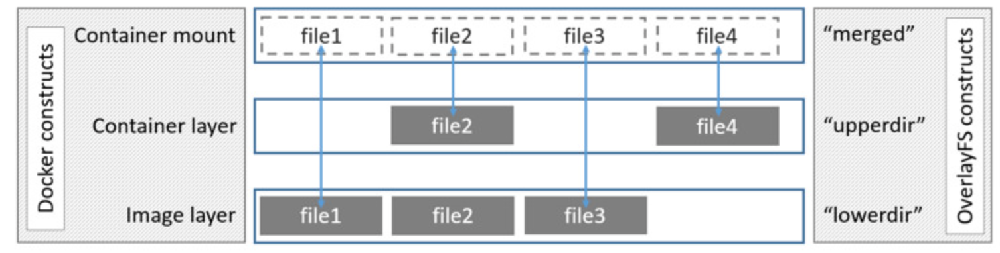

# 各种ID关系

layerID -> diffID -> chainID -> cacheID

layerID和diffID的对应关系在diffid-by-digest和v2metadata-by-diffid

chainID主要存在于/var/lib/docker/image/overlay2/layerdb/sha256/<chain-id>

cacheID主要存在于/var/lib/docker/overlay2/<cache-id>

## layerID

layerID是压缩数据的sha256的值（Distribution根据layer compressed data计算）

压缩的layer层的哈希值为layerID，即distribution hashes，如pull镜像时显示的Layer ID。注意pull下来的是压缩的数据。

## diffID

diffID是解压缩数据的sha256的值（本地由Docker根据layer uncompressed data计算）

如使用 docker [image] inspect nginx:latest，其中有一个RootFS的键值对，这里的rootfs layers的值就是diffID。

### layerID与diffID的映射关系

目录：docker/image/overlay2/distribution/下 

diffid-by-digest文件：digest(layerID) -> diffID

即distribution hashes和Content hashes的映射关系。也是正向查询。

v2metadata-by-diffid文件：diffid -> (digest, repository)

可以查找layer的digest及其所属的repository。也即是反向查询，可以从diffID->layerID（其实就是digest）

## chainID

layer.ChainID只用于本地，根据layer.diffID计算，**并用于layerdb的目录名称**

chainID唯一标识了一组diffID的hash值，包含了这一层和父层（底层）

chainID(layer0) = diffID(layer0)

chainID(layerN) = SHA256hex(chainID(layerN-1) + " " + diffID(layerN))

docker/image/overlay2/layerdb/sha256 目录下保存了所有的chainID，可以发现在对应镜像的inspect中，只有第一层diffID与第一层的chainID相同。另外该文件夹包含了**diff和cache-id**等信息

chainID计算

```shell
echo -n "sha256:chainID(layerN-1) sha256:diffID(layerN)" \
| sha256sum | awk '{print $1}'

# eg:
echo -n "sha256:2edcec3590a4ec7f40cf0743c15d78fb39d8326bc029073b41ef9727da6c851f sha256:e379e8aedd4d72bb4c529a4ca07a4e4d230b5a1d3f7a61bc80179e8f02421ad8" \
| sha256sum | awk '{print $1}'

```


## cacheID

cacheID的目录在 /var/lib/docker/overlay2/ 下。


# 镜像目录文件

Docker镜像是一个只读的容器模板，含有启动Docker容器所需的文件系统。Docker镜像的文件内容和一些运行容器的配置文件组成了Docker容器的文件系统运行环境——rootfs。

当使用docker pull下载一个nginx镜像后，可以在Docker的工作目录**/docker/image/overlay2** 下找到它的相关信息

## **docker/image/overlay2**

### **distribution**

#### diffid-by-digest/sha256

保存了**digest(layerID)->diffID**的映射关系

#### v2metadata-by-diffid/sha256

保存了**diffid -> (digest,repository)**的映射关系

**digest(layerID)**就是 pull 镜像时的 **hash ID**，拉取是 镜像层文件是压缩文件，压缩态

**diffid** 是 docker inspect 查看到的 镜像层 hash ID，此时 镜像层文件是解压缩的，解压缩态

### imagedb

保存镜像的元数据信息

#### content/sha256

镜像的**元数据信息**，包括**镜像架构、操作系统、默认配置、创建时间、历史信息和rootfs**等。

image元数据中layer的diffID是以底层到高层的顺序记录的

#### metadata/sha256

### layerdb

保存镜像层的关联关系

#### sha256

其下的目录名称是以layer的 **chainID** 来命名的，计算方式为：

1、如果layer是最底层，没有任何父layer，那么 **diffID = chainID**

2、否则，**chainID(n)=sha256sum(chainID(n-1)) diffID(n))**

各个chainID目录下：

1、cache-id

2、diff

3、parent

4、size

5、tar-split.json.gz

### repositories.json

registry 是镜像仓库，如官方的Docker Hub。而 repository 代表镜像组（比如不同版本的 nginx 镜像集合）

该文件描述了宿主机上所有镜像的repository元数据，主要包括镜像名、tag和镜像ID。

镜像ID是Docker采用SHA256算法，根据镜像元数据配置文件计算得出的。


# 容器

通过上面的分析得出，镜像是由多个layer组成的文件，并在容器启动时成为容器文件系统的运行环境——只读的rootfs。而容器其实就是Dokcer利用存储驱动在只读rootfs上挂载一个可读写层后的结果。

## 联合挂载

联合挂载技术可以在一个挂载点同时挂载多个文件系统，将挂载点的原目录与被挂载内容进行整合，使得最终可见的文件系统将会包含整合之后的各层的文件和目录。

Linux提供了一种叫做联合文件系统的文件系统，它具备如下特性：

1、联合挂载：将多个目录按层次组合，一并挂载到一个联合挂载点。

2、写时复制：对联合挂载点的修改不会影响到底层的多个目录，而是使用其他目录记录修改的操作。

目前有多种文件系统可以被当作联合文件系统，实现如上的功能：overlay2，aufs，devicemapper，btrfs，zfs，vfs等等。而overlay2就是其中的佼佼者，也是docker目前推荐的文件系统：[https://docs.docker.com/storage/storagedriver/select-storage-driver/](https://docs.docker.com/storage/storagedriver/select-storage-driver/)。

## OverlayFS

OverlayFS是一种堆叠文件系统，它依赖并建立在其它的文件系统之上（例如 ext4fs 和 xfs 等），并不直接参与磁盘空间结构的划分，仅仅将原来系统文件中的文件或者目录进行“合并一起”，最后向用户展示“合并”的文件时在同一级的目录，这就是联合挂载技术，相对于AUFS（<1.12早期使用的存储技术），OverlayFS速度更快，实现更简单。

Linux内核为Docker提供的OverlayFS驱动有两种：Overlay和Overlay2。而Overlay2是相对于Overlay的一种改进，在lnode利用率方面比Overlay更有效。但是Overlay有环境需求：Docker版本17.06.02+，宿主机文件系统需要时EXT4或XFS格式。

### OverlayFS实现方式

overlay2架构



它主要通过四类目录完成工作：

**lower**

底层文件系统。对于Docker来说，就是只读的镜像层；

**upper**

上层文件系统。对于Docker来说，就是可读写的容器层；

**merged**

是lowerdir和upperdir合并后的统一视图联合挂载点。对于Docker来说，就是用户视角下的文件系统；

**work**

工作基础目录，挂载后内容会被清空。用来存放挂载后的临时文件与间接文件。


## 容器实战

启动容器后，观察系统中overlay2类型的挂载情况

```shell
docker run -d -p 80:80 --name webserver nginx
# 查看overlay挂载情况
mount -t overlay
# 查看所有挂载情况
df -h
```
根据输出结果可以找到overlay2的挂载点位置。总结如下：
1、/var/lib/docker/overlay2/l 目录保存的是软链接文件，其文件名是避免使用mount命令时输出结果达到页面大小限制而生成的短名称。

2、容器会自动生成一层的以读写层cache-id-init命名的init-layer，其中的文件配置了容器的主机名，DNS服务等。（init后缀的文件夹）

3、overlay2将upper和lower的文件系统联合挂载，就得到了用户视角下的文件系统

容器的文件系统分为三层: - r/o层：也就是镜像层 - init层：启动容器时的参数 - r/w层：可读写层

```shell
docker/image/overlay2/layerdb/mounts/<container_full_id>下
init-id   # init层的id
mount-id  # r/w层的id
parent    # 基于哪个layer
```
这三个文件记录了在 /docker/overlay2/下的目录名
参考：[浅谈docker中镜像和容器在本地的存储](https://zhuanlan.zhihu.com/p/95900321)

```shell
mount -t overlay
cat /etc/mtab

mkdir /lower{1..3}
mkdir /upper /work /merged
mount -n -t overlay overlayfs:/overlay -o lowerdir=/lower1:/lower2:/lower3,upperdir=/upper,workdir=/worker /merged

mount | grep merged
# 在/upper目录中写入文件，在merged中可以显示
touch /upper/upper.txt
ls /merged/
# 在merged目录中写入文件，实际上是存储到了/upper
touch /merged/merged.txt
ls /upper/
# 如果没有upperdir，merged是只读的


cd /var/lib/docker/overlay2 
du -sc * | sort -rn  | more
```


# Docker数据导出实战

## 脚本

export-workspace.sh

```shell
#!/bin/sh
set -e
# set -x
get_docker_root() {
  if [ "$DOCKER_ROOT" != "" ]; then
    echo $DOCKER_ROOT
    exit 0
  fi
  local docker_root=$(docker info | grep "Docker Root Dir" | awk '{print $NF}')
  if [ "$docker_root" = "" ]; then
    docker_root="/var/lib/docker"
  fi
  echo $docker_root
}
get_container_id() {
  if [ "$ENVIRONMENT_ID" != "" ]; then
    local container_key=$ENVIRONMENT_ID
  else
    echo ""
    exit 0
  fi
  local container_id=$(docker ps | grep $container_key | awk '{print $1}')
  echo $container_id
}
get_container_merged_dir() {
  local container_id=$(get_container_id)
  if [ "$container_id" = "" ]; then
    echo "cannot find ENVIRONMENT_ID: $ENVIRONMENT_ID" >&2
    exit 1
  fi
  local container_merged_dir=$(docker inspect $container_id | grep UpperDir | awk '{print $NF}')
#  container_merged_dir=$(docker inspect $container_id | grep MergedDir | awk '{print $NF}')
  container_merged_dir=$(echo ${container_merged_dir#\"})
  container_merged_dir=$(echo ${container_merged_dir%\"*})
  echo $container_merged_dir
}
get_container_full_id_by_name() {
  local docker_root=$1
  local name_key=$2
  local container_path="$docker_root/containers"
  if ! test -d $container_path  > /dev/null 2>&1; then
    echo "$container_path is not existed" >&2
    exit 1
  fi
  if ! type "jq" > /dev/null 2>&1; then
    sudo apt-get install -y jq > /dev/null
  fi
  local container_full_ids=""
  cd $container_path
  for f in ./*
  do
    if test -d $f ; then
      if cat "$f/config.v2.json" | jq . | grep "Name" | grep -qs $ENVIRONMENT_ID ; then
        local cur_full_id=$(echo ${f##*/})
        echo "cur_full_id: $cur_full_id" >&2
        container_full_ids="$container_full_ids;$cur_full_id"
      fi
    fi
  done
  echo $container_full_ids | cut -c 2-  # rm prefix ;
}
get_container_full_id_by_id() {
  local docker_root=$1
  local container_id=$2
  local container_path="$docker_root/containers"
  if ! test -d $container_path  > /dev/null 2>&1; then
    echo "$container_path is not existed" >&2
    exit 1
  fi
  cd $container_path
#  local container_full_ids=$(ls -al | grep $container_id | awk '{print $NF}')
  local container_full_ids=$(ls -al | grep $container_id | awk '{print $NF}' | xargs | sed 's/ /;/g')  # 变一行
  echo $container_full_ids
}
get_container_mount_dir() {
  # 1.get docker_root
  local docker_root=$(get_docker_root)
  # 2.get container_full_id
  if [ "$CONTAINER_ID" != "" ]; then
    # 2.1
    container_full_ids=$(get_container_full_id_by_id $docker_root $CONTAINER_ID)
    echo "get_container_full_id_by_id container_full_ids: $container_full_ids" >&2  # todo
  elif [ "$ENVIRONMENT_ID" != "" ]; then
    # 2.2 list container
    local container_full_ids=$(get_container_full_id_by_name $docker_root $ENVIRONMENT_ID)
    echo "get_container_full_id_by_name container_full_ids: $container_full_ids" >&2  # todo
  else
    echo "ENVIRONMENT_ID and CONTAINER_ID is empty" >&2
    exit 1
  fi
  local container_full_id_count=$(echo $container_full_ids | awk -F";" '{print NF}')
  echo "count: $container_full_id_count" >&2  # todo
  if [ $container_full_id_count -gt 1 ]; then
    echo "there are multiple container: $container_full_ids" >&2
    exit 1
  fi
  local container_full_id=$container_full_ids  # just one
  # 3. mount_id
  local mount_id=$(cat "$docker_root/image/overlay2/layerdb/mounts/$container_full_id/mount-id")
  # 4. mount_idr
  local mount_dir="$docker_root/overlay2/$mount_id/diff"
  echo $mount_dir
}
export_workspace() {
  local container_id=$(get_container_id)
  if [ "$DIR_MODE" != "" ] || [ "$CONTAINER_ID" != "" ]; then
    local container_diff_dir=$(get_container_mount_dir)
  elif [ "$container_id" != "" ]; then
    local container_diff_dir=$(get_container_merged_dir)
  else
    local container_diff_dir=$(get_container_mount_dir)
  fi
  if [ "$container_diff_dir" = "" ]; then
    exit 1
  fi
  local container_user_dir="$container_diff_dir/home/$USER_NAME"
  echo "user_home: $container_user_dir"
  if ! test -d $container_user_dir; then
    echo "user name err: $USER_NAME in $container_user_dir" >&2
    exit 1
  fi
  cd $container_user_dir
  curTime=$(date +"%Y-%m-%d_%H-%M-%S")
  tar_workspace_path="$TMP_PATH/byte-ide-${ENVIRONMENT_ID}_$curTime.tar.gz"
  local dist="workspace"
  if [ "$DIST_PATH" != "" ]; then
    local dist="$dist/$DIST_PATH"
  fi
  if [ "$EXCLUDE_DIR" != "" ]; then
    local exclude_dir="$dist/$EXCLUDE_DIR"
    tar -zcf $tar_workspace_path --exclude=$exclude_dir $dist
  else
    tar -zcf $tar_workspace_path $dist
  fi
  if test -f $tar_workspace_path; then
    echo "start download $tar_workspace_path"
    sz $tar_workspace_path || true
    rm $tar_workspace_path || true
  fi
}
check_params() {
  if [ "$USER_NAME" = "" ]; then
    echo "USER_NAME is empty" >&2
    exit 1
  fi
  if [ "$CONTAINER_ID" = "" ] && [ "$ENVIRONMENT_ID" = "" ] ; then
    echo "ENVIRONMENT_ID and CONTAINER_ID is empty" >&2
    exit 1
  fi
}
DOCKER_ROOT=${DOCKER_ROOT:-""}
TMP_PATH=${TMP_PATH:-/tmp}
USER_NAME=${USER_NAME:-""}
DIR_MODE=${DIR_MODE:-""}
CONTAINER_ID=${CONTAINER_ID:-""}
ENVIRONMENT_ID=${ENVIRONMENT_ID:-""}
DIST_PATH=${DIST_PATH:-""}
EXCLUDE_DIR=${EXCLUDE_DIR:-""}

## err log
#TMP_ERR_LOG=$(mktemp)
check_params
export_workspace
```
## 使用示例

```shell
# 本地使用
sudo ENVIRONMENT_ID=12345 USER_NAME=zhangsan DIST_PATH=apollo_sort EXCLUDE_DIR=output sh export_workspace.sh
# 远程使用
sudo curl -s http://xxx/export-workspace.sh | ENVIRONMENT_ID=12345 USER_NAME=zhangsan DIST_PATH=apollo_sort EXCLUDE_DIR=output sh
```
# Reference

[docker中各ID之间的关系和计算](https://blog.csdn.net/u010566813/article/details/117783220?spm=1001.2014.3001.5502)

[https://www.keepnight.com/archives/336/](https://www.keepnight.com/archives/336/)

[https://juejin.cn/post/6844903574137208839](https://juejin.cn/post/6844903574137208839)

[https://www.cnblogs.com/wdliu/p/10483252.html](https://www.cnblogs.com/wdliu/p/10483252.html)

[官方文档：使用 OverlayFS 存储驱动程序](https://docs.docker.com/storage/storagedriver/overlayfs-driver)

[手撕docker文件结构 —— overlayFS，image，container文件结构详解](https://zhuanlan.zhihu.com/p/374924046)
