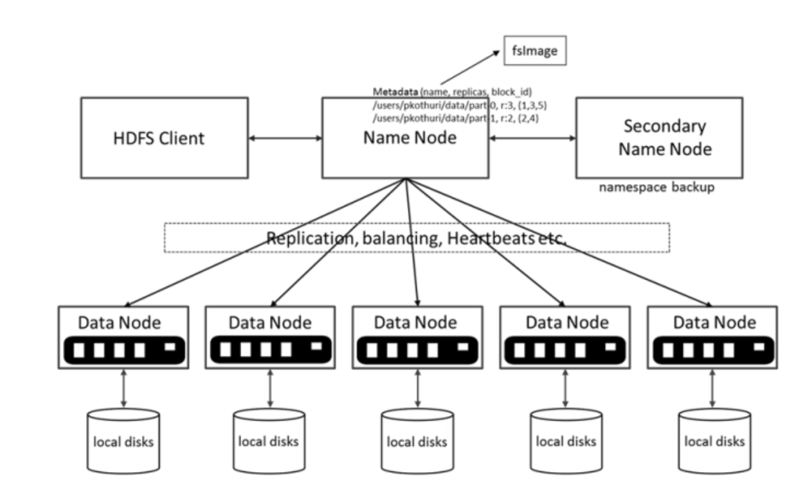
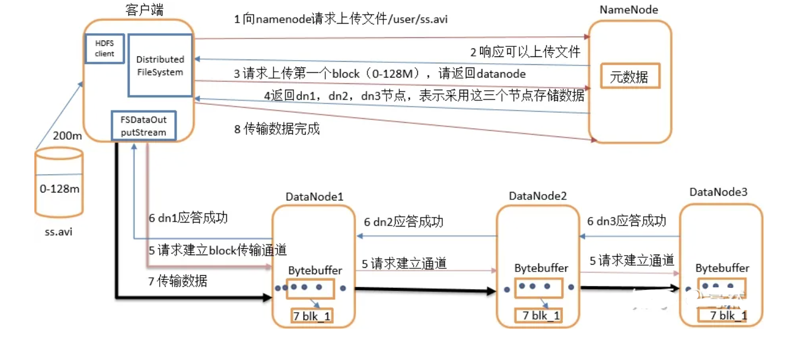
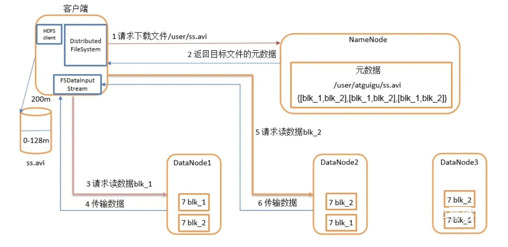
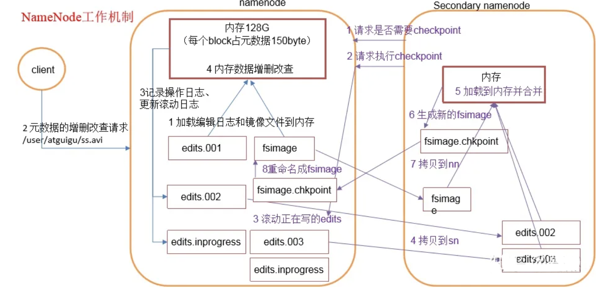

# 简介

## 介绍

Hadoop Distributed File System（简称 HDFS）是一个分布式文件系统。HDFS 有着高容错性（fault-tolerent）的特点，并且设计用来部署在低廉的（low-cost）硬件上。而且它提供高吞吐量（high throughput）来访问应用程序的数据，适合那些有着超大数据集（large data set）的应用程序。HDFS 放宽了（relax）POSIX 的要求（requirements）这样可以实现流的形式访问（streaming access）文件系统中的数据。HDFS 开始是为开源的 apache 项目 nutch 的基础结构而创建，HDFS 是 hadoop 项目的一部分，而 hadoop 又是 lucene 的一部分。

## 发展历史

Lucene其实是一个提供全文文本搜索的函数库，它不是一个应用软件。它提供很多API函数，是一个开放源代码的全文检索引擎工具包，让你可以运用到各种实际应用程序中。它提供了完整的查询引擎和索引引擎以及部分的文本分析功能。Lucene的目的是为软件开发人员提供一个简单易用的工具包，以方便的在目标系统中实现全文检索的功能，或者是以此为基础建立起完整的全文检索引擎。

Nutch是一个建立在Lucene核心之上的Web搜索的实现，它是一个真正的应用程序。可以直接下载使用。它在Lucene的基础上加了网络爬虫和一些和Web相关的内容。其目的就是想从一个简单的站内索引和搜索推广到全球网络的搜索上，就像Google和Yahoo一样。Nutch 中还包含了一个分布式文件系统用于存储数据。从 Nutch 0.8.0 版本之后，Doug Cutting 把 Nutch 中的分布式文件系统以及实现 MapReduce 算法的代码独立出来形成了一个新的开源项 Hadoop。Nutch 也演化为基于 Lucene 全文检索以及 Hadoop 分布式计算平台的一个开源搜索引擎。

## 应用场景

# 名词解释

**Hadoop**：一个分布式系统基础架构，由Apache基金会开发。用户可以在不了解分布式底层细节的情况下，开发分布式程序。充分利用集群的威力高速运算和存储。

**Distributed**：分布式计算是利用互联网上的计算机的 CPU 的共同处理能力来解决大型计算问题的一种计算科学。

**File system**：文件系统是操作系统用于明确磁盘或分区上的文件的方法和数据结构；即在磁盘上组织文件的方法。也指用于存储文件的磁盘或分区，或文件系统种类。

# 架构

架构主要由四个部分组成，分别为HDFS Client、NameNode、DataNode和Secondary NameNode。下面分别介绍这四个组成部分。

## HDFS Client

和 HDFS 打交道是通过客户端，无论读取一个文件或者写一个文件，都是把数据交给 HDFS client，它负责和 Name nodes 以及 Data nodes 联系并传输数据。

主要功能如下：

* 文件切分。文件上传 HDFS 时，将文件切分成一个一个的 Block，然后进行存储；
* 与 NameNode 交互，获取文件的位置信息；
* 与 DataNode 交互，读取或者写入数据；
* Client 提供一些命令来管理 HDFS，比如启动或者关闭HDFS；
* Client 可以通过一些命令来访问 HDFS；
## NameNode

也就是Master，它是一个管理者。

主要功能如下：

* 管理 HDFS 的名称空间；
* 处理客户端读写请求
* 管理 DataNode 回报的数据块（Block）映射信息；
* 配置副本策略。
## DataNode

可以理解为 Slave。DataNode 是 Block 真正存储的地方。DataNode的本地磁盘以文件形式存储着Block信息。同时还存储着Block的元数据信息文件。元数据主要存储MD5值用来进行验证

HDFS在启动时，DataNode 会向 NameNode汇报 block的信息。

DataNode通过向NameNode发送心跳保持与其联系（3秒一次），如果 NameNode 10 分钟没有收到 DataNode 的心跳，则认为其已经 lost，并复制其上的 block 到其它 DataNode。

主要功能如下：

* 存储实际的数据块；
* 执行数据块的读/写操作。
## SecondaryNameNode

并非NameNode的热备。当 NameNode 挂掉时，并不能马上替换NameNode并提供服务。备用NameNode 通常在与 主NameNode 不同的计算机上运行，它的内存要求与 主NameNode 的相同。

主要功能如下：

* 辅助NameNode，分担其工作量；
>启动备用 NameNode 时，会从映像文件 fsimage 中读取 HDFS 状态，然后启用“编辑日志文件”对它进行编辑。然后将新的HDFS状态写入fsimage，并使用“空编辑文件”启动正常操作。

* 定期合并 Fsimage 和 Edits，并推送给 NameNode；
>由于 NameNode 只在启动时合并 fsimage 和编辑文件，随着时间推移，“编辑日志文件”会变得非常大。导致在下次重新启动 NameNode 时需要花费更长的时间。备用NameNode 定期合并 fsimage 和“编辑日志文件”，并将“编辑日志文件”的大小保持在限定范围内。减少 NameNode 启动时间

* 紧急情况下，可辅助恢复NameNode。
## 物理拓扑

至少分为三层：

* 顶层交换机
* 机架
* 服务器
hdfs具备机架感知，可以感知集群的物理拓扑，因此在数据副本放置的时候可以根据物理拓扑进行分配，同时能够为用户就近选择读写的datanode节点。

# 数据分布

## 副本分布

hdfs拓扑模块具备机架感知功能，这个功能好处在于能够让client从最近的存储节点读数据，也能够在数据副本复制的时候按照从近到远的方式复制，提升总体带宽，同时也能够使副本放置尽可能合理，从而提高数据可靠性。 数据副本放置策略对于数据的可靠性、读写性能、可用性影响较大。

 hdfs数据副本在client请求新的Block时由NameNode确定其存放在哪些DataNode节点，hdfs默认的副本分配方式是将第一个副本放置在离client最近的DataNode节点，其他两个副本放在不同的机架上。在充分保证读写性能的同时尽可能的保证最大的可靠性和可用性。 hdfs的副本放置可以总结为两点:

1. 一个DataNode上不会出现一个Block的两个副本；
2. 一个机架上不会存储一个Block的三个及以上的副本（前提：机架数量充足）。
## 副本管理

hdfs的副本管理粒度是以Block为单位的，Block大小为128MB（hadoop 1.x都是64MB，hadoop 2.x都是128MB），如果副本数量为3，那么一个Block就至少需要BlockID + 3*DataNodeID这样大小的元数据，这与当前很多流行的分布式系统设计是不一样的，比如tikv，其副本管理单位是一个raft group，这个raft group管理多个block，通常一个raft group管理的数据量大小在数十G规模。这也是目前很多分布式系统常用的副本管理方式。 hdfs的Block是动态创建的，client向NameNode申请新的block，NameNode会分配一个新的BlockID并为这个Block分配三个DataNode节点，用作副本存放。

# 数据一致性

hdfs只支持一写多读模式，这种模式简化了数据一致性的设计，因为不需要在client之间同步写入状态了，cephfs支持多写多读，其多个client之间的状态同步比较复杂。 另外hdfs的文件只支持追加写入，这同样有利于数据一致性的设计实现，当然这种只支持追加写的模式也是与其应用场景相结合的。同时仅支持追加写对于带宽也是友好的。

## 数据复制

hdfs的数据复制以pipeline方式进行，数据从client发到与其最近的DataNode节点，然后由第一个DataNode节点复制给第二个DataNode节点，这样以此类推，每个package的ack按照复制方向的反方向流动，最终返回给client。

## 写数据一致性

hdfs保证同一时间只有一个client可以写文件，同时可见性只是在文件close和用户显示调用flush的时候。如果只是正常的写入返回并不保证写入的数据对用户可见，这个与文件创建时其配置有一定关系，具体可参考[what's the HDFS writing consistency](https://zhuanlan.zhihu.com/p/102474646/edit#https://stackoverflow.com/questions/37533600/whats-the-hdfs-writing-consistency)。

## 读数据一致性

对于同一个client，hdfs保证“read your write”一致性语义，实现方式主要是通过记录client的写状态ID，在执行读请求时会携带这个ID，这个ID会发给NamaNode，由NameNode保证在允许其读请求执行之前其写请求已经被执行。 对于多个client，hdfs提供msync调用，在读取非自身写的时候，先执行msync，msync会刷新NameNode上其自身的状态ID，使其ID保持最新状态，能够读到其他client写入的最新数据。

# 工作流程

## 写数据过程

1. 客户端通过 Distributed FileSystem 模块向 NameNode 请求上传文件，NameNode 检查目标文件是否已存在，父目录是否存在。
2. NameNode 返回是否可以上传。
3. 客户端请求第一个 block 上传到哪几个 datanode 服务器上。
4. NameNode 返回 3 个 datanode 节点，分别为 dn1、dn2、dn3。
5. 客户端通过 FSDataOutputStream 模块请求 dn1 上传数据，dn1 收到请求会继续调用 dn2，然后 dn2 调用 dn3，通信管道建立完成。
6. dn1、dn2、dn3 逐级应答客户端。
7. 客户端开始往 dn1 上传第一个block（先从磁盘读取数据放到一个本地内存缓存），以 packet 为单位，dn1 收到一个 packet 就会传给 dn2，dn2 传给 dn3；dn1 每传一个packet 会放入一个应答队列等待应答。
8. 当一个block传输完成之后，客户端再次请求NameNode上传第二个block的服务器。（重复执行3-7步）。
## 读数据过程

1. 客户端通过 Distributed FileSystem 向 NameNode 请求下载文件，NameNode 通过查询元数据，找到文件块所在的DataNode地址。
2. 挑选一台 DataNode（就近原则，然后随机）服务器，请求读取数据。
3. DataNode 开始传输数据给客户端（从磁盘里面读取数据输入流，以 packet 为单位来做校验）。
4. 客户端以 packet 为单位接收，先在本地缓存，然后写入目标文件。
## Second NameNode工作机制

第一阶段：NameNode启动

1. 第一次启动NameNode格式化后，创建fsimage和edits文件。如果不是第一次启动，直接加载编辑日志和镜像文件到内存。
2. 客户端对元数据进行增删改的请求。
3. NameNode记录操作日志，更新滚动日志。
4. NameNode在内存中对数据进行增删改查。
第二阶段：Secondary NameNode工作

1. Secondary NameNode询问NameNode是否需要checkpoint。直接带回NameNode是否检查结果。
2. Secondary NameNode请求执行checkpoint。
3. NameNode滚动正在写的edits日志。
4. 将滚动前的编辑日志和镜像文件拷贝到Secondary NameNode。
5. Secondary NameNode加载编辑日志和镜像文件到内存，并合并。
6. 生成新的镜像文件fsimage.chkpoint。
7. 拷贝fsimage.chkpoint到NameNode。
8. NameNode将fsimage.chkpoint重新命名成fsimage。

