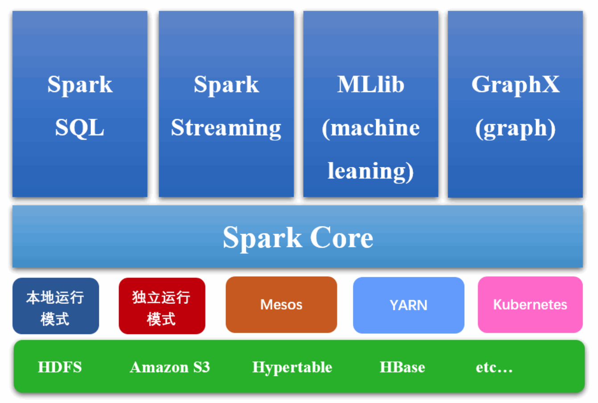
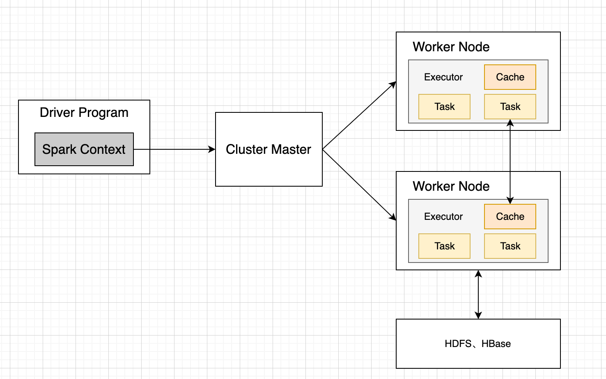

# 概述

Spark 是 UC Berkeley AMP Lab 开源的通用分布式并行计算框架，目前已成为 Apache 软件基金会的顶级开源项目。Spark 支持多种编程语言，包括 Java、Python、R 和 Scala，同时 Spark 也支持 Hadoop 的底层存储系统 HDFS，但 Spark 不依赖 Hadoop。

# Spark优势

* 高效性
Spark 比 MapReduce 快100倍。

    * Spark基于内存存储中间计算结果，减少了中间结果写入磁盘的IO和不必要的sort、shuffle
    * Spark对于反复用到的数据进行了缓存
    * Spark通过并行计算DAG图的优化，具体在于Spark划分了不同的stage，减少了不同任务之间的依赖，使用延迟计算技术降低了延迟等待时间
* 易用性
不同于MapReduce仅支持Map和Reduce两种编程算子，Spark提供了超过80种不同的Transformation和Action算子，如map、reduce、filter、groupByKey、sortByKey、foreach等，并且采用函数式编程风格，实现相同的功能需要的代码量极大缩小。

* 通用性
Spark提供了统一的解决方案。Spark可以用于批处理、交互式查询（Spark SQL）、实时流处理（Spark Streaming）、机器学习（Spark MLlib）和图计算（GraphX）。这些不同类型的处理都可以在同一个应用中无缝使用。

* 兼容性
Spark能够跟很多开源工程兼容使用。如Spark可以使用Hadoop的YARN和Apache Mesos作为它的资源管理和调度器，并且Spark可以读取多种数据源，如HDFS、HBase、MySQL等。

# Spark基本概念

Spark是一种基于内存的快速、通用、可扩展的大数据分析计算引擎

**RDD**：是弹性分布式数据集（Resilient Distributed Dataset）的简称，是分布式内存的一个抽象概念，提供了一种高度受限的共享内存模型。

**DAG**：是Directed Acyclic Graph（有向无环图）的简称，反映RDD之间的依赖关系。

**Driver Program**：控制程序，负责为Application构建DAG图。

**Cluster Manager**：集群资源管理中心，负责分配计算资源。

**Worker Node**：工作节点，负责完成具体计算。

**Executor**：是运行在工作节点（Worker Node）上的一个进程，负责运行Task，并为应用程序存储数据。

**Application**：用户编写的Spark应用程序，一个Application包含多个Job。

**Job**：作业，一个Job包含多个RDD及作用于相应RDD上的各种操作。

**Stage**：阶段，是作业的基本调度单位，一个作业会分为多组任务，每组任务被称为“阶段”。

**Task**：任务，运行在Executor上的工作单元，是Executor中的一个线程。

Application由多个Job组成，Job由多个Stage组成，Stage由多个Task组成。Stage是作业调度的基本单位。

## RDD

RDD（Resilient Distributed Dataset）是Spark中最基础的数据结构之一，它是一个可分区、可并行操作、容错的数据集合，可以跨集群进行分布式计算。RDD的每个分区存储在不同的节点上，且每个分区都可以被处理器并行计算，以实现分布式计算的目的。

## DataFrame

DataFrame是Spark SQL中的一种数据结构，是一个带有命名列的分布式数据集合。与RDD不同，DataFrame具有模式（Schema）信息，可以用于结构化数据的处理和分析。DataFrame也支持类似SQL的查询操作，可以通过Spark SQL或DataFrame API进行操作。

## DataSet

Dataset是Spark 1.6版本中引入的一种数据结构，是DataFrame的强类型版本。与DataFrame不同，Dataset具有编译时类型检查和类型安全性，并且可以通过Scala和Java中的Lambda表达式进行操作。Dataset既可以像DataFrame一样进行结构化数据处理，也可以像RDD一样进行函数式编程。

# Spark核心模块




## SparkCore

SparkCore中提供了Spark最基础与最核心的功能, Spark其他的功能如: SparkSQL,  SparkStreaming, GraphX, MLlib# 8276SparkCore的基础上进行扩展的

## SparkSQL

SparkSQLJSparkFICHE(EzeFa(CSRAMAAiitSparkSQL, 用户可以使用SQL或者ApacheHive版本的SQL方言(HQL) 来查询数据。

## SparkStreaming

SparkStreaming是Spark平台上针对实时数据进行流式计算的组件, 提供了丰富的处理

数据流的API。

## SparkMLlib

MLlib是Spark中用于机器学习的组件，它包括了许多常见的机器学习算法和工具，如分类、回归、聚类、降维等。MLlib的算法可以处理大规模的数据集合，并且可以通过RDD、DataFrame和Dataset进行操作。

# Spark架构设计

## 整体架构

Spark集群由以下部分组成：

* Driver
* Cluster Manager（Standalone,Yarn 或 Mesos）
* Worker Node
对于每个Spark应用程序，Worker Node上存在一个Executor进程，Executor进程中包括多个Task线程。




# Spark核心流程

## 启动流程

启动Spark时，Spark将经历以下步骤：

1. Spark应用程序的入口点是Spark的驱动程序。驱动程序是一个包含main函数的JVM进程。当驱动程序运行时，它创建一个SparkContext对象。这个对象是与Spark集群通信的主要途径，它包含了所有集群的配置信息。
2. SparkContext对象与集群管理器通信，并请求资源来执行Spark应用程序。集群管理器可以是Standalone、YARN或Mesos。当SparkContext向集群管理器发出请求时，它将分配给应用程序一个或多个执行器进程。
3. 执行器进程启动后，它们将向SparkContext注册，并等待接收任务。当Spark应用程序运行时，SparkContext将根据需要将任务发送给执行器进程。
4. 在运行期间，Spark应用程序将创建RDD（Resilient Distributed Datasets）并对它们执行操作。RDD是Spark的核心抽象，它是一个分布式的、可缓存的、不可变的数据集合。应用程序可以从文件、Hive表、数据库或内存数据结构等数据源创建RDD，然后对它们执行各种转换操作（如map、filter、reduceByKey等）以生成新的RDD。
5. 应用程序也可以将RDD存储到磁盘上，以便在以后的运行中重复使用。Spark支持不同类型的存储系统，包括HDFS、S3、Cassandra、HBase等。
6. 当应用程序完成时，SparkContext将释放资源并关闭执行器进程。应用程序也可以手动停止SparkContext来终止应用程序。
## 执行流程

Apache Spark是一个用于分布式数据处理的计算引擎，其执行流程主要包括以下步骤：

1. 应用程序创建SparkContext对象：应用程序通过创建SparkContext对象来连接到Spark集群。SparkContext对象充当与集群交互的主要接口。
2. 读取数据并创建RDD：Spark将数据读入内存中，并将其表示为弹性分布式数据集(RDD)。RDD是Spark中的基本数据结构，它允许数据在集群中的多个节点之间进行分布式处理。
3. 转换RDD：应用程序可以对RDD进行转换，以执行各种操作。转换操作是惰性的，这意味着它们只有在执行操作时才会被计算。
4. 缓存RDD：Spark支持将RDD缓存在内存中，以便反复使用。缓存可以提高性能，因为它可以减少I/O和计算开销。
5. 执行操作：当应用程序调用操作时，Spark将转换操作应用于RDD，并在集群中的多个节点上执行计算。Spark使用任务来执行计算，并将任务分发给集群中的多个节点。
6. 保存结果：一旦计算完成，应用程序可以将结果保存到磁盘或将其返回给驱动程序。
总之，Spark的执行流程涉及将数据加载到内存中，并使用RDD进行转换和操作，最终将结果保存到磁盘或返回给驱动程序。Spark执行计算时利用集群中多个节点的并行计算能力，从而实现高性能和高可伸缩性。

## Shuffle

在Spark中，Shuffle是指将RDD（Resilient Distributed Dataset）中的数据重新分区，以便在不同节点上进行数据聚合或计算的过程。Shuffle操作是一种非常耗时和开销大的操作，因为它需要将数据从不同节点的Task中读取、序列化、写入磁盘、再从磁盘读取、反序列化等过程。

Spark中的Shuffle可以分为两种类型：

1. 基于Hash的Shuffle：使用Hash函数将Key相同的记录映射到同一个分区中。由于Hash函数的随机性，Hash Shuffle通常可以比较好地实现数据的均衡分布。
2. 基于Sort的Shuffle：使用Key值进行排序，将Key相同的记录分配到同一个分区中。由于Sort Shuffle需要先进行排序，因此其开销一般会比Hash Shuffle更高。
Spark Shuffle操作可以发生在多个阶段，包括Map端Shuffle和Reduce端Shuffle：

1. Map端Shuffle：在Map阶段，Shuffle操作是通过将Mapper任务的输出数据分区、排序、写入磁盘，再由Reduce任务读取磁盘上的分区文件进行Reduce操作。
2. Reduce端Shuffle：在Reduce阶段，Shuffle操作是通过将Mapper任务的输出数据写入内存中的缓冲区，当缓冲区达到一定的大小时，将缓冲区中的数据分区、排序、写入磁盘，最后由Reduce任务读取磁盘上的分区文件进行Reduce操作。
为了减少Shuffle操作的开销，Spark提供了一些优化方法，包括：

1. 使用CombineByKey或reduceByKey等算子，在Map端进行局部聚合，减少Reduce端Shuffle的数据量。
2. 使用Spark SQL的DataFrame或Dataset API，尽量使用Spark的内置优化，减少Shuffle的开销。
3. 调整Spark SQL的shuffle分区数，适当增大shuffle分区数可以减少数据倾斜的问题。
4. 将需要缓存的RDD或DataFrame先进行缓存，避免多次计算时导致Shuffle的开销。
综上所述，Shuffle是Spark中一个重要的操作，其开销很大，需要谨慎使用。针对具体的应用场景和需求，可以采用不同的优化策略来减少Shuffle的开销。

## 数据倾斜

Spark数据倾斜是指在数据分布不平衡的情况下，某些节点的数据处理时间远远长于其他节点，导致整个Spark应用程序的执行时间变慢。解决Spark数据倾斜的常见方法包括以下几个方面：

1. 了解数据分布情况：首先需要了解数据分布的情况，通过查看数据的Key分布情况、数据大小、数据来源等信息，以及对任务进行Profile和监控，可以快速定位数据倾斜的问题。
2. 重新分区：对于数据倾斜的情况，可以考虑重新分区，使得数据均匀分布在多个分区中，可以使用repartition或coalesce函数重新分区。
3. 增加shuffle操作的并行度：对于包含shuffle操作的任务，可以增加其并行度，使得数据可以更均匀地分布到不同的节点上。可以通过调整spark.sql.shuffle.partitions参数来控制shuffle操作的并行度。
4. 使用随机前缀：对于Key值分布不均的情况，可以使用随机前缀的方式来将数据打散到不同的分区中。通过增加随机前缀可以使得原本的Key值发生变化，从而均匀分布在不同的分区中。
5. 增加缓存：对于一些常用的RDD或DataFrame，可以将其缓存起来，避免多次计算导致数据倾斜。缓存操作可以使用persist或cache函数。
6. 使用广播变量：对于一些较小的数据集，可以使用广播变量将其广播到所有节点上，避免在每个节点上都重新计算一遍。广播变量可以使用broadcast函数。
7. 使用动态调整算子：对于部分RDD数据倾斜的情况，可以使用动态调整算子，将数据分散到多个节点上进行处理。可以使用zipWithIndex函数实现动态调整算子。
综上所述，Spark数据倾斜的解决方法主要包括重新分区、增加shuffle操作的并行度、使用随机前缀、增加缓存、使用广播变量、使用动态调整算子等。针对具体问题，需要根据具体情况采用不同的解决方法。

# RDD

Spark将数据保存分布式内存中，对分布式内存的抽象理解，提供了一个高度受限的内存模型，RDD在逻辑上集中，物理上存储在集群的多台机器上。

## 特点

RDD的特点包括：

1. 弹性：RDD具有容错性，如果某个节点宕机，Spark可以根据RDD的依赖关系重新计算该节点上的数据，从而保证了程序的健壮性。
2. 分区：RDD将数据集合按照一定规则进行分区，以便并行处理，不同的分区可以被不同的计算节点处理。
3. 延迟计算：RDD采用延迟计算的方式，只有在需要计算结果时才会进行真正的计算，这可以有效地减少不必要的计算开销。
4. 缓存：Spark可以将RDD缓存在内存中，避免重复计算，提高计算效率。
5. 支持多种数据源：RDD支持多种数据源，包括本地文件系统、Hadoop文件系统、HBase、Cassandra等。
在Spark中，RDD是一种不可变的数据结构，意味着一旦创建就不能被修改，只能通过转换操作生成新的RDD。RDD的操作可以分为两类：转换操作和行动操作。转换操作是指对RDD进行某些计算，生成新的RDD，但并不会立即执行，只有在行动操作被调用时才会执行计算。行动操作是指触发RDD计算并返回结果的操作，如count、collect、reduce等。

总之，RDD是Spark中非常重要的一种数据结构，它可以实现分布式的数据处理，并具有容错性、弹性、延迟计算等特点。熟练掌握RDD的使用可以帮助我们更好地进行分布式计算。

## 创建方式

RDD可以由两种方式创建：

1. 从已有数据集合（如Hadoop文件、本地文件、数据库等）创建，可以通过SparkContext的textFile等函数创建。如：使用程序中的集合创建、使用本地文件系统创建、使用hdfs创建、基于数据库db创建、基于Nosql创建（如hbase）、基于s3创建、基于数据流（如socket创建）
2. 通过转换已有的RDD，生成新的RDD，可以通过Map、Filter、GroupBy等函数进行操作。
## 特征

* 由一系列parition组成
RDD来说，每个分片都会被一个计算任务处理，并决定并行计算的粒度。用户可以在创建RDD时指定RDD的分片个数，如果没有指定，那么就会采用默认值。默认值就是程序所分配到的CPU Core的数目。

* 算子（函数）是作用在partition上
Spark中RDD的计算是以分片为单位的，每个RDD都会实现compute函数以达到这个目的。compute函数会对迭代器进行复合，不需要保存每次计算的结果。

* RDD之间有依赖关系
RDD的每次转换都会生成一个新的RDD，所以RDD之间就会形成类似于流水线一样的前后依赖关系。当部分分区数据丢失时，Spark可以通过这个依赖关系重新计算丢失的分区数据，而不是对RDD的所有分区进行重新计算。

* 分区器作用在KV格式的RDD上
Spark中实现了两种类型的分片函数，一个是基于哈希的HashPartitioner，另外一个是基于范围的RangePartitioner。只有对于于key-value的RDD，才会有Partitioner，非key-value的RDD的Parititioner的值是None。Partitioner函数不但决定了RDD本身的分片数量，也决定了parent RDD Shuffle输出时的分片数量。

* Partition提供数据最佳的计算位置，有利于数据处理的本地化。
对于一个HDFS文件，列表保存的是每个Partition所在块的位置。按照“移动数据不如移动计算”的理念，Spark在任务调度时，会尽可能将计算任务分配到其所要处理数据块的存储位置。

## 窄依赖和宽依赖

窄依赖（一对一）：没有数据的shuffling，所有的父RDD的partition会一一映射到子RDD的partition中

宽依赖（一对多）：发生数据的shuffling，父RDD中的partition会根据key的不同进行切分，划分到子RDD中对应的partition中

# Spark部署模式

Spark作为一个数据处理框架和计算引擎，被设计在所有常见的集群环境中运行，在国内工作中主流的环境为Yarn，不过逐渐容器式环境也慢慢流行起来。

## Local模式

想啥呢, 你之前一直在使用的模式可不是Local模式哟。所谓的Local模式, 就是不需要其他任何节点资源就可以在本地执行麓F代码的坏境，一般用于教学, 调试, 演示等, 之前在IDEA中运行代码的环境我们称之为开发环境, 不太一样。

### 解压缩文件

将spark-3.0.0-bin-hadoop3.2.tgz文件上传到Linux并解压缩, 放置在指定位置。

```shell
tar -zxvf spark-3.0.0-bin-hadoop3.2.tgz -C /opt/module
cd /opt/module
mv spark-3.0.0-bin-hadoop3.2 spark-local
```
### 启动Local环境

进入解压缩后的路径，执行如下命令

```shell
bin/spark-shell
```
### 提交应用

```shell
bin/spark-submit --class org.apache.spark.examples.SparkPi --master local[2] ./examples/jars/spark-examples_2.12-3.0.0.jar 10
```

## Standalone模式

local本地模式毕竟只是用来进行练习演示的, 真实工作中还是要将应用提交到对应的集群中去执行, 这里我们来看看只使用Spark自身节点运行的集群模式, 也就是我们所谓的独立部署(Standalone) 模式。Spark的Standalone模式体现了经典的mastel-slave模式。

集群规划: 

|    |Linux1|Linux2|Linux3|
|:----|:----|:----|:----|
|Spark|Worker   Master|Worker|Worker|

### 解压缩文件

将spark-3.0.0-bin-hadoop3.2.tgz文件上传到Linux并解压缩, 放置在指定位置。

```shell
tar -zxvf spark-3.0.0-bin-hadoop3.2.tgz -C /opt/module
cd /opt/module
mv spark-3.0.0-bin-hadoop3.2 spark-standalone
```
### 修改配置文件

1）进入解压缩路径的conf目录，修改salves.tempalte文件名为slaves

```shell
mv slaves.template slaves
```
2）修改slaves文件，添加work节点
```xml
linux1
linux2
linux3
```
3）修改spark-env.sh.template文件名为spark-env.sh
```shell
mv spark-env.sh.template spark-env.sh
```
4）修改spark-env.sh文件，添加JAVA_HOME环境变量和集群对应的master节点
```xml
export JAVA_HOME=/opt/mudule/jdk1.8.0_144
SPARK_MASTER_HOST=linux1
SPARK_MASTER_PORT=7077
```
注意：7077端口，相当于hadoop3内部通信的8020端口，此处的端口需要确认自己的Hadoop配置
5）分发spark-standalone目录

```shell
xsync spark-standalone
```
### 启动集群

1）执行命令

```shell
sbin/start-all.sh
```
2）查看三台服务器运行进行
```shell
xcall jps
```
3）查看Master资源监控Web UI界面：[http://linux1](http://linux1：8080):8080
### 提交应用

```shell
bin/spark-submit --class org.apache.spark.examples.SparkPi --master spark://linux1:7077 ./examples/jars/spark-examples_2.12-3.0.0.jar 10
```

## Yarn模式

独立部署(Standalone) 模式由Spark自身提供计算资源, 无需其他框架提供资源。这种方式降低了和其他第三方资源框架的耦合性, 独立性非常强。但是你也要记住, Spark主要是计算框架, 而不是资源调度框架. 以本身提供的资源调度并不是它的强项，所以还是和其他专业的资源调度框架集成会更靠谱一些。所以接下来我们来学习在强大的Yarn坏境下Spark是如何工作的(其实是因为在国内工作中, Yarn使用的非常多) 。

### 解压缩文件

将spark-3.0.0-bin-hadoop3.2.tgz文件上传到Linux并解压缩, 放置在指定位置。

```shell
tar -zxvf spark-3.0.0-bin-hadoop3.2.tgz -C /opt/module
cd /opt/module
mv spark-3.0.0-bin-hadoop3.2 spark-yarn
```
### 修改配置文件

1）修改hadoop配置文件/opt/module/hadoop/etc/hadoop/yarn-site.xml，并分发

```xml
<!-- 是否启动一个线程检查每个任务正使用的物理内存量，如果任务超出分配值，则直接将其杀掉，默认是true -->
<property>
  <name>yarn.nodemanager.pmem-check-enabled</name>
  <value>false</value>
</property>

<!-- 是否启动一个线程检查每个任务正使用的虚拟内存量，如果任务超出分配值，则直接将其杀掉，默认是true -->
<property>
  <name>yarn.nodemanager.vmem-check-enabled</name>
  <value>false</value>
</property>
```
2）修改conf/spark-env.sh，添加JAVA_HOME和YARN_CONF_DIR配置
```shell
mv spark-env.sh.template spark-env.sh

export JAVA_HOME=/opt/module/jdk1.8.0_144
YARN_CONF_DIR=/opt/module/hadoop/etc/hadoop
```
### 启动HDFS和YARN集群

略

### 提交应用

```shell
bin/spark-submit --class org.apache.spark.examples.SparkPi --master yarn --deploy-mode cluster ./examples/jars/spark-examples_2.12-3.0.0.jar 10
```


