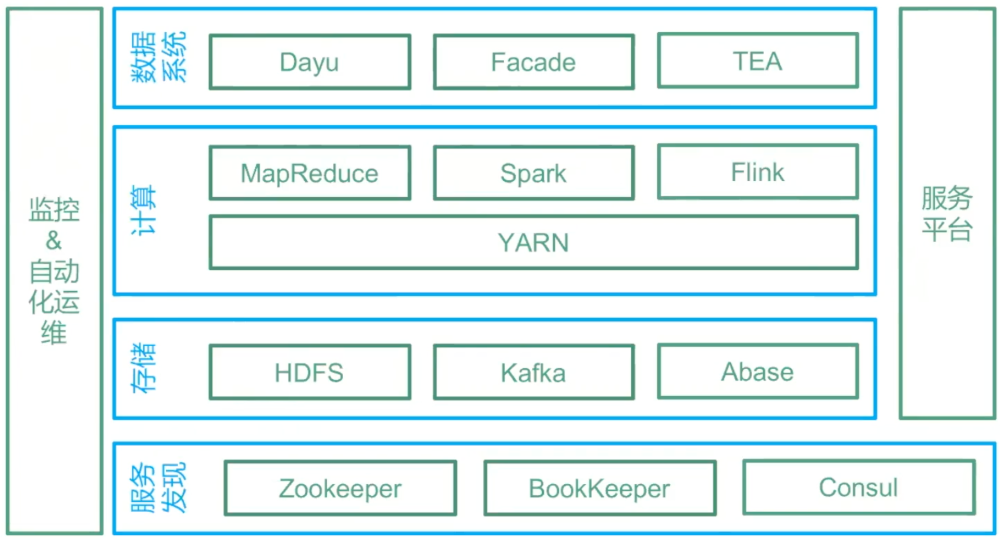
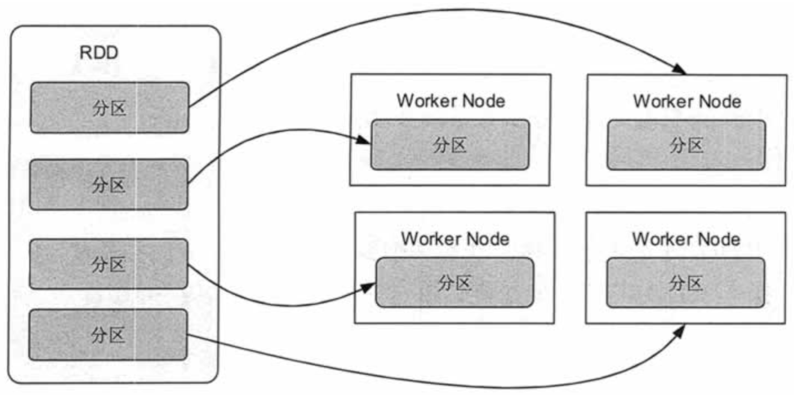

# 大数据架构概述

实时流计算（Spark/Storm/Flink）

大数据（Hadoop/HBase/Hive）

# **Hadoop**

## **Hadoop生态圈组件**

1）Zookeeper：是一个开源的分布式应用程序协调服务,基于zookeeper可以实现同步服务，配置维护，命名服务。

2）Flume：一个高可用的，高可靠的，分布式的海量日志采集、聚合和传输的系统。

3）Hbase：是一个分布式的、面向列的开源数据库, 利用Hadoop HDFS作为其存储系统。

4）Hive：基于Hadoop的一个数据仓库工具，可以将结构化的数据档映射为一张数据库表，并提供简单的sql 查询功能，可以将sql语句转换为MapReduce任务进行运行。

5）Sqoop：将一个关系型数据库中的数据导进到Hadoop的 HDFS中，也可以将HDFS的数据导进到关系型数据库中。

## **基本概念**

### **block块（物理划分）**

block是HDFS中的基本存储单位，hadoop1.x默认大小为64M而hadoop2.x默认块大小为128M。

### **split分片（逻辑划分）**

Hadoop中split划分属于逻辑上的划分，目的只是为了让map task更好地获取数据。split是通过hadoop中的InputFormat接口中的getSplit()方法得到的。

## **mapreduce运行过程概括5步**

1. [input阶段]获取输入数据进行分片作为map的输入

2. [map阶段]过程对某种输入格式的一条记录解析成一条或多条记录

3. [shffle阶段]对中间数据的控制，作为reduce的输入

4. [reduce阶段]对相同key的数据进行合并

5. [output阶段]按照格式输出到指定目录

## **Map端shuffle**

①分区partition

②写入环形内存缓冲区

③spill：执行溢出写

        排序sort--->合并combiner--->生成溢出写文件

	如果客户端自定义了Combiner（相当于map阶段的reduce），则会在分区排序后到溢写出前自动调用combiner，将相同的key的value相加，这样的好处就是减少溢写到磁盘的数据量。这个过程叫“合并”

④归并merge

## **Reduce端shuffle**

①复制copy

②归并merge

③reduce

**MapTask工作机制**

（1）Read阶段：Map Task通过用户编写的RecordReader，从输入InputSplit中解析出一个个key/value。

（2）Map阶段：该节点主要是将解析出的key/value交给用户编写map()函数处理，并产生一系列新的key/value。

（3）Collect收集阶段：在用户编写map()函数中，当数据处理完成后，一般会调用OutputCollector.collect()输出结果。在该函数内部，它会将生成的key/value分区（调用Partitioner），并写入一个环形内存缓冲区中。

（4）Spill阶段：即“溢写”，当环形缓冲区满后，MapReduce会将数据写到本地磁盘上，生成一个临时文件。需要注意的是，将数据写入本地磁盘之前，先要对数据进行一次本地排序，并在必要时对数据进行合并、压缩等操作。

（5）Combine阶段：当所有数据处理完成后，MapTask对所有临时文件进行一次合并，以确保最终只会生成一个数据文件。

## **ReduceTask工作机制**

（1）Copy阶段：ReduceTask从各个MapTask上远程拷贝一片数据，并针对某一片数据，如果其大小超过一定阈值，则写到磁盘上，否则直接放到内存中。

（2）Merge阶段：在远程拷贝数据的同时，ReduceTask启动了两个后台线程对内存和磁盘上的文件进行合并，以防止内存使用过多或磁盘上文件过多。

（3）Sort阶段：按照MapReduce语义，用户编写reduce()函数输入数据是按key进行聚集的一组数据。为了将key相同的数据聚在一起，Hadoop采用了基于排序的策略。 由于各个MapTask已经实现对自己的处理结果进行了局部排序，因此，ReduceTask只需对所有数据进行一次归并排序即可。

（4）Reduce阶段：reduce()函数将计算结果写到HDFS上。

# **Hive**

## **Hive表关联查询，如何解决数据倾斜的问题**

1）倾斜原因： map输出数据按key Hash的分配到reduce中，由于key分布不均匀、业务数据本身的特、建表时考虑不周、等原因造成的reduce 上的数据量差异过大。

（1）key分布不均匀;

（2）业务数据本身的特性;

（3）建表时考虑不周;

（4）某些SQL语句本身就有数据倾斜;

如何避免：对于key为空产生的数据倾斜，可以对其赋予一个随机值。

2）解决方案

（1）参数调节：

hive.map.aggr = true

hive.groupby.skewindata=true

生成的查询计划会有两个MR Job。第一个MR Job中，Map的输出结果集合会随机分布到Reduce中，每个Reduce做部分聚合操作，并输出结果，这样处理的结果是相同的Group By Key有可能被分发到不同的Reduce中，从而达到负载均衡的目的；第二个MR Job再根据预处理的数据结果按照Group By Key 分布到 Reduce 中（这个过程可以保证相同的 Group By Key 被分布到同一个Reduce中），最后完成最终的聚合操作。

（2）SQL 语句调节：

① 选用join key分布最均匀的表作为驱动表。做好列裁剪和filter操作，以达到两表做join 的时候，数据量相对变小的效果。

② 大小表Join：

使用map join让小的维度表（1000 条以下的记录条数）先进内存。在map端完成reduce.

③ 大表Join大表：

把空值的key变成一个字符串加上随机数，把倾斜的数据分到不同的reduce上，由于null 值关联不上，处理后并不影响最终结果。

④ count distinct大量相同特殊值:

count distinct 时，将值为空的情况单独处理，如果是计算count distinct，可以不用处理，直接过滤，在最后结果中加1。如果还有其他计算，需要进行group by，可以先将值为空的记录单独处理，再和其他计算结果进行union。

## **Hive的HSQL转换为MapReduce的过程**

HiveSQL ->AST(抽象语法树) -> QB(查询块) ->OperatorTree（操作树）->优化后的操作树->mapreduce任务树->优化后的mapreduce任务树

## **Hive底层与数据库交互原理**

由于Hive的元数据可能要面临不断地更新、修改和读取操作，所以它显然不适合使用Hadoop文件系统进行存储。目前Hive将元数据存储在RDBMS中，比如存储在MySQL、Derby中。元数据信息包括：存在的表、表的列、权限和更多的其他信息。

## **Hive的两张表关联，使用MapReduce怎么实现**

1、如果其中有一张表为小表，直接使用map端join的方式（map端加载小表）进行聚合。

2、如果两张都是大表，那么采用联合key，联合key的第一个组成部分是join on中的公共字段，第二部分是一个flag，0代表表A，1代表表B，由此让Reduce区分客户信息和订单信息；在Mapper中同时处理两张表的信息，将join on公共字段相同的数据划分到同一个分区中，进而传递到一个Reduce中，然后在Reduce中实现聚合。

## **hive中Sort By，Order By，Cluster By，Distrbute By**

order by：会对输入做全局排序，因此只有一个reducer（多个reducer无法保证全局有序）。只有一个reducer，会导致当输入规模较大时，需要较长的计算时间。

sort by：不是全局排序，其在数据进入reducer前完成排序。

distribute by：按照指定的字段对数据进行划分输出到不同的reduce中。

cluster by：除了具有 distribute by 的功能外还兼具 sort by 的功能。

## **split、coalesce及collect_list函数**

split将字符串转化为数组，即：split('a,b,c,d' , ',') ==> ["a","b","c","d"]。

coalesce(T v1, T v2, …) 返回参数中的第一个非空值；如果所有值都为 NULL，那么返回NULL。

collect_list列出该字段所有的值，不去重 => select collect_list(id) from table

## **Hive保存元数据方式**

Hive支持三种不同的元存储服务器，分别为：内嵌式元存储服务器、本地元存储服务器、远程元存储服务器，每种存储方式使用不同的配置参数。

内嵌式元存储主要用于单元测试，在该模式下每次只有一个进程可以连接到元存储，Derby是内嵌式元存储的默认数据库。

在本地模式下，每个Hive客户端都会打开到数据存储的连接并在该连接上请求SQL查询。

在远程模式下，所有的Hive客户端都将打开一个到元数据服务器的连接，该服务器依次查询元数据，元数据服务器和客户端之间使用Thrift协议通信。

## **Hive内部表和外部表区别**

创建表时：创建内部表时，会**将数据移动到数据仓库指向的路径**；若创建外部表，仅记录数据所在的路径，不对数据的位置做任何改变。

删除表时：在删除表的时候，内部表的元数据和数据会被一起删除， 而外部表只删除元数据，不删除数据。这样外部表相对来说更加安全些，数据组织也更加灵活，方便共享源数据。

# **Hbase**

## Hbase特点

* 每个值只出现在一个REGION
* 同一时间一个Region只分配给一个Region服务器
* 行内的mutation操作都是原子的
* put操作要么成功，要么完全失败

当某台region server fail的时候，它管理的region failover到其他region server时，需要根据WAL log（Write-Ahead Logging）来redo(redolog，有一种日志文件叫做重做日志文件)，这时候进行redo的region应该是unavailable的，所以hbase降低了可用性，提高了一致性。设想一下，如果redo的region能够响应请求，那么可用性提高了，则必然返回不一致的数据(因为redo可能还没完成)，那么hbase就降低一致性来提高可用性了。

# **Yarn**

参考：[通俗理解YARN运行原理](https://www.jianshu.com/p/3f406cf438be)

# **流计算对比**

## 第一代计算引擎 mapreduce  

mapreduce  作为第一个计算引擎，用于批处理，是计算引擎的先驱，内部支持机器学习但是现在机器学习库不在更新，并且mapreduce  编写十分的耗时，开发效率低，开发时间成本太大，所以很少有企业写mapreduce 来跑程序。

## 第二代计算引擎 pig/hive

* 作为第二代引擎pig/hive 对hadoop进行了嵌套，其存储基于hdfs，计算基于mr，hive/pig在处理任务时首先会把本身的代码解析为一个个m/r任务，这样就大大的降低了mr的编写编写成本。
* pig 有自己的脚本语言属于，比hive更加的灵活
* hive  属于类sql语法，虽然没有pig灵活，但是对于现在程序员都会sql的世界来说大家更喜欢使用hive
* pig/hive 只支持批处理，且支持机器学习 （hivemall）

## 第三代计算引擎 spark/storm

随着时代的发展，企业对数据实时处理的需求愈来愈大，所以就出现了storm/spark

* 这两者有着自己的计算模式
* storm属于真正的流式处理，低延迟（ms级延迟），高吞吐，且每条数据都会触发计算。
* spark属于批处理转化为流处理即将流式数据根据时间切分成小批次进行计算，对比与storm而言延迟会高于0.5s（s级延迟），但是性能上的消耗低于storm。“流式计算是批次计算的特例（流式计算是拆分计算的结果）”

## 第四代计算引擎 flink

* flink2015年出现在apache，后来又被阿里巴巴技术团队进行优化（这里我身为国人为之自豪）为blink，flink支持流式计算也支持的批次处理。
* flink为流式计算而生属于每一条数据触发计算，在性能的消耗低于storm，吞吐量高于storm，延时低于storm，并且比storm更加易于编写。因为storm如果要实现窗口需要自己编写逻辑，但是flink中有窗口方法。
* flink内部支持多种函数，其中包括窗口函数和各种算子（这一点和spark很像，但是在性能和实时上spark是没有办法比较的）
* flink支持仅一次语义保证数据不丢失
* flink支持通过envent time来控制窗口时间，支持乱序时间和时间处理（这点我觉得很厉害）
* 对于批次处理flink的批处理可以理解为 “批次处理是流式处理的特例”（批次计算是流式计算的合并结果）

# **Spark**

## **RDD**

	分布式对象集合（有容错机制），本质上是一个只读的分区记录集合。每个 RDD 可以分成多个分区，每个分区就是一个数据集片段。

* 只读：不能修改，只能通过转换操作生成新的 RDD。
* 分布式：可以分布在多台机器上进行并行处理。
* 弹性：计算过程中内存不够时它会和磁盘进行数据交换。
* 基于内存：可以全部或部分缓存在内存中，在多次计算间重用。

Spark Job 默认的调度模式 - FIFO

RDD 特点 - 可分区/可序列化/可持久化

Broadcast - 任何函数调用/是只读的/存储在各个节点

Accumulator - 支持加法/支持数值类型/可并行

Task 数量由 Partition 决定

Task 运行在 Workder node 中 Executor 上的工作单元

master 和 worker 通过 Akka 方式进行通信的

默认的存储级别 - MEMORY_ONLY

hive 的元数据存储在 derby 和 MySQL 中有什么区别 - 多会话

DataFrame 和 RDD 最大的区别 - 多了 schema

## **RDD机制**

* 分布式弹性数据集，简单的理解成一种数据结构，是spark框架上的通用货币
* 所有算子都是基于rdd来执行的
* rdd执行过程中会形成dag图，然后形成lineage保证容错性等
* 从物理的角度来看rdd存储的是block和node之间的映射

## **ShuffleManager(shuffle管理器)**

ShuffleManager随着Spark的发展有两种实现的方式，分别为HashShuffleManager和SortShuffleManager，因此spark的Shuffle有Hash Shuffle和Sort Shuffle两种

## **Spark中的HashShufle的有哪些不足？**

* shuffle产生海量的小文件在磁盘上，此时会产生大量耗时的、低效的IO操作；
* 容易导致内存不够用，由于内存需要保存海量的文件操作句柄和临时缓存信息
* 容易出现数据倾斜，导致OOM

## **spark hashParitioner的弊端**

* 分区原理：对于给定的key，计算其hashCode
* 弊端是数据不均匀，容易导致数据倾斜

## **map与flatMap的区别**

* map：对RDD每个元素转换，文件中的每一行数据返回一个数组对象
* flatMap：对RDD每个元素转换，然后再扁平化，将所有的对象合并为一个对象，会抛弃值为null的值

## **union操作是产生宽依赖还是窄依赖？**

* 窄依赖

## **常用的action**

collect，reduce,take,count,saveAsTextFile等

## **rdd有几种操作类型**

三种：

1、transformation，rdd由一种转为另一种rdd

2、action

3、cronroller，控制算子(cache/persist) 对性能和效率的有很好的支持

## **什么场景下要进行persist操作？**

以下场景会使用persist

* 某个步骤计算非常耗时或计算链条非常长，需要进行persist持久化
* shuffle之后为什么要persist，shuffle要进性网络传输，风险很大，数据丢失重来，恢复代价很大
* shuffle之前进行persist，框架默认将数据持久化到磁盘，这个是框架自动做的。

## **Spark容错机制-血统(Lineage)容错**

一般来说，分布式数据集的容错性有两种方式：数据检查点和记录数据的更新。

	Lineage本质上很类似于数据库中的重做日志（Redo Log），只不过这个重做日志粒度很大，是对全局数据做同样的重做进而恢复数据。

	相比其他系统的细颗粒度的内存数据更新级别的备份或者LOG机制，RDD的Lineage记录的是粗颗粒度的特定数据Transformation操作（如filter、map、join等）行为。

## **groupBy和groupByKey**

比如（A，1），（A，2）；使用groupBy之后结果是（A，（（A，1），（A，2）））；

使用groupByKey之后结果是：（A，（1,2））；关键区别就是合并之后是否会自动去掉key信息；

# **Storm**

# **Flink**

# **常见问题**

## spark快的原因

* Spark基于内存，尽可能的减少了中间结果写入磁盘和不必要的sort、shuffleSpark
* 对于反复用到的数据进行了缓存
* Spark对于DAG进行了高度的优化，具体在于Spark划分了不同的stage和使用了延迟计算技术

## **Spark为什么比mapreduce快**

1、内存（性能高）、磁盘（可靠）

2、DAG有向无环图在此过程中减少了shuffle以及落地磁盘的次数（一般而言）

	Spark 支持将需要反复用到的数据给 Cache 到内存中，减少数据加载耗时，所以 Spark 跑机器学习算法比较在行（需要对数据进行反复迭代）

	Spark的DAG实质上就是把计算和计算之间的编排变得更为细致紧密，使得很多MR任务中需要落盘的非Shuffle操作得以在内存中直接参与后续的运算，并且由于算子粒度和算子之间的逻辑关系使得其易于由框架自动地优化

3、Spark是粗粒度资源调度（多线程模型），MapReduce是细粒度资源调度（多进程模型）

粗粒度资源调度的优点是执行速度快，缺点是不能使集群得到充分的利用；反之亦然。

## **Mapreduce操作的mapper和reducer阶段相当于spark中的哪几个算子**

相当于spark中的map算子和reduceByKey算子，区别：MR会自动进行排序的，spark要看具体partitioner

# Reference

[HBase强一致性详解](https://www.cnblogs.com/captainlucky/p/4720986.html)

[https://www.jianshu.com/p/7a8fca3838a4](https://www.jianshu.com/p/7a8fca3838a4)

[hadoop](https://github.com/Dr11ft/BigDataGuide/blob/master/%E9%9D%A2%E8%AF%95/Hadoop%E9%9D%A2%E8%AF%95%E9%A2%98%E6%80%BB%E7%BB%93/Hadoop%E9%9D%A2%E8%AF%95%E9%A2%98%E6%80%BB%E7%BB%93%EF%BC%88%E4%B8%80%EF%BC%89.md)

[hadoop-MapReduce](https://github.com/Dr11ft/BigDataGuide/blob/master/%E9%9D%A2%E8%AF%95/Hadoop%E9%9D%A2%E8%AF%95%E9%A2%98%E6%80%BB%E7%BB%93/Hadoop%E9%9D%A2%E8%AF%95%E9%A2%98%E6%80%BB%E7%BB%93%EF%BC%88%E4%B8%89%EF%BC%89%E2%80%94%E2%80%94MapReduce.md)

[https://zhuanlan.zhihu.com/p/100258454](https://zhuanlan.zhihu.com/p/100258454)

[spark为什么比mapreduce快](https://blog.csdn.net/JENREY/article/details/84873874)
