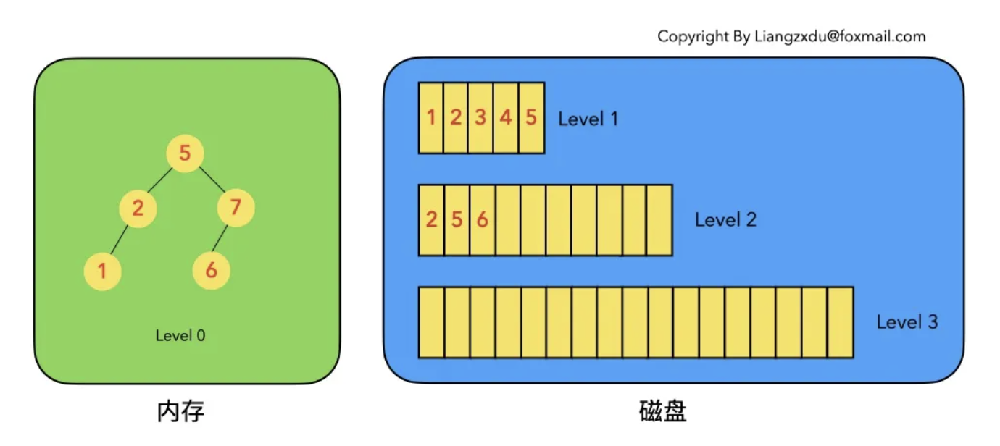
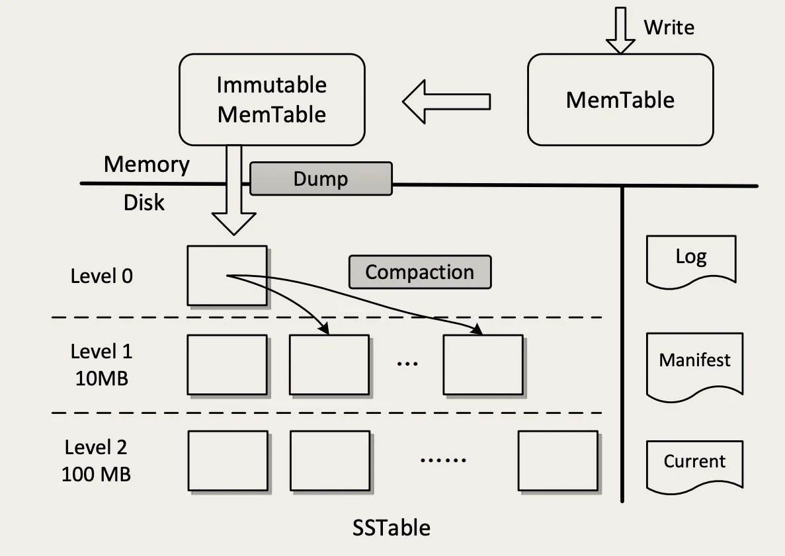
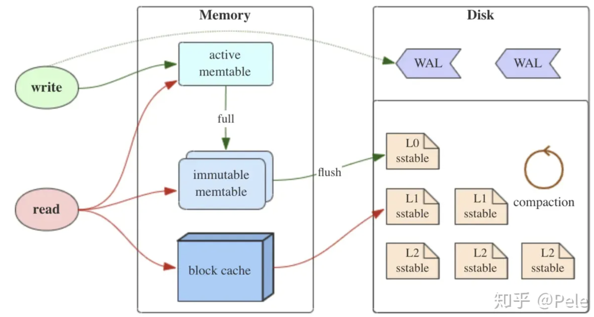

# 简介

## 背景

NoSQL数据库中，RocksDB、LevelDB、HBase以及Prometheus等，其底层的存储引擎都是基于LSM树，这一数据结构对了解存储引擎至关重要。

LSM树的核心特点是利用顺序写来提高写性能，但因为分层(此处分层是指的分为内存和文件两部分)的设计会稍微降低读性能，但是通过牺牲小部分读性能换来高性能写，使得LSM树成为非常流行的存储结构。

## 定义

Log Structured Merge Trees(LSM) 日志结构合并树：

1. LSM树是一个横跨内存和磁盘的，包含多颗"子树"的一个森林。
2. LSM树分为Level 0，Level 1，Level 2 ... Level n 多颗子树，其中只有Level 0在内存中，其余Level 1-n在磁盘中。
3. 内存中的Level 0子树一般采用排序树（红黑树/AVL树）、跳表或者TreeMap等这类有序的数据结构，方便后续顺序写磁盘。
4. 磁盘中的Level 1-n子树，本质是数据排好序后顺序写到磁盘上的文件，只是叫做树而已。
5. 每一层的子树都有一个阈值大小，达到阈值后会进行合并，合并结果写入下一层。
6. 只有内存中数据允许原地更新，磁盘上数据的变更只允许追加写，不做原地更新。

（图1 LSM树的组成与定义）

* 图1中分成了左侧绿色的内存部分和右侧蓝色的磁盘部分（定义1）。
* 图1左侧绿色的内存部分只包含Level 0树，右侧蓝色的磁盘部分则包含Level 1-n等多棵"树"（定义2）
* 图1左侧绿色的内存部分中Level 0是一颗二叉排序树（定义3）。注意这里的**有序性**，该性质决定了LSM树优异的读写性能。
* 图1右侧蓝色的磁盘部分所包含的Level 1到Level n多颗树，虽然叫做“树”，但本质是按数据key排好序后，顺序写在磁盘上的一个个文件（定义4） ，注意这里再次出现了**有序性**。
* 内存中的Level 0树在达到阈值后，会在内存中遍历排好序的Level 0树并顺序写入磁盘的Level 1。同样的，在磁盘中的Level n（n>0）达到阈值时，则会将Level n层的多个文件进行归并，写入Level n+1层。（定义5）
* 除了内存中的Level 0层做原地更新外，对已写入磁盘上的数据，都采用Append形式的磁盘顺序写，即更新和删除操作并不去修改老数据，只是简单的追加新数据。图1中右侧蓝色的磁盘部分，Level 1和Level 2均包含key为2的数据，同时图1左侧绿色内存中的Level 0树也包含key为2的数据节点。（定义6）
内存缓存（memtable）会通过写WAL的方式备份到磁盘，用来恢复数据，防止数据丢失。

论文：[An Efficient Design and Implementation of LSM-Tree based Key-Value Store on Open-Channel SSD](http://ranger.uta.edu/~sjiang/pubs/papers/wang14-LSM-SDF.pdf)

## 组成

LSM树有以下三个重要组成部分：

1) MemTable

MemTable是在内存中的数据结构，用于保存最近更新的数据，会按照Key有序地组织这些数据，LSM树对于具体如何组织有序地组织数据并没有明确的数据结构定义，例如Hbase使跳跃表来保证内存中key的有序。

因为数据暂时保存在内存中，内存并不是可靠存储，如果断电会丢失数据，因此通常会通过WAL(Write-ahead logging，预写式日志)的方式来保证数据的可靠性。

这个内存中 MemTable 不能无限地往里写，一是内存的容量毕竟有限，另外，MemTable 太大了读写性能都会下降。所以，MemTable 有一个固定的上限大小，一般是 32M。MemTable 写满之后，就被转换成 Immutable MemTable，然后再创建一个空的 MemTable 继续写。这个 Immutable MemTable，也就是只读的 MemTable，它和 MemTable 的数据结构完全一样，唯一的区别就是不允许再写入了。

2) Immutable MemTable

当 MemTable达到一定大小后，会转化成Immutable MemTable。Immutable MemTable是将转MemTable变为SSTable的一种中间状态。写操作由新的MemTable处理，在转存过程中不阻塞数据更新操作。

Immutable MemTable 也不能在内存中无限地占地方，会有一个后台线程，不停地把 Immutable MemTable 复制到磁盘文件中，然后释放内存空间。每个 Immutable MemTable 对应一个磁盘文件，MemTable 的数据结构跳表本身就是一个有序表，写入的文件也是一个按照 Key 排序的结构，这些文件就是 SSTable。把 MemTable 写入 SSTable 这个写操作，因为它是把整块内存写入到整个文件中，这同样是一个顺序写操作。

3) SSTable(Sorted String Table)

有序键值对集合，是LSM树组在磁盘中的数据结构。为了加快SSTable的读取，可以通过建立key的索引以及布隆过滤器来加快key的查找。

SSTable 被分为很多层，越往上层，文件越少，越往底层，文件越多。每一层的容量都有一个固定的上限，一般来说，下一层的容量是上一层的 10 倍。当某一层写满了，就会触发后台线程往下一层合并，数据合并到下一层之后，本层的 SSTable 文件就可以删除掉了。合并的过程也是排序的过程，除了 Level 0（第 0 层，也就是 MemTable 直接 dump 出来的磁盘文件所在的那一层。）以外，每一层内的文件都是有序的，文件内的 KV 也是有序的，这样就比较便于查找了。

# 数据操作

## 插入操作

LSM树的插入较简单，直接往内存中的Level 0排序树按照顺序插入即可。并不关心该数据是否已经在内存或磁盘中存在。已经存在该数据的话，则场景转换成更新操作。

该操作复杂度为树高log(n)，n是Level 0树的数据量，可见代价很低，能实现极高的写吞吐量。

## 删除操作

LSM树的删除操作并不是直接删除数据，而是通过一种叫“墓碑标记”的特殊数据来标识数据的删除。

删除操作分为三种情况：

* 待删除数据在内存中
* 待删除数据在磁盘中
* 该数据根本不存在
### 待删除数据在内存中

删除数据时不能简单地将Level 0树中的节点删除，而是应该采用墓碑标记将其覆盖

为什么不能直接删除而是要用墓碑标记覆盖呢？

>

### 待删除数据在磁盘中

不直接去修改磁盘上的数据（理都不理它），而是直接向内存中的Level 0树中插入墓碑标记即可。

### 数据不存在

这种情况等价于在内存的Level 0树中新增一条墓碑标记，场景转换为在内存中插入墓碑标记操作。

综合看待上述三种情况，发现不论数据有没有、在哪里，删除操作都是等价于向Level 0树中写入墓碑标记。该操作复杂度为树高log(n)，代价很低。

## 修改操作

LSM树的修改操作和删除操作很像，也是分为三种情况：

* 待修改数据在内存中
* 待修改数据在磁盘中
* 该数据根本不存在
### 待修改数据在内存中

直接定位到内存中Level 0树上黄色的老的key的位置，将其覆盖即可。

### 待修改数据在磁盘中

LSM树并不会去磁盘中的Level 1树上原地更新老的key的数据，而是直接将新的修改的节点插入内存中的Level 0树中。

### 数据不存在

同上，直接向内存中的Level 0树插入新的数据即可。

综上三种情况可以看出，修改操作都是对内存中Level 0进行覆盖/新增操作。该操作复杂度为树高log(n)，代价很低。

LSM树的增加、删除、修改（这三个都属于写操作）都是在内存中倒腾，完全没涉及到磁盘操作，所以速度飞快，写吞吐量高。

## 查询操作

LSM树的查询操作会按顺序查找Level 0、Level 1、Level 2 ... Level n 每一颗树，一旦匹配便返回目标数据，不再继续查询。该策略保证了查到的一定是目标key最新版本的数据。

查询场景分析： 

* 待查询数据在内存中
* 待查询数据在磁盘中
综合上述两种情况，LSM树的查询操作相对来说代价比较高，需要从Level 0到Level n一直顺序查下去。极端情况是LSM树中不存在该数据，则需要把整个库从Level 0到Level n给扫了一遍，然后返回查无此人（当然可以通过 布隆过滤器 + 建立稀疏索引 来优化查询操作）。代价大于以B/B+树为基本数据结构的传统RDB存储引擎。

## 合并操作

合并操作（compaction）是LSM树的核心（毕竟LSM树全称是日志结构合并树）。

之所以在增、删、改、查这四个基本操作之外还需要合并操作：

1. 因为内存不是无限大，Level 0树达到阈值时，需要将数据从内存刷到磁盘中，这是合并操作的第一个场景；
2. 需要对磁盘上达到阈值的顺序文件进行归并，并将归并结果写入下一层，归并过程中会清理重复的数据和被删除的数据(墓碑标记)。
分别对上述两个场景进行分析：

### 内存数据写入磁盘

内存中Level 0树在达到阈值后，归并写入磁盘Level 1树的场景。

对内存中的Level 0树进行**中序遍历**，将数据**顺序写入**磁盘的Level 1层即可，可以看到因为Level 0树是已经排好序的，所以写入的Level 1中的新块（追加）也是有序的（有序性保证了查询和归并操作的高效）。此时磁盘的Level 1层有两个Block块（追加）。

### 磁盘多个块归并

磁盘中Level 1层达到阈值时，对其包含的两个Block块进行归并，并将归并结果写入Level 2层的过程。

如果数据同时存在于较老的Block和较新的Block中。而归并的过程是保留较新的数据。

综上可以看到，以上两个场景由于原始数据都是有序的，因此归并的过程只需要对数据集进行一次扫描即可，复杂度为O(n)。

# Compact策略

Compact操作是十分关键的操作，否则SSTable数量会不断膨胀。在Compact策略上，主要介绍两种基本策略：size-tiered和leveled。

不过在介绍这两种策略之前，先介绍三个比较重要的概念，事实上不同的策略就是围绕这三个概念之间做出权衡和取舍。

>1）读放大:读取数据时实际读取的数据量大于真正的数据量。例如在LSM树中需要先在MemTable查看当前key是否存在，不存在继续从SSTable中寻找。
>2）写放大:写入数据时实际写入的数据量大于真正的数据量。例如在LSM树中写入时可能触发Compact操作，导致实际写入的数据量远大于该key的数据量。
>3）空间放大:数据实际占用的磁盘空间比数据的真正大小更多。上面提到的冗余存储，对于一个key来说，只有最新的那条记录是有效的，而之前的记录都是可以被清理回收的。

## size-tiered 策略

size-tiered策略保证每层SSTable的大小相近，同时限制每一层SSTable的数量。如上图，每层限制SSTable为N，当每层SSTable达到N后，则触发Compact操作合并这些SSTable，并将合并后的结果写入到下一层成为一个更大的sstable。

当层数达到一定数量时，最底层的单个SSTable的大小会变得非常大。并且size-tiered策略会导致空间放大比较严重。即使对于同一层的SSTable，每个key的记录是可能存在多份的，只有当该层的SSTable执行compact操作才会消除这些key的冗余记录。

## leveled策略

leveled策略也是采用分层的思想，每一层限制总文件的大小。

但是跟size-tiered策略不同的是，leveled会将每一层切分成多个大小相近的SSTable。这些SSTable是这一层是全局有序的，意味着一个key在每一层至多只有1条记录，不存在冗余记录。之所以可以保证全局有序，是因为合并策略和size-tiered不同。

# 优缺点

可以看到LSM树将增、删、改这三种操作都转化为内存insert + 磁盘顺序写(当Level 0满的时候)，通过这种方式得到了无与伦比的写吞吐量。

LSM树的查询能力则相对被弱化，相比于B+树的最多3~4次磁盘IO，LSM树则要从Level 0一路查询Level n，极端情况下等于做了全表扫描。（即便做了稀疏索引，也是lg(N0)+lg(N1)+...+lg(Nn)的复杂度，大于B+树的lg(N0+N1+...+Nn)的时间复杂度）。

LSM树只append追加不原地修改的特性引入了归并操作，归并操作涉及到大量的磁盘IO，比较消耗性能，需要合理设置触发该操作的参数。

综上可以给出LSM树的优缺点：

优：增、删、改操作飞快，写吞吐量极大。

缺：读操作性能相对被弱化；不擅长区间范围的读操作； 归并操作较耗费资源。

LSMTree的增、删、改、查四种基本操作的时间复杂度分析如下所示：

|操作|平均代价|最坏情况代价|
|:----|:----|:----|
|插入|1|1|
|删除|1|1|
|修改|1|1|
|查找|lgN|lgN|

# 小结

LSM树的设计原则：

* 先内存再磁盘
* 内存原地更新
* 磁盘追加更新
* 归并保留新值
# Reference

[深入浅出LSM树](https://zhuanlan.zhihu.com/p/415799237)

