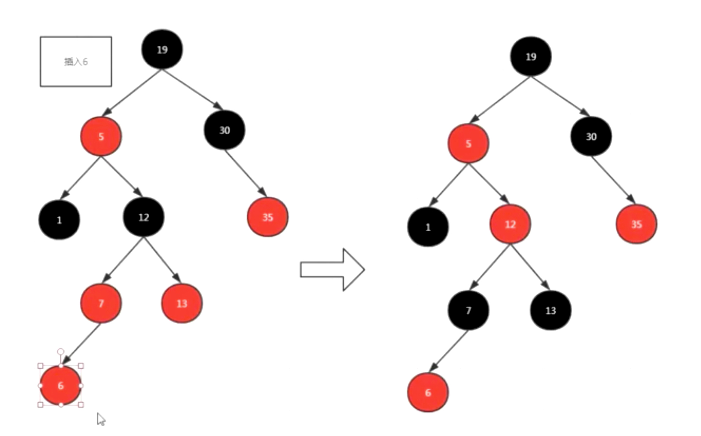
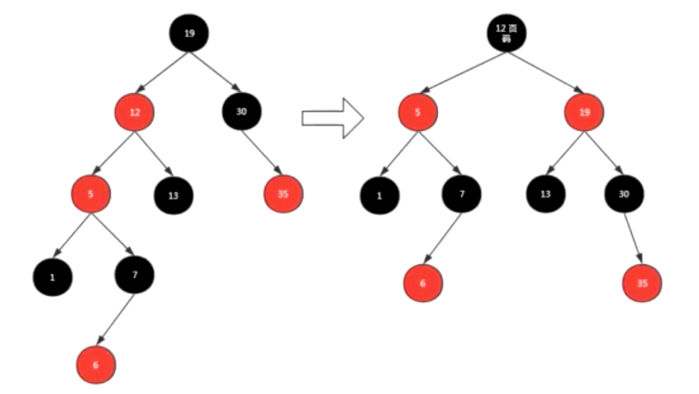

# 简介

红黑树（Red-Black Tree），简称 R-B Tree。它是一种不严格的平衡二叉查找树。

# 性质

红黑树的性质（重点）：

1、每个节点不是红色就是黑色

2、不可能有连在一起的红色节点

3、根节点都是黑色 root

4、每个红色节点节点的两个子节点都是黑色，叶子节点（NIL节点）都是黑色：出度为0满足了性质就可以近似的平衡了

5、从任意节点到其每个叶子的所有路径都包含相同数据的黑色节点

正式因为规则限制，才保证了红黑树的自平衡。红黑树从根到叶子的最长路径不会超过最短路径的2倍。

# 变换规则

为了满足红黑树的性质，有3种变换规则：所有插入的点默认为红色

1、改变颜色：当前节点的父节点是红色，且叔叔节点（祖父节点的另一个子节点）也是红色

（1）把父节点设为黑色

（2）把叔叔节点也设为黑色

（3）把爷爷节点（父节点的父节点）设为红色

（4）把指针定义到爷爷节点设为当前要操作的节点

2、左旋：当前父节点是红色、叔叔节点是黑色，且当前的节点是右子树。

（1）以父节点作为左旋

3、右旋：当前父节点是红色，叔叔节点时黑色，且当前的节点是左子树。

（1）把父节点变为黑色

（2）把爷爷节点变为红色

（3）以爷爷节点旋转

示例：插入6

# 应用

JDK的集合类TreeMap和TreeSet底层就是红黑树来实现的，在JDK8中，连HashMap也用到了红黑树。

