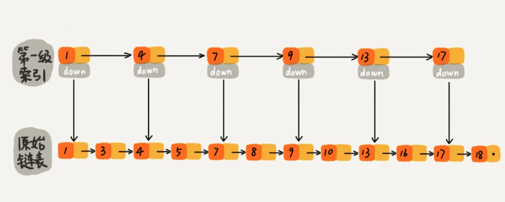
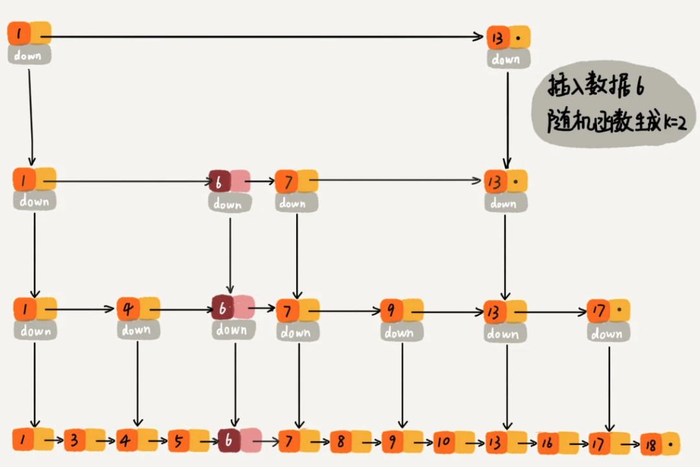

# 简介

跳表（SkipList）是一个随机化的数据结构，可以被看做二叉树的一个变种，它在性能上和红黑树，AVL树不相上下，但是跳表的原理非常简单，目前在Redis和LeveIDB中都有用到。

# 定义	

增加了向前指针的链表叫作跳表。跳表全称叫做跳跃表，简称跳表。跳表是一个随机化的数据结构，实质就是一种可以进行二分查找的有序链表。跳表在原有的有序链表上面增加了多级索引，通过索引来实现快速查找。跳表不仅能提高搜索性能，同时也可以提高插入和删除操作的性能。

# 跳表的由来

对于一个单链表来讲，即便链表中存储的数据是有序的，如果想在其中查找某个数据，也只能从头到尾遍历链表。这样查找效率很低，时间复杂度很高是 O(n)。

如果像下图中那样，对链表建立一级“索引”，查找起来会更快一些，每两个结点提取一个结点到上一级，把抽出来的那一级叫做索引或索引层。图中的 down 表示 down 指针，指向下一级结点。

从这个例子可以看出，加来一层索引之后，查找一个结点需要遍历的结点个数减少了，即查找效率提高了。

跟前面建立第一级索引的方式相似，在第一级索引的基础之上，每两个结点就抽出一个结点到第二级索引。现在我们再来查找 16，只需要遍历 6 个结点了，需要遍历的结点数量又减少了。

这种链表加多级索引的结构，就是跳表。跳表在原有的有序链表上面增加了多级索引，通过索引来实现快速查找。首先在最高级索引上查找最后一个小于当前查找元素的位置，然后再跳到次高级索引继续查找，直到跳到最底层为止，这时候以及十分接近要查找的元素的位置了(如果查找元素存在的话)。由于根据索引可以一次跳过多个元素，所以跳查找的查找速度也就变快了。

# 复杂度

## 时间复杂度

按照上面讲的，每两个结点会抽出一个结点作为上一级索引的结点，那第一级索引的结点个数大约就是 n/2，第二级索引的结点个数大约就是 n/4，第三级索引的结点个数大约就是 n/8，依次类推，也就是说，**第 k 级索引的结点个数是第 k-1 级索引的结点个数的 1/2，那第 k级索引结点的个数就是 n/(2k)**。

假设索引有 h 级，最高级的索引有 2 个结点。通过上面的公式，可以得到 n/(2^h)=2，从而求得 h=log2(n)-1（log以2为底的n）。如果包含原始链表这一层，整个跳表的高度就是 log2(n)。我们在跳表中查询某个数据的时候，如果每一层都要遍历 m 个结点，那在跳表中查询一个数据的时间复杂度就是 O(m*logn)。

假设要查找的数据是 x，在第 k 级索引中，遍历到 y 结点之后，发现 x 大于 y，小于后面的结点 z，所以通过 y 的 down 指针，从第 k 级索引下降到第 k-1 级索引。在第 k-1 级索引中，y 和 z 之间只有 3 个结点（包含 y 和 z），所以在 K-1 级索引中最多只需要遍历 3 个结点，依次类推，每一级索引都最多只需要遍历 3 个结点。

因此，**m 等于 3**。所以**在跳表中查询任意数据的时间复杂度就是 O(logn)**。这个查找的时间复杂度跟二分查找是一样的。

## 空间复杂度

假设原始链表大小为 n，第一级索引大约有 n/2 个结点，第二级索引大约有 n/4 个结点，以此类推，每上升一级就减少一半，直到剩下 2 个结点。如果把每层索引的结点数写出来，就是一个等比数列。

这几级索引的结点总和就是 n/2+n/4+n/8…+8+4+2=n-2。所以，**跳表的空间复杂度是 O(n)**。

前面都是每两个结点抽一个结点到上级索引，如果每三个结点或五个结点，抽一个结点到上级索引，就不用那么多索引结点了。

可以看出，第一级索引需要大约 n/3 个结点，第二级索引需要大约 n/9 个结点。每往上一级，索引结点个数都除以 3。通过等比数列求和公式，总的索引结点大约就是 n/3+n/9+n/27+...+9+3+1=n/2。尽管空间复杂度还是 O(n)，但比上面的每两个结点抽一个结点的索引构建方法，要减少了一半的索引结点存储空间。

# 操作

跳表这个动态数据结构，不仅支持查找操作，还支持动态的插入、删除操作，而且插入、删除操作的时间复杂度也是 O(logn)。

## 插入

为了保证原始链表中数据的有序性，需要先找到要插入的位置，这个查找操作就会比较耗时。

对于跳表来说，查找某个结点的时间复杂度是 O(logn)，所以这里查找某个数据应该插入的位置，方法也是类似的，时间复杂度也是 O(logn)。

## 删除

如果要删除的结点在索引中也有出现，除了要删除原始链表中的结点，还要删除索引中的。因为单链表中的删除操作需要拿到要删除结点的前驱结点，然后通过指针操作完成删除。所以在查找要删除的结点的时候，一定要获取前驱结点。当然，如果用的是双向链表，就不需要考虑这个问题了。

# 跳表索引动态更新

当不停地往跳表中插入数据时，如果不更新索引，就有可能出现某 2 个索引结点之间数据非常多的情况。极端情况下，跳表还会退化成单链表。

作为一种动态数据结构，需要某种手段来维护索引与原始链表大小之间的平衡，即如果链表中结点多了，索引结点也就相应增加，避免复杂度退化，以及查找、插入、删除操作性能下降。像红黑树、AVL 树这样平衡二叉树，它们是通过左右旋的方式保持左右子树的大小平衡，而跳表是通过随机函数来维护前面提到的“平衡性”。

## 随机函数

通过一个随机函数，来决定将这个结点插入到哪几级索引中，比如随机函数生成了值 K，那就将这个结点添加到第一级到第 K 级这 K 级索引中。

随机函数的选择很有讲究，从概率上来讲，能够保证跳表的索引大小和数据大小平衡性，不至于性能过度退化。随机函数的选择就不展开了。

# FAQ

**为什么 Redis 要用跳表来实现有序集合，而不是红黑树？**

Redis 中的有序集合是通过跳表来实现的，严格来讲还用到了散列表。Redis 的开发手册中有序集合支持的核心操作主要有下面这几个：

* 插入一个数据；
* 删除一个数据；
* 查找一个数据；
* 按照区间查找数据（比如查找值在[100, 200]之间的数据）；
* 迭代输出有序序列。
其中，插入、删除、查找以及迭代输出有序序列这几个操作，红黑树也可以完成，时间复杂度跟跳表是一样的。但是，**按照区间来查找数据这个操作，红黑树的效率没有跳表高**。对于按照区间查找数据这个操作，跳表可以做到 O(logn) 的时间复杂度定位区间的起点，然后在原始链表中顺序往后遍历就可以了。这样做非常高效。

Redis 用跳表来实现有序集合还有其他原因，比如，跳表更容易代码实现（虽然跳表的实现也不简单，但比起红黑树来说还是简单、可读性好，不容易出错）。另外跳表更加灵活，可以通过改变索引构建策略，有效平衡执行效率和内存消耗。

不过，跳表也不能完全替代红黑树。因为红黑树比跳表的出现要早一些，很多编程语言中的 Map 类型都是通过红黑树来实现的。可以直接拿来使用，不用自己去实现，但是跳表并没有一个现成的实现，需要自己实现。

