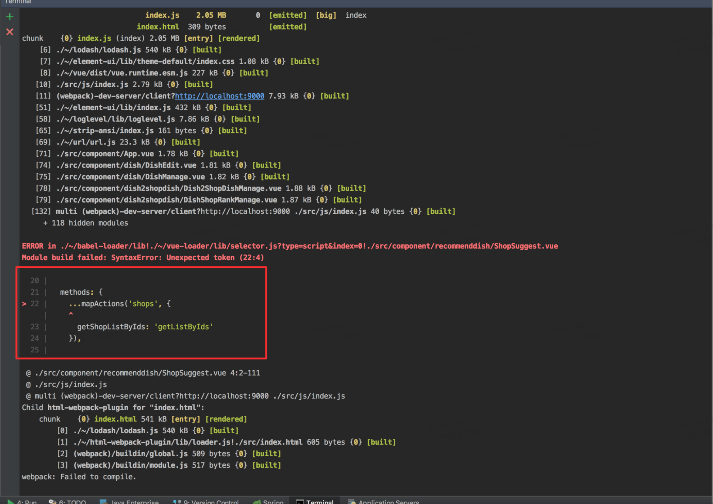
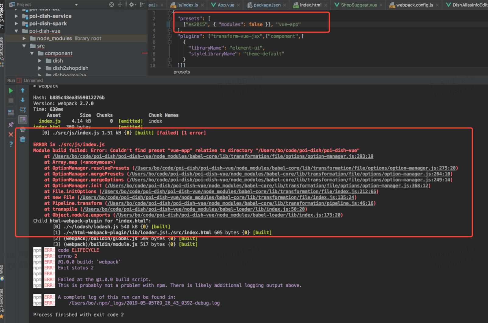

# **1、vue中报ES6三点语法错误**

## **1.1 错误描述**



## 1.2 环境介绍

老项目.babelrc

```json
{
  "presets": ["vue-app"]
}
```
新项目.babelrc
```json
{
  "presets": [
    ["es2015", { "modules": false }]
  ],
  "plugins": ["transform-vue-jsx",["component",[
    {
      "libraryName": "element-ui",
      "styleLibraryName": "theme-default"
    }
  ]]]
}
```
## 1.3 解决办法

**1、修改新项目.babelrc**

```javascript
{
  "presets": [
    ["es2015", { "modules": false }], "vue-app"
  ],
  "plugins": ["transform-vue-jsx",["component",[
    {
      "libraryName": "element-ui",
      "styleLibraryName": "theme-default"
    }
  ]]]
}
```

**2、检查babel版本**

```shell
babel --version
```

**3、依旧出现错误**



## **4、安装vue-app包**

# ！！！注意需要在package.json同目录下，安装完之后package.json中会增加相关包记录

```shell
npm install babel-preset-vue-app -D
至此，问题解决，后续缺少包继续安装即可，如：
代码块
Shell
npm install hui-vue --save
npm install vuex --save
npm install less-loader --save-dev
npm install less --save-dev
```

# **2、子组件访问不了父组件**

## **2.1 问题描述**

子组件访问父组件总是报错，父组件方法没有定义typeError: this.$parent.updateShopinfo is not a function

**部分代码：**

```javascript
<div class="hskipp" style="margin-top:20px; margin-left:0px; margin-bottom: 20px">
            <!-- <div style="width:150px"> -->
​
              
            <el-row class="vskip" :gutter="16">
              <el-col class="search-input" :span="12" >
                  <v-shopsuggest ref="shopsuggest"></v-shopsuggest>
                
                <!-- </div> -->
              
                <div class="fill" style="display:inline-block; margin-left:20px; width:600px">
                  <el-input :value="this.keyword" @input='updateKeyword' placeholder="推荐菜名字">
                  </el-input>
                </div>
              </el-col>
              <el-col :span="12">
                <el-button-group class="hskip">
                  <el-button :type="this.dishType===100 ? 'primary' : 'default'" @click='changeDishType(100)'>
                    全部
                  </el-button>
                  <el-button :type="this.dishType===0 ? 'primary' : 'default'" @click='changeDishType(0)'>
                    在线
                  </el-button>
                  <el-button :type="this.dishType===-1 ? 'primary' : 'default'" @click='changeDishType(-1)'>
                    子菜
                  </el-button>
                  <el-button :type="this.dishType===-2 ? 'primary' : 'default'" @click='changeDishType(-2)'>
                    下线
                  </el-button>
                  <el-button :type="this.dishType===1 ? 'primary' : 'default'" @click='changeDishType(1)'>
                    认证
                  </el-button>
                </el-button-group>
                <el-button-group>
                  <el-button icon=“el-icon-refresh” @click='reset' >
                    刷新
                  </el-button>
                </el-button-group>
              </el-col>
            </el-row>
          </div>
```
## 2.2 原因

“<v-shopsuggest ref="shopsuggest"> </v-shopsuggest>”不能放在“<el-row>”标签中

# **3、Vue-resource请求传参问题**

参考链接：[vue-resource的使用中需要注意的坑](https://www.cnblogs.com/goloving/p/8665799.html)

## **3.1 问题描述**

使用post传参时，发现参数格式不正确，接口返回错误。

## **3.2 知识点**

两种类型都可以通过NetWork的Headers查看，Form Data是如xx=123&yy=456的格式，Request Payload是如{xx:"123", yy:"456"}的格式

## **3.3 原因**

参数传的格式是Form Data，而接口需要的是Request Payload格式。默认的Content-Type用的是application/x-www-form-urlencoded，即Form Data，默认的报文都是这种格式。但原生的ajax报文头用的是text/plain;charset=UTF-8，这种格式下大部分字符都是不编码

## **3.4 解决办法**

1）在vue实例中添加headers字段

```javascript
http: {
    headers: {'Content-Type': 'application/x-www-form-urlencoded'}
    //或
    headers: {'Content-Type': 'text/plain;charset=UTF-8'}
}
```
2）直接设置参数
```javascript
Vue.http.options.emulateJSON = true;
```
3）请求时修改
```javascript
this.$http.post('/api/audit/batchDeleteDish',{
    "dishId": this.instance.id, 
    "method": "delete"
  }, {emulateJSON: false}).then((response) => {
    xxxx
});
```
将emulateJSON改为false即为Request Payload格式。
## 3.5  附：axios请求

```javascript
//1、vue-resource请求的解决方法
import Vue from "vue"
import VueResource from "vue-resource"
Vue.use(VueResource)
​
this.$http({
    url: "/api/341-1",
    headers: {
        'Content-Type': 'application/x-www-form-urlencoded',
    },
    emulateJSON: true, //以application/x-www-form-urlencoded的请求头部发送参数
    method: "POST",
    body: {
        a: "12233",
        b: "12345"
    }
}).then(reponse => {
    if (reponse.status == "200") {
        console.log(response.data);
    }
})
​
//2、axios请求的解决方法
import Vue from "vue"
import axios from "axios"
import Qs from "qs"
axios({
    url: "/api/341-1",
    headers: {
        'Content-Type': 'application/x-www-form-urlencoded', //请求头部
    },
    method: "POST",
    data: Qs.stringify({
        a: "12233",
        b: "12345"
    }) // 这里可以在发送请求之前对请求数据做处理，比如form-data格式化等，这里可以使用开头引入的Qs（这个模块在安装axios的时候就已经安装了，不需要另外安装）
}).then(response => {
    if (response.status == "200") {
        console.log(response.data);
    }
})
```
## **3.6 附 Post请求参数书写格式**

```javascript
dishFindByNames ({ shopId, dishNames1, cb = Hex.empty }) {
  this.$http.post('/api/admin/dishFindByNames',{
    shopId, //形同"shopId": shopId,
    'dishNames': dishNames1,
  },{emulateJSON: false}).then(response => {
    console.log("dishFindByNames");
    cb();
});
```
## 3.7 附参考代码

```javascript
this.$http.get('/api/user/order/list', {
            productType: "1",
            pageNum: 1,
            pageLimit: 8
        }, {
            headers: {
            },
            emulateJSON: true
        }).then((response) => {
            this.articles = response.data.data.list;
        }).catch(function(response) {
            console.log(response);
        });
​
this.$http({
    url: "/api/341-1",
    headers: {
        'Content-Type': 'application/x-www-form-urlencoded',
    },
    emulateJSON: true, //以application/x-www-form-urlencoded的请求头部发送参数
    method: "POST",
    body: {
        a: "12233",
        b: "12345"
    }
}).then(reponse => {
    if (reponse.status == "200") {
        console.log(response.data);
    }
})
```
# **4、函数调用参数问题**

若函数形参使用{}，则传递参数时名称需要绝对保持一致

```javascript
this.dishFindByNames({ shopId, dishNames});
​
//right
dishFindByNames ({ shopId, dishNames }) {xxx}
//error
dishFindByNames ({ shopId, dishNames1 }) {xxx}
```


# 5、回调函数使用问题

使用回调函数一般用{}包住参数

1、常规用法

```javascript
this.dishFindByNames({ shopId, dishNames
  cb:() => {
    console.log("callback");
  }
});
​
dishFindByNames ({ shopId, dishNames, cb }) {xxx}
```
2、回调函数指定默认值
```javascript
this.dishFindByNames({ shopId, dishNames
  cb:() => {
    // console.log("callback");
  }
});
​
dishFindByNames ({ shopId, dishNames, cb = Hex.empty }) {xxx}
//Hex为第三方引入库
​
//函数调用也可以为
this.dishFindByNames({ shopId, dishNames });
```

# 6、解决element-ui从1.x升级到2.x报错问题

## **6.1 问题描述**

```javascript
ERROR in ./src/js/index.js
Module not found: Error: Can't resolve 'element-ui/lib/theme-default/index.css' in '/Users/bo/code/poi-dish/poi-dish-vue/src/js'
 @ ./src/js/index.js 1:0-63
 @ multi (webpack)-dev-server/client?http://localhost:9000 ./src/js/index.js
```
但是2.x版本的element-ui已经是使用import 'element-ui/lib/theme-chalk/index.css'导入了，代码中并没有'element-ui/lib/theme-default/index.css'。
## 6.2 解决办法

.babelrc文件内容

```json
{
  "presets": [
    ["es2015", { "modules": false }], "vue-app"
  ],
  "plugins": ["transform-vue-jsx",["component",[
    {
      "libraryName": "element-ui",
      "styleLibraryName": "theme-default"
    }
  ]]]
}
```
将上述内容修改成如下即可:
```json
{
  "presets": [
    ["env", { "modules": false }], "vue-app"
  ]
}
```

# 7、el-table-column组件不能显示提示列表

## 7.1 原因

该组件某些情况下需要设置value属性，否则即使有数据也不能显示。

## 7.2 解决办法

在返回数组中的每一个对象中添加value属性

```javascript
querySearch(queryString, cb) {
    if (queryString === '') {
        queryString = this.updateItem.shopDishName;
    }
    this.$http.post('/dish/suggestion', {
        "keyword": queryString
    }, {emulateJSON: true}).then(response => {
        var results = response.body.extra;
        // 添加value属性即可
        results.forEach(function(value, index, array){
        value.value = value.name;
    });
    cb(results);
});
},
```


# 8、字体无法解析

## 8.1 问题描述

parse failed: Unexpected character ''

## 8.2 原因

字体文件无法解析

## 8.3 解决办法

在webpack.config.js中配置

```javascript
{
  test : /\.(eot|svg|ttf|woff|woff2)(\?\S*)?$/,
  loader : "file-loader"
},
```
