## 前言

### 架构的特性

架构设计的思维和程序设计的思维差异很大。

**架构设计的关键思维是判断和取舍，程序设计的关键思维是逻辑和实现。**

## 架构的定义

3个问题：

1、微信有架构，微信的登录系统也有架构，微信的支付系统也有架构，当谈微信架构时，到底是在谈什么架构？

2、Linux 有架构，MySQL 有架构，JVM 也有架构，使用 Java 开发、MySQL 存储、跑在 Linux 上的业务系统也有架构，应该关注哪个架构呢？

3、架构和框架是什么关系？有什么区别？

要想准确地理解架构的定义，关键就在于把三组容易混淆的概念梳理清楚：

1、系统与子系统

2、模块与组件

3、框架与架构

### 系统与子系统

维基百科定义的“**系统**”：系统泛指由一群有关联的个体组成，根据某种规则运作，能完成个别元件不能单独完成的工作的群体。它的意思是“总体”“整体”或“联盟”。

**关联**：系统是由一群有关联的个体组成的，没有关联的个体堆在一起不能成为一个系统。例如，把一个发动机和一台 PC 放在一起不能称之为一个系统，把发动机、底盘、轮胎、车架组合起来才能成为一台汽车。

**规则**：系统内的个体需要按照指定的规则运作，而不是单个个体各自为政。规则规定了系统内个体分工和协作的方式。例如，汽车发动机负责产生动力，然后通过变速器和传动轴，将动力输出到车轮上，从而驱动汽车前进。

**能力**：系统能力与个体能力有本质的差别，系统能力不是个体能力之和，而是产生了新的能力。例如，汽车能够载重前进，而发动机、变速器、传动轴、车轮本身都不具备这样的能力。

**子系统**的定义：子系统也是由一群有关联的个体所组成的系统，多半会是更大系统中的一部分。

问题1：

架构定义：只包含顶层这一层级的架构，不包含子系统层级的架构。所以微信架构，就是指微信系统这个层级的架构。当然，微信的子系统，比如支付系统，也有它自己的架构，同样只包括顶层。

### 模块与组件

软件模块（Module）是一套一致而互相有紧密关连的软件组织。它分别包含了程序和数据结构两部分。现代软件开发往往利用模块作为合成的单位。模块的接口表达了由该模块提供的功能和调用它时所需的元素。模块是可能分开被编写的单位。这使它们可再用和允许人员同时协作、编写及研究不同的模块。

软件组件定义为自包含的、可编程的、可重用的、与语言无关的软件单元，软件组件可以很容易被用于组装应用程序中。

**模块和组件都是系统的组成部分，只是从不同的角度拆分系统而已。**

从业务逻辑的角度来拆分系统后，得到的单元就是“模块”；从物理部署的角度来拆分系统后，得到的单元就是“组件”。划分**模块**的主要目的是**职责分离**；划分**组件**的主要目的是**单元复用**。

以一个最简单的网站系统来为例。假设我们要做一个学生信息管理系统，这个系统从逻辑的角度来拆分，可以分为“登录注册模块”“个人信息模块”和“个人成绩模块”；从物理的角度来拆分，可以拆分为 Nginx、Web 服务器和 MySQL。

问题2：

业务系统的架构师，首先需要思考怎么从业务逻辑的角度把系统拆分成一个个模块角色，其次需要思考怎么从物理部署的角度把系统拆分成组件角色，例如选择 MySQL 作为存储系统。但是对于 MySQL 内部的体系架构（Parser、Optimizer、Caches&Buffers 和 Storage Engines 等），其实是可以不用关注的，也不需要在你的业务系统架构中展现这些内容。

### 框架与架构

软件框架（Software framework）通常指的是为了实现某个业界标准或完成特定基本任务的软件组件规范，也指为了实现某个软件组件规范时，提供规范所要求之基础功能的软件产品。

提炼一下其中关键部分：

1、框架是组件规范：例如，MVC 就是一种最常见的开发规范，类似的还有 MVP、MVVM、J2EE 等框架。

2、框架提供基础功能的产品：例如，Spring MVC 是 MVC 的开发框架，除了满足 MVC 的规范，Spring 提供了很多基础功能来帮助我们实现功能，包括注解（@Controller 等）、Spring Security、Spring JPA 等很多基础功能。

软件架构指软件系统的“基础结构”，创造这些基础结构的准则，以及对这些结构的描述。

**框架关注的是“规范”，架构关注的是“结构”。**

框架的英文是 Framework，架构的英文是 Architecture，Spring MVC 的英文文档标题就是“Web MVC framework”。

举例：学生管理系统

从业务逻辑的角度分解，架构是 登录注册模块、个人信息模块、个人成绩模块……

从物理部署的角度分解，架构是 Nginx、Web服务器、MySQL

从开发规范的角度分解，架构是 MVC 架构（Controller、View、Model）

问题3：

框架是一整套开发规范，架构是某一套开发规范下的具体落地方案，包括各个模块之间的组合关系以及它们协同起来完成功能的运作规则。

### 重新定义架构：4R架构

参考维基百科的定义，再结合自己的一些理解和思考，将软件架构重新定义为：软件架构指软件系统的顶层（Rank）结构，它定义了系统由哪些角色（Role）组成，角色之间的关系（Relation）和运作规则（Rule）。

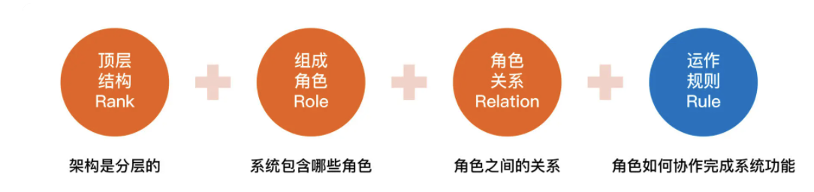

#### Rank

它是指软件架构是分层的，对应“系统”和“子系统”的分层关系。通常情况下，只需要关注某一层的架构，最多展示相邻两层的架构，而不需要把每一层的架构全部糅杂在一起。无论是架构设计还是画架构图，都应该采取“自顶向下，逐步细化”的方式。以微信为例，Rank 的含义如下所示：

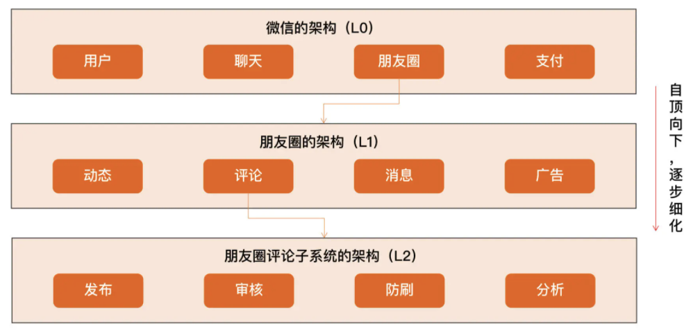

#### Role

它是指软件系统包含哪些角色，每个角色都会负责系统的一部分功能。架构设计最重要的工作之一就是将系统拆分为多个角色。最常见的微服务拆分其实就是将整体复杂的业务系统按照业务领域的方式，拆分为多个微服务，每个微服务就是系统的一个角色。

#### Relation

它是指软件系统的角色之间的关系，对应到架构图中其实就是连接线，角色之间的关系不能乱连，任何关系最后都需要代码来实现，包括连接方式（HTTP、TCP、UDP 和串口等）、数据协议（JSON、XML 和二进制等）以及具体的接口等。

#### Rule

它是指软件系统角色之间如何协作来完成系统功能。在前面解读什么是“系统”的时候提到过：系统能力不是个体能力之和，而是产生了新的能力。那么这个新能力具体如何完成的呢？具体哪些角色参与了这个新能力呢？这就是 Rule 所要表达的内容。在架构设计的时候，核心的业务场景都需要设计 Rule。

实际工作中，为了方便理解，Rank、Role 和 Relation 是通过系统架构图来展示的，而 Rule 是通过系统序列图（System Sequence Diagram）来展示的。

以一个简化的支付系统为例，支付系统架构图如下所示：

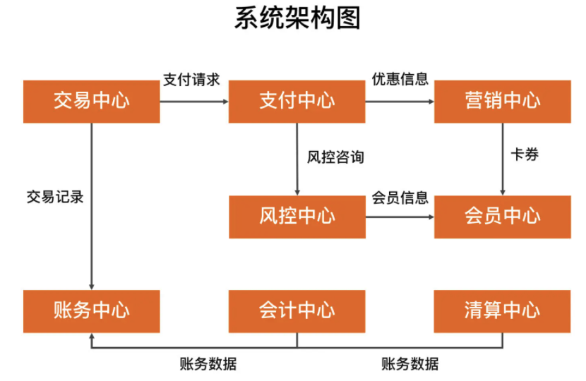

“扫码支付”这个核心场景的系统序列图如下所示：

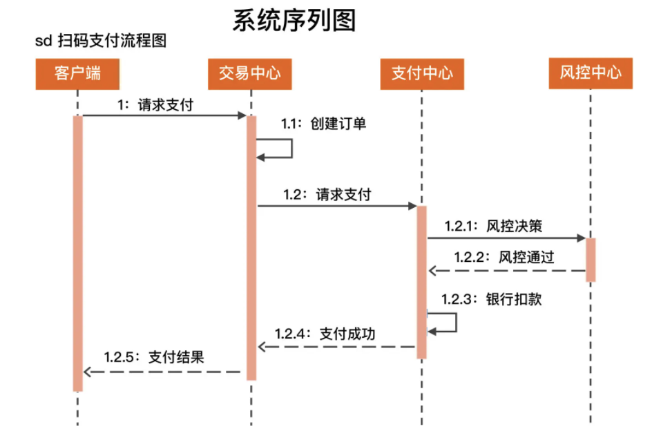

## 结构设计的历史背景

### 第一次软件危机与结构化程序设计

20 世纪 60 年代~20 世纪 70 年代。

高级语言的出现，解放了程序员，但好景不长，随着软件的规模和复杂度的大大增加，20 世纪 60 年代中期开始爆发了第一次软件危机，典型表现有软件质量低下、项目无法如期完成、项目严重超支等，因为软件而导致的重大事故时有发生。例如，1963 年美国（[http://en.wikipedia.org/wiki/Mariner_1](http://en.wikipedia.org/wiki/Mariner_1)）的水手一号火箭发射失败事故，就是因为一行 FORTRAN 代码错误导致的。

“结构化程序设计”作为另外一种解决软件危机的方案被提了出来。艾兹赫尔·戴克斯特拉（Edsger Dijkstra）于 1968 年发表了著名的《GOTO 有害论》论文，引起了长达数年的论战，并由此产生了结构化程序设计方法。同时，第一个结构化的程序语言 Pascal 也在此时诞生，并迅速流行起来。

结构化程序设计的主要特点是抛弃 goto 语句，采取“自顶向下、逐步细化、模块化”的指导思想。结构化程序设计本质上还是一种面向过程的设计思想，但通过“自顶向下、逐步细化、模块化”的方法，将软件的复杂度控制在一定范围内，从而从整体上降低了软件开发的复杂度。结构化程序方法成为了 20 世纪 70 年代软件开发的潮流。

### 第二次软件危机与面向对象

结构化编程的风靡在一定程度上缓解了软件危机，然而随着硬件的快速发展，业务需求越来越复杂，以及编程应用领域越来越广泛，第二次软件危机很快就到来了。

第二次软件危机的根本原因还是在于软件生产力远远跟不上硬件和业务的发展。第一次软件危机的根源在于软件的“逻辑”变得非常复杂，而第二次软件危机主要体现在软件的“扩展”变得非常复杂。结构化程序设计虽然能够解决（也许用“缓解”更合适）软件逻辑的复杂性，但是对于业务变化带来的软件扩展却无能为力，软件领域迫切希望找到新的银弹来解决软件危机，在这种背景下，面向对象的思想开始流行起来。

面向对象的思想并不是在第二次软件危机后才出现的，早在 1967 年的 Simula 语言中就开始提出来了，但第二次软件危机促进了面向对象的发展。面向对象真正开始流行是在 20 世纪 80 年代，主要得益于 C++ 的功劳，后来的 Java、C# 把面向对象推向了新的高峰。到现在为止，面向对象已经成为了主流的开发思想。

### 软件架构的历史背景

虽然早在 20 世纪 60 年代，戴克斯特拉这位上古大神就已经涉及软件架构这个概念了，但软件架构真正流行却是从 20 世纪 90 年代开始的，由于在 Rational 和 Microsoft 内部的相关活动，软件架构的概念开始越来越流行了。

卡内基·梅隆大学的玛丽·肖（Mary Shaw）和戴维·加兰（David Garlan）对软件架构做了很多研究，他们在 1994 年的一篇文章《软件架构介绍》（An Introduction to Software Architecture）中写到：“When systems are constructed from many components, the organization of the overall system-the software architecture-presents a new set of design problems.”

简单翻译一下：随着软件系统规模的增加，计算相关的算法和数据结构不再构成主要的设计问题；当系统由许多部分组成时，整个系统的组织，也就是所说的“软件架构”，导致了一系列新的设计问题。

这段话很好地解释了“软件架构”为何先在 Rational 或者 Microsoft 这样的大公司开始逐步流行起来。因为只有大公司开发的软件系统才具备较大规模，而只有规模较大的软件系统才会面临软件架构相关的问题，例如：

1、系统规模庞大，内部耦合严重，开发效率低；

2、系统耦合严重，牵一发动全身，后续修改和扩展困难；

3、系统逻辑复杂，容易出问题，出问题后很难排查和修复。

软件架构的出现有其历史必然性。20 世纪 60 年代第一次软件危机引出了“结构化编程”，创造了“模块”概念；20 世纪 80 年代第二次软件危机引出了“面向对象编程”，创造了“对象”概念；到了 20 世纪 90 年代“软件架构”开始流行，创造了“组件”概念。我们可以看到，“模块”“对象”“组件”本质上都是对达到一定规模的软件进行拆分，差别只是在于随着软件的复杂度不断增加，拆分的粒度越来越粗，拆分的层次越来越高。

为何结构化编程、面向对象编程、软件工程、架构设计最后都没有成为软件领域的银弹？

## 架构设计的目的

### 架构设计的误区

关于架构设计的目的，常见的误区有：

1、因为架构很重要，所以要做架构设计

2、不是每个系统都要做架构设计吗

3、公司流程要求系统开发过程中必须有架构设计

4、为了高性能、高可用、可扩展，所以要做架构设计

但往往持有这类观点的架构师和设计师会给项目带来巨大的灾难，这绝不是危言耸听，而是很多实际发生的事情，为什么会这样呢？因为这类架构师或者设计师不管三七二十一，不管什么系统，也不管什么业务，上来就要求“高性能、高可用、高扩展”，结果就会出现架构设计复杂无比，项目落地遥遥无期，团队天天吵翻天……等各种让人抓狂的现象，费尽九牛二虎之力将系统整上线，却发现运行不够稳定，经常出问题，出了问题很难解决，加个功能要改 1 个月……等各种继续让人抓狂的事件。

### 架构设计的真正目的

**架构设计的主要目的是为了解决软件系统复杂度带来的问题。**

通过熟悉和理解需求，识别系统复杂性所在的地方，然后针对这些复杂点进行架构设计。

架构设计并不是要面面俱到，不需要每个架构都具备高性能、高可用、高扩展等特点，而是要识别出复杂点然后有针对性地解决问题。

理解每个架构方案背后所需要解决的复杂点，然后才能对比自己的业务复杂点，参考复杂点相似的方案。（有的放矢，而不是贪大求全）

如果系统的复杂度不是在性能这部分，TPS 做到 10 万并没有什么用。

淘宝的架构是为了解决淘宝业务的复杂度而设计的，淘宝的业务复杂度并不就是我们的业务复杂度，绝大多数业务的用户量都不可能有淘宝那么大。

Docker 不是万能的，只是为了解决资源重用和动态分配而设计的，如果我们的系统复杂度根本不是在这方面，引入 Docker 没有什么意义。

### 简单的复杂度分析案例

分析一个简单的案例，一起来看看如何将“架构设计的真正目的是为了解决软件系统复杂度带来的问题”这个指导思想应用到实践中。

假设需要设计一个大学的学生管理系统，其基本功能包括登录、注册、成绩管理、课程管理等。当我们对这样一个系统进行架构设计的时候，首先应识别其复杂度到底体现在哪里。

性能：一个学校的学生大约 1 ~ 2 万人，学生管理系统的访问频率并不高，平均每天单个学生的访问次数平均不到 1 次，因此性能这部分并不复杂，存储用 MySQL 完全能够胜任，缓存都可以不用，Web 服务器用 Nginx 绰绰有余。

可扩展性：学生管理系统的功能比较稳定，可扩展的空间并不大，因此可扩展性也不复杂。

高可用：学生管理系统即使宕机 2 小时，对学生管理工作影响并不大，因此可以不做负载均衡，更不用考虑异地多活这类复杂的方案了。但是，如果学生的数据全部丢失，修复是非常麻烦的，只能靠人工逐条修复，这个很难接受，因此需要考虑存储高可靠，这里就有点复杂了。需要考虑多种异常情况：机器故障、机房故障，针对机器故障，需要设计 MySQL 同机房主备方案；针对机房故障，需要设计 MySQL 跨机房同步方案。

安全性：学生管理系统存储的信息有一定的隐私性，例如学生的家庭情况，但并不是和金融相关的，也不包含强隐私（例如玉照、情感）的信息，因此安全性方面只要做 3 个事情就基本满足要求了：Nginx 提供 ACL 控制、用户账号密码管理、数据库访问权限控制。

成本：由于系统很简单，基本上几台服务器就能够搞定，对于一所大学来说完全不是问题，可以无需太多关注。

学生管理系统虽然简单，但麻雀虽小五脏俱全，基本上能涵盖软件系统复杂度分析的各个方面，而且绝大部分技术人员都曾经自己设计或者接触过类似的系统，如果将这个案例和自己的经验对比，相信会有更多的收获。

## 复杂度来源：高性能

技术发展带来了性能上的提升，不一定带来复杂度的提升。例如，硬件存储从纸带→磁带→磁盘→SSD，并没有显著带来系统复杂度的增加。因为新技术会逐步淘汰旧技术，这种情况下我们直接用新技术即可，不用担心系统复杂度会随之提升。只有那些并不是用来取代旧技术，而是开辟了一个全新领域的技术，才会给软件系统带来复杂度，因为软件系统在设计的时候就需要在这些技术之间进行判断选择或者组合。就像汽车的发明无法取代火车，飞机的出现也并不能完全取代火车，所以我们在出行的时候，需要考虑选择汽车、火车还是飞机，这个选择的过程就比较复杂了，要考虑价格、时间、速度、舒适度等各种因素。

软件系统中高性能带来的复杂度主要体现在两方面，一方面是**单台计算机内部为了高性能带来的复杂度**；另一方面是**多台计算机集群为了高性能带来的复杂度**。

### 单机复杂度

计算机内部复杂度最关键的地方就是操作系统。计算机性能的发展本质上是由硬件发展驱动的，尤其是 CPU 的性能发展。著名的“摩尔定律”表明了 CPU 的处理能力每隔 18 个月就翻一番；而将硬件性能充分发挥出来的关键就是操作系统，所以操作系统本身其实也是跟随硬件的发展而发展的，操作系统是软件系统的运行环境，操作系统的复杂度直接决定了软件系统的复杂度。

操作系统和性能最相关的就是进程和线程。

多进程多线程虽然让多任务并行处理的性能大大提升，但本质上还是分时系统，并不能做到时间上真正的并行。解决这个问题的方式显而易见，就是让多个 CPU 能够同时执行计算任务，从而实现真正意义上的多任务并行。目前这样的解决方案有 3 种：SMP（Symmetric Multi-Processor，对称多处理器结构）、NUMA（Non-Uniform Memory Access，非一致存储访问结构）、MPP（Massive Parallel Processing，海量并行处理结构）。其中 SMP 是我们最常见的，目前流行的多核处理器就是 SMP 方案。操作系统发展到现在，如果我们要完成一个高性能的软件系统，需要考虑如多进程、多线程、进程间通信、多线程并发等技术点，而且这些技术并不是最新的就是最好的，也不是非此即彼的选择。在做架构设计的时候，需要花费很大的精力来结合业务进行分析、判断、选择、组合，这个过程同样很复杂。举一个最简单的例子：Nginx 可以用多进程也可以用多线程，JBoss 采用的是多线程；Redis 采用的是单进程，Memcache 采用的是多线程，这些系统都实现了高性能，但内部实现差异却很大。

### 集群复杂度

通过大量机器来提升性能，并不仅仅是增加机器这么简单，让多台机器配合起来达到高性能的目的，是一个复杂的任务，我针对常见的几种方式简单分析一下。

### 任务分配

1 台服务器演变为 2 台服务器后，架构上明显要复杂多了，主要体现在：

1、需要增加一个任务分配器，这个分配器可能是硬件网络设备（例如，F5、交换机等），可能是软件网络设备（例如，LVS），也可能是负载均衡软件（例如，Nginx、HAProxy），还可能是自己开发的系统。选择合适的任务分配器也是一件复杂的事情，需要综合考虑性能、成本、可维护性、可用性等各方面的因素。

2、任务分配器和真正的业务服务器之间有连接和交互（即图中任务分配器到业务服务器的连接线），需要选择合适的连接方式，并且对连接进行管理。例如，连接建立、连接检测、连接中断后如何处理等。

3、任务分配器需要增加分配算法。例如，是采用轮询算法，还是按权重分配，又或者按照负载进行分配。如果按照服务器的负载进行分配，则业务服务器还要能够上报自己的状态给任务分配器。

### 任务分解

通过这种任务分解的方式，能够把原来大一统但复杂的业务系统，拆分成小而简单但需要多个系统配合的业务系统。从业务的角度来看，任务分解既不会减少功能，也不会减少代码量（事实上代码量可能还会增加，因为从代码内部调用改为通过服务器之间的接口调用），那为何通过任务分解就能够提升性能呢？

主要有几方面的因素：

1、简单的系统更加容易做到高性能

2、可以针对单个任务进行扩展

## 复杂度来源：高可用

高可用的定义。系统**无中断**地执行其功能的能力，代表系统的可用性程度，是进行系统设计时的准则之一。

系统的高可用方案五花八门，但万变不离其宗，本质上都是通过“冗余”来实现高可用。通俗点来讲，就是一台机器不够就两台，两台不够就四台；一个机房可能断电，那就部署两个机房；一条通道可能故障，那就用两条，两条不够那就用三条（移动、电信、联通一起上）。高可用的“冗余”解决方案，单纯从形式上来看，和之前讲的高性能是一样的，都是通过增加更多机器来达到目的，但其实本质上是有根本区别的：**高性能增加机器目的在于“扩展”处理性能；高可用增加机器目的在于“冗余”处理单元。**

### 计算高可用

这里的“计算”指的是业务的逻辑处理。计算有一个特点就是无论在哪台机器上进行计算，同样的算法和输入数据，产出的结果都是一样的。

### 存储高可用

对于需要存储数据的系统来说，整个系统的高可用设计关键点和难点就在于“存储高可用”。存储与计算相比，有一个本质上的区别：将数据从一台机器搬到到另一台机器，需要经过线路进行传输。

存储高可用的难点不在于如何备份数据，而在于如何减少或者规避数据不一致对业务造成的影响。

分布式领域里面有一个著名的 CAP 定理，从理论上论证了存储高可用的复杂度。也就是说，存储高可用不可能同时满足“一致性、可用性、分区容错性”，最多满足其中两个，这就要求我们在做架构设计时结合业务进行取舍。

### 高可用状态决策

无论是计算高可用还是存储高可用，其基础都是“状态决策”，即系统需要能够判断当前的状态是正常还是异常，如果出现了异常就要采取行动来保证高可用。如果状态决策本身都是有错误或者有偏差的，那么后续的任何行动和处理无论多么完美也都没有意义和价值。但在具体实践的过程中，恰好存在一个本质的矛盾：通过冗余来实现的高可用系统，状态决策本质上就不可能做到完全正确。下面基于几种常见的决策方式进行详细分析。

#### 独裁式

独裁式决策指的是存在一个独立的决策主体，我们姑且称它为“决策者”，负责收集信息然后进行决策；所有冗余的个体，姑且称它为“上报者”，都将状态信息发送给决策者。

独裁式的决策方式不会出现决策混乱的问题，因为只有一个决策者，但问题也正是在于只有一个决策者。当决策者本身故障时，整个系统就无法实现准确的状态决策。如果决策者本身又做一套状态决策，那就陷入一个递归的死循环了。

#### 协商式

协商式决策指的是两个独立的个体通过交流信息，然后根据规则进行决策，最常用的协商式决策就是主备决策。

#### 民主式

民主式决策指的是多个独立的个体通过投票的方式来进行状态决策。例如，ZooKeeper 集群在选举 leader 时就是采用这种方式。

民主式决策和协商式决策比较类似，其基础都是独立的个体之间交换信息，每个个体做出自己的决策，然后按照“多数取胜”的规则来确定最终的状态。不同点在于民主式决策比协商式决策要复杂得多，ZooKeeper 的选举算法 ZAB，绝大部分人都看得云里雾里，更不用说用代码来实现这套算法了。

## 复杂度来源：可扩展

设计具备良好可扩展性的系统，有两个基本条件：

1、正确预测变化

2、完美应对变化

### 预测变化

软件系统与硬件或者建筑相比，有一个很大的差异：软件系统在发布后，还可以不断地修改和演进。这就意味着不断有新的需求需要实现。

作为架构师，我们总是试图去预测所有的变化，然后设计完美的方案来应对。

如果每个点都考虑可扩展性，架构师会不堪重负，架构设计也会异常庞大且最终无法落地。但架构师也不能完全不做预测，否则可能系统刚上线，马上来新的需求就需要重构，这同样意味着前期很多投入的工作量也白费了。

综合分析，预测变化的复杂性在于：

1、不能每个设计点都考虑可扩展性。

2、不能完全不考虑可扩展性。

3、所有的预测都存在出错的可能性。

对于架构师来说，如何把握预测的程度和提升预测结果的准确性，是一件很复杂的事情，而且没有通用的标准可以简单套上去，更多是靠自己的经验、直觉。所以架构设计评审的时候，经常会出现两个设计师对某个判断争得面红耳赤的情况，原因就在于没有明确标准，不同的人理解和判断有偏差，而最终又只能选择其中一个判断。

### 2年法则

根据以往的职业经历和思考，提炼出一个“2 年法则”供你参考：只预测 2 年内的可能变化，不要试图预测 5 年甚至 10 年后的变化。

之所以说要预测 2 年，是因为变化快的行业，能够预测 2 年已经足够了；而变化慢的行业，本身就变化慢，预测本身的意义不大，预测 5 年和预测 2 年的结果是差不多的。所以“2 年法则”在大部分场景下都是适用的。

### 应对法则

#### 方案一：提炼出“变化层”和“稳定层”

第一种应对变化的常见方案是：将不变的部分封装在一个独立的“稳定层”，将“变化”封装在一个“变化层”（也叫“适配层”）。这种方案的核心思想是通过变化层来隔离变化。

1、变化层和稳定层如何拆分？

对于哪些属于变化层，哪些属于稳定层，很多时候并不是像前面的示例（不同接口协议或者不同数据库）那样明确，不同的人有不同的理解，导致架构设计评审的时候可能吵翻天。

2、变化层和稳定层之间的接口如何设计？

对于稳定层来说，接口肯定是越稳定越好；但对于变化层来说，在有差异的多个实现方式中找出共同点，并且还要保证当加入新的功能时，原有的接口不需要太大修改，这是一件很复杂的事情，所以接口设计同样至关重要。例如，MySQL 的 REPLACE INTO 和 Oracle 的 MERGE INTO 语法和功能有一些差异，那么存储层如何向稳定层提供数据访问接口呢？是采取 MySQL 的方式，还是采取 Oracle 的方式，还是自适应判断？如果再考虑 DB2 的情况呢？

#### 方案二：提炼出“抽象层”和“实现层”

第二种常见的应对变化的方案是：提炼出一个“抽象层”和一个“实现层”。如果说方案一的核心思想是通过变化层来隔离变化，那么方案二的核心思想就是通过实现层来封装变化。

方案二典型的实践就是设计模式和规则引擎。

### 1写2抄3重构原则

在实际工作中具体如何来应对变化呢？Martin Fowler 在他的经典书籍《重构》中给出一个“Rule of three”的原则，原文是“Three Strikes And You Refactor”，中文一般翻译为“事不过三，三则重构”。

假设创新业务要对接第三方钱包，按照这个原则，就可以这样做：

1 写：最开始你们选择了微信钱包对接，此时不需要考虑太多可扩展性，直接快速对照微信支付的 API 对接即可，因为业务是否能做起来还不确定。

2 抄：后来你们发现业务发展不错，决定要接入支付宝，此时还是可以不考虑可扩展，直接把原来微信支付接入的代码拷贝过来，然后对照支付宝的 API，快速修改上线。

3 重构：因为业务发展不错，为了方便更多用户，你们决定接入银联云闪付，此时就需要考虑重构，参考设计模式的模板方法和策略模式将支付对接的功能进行封装。

## 复杂度来源：低成本

### 底成本

低成本给架构设计带来的主要复杂度体现在，往往只有“创新”才能达到低成本目标。这里的“创新”既包括开创一个全新的技术领域（这个要求对绝大部分公司太高），也包括引入新技术，如果没有找到能够解决自己问题的新技术，那么就真的需要自己创造新技术了。

类似的新技术例子很多，如：

1、NoSQL（Memcache、Redis 等）的出现是为了解决关系型数据库无法应对高并发访问带来的访问压力。

2、全文搜索引擎（Sphinx、Elasticsearch、Solr）的出现是为了解决关系型数据库 like 搜索的低效的问题。

3、Hadoop 的出现是为了解决传统文件系统无法应对海量数据存储和计算的问题。

再来举几个业界类似的例子。

1、Facebook 为了解决 PHP 的低效问题，刚开始的解决方案是 HipHop PHP，可以将 PHP 语言翻译为 C++ 语言执行，后来改为 HHVM，将 PHP 翻译为字节码然后由虚拟机执行，和 Java 的 JVM 类似。

2、新浪微博将传统的 Redis/MC + MySQL 方式，扩展为 Redis/MC + SSD Cache + MySQL 方式，SSD Cache 作为 L2 缓存使用，既解决了 MC/Redis 成本过高，容量小的问题，也解决了穿透 DB 带来的数据库访问压力（来源：[http://www.infoq.com/cn/articles/weibo-platform-archieture](http://www.infoq.com/cn/articles/weibo-platform-archieture) ）。

3、Linkedin 为了处理每天 5 千亿的事件，开发了高效的 Kafka 消息系统。其他类似将 Ruby on Rails 改为 Java、Lua + redis 改为 Go 语言实现的例子还有很多。

### 安全

从技术的角度来讲，安全可以分为两类：一类是功能上的安全，一类是架构上的安全。

#### 功能安全

例如，常见的 XSS 攻击、CSRF 攻击、SQL 注入、Windows 漏洞、密码破解等，本质上是因为系统实现有漏洞，黑客有了可乘之机。黑客会利用各种漏洞潜入系统，这种行为就像小偷一样，黑客和小偷的手法都是利用系统或家中不完善的地方潜入，并进行破坏或者盗取。因此形象地说，功能安全其实就是“防小偷”。

#### 架构安全

如果说功能安全是“防小偷”，那么架构安全就是“防强盗”。强盗会直接用大锤将门砸开，或者用炸药将围墙炸倒；小偷是偷东西，而强盗很多时候就是故意搞破坏，对系统的影响也大得多。因此架构设计时需要特别关注架构安全，尤其是互联网时代，理论上来说系统部署在互联网上时，全球任何地方都可以发起攻击。

传统的架构安全主要依靠防火墙，防火墙最基本的功能就是隔离网络，通过将网络划分成不同的区域，制定出不同区域之间的访问控制策略来控制不同信任程度区域间传送的数据流。

防火墙的功能虽然强大，但性能一般，所以在传统的银行和企业应用领域应用较多。但在互联网领域，防火墙的应用场景并不多。因为互联网的业务具有海量用户访问和高并发的特点，防火墙的性能不足以支撑；尤其是互联网领域的 DDoS 攻击，轻则几 GB，重则几十 GB。2016 年知名安全研究人员布莱恩·克莱布斯（Brian Krebs）的安全博客网站遭遇 DDoS 攻击，攻击带宽达 665Gbps，是目前在网络犯罪领域已知的最大的拒绝服务攻击。这种规模的攻击，如果用防火墙来防，则需要部署大量的防火墙，成本会很高。例如，中高端一些的防火墙价格 10 万元，每秒能抗住大约 25GB 流量，那么应对这种攻击就需要将近 30 台防火墙，成本将近 300 万元，这还不包括维护成本，而这些防火墙设备在没有发生攻击的时候又没有什么作用。也就是说，如果花费几百万元来买这么一套设备，有可能几年都发挥不了任何作用。

就算是公司对钱不在乎，一般也不会堆防火墙来防 DDoS 攻击，因为 DDoS 攻击最大的影响是大量消耗机房的出口总带宽。不管防火墙处理能力有多强，当出口带宽被耗尽时，整个业务在用户看来就是不可用的，因为用户的正常请求已经无法到达系统了。防火墙能够保证内部系统不受冲击，但用户也是进不来的。对于用户来说，业务都已经受到影响了，至于是因为用户自己进不去，还是因为系统出故障，用户其实根本不会关心。

基于上述原因，互联网系统的架构安全目前并没有太好的设计手段来实现，更多地是依靠运营商或者云服务商强大的带宽和流量清洗的能力，较少自己来设计和实现。

### 规模

很多企业级的系统，既没有高性能要求，也没有双中心高可用要求，也不需要什么扩展性，但往往我们一说到这样的系统，很多人都会脱口而出：这个系统好复杂！为什么这样说呢？关键就在于这样的系统往往功能特别多，逻辑分支特别多。特别是有的系统，发展时间比较长，不断地往上面叠加功能，后来的人由于不熟悉整个发展历史，可能连很多功能的应用场景都不清楚，或者细节根本无法掌握，面对的就是一个黑盒系统，看不懂、改不动、不敢改、修不了，复杂度自然就感觉很高了。

**规模带来复杂度的主要原因就是“量变引起质变”**，当数量超过一定的阈值后，复杂度会发生质的变化。常见的规模带来的复杂度有：

1、功能越来越多，导致系统复杂度指数级上升

2、数据越来越多，系统复杂度发生质变

与功能类似，系统数据越来越多时，也会由量变带来质变，最近几年火热的“大数据”就是在这种背景下诞生的。大数据单独成为了一个热门的技术领域，主要原因就是数据太多以后，传统的数据收集、加工、存储、分析的手段和工具已经无法适应，必须应用新的技术才能解决。目前的大数据理论基础是 Google 发表的三篇大数据相关论文，其中 Google File System 是大数据文件存储的技术理论，Google Bigtable 是列式数据存储的技术理论，Google MapReduce 是大数据运算的技术理论，这三篇技术论文各自开创了一个新的技术领域。

即使数据没有达到大数据规模，数据的增长也可能给系统带来复杂性。最典型的例子莫过于使用关系数据库存储数据，以 MySQL 为例，MySQL 单表的数据因不同的业务和应用场景会有不同的最优值，但不管怎样都肯定是有一定的限度的，一般推荐在 5000 万行左右。如果因为业务的发展，单表数据达到了 10 亿行，就会产生很多问题。（分库分表）

## 架构设计三原则

业务千变万化，技术层出不穷，设计理念也是百花齐放，看起来似乎很难有一套通用的规范来适用所有的架构设计场景。但是在研究了架构设计的发展历史、多个公司的架构发展过程（QQ、淘宝、Facebook 等）、众多的互联网公司架构设计后，发现有几个共性的原则隐含其中，这就是：合适原则、简单原则、演化原则，架构设计时遵循这几个原则，有助于你做出最好的选择。

### 合适原则

**合适原则宣言：“合适优于业界领先”。**

再好的梦想，也需要脚踏实地实现！这里的“脚踏实地”主要体现在下面几个方面。

1、将军难打无兵之仗

没那么多人，却想干那么多活，是失败的第一个主要原因。

2、罗马不是一天建成的

双 11 做了多少优秀的系统，但经历了什么样的挑战、踩了什么样的坑，只有他们自己知道！这些挑战和踩坑，都是架构设计非常关键的促进因素，单纯靠拍脑袋或者头脑风暴，是不可能和真正实战相比的。

没有那么多积累，却想一步登天，是失败的第二个主要原因。

3、冰山下面才是关键

业界领先的方案其实都是“逼”出来的！简单来说，“业务”发展到一定阶段，量变导致了质变，出现了新的问题，已有的方式已经不能应对这些问题，需要用一种新的方案来解决，通过创新和尝试，才有了业界领先的方案。

没有那么卓越的业务场景，却幻想灵光一闪成为天才，是失败的第三个主要原因。

### 简单原则

**简单原则宣言：“简单优于复杂”。**

“复杂”在制造领域代表先进，在建筑领域代表领先，但在软件领域，却恰恰相反，代表的是“问题”。

软件领域的复杂性体现在两个方面：

1、结构的复杂性

2、逻辑的复杂性

为什么复杂的电路就意味更强大的功能，而复杂的架构却有很多问题呢？根本原因在于电路一旦设计好后进入生产，就不会再变，复杂性只是在设计时带来影响；而一个软件系统在投入使用后，后续还有源源不断的需求要实现，因此要不断地修改系统，复杂性在整个系统生命周期中都有很大影响。

### 演化原则

**演化原则宣言：“演化优于一步到位”。**

软件架构从字面意思理解和建筑结构非常类似，事实上“架构”这个词就是建筑领域的专业名词，维基百科对“软件架构”的定义中有一段话描述了这种相似性：从和目的、主题、材料和结构的联系上来说，软件架构可以和建筑物的架构相比拟。

**对于建筑来说，永恒是主题；而对于软件来说，变化才是主题。**

如果没有把握“软件架构需要根据业务发展不断变化”这个本质，在做架构设计的时候就很容易陷入一个误区：试图一步到位设计一个软件架构，期望不管业务如何变化，架构都稳如磐石。

考虑到软件架构需要根据业务发展不断变化这个本质特点，软件架构设计其实更加类似于大自然“设计”一个生物，通过演化让生物适应环境，逐步变得更加强大：

首先，生物要适应当时的环境。

其次，生物需要不断地繁殖，将有利的基因传递下去，将不利的基因剔除或者修复。

第三，当环境变化时，生物要能够快速改变以适应环境变化；如果生物无法调整就被自然淘汰；新的生物会保留一部分原来被淘汰生物的基因。

软件架构设计同样是类似的过程：

首先，设计出来的架构要满足当时的业务需要。

其次，架构要不断地在实际应用过程中迭代，保留优秀的设计，修复有缺陷的设计，改正错误的设计，去掉无用的设计，使得架构逐渐完善。

第三，当业务发生变化时，架构要扩展、重构，甚至重写；代码也许会重写，但有价值的经验、教训、逻辑、设计等（类似生物体内的基因）却可以在新架构中延续。

## 架构设计原则案例

### 淘宝

淘宝技术发展主要经历了“个人网站”→“Oracle/ 支付宝 / 旺旺”→“Java 时代 1.0”→“Java 时代 2.0”→“Java 时代 3.0”→“分布式时代”。

#### 个人网站

淘宝当时在初创时，没有过多考虑技术是否优越、性能是否海量以及稳定性如何，主要的考虑因素就是：快！

因为此时业务要求快速上线，时间不等人，等你花几个月甚至十几个月搞出一个强大的系统出来，可能市场机会就没有了，黄花菜都凉了。同样，在考虑如何买的时候，淘宝的决策依据主要也是“快”。

买一个网站显然比做一个网站要省事一些，但是他们的梦想可不是做一个小网站而已，要做大，就不是随便买个就行的，要有比较低的维护成本，要能够方便地扩展和二次开发。

那接下来就是第二个问题：买一个什么样的网站？答案是：轻量一点的，简单一点的。

**买一个系统是为了“快速可用”，而买一个轻量级的系统是为了“快速开发”。**

淘宝最开始的时候业务要求就是“快”，因此反过来要求技术同样要“快”，业务决定技术，这里架构设计和选择主要遵循的是“合适原则”和“简单原则”。

第一代技术架构

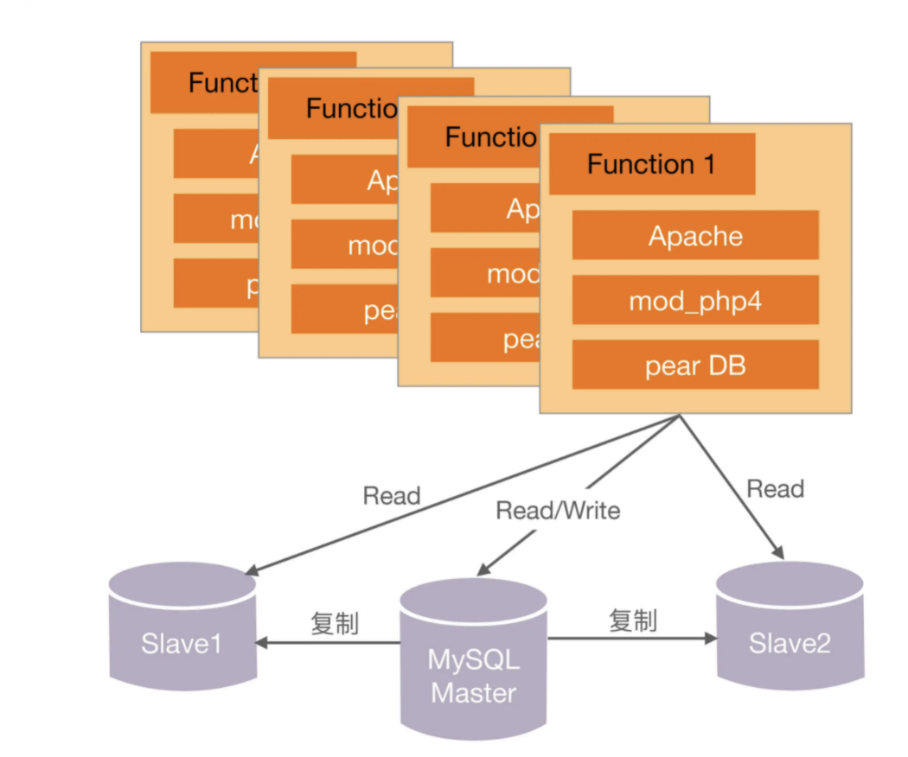

#### Oracle/支付宝/旺旺

淘宝网推出后，由于正好碰到“非典”，网购很火爆，加上采取了成功的市场运作，流量和交易量迅速上涨，业务发展很快，在 2003 年底，MySQL 已经撑不住了。

一般人或者团队在这个时候，可能就开始优化系统、优化架构、分拆业务了，因为这些是大家耳熟能详也很拿手的动作。那我们来看看淘宝这个时候怎么采取的措施：技术的替代方案非常简单，就是换成 Oracle。换 Oracle 的原因除了它容量大、稳定、安全、性能高，还有人才方面的原因。

除了购买 Oracle，后来为了优化，又买了更强大的存储：后来数据量变大了，本地存储不行了。买了 NAS（Network Attached Storage，网络附属存储），NetApp 的 NAS 存储作为了数据库的存储设备，加上 Oracle RAC（Real Application Clusters，实时应用集群）来实现负载均衡。

为什么淘宝在这个时候继续采取“买”的方式来快速解决问题呢？我们可以从时间上看出端倪：此时离刚上线才半年不到，业务飞速发展，最快的方式支撑业务的发展还是去买。如果说第一阶段买的是“方案”，这个阶段买的就是“性能”，这里架构设计和选择主要遵循的还是“合适原则”和“简单原则”。

第二代技术架构：

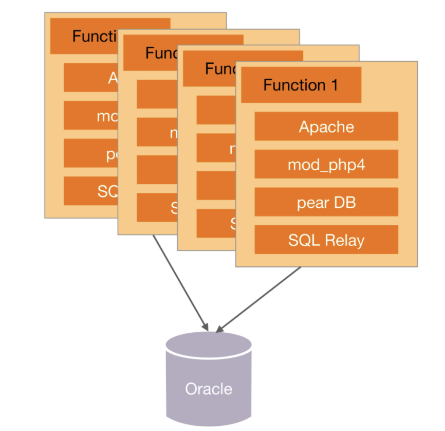

#### 脱胎换骨的 Java 时代 1.0

淘宝切换到 Java 的原因很有趣，主要因为找了一个 PHP 的开源连接池 SQL Relay 连接到 Oracle，而这个代理经常死锁，死锁了就必须重启，而数据库又必须用 Oracle，于是决定换个开发语言。最后淘宝挑选了 Java，而且当时挑选 Java，也是请 Sun 公司的人，这帮人很厉害，先是将淘宝网站从 PHP 热切换到了 Java，后来又做了支付宝。

这次切换的最主要原因是因为技术影响了业务的发展，频繁的死锁和重启对用户业务产生了严重的影响，从业务的角度来看这是不得不解决的技术问题。

最初选择 SQL Relay 的原因：但对于 PHP 语言来说，它是放在 Apache 上的，每一个请求都会对数据库产生一个连接，它没有连接池这种功能（Java 语言有 Servlet 容器，可以存放连接池）。那如何是好呢？这帮人打探到 eBay 在 PHP 下面用了一个连接池的工具，是 BEA 卖给他们的。我们知道 BEA 的东西都很贵，我们买不起，于是多隆在网上寻寻觅觅，找到一个开源的连接池代理服务 SQL Relay。

不清楚当时到底有多贵，Oracle 都可以买，连接池买不起 ？所以个人感觉这次切换语言，更多是为以后业务发展做铺垫，毕竟当时 PHP 语言远远没有 Java 那么火、那么好招人。淘宝选择 Java 语言的理由可以从侧面验证这点：Java 是当时最成熟的网站开发语言，它有比较良好的企业开发框架，被世界上主流的大规模网站普遍采用，另外有 Java 开发经验的人才也比较多，后续维护成本会比较低。

综合来看，这次架构的变化没有再简单通过“买”来解决，而是通过重构来解决，架构设计和选择遵循了“演化原则”。

第三代技术架构：

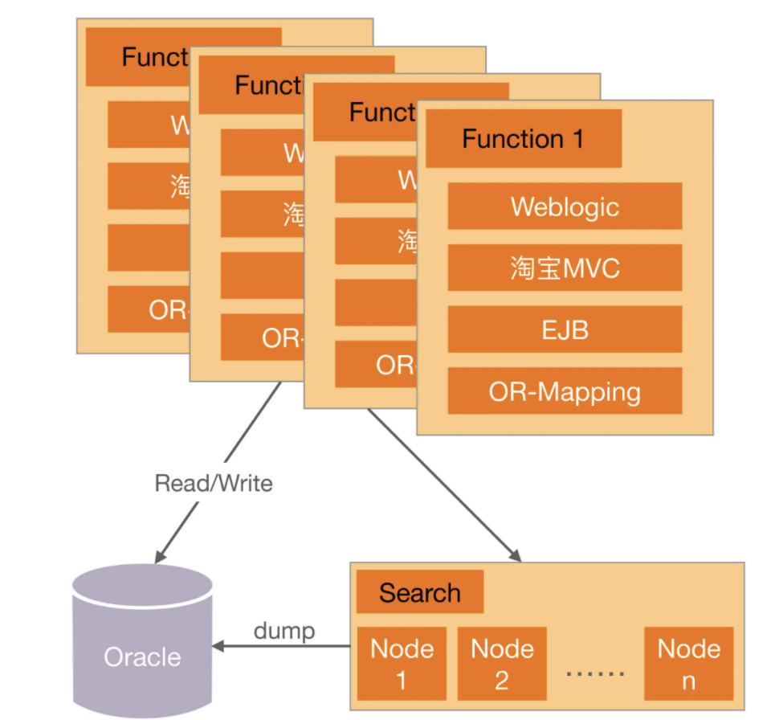

#### 坚若磐石的 Java 时代 2.0

Java 时代 2.0，淘宝做了很多优化工作：数据分库、放弃 EJB、引入 Spring、加入缓存、加入 CDN、采用开源的 JBoss。

为什么在这个时候要做这些动作？原文作者很好地概括了做这些动作的原因：这些杂七杂八的修改，对数据分库、放弃 EJB、引入 Spring、加入缓存、加入 CDN、采用开源的 JBoss，看起来没有章法可循，其实都是围绕着提高容量、提高性能、节约成本来做的。

此时的业务发展情况是这样的：随着数据量的继续增长，到了 2005 年，商品数有 1663 万，PV 有 8931 万，注册会员有 1390 万，这给数据和存储带来的压力依然很大，数据量大，性能就慢。所以“买”也搞不定了。

原有的方案存在固有缺陷，随着业务的发展，已经不是靠“买”就能够解决问题了，此时必须从整个架构上去进行调整和优化。比如说 Oracle 再强大，在做 like 类搜索的时候，也不可能做到纯粹的搜索系统如 Solr、Sphinx 等的性能，因为这是机制决定的。

另外，随着规模的增大，纯粹靠买的一个典型问题开始成为重要的考虑因素，那就是成本。当买一台两台 Oracle 的时候，可能对成本并不怎么关心，但如果要买 100 台 Oracle，成本就是一个关键因素了。这就是“量变带来质变”的一个典型案例，业务和系统发生质变后，架构设计遵循“演化原则”的思想，需要再一次重构甚至重写。

第四代技术架构：

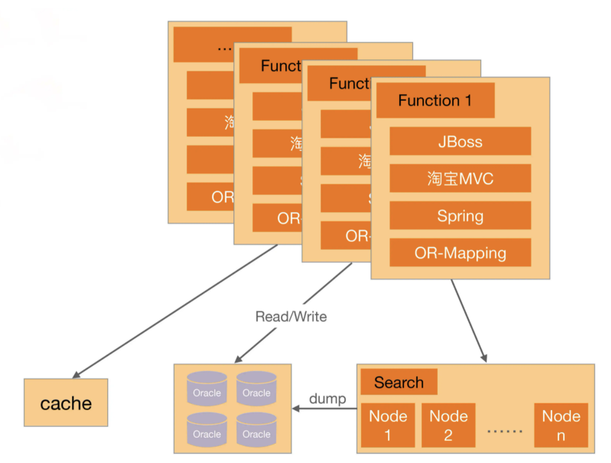

#### Java 时代 3.0 和分布式时代

Java 时代 3.0 个人认为是淘宝技术飞跃的开始，简单来说就是淘宝技术从商用转为“自研”，典型的就是去 IOE 化。分布式时代个人认为是淘宝技术的修炼成功，到了这个阶段，自研技术已经自成一派，除了支撑本身的海量业务，也开始影响整个互联网的技术发展。

到了这个阶段，业务规模急剧上升后，原来并不是主要复杂度的 IOE 成本开始成为了主要的问题，因此通过自研系统来降低 IOE 的成本，去 IOE 也是系统架构的再一次演化。

### 手机QQ

注：以下部分内容摘自《QQ 1.4 亿在线背后的故事》。

手机 QQ 的发展历程按照用户规模可以粗略划分为 4 个阶段：十万级、百万级、千万级、亿级，不同的用户规模，IM 后台的架构也不同，而且基本上都是用户规模先上去，然后产生各种问题，倒逼技术架构升级。

#### 十万级 IM 1.X

最开始的手机 QQ 后台只有接入服务器和存储服务器，可以说是简单得不能再简单、普通得不能再普通的一个架构了，因为当时业务刚开始，架构设计遵循的是“合适原则”和“简单原则”。

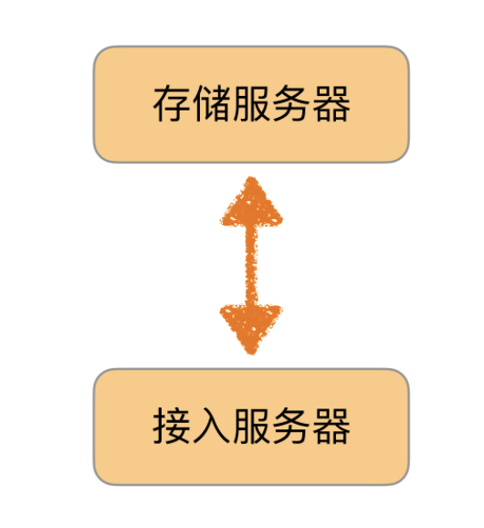

#### 百万级 IM 2.X

随着业务发展到 2001 年，QQ 同时在线人数也突破了一百万。第一代架构很简单，明显不可能支撑百万级的用户规模，主要的问题有：

1、以接入服务器的内存为例，单个在线用户的存储量约为 2KB，索引和在线状态为 50 字节，好友表 400 个好友 × 5 字节 / 好友 = 2000 字节，大致来说，2GB 内存只能支持一百万在线用户。

2、CPU/ 网卡包量和流量 / 交换机流量等瓶颈。

3、单台服务器支撑不下所有在线用户 / 注册用户。

于是针对这些问题做架构改造，按照“演化原则”的指导进行了重构，重构的方案相比现在来说也还是简单得多，因此当时做架构设计时也遵循了“合适原则”和“简单原则”。IM 2.X 的最终架构如图所示。

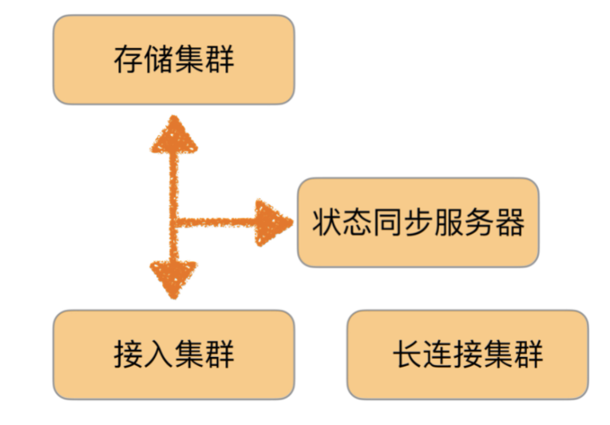

#### 千万级 IM 3.X

业务发展到 2005 年，QQ 同时在线人数突破了一千万。第二代架构支撑百万级用户是没问题的，但支撑千万级用户又会产生新问题，表现有：

1、同步流量太大，状态同步服务器遇到单机瓶颈。

2、所有在线用户的在线状态信息量太大，单台接入服务器存不下，如果在线数进一步增加，甚至单台状态同步服务器也存不下。

3、单台状态同步服务器支撑不下所有在线用户。

4、单台接入服务器支撑不下所有在线用户的在线状态信息。

针对这些问题，架构需要继续改造升级，再一次“演化”。IM 3.X 的最终架构如下图，可以看到这次的方案相比之前的方案来说并不简单了，这是业务特性决定的。

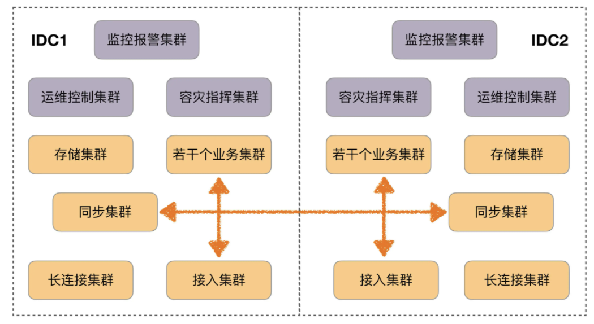

#### 亿级 IM 4.X

业务发展到 2010 年 3 月，QQ 同时在线人数过亿。第三代架构此时也不适应了，主要问题有：

1、灵活性很差，比如“昵称”长度增加一半，需要两个月；增加“故乡”字段，需要两个月；最大好友数从 500 变成 1000，需要三个月。

4、无法支撑某些关键功能，比如好友数上万、隐私权限控制、PC QQ 与手机 QQ 不可互踢、微信与 QQ 互通、异地容灾。

除了不适应，还有一个更严重的问题：

IM 后台从 1.0 到 3.5 都是在原来基础上做改造升级的，但是持续打补丁已经难以支撑亿级在线，IM 后台 4.0 必须从头开始，重新设计实现！

这里再次遵循了“演化原则”，决定重新打造一个这么复杂的系统。

重新设计的 IM 4.0 架构如图所示，和之前的架构相比，架构本身都拆分为两个主要的架构：存储架构和通信架构。

存储架构

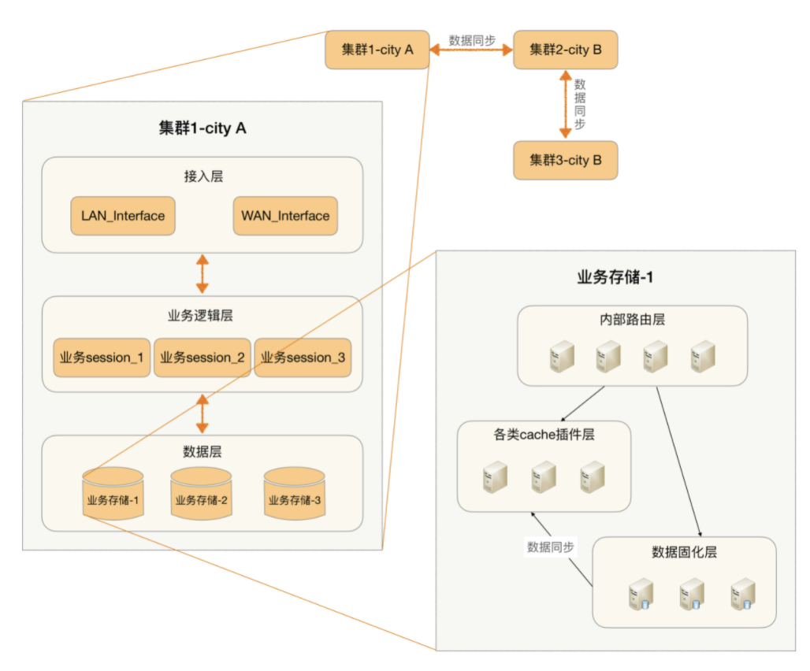

通讯架构

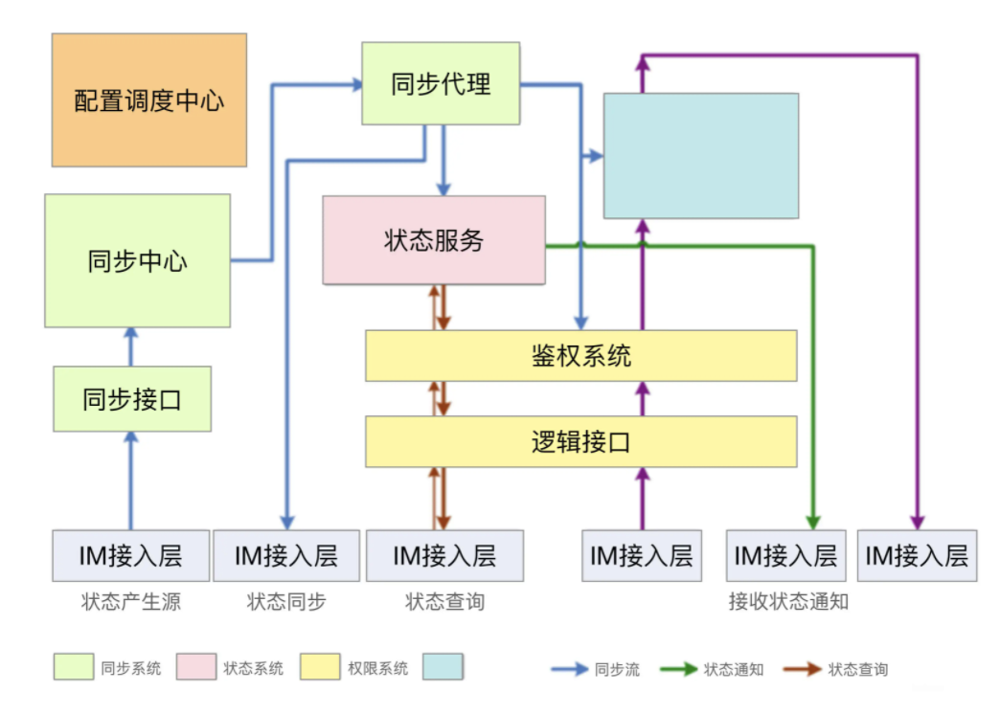

## 架构设计流程：识别复杂度

架构设计的本质目的是为了解决软件系统的复杂性，所以在我们设计架构时，首先就要分析系统的复杂性。只有正确分析出了系统的复杂性，后续的架构设计方案才不会偏离方向；否则，如果对系统的复杂性判断错误，即使后续的架构设计方案再完美再先进，都是南辕北辙，做的越好，错的越多、越离谱。

正确的做法是将主要的复杂度问题列出来，然后根据业务、技术、团队等综合情况进行排序，优先解决当前面临的最主要的复杂度问题。

### 识别复杂度实战

假想一个创业公司，名称叫作“前浪微博”。前浪微博的业务发展很快，系统也越来越多，系统间协作的效率很低，例如：

1、用户发一条微博后，微博子系统需要通知审核子系统进行审核，然后通知统计子系统进行统计，再通知广告子系统进行广告预测，接着通知消息子系统进行消息推送……一条微博有十几个通知，目前都是系统间通过接口调用的。每通知一个新系统，微博子系统就要设计接口、进行测试，效率很低，问题定位很麻烦，经常和其他子系统的技术人员产生分岐，微博子系统的开发人员不胜其烦。

2、用户等级达到 VIP 后，等级子系统要通知福利子系统进行奖品发放，要通知客服子系统安排专属服务人员，要通知商品子系统进行商品打折处理……等级子系统的开发人员也是不胜其烦。

新来的架构师在梳理这些问题时，结合自己的经验，敏锐地发现了这些问题背后的根源在于架构上各业务子系统强耦合，而消息队列系统正好可以完成子系统的解耦，于是提议要引入消息队列系统。经过一分析二讨论三开会四汇报五审批等一系列操作后，消息队列系统终于立项了。其他背景信息还有：

1、中间件团队规模不大，大约 6 人左右。

2、中间件团队熟悉 Java 语言，但有一个新同事 C/C++ 很牛。

3、开发平台是 Linux，数据库是 MySQL。

4、目前整个业务系统是单机房部署，没有双机房。

针对前浪微博的消息队列系统，采用“排查法”来分析复杂度，具体分析过程是：

#### 是否需要高性能

假设前浪微博系统用户每天发送 1000 万条微博，那么微博子系统一天会产生 1000 万条消息，我们再假设平均一条消息有 10 个子系统读取，那么其他子系统读取的消息大约是 1 亿次。

1000 万和 1 亿看起来很吓人，但对于架构师来说，关注的不是一天的数据，而是 1 秒的数据，即 TPS 和 QPS。我们将数据按照秒来计算，一天内平均每秒写入消息数为 115 条，每秒读取的消息数是 1150 条；再考虑系统的读写并不是完全平均的，设计的目标应该以峰值来计算。峰值一般取平均值的 3 倍，那么消息队列系统的 TPS 是 345，QPS 是 3450，这个量级的数据意味着并不要求高性能。

虽然根据当前业务规模计算的性能要求并不高，但业务会增长，因此系统设计需要考虑一定的性能余量。由于现在的基数较低，为了预留一定的系统容量应对后续业务的发展，我们将设计目标设定为峰值的 4 倍，因此最终的性能要求是：TPS 为 1380，QPS 为 13800。TPS 为 1380 并不高，但 QPS 为 13800 已经比较高了，因此高性能读取是复杂度之一。注意，这里的设计目标设定为峰值的 4 倍是根据业务发展速度来预估的，不是固定为 4 倍，不同的业务可以是 2 倍，也可以是 8 倍，但一般不要设定在 10 倍以上，更不要一上来就按照 100 倍预估。

#### 是否需要高可用性

对于微博子系统来说，如果消息丢了，导致没有审核，然后触犯了国家法律法规，则是非常严重的事情；对于等级子系统来说，如果用户达到相应等级后，系统没有给他奖品和专属服务，则 VIP 用户会很不满意，导致用户流失从而损失收入，虽然也比较关键，但没有审核子系统丢消息那么严重。

综合来看，消息队列需要高可用性，包括消息写入、消息存储、消息读取都需要保证高可用性。

#### 是否需要高可扩展性

消息队列的功能很明确，基本无须扩展，因此可扩展性不是这个消息队列的复杂度关键。

为了方便理解，这里只排查“高性能”“高可用”“扩展性”这 3 个复杂度，在实际应用中，不同的公司或者团队，可能还有一些其他方面的复杂度分析。例如，金融系统可能需要考虑安全性，有的公司会考虑成本等。

## 架构设计流程：设计备选方案

虽然软件技术经过几十年的发展，新技术层出不穷，但是经过时间考验，已经被各种场景验证过的成熟技术其实更多。例如，高可用的主备方案、集群方案，高性能的负载均衡、多路复用，可扩展的分层、插件化等技术，绝大部分时候我们有了明确的目标后，按图索骥就能够找到可选的解决方案。

只有当这种方式完全无法满足需求的时候，才会考虑进行方案的创新，而事实上方案的创新绝大部分情况下也都是基于已有的成熟技术。

NoSQL：Key-Value 的存储和数据库的索引其实是类似的，Memcache 只是把数据库的索引独立出来做成了一个缓存系统。

Hadoop 大文件存储方案，基础其实是集群方案 + 数据复制方案。

Docker 虚拟化，基础是 LXC（Linux Containers）。

LevelDB 的文件存储结构是 Skip List。

第一种常见的错误：设计最优秀的方案。

第二种常见的错误：只做一个方案。

合理的做法：

1、备选方案的数量以 3 ~ 5 个为最佳。

2、备选方案的差异要比较明显。

3、备选方案的技术不要只局限于已经熟悉的技术。

第三种常见的错误：备选方案过于详细。

弊端显而易见：

1、耗费了大量的时间和精力。

2、将注意力集中到细节中，忽略了整体的技术设计，导致备选方案数量不够或者差异不大。

3、评审的时候其他人会被很多细节给绕进去，评审效果很差。例如针对某个定时器应该是 1 分钟还是 30 秒，争论得不可开交。

正确的做法是备选阶段关注的是技术选型，而不是技术细节，技术选型的差异要比较明显。例如，采用 ZooKeeper 和 Keepalived 两种不同的技术来实现主备，差异就很大；而同样都采用 ZooKeeper，一个方案的节点设计是 /service/node/master，另一个方案的节点设计是 /company/service/master，这两个方案并无明显差异，无须在备选方案设计阶段作为两个不同的备选方案，至于节点路径究竟如何设计，只要在最终的方案中挑选一个进行细化即可。

### 设计备选方案实战

回到“前浪微博”的场景，之前通过“排查法”识别了消息队列的复杂性主要体现在：高性能消息读取、高可用消息写入、高可用消息存储、高可用消息读取。接下来进行第 2 步，设计备选方案。

1、备选方案 1：采用开源的 Kafka

Kafka 是成熟的开源消息队列方案，功能强大，性能非常高，而且已经比较成熟，很多大公司都在使用。

2、备选方案 2：集群 + MySQL 存储

简单描述一下方案：

1、采用数据分散集群的架构，集群中的服务器进行分组，每个分组存储一部分消息数据。

2、每个分组包含一台主 MySQL 和一台备 MySQL，分组内主备数据复制，分组间数据不同步。

3、正常情况下，分组内的主服务器对外提供消息写入和消息读取服务，备服务器不对外提供服务；主服务器宕机的情况下，备服务器对外提供消息读取的服务。

4、客户端采取轮询的策略写入和读取消息。

3、备选方案 3：集群 + 自研存储方案

在备选方案 2 的基础上，将 MySQL 存储替换为自研实现存储方案，因为 MySQL 的关系型数据库的特点并不是很契合消息队列的数据特点，参考 Kafka 的做法，可以自己实现一套文件存储和复制方案（此处省略具体的方案描述，实际设计时需要给出方案）

## 架构设计流程：评估和选择备选方案

在完成备选方案设计后，如何挑选出最终的方案也是一个很大的挑战，主要原因有：

1、每个方案都是可行的，如果方案不可行就根本不应该作为备选方案。

2、没有哪个方案是完美的。例如，A 方案有性能的缺点，B 方案有成本的缺点，C 方案有新技术不成熟的风险。

3、评价标准主观性比较强，比如设计师说 A 方案比 B 方案复杂，但另外一个设计师可能会认为差不多，因为比较难将“复杂”一词进行量化。因此，方案评审的时候经常会遇到几个设计师针对某个方案或者某个技术点争论得面红耳赤。

正因为选择备选方案存在这些困难，所以实践中很多设计师或者架构师就采取了下面几种指导思想：

1、最简派

2、最牛派

3、最熟派

4、领导派

前面提到了那么多指导思想，真正应该选择是“360 度环评”！具体的操作方式为：**列出需要关注的质量属性点，然后分别从这些质量属性的维度去评估每个方案，再综合挑选适合当时情况的最优方案。**

常见的方案质量属性点有：**性能、可用性、硬件成本、项目投入、复杂度、安全性、可扩展性**等。在评估这些质量属性时，需要遵循架构设计原则 1“合适原则”和原则 2“简单原则”，避免贪大求全，基本上某个质量属性能够满足一定时期内业务发展就可以了。

有时候量变会引起质变，如团队人员增多，在同一个系统上开发效率会变低。单集群机房设计不满足业务需求了，需要升级为异地多活的架构。引入开源方案工作量小，但是可运维性和可扩展性差；自研工作量大，但是可运维和可维护性好；使用 C 语言开发性能高，但是目前团队 C 语言技术积累少；使用 Java 技术积累多，但是性能没有 C 语言开发高，成本会高一些……诸如此类。

面临这种选择上的困难，有几种看似正确但实际错误的做法。

1、数量对比法：简单地看哪个方案的优点多就选哪个。

这种方案主要的问题在于把所有质量属性的重要性等同，而没有考虑质量属性的优先级。例如，对于 BAT 这类公司来说，方案的成本都不是问题，可用性和可扩展性比成本要更重要得多；但对于创业公司来说，成本可能就会变得很重要。

2、加权法

这种方案主要的问题是无法客观地给出每个质量属性的权重得分。

正确的做法是按优先级选择，即架构师综合当前的业务发展情况、团队人员规模和技能、业务发展预测等因素，将质量属性按照优先级排序，首先挑选满足第一优先级的，如果方案都满足，那就再看第二优先级……以此类推。

### 评估和选择备选方案实战

再回到之前设计的场景“前浪微博”。针对上期提出的 3 个备选方案，架构师组织了备选方案评审会议，参加的人有研发、测试、运维、还有几个核心业务的主管。

1、备选方案 1：采用开源 Kafka 方案

2、备选方案 2：集群 + MySQL 存储

3、备选方案 3：集群 + 自研存储系统

针对 3 个备选方案的讨论初步完成后，架构师列出了 3 个方案的 360 度环评表：

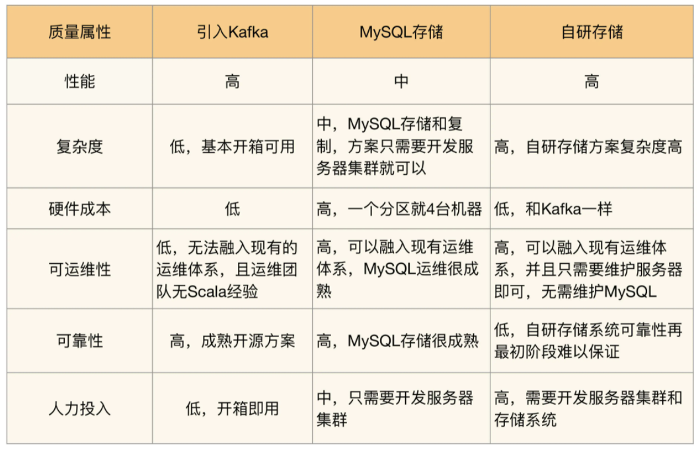

列出这个表格后，无法一眼看出具体哪个方案更合适，于是大家都把目光投向架构师，决策的压力现在集中在架构师身上了。

架构师经过思考后，给出了最终选择备选方案 2，原因有：

1、排除备选方案 1 的主要原因是可运维性，因为再成熟的系统，上线后都可能出问题，如果出问题无法快速解决，则无法满足业务的需求；并且 Kafka 的主要设计目标是高性能日志传输，而我们的消息队列设计的主要目标是业务消息的可靠传输。

2、排除备选方案 3 的主要原因是复杂度，目前团队技术实力和人员规模（总共 6 人，还有其他中间件系统需要开发和维护）无法支撑自研存储系统（参考架构设计原则 2：简单原则）。

3、备选方案 2 的优点就是复杂度不高，也可以很好地融入现有运维体系，可靠性也有保障。

针对备选方案 2 的缺点，架构师解释是：

1、备选方案 2 的第一个缺点是性能，业务目前需要的性能并不是非常高，方案 2 能够满足，即使后面性能需求增加，方案 2 的数据分组方案也能够平行扩展进行支撑（参考架构设计原则 3：演化原则）。

2、备选方案 2 的第二个缺点是成本，一个分组就需要 4 台机器，支撑目前的业务需求可能需要 12 台服务器，但实际上备机（包括服务器和数据库）主要用作备份，可以和其他系统并行部署在同一台机器上。

3、备选方案 2 的第三个缺点是技术上看起来并不很优越，但我们的设计目的不是为了证明自己（参考架构设计原则 1：合适原则），而是更快更好地满足业务需求。

通过这个案例可以看出，备选方案的选择和很多因素相关，并不单单考虑性能高低、技术是否优越这些纯技术因素。业务的需求特点、运维团队的经验、已有的技术体系、团队人员的技术水平都会影响备选方案的选择。因此，同样是上述 3 个备选方案，有的团队会选择引入 Kafka（例如，很多创业公司的初创团队，人手不够，需要快速上线支撑业务），有的会选择自研存储系统（例如，阿里开发了 RocketMQ，人多力量大，业务复杂是主要原因）。

## 架构设计流程：详细方案设计

简单来说，详细方案设计就是将方案涉及的关键技术细节给确定下来。

1、假如我们确定使用 Elasticsearch 来做全文搜索，那么就需要确定 Elasticsearch 的索引是按照业务划分，还是一个大索引就可以了；副本数量是 2 个、3 个还是 4 个，集群节点数量是 3 个还是 6 个等。

2、假如我们确定使用 MySQL 分库分表，那么就需要确定哪些表要分库分表，按照什么维度来分库分表，分库分表后联合查询怎么处理等。

3、假如我们确定引入 Nginx 来做负载均衡，那么 Nginx 的主备怎么做，Nginx 的负载均衡策略用哪个（权重分配？轮询？ip_hash？）等。

可以看到，详细设计方案里面其实也有一些技术点和备选方案类似。例如，Nginx 的负载均衡策略，备选有轮询、权重分配、ip_hash、fair、url_hash 五个，具体选哪个呢？看起来和备选方案阶段面临的问题类似，但实际上这里的技术方案选择是很轻量级的，我们无须像备选方案阶段那样操作，而只需要简单根据这些技术的适用场景选择就可以了。

**详细设计方案阶段可能遇到的一种极端情况就是在详细设计阶段发现备选方案不可行，一般情况下主要的原因是备选方案设计时遗漏了某个关键技术点或者关键的质量属性。**例如一个项目，在备选方案阶段确定是可行的，但在详细方案设计阶段，发现由于细节点太多，方案非常庞大，整个项目可能要开发长达 1 年时间，最后只得废弃原来的备选方案，重新调整项目目标、计划和方案。这个项目的主要失误就是在备选方案评估时忽略了**开发周期**这个质量属性。

幸运的是，这种情况可以通过下面方式有效地避免：

1、架构师不但要进行备选方案设计和选型，还需要对备选方案的关键细节有较深入的理解。

2、通过分步骤、分阶段、分系统等方式，尽量降低方案复杂度，方案本身的复杂度越高，某个细节推翻整个方案的可能性就越高，适当降低复杂性，可以减少这种风险。

3、如果方案本身就很复杂，那就采取设计团队的方式来进行设计，博采众长，汇集大家的智慧和经验，防止只有 1~2 个架构师可能出现的思维盲点或者经验盲区。

### 详细方案设计实战

下面针对上面的“前浪微博”列出一些备选方案 2 典型的需要细化的设计点供参考。

#### 数据库表如何设计

1、数据库设计两类表，一类是日志表，用于消息写入时快速存储到 MySQL 中；另一类是消息表，每个消息队列一张表。

2、业务系统发布消息时，首先写入到日志表，日志表写入成功就代表消息写入成功；后台线程再从日志表中读取消息写入记录，将消息内容写入到消息表中。

3、业务系统读取消息时，从消息表中读取。

4、日志表表名为 MQ_LOG，包含的字段：日志 ID、发布者信息、发布时间、队列名称、消息内容。

5、消息表表名就是队列名称，包含的字段：消息 ID（递增生成）、消息内容、消息发布时间、消息发布者。

6、日志表需要及时清除已经写入消息表的日志数据，消息表最多保存 30 天的消息数据。

#### 数据如何复制

直接采用 MySQL 主从复制即可，只复制消息存储表，不复制日志表。

#### 主备服务器如何倒换

采用 ZooKeeper 来做主备决策，主备服务器都连接到 ZooKeeper 建立自己的节点，主服务器的路径规则为“/MQ/server/ 分区编号 /master”，备机为“/MQ/server/ 分区编号 /slave”，节点类型为 EPHEMERAL。

备机监听主机的节点消息，当发现主服务器节点断连后，备服务器修改自己的状态，对外提供消息读取服务。

#### 业务服务器如何写入消息

1、消息队列系统设计两个角色：生产者和消费者，每个角色都有唯一的名称。

2、消息队列系统提供 SDK 供各业务系统调用，SDK 从配置中读取所有消息队列系统的服务器信息，SDK 采取轮询算法发起消息写入请求给主服务器。如果某个主服务器无响应或者返回错误，SDK 将发起请求发送到下一台服务器。

#### 业务服务器如何读取消息

1、消息队列系统提供 SDK 供各业务系统调用，SDK 从配置中读取所有消息队列系统的服务器信息，轮流向所有服务器发起消息读取请求。

2、消息队列服务器需要记录每个消费者的消费状态，即当前消费者已经读取到了哪条消息，当收到消息读取请求时，返回下一条未被读取的消息给消费者。

#### 业务和消息队列之间的通信协议如何设计

考虑到消息队列系统后续可能会对接多种不同编程语言编写的系统，为了提升兼容性，传输协议用 TCP，数据格式为 ProtocolBuffer。

当然还有更多设计细节就不再一一列举，因此这还不是一个完整的设计方案，我希望可以通过这些具体实例来说明细化方案具体如何去做。
