## 高性能数据集群-读写分离

大部分情况下，我们做架构设计主要都是基于已有的成熟模式，结合业务和团队的具体情况，进行一定的优化或者调整；即使少部分情况我们需要进行较大的创新，前提也是需要对已有的各种架构模式和技术非常熟悉。

虽然近十年来各种存储技术飞速发展，但关系数据库由于其 ACID 的特性和功能强大的 SQL 查询，目前还是各种业务系统中关键和核心的存储系统，很多场景下高性能的设计最核心的部分就是关系数据库的设计。

不管是为了满足业务发展的需要，还是为了提升自己的竞争力，关系数据库厂商（Oracle、DB2、MySQL 等）在优化和提升单个数据库服务器的性能方面也做了非常多的技术优化和改进。但业务发展速度和数据增长速度，远远超出数据库厂商的优化速度，尤其是互联网业务兴起之后，海量用户加上海量数据的特点，单个数据库服务器已经难以满足业务需要，必须考虑数据库集群的方式来提升性能。

高性能数据库集群的第一种方式是“读写分离”，其本质是将访问压力分散到集群中的多个节点，但是没有分散存储压力；第二种方式是“分库分表”，既可以分散访问压力，又可以分散存储压力。

### 读写分离原理

**读写分离的基本原理是将数据库读写操作分散到不同的节点上。**

基本架构图如下：

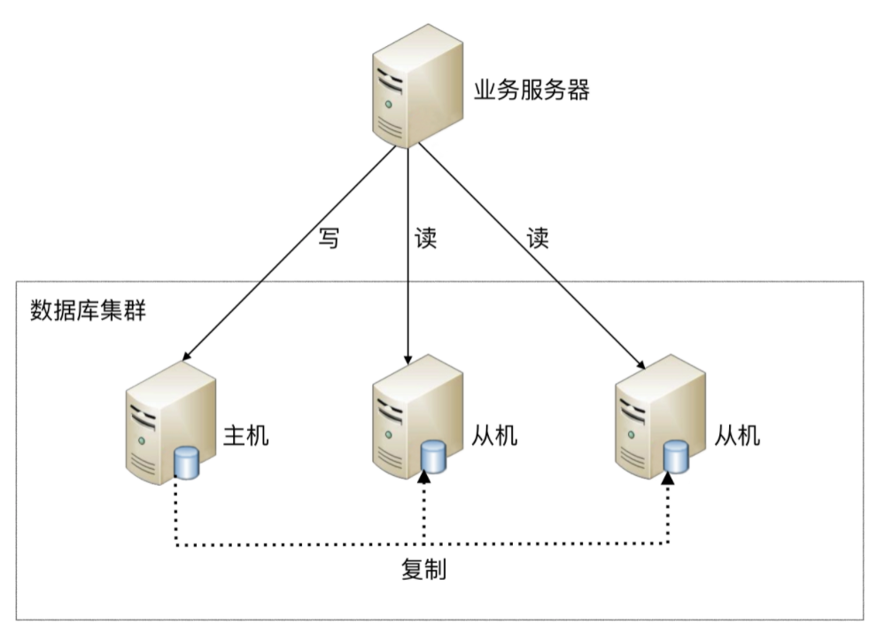

读写分离的基本实现是：

* 数据库服务器搭建主从集群，一主一从、一主多从都可以。
* 数据库主机负责读写操作，从机只负责读操作。
* 数据库主机通过复制将数据同步到从机，每台数据库服务器都存储了所有的业务数据。
* 业务服务器将写操作发给数据库主机，将读操作发给数据库从机。

需要注意的是，这里用的是“主从集群”，而不是“主备集群”。“从机”的“从”可以理解为“仆从”，仆从是要帮主人干活的，“从机”是需要提供读数据的功能的；而“备机”一般被认为仅仅提供备份功能，不提供访问功能。所以使用“主从”还是“主备”，是要看场景的，这两个词并不是完全等同的。

读写分离的实现逻辑并不复杂，但有两个细节点将引入设计复杂度：**主从复制延迟**和**分配机制**。

### 复制延迟

以 MySQL 为例，主从复制延迟可能达到 1 秒，如果有大量数据同步，延迟 1 分钟也是有可能的。主从复制延迟会带来业务上的问题。

解决主从复制延迟有几种常见的方法：

1、写操作后的读操作指定发给数据库主服务器

2、读从机失败后再读一次主机

这就是通常所说的“二次读取”，二次读取和业务无绑定，只需要对底层数据库访问的 API 进行封装即可，实现代价较小，不足之处在于如果有很多二次读取，将大大增加主机的读操作压力。例如，黑客暴力破解账号，会导致大量的二次读取操作，主机可能顶不住读操作的压力从而崩溃。

3、关键业务读写操作全部指向主机，非关键业务采用读写分离

### 分配机制

将读写操作区分开来，然后访问不同的数据库服务器，一般有两种方式：**程序代码封装**和**中间件封装**。

1、程序代码封装

程序代码封装指在代码中抽象一个数据访问层（所以有的文章也称这种方式为“中间层封装”），实现读写操作分离和数据库服务器连接的管理。例如，基于 Hibernate 进行简单封装，就可以实现读写分离，基本架构是：

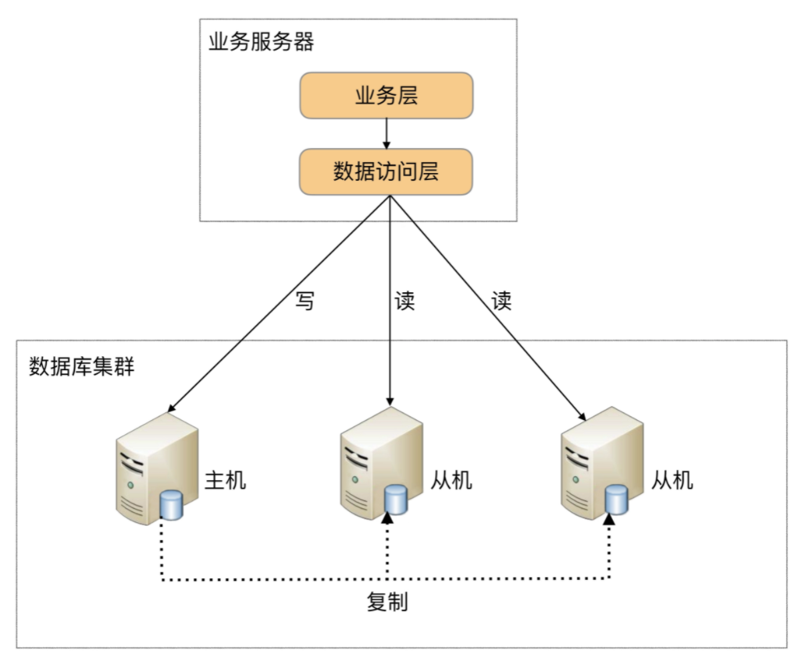

程序代码封装的方式具备几个特点：

* 实现简单，而且可以根据业务做较多定制化的功能。
* 每个编程语言都需要自己实现一次，无法通用，如果一个业务包含多个编程语言写的多个子系统，则重复开发的工作量比较大。
* 故障情况下，如果主从发生切换，则可能需要所有系统都修改配置并重启。

目前开源的实现方案中，淘宝的 TDDL（Taobao Distributed Data Layer，外号: 头都大了）是比较有名的。它是一个通用数据访问层，所有功能封装在 jar 包中提供给业务代码调用。其基本原理是一个基于集中式配置的 jdbc datasource 实现，具有主备、读写分离、动态数据库配置等功能，基本架构是：

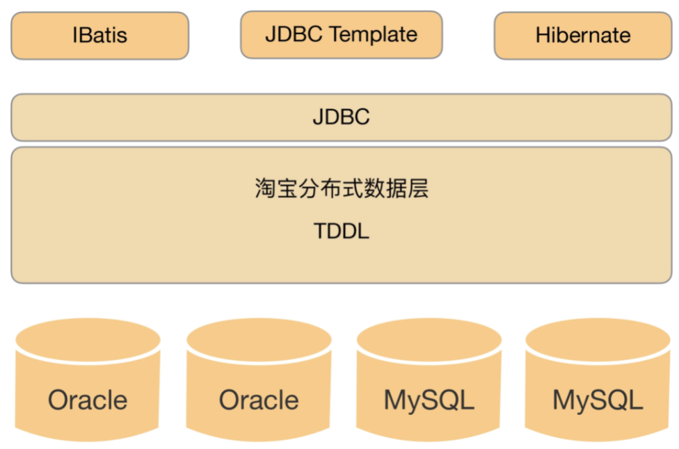

2、中间件封装

中间件封装指的是独立一套系统出来，实现读写操作分离和数据库服务器连接的管理。中间件对业务服务器提供 SQL 兼容的协议，业务服务器无须自己进行读写分离。对于业务服务器来说，访问中间件和访问数据库没有区别，事实上在业务服务器看来，中间件就是一个数据库服务器。其基本架构是：

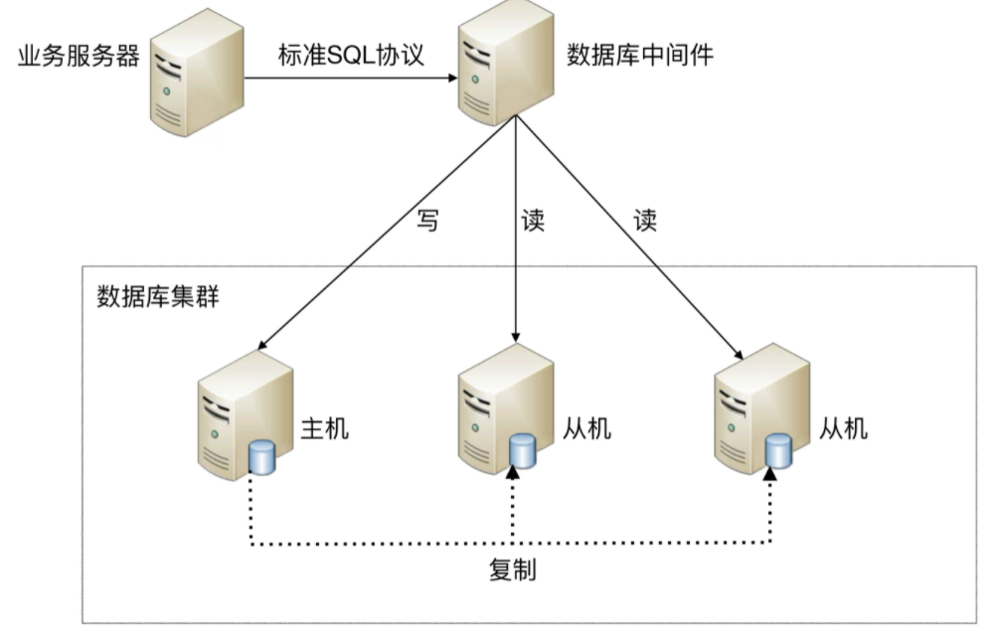

数据库中间件的方式具备的特点是：

* 能够支持多种编程语言，因为数据库中间件对业务服务器提供的是标准 SQL 接口。
* 数据库中间件要支持完整的 SQL 语法和数据库服务器的协议（例如，MySQL 客户端和服务器的连接协议），实现比较复杂，细节特别多，很容易出现 bug，需要较长的时间才能稳定。
* 数据库中间件自己不执行真正的读写操作，但所有的数据库操作请求都要经过中间件，中间件的性能要求也很高。
* 数据库主从切换对业务服务器无感知，数据库中间件可以探测数据库服务器的主从状态。例如，向某个测试表写入一条数据，成功的就是主机，失败的就是从机。

由于数据库中间件的复杂度要比程序代码封装高出一个数量级，一般情况下建议采用程序语言封装的方式，或者使用成熟的开源数据库中间件。如果是大公司，可以投入人力去实现数据库中间件，因为这个系统一旦做好，接入的业务系统越多，节省的程序开发投入就越多，价值也越大。

目前的开源数据库中间件方案中，MySQL 官方先是提供了 MySQL Proxy，但 MySQL Proxy 一直没有正式 GA，现在 MySQL 官方推荐 MySQL Router。MySQL Router 的主要功能有读写分离、故障自动切换、负载均衡、连接池等，其基本架构如下：

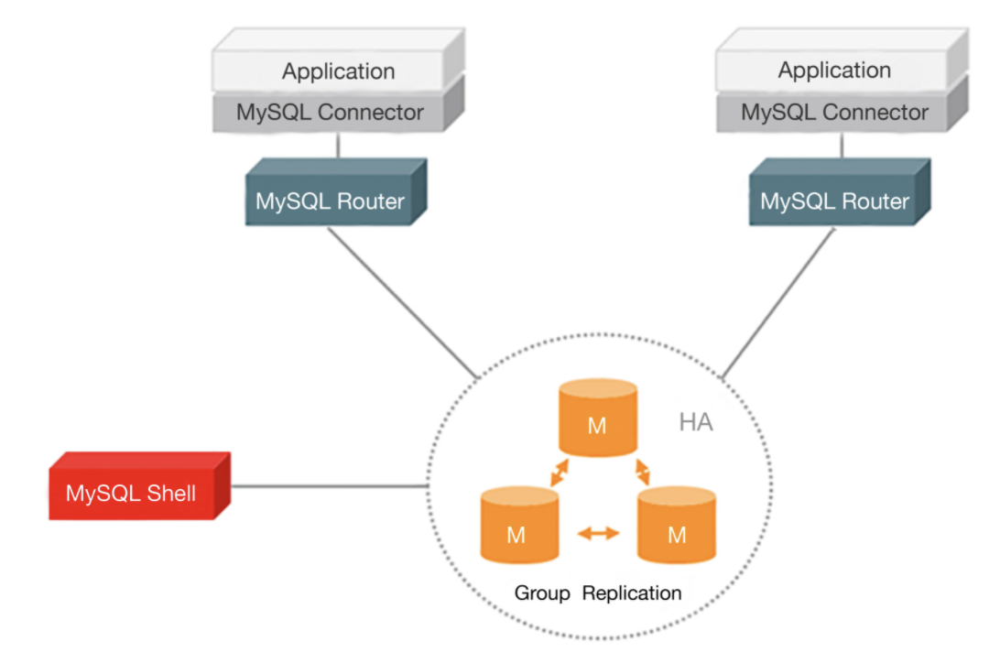

奇虎 360 公司也开源了自己的数据库中间件 Atlas，Atlas 是基于 MySQL Proxy 实现的，基本架构如下：

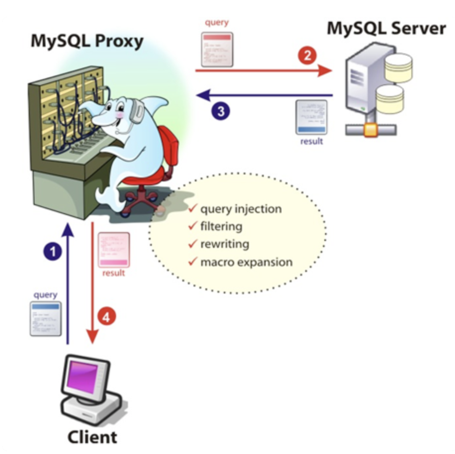

参考地址：[https://github.com/Qihoo360/Atlas/wiki/Atlas%E7%9A%84%E6%9E%B6%E6%9E%84](https://github.com/Qihoo360/Atlas/wiki/Atlas%E7%9A%84%E6%9E%B6%E6%9E%84)

## 高性能数据集群-分库分表

读写分离分散了数据库读写操作的压力，但没有分散存储压力，当数据量达到千万甚至上亿条的时候，单台数据库服务器的存储能力会成为系统的瓶颈，主要体现在这几个方面：

* 数据量太大，读写的性能会下降，即使有索引，索引也会变得很大，性能同样会下降。
* 数据文件会变得很大，数据库备份和恢复需要耗费很长时间。
* 数据文件越大，极端情况下丢失数据的风险越高（例如，机房火灾导致数据库主备机都发生故障）。

基于上述原因，单个数据库服务器存储的数据量不能太大，需要控制在一定的范围内。为了满足业务数据存储的需求，就需要将存储分散到多台数据库服务器上。

常见的分散存储的方法“分库分表”，其中包括“分库”和“分表”两大类。

### 业务分库

**业务分库指的是按照业务模块将数据分散到不同的数据库服务器。**例如，一个简单的电商网站，包括用户、商品、订单三个业务模块，我们可以将用户数据、商品数据、订单数据分开放到三台不同的数据库服务器上，而不是将所有数据都放在一台数据库服务器上。

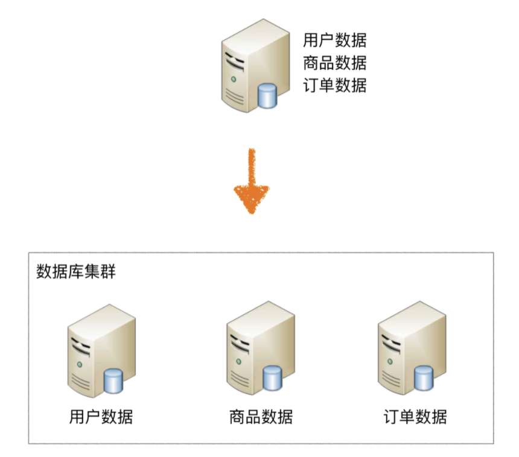

虽然业务分库能够分散存储和访问压力，但同时也带来了新的问题。

1、join 操作问题

业务分库后，原本在同一个数据库中的表分散到不同数据库中，导致无法使用 SQL 的 join 查询。

2、事务问题

原本在同一个数据库中不同的表可以在同一个事务中修改，业务分库后，表分散到不同的数据库中，无法通过事务统一修改。虽然数据库厂商提供了一些分布式事务的解决方案（例如，MySQL 的 XA），但性能实在太低，与高性能存储的目标是相违背的。

3、成本问题

业务分库同时也带来了成本的代价，本来 1 台服务器搞定的事情，现在要 3 台，如果考虑备份，那就是 2 台变成了 6 台。

基于上述原因，对于小公司初创业务，并不建议一开始就这样拆分，主要有几个原因：

* 初创业务存在很大的不确定性，业务不一定能发展起来，业务开始的时候并没有真正的存储和访问压力，业务分库并不能为业务带来价值。
* 业务分库后，表之间的 join 查询、数据库事务无法简单实现了。
* 业务分库后，因为不同的数据要读写不同的数据库，代码中需要增加根据数据类型映射到不同数据库的逻辑，增加了工作量。而业务初创期间最重要的是快速实现、快速验证，业务分库会拖慢业务节奏。

有的架构师可能会想：如果业务真的发展很快，岂不是很快就又要进行业务分库了？那为何不一开始就设计好呢？

其实这个问题很好回答，按照前面提到的“架构设计三原则”，简单分析一下。

首先，这里的“如果”事实上发生的概率比较低，做 10 个业务有 1 个业务能活下去就很不错了，更何况快速发展，和中彩票的概率差不多。如果我们每个业务上来就按照淘宝、微信的规模去做架构设计，不但会累死自己，还会害死业务。

其次，如果业务真的发展很快，后面进行业务分库也不迟。因为业务发展好，相应的资源投入就会加大，可以投入更多的人和更多的钱，那业务分库带来的代码和业务复杂的问题就可以通过增加人来解决，成本问题也可以通过增加资金来解决。

第三，单台数据库服务器的性能其实也没有想象的那么弱，一般来说，单台数据库服务器能够支撑 10 万用户量量级的业务，初创业务从 0 发展到 10 万级用户，并不是想象得那么快。

而对于业界成熟的大公司来说，由于已经有了业务分库的成熟解决方案，并且即使是尝试性的新业务，用户规模也是海量的，这与前面提到的初创业务的小公司有本质区别，因此最好在业务开始设计时就考虑业务分库。例如，在淘宝上做一个新的业务，由于已经有成熟的数据库解决方案，用户量也很大，需要在一开始就设计业务分库甚至接下来介绍的分表方案。

### 分表

将不同业务数据分散存储到不同的数据库服务器，能够支撑百万甚至千万用户规模的业务，但如果业务继续发展，同一业务的单表数据也会达到单台数据库服务器的处理瓶颈。例如，淘宝的几亿用户数据，如果全部存放在一台数据库服务器的一张表中，肯定是无法满足性能要求的，此时就需要对单表数据进行拆分。

单表数据拆分有两种方式：垂直分表和水平分表。示意图如下：

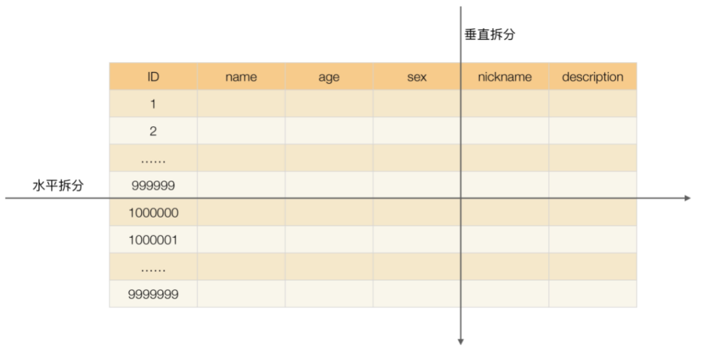

为了形象地理解垂直拆分和水平拆分的区别，可以想象手里拿着一把刀，面对一个蛋糕切一刀：

* 从上往下切就是垂直切分，因为刀的运行轨迹与蛋糕是垂直的，这样可以把蛋糕切成高度相等（面积可以相等也可以不相等）的两部分，对应到表的切分就是表记录数相同但包含不同的列。例如，示意图中的垂直切分，会把表切分为两个表，一个表包含 ID、name、age、sex 列，另外一个表包含 ID、nickname、description 列。
* 从左往右切就是水平切分，因为刀的运行轨迹与蛋糕是平行的，这样可以把蛋糕切成面积相等（高度可以相等也可以不相等）的两部分，对应到表的切分就是表的列相同但包含不同的行数据。例如，示意图中的水平切分，会把表分为两个表，两个表都包含 ID、name、age、sex、nickname、description 列，但是一个表包含的是 ID 从 1 到 999999 的行数据，另一个表包含的是 ID 从 1000000 到 9999999 的行数据。

上面这个示例比较简单，只考虑了一次切分的情况，实际架构设计过程中并不局限切分的次数，可以切两次，也可以切很多次，就像切蛋糕一样，可以切很多刀。

单表进行切分后，是否要将切分后的多个表分散在不同的数据库服务器中，可以根据实际的切分效果来确定，并不强制要求单表切分为多表后一定要分散到不同数据库中。原因在于单表切分为多表后，新的表即使在同一个数据库服务器中，也可能带来可观的性能提升，如果性能能够满足业务要求，是可以不拆分到多台数据库服务器的，毕竟我们在上面业务分库的内容看到业务分库也会引入很多复杂性的问题；如果单表拆分为多表后，单台服务器依然无法满足性能要求，那就不得不再次进行业务分库的设计了。

分表能够有效地分散存储压力和带来性能提升，但和分库一样，也会引入各种复杂性。

#### 垂直分表

垂直分表适合将表中某些不常用且占了大量空间的列拆分出去。

垂直分表引入的复杂性主要体现在表操作的数量要增加。例如，原来只要一次查询就可以获取的值现在需要两次查询。

不过相比接下来要讲的水平分表，这个复杂性就是小巫见大巫了。

#### 水平分表

水平分表适合表行数特别大的表，有的公司要求单表行数超过 5000 万就必须进行分表，这个数字可以作为参考，但并不是绝对标准，关键还是要看表的访问性能。对于一些比较复杂的表，可能超过 1000 万就要分表了；而对于一些简单的表，即使存储数据超过 1 亿行，也可以不分表。但不管怎样，当看到表的数据量达到千万级别时，作为架构师就要警觉起来，因为这很可能是架构的性能瓶颈或者隐患。

水平分表相比垂直分表，会引入更多的复杂性，主要表现在下面几个方面：

1）路由

水平分表后，某条数据具体属于哪个切分后的子表，需要增加路由算法进行计算，这个算法会引入一定的复杂性。

常见的路由算法有：

**范围路由**：选取有序的数据列（例如，整形、时间戳等）作为路由的条件，不同分段分散到不同的数据库表中。以最常见的用户 ID 为例，路由算法可以按照 1000000 的范围大小进行分段，1 ~ 999999 放到数据库 1 的表中，1000000 ~ 1999999 放到数据库 2 的表中，以此类推。

范围路由设计的复杂点主要体现在分段大小的选取上，分段太小会导致切分后子表数量过多，增加维护复杂度；分段太大可能会导致单表依然存在性能问题，一般建议分段大小在 100 万至 2000 万之间，具体需要根据业务选取合适的分段大小。

范围路由的优点是可以随着数据的增加平滑地扩充新的表。例如，现在的用户是 100 万，如果增加到 1000 万，只需要增加新的表就可以了，原有的数据不需要动。

范围路由的一个比较隐含的缺点是分布不均匀，假如按照 1000 万来进行分表，有可能某个分段实际存储的数据量只有 1000 条，而另外一个分段实际存储的数据量有 900 万条。

**Hash 路由**：选取某个列（或者某几个列组合也可以）的值进行 Hash 运算，然后根据 Hash 结果分散到不同的数据库表中。同样以用户 ID 为例，假如我们一开始就规划了 10 个数据库表，路由算法可以简单地用 user_id % 10 的值来表示数据所属的数据库表编号，ID 为 985 的用户放到编号为 5 的子表中，ID 为 10086 的用户放到编号为 6 的字表中。

Hash 路由设计的复杂点主要体现在初始表数量的选取上，表数量太多维护比较麻烦，表数量太少又可能导致单表性能存在问题。而用了 Hash 路由后，增加子表数量是非常麻烦的，所有数据都要重分布。

Hash 路由的优缺点和范围路由基本相反，Hash 路由的优点是表分布比较均匀，缺点是扩充新的表很麻烦，所有数据都要重分布。

**配置路由**：配置路由就是路由表，用一张独立的表来记录路由信息。同样以用户 ID 为例，我们新增一张 user_router 表，这个表包含 user_id 和 table_id 两列，根据 user_id 就可以查询对应的 table_id。

配置路由设计简单，使用起来非常灵活，尤其是在扩充表的时候，只需要迁移指定的数据，然后修改路由表就可以了。

配置路由的缺点就是必须多查询一次，会影响整体性能；而且路由表本身如果太大（例如，几亿条数据），性能同样可能成为瓶颈，如果我们再次将路由表分库分表，则又面临一个死循环式的路由算法选择问题。

2）join 操作

水平分表后，数据分散在多个表中，如果需要与其他表进行 join 查询，需要在业务代码或者数据库中间件中进行多次 join 查询，然后将结果合并。

3）count() 操作

水平分表后，虽然物理上数据分散到多个表中，但某些业务逻辑上还是会将这些表当作一个表来处理。例如，获取记录总数用于分页或者展示，水平分表前用一个 count() 就能完成的操作，在分表后就没那么简单了。常见的处理方式有下面两种：

**count() 相加**：具体做法是在业务代码或者数据库中间件中对每个表进行 count() 操作，然后将结果相加。这种方式实现简单，缺点就是性能比较低。例如，水平分表后切分为 20 张表，则要进行 20 次 count(*) 操作，如果串行的话，可能需要几秒钟才能得到结果。

**记录数表**：具体做法是新建一张表，假如表名为“记录数表”，包含 table_name、row_count 两个字段，每次插入或者删除子表数据成功后，都更新“记录数表”。

这种方式获取表记录数的性能要大大优于 count() 相加的方式，因为只需要一次简单查询就可以获取数据。缺点是复杂度增加不少，对子表的操作要同步操作“记录数表”，如果有一个业务逻辑遗漏了，数据就会不一致；且针对“记录数表”的操作和针对子表的操作无法放在同一事务中进行处理，异常的情况下会出现操作子表成功了而操作记录数表失败，同样会导致数据不一致。

此外，记录数表的方式也增加了数据库的写压力，因为每次针对子表的 insert 和 delete 操作都要 update 记录数表，所以对于一些不要求记录数实时保持精确的业务，也可以通过后台定时更新记录数表。定时更新实际上就是“count() 相加”和“记录数表”的结合，即定时通过 count() 相加计算表的记录数，然后更新记录数表中的数据。

4）order by 操作

水平分表后，数据分散到多个子表中，排序操作无法在数据库中完成，只能由业务代码或者数据库中间件分别查询每个子表中的数据，然后汇总进行排序。

### 实现方式

和数据库读写分离类似，分库分表具体的实现方式也是“程序代码封装”和“中间件封装”，但实现会更复杂。读写分离实现时只要识别 SQL 操作是读操作还是写操作，通过简单的判断 SELECT、UPDATE、INSERT、DELETE 几个关键字就可以做到，而分库分表的实现除了要判断操作类型外，还要判断 SQL 中具体需要操作的表、操作函数（例如 count 函数)、order by、group by 操作等，然后再根据不同的操作进行不同的处理。例如 order by 操作，需要先从多个库查询到各个库的数据，然后再重新 order by 才能得到最终的结果。

## 高性能NoSQL

关系数据库经过几十年的发展后已经非常成熟，强大的 SQL 功能和 ACID 的属性，使得关系数据库广泛应用于各式各样的系统中，但这并不意味着关系数据库是完美的，关系数据库存在如下缺点。

**1、关系数据库存储的是行记录，无法存储数据结构**

以微博的关注关系为例，“我关注的人”是一个用户 ID 列表，使用关系数据库存储只能将列表拆成多行，然后再查询出来组装，无法直接存储一个列表。

**2、关系数据库的 schema 扩展很不方便**

关系数据库的表结构 schema 是强约束，操作不存在的列会报错，业务变化时扩充列也比较麻烦，需要执行 DDL（data definition language，如 CREATE、ALTER、DROP 等）语句修改，而且修改时可能会长时间锁表（例如，MySQL 可能将表锁住 1 个小时）。

**3、关系数据库在大数据场景下 I/O 较高**

如果对一些大量数据的表进行统计之类的运算，关系数据库的 I/O 会很高，因为即使只针对其中某一列进行运算，关系数据库也会将整行数据从存储设备读入内存。

**4、关系数据库的全文搜索功能比较弱**

关系数据库的全文搜索只能使用 like 进行整表扫描匹配，性能非常低，在互联网这种搜索复杂的场景下无法满足业务要求。

针对上述问题，分别诞生了不同的 NoSQL 解决方案，这些方案与关系数据库相比，在某些应用场景下表现更好。但世上没有免费的午餐，NoSQL 方案带来的优势，本质上是牺牲 ACID 中的某个或者某几个特性，因**此不能盲目地迷信 NoSQL 是银弹，而应该将 NoSQL 作为 SQL 的一个有力补充**，NoSQL != No SQL，而是 NoSQL = Not Only SQL。

常见的 NoSQL 方案分为 4 类。

* K-V 存储：解决关系数据库无法存储数据结构的问题，以 Redis 为代表。
* 文档数据库：解决关系数据库强 schema 约束的问题，以 MongoDB 为代表。
* 列式数据库：解决关系数据库大数据场景下的 I/O 问题，以 HBase 为代表。
* 全文搜索引擎：解决关系数据库的全文搜索性能问题，以 Elasticsearch 为代表。

这里介绍一下各种高性能 NoSQL 方案的典型特征和应用场景。

### K-V 存储

K-V 存储的全称是 Key-Value 存储，其中 Key 是数据的标识，和关系数据库中的主键含义一样，Value 就是具体的数据。

Redis 是 K-V 存储的典型代表，它是一款开源（基于 BSD 许可）的高性能 K-V 缓存和存储系统。Redis 的 Value 是具体的数据结构，包括 string、hash、list、set、sorted set、bitmap 和 hyperloglog，所以常常被称为数据结构服务器。

以 List 数据结构为例，Redis 提供了下面这些典型的操作（更多请参考链接：[http://redis.cn/commands.html#list](http://redis.cn/commands.html#list)）：

* LPOP key 从队列的左边出队一个元素。
* LINDEX key index 获取一个元素，通过其索引列表。
* LLEN key 获得队列（List）的长度。
* RPOP key 从队列的右边出队一个元素。

以上这些功能，如果用关系数据库来实现，就会变得很复杂。例如，LPOP 操作是移除并返回 key 对应的 list 的第一个元素。如果用关系数据库来存储，为了达到同样目的，需要进行下面的操作：

1、每条数据除了数据编号（例如，行 ID），还要有位置编号，否则没有办法判断哪条数据是第一条。注意这里不能用行 ID 作为位置编号，因为我们会往列表头部插入数据。

2、查询出第一条数据。

3、删除第一条数据。

4、更新从第二条开始的所有数据的位置编号。

可以看出关系数据库的实现很麻烦，而且需要进行多次 SQL 操作，性能很低。

Redis 的缺点主要体现在并不支持完整的 ACID 事务，Redis 虽然提供事务功能，但 Redis 的事务和关系数据库的事务不可同日而语，Redis 的事务只能保证隔离性和一致性（I 和 C），无法保证原子性和持久性（A 和 D）。

虽然 Redis 并没有严格遵循 ACID 原则，但实际上大部分业务也不需要严格遵循 ACID 原则。以上面的微博关注操作为例，即使系统没有将 A 加入 B 的粉丝列表，其实业务影响也非常小，因此在设计方案时，需要根据业务特性和要求来确定是否可以用 Redis，而不能因为 Redis 不遵循 ACID 原则就直接放弃。

### 文档数据库

为了解决关系数据库 schema 带来的问题，文档数据库应运而生。文档数据库最大的特点就是 no-schema，可以存储和读取任意的数据。目前绝大部分文档数据库存储的数据格式是 JSON（或者 BSON），因为 JSON 数据是自描述的，无须在使用前定义字段，读取一个 JSON 中不存在的字段也不会导致 SQL 那样的语法错误。

文档数据库的 no-schema 特性，给业务开发带来了几个明显的优势。

1、新增字段简单

业务上增加新的字段，无须再像关系数据库一样要先执行 DDL 语句修改表结构，程序代码直接读写即可。

2、历史数据不会出错

对于历史数据，即使没有新增的字段，也不会导致错误，只会返回空值，此时代码进行兼容处理即可。

3、可以很容易存储复杂数据

JSON 是一种强大的描述语言，能够描述复杂的数据结构。例如，我们设计一个用户管理系统，用户的信息有 ID、姓名、性别、爱好、邮箱、地址、学历信息。其中爱好是列表（因为可以有多个爱好）；地址是一个结构，包括省市区楼盘地址；学历包括学校、专业、入学毕业年份信息等。如果我们用关系数据库来存储，需要设计多张表，包括基本信息（列：ID、姓名、性别、邮箱）、爱好（列：ID、爱好）、地址（列：省、市、区、详细地址）、学历（列：入学时间、毕业时间、学校名称、专业），而使用文档数据库，一个 JSON 就可以全部描述。

文档数据库的这个特点，特别适合电商和游戏这类的业务场景。以电商为例，不同商品的属性差异很大。例如，冰箱的属性和笔记本电脑的属性差异非常大。

文档数据库 no-schema 的特性带来的这些优势也是有代价的，最主要的代价就是不支持事务。另外一个缺点就是无法实现关系数据库的 join 操作。

### 列式数据库

顾名思义，列式数据库就是按照列来存储数据的数据库，与之对应的传统关系数据库被称为“行式数据库”，因为关系数据库是按照行来存储数据的。关系数据库按照行式来存储数据，主要有以下几个优势：

1、业务同时读取多个列时效率高，因为这些列都是按行存储在一起的，一次磁盘操作就能够把一行数据中的各个列都读取到内存中。

2、能够一次性完成对一行中的多个列的写操作，保证了针对行数据写操作的原子性和一致性；否则如果采用列存储，可能会出现某次写操作，有的列成功了，有的列失败了，导致数据不一致。

行式存储的优势是在特定的业务场景下才能体现，如果不存在这样的业务场景，那么行式存储的优势也将不复存在，甚至成为劣势，典型的场景就是海量数据进行统计。

例如，计算某个城市体重超重的人员数据，实际上只需要读取每个人的体重这一列并进行统计即可，而行式存储即使最终只使用一列，也会将所有行数据都读取出来。如果单行用户信息有 1KB，其中体重只有 4 个字节，行式存储还是会将整行 1KB 数据全部读取到内存中，这是明显的浪费。而如果采用列式存储，每个用户只需要读取 4 字节的体重数据即可，I/O 将大大减少。

除了节省 I/O，列式存储还具备更高的存储压缩比，能够节省更多的存储空间。普通的行式数据库一般压缩率在 3:1 到 5:1 左右，而列式数据库的压缩率一般在 8:1 到 30:1 左右，因为单个列的数据相似度相比行来说更高，能够达到更高的压缩率。

同样，如果场景发生变化，列式存储的优势又会变成劣势。典型的场景是需要频繁地更新多个列。因为列式存储将不同列存储在磁盘上不连续的空间，导致更新多个列时磁盘是随机写操作；而行式存储时同一行多个列都存储在连续的空间，一次磁盘写操作就可以完成，列式存储的随机写效率要远远低于行式存储的写效率。此外，列式存储高压缩率在更新场景下也会成为劣势，因为更新时需要将存储数据解压后更新，然后再压缩，最后写入磁盘。

基于上述列式存储的优缺点，一般将列式存储应用在离线的大数据分析和统计场景中，因为这种场景主要是针对部分列单列进行操作，且数据写入后就无须再更新删除。

### 全文搜索引擎

传统的关系型数据库通过索引来达到快速查询的目的，但是在全文搜索的业务场景下，索引也无能为力，主要体现在：

1、全文搜索的条件可以随意排列组合，如果通过索引来满足，则索引的数量会非常多。

2、全文搜索的模糊匹配方式，索引无法满足，只能用 like 查询，而 like 查询是整表扫描，效率非常低。

#### 全文搜索基本原理

全文搜索引擎的技术原理被称为“倒排索引”（Inverted index），也常被称为反向索引、置入档案或反向档案，是一种索引方法，其基本原理是建立单词到文档的索引。之所以被称为“倒排”索引，是和“正排“索引相对的，“正排索引”的基本原理是建立文档到单词的索引。我们通过一个简单的样例来说明这两种索引的差异。

#### 全文搜索的使用方式

全文搜索引擎的索引对象是单词和文档，而关系数据库的索引对象是键和行，两者的术语差异很大，不能简单地等同起来。因此，为了让全文搜索引擎支持关系型数据的全文搜索，需要做一些转换操作，即将关系型数据转换为文档数据。

目前常用的转换方式是将关系型数据按照对象的形式转换为 JSON 文档，然后将 JSON 文档输入全文搜索引擎进行索引。

## 高性能缓存架构

虽然可以通过各种手段来提升存储系统的性能，但在某些复杂的业务场景下，单纯依靠存储系统的性能提升不够的，典型的场景有：

1、需要经过复杂运算后得出的数据，存储系统无能为力

例如，一个论坛需要在首页展示当前有多少用户同时在线，如果使用 MySQL 来存储当前用户状态，则每次获取这个总数都要“count(*)”大量数据，这样的操作无论怎么优化 MySQL，性能都不会太高。如果要实时展示用户同时在线数，则 MySQL 性能无法支撑。

2、读多写少的数据，存储系统有心无力

绝大部分在线业务都是读多写少。例如，微博、淘宝、微信这类互联网业务，读业务占了整体业务量的 90% 以上。以微博为例：一个明星发一条微博，可能几千万人来浏览。如果使用 MySQL 来存储微博，用户写微博只有一条 insert 语句，但每个用户浏览时都要 select 一次，即使有索引，几千万条 select 语句对 MySQL 数据库的压力也会非常大。

缓存就是为了弥补存储系统在这些复杂业务场景下的不足，其基本原理是将可能重复使用的数据放到内存中，一次生成、多次使用，避免每次使用都去访问存储系统。

缓存能够带来性能的大幅提升，以 Memcache 为例，单台 Memcache 服务器简单的 key-value 查询能够达到 TPS 50000 以上，其基本的架构是：

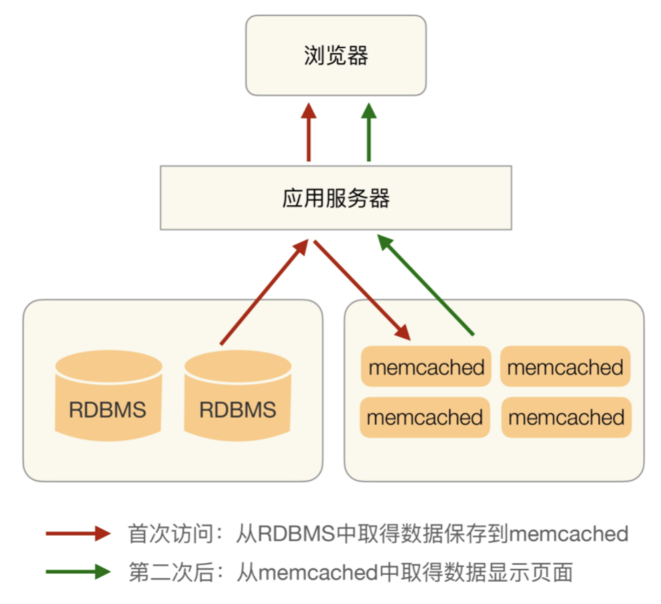

缓存虽然能够大大减轻存储系统的压力，但同时也给架构引入了更多复杂性。架构设计时如果没有针对缓存的复杂性进行处理，某些场景下甚至会导致整个系统崩溃。

### 缓存穿透

缓存穿透是指缓存没有发挥作用，业务系统虽然去缓存查询数据，但缓存中没有数据，业务系统需要再次去存储系统查询数据。通常情况下有两种情况：

1、存储数据不存在

第一种情况是被访问的数据确实不存在。一般情况下，如果存储系统中没有某个数据，则不会在缓存中存储相应的数据，这样就导致用户查询的时候，在缓存中找不到对应的数据，每次都要去存储系统中再查询一遍，然后返回数据不存在。缓存在这个场景中并没有起到分担存储系统访问压力的作用。

通常情况下，业务上读取不存在的数据的请求量并不会太大，但如果出现一些异常情况，例如被黑客攻击，故意大量访问某些读取不存在数据的业务，有可能会将存储系统拖垮。

这种情况的解决办法比较简单，如果查询存储系统的数据没有找到，则直接设置一个默认值（可以是空值，也可以是具体的值）存到缓存中，这样第二次读取缓存时就会获取到默认值，而不会继续访问存储系统。

2、缓存数据生成耗费大量时间或者资源

第二种情况是存储系统中存在数据，但生成缓存数据需要耗费较长时间或者耗费大量资源。如果刚好在业务访问的时候缓存失效了，那么也会出现缓存没有发挥作用，访问压力全部集中在存储系统上的情况。

典型的就是电商的商品分页，假设我们在某个电商平台上选择“手机”这个类别查看，由于数据巨大，不能把所有数据都缓存起来，只能按照分页来进行缓存，由于难以预测用户到底会访问哪些分页，因此业务上最简单的就是每次点击分页的时候按分页计算和生成缓存。通常情况下这样实现是基本满足要求的，但是如果被竞争对手用爬虫来遍历的时候，系统性能就可能出现问题。

具体的场景有：

* 分页缓存的有效期设置为 1 天，因为设置太长时间的话，缓存不能反应真实的数据。
* 通常情况下，用户不会从第 1 页到最后 1 页全部看完，一般用户访问集中在前 10 页，因此第 10 页以后的缓存过期失效的可能性很大。
* 竞争对手每周来爬取数据，爬虫会将所有分类的所有数据全部遍历，从第 1 页到最后 1 页全部都会读取，此时很多分页缓存可能都失效了。
* 由于很多分页都没有缓存数据，从数据库中生成缓存数据又非常耗费性能（order by limit 操作），因此爬虫会将整个数据库全部拖慢。

这种情况并没有太好的解决方案，因为爬虫会遍历所有的数据，而且什么时候来爬取也是不确定的，可能是每天都来，也可能是每周，也可能是一个月来一次，也不可能为了应对爬虫而将所有数据永久缓存。通常的应对方案要么就是识别爬虫然后禁止访问，但这可能会影响 SEO 和推广；要么就是做好监控，发现问题后及时处理，因为爬虫不是攻击，不会进行暴力破坏，对系统的影响是逐步的，监控发现问题后有时间进行处理。

### 缓存雪崩

**缓存雪崩是指当缓存失效（过期）后引起系统性能急剧下降的情况**。当缓存过期被清除后，业务系统需要重新生成缓存，因此需要再次访问存储系统，再次进行运算，这个处理步骤耗时几十毫秒甚至上百毫秒。而对于一个高并发的业务系统来说，几百毫秒内可能会接到几百上千个请求。由于旧的缓存已经被清除，新的缓存还未生成，并且处理这些请求的线程都不知道另外有一个线程正在生成缓存，因此所有的请求都会去重新生成缓存，都会去访问存储系统，从而对存储系统造成巨大的性能压力。这些压力又会拖慢整个系统，严重的会造成数据库宕机，从而形成一系列连锁反应，造成整个系统崩溃。

缓存雪崩的常见解决方法有两种：**更新锁机制**和**后台更新机制**。

1、更新锁

对缓存更新操作进行加锁保护，保证只有一个线程能够进行缓存更新，未能获取更新锁的线程要么等待锁释放后重新读取缓存，要么就返回空值或者默认值。

对于采用分布式集群的业务系统，由于存在几十上百台服务器，即使单台服务器只有一个线程更新缓存，但几十上百台服务器一起算下来也会有几十上百个线程同时来更新缓存，同样存在雪崩的问题。因此分布式集群的业务系统要实现更新锁机制，需要用到分布式锁，如 ZooKeeper。

2、后台更新

由后台线程来更新缓存，而不是由业务线程来更新缓存，缓存本身的有效期设置为永久，后台线程定时更新缓存。

后台定时机制需要考虑一种特殊的场景，当缓存系统内存不够时，会“踢掉”一些缓存数据，从缓存被“踢掉”到下一次定时更新缓存的这段时间内，业务线程读取缓存返回空值，而业务线程本身又不会去更新缓存，因此业务上看到的现象就是数据丢了。解决的方式有两种：

1）后台线程除了定时更新缓存，还要频繁地去读取缓存（例如，1 秒或者 100 毫秒读取一次），如果发现缓存被“踢了”就立刻更新缓存，这种方式实现简单，但读取时间间隔不能设置太长，因为如果缓存被踢了，缓存读取间隔时间又太长，这段时间内业务访问都拿不到真正的数据而是一个空的缓存值，用户体验一般。

2）业务线程发现缓存失效后，通过消息队列发送一条消息通知后台线程更新缓存。可能会出现多个业务线程都发送了缓存更新消息，但其实对后台线程没有影响，后台线程收到消息后更新缓存前可以判断缓存是否存在，存在就不执行更新操作。这种方式实现依赖消息队列，复杂度会高一些，但缓存更新更及时，用户体验更好

后台更新既适应单机多线程的场景，也适合分布式集群的场景，相比更新锁机制要简单一些。

后台更新机制还适合业务刚上线的时候进行缓存预热。缓存预热指系统上线后，将相关的缓存数据直接加载到缓存系统，而不是等待用户访问才来触发缓存加载。

### 缓存热点

虽然缓存系统本身的性能比较高，但对于一些特别热点的数据，如果大部分甚至所有的业务请求都命中同一份缓存数据，则这份数据所在的缓存服务器的压力也很大。例如，某明星微博发布“我们”来宣告恋爱了，短时间内上千万的用户都会来围观。

**缓存热点的解决方案就是复制多份缓存副本，将请求分散到多个缓存服务器上，减轻缓存热点导致的单台缓存服务器压力**。以微博为例，对于粉丝数超过 100 万的明星，每条微博都可以生成 100 份缓存，缓存的数据是一样的，通过在缓存的 key 里面加上编号进行区分，每次读缓存时都随机读取其中某份缓存。

缓存副本设计有一个细节需要注意，就是不同的缓存副本不要设置统一的过期时间，否则就会出现所有缓存副本同时生成同时失效的情况，从而引发缓存雪崩效应。正确的做法是设定一个过期时间范围，不同的缓存副本的过期时间是指定范围内的随机值。

### 实现方式

由于缓存的各种访问策略和存储的访问策略是相关的，因此上面的各种缓存设计方案通常情况下都是集成在存储访问方案中，可以采用“程序代码实现”的中间层方式，也可以采用独立的中间件来实现。

## 单服务器高性能模式：PPC与TPC

高性能是每个程序员的追求，无论我们是做一个系统还是写一行代码，都希望能够达到高性能的效果，而高性能又是最复杂的一环，磁盘、操作系统、CPU、内存、缓存、网络、编程语言、架构等，每个都有可能影响系统达到高性能，一行不恰当的 debug 日志，就可能将服务器的性能从 TPS 30000 降低到 8000；一个 tcp_nodelay 参数，就可能将响应时间从 2 毫秒延长到 40 毫秒。因此，要做到高性能计算是一件很复杂很有挑战的事情，软件系统开发过程中的不同阶段都关系着高性能最终是否能够实现。

站在架构师的角度，当然需要特别关注高性能架构的设计。高性能架构设计主要集中在两方面：

* 尽量提升单服务器的性能，将单服务器的性能发挥到极致。
* 如果单服务器无法支撑性能，设计服务器集群方案。

除了以上两点，最终系统能否实现高性能，还和具体的实现及编码相关。但架构设计是高性能的基础，如果架构设计没有做到高性能，则后面的具体实现和编码能提升的空间是有限的。形象地说，架构设计决定了系统性能的上限，实现细节决定了系统性能的下限。

单服务器高性能的关键之一就是服务器采取的并发模型，并发模型有如下两个关键设计点：

* 服务器如何管理连接。
* 服务器如何处理请求。

以上两个设计点最终都和操作系统的 I/O 模型及进程模型相关。

* I/O 模型：阻塞、非阻塞、同步、异步。
* 进程模型：单进程、多进程、多线程。

在下面详细介绍并发模型时会用到上面这些基础的知识点，建议先检测一下对这些基础知识的掌握情况，更多内容可以参考《UNIX 网络编程》三卷本。这里先来看看单服务器高性能模式：PPC 与 TPC。

### PPC

PPC 是 Process Per Connection 的缩写，其含义是指每次有新的连接就新建一个进程去专门处理这个连接的请求，这是传统的 UNIX 网络服务器所采用的模型。基本的流程图是：

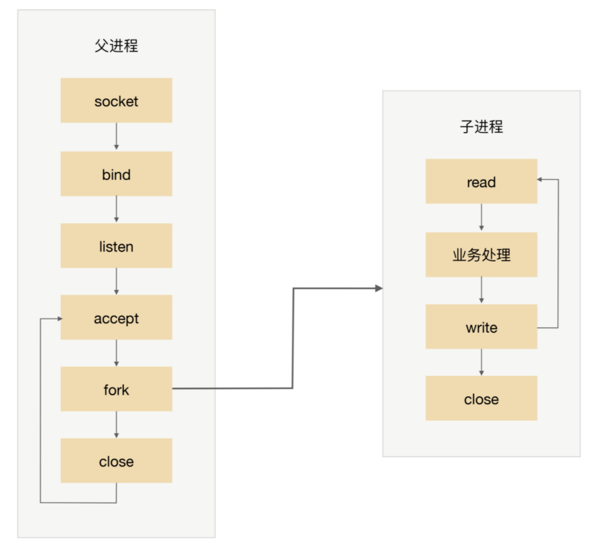

* 父进程接受连接（图中 accept）。
* 父进程“fork”子进程（图中 fork）。
* 子进程处理连接的读写请求（图中子进程 read、业务处理、write）。
* 子进程关闭连接（图中子进程中的 close）。

注意，图中有一个小细节，父进程“fork”子进程后，直接调用了 close，看起来好像是关闭了连接，其实只是将连接的文件描述符引用计数减一，真正的关闭连接是等子进程也调用 close 后，连接对应的文件描述符引用计数变为 0 后，操作系统才会真正关闭连接，更多细节请参考《UNIX 网络编程：卷一》。

PPC 模式实现简单，比较适合服务器的连接数没那么多的情况，例如数据库服务器。对于普通的业务服务器，在互联网兴起之前，由于服务器的访问量和并发量并没有那么大，这种模式其实运作得也挺好，世界上第一个 web 服务器 CERN httpd 就采用了这种模式（具体可以参考[https://en.wikipedia.org/wiki/CERN_httpd](https://en.wikipedia.org/wiki/CERN_httpd)）。互联网兴起后，服务器的并发和访问量从几十剧增到成千上万，这种模式的弊端就凸显出来了，主要体现在这几个方面：

fork 代价高：站在操作系统的角度，创建一个进程的代价是很高的，需要分配很多内核资源，需要将内存映像从父进程复制到子进程。即使现在的操作系统在复制内存映像时用到了 Copy on Write（写时复制）技术，总体来说创建进程的代价还是很大的。父子进程通信复杂：父进程“fork”子进程时，文件描述符可以通过内存映像复制从父进程传到子进程，但“fork”完成后，父子进程通信就比较麻烦了，需要采用 IPC（Interprocess Communication）之类的进程通信方案。例如，子进程需要在 close 之前告诉父进程自己处理了多少个请求以支撑父进程进行全局的统计，那么子进程和父进程必须采用 IPC 方案来传递信息。支持的并发连接数量有限：如果每个连接存活时间比较长，而且新的连接又源源不断的进来，则进程数量会越来越多，操作系统进程调度和切换的频率也越来越高，系统的压力也会越来越大。因此，一般情况下，PPC 方案能处理的并发连接数量最大也就几百。

#### prefork

PPC 模式中，当连接进来时才 fork 新进程来处理连接请求，由于 fork 进程代价高，用户访问时可能感觉比较慢，prefork 模式的出现就是为了解决这个问题。

顾名思义，prefork 就是提前创建进程（pre-fork）。系统在启动的时候就预先创建好进程，然后才开始接受用户的请求，当有新的连接进来的时候，就可以省去 fork 进程的操作，让用户访问更快、体验更好。prefork 的基本示意图是：

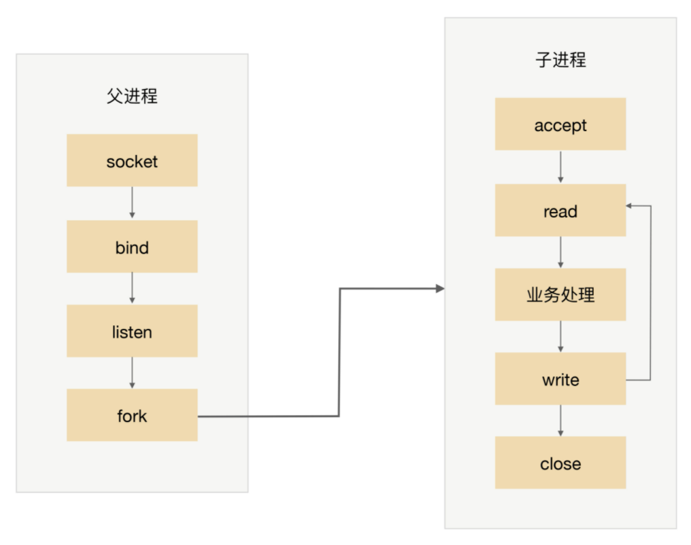

prefork 的实现关键就是多个子进程都 accept 同一个 socket，当有新的连接进入时，操作系统保证只有一个进程能最后 accept 成功。但这里也存在一个小小的问题：“惊群”现象，就是指虽然只有一个子进程能 accept 成功，但所有阻塞在 accept 上的子进程都会被唤醒，这样就导致了不必要的进程调度和上下文切换了。幸运的是，操作系统可以解决这个问题，例如 Linux 2.6 版本后内核已经解决了 accept 惊群问题。

prefork 模式和 PPC 一样，还是存在父子进程通信复杂、支持的并发连接数量有限的问题，因此目前实际应用也不多。Apache 服务器提供了 MPM prefork 模式，推荐在需要可靠性或者与旧软件兼容的站点时采用这种模式，默认情况下最大支持 256 个并发连接。

### TPC

TPC 是 Thread Per Connection 的缩写，其含义是指每次有新的连接就新建一个线程去专门处理这个连接的请求。与进程相比，线程更轻量级，创建线程的消耗比进程要少得多；同时多线程是共享进程内存空间的，线程通信相比进程通信更简单。因此，TPC 实际上是解决或者弱化了 PPC fork 代价高的问题和父子进程通信复杂的问题。

TPC 的基本流程是：

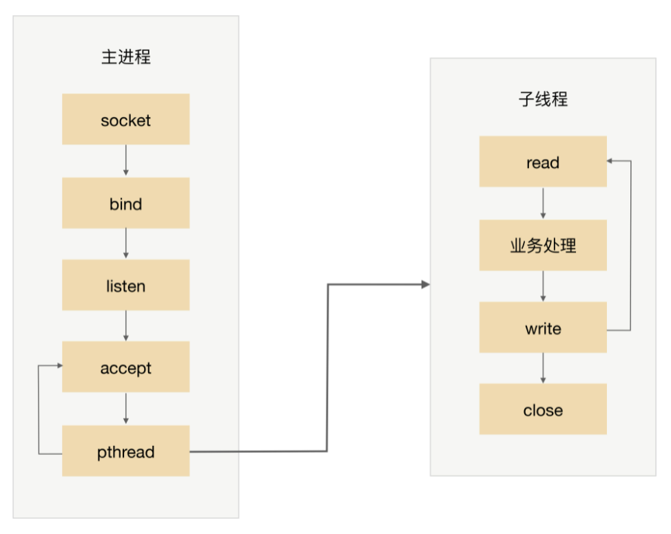

1、父进程接受连接（图中 accept）。

2、父进程创建子线程（图中 pthread）。

3、子线程处理连接的读写请求（图中子线程 read、业务处理、write）。

4、子线程关闭连接（图中子线程中的 close）。

注意，和 PPC 相比，主进程不用“close”连接了。原因是在于子线程是共享主进程的进程空间的，连接的文件描述符并没有被复制，因此只需要一次 close 即可。

TPC 虽然解决了 fork 代价高和进程通信复杂的问题，但是也引入了新的问题，具体表现在：

1、创建线程虽然比创建进程代价低，但并不是没有代价，高并发时（例如每秒上万连接）还是有性能问题。

2、无须进程间通信，但是线程间的互斥和共享又引入了复杂度，可能一不小心就导致了死锁问题。

3、多线程会出现互相影响的情况，某个线程出现异常时，可能导致整个进程退出（例如内存越界）。

除了引入了新的问题，TPC 还是存在 CPU 线程调度和切换代价的问题。因此，TPC 方案本质上和 PPC 方案基本类似，在并发几百连接的场景下，反而更多地是采用 PPC 的方案，因为 PPC 方案不会有死锁的风险，也不会多进程互相影响，稳定性更高。

#### prethread

TPC 模式中，当连接进来时才创建新的线程来处理连接请求，虽然创建线程比创建进程要更加轻量级，但还是有一定的代价，而 prethread 模式就是为了解决这个问题。

和 prefork 类似，prethread 模式会预先创建线程，然后才开始接受用户的请求，当有新的连接进来的时候，就可以省去创建线程的操作，让用户感觉更快、体验更好。

由于多线程之间数据共享和通信比较方便，因此实际上 prethread 的实现方式相比 prefork 要灵活一些，常见的实现方式有下面几种：

1、主进程 accept，然后将连接交给某个线程处理。

2、子线程都尝试去 accept，最终只有一个线程 accept 成功，方案的基本示意图如下：

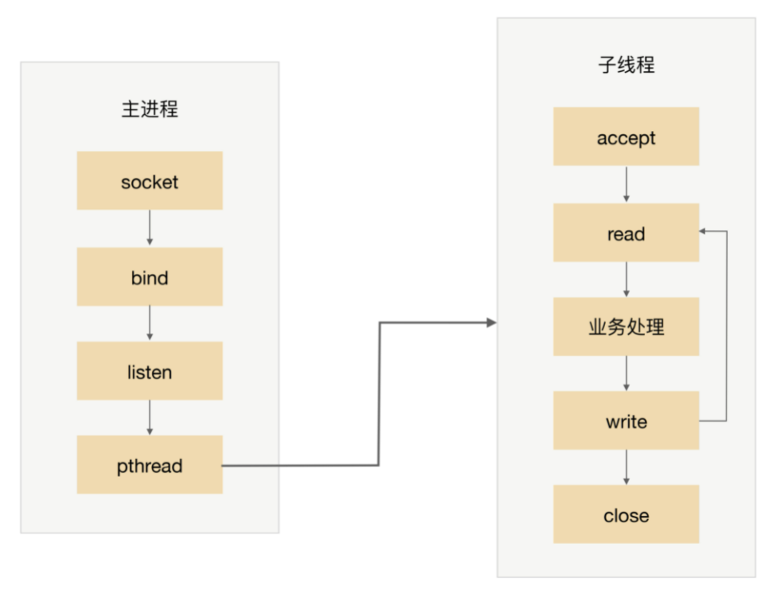

Apache 服务器的 MPM worker 模式本质上就是一种 prethread 方案，但稍微做了改进。Apache 服务器会首先创建多个进程，每个进程里面再创建多个线程，这样做主要是为了考虑稳定性，即：即使某个子进程里面的某个线程异常导致整个子进程退出，还会有其他子进程继续提供服务，不会导致整个服务器全部挂掉。

prethread 理论上可以比 prefork 支持更多的并发连接，Apache 服务器 MPM worker 模式默认支持 16 × 25 = 400 个并发处理线程。

## 单服务器高性能模式：Reactor与Proactor

上一节介绍了单服务器高性能的 PPC 和 TPC 模式，它们的优点是实现简单，缺点是都无法支撑高并发的场景，尤其是互联网发展到现在，各种海量用户业务的出现，PPC 和 TPC 完全无能为力。这一节介绍可以应对高并发场景的单服务器高性能架构模式：Reactor 和 Proactor。

### Reactor

PPC 模式最主要的问题就是每个连接都要创建进程（为了描述简洁，这里只以 PPC 和进程为例，实际上换成 TPC 和线程，原理是一样的），连接结束后进程就销毁了，这样做其实是很大的浪费。为了解决这个问题，一个自然而然的想法就是资源复用，即不再单独为每个连接创建进程，而是创建一个进程池，将连接分配给进程，一个进程可以处理多个连接的业务。

引入资源池的处理方式后，会引出一个新的问题：进程如何才能高效地处理多个连接的业务？当一个连接一个进程时，进程可以采用“read -> 业务处理 -> write”的处理流程，如果当前连接没有数据可以读，则进程就阻塞在 read 操作上。这种阻塞的方式在一个连接一个进程的场景下没有问题，但如果一个进程处理多个连接，进程阻塞在某个连接的 read 操作上，此时即使其他连接有数据可读，进程也无法去处理，很显然这样是无法做到高性能的。

解决这个问题的最简单的方式是将 read 操作改为非阻塞，然后进程不断地轮询多个连接。这种方式能够解决阻塞的问题，但解决的方式并不优雅。首先，轮询是要消耗 CPU 的；其次，如果一个进程处理几千上万的连接，则轮询的效率是很低的。

为了能够更好地解决上述问题，很容易可以想到，只有当连接上有数据的时候进程才去处理，这就是 I/O 多路复用技术的来源。

I/O 多路复用技术归纳起来有两个关键实现点：

1、当多条连接共用一个阻塞对象后，进程只需要在一个阻塞对象上等待，而无须再轮询所有连接，常见的实现方式有 select、epoll、kqueue 等。

2、当某条连接有新的数据可以处理时，操作系统会通知进程，进程从阻塞状态返回，开始进行业务处理。

I/O 多路复用结合线程池，完美地解决了 PPC 和 TPC 的问题，而且“大神们”给它取了一个很牛的名字：Reactor，中文是“反应堆”。联想到“核反应堆”，听起来就很吓人，实际上这里的“反应”不是聚变、裂变反应的意思，而是“**事件反应**”的意思，可以通俗地理解为“来了一个事件我就有相应的反应”，这里的“我”就是 Reactor，具体的反应就是我们写的代码，Reactor 会根据事件类型来调用相应的代码进行处理。**Reactor 模式也叫 Dispatcher 模式**（在很多开源的系统里面会看到这个名称的类，其实就是实现 Reactor 模式的），更加贴近模式本身的含义，即 I/O 多路复用统一监听事件，收到事件后分配（**Dispatch**）给某个进程。

Reactor 模式的核心组成部分包括 Reactor 和处理资源池（进程池或线程池），其中 Reactor 负责监听和分配事件，处理资源池负责处理事件。初看 Reactor 的实现是比较简单的，但实际上结合不同的业务场景，Reactor 模式的具体实现方案灵活多变，主要体现在：

1、Reactor 的数量可以变化：可以是一个 Reactor，也可以是多个 Reactor。

2、资源池的数量可以变化：以进程为例，可以是单个进程，也可以是多个进程（线程类似）。

将上面两个因素排列组合一下，理论上可以有 4 种选择，但由于“多 Reactor 单进程”实现方案相比“单 Reactor 单进程”方案，既复杂又没有性能优势，因此“多 Reactor 单进程”方案仅仅是一个理论上的方案，实际没有应用。

最终 Reactor 模式有这三种典型的实现方案：

1、单 Reactor 单进程 / 线程。

2、单 Reactor 多线程。

3、多 Reactor 多进程 / 线程。

以上方案具体选择进程还是线程，更多地是和编程语言及平台相关。例如，Java 语言一般使用线程（例如，Netty），C 语言使用进程和线程都可以。例如，Nginx 使用进程，Memcache 使用线程。

#### 单Reactor单进程/线程

单 Reactor 单进程 / 线程的方案示意图如下（以进程为例）：

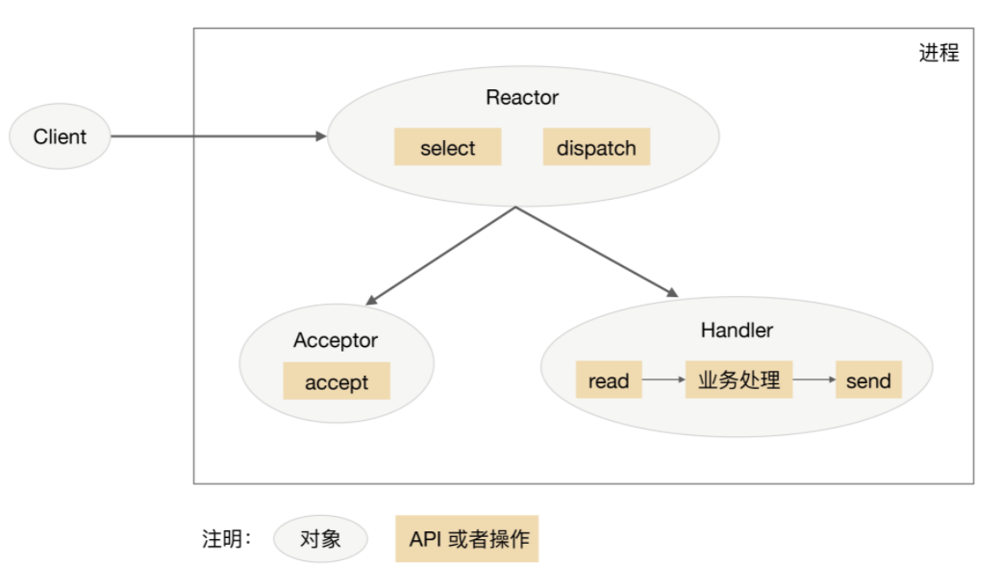

注意，select、accept、read、send 是标准的网络编程 API，dispatch 和“业务处理”是需要完成的操作，其他方案示意图类似。

详细说明一下这个方案：

1、Reactor 对象通过 select 监控连接事件，收到事件后通过 dispatch 进行分发。

2、如果是连接建立的事件，则由 Acceptor 处理，Acceptor 通过 accept 接受连接，并创建一个 Handler 来处理连接后续的各种事件。

3、如果不是连接建立事件，则 Reactor 会调用连接对应的 Handler（第 2 步中创建的 Handler）来进行响应。

4、Handler 会完成 read-> 业务处理 ->send 的完整业务流程。

单 Reactor 单进程的模式优点就是很简单，没有进程间通信，没有进程竞争，全部都在同一个进程内完成。但其缺点也是非常明显，具体表现有：

1、只有一个进程，无法发挥多核 CPU 的性能；只能采取部署多个系统来利用多核 CPU，但这样会带来运维复杂度，本来只要维护一个系统，用这种方式需要在一台机器上维护多套系统。

2、Handler 在处理某个连接上的业务时，整个进程无法处理其他连接的事件，很容易导致性能瓶颈。

因此，单 Reactor 单进程的方案在实践中应用场景不多，只适用于业务处理非常快速的场景，目前比较著名的开源软件中使用单 Reactor 单进程的是 Redis。

需要注意的是，C 语言编写系统的一般使用单 Reactor 单进程，因为没有必要在进程中再创建线程；而 Java 语言编写的一般使用单 Reactor 单线程，因为 Java 虚拟机是一个进程，虚拟机中有很多线程，业务线程只是其中的一个线程而已。

#### 单Reactor多进程

为了克服单 Reactor 单进程 / 线程方案的缺点，引入多进程 / 多线程是显而易见的，这就产生了第 2 个方案：单 Reactor 多线程。

单 Reactor 多线程方案示意图是：

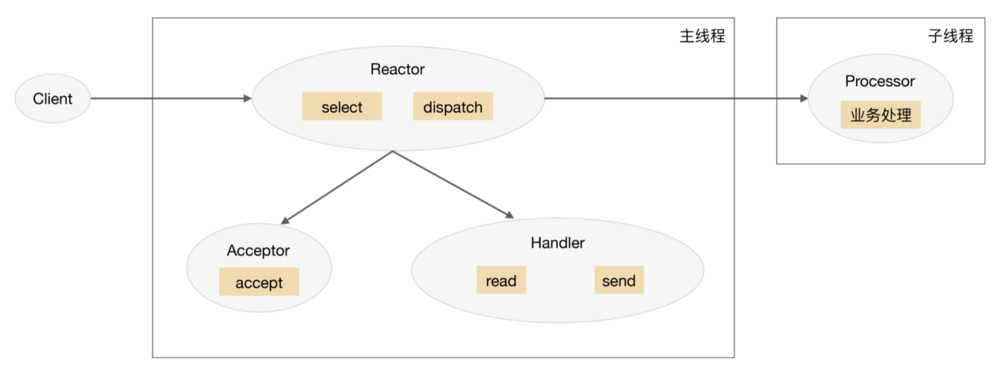

方案介绍：

1、主线程中，Reactor 对象通过 select 监控连接事件，收到事件后通过 dispatch 进行分发。

2、如果是连接建立的事件，则由 Acceptor 处理，Acceptor 通过 accept 接受连接，并创建一个 Handler 来处理连接后续的各种事件。

3、如果不是连接建立事件，则 Reactor 会调用连接对应的 Handler（第 2 步中创建的 Handler）来进行响应。

4、Handler 只负责响应事件，不进行业务处理；Handler 通过 read 读取到数据后，会发给 Processor 进行业务处理。

5、Processor 会在独立的子线程中完成真正的业务处理，然后将响应结果发给主进程的 Handler 处理；Handler 收到响应后通过 send 将响应结果返回给 client。

单 Reator 多线程方案能够充分利用多核多 CPU 的处理能力，但同时也存在下面的问题：

1、多线程数据共享和访问比较复杂。例如，子线程完成业务处理后，要把结果传递给主线程的 Reactor 进行发送，这里涉及共享数据的互斥和保护机制。以 Java 的 NIO 为例，Selector 是线程安全的，但是通过 Selector.selectKeys() 返回的键的集合是非线程安全的，对 selected keys 的处理必须单线程处理或者采取同步措施进行保护。

2、Reactor 承担所有事件的监听和响应，只在主线程中运行，瞬间高并发时会成为性能瓶颈。

这里只列出了“单 Reactor 多线程”方案，没有列出“单 Reactor 多进程”方案，主要原因在于如果采用多进程，子进程完成业务处理后，将结果返回给父进程，并通知父进程发送给哪个 client，这是很麻烦的事情。因为父进程只是通过 Reactor 监听各个连接上的事件然后进行分配，子进程与父进程通信时并不是一个连接。如果要将父进程和子进程之间的通信模拟为一个连接，并加入 Reactor 进行监听，则是比较复杂的。而采用多线程时，因为多线程是共享数据的，因此线程间通信是非常方便的。虽然要额外考虑线程间共享数据时的同步问题，但这个复杂度比进程间通信的复杂度要低很多。

#### 多Reactor多进程/线程

为了解决单 Reactor 多线程的问题，最直观的方法就是将单 Reactor 改为多 Reactor，这就产生了第 3 个方案：多 Reactor 多进程 / 线程。

多 Reactor 多进程 / 线程方案示意图是（以进程为例）：

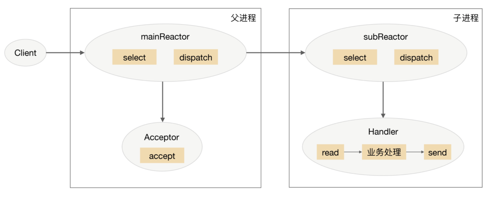

方案详细说明如下：

1、父进程中 mainReactor 对象通过 select 监控连接建立事件，收到事件后通过 Acceptor 接收，将新的连接分配给某个子进程。

2、子进程的 subReactor 将 mainReactor 分配的连接加入连接队列进行监听，并创建一个 Handler 用于处理连接的各种事件。

4、当有新的事件发生时，subReactor 会调用连接对应的 Handler（即第 2 步中创建的 Handler）来进行响应。

5、Handler 完成 read→业务处理→send 的完整业务流程。

多 Reactor 多进程 / 线程的方案看起来比单 Reactor 多线程要复杂，但实际实现时反而更加简单，主要原因是：

1、父进程和子进程的职责非常明确，父进程只负责接收新连接，子进程负责完成后续的业务处理。

2、父进程和子进程的交互很简单，父进程只需要把新连接传给子进程，子进程无须返回数据。

3、子进程之间是互相独立的，无须同步共享之类的处理（这里仅限于网络模型相关的 select、read、send 等无须同步共享，“业务处理”还是有可能需要同步共享的）。

目前著名的开源系统 Nginx 采用的是多 Reactor 多进程，采用多 Reactor 多线程的实现有 Memcache 和 Netty。

Nginx 采用的是多 Reactor 多进程的模式，但方案与标准的多 Reactor 多进程有差异。具体差异表现为主进程中仅仅创建了监听端口，并没有创建 mainReactor 来“accept”连接，而是由子进程的 Reactor 来“accept”连接，通过锁来控制一次只有一个子进程进行“accept”，子进程“accept”新连接后就放到自己的 Reactor 进行处理，不会再分配给其他子进程，更多细节请查阅相关资料或阅读 Nginx 源码。

### Proactor

Reactor 是非阻塞同步网络模型，因为真正的 read 和 send 操作都需要用户进程同步操作。这里的“同步”指用户进程在执行 read 和 send 这类 I/O 操作的时候是同步的，如果把 I/O 操作改为异步就能够进一步提升性能，这就是异步网络模型 Proactor。

Proactor 中文翻译为“前摄器”比较难理解，与其类似的单词是 proactive，含义为“主动的”，因此我们照猫画虎翻译为“主动器”反而更好理解。Reactor 可以理解为“来了事件我通知你，你来处理”，而 Proactor 可以理解为“来了事件我来处理，处理完了我通知你”。这里的“我”就是操作系统内核，“事件”就是有新连接、有数据可读、有数据可写的这些 I/O 事件，“你”就是我们的程序代码。

Proactor 模型示意图是：

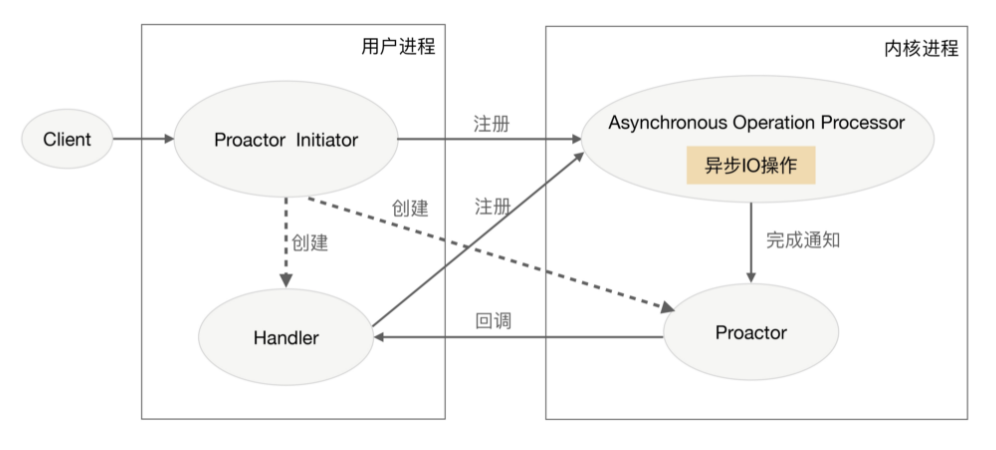

详细介绍一下 Proactor 方案：

1、Proactor Initiator 负责创建 Proactor 和 Handler，并将 Proactor 和 Handler 都通过 Asynchronous Operation Processor 注册到内核。

2、Asynchronous Operation Processor 负责处理注册请求，并完成 I/O 操作。

3、Asynchronous Operation Processor 完成 I/O 操作后通知 Proactor。

4、Proactor 根据不同的事件类型回调不同的 Handler 进行业务处理。

5、Handler 完成业务处理，Handler 也可以注册新的 Handler 到内核进程。

理论上 Proactor 比 Reactor 效率要高一些，异步 I/O 能够充分利用 DMA 特性，让 I/O 操作与计算重叠，但要实现真正的异步 I/O，操作系统需要做大量的工作。目前 Windows 下通过 IOCP 实现了真正的异步 I/O，而在 Linux 系统下的 AIO 并不完善，因此在 Linux 下实现高并发网络编程时都是以 Reactor 模式为主。所以即使 Boost.Asio 号称实现了 Proactor 模型，其实它在 Windows 下采用 IOCP，而在 Linux 下是用 Reactor 模式（采用 epoll）模拟出来的异步模型。

## 高性能负载均衡：分类及架构

单服务器无论如何优化，无论采用多好的硬件，总会有一个性能天花板，当单服务器的性能无法满足业务需求时，就需要设计高性能集群来提升系统整体的处理性能。

高性能集群的本质很简单，通过增加更多的服务器来提升系统整体的计算能力。由于计算本身存在一个特点：同样的输入数据和逻辑，无论在哪台服务器上执行，都应该得到相同的输出。因此高性能集群设计的复杂度主要体现在任务分配这部分，需要设计合理的任务分配策略，将计算任务分配到多台服务器上执行。

**高性能集群的复杂性主要体现在需要增加一个任务分配器，以及为任务选择一个合适的任务分配算法**。对于任务分配器，现在更流行的通用叫法是“负载均衡器”。但这个名称有一定的误导性，会让人潜意识里认为任务分配的目的是要保持各个计算单元的负载达到均衡状态。而实际上任务分配并不只是考虑计算单元的负载均衡，不同的任务分配算法目标是不一样的，有的基于负载考虑，有的基于性能（吞吐量、响应时间）考虑，有的基于业务考虑。考虑到“负载均衡”已经成为了事实上的标准术语，这里我也用“负载均衡”来代替“任务分配”，但请时刻记住，**负载均衡不只是为了计算单元的负载达到均衡状态**。

### 负载均衡分类

常见的负载均衡系统包括 3 种：DNS 负载均衡、硬件负载均衡和软件负载均衡。

#### DNS 负载均衡

DNS 是最简单也是最常见的负载均衡方式，一般用来实现地理级别的均衡。例如，北方的用户访问北京的机房，南方的用户访问深圳的机房。DNS 负载均衡的本质是 DNS 解析同一个域名可以返回不同的 IP 地址。例如，同样是 [www.baidu.com](https://www.baidu.com)，北方用户解析后获取的地址是 61.135.165.224（这是北京机房的 IP），南方用户解析后获取的地址是 14.215.177.38（这是深圳机房的 IP）。

下面是 DNS 负载均衡的简单示意图：

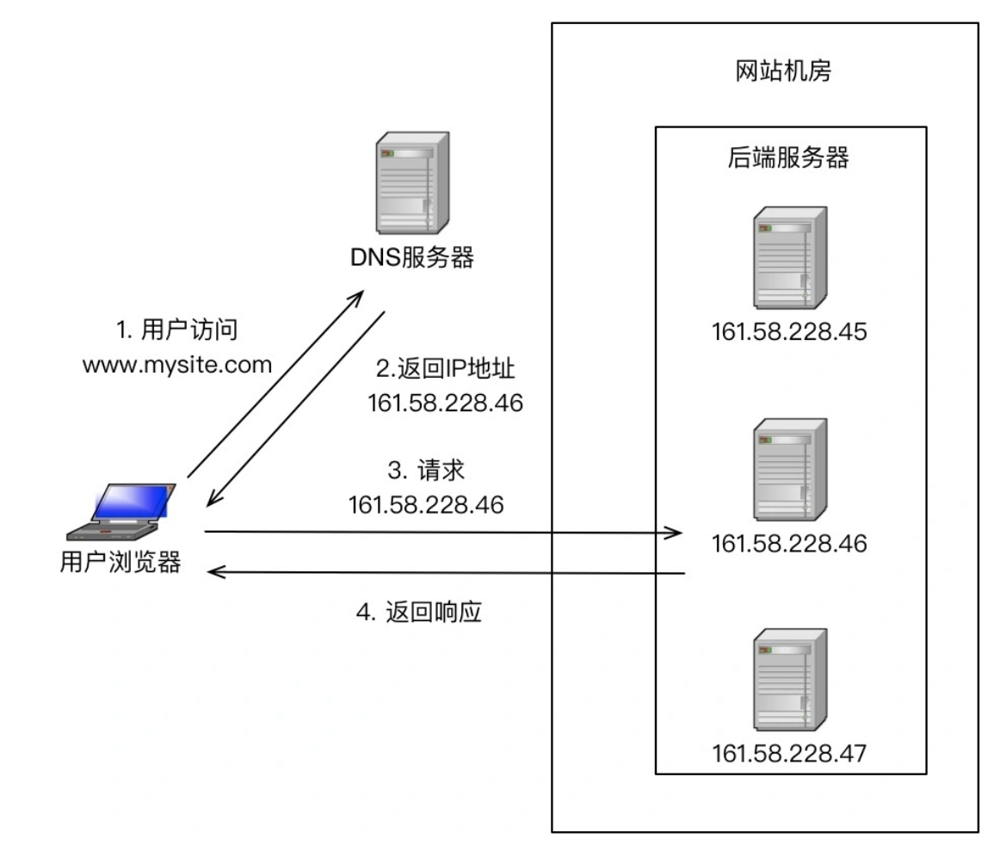

DNS 负载均衡实现简单、成本低，但也存在粒度太粗、负载均衡算法少等缺点。仔细分析一下优缺点，其优点有：

1、简单、成本低：负载均衡工作交给 DNS 服务器处理，无须自己开发或者维护负载均衡设备。

2、就近访问，提升访问速度：DNS 解析时可以根据请求来源 IP，解析成距离用户最近的服务器地址，可以加快访问速度，改善性能。

缺点有：

1、更新不及时：DNS 缓存的时间比较长，修改 DNS 配置后，由于缓存的原因，还是有很多用户会继续访问修改前的 IP，这样的访问会失败，达不到负载均衡的目的，并且也影响用户正常使用业务。

2、扩展性差：DNS 负载均衡的控制权在域名商那里，无法根据业务特点针对其做更多的定制化功能和扩展特性。

3、分配策略比较简单：DNS 负载均衡支持的算法少；不能区分服务器的差异（不能根据系统与服务的状态来判断负载）；也无法感知后端服务器的状态。

针对 DNS 负载均衡的一些缺点，对于时延和故障敏感的业务，有一些公司自己实现了 HTTP-DNS 的功能，即使用 HTTP 协议实现一个私有的 DNS 系统。这样的方案和通用的 DNS 优缺点正好相反。

#### 硬件负载均衡

硬件负载均衡是通过单独的硬件设备来实现负载均衡功能，这类设备和路由器、交换机类似，可以理解为一个用于负载均衡的基础网络设备。目前业界典型的硬件负载均衡设备有两款：F5 和 A10。这类设备性能强劲、功能强大，但价格都不便宜，一般只有“土豪”公司才会考虑使用此类设备。普通业务量级的公司一是负担不起，二是业务量没那么大，用这些设备也是浪费。

硬件负载均衡的优点是：

1、功能强大：全面支持各层级的负载均衡，支持全面的负载均衡算法，支持全局负载均衡。

2、性能强大：对比一下，软件负载均衡支持到 10 万级并发已经很厉害了，硬件负载均衡可以支持 100 万以上的并发。

3、稳定性高：商用硬件负载均衡，经过了良好的严格测试，经过大规模使用，稳定性高。

4、支持安全防护：硬件均衡设备除具备负载均衡功能外，还具备防火墙、防 DDoS 攻击等安全功能。

硬件负载均衡的缺点是：

1、价格昂贵：最普通的一台 F5 就是一台“马 6”，好一点的就是“Q7”了。

2、扩展能力差：硬件设备，可以根据业务进行配置，但无法进行扩展和定制。

#### 软件负载均衡

软件负载均衡通过负载均衡软件来实现负载均衡功能，常见的有 Nginx 和 LVS，其中 Nginx 是软件的 7 层负载均衡，LVS 是 Linux 内核的 4 层负载均衡。4 层和 7 层的区别就在于协议和灵活性，Nginx 支持 HTTP、E-mail 协议；而 LVS 是 4 层负载均衡，和协议无关，几乎所有应用都可以做，例如，聊天、数据库等。

软件和硬件的最主要区别就在于性能，硬件负载均衡性能远远高于软件负载均衡性能。Nginx 的性能是万级，一般的 Linux 服务器上装一个 Nginx 大概能到 5 万 / 秒；LVS 的性能是十万级，据说可达到 80 万 / 秒；而 F5 性能是百万级，从 200 万 / 秒到 800 万 / 秒都有（数据来源网络，仅供参考，如需采用请根据实际业务场景进行性能测试）。当然，软件负载均衡的最大优势是便宜，一台普通的 Linux 服务器批发价大概就是 1 万元左右，相比 F5 的价格，那就是自行车和宝马的区别了。

除了使用开源的系统进行负载均衡，如果业务比较特殊，也可能基于开源系统进行定制（例如，Nginx 插件），甚至进行自研。

下面是 Nginx 的负载均衡架构示意图：

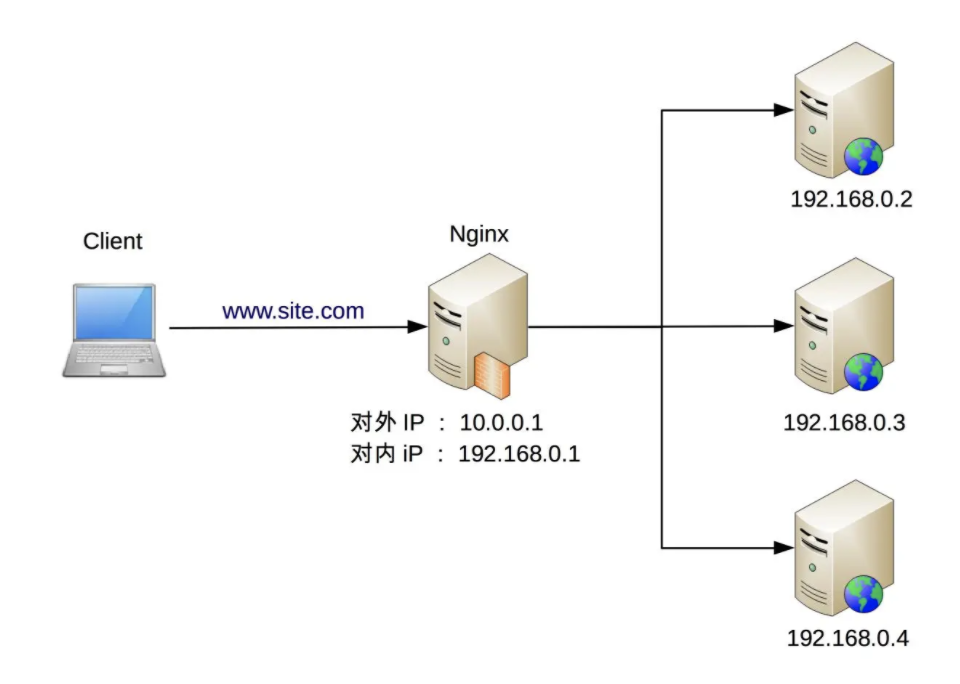

软件负载均衡的优点：

1、简单：无论是部署还是维护都比较简单。

2、便宜：只要买个 Linux 服务器，装上软件即可。

3、灵活：4 层和 7 层负载均衡可以根据业务进行选择；也可以根据业务进行比较方便的扩展，例如，可以通过 Nginx 的插件来实现业务的定制化功能。

其实下面的缺点都是和硬件负载均衡相比的，并不是说软件负载均衡没法用。

1、性能一般：一个 Nginx 大约能支撑 5 万并发。

2、功能没有硬件负载均衡那么强大。

3、一般不具备防火墙和防 DDoS 攻击等安全功能。

### 负载均衡典型架构

前面介绍了 3 种常见的负载均衡机制：DNS 负载均衡、硬件负载均衡、软件负载均衡，每种方式都有一些优缺点，但并不意味着在实际应用中只能基于它们的优缺点进行非此即彼的选择，反而是基于它们的优缺点进行组合使用。具体来说，组合的基本原则为：DNS 负载均衡用于实现地理级别的负载均衡；硬件负载均衡用于实现集群级别的负载均衡；软件负载均衡用于实现机器级别的负载均衡。

以一个假想的实例来说明一下这种组合方式，如下图所示。

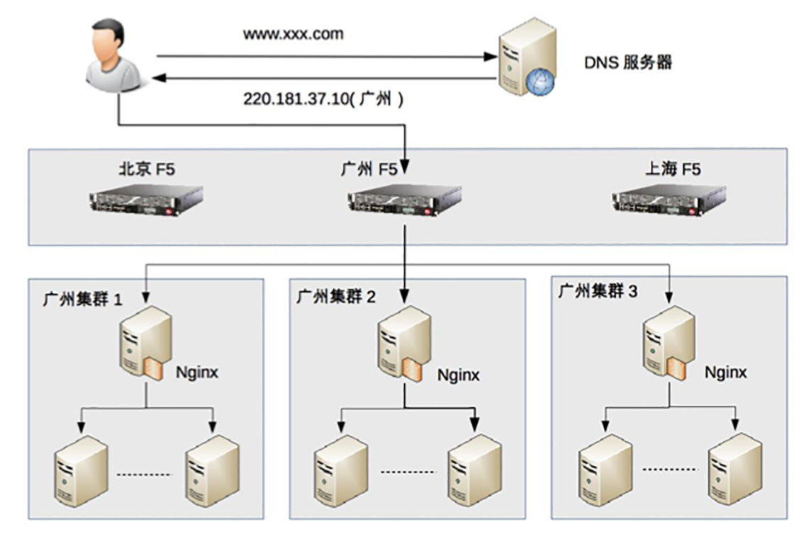

整个系统的负载均衡分为三层。

1、地理级别负载均衡：[www.xxx.com](https://www.xxx.com) 部署在北京、广州、上海三个机房，当用户访问时，DNS 会根据用户的地理位置来决定返回哪个机房的 IP，图中返回了广州机房的 IP 地址，这样用户就访问到广州机房了。

2、集群级别负载均衡：广州机房的负载均衡用的是 F5 设备，F5 收到用户请求后，进行集群级别的负载均衡，将用户请求发给 3 个本地集群中的一个，我们假设 F5 将用户请求发给了“广州集群 2”。

3、机器级别的负载均衡：广州集群 2 的负载均衡用的是 Nginx，Nginx 收到用户请求后，将用户请求发送给集群里面的某台服务器，服务器处理用户的业务请求并返回业务响应。

需要注意的是，上图只是一个示例，一般在大型业务场景下才会这样用，如果业务量没这么大，则没有必要严格照搬这套架构。例如，一个大学的论坛，完全可以不需要 DNS 负载均衡，也不需要 F5 设备，只需要用 Nginx 作为一个简单的负载均衡就足够了。

## 高性能负载均衡：算法

负载均衡算法数量较多，而且可以根据一些业务特性进行定制开发，抛开细节上的差异，根据算法期望达到的目的，大体上可以分为下面几类。

1、任务平分类：负载均衡系统将收到的任务平均分配给服务器进行处理，这里的“平均”可以是绝对数量的平均，也可以是比例或者权重上的平均。

2、负载均衡类：负载均衡系统根据服务器的负载来进行分配，这里的负载并不一定是通常意义上我们说的“CPU 负载”，而是系统当前的压力，可以用 CPU 负载来衡量，也可以用连接数、I/O 使用率、网卡吞吐量等来衡量系统的压力。

3、性能最优类：负载均衡系统根据服务器的响应时间来进行任务分配，优先将新任务分配给响应最快的服务器。

4、Hash 类：负载均衡系统根据任务中的某些关键信息进行 Hash 运算，将相同 Hash 值的请求分配到同一台服务器上。常见的有源地址 Hash、目标地址 Hash、session id hash、用户 ID Hash 等。

接下来介绍一下负载均衡算法以及它们的优缺点。

### 轮询

负载均衡系统收到请求后，按照顺序轮流分配到服务器上。

轮询是最简单的一个策略，无须关注服务器本身的状态，例如：

1、某个服务器当前因为触发了程序 bug 进入了死循环导致 CPU 负载很高，负载均衡系统是不感知的，还是会继续将请求源源不断地发送给它。

2、集群中有新的机器是 32 核的，老的机器是 16 核的，负载均衡系统也是不关注的，新老机器分配的任务数是一样的。

需要注意的是负载均衡系统无须关注“服务器本身状态”，这里的关键词是“本身”。也就是说，只要服务器在运行，运行状态是不关注的。但如果服务器直接宕机了，或者服务器和负载均衡系统断连了，这时负载均衡系统是能够感知的，也需要做出相应的处理。例如，将服务器从可分配服务器列表中删除，否则就会出现服务器都宕机了，任务还不断地分配给它，这明显是不合理的。

总而言之，“简单”是轮询算法的优点，也是它的缺点。

### 加权轮询

负载均衡系统根据服务器权重进行任务分配，这里的权重一般是根据硬件配置进行静态配置的，采用动态的方式计算会更加契合业务，但复杂度也会更高。

加权轮询是轮询的一种特殊形式，其主要目的就是为了解决不同服务器处理能力有差异的问题。例如，集群中有新的机器是 32 核的，老的机器是 16 核的，那么理论上我们可以假设新机器的处理能力是老机器的 2 倍，负载均衡系统就可以按照 2:1 的比例分配更多的任务给新机器，从而充分利用新机器的性能。

加权轮询解决了轮询算法中无法根据服务器的配置差异进行任务分配的问题，但同样存在无法根据服务器的状态差异进行任务分配的问题。

### 负载最低优先

负载均衡系统将任务分配给当前负载最低的服务器，这里的负载根据不同的任务类型和业务场景，可以用不同的指标来衡量。例如：

1、LVS 这种 4 层网络负载均衡设备，可以以“连接数”来判断服务器的状态，服务器连接数越大，表明服务器压力越大。

2、Nginx 这种 7 层网络负载系统，可以以“HTTP 请求数”来判断服务器状态（Nginx 内置的负载均衡算法不支持这种方式，需要进行扩展）。

3、如果自己开发负载均衡系统，可以根据业务特点来选择指标衡量系统压力。如果是 CPU 密集型，可以以“CPU 负载”来衡量系统压力；如果是 I/O 密集型，可以以“I/O 负载”来衡量系统压力。

负载最低优先的算法解决了轮询算法中无法感知服务器状态的问题，由此带来的代价是复杂度要增加很多。例如：

1、最少连接数优先的算法要求负载均衡系统统计每个服务器当前建立的连接，其应用场景仅限于负载均衡接收的任何连接请求都会转发给服务器进行处理，否则如果负载均衡系统和服务器之间是固定的连接池方式，就不适合采取这种算法。例如，LVS 可以采取这种算法进行负载均衡，而一个通过连接池的方式连接 MySQL 集群的负载均衡系统就不适合采取这种算法进行负载均衡。

2、CPU 负载最低优先的算法要求负载均衡系统以某种方式收集每个服务器的 CPU 负载，而且要确定是以 1 分钟的负载为标准，还是以 15 分钟的负载为标准，不存在 1 分钟肯定比 15 分钟要好或者差。不同业务最优的时间间隔是不一样的，时间间隔太短容易造成频繁波动，时间间隔太长又可能造成峰值来临时响应缓慢。

负载最低优先算法基本上能够比较完美地解决轮询算法的缺点，因为采用这种算法后，负载均衡系统需要感知服务器当前的运行状态。当然，其代价是复杂度大幅上升。通俗来讲，轮询可能是 5 行代码就能实现的算法，而负载最低优先算法可能要 1000 行才能实现，甚至需要负载均衡系统和服务器都要开发代码。负载最低优先算法如果本身没有设计好，或者不适合业务的运行特点，算法本身就可能成为性能的瓶颈，或者引发很多莫名其妙的问题。所以负载最低优先算法虽然效果看起来很美好，但实际上真正应用的场景反而没有轮询（包括加权轮询）那么多。

### 性能最优类

负载最低优先类算法是站在服务器的角度来进行分配的，而性能最优优先类算法则是站在客户端的角度来进行分配的，优先将任务分配给处理速度最快的服务器，通过这种方式达到最快响应客户端的目的。

和负载最低优先类算法类似，性能最优优先类算法本质上也是感知了服务器的状态，只是通过响应时间这个外部标准来衡量服务器状态而已。因此性能最优优先类算法存在的问题和负载最低优先类算法类似，复杂度都很高，主要体现在：

1、负载均衡系统需要收集和分析每个服务器每个任务的响应时间，在大量任务处理的场景下，这种收集和统计本身也会消耗较多的性能。

2、为了减少这种统计上的消耗，可以采取采样的方式来统计，即不统计所有任务的响应时间，而是抽样统计部分任务的响应时间来估算整体任务的响应时间。采样统计虽然能够减少性能消耗，但使得复杂度进一步上升，因为要确定合适的采样率，采样率太低会导致结果不准确，采样率太高会导致性能消耗较大，找到合适的采样率也是一件复杂的事情。

3、无论是全部统计还是采样统计，都需要选择合适的周期：是 10 秒内性能最优，还是 1 分钟内性能最优，还是 5 分钟内性能最优……没有放之四海而皆准的周期，需要根据实际业务进行判断和选择，这也是一件比较复杂的事情，甚至出现系统上线后需要不断地调优才能达到最优设计。

### Hash类

负载均衡系统根据任务中的某些关键信息进行 Hash 运算，将相同 Hash 值的请求分配到同一台服务器上，这样做的目的主要是为了满足特定的业务需求。例如：

1、源地址 Hash

将来源于同一个源 IP 地址的任务分配给同一个服务器进行处理，适合于存在事务、会话的业务。

2、ID Hash

将某个 ID 标识的业务分配到同一个服务器中进行处理，这里的 ID 一般是临时性数据的 ID（如 session id）。
