## 高可用架构-CAP理论

CAP 定理（CAP theorem）又被称作布鲁尔定理（Brewer's theorem），是加州大学伯克利分校的计算机科学家埃里克·布鲁尔（Eric Brewer）在 2000 年的 ACM PODC 上提出的一个猜想。2002 年，麻省理工学院的赛斯·吉尔伯特（Seth Gilbert）和南希·林奇（Nancy Lynch）发表了布鲁尔猜想的证明，使之成为分布式计算领域公认的一个定理。**对于设计分布式系统的架构师来说，CAP 是必须掌握的理论。**

布鲁尔在提出 CAP 猜想的时候，并没有详细定义 Consistency、Availability、Partition Tolerance 三个单词的明确定义。不同资料对 CAP 的详细定义有一些细微的差别。

为了更好地解释 CAP 理论，这里挑选了 Robert Greiner（[http://robertgreiner.com/about/](http://robertgreiner.com/about/)）的文章作为参考基础。Robert Greiner 对 CAP 的理解也经历了一个过程，他写了两篇文章来阐述 CAP 理论，第一篇被标记为“outdated”（有一些中文翻译文章正好参考了第一篇），这里将对比前后两篇解释的差异点，通过对比帮助更加深入地理解 CAP 理论。

### CAP理论

第一版解释：

Any distributed system cannot guaranty C, A, and P simultaneously.（[http://robertgreiner.com/2014/06/cap-theorem-explained/](http://robertgreiner.com/2014/06/cap-theorem-explained/)）

简单翻译为：对于一个分布式计算系统，不可能同时满足一致性（Consistence）、可用性（Availability）、分区容错性（Partition Tolerance）三个设计约束。

第二版解释：

In a distributed system (a collection of interconnected nodes that share data.), you can only have two out of the following three guarantees across a write/read pair: Consistency, Availability, and Partition Tolerance - one of them must be sacrificed.（[http://robertgreiner.com/2014/08/cap-theorem-revisited/](http://robertgreiner.com/2014/08/cap-theorem-revisited/)）

简单翻译为：在一个分布式系统（指互相连接并共享数据的节点的集合）中，当涉及读写操作时，只能保证一致性（Consistence）、可用性（Availability）、分区容错性（Partition Tolerance）三者中的两个，另外一个必须被牺牲。

对比两个版本的定义，有几个很关键的差异点：

1、第二版定义了什么才是 CAP 理论探讨的分布式系统，强调了两点：interconnected 和 share data，因为分布式系统并不一定会互联和共享数据。最简单的例如 Memcache 的集群，相互之间就没有连接和共享数据，因此 Memcache 集群这类分布式系统就不符合 CAP 理论探讨的对象；而 MySQL 集群就是互联和进行数据复制的，因此是 CAP 理论探讨的对象。

2、第二版强调了 write/read pair，这点其实是和上一个差异点一脉相承的。也就是说，CAP 关注的是对数据的读写操作，而不是分布式系统的所有功能。例如，ZooKeeper 的选举机制就不是 CAP 探讨的对象。

相对来说第二版的定义和解释更加严谨，但内容相比第一版来说更加难记一些，所以现在大部分技术人员谈论 CAP 理论时，更多还是按照第一版的定义和解释来说的，虽然第一版不严谨，但非常简单和容易记住。

第二版除了基本概念，三个基本的设计约束也进行了重新阐述：

#### 一致性

（Consistency）

第一版解释：All nodes see the same data at the same time.（所有节点在同一时刻都能看到相同的数据。）

第二版解释：A read is guaranteed to return the most recent write for a given client.（对某个指定的客户端来说，读操作保证能够返回最新的写操作结果。）

第一版解释和第二版解释的主要差异点表现在：

1、第一版从节点 node 的角度描述，第二版从客户端 client 的角度描述。

相比来说，第二版更加符合我们观察和评估系统的方式，即站在客户端的角度来观察系统的行为和特征。

2、第一版的关键词是 see，第二版的关键词是 read。

第一版解释中的 see，其实并不确切，因为节点 node 是拥有数据，而不是看到数据，即使要描述也是用 have；第二版从客户端 client 的读写角度来描述一致性，定义更加精确。

3、第一版强调同一时刻拥有相同数据（same time + same data），第二版并没有强调这点。

这就意味着实际上对于节点来说，可能同一时刻拥有不同数据（same time + different data），这和我们通常理解的一致性是有差异的，为何做这样的改动呢？其实在第一版的详细解释中已经提到了，具体内容如下：

A system has consistency if a transaction starts with the system in a consistent state, and ends with the system in a consistent state. In this model, a system can (and does) shift into an inconsistent state during a transaction, but the entire transaction gets rolled back if there is an error during any stage in the process.

参考上述的解释，对于系统执行事务来说，在事务执行过程中，系统其实处于一个不一致的状态，不同的节点的数据并不完全一致，因此第一版的解释“All nodes see the same data at the same time”是不严谨的。而第二版强调 client 读操作能够获取最新的写结果就没有问题，因为事务在执行过程中，client 是无法读取到未提交的数据的，只有等到事务提交后，client 才能读取到事务写入的数据，而如果事务失败则会进行回滚，client 也不会读取到事务中间写入的数据。

#### 可用性

（Availability）

第一版解释：Every request gets a response on success/failure.

简单翻译为：每个请求都能得到成功或者失败的响应。

第二版解释：A non-failing node will return a reasonable response within a reasonable amount of time (no error or timeout).

简单翻译为：非故障的节点在合理的时间内返回合理的响应（不是错误和超时的响应）。

第一版解释和第二版解释主要差异点表现在：

1、第一版是 every request，第二版强调了 A non-failing node。

第一版的 every request 是不严谨的，因为只有非故障节点才能满足可用性要求，如果节点本身就故障了，发给节点的请求不一定能得到一个响应。

2、第一版的 response 分为 success 和 failure，第二版用了两个 reasonable：reasonable response 和 reasonable time，而且特别强调了 no error or timeout。

第一版的 success/failure 的定义太泛了，几乎任何情况，无论是否符合 CAP 理论，我们都可以说请求成功和失败，因为超时也算失败、错误也算失败、异常也算失败、结果不正确也算失败；即使是成功的响应，也不一定是正确的。例如，本来应该返回 100，但实际上返回了 90，这就是成功的响应，但并没有得到正确的结果。相比之下，第二版的解释明确了不能超时、不能出错，结果是合理的，注意没有说“正确”的结果。例如，应该返回 100 但实际上返回了 90，肯定是不正确的结果，但可以是一个合理的结果。

#### 分区容忍性

（Partition Tolerance）

第一版解释：System continues to work despite message loss or partial failure.

简单翻译为：出现消息丢失或者分区错误时系统能够继续运行。

第二版解释：The system will continue to function when network partitions occur.

简单翻译为：当出现网络分区后，系统能够继续“履行职责”。

第一版解释和第二版解释主要差异点表现在：

1、第一版用的是 work，第二版用的是 function。

work 强调“运行”，只要系统不宕机，我们都可以说系统在 work，返回错误也是 work，拒绝服务也是 work；而 function 强调“发挥作用”“履行职责”，这点和可用性是一脉相承的。也就是说，只有返回 reasonable response 才是 function。相比之下，第二版解释更加明确。

2、第一版描述分区用的是 message loss or partial failure，第二版直接用 network partitions。

对比两版解释，第一版是直接说原因，即 message loss 造成了分区，但 message loss 的定义有点狭隘，因为通常我们说的 message loss（丢包），只是网络故障中的一种；第二版直接说现象，即发生了分区现象，不管是什么原因，可能是丢包，也可能是连接中断，还可能是拥塞，只要导致了网络分区，就通通算在里面。

### CAP应用

虽然 CAP 理论定义是三个要素中只能取两个，但放到分布式环境下来思考，我们会发现必须选择 P（分区容忍）要素，因为网络本身无法做到 100% 可靠，有可能出故障，所以分区是一个必然的现象。如果我们选择了 CA 而放弃了 P，那么当发生分区现象时，为了保证 C，系统需要禁止写入，当有写入请求时，系统返回 error（例如，当前系统不允许写入），这又和 A 冲突了，因为 A 要求返回 no error 和 no timeout。因此，分布式系统理论上不可能选择 CA 架构，只能选择 CP 或者 AP 架构。

#### CP 

Consistency/Partition Tolerance

如下图所示，为了保证一致性，当发生分区现象后，N1 节点上的数据已经更新到 y，但由于 N1 和 N2 之间的复制通道中断，数据 y 无法同步到 N2，N2 节点上的数据还是 x。这时客户端 C 访问 N2 时，N2 需要返回 Error，提示客户端 C“系统现在发生了错误”，这种处理方式违背了可用性（Availability）的要求，因此 CAP 三者只能满足 CP。

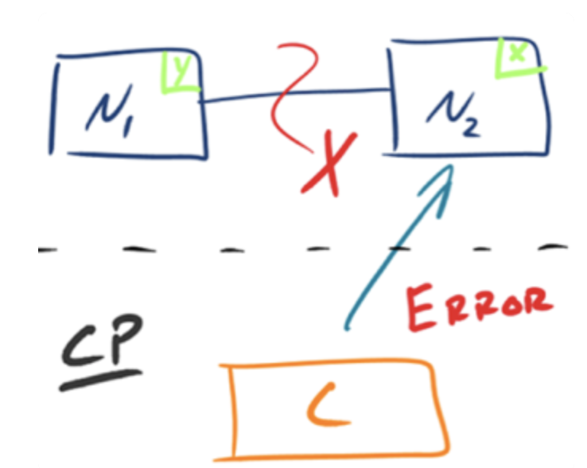

#### AP

Availability/Partition Tolerance

如下图所示，为了保证可用性，当发生分区现象后，N1 节点上的数据已经更新到 y，但由于 N1 和 N2 之间的复制通道中断，数据 y 无法同步到 N2，N2 节点上的数据还是 x。这时客户端 C 访问 N2 时，N2 将当前自己拥有的数据 x 返回给客户端 C 了，而实际上当前最新的数据已经是 y 了，这就不满足一致性（Consistency）的要求了，因此 CAP 三者只能满足 AP。注意：这里 N2 节点返回 x，虽然不是一个“正确”的结果，但是一个“合理”的结果，因为 x 是旧的数据，并不是一个错乱的值，只是不是最新的数据而已。 

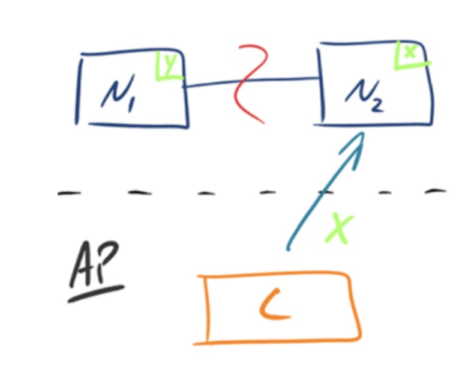

## 高可用架构-CAP细节

当谈到数据一致性时，CAP、ACID、BASE 难免会被我们拿出来讨论，原因在于这三者都是和数据一致性相关的理论，如果不仔细理解三者之间的差别，则可能会陷入一头雾水的状态，不知道应该用哪个才好。

### CAP关键细节点

埃里克·布鲁尔（Eric Brewer）在《CAP 理论十二年回顾：“规则”变了》（[http://www.infoq.com/cn/articles/cap-twelve-years-later-how-the-rules-have-changed](http://www.infoq.com/cn/articles/cap-twelve-years-later-how-the-rules-have-changed)）一文中详细地阐述了理解和应用 CAP 的一些细节点，可能是由于作者写作风格的原因，对于一些非常关键的细节点一句话就带过了，这里我特别提炼出来重点阐述。

1、CAP 关注的粒度是数据，而不是整个系统。

原文：C 与 A 之间的取舍可以在同一系统内以非常细小的粒度反复发生，而每一次的决策可能因为具体的操作，乃至因为牵涉到特定的数据或用户而有所不同。

CAP 理论的定义和解释中，用的都是 system、node 这类系统级的概念，这就给很多人造成了很大的误导，认为我们在进行架构设计时，整个系统要么选择 CP，要么选择 AP。但在实际设计过程中，每个系统不可能只处理一种数据，而是包含多种类型的数据，有的数据必须选择 CP，有的数据必须选择 AP。而如果我们做设计时，从整个系统的角度去选择 CP 还是 AP，就会发现顾此失彼，无论怎么做都是有问题的。

以一个最简单的用户管理系统为例，用户管理系统包含用户账号数据（用户 ID、密码）、用户信息数据（昵称、兴趣、爱好、性别、自我介绍等）。通常情况下，用户账号数据会选择 CP，而用户信息数据会选择 AP，如果限定整个系统为 CP，则不符合用户信息数据的应用场景；如果限定整个系统为 AP，则又不符合用户账号数据的应用场景。

所以在 CAP 理论落地实践时，需要将系统内的数据按照不同的应用场景和要求进行分类，每类数据选择不同的策略（CP 还是 AP），而不是直接限定整个系统所有数据都是同一策略。

2、CAP 是忽略网络延迟的。

这是一个非常隐含的假设，布鲁尔在定义一致性时，并没有将延迟考虑进去。也就是说，当事务提交时，数据能够瞬间复制到所有节点。但实际情况下，从节点 A 复制数据到节点 B，总是需要花费一定时间的。如果是相同机房，耗费时间可能是几毫秒；如果是跨地域的机房，例如北京机房同步到广州机房，耗费的时间就可能是几十毫秒。这就意味着，CAP 理论中的 C 在实践中是不可能完美实现的，在数据复制的过程中，节点 A 和节点 B 的数据并不一致。

不要小看了这几毫秒或者几十毫秒的不一致，对于某些严苛的业务场景，例如和金钱相关的用户余额，或者和抢购相关的商品库存，技术上是无法做到分布式场景下完美的一致性的。而业务上必须要求一致性，因此单个用户的余额、单个商品的库存，理论上要求选择 CP 而实际上 CP 都做不到，只能选择 CA。也就是说，只能单点写入，其他节点做备份，无法做到分布式情况下多点写入。

需要注意的是，这并不意味着这类系统无法应用分布式架构，只是说“单个用户余额、单个商品库存”无法做分布式，但系统整体还是可以应用分布式架构的。例如，下面的架构图是常见的将用户分区的分布式架构。

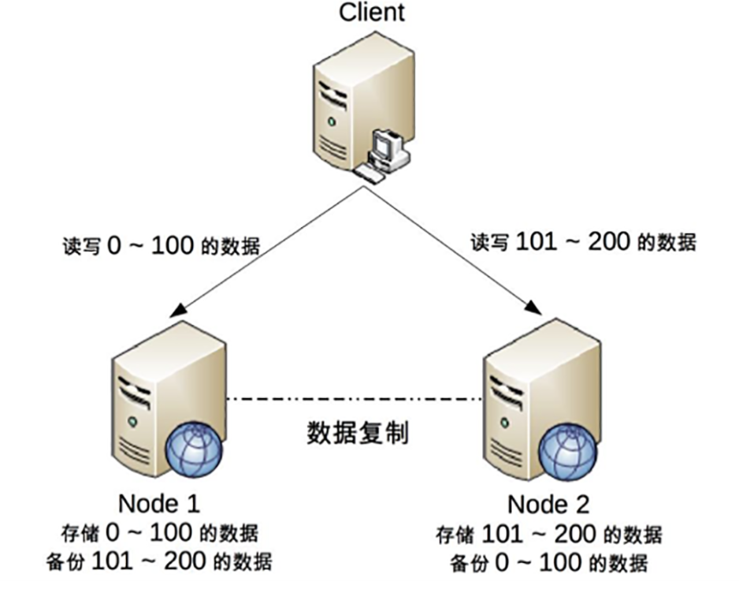

可以将用户 id 为 0 ~ 100 的数据存储在 Node 1，将用户 id 为 101 ~ 200 的数据存储在 Node 2，Client 根据用户 id 来决定访问哪个 Node。对于单个用户来说，读写操作都只能在某个节点上进行；对所有用户来说，有一部分用户的读写操作在 Node 1 上，有一部分用户的读写操作在 Node 2 上。

这样的设计有一个很明显的问题就是某个节点故障时，这个节点上的用户就无法进行读写操作了，但站在整体上来看，这种设计可以降低节点故障时受影响的用户的数量和范围，毕竟只影响 20% 的用户肯定要比影响所有用户要好。这也是为什么挖掘机挖断光缆后，支付宝只有一部分用户会出现业务异常，而不是所有用户业务异常的原因。

2、正常运行情况下，不存在 CP 和 AP 的选择，可以同时满足 CA。

CAP 理论告诉我们分布式系统只能选择 CP 或者 AP，但其实这里的前提是系统发生了“分区”现象。如果系统没有发生分区现象，也就是说 P 不存在的时候（节点间的网络连接一切正常），我们没有必要放弃 C 或者 A，应该 C 和 A 都可以保证，这就要求架构设计的时候既要考虑分区发生时选择 CP 还是 AP，也要考虑分区没有发生时如何保证 CA。

同样以用户管理系统为例，即使是实现 CA，不同的数据实现方式也可能不一样：用户账号数据可以采用“消息队列”的方式来实现 CA，因为消息队列可以比较好地控制实时性，但实现起来就复杂一些；而用户信息数据可以采用“数据库同步”的方式来实现 CA，因为数据库的方式虽然在某些场景下可能延迟较高，但使用起来简单。

3、放弃并不等于什么都不做，需要为分区恢复后做准备。

CAP 理论告诉我们三者只能取两个，需要“牺牲”（sacrificed）另外一个，这里的“牺牲”是有一定误导作用的，因为“牺牲”让很多人理解成什么都不做。实际上，CAP 理论的“牺牲”只是说在分区过程中我们无法保证 C 或者 A，但并不意味着什么都不做。因为在系统整个运行周期中，大部分时间都是正常的，发生分区现象的时间并不长。例如，99.99% 可用性（俗称 4 个 9）的系统，一年运行下来，不可用的时间只有 50 分钟；99.999%（俗称 5 个 9）可用性的系统，一年运行下来，不可用的时间只有 5 分钟。分区期间放弃 C 或者 A，并不意味着永远放弃 C 和 A，可以在分区期间进行一些操作，从而让分区故障解决后，系统能够重新达到 CA 的状态。

最典型的就是在分区期间记录一些日志，当分区故障解决后，系统根据日志进行数据恢复，使得重新达到 CA 状态。同样以用户管理系统为例，对于用户账号数据，假设选择了 CP，则分区发生后，节点 1 可以继续注册新用户，节点 2 无法注册新用户（这里就是不符合 A 的原因，因为节点 2 收到注册请求后会返回 error），此时节点 1 可以将新注册但未同步到节点 2 的用户记录到日志中。当分区恢复后，节点 1 读取日志中的记录，同步给节点 2，当同步完成后，节点 1 和节点 2 就达到了同时满足 CA 的状态。

而对于用户信息数据，假设选择了 AP，则分区发生后，节点 1 和节点 2 都可以修改用户信息，但两边可能修改不一样。例如，用户在节点 1 中将爱好改为“旅游、美食、跑步”，然后用户在节点 2 中将爱好改为“美食、游戏”，节点 1 和节点 2 都记录了未同步的爱好数据，当分区恢复后，系统按照某个规则来合并数据。例如，按照“最后修改优先规则”将用户爱好修改为“美食、游戏”，按照“字数最多优先规则”则将用户爱好修改为“旅游，美食、跑步”，也可以完全将数据冲突报告出来，由人工来选择具体应该采用哪一条。

### ACID

ACID 是数据库管理系统为了保证事务的正确性而提出来的一个理论，ACID 包含四个约束。

1、Atomicity（原子性）

一个事务中的所有操作，要么全部完成，要么全部不完成，不会在中间某个环节结束。事务在执行过程中发生错误，会被回滚到事务开始前的状态，就像这个事务从来没有执行过一样。

2、Consistency（一致性）在事务开始之前和事务结束以后，数据库的完整性没有被破坏。

3、Isolation（隔离性）数据库允许多个并发事务同时对数据进行读写和修改的能力。隔离性可以防止多个事务并发执行时由于交叉执行而导致数据的不一致。事务隔离分为不同级别，包括读未提交（Read uncommitted）、读提交（read committed）、可重复读（repeatable read）和串行化（Serializable）。

4、Durability（持久性）事务处理结束后，对数据的修改就是永久的，即便系统故障也不会丢失。

可以看到，ACID 中的 A（Atomicity）和 CAP 中的 A（Availability）意义完全不同，而 ACID 中的 C 和 CAP 中的 C 名称虽然都是一致性，但含义也完全不一样。ACID 中的 C 是指数据库的数据完整性，而 CAP 中的 C 是指分布式节点中的数据一致性。再结合 ACID 的应用场景是数据库事务，CAP 关注的是分布式系统数据读写这个差异点来看，其实 CAP 和 ACID 的对比就类似关公战秦琼，虽然关公和秦琼都是武将，但其实没有太多可比性。

### BASE

BASE 是指基本可用（Basically Available）、软状态（ Soft State）、最终一致性（ Eventual Consistency），核心思想是即使无法做到强一致性（CAP 的一致性就是强一致性），但应用可以采用适合的方式达到最终一致性。

1、基本可用（Basically Available）

分布式系统在出现故障时，允许损失部分可用性，即保证核心可用。

这里的关键词是“部分”和“核心”，具体选择哪些作为可以损失的业务，哪些是必须保证的业务，是一项有挑战的工作。例如，对于一个用户管理系统来说，“登录”是核心功能，而“注册”可以算作非核心功能。因为未注册的用户本来就还没有使用系统的业务，注册不了最多就是流失一部分用户，而且这部分用户数量较少。如果用户已经注册但无法登录，那就意味用户无法使用系统。例如，充了钱的游戏不能玩了、云存储不能用了……这些会对用户造成较大损失，而且登录用户数量远远大于新注册用户，影响范围更大。

2、软状态（Soft State）

允许系统存在中间状态，而该中间状态不会影响系统整体可用性。这里的中间状态就是 CAP 理论中的数据不一致。

3、最终一致性（Eventual Consistency）

系统中的所有数据副本经过一定时间后，最终能够达到一致的状态。

这里的关键词是“一定时间” 和 “最终”，“一定时间”和数据的特性是强关联的，不同的数据能够容忍的不一致时间是不同的。举一个微博系统的例子，用户账号数据最好能在 1 分钟内就达到一致状态，因为用户在 A 节点注册或者登录后，1 分钟内不太可能立刻切换到另外一个节点，但 10 分钟后可能就重新登录到另外一个节点了；而用户发布的最新微博，可以容忍 30 分钟内达到一致状态，因为对于用户来说，看不到某个明星发布的最新微博，用户是无感知的，会认为明星没有发布微博。“最终”的含义就是不管多长时间，最终还是要达到一致性的状态。

BASE 理论本质上是对 CAP 的延伸和补充，更具体地说，是对 CAP 中 AP 方案的一个补充。前面在剖析 CAP 理论时，提到了其实和 BASE 相关的两点：

1、CAP 理论是忽略延时的，而实际应用中延时是无法避免的。

这一点就意味着完美的 CP 场景是不存在的，即使是几毫秒的数据复制延迟，在这几毫秒时间间隔内，系统是不符合 CP 要求的。因此 CAP 中的 CP 方案，实际上也是实现了最终一致性，只是“一定时间”是指几毫秒而已。

2、AP 方案中牺牲一致性只是指分区期间，而不是永远放弃一致性。

这一点其实就是 BASE 理论延伸的地方，分区期间牺牲一致性，但分区故障恢复后，系统应该达到最终一致性。

综合上面的分析，ACID 是数据库事务完整性的理论，CAP 是分布式系统设计理论，BASE 是 CAP 理论中 AP 方案的延伸。

## FMEA排查可用性隐患

### FMEA介绍

FMEA（Failure mode and effects analysis，故障模式与影响分析）又称为失效模式与后果分析、失效模式与效应分析、故障模式与后果分析等，专栏采用“**故障模式与影响分析**”，因为这个中文翻译更加符合可用性的语境。FMEA 是一种在各行各业都有广泛应用的可用性分析方法，通过对系统范围内潜在的故障模式加以分析，并按照严重程度进行分类，以确定失效对于系统的最终影响。

FMEA 最早是在美国军方开始应用的，20 世纪 40 年代后期，美国空军正式采用了 FMEA。尽管最初是在军事领域建立的方法，但 FMEA 方法现在已广泛应用于各种各样的行业，包括半导体加工、餐饮服务、塑料制造、软件及医疗保健行业。FMEA 之所以能够在这些差异很大的领域都得到应用，根本原因在于 FMEA 是一套分析和思考的方法，而不是某个领域的技能或者工具。

回到软件架构设计领域，FMEA 并不能指导我们如何做架构设计，而是当我们设计出一个架构后，再使用 FMEA 对这个架构进行分析，看看架构是否还存在某些可用性的隐患。

### FMEA 方法

在架构设计领域，FMEA 的具体分析方法是：

* 给出初始的架构设计图。
* 假设架构中某个部件发生故障。
* 分析此故障对系统功能造成的影响。
* 根据分析结果，判断架构是否需要进行优化。

FMEA 分析的方法其实很简单，就是一个 FMEA 分析表，常见的 FMEA 分析表格包含下面部分。

#### 1.功能点

当前的 FMEA 分析涉及的功能点，注意这里的“功能点”指的是从用户角度来看的，而不是从系统各个模块功能点划分来看的。例如，对于一个用户管理系统，使用 FMEA 分析时 “登录”“注册”才是功能点，而用户管理系统中的数据库存储功能、Redis 缓存功能不能作为 FMEA 分析的功能点。

#### 2.故障模式

故障模式指的是系统会出现什么样的故障，包括故障点和故障形式。需要特别注意的是，这里的故障模式并不需要给出真正的故障原因，我们只需要假设出现某种故障现象即可，例如 MySQL 响应时间达到 3 秒。造成 MySQL 响应时间达到 3 秒可能的原因很多：磁盘坏道、慢查询、服务器到 MySQL 的连接网络故障、MySQL bug 等，我们并不需要在故障模式中一一列出来，而是在后面的“故障原因”一节中列出来。因为在实际应用过程中，不管哪种原因，只要现象是一样的，对业务的影响就是一样的。

此外，故障模式的描述要尽量精确，多使用量化描述，避免使用泛化的描述。例如，推荐使用“MySQL 响应时间达到 3 秒”，而不是“MySQL 响应慢”。

#### 3.故障影响

当发生故障模式中描述的故障时，功能点具体会受到什么影响。常见的影响有：功能点偶尔不可用、功能点完全不可用、部分用户功能点不可用、功能点响应缓慢、功能点出错等。

故障影响也需要尽量准确描述。例如，推荐使用“20% 的用户无法登录”，而不是“大部分用户无法登录”。要注意这里的数字不需要完全精确，比如 21.25% 这样的数据其实是没有必要的，我们只需要预估影响是 20% 还是 40%。

#### 4.严重程度

严重程度指站在业务的角度故障的影响程度，一般分为“致命 / 高 / 中 / 低 / 无”五个档次。严重程度按照这个公式进行评估：严重程度 = 功能点重要程度 × 故障影响范围 × 功能点受损程度。同样以用户管理系统为例：登录功能比修改用户资料要重要得多，80% 的用户比 20% 的用户范围更大，完全无法登录比登录缓慢要更严重。因此我们可以得出如下故障模式的严重程度。

* 致命：超过 70% 用户无法登录。
* 高：超过 30% 的用户无法登录。
* 中：所有用户登录时间超过 5 秒。
* 低：10% 的用户登录时间超过 5 秒。
* 中：所有用户都无法修改资料。
* 低：20% 的用户无法修改头像。

对于某个故障的影响到底属于哪个档次，有时会出现一些争议。例如，“所有用户都无法修改资料”，有的人认为是高，有的人可能认为是中，这个没有绝对标准，一般建议相关人员讨论确定即可。也不建议花费太多时间争论，争执不下时架构师裁定即可。

#### 5.故障原因

“故障模式”中只描述了故障的现象，并没有单独列出故障原因。主要原因在于不管什么故障原因，故障现象相同，对功能点的影响就相同。那为何这里还要单独将故障原因列出来呢？主要原因有这几个：

1、不同的故障原因发生概率不相同

例如，导致 MySQL 查询响应慢的原因可能是 MySQL bug，也可能是没有索引。很明显“MySQL bug”的概率要远远低于“没有索引”；而不同的概率又会影响我们具体如何应对这个故障。

2、不同的故障原因检测手段不一样

例如，磁盘坏道导致 MySQL 响应慢，那我们需要增加机器的磁盘坏道检查，这个检查很可能不是当前系统本身去做，而是另外运维专门的系统；如果是慢查询导致 MySQL 慢，那我们只需要配置 MySQL 的慢查询日志即可。

3、不同的故障原因的处理措施不一样

例如，如果是 MySQL bug，我们的应对措施只能是升级 MySQL 版本；如果是没有索引，我们的应对措施就是增加索引。

#### 6.故障概率

这里的概率就是指某个具体故障原因发生的概率。例如，磁盘坏道的概率、MySQL bug 的概率、没有索引的概率。一般分为“高 / 中 / 低”三档即可，具体评估的时候需要有以下几点需要重点关注。

1、硬件

硬件随着使用时间推移，故障概率会越来越高。例如，新的硬盘坏道几率很低，但使用了 3 年的硬盘，坏道几率就会高很多。

2、开源系统

成熟的开源系统 bug 率低，刚发布的开源系统 bug 率相比会高一些；自己已经有使用经验的开源系统 bug 率会低，刚开始尝试使用的开源系统 bug 率会高。自研系统和开源系统类似，成熟的

3、自研系统

故障概率会低，而新开发的系统故障概率会高。

高中低是相对的，只是为了确定优先级以决定后续的资源投入，没有必要绝对量化，因为绝对量化是需要成本的，而且很多时候都没法量化。例如，XX 开源系统是 3 个月故障一次，还是 6 个月才故障一次，是无法评估的。

#### 7.风险程度

风险程度就是综合严重程度和故障概率来一起判断某个故障的最终等级，风险程度 = 严重程度 × 故障概率。因此可能出现某个故障影响非常严重，但其概率很低，最终来看风险程度就低。“某个机房业务瘫痪”对业务影响是致命的，但如果故障原因是“地震”，那概率就很低。例如，广州的地震概率就很低，5 级以上地震的 20 世纪才 1 次（1940 年）；如果故障的原因是“机房空调烧坏”，则概率就比地震高很多了，可能是 2 年 1 次；如果故障的原因是“系统所在机架掉电”，这个概率比机房空调又要高了，可能是 1 年 1 次。同样的故障影响，不同的故障原因有不同的概率，最终得到的风险级别就是不同的。

#### 8.已有措施

针对具体的故障原因，系统现在是否提供了某些措施来应对，包括：检测告警、容错、自恢复等。

1、检测告警

最简单的措施就是检测故障，然后告警，系统自己不针对故障进行处理，需要人工干预。

2、容错

检测到故障后，系统能够通过备份手段应对。例如，MySQL 主备机，当业务服务器检测到主机无法连接后，自动连接备机读取数据。

3、自恢复

检测到故障后，系统能够自己恢复。例如，Hadoop 检测到某台机器故障后，能够将存储在这台机器的副本重新分配到其他机器。当然，这里的恢复主要还是指“业务”上的恢复，一般不太可能将真正的故障恢复。例如，Hadoop 不可能将产生了磁盘坏道的磁盘修复成没有坏道的磁盘。

#### 9.规避措施

规避措施指为了降低故障发生概率而做的一些事情，可以是技术手段，也可以是管理手段。例如：

技术手段：为了避免新引入的 MongoDB 丢失数据，在 MySQL 中冗余一份。

管理手段：为了降低磁盘坏道的概率，强制统一更换服务时间超过 2 年的磁盘。

#### 10.解决措施

解决措施指为了能够解决问题而做的一些事情，一般都是技术手段。例如：

1、为了解决密码暴力破解，增加密码重试次数限制。

2、为了解决拖库导致数据泄露，将数据库中的敏感数据加密保存。

3、为了解决非法访问，增加白名单控制。

一般来说，如果某个故障既可以采取规避措施，又可以采取解决措施，那么我们会优先选择解决措施，毕竟能解决问题当然是最好的。但很多时候有些问题是系统自己无法解决的，例如磁盘坏道、开源系统 bug，这类故障只能采取规避措施；系统能够自己解决的故障，大部分是和系统本身功能相关的。

#### 11.后续规划

综合前面的分析，就可以看出哪些故障我们目前还缺乏对应的措施，哪些已有措施还不够，针对这些不足的地方，再结合风险程度进行排序，给出后续的改进规划。这些规划既可以是技术手段，也可以是管理手段；可以是规避措施，也可以是解决措施。同时需要考虑资源的投入情况，优先将风险程度高的系统隐患解决。

例如：

1、地震导致机房业务中断：这个故障模式就无法解决，只能通过备份中心规避，尽量减少影响；而机柜断电导致机房业务中断：可以通过将业务机器分散在不同机柜来规避。

2、敏感数据泄露：这个故障模式可以通过数据库加密的技术手段来解决。

3、MongoDB 断电丢数据：这个故障模式可以通过将数据冗余一份在 MySQL 中，在故障情况下重建数据来规避影响。

### FMEA实战

下面以一个简单的样例来模拟一次 FMEA 分析。假设设计一个最简单的用户管理系统，包含登录和注册两个功能，其初始架构是：

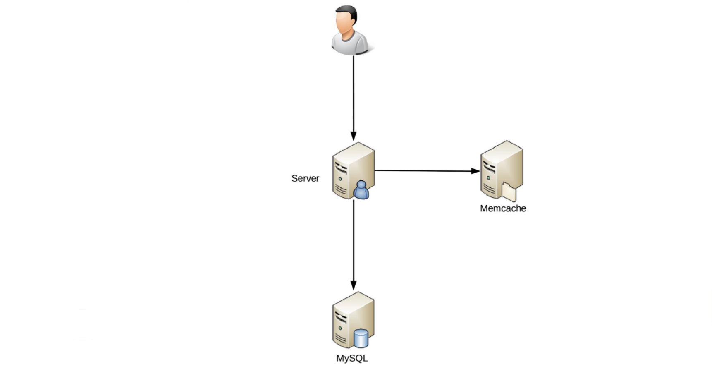

初始架构很简单：MySQL 负责存储，Memcache（以下简称 MC）负责缓存，Server 负责业务处理。这个架构通过 FMEA 分析后，能够有什么样的发现，下表是分析的样例（注意，这个样例并不完整，可以自行尝试将这个案例补充完整）。

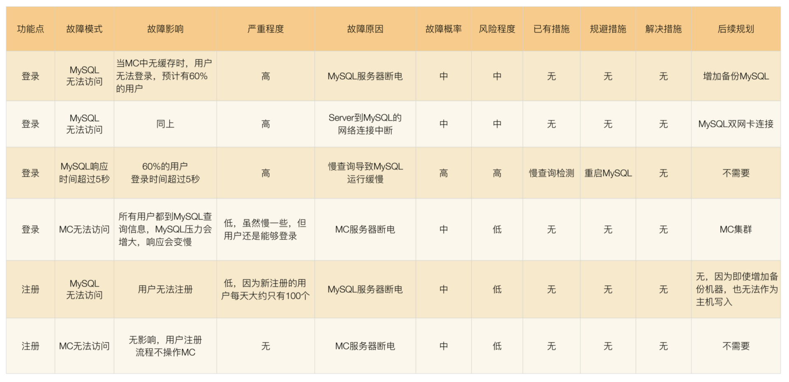

经过上表的 FMEA 分析，将“后续规划”列的内容汇总一下，最终得到了下面几条需要改进的措施：

1、MySQL 增加备机。

2、MC 从单机扩展为集群。

3、MySQL 双网卡连接。

改进后的架构如下：

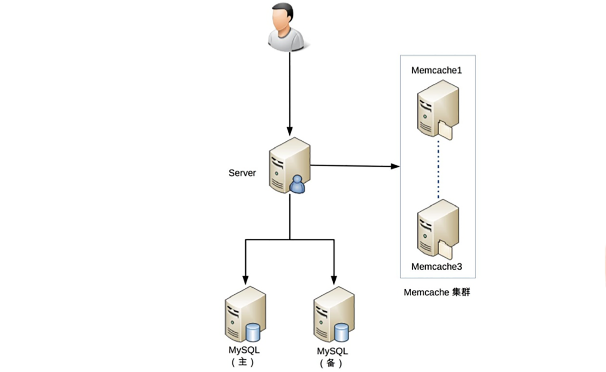

## 高可用存储架构：双机架构

存储高可用方案的本质都是通过将数据复制到多个存储设备，通过数据冗余的方式来实现高可用，其复杂性主要体现在如何应对复制延迟和中断导致的数据不一致问题。因此，对任何一个高可用存储方案，需要从以下几个方面去进行思考和分析：

1、数据如何复制？

2、各个节点的职责是什么？

3、如何应对复制延迟？

4、如何应对复制中断？

常见的高可用存储架构有主备、主从、主主、集群、分区，每一种又可以根据业务的需求进行一些特殊的定制化功能，由此衍生出更多的变种。由于不同业务的定制功能难以通用化，今天将针对业界通用的方案，来分析常见的双机高可用架构：主备、主从、主备 / 主从切换和主主。

### 主备复制

主备复制是最常见也是最简单的一种存储高可用方案，几乎所有的存储系统都提供了主备复制的功能，例如 MySQL、Redis、MongoDB 等。

1、基本实现

下面是标准的主备方案结构图：

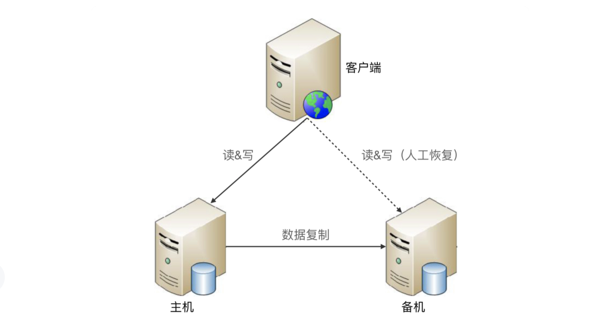

其整体架构比较简单，主备架构中的“备机”主要还是起到一个备份作用，并不承担实际的业务读写操作，如果要把备机改为主机，需要人工操作。

2、优缺点分析

主备复制架构的优点就是简单，表现有：

1）对于客户端来说，不需要感知备机的存在，即使灾难恢复后，原来的备机被人工修改为主机后，对于客户端来说，只是认为主机的地址换了而已，无须知道是原来的备机升级为主机。

2）对于主机和备机来说，双方只需要进行数据复制即可，无须进行状态判断和主备切换这类复杂的操作。

主备复制架构的缺点主要有：

1）备机仅仅只为备份，并没有提供读写操作，硬件成本上有浪费。

2）故障后需要人工干预，无法自动恢复。人工处理的效率是很低的，可能打电话找到能够操作的人就耗费了 10 分钟，甚至如果是深更半夜，出了故障都没人知道。人工在执行恢复操作的过程中也容易出错，因为这类操作并不常见，可能 1 年就 2、3 次，实际操作的时候很可能遇到各种意想不到的问题。

综合主备复制架构的优缺点，内部的后台管理系统使用主备复制架构的情况会比较多，例如学生管理系统、员工管理系统、假期管理系统等，因为这类系统的数据变更频率低，即使在某些场景下丢失数据，也可以通过人工的方式补全。

### 主从复制

主从复制和主备复制只有一字之差，“从”意思是“随从、仆从”，“备”的意思是备份。可以理解为仆从是要帮主人干活的，这里的干活就是承担“读”的操作。也就是说，主机负责读写操作，从机只负责读操作，不负责写操作。

1、基本实现

下面是标准的主从复制架构：

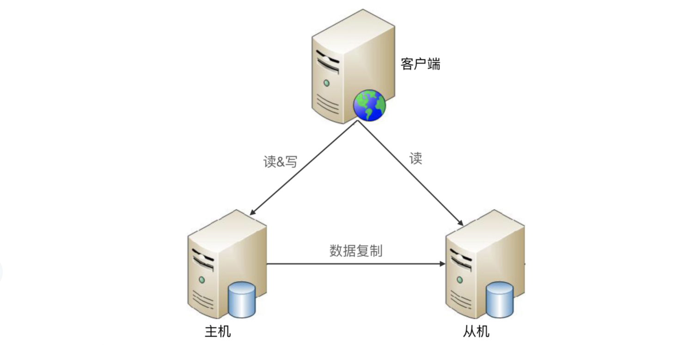

与主备复制架构比较类似，主要的差别点在于从机正常情况下也是要提供读的操作。

2、优缺点分析

主从复制与主备复制相比，优点有：

1）主从复制在主机故障时，读操作相关的业务可以继续运行。

2）主从复制架构的从机提供读操作，发挥了硬件的性能。

缺点有：

1）主从复制架构中，客户端需要感知主从关系，并将不同的操作发给不同的机器进行处理，复杂度比主备复制要高。

2）主从复制架构中，从机提供读业务，如果主从复制延迟比较大，业务会因为数据不一致出现问题。

3）故障时需要人工干预。

综合主从复制的优缺点，一般情况下，写少读多的业务使用主从复制的存储架构比较多。例如，论坛、BBS、新闻网站这类业务，此类业务的读操作数量是写操作数量的 10 倍甚至 100 倍以上。

### 双机切换

#### 设计关键

主备复制和主从复制方案存在两个共性的问题：

1、主机故障后，无法进行写操作。

2、如果主机无法恢复，需要人工指定新的主机角色。

双机切换就是为了解决这两个问题而产生的，包括主备切换和主从切换两种方案。简单来说，这两个方案就是在原有方案的基础上增加“切换”功能，即系统自动决定主机角色，并完成角色切换。由于主备切换和主从切换在切换的设计上没有差别，我接下来以主备切换为例，一起来看看双机切换架构是如何实现的。

要实现一个完善的切换方案，必须考虑这几个关键的设计点：

1、主备间状态判断

主要包括两方面： 状态传递的渠道，以及状态检测的内容。

状态传递的渠道：是相互间互相连接，还是第三方仲裁？

状态检测的内容：例如机器是否掉电、进程是否存在、响应是否缓慢等。

2、切换决策

主要包括几方面：切换时机、切换策略、自动程度。

切换时机：什么情况下备机应该升级为主机？是机器掉电后备机才升级，还是主机上的进程不存在就升级，还是主机响应时间超过 2 秒就升级，还是 3 分钟内主机连续重启 3 次就升级等。

切换策略：原来的主机故障恢复后，要再次切换，确保原来的主机继续做主机，还是原来的主机故障恢复后自动成为新的备机？

自动程度：切换是完全自动的，还是半自动的？例如，系统判断当前需要切换，但需要人工做最终的确认操作（例如，单击一下“切换”按钮）。

3、数据冲突

解决当原有故障的主机恢复后，新旧主机之间可能存在数据冲突。例如，用户在旧主机上新增了一条 ID 为 100 的数据，这个数据还没有复制到旧的备机，此时发生了切换，旧的备机升级为新的主机，用户又在新的主机上新增了一条 ID 为 100 的数据，当旧的故障主机恢复后，这两条 ID 都为 100 的数据，应该怎么处理？

以上设计点并没有放之四海而皆准的答案，不同的业务要求不一样，所以切换方案比复制方案不只是多了一个切换功能那么简单，而是复杂度上升了一个量级。形象点来说，如果复制方案的代码是 1000 行，那么切换方案的代码可能就是 10000 行，多出来的那 9000 行就是用于实现上面所讲的 3 个设计点的。

#### 常见架构

根据状态传递渠道的不同，常见的主备切换架构有三种形式：互连式、中介式和模拟式。

**互连式**

故名思议，互连式就是指主备机直接建立状态传递的渠道，架构图请注意与主备复制架构对比。

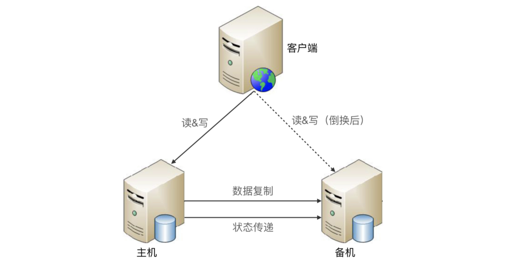

可以看到，在主备复制的架构基础上，主机和备机多了一个“状态传递”的通道，这个通道就是用来传递状态信息的。这个通道的具体实现可以有很多方式：

1、可以是网络连接（例如，各开一个端口），也可以是非网络连接（用串口线连接）。

2、可以是主机发送状态给备机，也可以是备机到主机来获取状态信息。

3、可以和数据复制通道共用，也可以独立一条通道。

4、状态传递通道可以是一条，也可以是多条，还可以是不同类型的通道混合（例如，网络 + 串口）。

为了充分利用切换方案能够自动决定主机这个优势，客户端这里也会有一些相应的改变，常见的方式有：

1、为了切换后不影响客户端的访问，主机和备机之间共享一个对客户端来说唯一的地址。例如虚拟 IP，主机需要绑定这个虚拟的 IP。

2、客户端同时记录主备机的地址，哪个能访问就访问哪个；备机虽然能收到客户端的操作请求，但是会直接拒绝，拒绝的原因就是“备机不对外提供服务”。

互连式主备切换主要的缺点在于：

1、如果状态传递的通道本身有故障（例如，网线被人不小心踢掉了），那么备机也会认为主机故障了从而将自己升级为主机，而此时主机并没有故障，最终就可能出现两个主机。

2、虽然可以通过增加多个通道来增强状态传递的可靠性，但这样做只是降低了通道故障概率而已，不能从根本上解决这个缺点，而且通道越多，后续的状态决策会更加复杂，因为对备机来说，可能从不同的通道收到了不同甚至矛盾的状态信息。

**中介式**

中介式指的是在主备两者之外引入第三方中介，主备机之间不直接连接，而都去连接中介，并且通过中介来传递状态信息，其架构图如下：

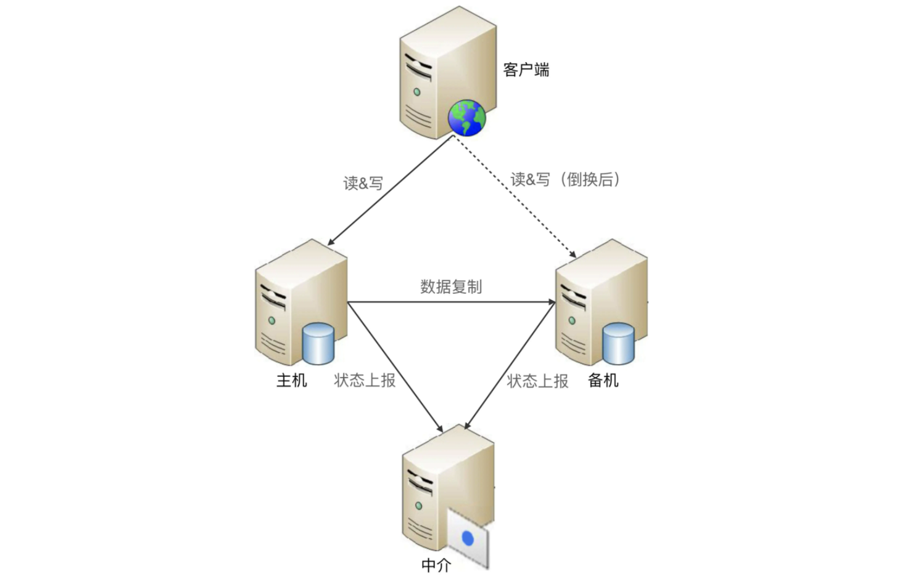

对比一下互连式切换架构，可以看到主机和备机不再通过互联通道传递状态信息，而是都将状态上报给中介这一角色。单纯从架构上看，中介式似乎比互连式更加复杂了，首先要引入中介，然后要各自上报状态。然而事实上，中介式架构在状态传递和决策上却更加简单。

**连接管理更简单**：主备机无须再建立和管理多种类型的状态传递连接通道，只要连接到中介即可，实际上是降低了主备机的连接管理复杂度。

例如，互连式要求主机开一个监听端口，备机来获取状态信息；或者要求备机开一个监听端口，主机推送状态信息到备机；如果还采用了串口连接，则需要增加串口连接管理和数据读取。采用中介式后，主备机都只需要把状态信息发送给中介，或者从中介获取对方的状态信息。无论是发送还是获取，主备机都是作为中介的客户端去操作，复杂度会降低。

**状态决策更简单**：主备机的状态决策简单了，无须考虑多种类型的连接通道获取的状态信息如何决策的问题，只需要按照下面简单的算法即可完成状态决策。

1）无论是主机还是备机，初始状态都是备机，并且只要与中介断开连接，就将自己降级为备机，因此可能出现双备机的情况。

2）主机与中介断连后，中介能够立刻告知备机，备机将自己升级为主机。

3）如果是网络中断导致主机与中介断连，主机自己会降级为备机，网络恢复后，旧的主机以新的备机身份向中介上报自己的状态。

4）如果是掉电重启或者进程重启，旧的主机初始状态为备机，与中介恢复连接后，发现已经有主机了，保持自己备机状态不变。

5）主备机与中介连接都正常的情况下，按照实际的状态决定是否进行切换。例如，主机响应时间超过 3 秒就进行切换，主机降级为备机，备机升级为主机即可。

虽然中介式架构在状态传递和状态决策上更加简单，但并不意味着这种优点是没有代价的，其关键代价就在于如何实现中介本身的高可用。如果中介自己宕机了，整个系统就进入了双备的状态，写操作相关的业务就不可用了。这就陷入了一个递归的陷阱：为了实现高可用引入中介，但中介本身又要求高可用，于是又要设计中介的高可用方案……如此递归下去就无穷无尽了。

MongoDB 的 Replica Set 采取的就是这种方式，其基本架构如下：

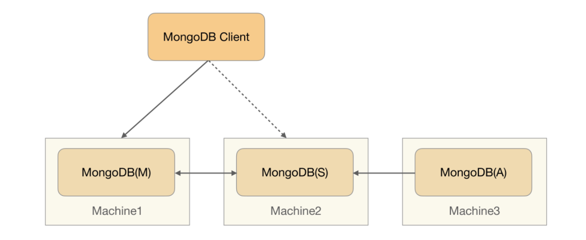

MongoDB(M) 表示主节点，MongoDB(S) 表示备节点，MongoDB(A) 表示仲裁节点。主备节点存储数据，仲裁节点不存储数据。客户端同时连接主节点与备节点，不连接仲裁节点。

幸运的是，开源方案已经有比较成熟的中介式解决方案，例如 ZooKeeper 和 Keepalived。ZooKeeper 本身已经实现了高可用集群架构，因此已经帮我们解决了中介本身的可靠性问题，在工程实践中推荐基于 ZooKeeper 搭建中介式切换架构。

**模拟式**

模拟式指主备机之间并不传递任何状态数据，而是备机模拟成一个客户端，向主机发起模拟的读写操作，根据读写操作的响应情况来判断主机的状态。其基本架构如下：

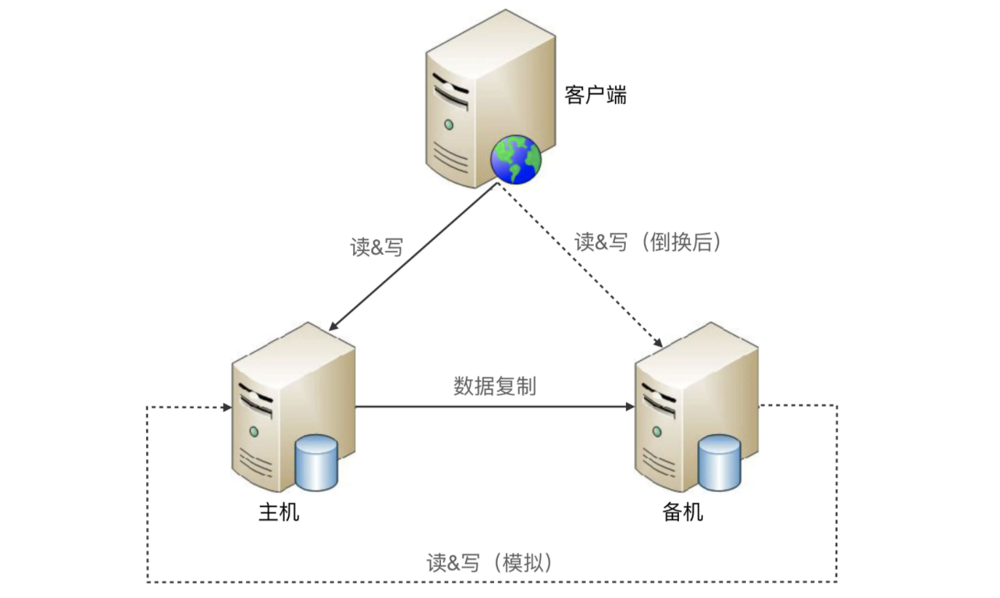

对比一下互连式切换架构，我们可以看到，主备机之间只有数据复制通道，而没有状态传递通道，备机通过模拟的读写操作来探测主机的状态，然后根据读写操作的响应情况来进行状态决策。

模拟式切换与互连式切换相比，优点是实现更加简单，因为省去了状态传递通道的建立和管理工作。

简单既是优点，同时也是缺点。因为模拟式读写操作获取的状态信息只有响应信息（例如，HTTP 404，超时、响应时间超过 3 秒等），没有互连式那样多样（除了响应信息，还可以包含 CPU 负载、I/O 负载、吞吐量、响应时间等），基于有限的状态来做状态决策，可能出现偏差。

### 主主复制

主主复制指的是两台机器都是主机，互相将数据复制给对方，客户端可以任意挑选其中一台机器进行读写操作，下面是基本架构图。

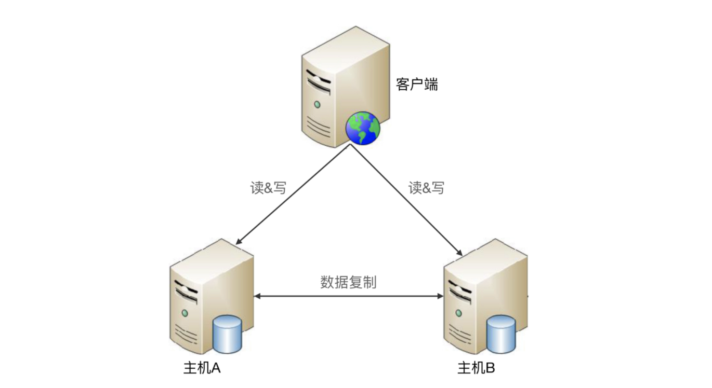

相比主备切换架构，主主复制架构具有如下特点：

1）两台都是主机，不存在切换的概念。

2）客户端无须区分不同角色的主机，随便将读写操作发送给哪台主机都可以。

从上面的描述来看，主主复制架构从总体上来看要简单很多，无须状态信息传递，也无须状态决策和状态切换。然而事实上主主复制架构也并不简单，而是有其独特的复杂性，具体表现在：如果采取主主复制架构，必须保证数据能够双向复制，而很多数据是不能双向复制的。例如：

1）用户注册后生成的用户 ID，如果按照数字增长，那就不能双向复制，否则就会出现 X 用户在主机 A 注册，分配的用户 ID 是 100，同时 Y 用户在主机 B 注册，分配的用户 ID 也是 100，这就出现了冲突。

2）库存不能双向复制。例如，一件商品库存 100 件，主机 A 上减了 1 件变成 99，主机 B 上减了 2 件变成 98，然后主机 A 将库存 99 复制到主机 B，主机 B 原有的库存 98 被覆盖，变成了 99，而实际上此时真正的库存是 97。类似的还有余额数据。

因此，主主复制架构对数据的设计有严格的要求，一般适合于那些临时性、可丢失、可覆盖的数据场景。例如，用户登录产生的 session 数据（可以重新登录生成）、用户行为的日志数据（可以丢失）、论坛的草稿数据（可以丢失）等。

## 高可用存储架构：集群和分区

### 数据集群

主备、主从、主主架构本质上都有一个隐含的假设：主机能够存储所有数据，但主机本身的存储和处理能力肯定是有极限的。以 PC 为例，Intel 386 时代服务器存储能力只有几百 MB，Intel 奔腾时代服务器存储能力可以有几十 GB，Intel 酷睿多核时代的服务器可以有几个 TB。单纯从硬件发展的角度来看，似乎发展速度还是挺快的，但如果和业务发展速度对比，那就差得远了。早在 2013 年，Facebook 就有 2500 亿张上传照片，当时这些照片的容量就已经达到了 250 PB 字节（250 × 1024TB），平均一天上传的图片有 3 亿 5000 万张。如此大量的数据，单台服务器肯定是无法存储和处理的，我们必须使用多台服务器来存储数据，这就是数据集群架构。

简单来说，集群就是多台机器组合在一起形成一个统一的系统，这里的“多台”，数量上至少是 3 台；相比而言，主备、主从都是 2 台机器。根据集群中机器承担的不同角色来划分，集群可以分为两类：数据集中集群、数据分散集群。

1、数据集中集群

数据集中集群与主备、主从这类架构相似，也可以称数据集中集群为 1 主多备或者 1 主多从。无论是 1 主 1 从、1 主 1 备，还是 1 主多备、1 主多从，数据都只能往主机中写，而读操作可以参考主备、主从架构进行灵活多变。下图是读写全部到主机的一种架构：

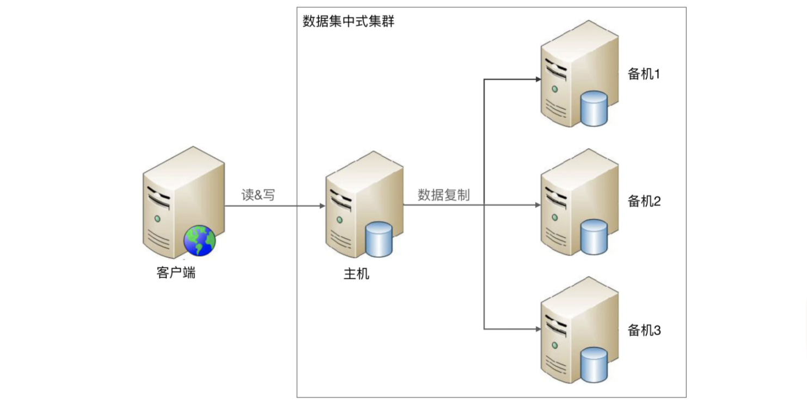

虽然架构上是类似的，但由于集群里面的服务器数量更多，导致复杂度整体更高一些，具体体现在：

1）主机如何将数据复制给备机

主备和主从架构中，只有一条复制通道，而数据集中集群架构中，存在多条复制通道。多条复制通道首先会增大主机复制的压力，某些场景下我们需要考虑如何降低主机复制压力，或者降低主机复制给正常读写带来的压力。

其次，多条复制通道可能会导致多个备机之间数据不一致，某些场景下我们需要对备机之间的数据一致性进行检查和修正。

2）备机如何检测主机状态

主备和主从架构中，只有一台备机需要进行主机状态判断。在数据集中集群架构中，多台备机都需要对主机状态进行判断，而不同的备机判断的结果可能是不同的，如何处理不同备机对主机状态的不同判断，是一个复杂的问题。

3）主机故障后，如何决定新的主机

主从架构中，如果主机故障，将备机升级为主机即可；而在数据集中集群架构中，有多台备机都可以升级为主机，但实际上只能允许一台备机升级为主机，那么究竟选择哪一台备机作为新的主机，备机之间如何协调，这也是一个复杂的问题。

目前开源的数据集中集群以 ZooKeeper 为典型，ZooKeeper 通过 ZAB 算法来解决上述提到的几个问题，但 ZAB 算法的复杂度是很高的。

2、数据分散集群

数据分散集群指多个服务器组成一个集群，每台服务器都会负责存储一部分数据；同时，为了提升硬件利用率，每台服务器又会备份一部分数据。

数据分散集群的复杂点在于如何将数据分配到不同的服务器上，算法需要考虑这些设计点：

1）均衡性

算法需要保证服务器上的数据分区基本是均衡的，不能存在某台服务器上的分区数量是另外一台服务器的几倍的情况。

2）容错性

当出现部分服务器故障时，算法需要将原来分配给故障服务器的数据分区分配给其他服务器。

3）可伸缩性

当集群容量不够，扩充新的服务器后，算法能够自动将部分数据分区迁移到新服务器，并保证扩容后所有服务器的均衡性。

数据分散集群和数据集中集群的不同点在于，数据分散集群中的每台服务器都可以处理读写请求，因此不存在数据集中集群中负责写的主机那样的角色。但在数据分散集群中，必须有一个角色来负责执行数据分配算法，这个角色可以是独立的一台服务器，也可以是集群自己选举出的一台服务器。如果是集群服务器选举出来一台机器承担数据分区分配的职责，则这台服务器一般也会叫作主机，但我们需要知道这里的“主机”和数据集中集群中的“主机”，其职责是有差异的。

Hadoop 的实现就是独立的服务器负责数据分区的分配，这台服务器叫作 Namenode。Hadoop 的数据分区管理架构如下：

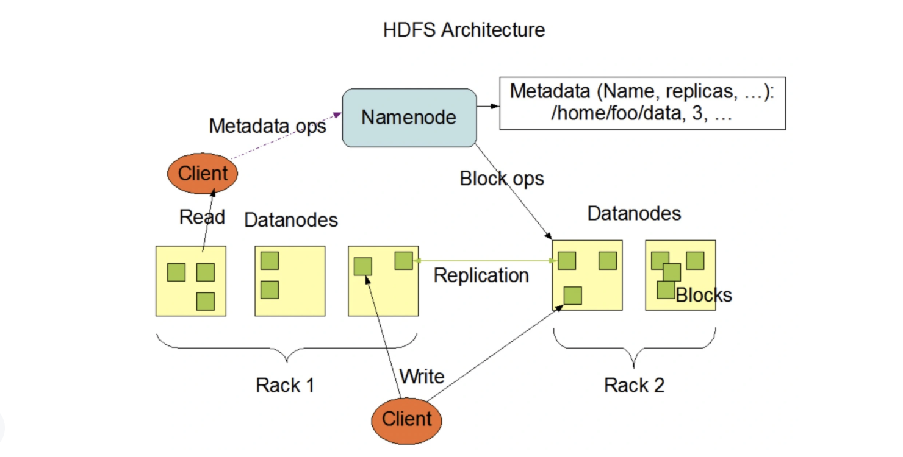

下面是 Hadoop 官方的解释，能够说明集中式数据分区管理的基本方式。

>HDFS 采用 master/slave 架构。一个 HDFS 集群由一个 Namenode 和一定数目的 Datanodes 组成。Namenode 是一个中心服务器，负责管理文件系统的名字空间（namespace），以及客户端对文件的访问。集群中的 Datanode 一般是一个节点一个，负责管理它所在节点上的存储。HDFS 暴露了文件系统的名字空间，用户能够以文件的形式在上面存储数据。从内部看，一个文件其实被分成一个或多个数据块，这些块存储在一组 Datanode 上。Namenode 执行文件系统的名字空间操作，比如打开、关闭、重命名文件或目录。它也负责确定数据块到具体 Datanode 节点的映射。Datanode 负责处理文件系统客户端的读写请求。在 Namenode 的统一调度下进行数据块的创建、删除和复制操作。

与 Hadoop 不同的是，Elasticsearch 集群通过选举一台服务器来做数据分区的分配，叫作 master node，其数据分区管理架构是：

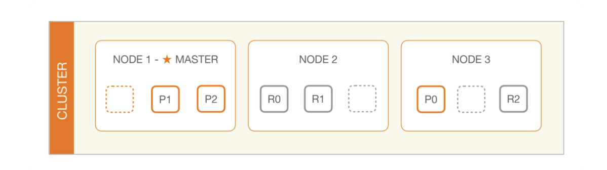

其中 master 节点的职责如下：

The master node is responsible for lightweight cluster-wide actions such as creating or deleting an index, tracking which nodes are part of the cluster, and deciding which shards to allocate to which nodes. It is important for cluster health to have a stable master node.

来源：[https://www.elastic.co/guide/en/elasticsearch/reference/current/modules-node.html](https://www.elastic.co/guide/en/elasticsearch/reference/current/modules-node.html)

数据集中集群架构中，客户端只能将数据写到主机；数据分散集群架构中，客户端可以向任意服务器中读写数据。正是因为这个关键的差异，决定了两种集群的应用场景不同。一般来说，数据集中集群适合数据量不大，集群机器数量不多的场景。例如，ZooKeeper 集群，一般推荐 5 台机器左右，数据量是单台服务器就能够支撑；而数据分散集群，由于其良好的可伸缩性，适合业务数据量巨大、集群机器数量庞大的业务场景。例如，Hadoop 集群、HBase 集群，大规模的集群可以达到上百台甚至上千台服务器。

### 数据分区

前面我们讨论的存储高可用架构都是基于硬件故障的场景去考虑和设计的，主要考虑当部分硬件可能损坏的情况下系统应该如何处理，但对于一些影响非常大的灾难或者事故来说，有可能所有的硬件全部故障。例如，新奥尔良水灾、美加大停电、洛杉矶大地震等这些极端灾害或者事故，可能会导致一个城市甚至一个地区的所有基础设施瘫痪，这种情况下基于硬件故障而设计的高可用架构不再适用，我们需要基于地理级别的故障来设计高可用架构，这就是数据分区架构产生的背景。

数据分区指将数据按照一定的规则进行分区，不同分区分布在不同的地理位置上，每个分区存储一部分数据，通过这种方式来规避地理级别的故障所造成的巨大影响。采用了数据分区的架构后，即使某个地区发生严重的自然灾害或者事故，受影响的也只是一部分数据，而不是全部数据都不可用；当故障恢复后，其他地区备份的数据也可以帮助故障地区快速恢复业务。

设计一个良好的数据分区架构，需要从多方面去考虑。

1、数据量

数据量的大小直接决定了分区的规则复杂度。例如，使用 MySQL 来存储数据，假设一台 MySQL 存储能力是 500GB，那么 2TB 的数据就至少需要 4 台 MySQL 服务器；而如果数据是 200TB，并不是增加到 800 台的 MySQL 服务器那么简单。如果按照 4 台服务器那样去平行管理 800 台服务器，复杂度会发生本质的变化，具体表现为：

1）800 台服务器里面可能每周都有一两台服务器故障，从 800 台里面定位出 2 台服务器故障，很多情况下并不是一件容易的事情，运维复杂度高。

2）增加新的服务器，分区相关的配置甚至规则需要修改，而每次修改理论上都有可能影响已有的 800 台服务器的运行，不小心改错配置的情况在实践中太常见了。

3）如此大量的数据，如果在地理位置上全部集中于某个城市，风险很大，遇到了水灾、大停电这种灾难性的故障时，数据可能全部丢失，因此分区规则需要考虑地理容灾。

因此，数据量越大，分区规则会越复杂，考虑的情况也越多。

2、分区规则

地理位置有近有远，因此可以得到不同的分区规则，包括洲际分区、国家分区、城市分区。具体采取哪种或者哪几种规则，需要综合考虑业务范围、成本等因素。

通常情况下，洲际分区主要用于面向不同大洲提供服务，由于跨洲通讯的网络延迟已经大到不适合提供在线服务了，因此洲际间的数据中心可以不互通或者仅仅作为备份；国家分区主要用于面向不同国家的用户提供服务，不同国家有不同语言、法律、业务等，国家间的分区一般也仅作为备份；城市分区由于都在同一个国家或者地区内，网络延迟较低，业务相似，分区同时对外提供服务，可以满足业务异地多活之类的需求。

3）复制规则

数据分区指将数据分散在多个地区，在某些异常或者灾难情况下，虽然部分数据受影响，但整体数据并没有全部被影响，本身就相当于一个高可用方案了。但仅仅做到这点还不够，因为每个分区本身的数据量虽然只是整体数据的一部分，但还是很大，这部分数据如果损坏或者丢失，损失同样难以接受。因此即使是分区架构，同样需要考虑复制方案。

常见的分区复制规则有三种：集中式、互备式和独立式。

**集中式**

集中式备份指存在一个总的备份中心，所有的分区都将数据备份到备份中心，其基本架构如下：

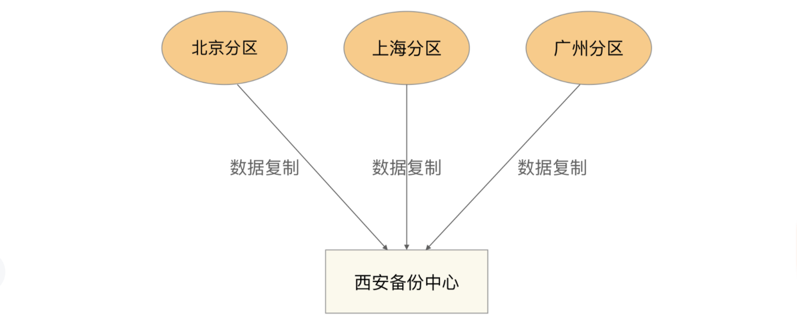

集中式备份架构的优缺点是：

1）设计简单，各分区之间并无直接联系，可以做到互不影响。

2）扩展容易，如果要增加第四个分区（例如，武汉分区），只需要将武汉分区的数据复制到西安备份中心即可，其他分区不受影响。

3）成本较高，需要建设一个独立的备份中心。

**互备式**

互备式备份指每个分区备份另外一个分区的数据，其基本架构如下：

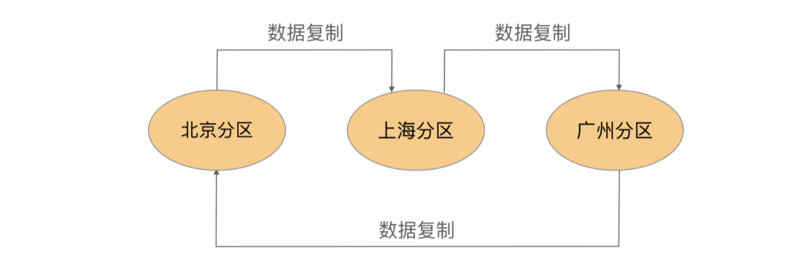

互备式备份架构的优缺点是：

1）设计比较复杂，各个分区除了要承担业务数据存储，还需要承担备份功能，相互之间互相关联和影响。

2）扩展麻烦，如果增加一个武汉分区，则需要修改广州分区的复制指向武汉分区，然后将武汉分区的复制指向北京分区。而原有北京分区已经备份了的广州分区的数据怎么处理也是个难题，不管是做数据迁移，还是广州分区历史数据保留在北京分区，新数据备份到武汉分区，无论哪种方式都很麻烦。

3）成本低，直接利用已有的设备。

**独立式**

独立式备份指每个分区自己有独立的备份中心，其基本架构如下：

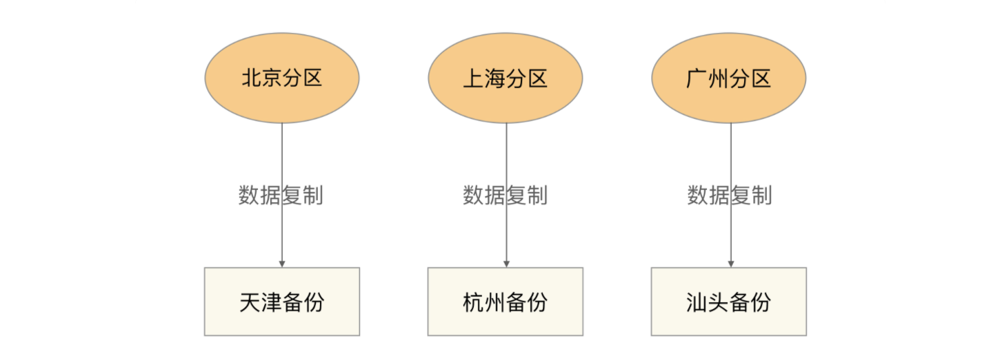

有一个细节需要特别注意，各个分区的备份并不和原来的分区在一个地方。例如，北京分区的备份放到了天津，上海的放到了杭州，广州的放到了汕头，这样做的主要目的是规避同城或者相同地理位置同时发生灾难性故障的极端情况。如果北京分区机房在朝阳区，而备份机房放在通州区，整个北京停电的话，两个机房都无法工作。

独立式备份架构的优缺点是：

1）设计简单，各分区互不影响。

2）扩展容易，新增加的分区只需要搭建自己的备份中心即可。

3）成本高，每个分区需要独立的备份中心，备份中心的场地成本是主要成本，因此独立式比集中式成本要高很多。

## 如何设计计算高可用架构

计算高可用的主要设计目标是当出现部分硬件损坏时，计算任务能够继续正常运行。因此计算高可用的本质是通过冗余来规避部分故障的风险，单台服务器是无论如何都达不到这个目标的。所以计算高可用的设计思想很简单：通过增加更多服务器来达到计算高可用。

计算高可用架构的设计复杂度主要体现在**任务管理**方面，即当任务在某台服务器上执行失败后，如何将任务重新分配到新的服务器进行执行。因此，计算高可用架构设计的关键点有下面两点。

1）哪些服务器可以执行任务

第一种方式和计算高性能中的集群类似，每个服务器都可以执行任务。例如，常见的访问网站的某个页面。

第二种方式和存储高可用中的集群类似，只有特定服务器（通常叫“主机”）可以执行任务。当执行任务的服务器故障后，系统需要挑选新的服务器来执行任务。例如，ZooKeeper 的 Leader 才能处理写操作请求。

2）任务如何重新执行

第一种策略是对于已经分配的任务即使执行失败也不做任何处理，系统只需要保证新的任务能够分配到其他非故障服务器上执行即可。

第二种策略是设计一个任务管理器来管理需要执行的计算任务，服务器执行完任务后，需要向任务管理器反馈任务执行结果，任务管理器根据任务执行结果来决定是否需要将任务重新分配到另外的服务器上执行。

需要注意的是：“任务分配器”是一个逻辑的概念，并不一定要求系统存在一个独立的任务分配器模块。例如：

1）Nginx 将页面请求发送给 Web 服务器，而 CSS/JS 等静态文件直接读取本地缓存。这里的 Nginx 角色是反向代理系统，但是承担了任务分配器的职责，而不需要 Nginx 做反向代理，后面再来一个任务分配器。

2）对于一些后台批量运算的任务，可以设计一个独立的任务分配系统来管理这些批处理任务的执行和分配。

3）ZooKeeper 中的 Follower 节点，当接收到写请求时会将请求转发给 Leader 节点处理，当接收到读请求时就自己处理，这里的 Follower 就相当于一个逻辑上的任务分配器。

接下来将详细阐述常见的计算高可用架构：主备、主从和集群。

### 主备

主备架构是计算高可用最简单的架构，和存储高可用的主备复制架构类似，但是要更简单一些，因为计算高可用的主备架构无须数据复制，其基本的架构示意图如下：

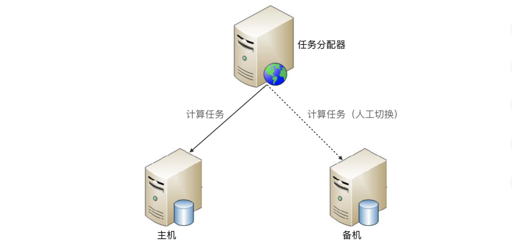

主备方案的详细设计：

1）主机执行所有计算任务。例如，读写数据、执行操作等。

2）当主机故障（例如，主机宕机）时，任务分配器不会自动将计算任务发送给备机，此时系统处于不可用状态。

3）如果主机能够恢复（不管是人工恢复还是自动恢复），任务分配器继续将任务发送给主机。

4）如果主机不能够恢复（例如，机器硬盘损坏，短时间内无法恢复），则需要人工操作，将备机升为主机，然后让任务分配器将任务发送给新的主机（即原来的备机）；同时，为了继续保持主备架构，需要人工增加新的机器作为备机。

根据备机状态的不同，主备架构又可以细分为冷备架构和温备架构。

**冷备**：备机上的程序包和配置文件都准备好，但备机上的业务系统没有启动（注意：备机的服务器是启动的），主机故障后，需要人工手工将备机的业务系统启动，并将任务分配器的任务请求切换发送给备机。

**温备**：备机上的业务系统已经启动，只是不对外提供服务，主机故障后，人工只需要将任务分配器的任务请求切换发送到备机即可。冷备可以节省一定的能源，但温备能够大大减少手工操作时间，因此一般情况下推荐用温备的方式。

主备架构的优点就是简单，主备机之间不需要进行交互，状态判断和切换操作由人工执行，系统实现很简单。而缺点正好也体现在“人工操作”这点上，因为人工操作的时间不可控，可能系统已经发生问题了，但维护人员还没发现，等了 1 个小时才发现。发现后人工切换的操作效率也比较低，可能需要半个小时才完成切换操作，而且手工操作过程中容易出错。例如，修改配置文件改错了、启动了错误的程序等。

和存储高可用中的主备复制架构类似，计算高可用的主备架构也比较适合与内部管理系统、后台管理系统这类使用人数不多、使用频率不高的业务，不太适合在线的业务。

### 主从

和存储高可用中的主从复制架构类似，计算高可用的主从架构中的从机也是要执行任务的。任务分配器需要将任务进行分类，确定哪些任务可以发送给主机执行，哪些任务可以发送给备机执行，其基本的架构示意图如下：

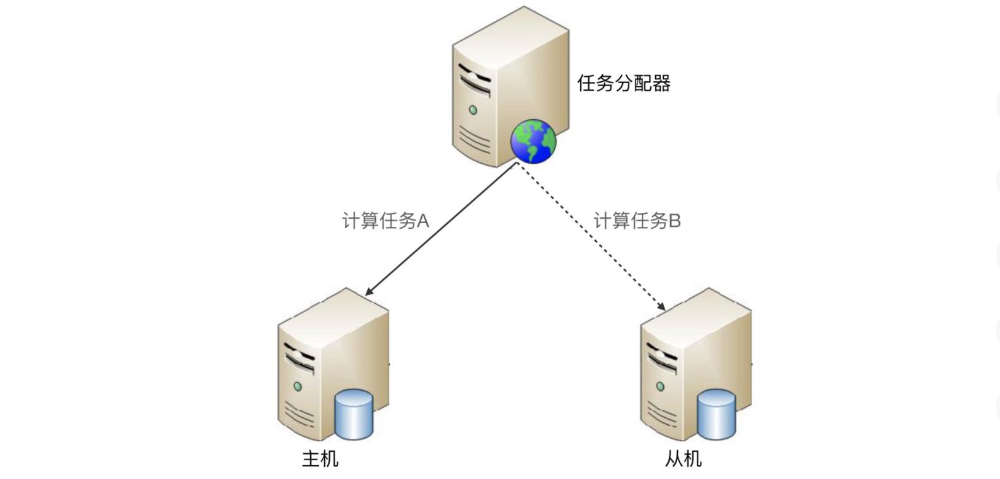

主从方案详细设计：

1）正常情况下，主机执行部分计算任务（如图中的“计算任务 A”），备机执行部分计算任务（如图中的“计算任务 B”）。

2）当主机故障（例如，主机宕机）时，任务分配器不会自动将原本发送给主机的任务发送给从机，而是继续发送给主机，不管这些任务执行是否成功。

3）如果主机能够恢复（不管是人工恢复还是自动恢复），任务分配器继续按照原有的设计策略分配任务，即计算任务 A 发送给主机，计算任务 B 发送给从机。

4）如果主机不能够恢复（例如，机器硬盘损坏，短时间内无法恢复），则需要人工操作，将原来的从机升级为主机（一般只是修改配置即可），增加新的机器作为从机，新的从机准备就绪后，任务分配器继续按照原有的设计策略分配任务。

主从架构与主备架构相比，优缺点有：

优点：主从架构的从机也执行任务，发挥了从机的硬件性能。

缺点：主从架构需要将任务分类，任务分配器会复杂一些。

### 集群

主备架构和主从架构通过冗余一台服务器来提升可用性，且需要人工来切换主备或者主从。这样的架构虽然简单，但存在一个主要的问题：人工操作效率低、容易出错、不能及时处理故障。因此在可用性要求更加严格的场景中，我们需要系统能够自动完成切换操作，这就是高可用集群方案。

高可用计算的集群方案根据集群中服务器节点角色的不同，可以分为两类：一类是对称集群，即集群中每个服务器的角色都是一样的，都可以执行所有任务；另一类是非对称集群，集群中的服务器分为多个不同的角色，不同的角色执行不同的任务，例如最常见的 Master-Slave 角色。

需要注意的是，计算高可用集群包含 2 台服务器的集群，这点和存储高可用集群不太一样。存储高可用集群把双机架构和集群架构进行了区分；而在计算高可用集群架构中，2 台服务器的集群和多台服务器的集群，在设计上没有本质区别，因此不需要进行区分。

#### 对称集群

对称集群更通俗的叫法是**负载均衡集群**，因此接下来使用“负载均衡集群”这个通俗的说法，架构示意图如下：

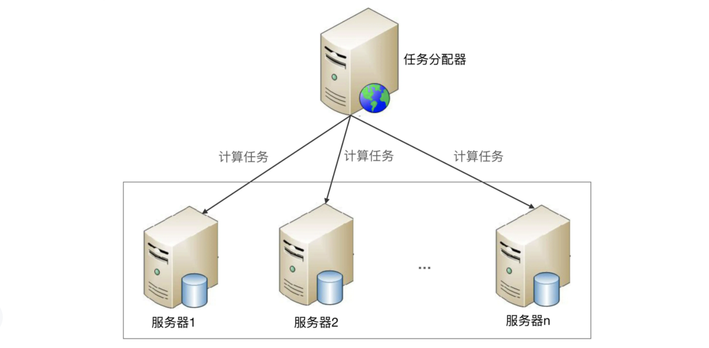

负载均衡集群详细设计：

1）正常情况下，任务分配器采取某种策略（随机、轮询等）将计算任务分配给集群中的不同服务器。

2）当集群中的某台服务器故障后，任务分配器不再将任务分配给它，而是将任务分配给其他服务器执行。

3）当故障的服务器恢复后，任务分配器重新将任务分配给它执行。

负载均衡集群的设计关键点在于两点：

1）任务分配器需要选取分配策略。

2）任务分配器需要检测服务器状态。

任务分配策略比较简单，轮询和随机基本就够了。状态检测稍微复杂一些，既要检测服务器的状态，例如服务器是否宕机、网络是否正常等；同时还要检测任务的执行状态，例如任务是否卡死、是否执行时间过长等。常用的做法是任务分配器和服务器之间通过心跳来传递信息，包括服务器信息和任务信息，然后根据实际情况来确定状态判断条件。

例如，一个在线页面访问系统，正常情况下页面平均会在 500 毫秒内返回，那么状态判断条件可以设计为：1 分钟内响应时间超过 1 秒（包括超时）的页面数量占了 80% 时，就认为服务器有故障。

例如，一个后台统计任务系统，正常情况下任务会在 5 分钟内执行完成，那么状态判断条件可以设计为：单个任务执行时间超过 10 分钟还没有结束，就认为服务器有故障。

通过上面两个案例可以看出，不同业务场景的状态判断条件差异很大，实际设计时要根据业务需求来进行设计和调优。

#### 非对称集群

非对称集群中不同服务器的角色是不同的，不同角色的服务器承担不同的职责。以 Master-Slave 为例，部分任务是 Master 服务器才能执行，部分任务是 Slave 服务器才能执行。非对称集群的基本架构示意图如下：

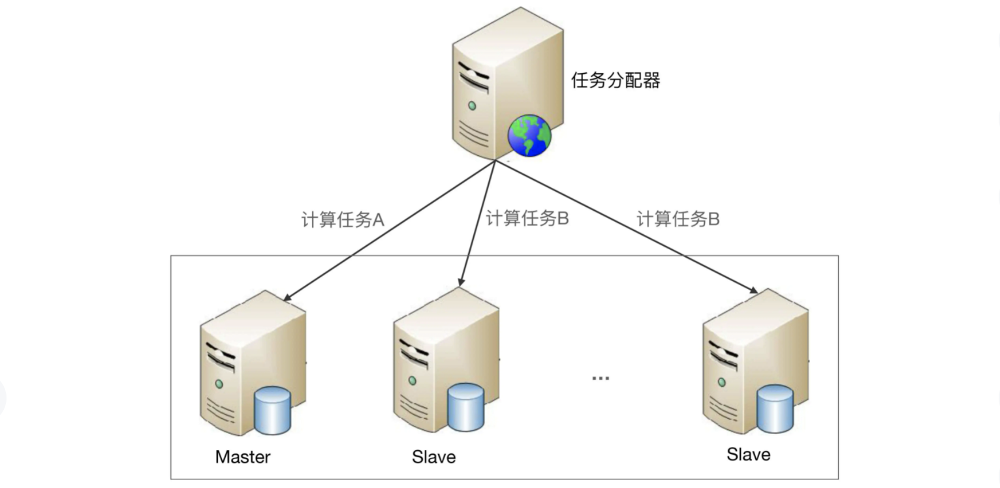

非对称集群架构详细设计：

1）集群会通过某种方式来区分不同服务器的角色。例如，通过 ZAB 算法选举，或者简单地取当前存活服务器中节点 ID 最小的服务器作为 Master 服务器。

2）任务分配器将不同任务发送给不同服务器。例如，图中的计算任务 A 发送给 Master 服务器，计算任务 B 发送给 Slave 服务器。

3）当指定类型的服务器故障时，需要重新分配角色。例如，Master 服务器故障后，需要将剩余的 Slave 服务器中的一个重新指定为 Master 服务器；如果是 Slave 服务器故障，则并不需要重新分配角色，只需要将故障服务器从集群剔除即可。

非对称集群相比负载均衡集群，设计复杂度主要体现在两个方面：

1）任务分配策略更加复杂：需要将任务划分为不同类型并分配给不同角色的集群节点。

2）角色分配策略实现比较复杂：例如，可能需要使用 ZAB、Raft 这类复杂的算法来实现 Leader 的选举。

以 ZooKeeper 为例：

1）任务分配器：ZooKeeper 中不存在独立的任务分配器节点，每个 Server 都是任务分配器，Follower 收到请求后会进行判断，如果是写请求就转发给 Leader，如果是读请求就自己处理。

2）角色指定：ZooKeeper 通过 ZAB 算法来选举 Leader，当 Leader 故障后，所有的 Follower 节点会暂停读写操作，开始进行选举，直到新的 Leader 选举出来后才继续对 Client 提供服务。

## 业务高可用保障：异地多活架构

无论是高可用计算架构，还是高可用存储架构，其本质的设计目的都是为了解决部分服务器故障的场景下，如何保证系统能够继续提供服务。但在一些极端场景下，有可能所有服务器都出现故障。例如，典型的有机房断电、机房火灾、地震、水灾……这些极端情况会导致某个系统所有服务器都故障，或者业务整体瘫痪，而且即使有其他地区的备份，把备份业务系统全部恢复到能够正常提供业务，花费的时间也比较长，可能是半小时，也可能是 12 小时。因为备份系统平时不对外提供服务，可能会存在很多隐藏的问题没有发现。如果业务期望达到即使在此类灾难性故障的情况下，业务也不受影响，或者在几分钟内就能够很快恢复，那么就需要设计异地多活架构。

### 异地多活应用场景

顾名思义，异地多活架构的关键点就是异地、多活，其中异地就是指地理位置上不同的地方，类似于“不要把鸡蛋都放在同一篮子里”；多活就是指不同地理位置上的系统都能够提供业务服务，这里的“活”是活动、活跃的意思。判断一个系统是否符合异地多活，需要满足两个标准：

1）正常情况下，用户无论访问哪一个地点的业务系统，都能够得到正确的业务服务。

2）某个地方业务异常的时候，用户访问其他地方正常的业务系统，能够得到正确的业务服务。

与“活”对应的是字是“备”，备是备份，正常情况下对外是不提供服务的，如果需要提供服务，则需要大量的人工干预和操作，花费大量的时间才能让“备”变成“活”。

单纯从异地多活的描述来看，异地多活很强大，能够保证在灾难的情况下业务都不受影响。那是不是意味着不管什么业务，我们都要去实现异地多活架构呢？其实不然，因为实现异地多活架构不是没有代价的，相反其代价很高，具体表现为：

1）系统复杂度会发生质的变化，需要设计复杂的异地多活架构。

2）成本会上升，毕竟要多在一个或者多个机房搭建独立的一套业务系统。

因此，异地多活虽然功能很强大，但也不是每个业务不管三七二十一都要上异地多活。例如，常见的新闻网站、企业内部的 IT 系统、游戏、博客站点等，如果无法承受异地多活带来的复杂度和成本，是可以不做异地多活的，只需要做异地备份即可。因为这类业务系统即使中断，对用户的影响并不会很大，例如，A 新闻网站看不了，用户换个新闻网站即可。而共享单车、滴滴出行、支付宝、微信这类业务，就需要做异地多活了，这类业务系统中断后，对用户的影响很大。例如，支付宝用不了，就没法买东西了；滴滴用不了，用户就打不到车了。

当然，如果业务规模很大，能够做异地多活的情况下还是尽量。首先，这样能够在异常的场景下给用户提供更好的体验；其次，业务规模很大肯定会伴随衍生的收入，例如广告收入，异地多活能够减少异常场景带来的收入损失。同样以新闻网站为例，虽然从业务的角度来看，新闻类网站对用户影响不大，反正用户也可以从其他地方看到基本相同的新闻，甚至用户几个小时不看新闻也没什么问题。但是从网站本身来看，几个小时不可访问肯定会影响用户对网站的口碑；其次几个小时不可访问，网站上的广告收入损失也会很大。

### 架构模式

根据地理位置上的距离来划分，异地多活架构可以分为同城异区、跨城异地、跨国异地。接下来详细解释一下每一种架构的细节与优缺点。

#### 同城异区

同城异区指的是将业务部署在同一个城市不同区的多个机房。例如，在北京部署两个机房，一个机房在海淀区，一个在通州区，然后将两个机房用专用的高速网络连接在一起。

如果考虑一些极端场景（例如，美加大停电、新奥尔良水灾），同城异区似乎没什么作用，那为何还要设计同城异区这种架构呢？答案就在于“同城”。

同城的两个机房，距离上一般大约就是几十千米，通过搭建高速的网络，同城异区的两个机房能够实现和同一个机房内几乎一样的网络传输速度。这就意味着虽然是两个不同地理位置上的机房，但逻辑上我们可以将它们看作同一个机房，这样的设计大大降低了复杂度，减少了异地多活的设计和实现复杂度及成本。

那如果采用了同城异区架构，一旦发生新奥尔良水灾这种灾难怎么办呢？很遗憾，答案是无能为力。但需要考虑的是，这种极端灾难发生概率是比较低的，可能几年或者十几年才发生一次。其次，除了这类灾难，机房火灾、机房停电、机房空调故障这类问题发生的概率更高，而且破坏力一样很大。而这些故障场景，同城异区架构都可以很好地解决。因此，结合复杂度、成本、故障发生概率来综合考虑，同城异区是应对机房级别故障的最优架构。

#### 跨城异地

跨城异地指的是业务部署在不同城市的多个机房，而且距离最好要远一些。例如，将业务部署在北京和广州两个机房，而不是将业务部署在广州和深圳的两个机房。

为何跨城异地要强调距离要远呢？前面在介绍同城异区的架构时提到同城异区不能解决新奥尔良水灾这种问题，而两个城市离得太近又无法应对如美加大停电这种问题，跨城异地其实就是为了解决这两类问题的，因此需要在距离上比较远，才能有效应对这类极端灾难事件。

跨城异地虽然能够有效应对极端灾难事件，但“距离较远”这点并不只是一个距离数字上的变化，而是量变引起了质变，导致了跨城异地的架构复杂度大大上升。距离增加带来的最主要问题是两个机房的网络传输速度会降低，这不是以人的意志为转移的，而是物理定律决定的，即光速真空传播大约是每秒 30 万千米，在光纤中传输的速度大约是每秒 20 万千米，再加上传输中的各种网络设备的处理，实际还远远达不到理论上的速度。

除了距离上的限制，中间传输各种不可控的因素也非常多。例如，挖掘机把光纤挖断、中美海底电缆被拖船扯断、骨干网故障等，这些线路很多是第三方维护，针对故障我们根本无能为力也无法预知。例如，广州机房到北京机房，正常情况下 RTT 大约是 50 毫秒左右，遇到网络波动之类的情况，RTT 可能飙升到 500 毫秒甚至 1 秒，更不用说经常发生的线路丢包问题，那延迟可能就是几秒几十秒了。

以上描述的问题，虽然同城异区理论上也会遇到，但由于同城异区距离较短，中间经过的线路和设备较少，问题发生的概率会低很多。而且同城异区距离短，即使是搭建多条互联通道，成本也不会太高，而跨城异区距离太远，搭建或者使用多通道的成本会高不少。

跨城异地距离较远带来的网络传输延迟问题，给异地多活架构设计带来了复杂性，如果要做到真正意义上的多活，业务系统需要考虑部署在不同地点的两个机房，在数据短时间不一致的情况下，还能够正常提供业务。这就引入了一个看似矛盾的地方：数据不一致业务肯定不会正常，但跨城异地肯定会导致数据不一致。

如何解决这个问题呢？重点还是在“数据”上，即根据数据的特性来做不同的架构。如果是强一致性要求的数据，例如银行存款余额、支付宝余额等，这类数据实际上是无法做到跨城异地多活的。我们来看一个假设的例子，假如做一个互联网金融的业务，用户余额支持跨城异地多活，系统分别部署在广州和北京，那么如果挖掘机挖断光缆后，会出现如下场景：

1）用户 A 余额有 10000 元钱，北京和广州机房都是这个数据。

2）用户 A 向用户 B 转了 5000 元钱，这个操作是在广州机房完成的，完成后用户 A 在广州机房的余额是 5000 元。

3）由于广州和北京机房网络被挖掘机挖断，广州机房无法将余额变动通知北京机房，此时北京机房用户 A 的余额还是 10000 元。

4）用户 A 到北京机房又发起转账，此时他看到自己的余额还有 10000 元，于是向用户 C 转账 10000 元，转账完成后用户 A 的余额变为 0。

5）用户 A 到广州机房一看，余额怎么还有 5000 元？于是赶紧又发起转账，转账 5000 元给用户 D；此时广州机房用户 A 的余额也变为 0 了。

最终，本来余额 10000 元的用户 A，却转了 20000 元出去给其他用户。

对于以上这种假设场景，虽然普通用户很难这样自如地操作，但如果真的这么做，被黑客发现后，后果不堪设想。正因为如此，支付宝等金融相关的系统，对余额这类数据，一般不会做跨城异地的多活架构，而只能采用同城异区这种架构。

而对数据一致性要求不那么高，或者数据不怎么改变，或者即使数据丢失影响也不大的业务，跨城异地多活就能够派上用场了。例如，用户登录（数据不一致时用户重新登录即可）、新闻类网站（一天内的新闻数据变化较少）、微博类网站（丢失用户发布的微博或者评论影响不大），这些业务采用跨城异地多活，能够很好地应对极端灾难的场景。

#### 跨国异地

跨国异地指的是业务部署在不同国家的多个机房。相比跨城异地，跨国异地的距离就更远了，因此数据同步的延时会更长，正常情况下可能就有几秒钟了。这种程度的延迟已经无法满足异地多活标准的第一条：“正常情况下，用户无论访问哪一个地点的业务系统，都能够得到正确的业务服务”。例如，假设有一个微博类网站，分别在中国的上海和美国的纽约都建了机房，用户 A 在上海机房发表了一篇微博，此时如果他的一个关注者 B 用户访问到美国的机房，很可能无法看到用户 A 刚刚发表的微博。虽然跨城异地也会有此类同步延时问题，但正常情况下几十毫秒的延时对用户来说基本无感知的；而延时达到几秒钟就感觉比较明显了。

因此，跨国异地的“多活”，和跨城异地的“多活”，实际的含义并不完全一致。跨国异地多活的主要应用场景一般有这几种情况：

1、为不同地区用户提供服务

例如，亚马逊中国是为中国用户服务的，而亚马逊美国是为美国用户服务的，亚马逊中国的用户如果访问美国亚马逊，是无法用亚马逊中国的账号登录美国亚马逊的。

2、只读类业务做多活

例如，谷歌的搜索业务，由于用户搜索资料时，这些资料都已经存在于谷歌的搜索引擎上面，无论是访问英国谷歌，还是访问美国谷歌，搜索结果基本相同，并且对用户来说，也不需要搜索到最新的实时资料，跨国异地的几秒钟网络延迟，对搜索结果是没有什么影响的。

## 异地多活设计4大技巧

### 1、保证核心业务的异地多活

“异地多活”是为了保证业务的高可用，但很多架构师在考虑这个“业务”时，会不自觉地陷入一个思维误区：要保证所有业务都能“异地多活”！

假设需要做一个“用户子系统”，这个子系统负责“注册”“登录”“用户信息”三个业务。为了支持海量用户，设计了一个“用户分区”的架构，即正常情况下用户属于某个主分区，每个分区都有其他数据的备份，用户用邮箱或者手机号注册，路由层拿到邮箱或者手机号后，通过 Hash 计算属于哪个中心，然后请求对应的业务中心。基本的架构如下：

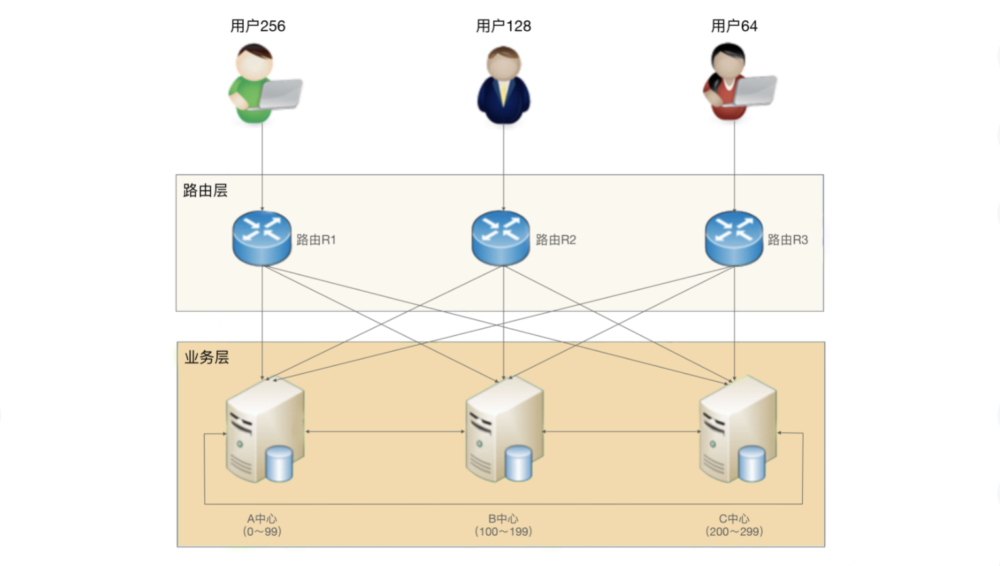

这样一个系统，如果 3 个业务要同时实现异地多活，会发现这些难以解决的问题：

1）注册问题

A 中心注册了用户，数据还未同步到 B 中心，此时 A 中心宕机，为了支持注册业务多活，可以挑选 B 中心让用户去重新注册。看起来很容易就支持多活了，但仔细思考一下会发现这样做会有问题：一个手机号只能注册一个账号，A 中心的数据没有同步过来，B 中心无法判断这个手机号是否重复，如果 B 中心让用户注册，后来 A 中心恢复了，发现数据有冲突，怎么解决？实际上是无法解决的，因为同一个手机号注册的账号不能以后一次注册为准；而如果 B 中心不支持本来属于 A 中心的业务进行注册，注册业务的多活又成了空谈。

如果修改业务规则，允许一个手机号注册多个账号不就可以了吗？这样做是不可行的，类似一个手机号只能注册一个账号这种规则，是核心业务规则，修改核心业务规则的代价非常大，几乎所有的业务都要重新设计，为了架构设计去改变业务规则（而且是这么核心的业务规则）是得不偿失的。

2）用户信息问题

用户信息的修改和注册有类似的问题，即 A、B 两个中心在异常的情况下都修改了用户信息，如何处理冲突？

由于用户信息并没有账号那么关键，一种简单的处理方式是按照时间合并，即最后修改的生效。业务逻辑上没问题，但实际操作也有一个很关键的“坑”：怎么保证多个中心所有机器时间绝对一致？在异地多中心的网络下，这个是无法保证的，即使有时间同步也无法完全保证，只要两个中心的时间误差超过 1 秒，数据就可能出现混乱，即先修改的反而生效。

还有一种方式是生成全局唯一递增 ID，这个方案的成本很高，因为这个全局唯一递增 ID 的系统本身又要考虑异地多活，同样涉及数据一致性和冲突的问题。

综合上面的简单分析可以发现，如果“注册”“登录”“用户信息”全部都要支持异地多活，实际上是挺难的，有的问题甚至是无解的。那这种情况下应该如何考虑“异地多活”的架构设计呢？答案其实很简单：**优先实现核心业务的异地多活架构！**

对于这个模拟案例来说，“登录”才是最核心的业务，“注册”和“用户信息”虽然也是主要业务，但并不一定要实现异地多活，主要原因在于业务影响不同。对于一个日活 1000 万的业务来说，每天注册用户可能是几万，修改用户信息的可能还不到 1 万，但登录用户是 1000 万，很明显应该保证登录的异地多活。

对于新用户来说，注册不了的影响并不明显，因为他还没有真正开始使用业务。用户信息修改也类似，暂时修改不了用户信息，对于其业务不会有很大影响。而如果有几百万用户登录不了，就相当于几百万用户无法使用业务，对业务的影响就非常大了：公司的客服热线很快就被打爆，微博、微信上到处都在传业务宕机，论坛里面到处是抱怨的用户，那就是互联网大事件了！

而登录实现“异地多活”恰恰是最简单的，因为每个中心都有所有用户的账号和密码信息，用户在哪个中心都可以登录。用户在 A 中心登录，A 中心宕机后，用户到 B 中心重新登录即可。如果某个用户在 A 中心修改了密码，此时数据还没有同步到 B 中心，用户到 B 中心登录是无法登录的，这个怎么处理？这个问题其实就涉及另外一个设计技巧了，卖个关子稍后再谈。

### 2、保证核心数据最终一致性

异地多活本质上是通过异地的数据冗余，来保证在极端异常的情况下业务也能够正常提供给用户，因此数据同步是异地多活架构设计的核心。但大部分架构师在考虑数据同步方案时，会不知不觉地陷入完美主义误区：要所有数据都实时同步！

数据冗余是要将数据从 A 地同步到 B 地，从业务的角度来看是越快越好，最好和本地机房一样的速度最好。但让人头疼的问题正在这里：异地多活理论上就不可能很快，因为这是物理定律决定的（上一期已有说明）。

因此异地多活架构面临一个无法彻底解决的矛盾：业务上要求数据快速同步，物理上正好做不到数据快速同步，因此所有数据都实时同步，实际上是一个无法达到的目标。既然是无法彻底解决的矛盾，那就只能想办法尽量减少影响。有几种方法可以参考：

1）尽量减少异地多活机房的距离，搭建高速网络

这和上一期讲到的同城异区架构类似，但搭建跨城异地的高速网络成本远远超过同城异区的高速网络，成本巨大，一般只有巨头公司才能承担。

2）尽量减少数据同步，只同步核心业务相关的数据

简单来说就是不重要的数据不同步，同步后没用的数据不同步，只同步核心业务相关的数据。

以前面的“用户子系统”为例，用户登录所产生的 token 或者 session 信息，数据量很大，但其实并不需要同步到其他业务中心，因为这些数据丢失后重新登录就可以再次获取了。

这时可能会想到：这些数据丢失后要求用户重新登录，影响用户体验！确实如此，毕竟需要用户重新输入账户和密码信息，或者至少要弹出登录界面让用户点击一次，但相比为了同步所有数据带来的代价，这个影响完全可以接受。为什么这么说呢，还是卖个关子会在后面分析。

3）保证最终一致性，不保证实时一致性

最终一致性就是前面介绍 CAP 理论时提到的 BASE 理论，即业务不依赖数据同步的实时性，只要数据最终能一致即可。例如，A 机房注册了一个用户，业务上不要求能够在 50 毫秒内就同步到所有机房，正常情况下要求 5 分钟同步到所有机房即可，异常情况下甚至可以允许 1 小时或者 1 天后能够一致。

最终一致性在具体实现时，还需要根据不同的数据特征，进行差异化的处理，以满足业务需要。例如，对“账号”信息来说，如果在 A 机房新注册的用户 5 分钟内正好跑到 B 机房了，此时 B 机房还没有这个用户的信息，为了保证业务的正确，B 机房就需要根据路由规则到 A 机房请求数据。

而对“用户信息”来说，5 分钟后同步也没有问题，也不需要采取其他措施来弥补，但还是会影响用户体验，即用户看到了旧的用户信息，这个问题怎么解决呢？好像又是一个解决不了的问题，和前面留下的两个问题一起，在最后再给出答案。

### 3、采用多种手段同步数据

数据同步是异地多活架构设计的核心，幸运的是基本上存储系统本身都会有同步的功能。例如，MySQL 的主备复制、Redis 的 Cluster 功能、Elasticsearch 的集群功能。这些系统本身的同步功能已经比较强大，能够直接拿来就用，但这也无形中将引入了一个思维误区：只使用存储系统的同步功能！

既然说存储系统本身就有同步功能，而且同步功能还很强大，为何说只使用存储系统是一个思维误区呢？因为虽然绝大部分场景下，存储系统本身的同步功能基本上也够用了，但在某些比较极端的情况下，存储系统本身的同步功能可能难以满足业务需求。

以 MySQL 为例，MySQL 5.1 版本的复制是单线程的复制，在网络抖动或者大量数据同步时，经常发生延迟较长的问题，短则延迟十几秒，长则可能达到十几分钟。而且即使通过监控的手段知道了 MySQL 同步时延较长，也难以采取什么措施，只能干等。

Redis 又是另外一个问题，Redis 3.0 之前没有 Cluster 功能，只有主从复制功能，而为了设计上的简单，Redis 2.8 之前的版本，主从复制有一个比较大的隐患：从机宕机或者和主机断开连接都需要重新连接主机，重新连接主机都会触发全量的主从复制。这时主机会生成内存快照，主机依然可以对外提供服务，但是作为读的从机，就无法提供对外服务了，如果数据量大，恢复的时间会相当长。

综合上面的案例可以看出，存储系统本身自带的同步功能，在某些场景下是无法满足业务需要的。尤其是异地多机房这种部署，各种各样的异常情况都可能出现，当只考虑存储系统本身的同步功能时，就会发现无法做到真正的异地多活。

解决的方案就是拓开思路，避免只使用存储系统的同步功能，可以将多种手段配合存储系统的同步来使用，甚至可以不采用存储系统的同步方案，改用自己的同步方案。

还是以前面的“用户子系统”为例，可以采用如下几种方式同步数据：

1）消息队列方式

对于账号数据，由于账号只会创建，不会修改和删除（假设我们不提供删除功能），我们可以将账号数据通过消息队列同步到其他业务中心。

2）二次读取方式

某些情况下可能出现消息队列同步也延迟了，用户在 A 中心注册，然后访问 B 中心的业务，此时 B 中心本地拿不到用户的账号数据。为了解决这个问题，B 中心在读取本地数据失败时，可以根据路由规则，再去 A 中心访问一次（这就是所谓的二次读取，第一次读取本地，本地失败后第二次读取对端），这样就能够解决异常情况下同步延迟的问题。

3）存储系统同步方式

对于密码数据，由于用户改密码频率较低，而且用户不可能在 1 秒内连续改多次密码，所以通过数据库的同步机制将数据复制到其他业务中心即可，用户信息数据和密码类似。

4）回源读取方式

对于登录的 session 数据，由于数据量很大，可以不同步数据；但当用户在 A 中心登录后，然后又在 B 中心登录，B 中心拿到用户上传的 session id 后，根据路由判断 session 属于 A 中心，直接去 A 中心请求 session 数据即可；反之亦然，A 中心也可以到 B 中心去获取 session 数据。

5）重新生成数据方式

对于“回源读取”场景，如果异常情况下，A 中心宕机了，B 中心请求 session 数据失败，此时就只能登录失败，让用户重新在 B 中心登录，生成新的 session 数据。

注意：以上方案仅仅是示意，实际的设计方案要比这个复杂一些，还有很多细节要考虑。综合上述的各种措施，最后“用户子系统”同步方式整体如下：

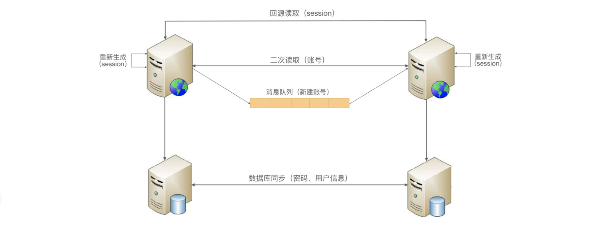

### 4、只保证绝大部分用户的异地多活

前面在给出每个思维误区对应的解决方案时，留下了几个小尾巴：某些场景下我们无法保证 100% 的业务可用性，总是会有一定的损失。例如，密码不同步导致无法登录、用户信息不同步导致用户看到旧的信息等，这个问题怎么解决呢？

其实这个问题涉及异地多活架构设计中一个典型的思维误区：要保证业务 100% 可用！但极端情况下就是会丢一部分数据，就是会有一部分数据不能同步，有没有什么巧妙能做到 100% 可用呢？

很遗憾，答案是没有！异地多活也无法保证 100% 的业务可用，这是由物理规律决定的，光速和网络的传播速度、硬盘的读写速度、极端异常情况的不可控等，都是无法 100% 解决的。所以针对这个思维误区，答案是“忍”！也就是说要忍受这一小部分用户或者业务上的损失，否则本来想为了保证最后的 0.01% 的用户的可用性，做一个完美方案，结果却发现 99.99% 的用户都保证不了了。

对于某些实时强一致性的业务，实际上受影响的用户会更多，甚至可能达到 1/3 的用户。以银行转账这个业务为例，假设小明在北京 XX 银行开了账号，如果小明要转账，一定要北京的银行业务中心才可用，否则就不允许小明自己转账。如果不这样的话，假设在北京和上海两个业务中心实现了实时转账的异地多活，某些异常情况下就可能出现小明只有 1 万元存款，他在北京转给了张三 1 万元，然后又到上海转给了李四 1 万元，两次转账都成功了。这种漏洞如果被人利用，后果不堪设想。

当然，针对银行转账这个业务，虽然无法做到“实时转账”的异地多活，但可以通过特殊的业务手段让转账业务也能实现异地多活。例如，转账业务除了“实时转账”外，还提供“转账申请”业务，即小明在上海业务中心提交转账请求，但上海的业务中心并不立即转账，而是记录这个转账请求，然后后台异步发起真正的转账操作，如果此时北京业务中心不可用，转账请求就可以继续等待重试；假设等待 2 个小时后北京业务中心恢复了，此时上海业务中心去请求转账，发现余额不够，这个转账请求就失败了。小明再登录上来就会看到转账申请失败，原因是“余额不足”。

不过需要注意的是“转账申请”的这种方式虽然有助于实现异地多活，但其实还是牺牲了用户体验的，对于小明来说，本来一次操作的事情，需要分为两次：一次提交转账申请，另外一次是要确认是否转账成功。虽然无法做到 100% 可用性，但并不意味着什么都不能做，为了让用户心里更好受一些，可以采取一些措施进行安抚或者补偿，例如：

1）挂公告

说明现在有问题和基本的问题原因，如果不明确原因或者不方便说出原因，可以发布“技术正在紧急处理”这类比较轻松和有趣的公告。

2）事后对用户进行补偿

例如，送一些业务上可用的代金券、小礼包等，减少用户的抱怨。

3）补充体验

对于为了做异地多活而带来的体验损失，可以想一些方法减少或者规避。以“转账申请”为例，为了让用户不用确认转账申请是否成功，我们可以在转账成功或者失败后直接给用户发个短信，告诉他转账结果，这样用户就不用时不时地登录系统来确认转账是否成功了。

### 核心思想

异地多活设计的理念可以总结为一句话：采用多种手段，保证绝大部分用户的核心业务异地多活！

## 异地多活设计4步走

### 1、业务分级

按照一定的标准将业务进行分级，挑选出核心的业务，只为核心业务设计异地多活，降低方案整体复杂度和实现成本。

常见的分级标准有下面几种：

1）访问量大的业务

以用户管理系统为例，业务包括登录、注册、用户信息管理，其中登录的访问量肯定是最大的。

2）核心业务

以 QQ 为例，QQ 的主场景是聊天，QQ 空间虽然也是重要业务，但和聊天相比，重要性就会低一些，如果要从聊天和 QQ 空间两个业务里面挑选一个做异地多活，那明显聊天要更重要（当然，此类公司如腾讯，应该是两个都实现了异地多活的）。

3）产生大量收入的业务

同样以 QQ 为例，聊天可能很难为腾讯带来收益，因为聊天没法插入广告；而 QQ 空间反而可能带来更多收益，因为 QQ 空间可以插入很多广告，因此如果从收入的角度来看，QQ 空间做异地多活的优先级反而高于 QQ 聊天了。

以一直在举例的用户管理系统为例，“登录”业务符合“访问量大的业务”和“核心业务”这两条标准，因此将登录业务作为核心业务。

### 2、数据分类

挑选出核心业务后，需要对核心业务相关的数据进一步分析，目的在于识别所有的数据及数据特征，这些数据特征会影响后面的方案设计。

常见的数据特征分析维度有：

1）数据量

这里的数据量包括总的数据量和新增、修改、删除的量。对异地多活架构来说，新增、修改、删除的数据就是可能要同步的数据，数据量越大，同步延迟的几率越高，同步方案需要考虑相应的解决方案。

2）唯一性

唯一性指数据是否要求多个异地机房产生的同类数据必须保证唯一。例如用户 ID，如果两个机房的两个不同用户注册后生成了一样的用户 ID，这样业务上就出错了。

数据的唯一性影响业务的多活设计，如果数据不需要唯一，那就说明两个地方都产生同类数据是可能的；如果数据要求必须唯一，要么只能一个中心点产生数据，要么需要设计一个数据唯一生成的算法。

3）实时性

实时性指如果在 A 机房修改了数据，要求多长时间必须同步到 B 机房，实时性要求越高，对同步的要求越高，方案越复杂。

4）可丢失性

可丢失性指数据是否可以丢失。例如，写入 A 机房的数据还没有同步到 B 机房，此时 A 机房机器宕机会导致数据丢失，那这部分丢失的数据是否对业务会产生重大影响。

例如，登录过程中产生的 session 数据就是可丢失的，因为用户只要重新登录就可以生成新的 session；而用户 ID 数据是不可丢失的，丢失后用户就会失去所有和用户 ID 相关的数据，例如用户的好友、用户的钱等。

5）可恢复性

可恢复性指数据丢失后，是否可以通过某种手段进行恢复，如果数据可以恢复，至少说明对业务的影响不会那么大，这样可以相应地降低异地多活架构设计的复杂度。

例如，用户的微博丢失后，用户重新发一篇一模一样的微博，这个就是可恢复的；或者用户密码丢失，用户可以通过找回密码来重新设置一个新密码，这也算是可以恢复的；而用户账号如果丢失，用户无法登录系统，系统也无法通过其他途径来恢复这个账号，这就是不可恢复的数据。

同样以用户管理系统的登录业务为例，简单分析如下表所示。

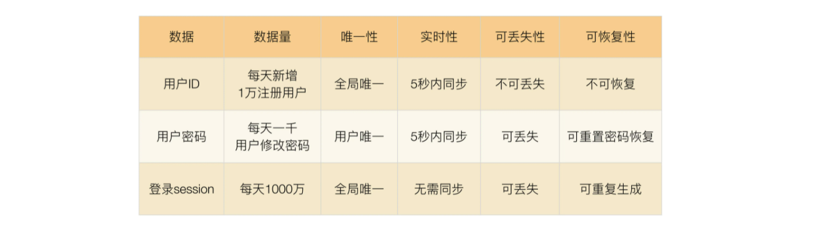

### 3、数据同步

确定数据的特点后，可以根据不同的数据设计不同的同步方案。常见的数据同步方案有：

1）存储系统同步

这是最常用也是最简单的同步方式。例如，使用 MySQL 的数据主从数据同步、主主数据同步。

这类数据同步的优点是使用简单，因为几乎主流的存储系统都会有自己的同步方案；缺点是这类同步方案都是通用的，无法针对业务数据特点做定制化的控制。例如，无论需要同步的数据量有多大，MySQL 都只有一个同步通道。因为要保证事务性，一旦数据量比较大，或者网络有延迟，则同步延迟就会比较严重。

2）消息队列同步

采用独立消息队列进行数据同步，常见的消息队列有 Kafka、ActiveMQ、RocketMQ 等。

消息队列同步适合无事务性或者无时序性要求的数据。例如，用户账号，两个用户先后注册了账号 A 和 B，如果同步时先把 B 同步到异地机房，再同步 A 到异地机房，业务上是没有问题的。而如果是用户密码，用户先改了密码为 m，然后改了密码为 n，同步时必须先保证同步 m 到异地机房，再同步 n 到异地机房；如果反过来，同步后用户的密码就不对了。因此，对于新注册的用户账号，可以采用消息队列同步了；而对于用户密码，就不能采用消息队列同步了。

3）重复生成

数据不同步到异地机房，每个机房都可以生成数据，这个方案适合于可以重复生成的数据。例如，登录产生的 cookie、session 数据、缓存数据等。

同样以用户管理系统的登录业务为例，针对不同的数据特点设计不同的同步方案，如下表所示。

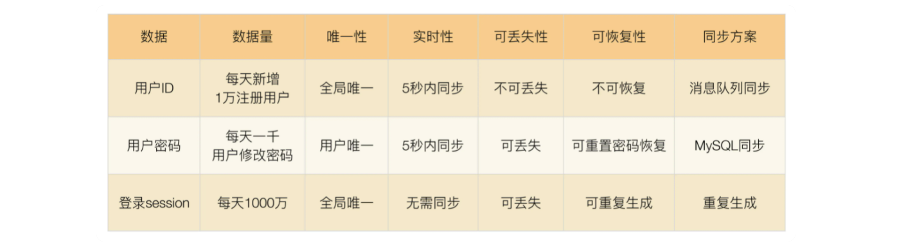

### 4、异常处理

无论数据同步方案如何设计，一旦出现极端异常的情况，总是会有部分数据出现异常的。例如，同步延迟、数据丢失、数据不一致等。异常处理就是假设在出现这些问题时，系统将采取什么措施来应对。异常处理主要有以下几个目的：

1）问题发生时，避免少量数据异常导致整体业务不可用。

2）问题恢复后，将异常的数据进行修正。

3）对用户进行安抚，弥补用户损失。

常见的异常处理措施有这几类：

#### 多通道同步

多通道同步的含义是采取多种方式来进行数据同步，其中某条通道故障的情况下，系统可以通过其他方式来进行同步，这种方式可以应对同步通道处故障的情况。

以用户管理系统中的用户账号数据为例，我们的设计方案一开始挑选了消息队列的方式进行同步，考虑异常情况下，消息队列同步通道可能中断，也可能延迟很严重；为了保证新注册账号能够快速同步到异地机房，再增加一种 MySQL 同步这种方式作为备份。这样针对用户账号数据同步，系统就有两种同步方式：MySQL 主从同步和消息队列同步。除非两个通道同时故障，否则用户账号数据在其中一个通道异常的情况下，能够通过另外一个通道继续同步到异地机房，如下图所示。

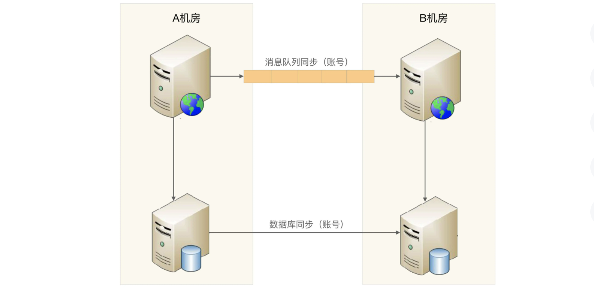

多通道同步设计的方案关键点有：

1）一般情况下，采取两通道即可，采取更多通道理论上能够降低风险，但付出的成本也会增加很多。

2）数据库同步通道和消息队列同步通道不能采用相同的网络连接，否则一旦网络故障，两个通道都同时故障；可以一个走公网连接，一个走内网连接。

3）需要数据是可以重复覆盖的，即无论哪个通道先到哪个通道后到，最终结果是一样的。例如，新建账号数据就符合这个标准，而密码数据则不符合这个标准。

#### 同步和访问结合

这里的访问指异地机房通过系统的接口来进行数据访问。例如业务部署在异地两个机房 A 和 B，B 机房的业务系统通过接口来访问 A 机房的系统获取账号信息，如下图所示。

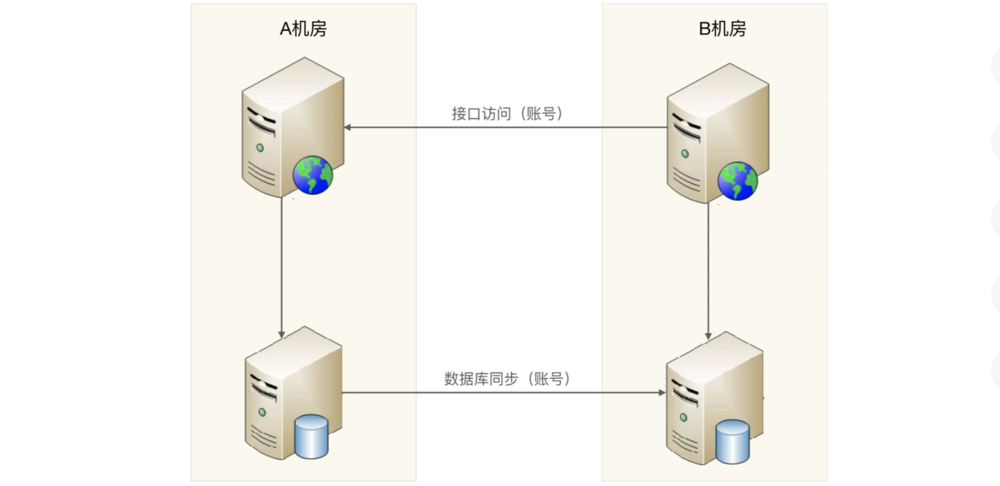

同步和访问结合方案的设计关键点有：

1）接口访问通道和数据库同步通道不能采用相同的网络连接，不能让数据库同步和接口访问都走同一条网络通道，可以采用接口访问走公网连接，数据库同步走内网连接这种方式。

2）数据有路由规则，可以根据数据来推断应该访问哪个机房的接口来读取数据。例如，有 3 个机房 A、B、C，B 机房拿到一个不属于 B 机房的数据后，需要根据路由规则判断是访问 A 机房接口，还是访问 C 机房接口。

3）由于有同步通道，优先读取本地数据，本地数据无法读取到再通过接口去访问，这样可以大大降低跨机房的异地接口访问数量，适合于实时性要求非常高的数据。

#### 日志记录

日志记录主要用于用户故障恢复后对数据进行恢复，其主要方式是每个关键操作前后都记录相关一条日志，然后将日志保存在一个独立的地方，当故障恢复后，拿出日志跟数据进行对比，对数据进行修复。

为了应对不同级别的故障，日志保存的要求也不一样，常见的日志保存方式有：

1）服务器上保存日志，数据库中保存数据，这种方式可以应对单台数据库服务器故障或者宕机的情况。

2）本地独立系统保存日志，这种方式可以应对某业务服务器和数据库同时宕机的情况。例如，服务器和数据库部署在同一个机架，或者同一个电源线路上，就会出现服务器和数据库同时宕机的情况。

3）日志异地保存，这种方式可以应对机房宕机的情况。

上面不同的日志保存方式，应对的故障越严重，方案本身的复杂度和成本就会越高，实际选择时需要综合考虑成本和收益情况。

#### 用户补偿

无论采用什么样的异常处理措施，都只能最大限度地降低受到影响的范围和程度，无法完全做到没有任何影响。例如，双同步通道有可能同时出现故障、日志记录方案本身日志也可能丢失。因此，无论多么完美的方案，故障的场景下总是可能有一小部分用户业务上出问题，系统无法弥补这部分用户的损失。但可以采用人工的方式对用户进行补偿，弥补用户损失，培养用户的忠诚度。简单来说，系统的方案是为了保证 99.99% 的用户在故障的场景下业务不受影响，人工的补偿是为了弥补 0.01% 的用户的损失。

常见的补偿措施有送用户代金券、礼包、礼品、红包等，有时为了赢得用户口碑，付出的成本可能还会比较大，但综合最终的收益来看还是很值得的。例如暴雪《炉石传说》2017 年回档故障，暴雪给每个用户大约价值人民币 200 元的补偿，结果玩家都求暴雪再来一次回档，形象地说明了玩家对暴雪补偿的充分认可。

## 应对接口级故障

介绍了异地多活方案。它主要用来应对系统级的故障，例如机器宕机、机房故障和网络故障等问题。这些系统级的故障虽然影响很大，但发生概率较小。在实际业务运行过程中，还有另外一种故障影响可能没有那么大，但发生的概率较高，这就是今天我要跟你聊的接口级的故障。

接口级故障的典型表现就是，系统并没有宕机、网络也没有中断，但业务却出现问题了，例如业务响应缓慢、大量访问超时和大量访问出现异常（给用户弹出提示“无法连接数据库”）。

这类问题的主要原因在于系统压力太大、负载太高，导致无法快速处理业务请求，由此引发更多的后续问题。最常见的情况就是，数据库慢查询将数据库的服务器资源耗尽，导致读写超时，业务读写数据库时要么无法连接数据库、要么超时，最终用户看到的现象就是访问很慢，一会儿访问抛出异常，一会儿访问又是正常结果。

如果进一步探究，导致接口级故障的原因可以分为两大类：

1）内部原因：包括程序 bug 导致死循环，某个接口导致数据库慢查询，程序逻辑不完善导致耗尽内存等。

2）外部原因：包括黑客攻击，促销或者抢购引入了超出平时几倍甚至几十倍的用户，第三方系统大量请求，第三方系统响应缓慢等。

解决接口级故障的核心思想和异地多活基本类似，都是**优先保证核心业务**和**优先保证绝大部分用户**。常见的应对方法有四种，**降级、熔断、限流和排队**，下面会一一讲解。

### 降级

降级指系统将某些业务或者接口的功能降低，可以是只提供部分功能，也可以是完全停掉所有功能。

例如，论坛可以降级为只能看帖子，不能发帖子；也可以降级为只能看帖子和评论，不能发评论；而 App 的日志上传接口，可以完全停掉一段时间，这段时间内 App 都不能上传日志。

降级的核心思想就是丢车保帅，优先保证核心业务。

常见的实现降级的方式有两种：

#### 系统后门降级

简单来说，就是系统预留了后门用于降级操作。例如，系统提供一个降级 URL，当访问这个 URL 时，就相当于执行降级指令，具体的降级指令通过 URL 的参数传入即可。这种方案有一定的安全隐患，所以也会在 URL 中加入密码这类安全措施。

系统后门降级的方式实现成本低，但主要缺点是如果服务器数量多，需要一台一台去操作，效率比较低，这在故障处理争分夺秒的场景下是比较浪费时间的。

#### 独立降级系统

为了解决系统后门降级方式的缺点，我们可以将降级操作独立到一个单独的系统中，实现复杂的权限管理、批量操作等功能。

其基本架构如下：

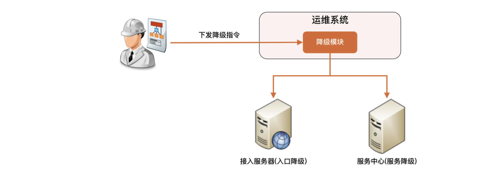

### 熔断

熔断是指按照规则停掉外部接口的访问，防止某些外部接口故障导致自己的系统处理能力急剧下降或者出故障。

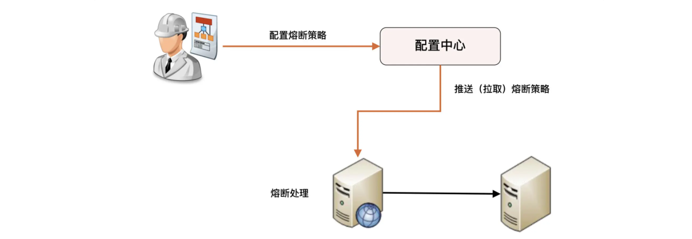

熔断和降级是两个比较容易混淆的概念，因为单纯从名字上看，好像都有禁止某个功能的意思。但它们的内涵是不同的，因为**降级的目的是应对系统自身的故障，而熔断的目的是应对依赖的外部系统故障的情况**。

假设一个这样的场景：A 服务的 X 功能依赖 B 服务的某个接口，当 B 服务的接口响应很慢的时候，A 服务的 X 功能响应肯定也会被拖慢，进一步导致 A 服务的线程都被卡在 X 功能处理上，于是 A 服务的其他功能都会被卡住或者响应非常慢。

这时就需要熔断机制了：A 服务不再请求 B 服务的这个接口，A 服务内部只要发现是请求 B 服务的这个接口就立即返回错误，从而避免 A 服务整个被拖慢甚至拖死。

实现熔断机制有两个关键点：

一是需要有一个**统一的 API 调用层**，由 API 调用层来进行采样或者统计。如果接口调用散落在代码各处，就没法进行统一处理了。

二是**阈值的设计**，例如 1 分钟内 30% 的请求响应时间超过 1 秒就熔断，这个策略中的“1 分钟”“30%”“1 秒”都对最终的熔断效果有影响。实践中，一般都是先根据分析确定阈值，然后上线观察效果，再进行调优。

### 限流

降级是从系统功能优先级的角度考虑如何应对故障，而限流则是从用户访问压力的角度来考虑如何应对故障。限流指只允许系统能够承受的访问量进来，超出系统访问能力的请求将被丢弃。

虽然“丢弃”这个词听起来让人不太舒服，但保证一部分请求能够正常响应，总比全部请求都不能响应要好得多。

限流一般都是系统内实现的，常见的限流方式可以分为两类：基于请求限流和基于资源限流。

#### 基于请求限流

基于请求限流指从外部访问的请求角度考虑限流，常见的方式有两种。

第一种是限制总量，也就是限制某个指标的累积上限，常见的是限制当前系统服务的用户总量，例如：某个直播间限制总用户数上限为 100 万，超过 100 万后新的用户无法进入；某个抢购活动商品数量只有 100 个，限制参与抢购的用户上限为 1 万个，1 万以后的用户直接拒绝。

第二种是限制时间量，也就是限制一段时间内某个指标的上限，例如 1 分钟内只允许 10000 个用户访问；每秒请求峰值最高为 10 万。

无论是限制总量还是限制时间量，共同的特点都是实现简单，但在实践中面临的主要问题是比较难以找到合适的阈值。例如系统设定了 1 分钟 10000 个用户，但实际上 6000 个用户的时候系统就扛不住了；或者达到 1 分钟 10000 用户后，其实系统压力还不大，但此时已经开始丢弃用户访问了。

即使找到了合适的阈值，基于请求限流还面临硬件相关的问题。例如一台 32 核的机器和 64 核的机器处理能力差别很大，阈值是不同的，可能有的技术人员以为简单根据硬件指标进行数学运算就可以得出来，实际上这样是不可行的，64 核的机器比 32 核的机器，业务处理性能并不是 2 倍的关系，可能是 1.5 倍，甚至可能是 1.1 倍。

为了找到合理的阈值，通常情况下可以采用性能压测来确定阈值，但性能压测也存在覆盖场景有限的问题，可能出现某个性能压测没有覆盖的功能导致系统压力很大；另外一种方式是逐步优化：先设定一个阈值然后上线观察运行情况，发现不合理就调整阈值。

基于上述的分析，根据阈值来限制访问量的方式更多的适应于业务功能比较简单的系统，例如负载均衡系统、网关系统、抢购系统等。

#### 基于资源限流

基于请求限流是从系统外部考虑的，而基于资源限流是从系统内部考虑的，也就是找到系统内部影响性能的关键资源，对其使用上限进行限制。常见的内部资源包括连接数、文件句柄、线程数和请求队列等。

例如，采用 Netty 来实现服务器，每个进来的请求都先放入一个队列，业务线程再从队列读取请求进行处理，队列长度最大值为 10000，队列满了就拒绝后面的请求；也可以根据 CPU 的负载或者占用率进行限流，当 CPU 的占用率超过 80% 的时候就开始拒绝新的请求。

基于资源限流相比基于请求限流能够更加有效地反映当前系统的压力，但实际设计时也面临两个主要的难点：如何确定关键资源，以及如何确定关键资源的阈值。

通常情况下，这也是一个逐步调优的过程：设计的时候先根据推断选择某个关键资源和阈值，然后测试验证，再上线观察，如果发现不合理，再进行优化。

#### 限流算法

为了更好地实现前面描述的各种限流方式，通常情况下我们会基于限流算法来设计方案。常见的限流算法有两大类四小类，它们的实现原理和优缺点各不相同，在实际设计的时候需要根据业务场景来选择。

1、时间窗

第一大类是时间窗算法，它会限制一定时间窗口内的请求量或者资源消耗量，根据实现方式又可以细分为“固定时间窗”和“滑动时间窗”。

1）固定时间窗

固定时间窗算法的实现原理是，统计固定时间周期内的请求量或者资源消耗量，超过限额就会启动限流，如下图所示：

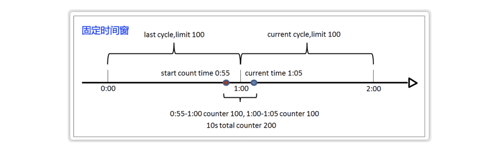

它的优点是实现简单，缺点是存在**临界点**问题。例如上图中的红蓝两点只间隔了短短 10 秒，期间的请求数却已经达到 200，超过了算法规定的限额（1 分钟内处理 100）。但是因为这些请求分别来自两个统计窗口，从单个窗口来看还没有超出限额，所以并不会启动限流，结果可能导致系统因为压力过大而挂掉。

2）滑动时间窗

为了解决临界点问题，滑动时间窗算法应运而生，它的实现原理是，两个统计周期部分重叠，从而避免短时间内的两个统计点分属不同的时间窗的情况，如下图所示：

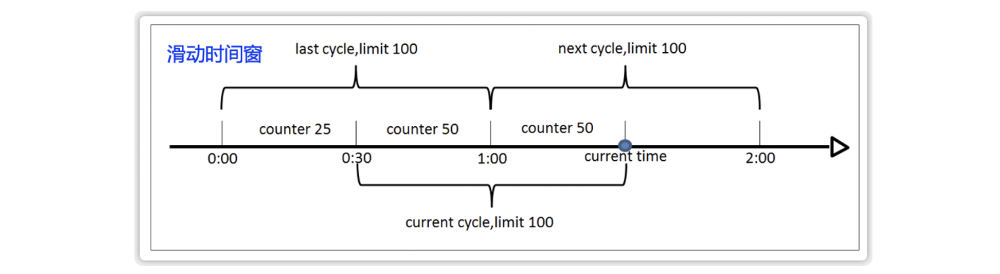

总体上来看，滑动时间窗的限流效果要比固定时间窗更好，但是实现也会稍微复杂一些。

2、桶算法

第二大类是桶算法，用一个虚拟的“桶”来临时存储一些东西。根据桶里面放的东西，又可以细分为“漏桶”和“令牌桶”。

2.1 漏桶

漏桶算法的实现原理是，将请求放入“桶”（消息队列等），业务处理单元（线程、进程和应用等）从桶里拿请求处理，桶满则丢弃新的请求。

漏桶算法的三个关键实现点：

1）流入速率不固定：可能瞬间流入非常多的请求，例如 0 点签到、整点秒杀。

匀速 (极速) 流出：这是理解漏桶算法的关键，也就是说即使大量请求进入了漏桶，但是从漏桶2）流出的速度是匀速的，速度的最大值就是系统的极限处理速度（对应图中的“极速”）。这样就保证了系统在收到海量请求的时候不被压垮，这是第一层的保护措施。需要注意的是：如果漏桶没有堆积，那么流出速度就等于流入速度，这个时候流出速度就不是匀速的。

3）桶满则丢弃请求：这是第二层保护措施，也就是说漏桶不是无限容量，而是有限容量，例如漏桶最多存储 100 万个请求，桶满了则直接丢弃后面的请求。

漏桶算法的技术本质是总量控制，桶大小是设计关键，具体的优缺点如下：

1）突发大量流量时丢弃的请求较少，因为漏桶本身有缓存请求的作用。

2）桶大小动态调整比较困难（例如 Java BlockingQueue），需要不断的尝试才能找到符合业务需求的最佳桶大小。

3）无法精确控制流出速度，也就是业务的处理速度。

漏桶算法主要适用于瞬时高并发流量的场景（例如刚才提到的 0 点签到、整点秒杀等）。在短短几分钟内涌入大量请求时，为了更好的业务效果和用户体验，即使处理慢一些，也要做到尽量不丢弃用户请求。

2.2 令牌桶算法

令牌桶算法和漏桶算法的不同之处在于，桶中放入的不是请求，而是“令牌”，这个令牌就是业务处理前需要拿到的“许可证”。也就是说，当系统收到一个请求时，先要到令牌桶里面拿“令牌”，拿到令牌才能进一步处理，拿不到就要丢弃请求。

令牌桶算法的三个关键设计点：

1）有一个处理单元往桶里面放令牌，放的速率是可以控制的。

2）桶里面可以累积一定数量的令牌，当突发流量过来的时候，因为桶里面有累积的令牌，此时的业务处理速度会超过令牌放入的速度。

3）如果令牌不足，即使系统有能力处理，也会丢弃请求。

令牌桶算法的技术本质是**速率控制**，令牌产生的速率是设计关键，具体的优缺点如下：

1）可以动态调整处理速率，实现更加灵活。

2）突发大量流量的时候可能丢弃很多请求，因为令牌桶不能累积太多令牌。

3）实现相对复杂。

令牌桶算法主要适用于两种典型的场景，一种是需要控制访问第三方服务的速度，防止把下游压垮，例如支付宝需要控制访问银行接口的速率；另一种是需要控制自己的处理速度，防止过载，例如压测结果显示系统最大处理 TPS 是 100，那么就可以用令牌桶来限制最大的处理速度。

上面介绍漏桶算法的时候提到漏桶算法可以应对瞬时高并发流量，现在介绍令牌桶算法时，又说令牌桶允许突发流量。

其实，令牌桶的“允许突发”实际上只是“允许一定程度的突发”，比如系统处理能力是每秒 100 TPS，突发到 120 TPS 是可以的，但如果突发到 1000 TPS 的话，系统大概率就被压垮了。所以处理秒杀时高并发流量，还是得用漏桶算法。

令牌桶的算法原本是用于网络设备控制传输速度的，而且它控制的目的是保证一段时间内的平均传输速度。之所以说令牌桶适合突发流量，是指在网络传输的时候，可以允许某段时间内（一般就几秒）超过平均传输速率，这在网络环境下常见的情况就是“网络抖动”。

但这个短时间的突发流量并不会导致雪崩效应，网络设备也能够处理得过来。对应到令牌桶应用到业务处理的场景，就要求即使有突发流量来了，系统自己或者下游系统要真的能够处理的过来，否则令牌桶允许突发流量进来，结果系统或者下游处理不了，那还是会被压垮。

因此，令牌桶在实际设计的时候，桶大小不能像漏桶那样设计很大，需要根据系统的处理能力来进行仔细的估算。例如，漏桶算法的桶容量可以设计为 100 万，但是一个每秒 30 TPS 的令牌桶，桶的容量可能只能设计成 40 左右。海外有的银行给移动钱包提供的接口 TPS 上限是 30，压测到了 40 就真的挂了。

### 排队

排队实际上是限流的一个变种，限流是直接拒绝用户，排队是让用户等待一段时间，全世界最有名的排队当属 12306 网站排队了。

排队虽然没有直接拒绝用户，但用户等了很长时间后进入系统，体验并不一定比限流好。

由于排队需要临时缓存大量的业务请求，单个系统内部无法缓存这么多数据，一般情况下，排队需要用独立的系统去实现，例如使用 Kafka 这类消息队列来缓存用户请求。

1 号店的“双 11”秒杀排队系统架构：（参考：[https://www.infoq.cn/article/yhd-11-11-queuing-system-design](https://www.infoq.cn/article/yhd-11-11-queuing-system-design)）

基本实现摘录如下：

【排队模块】负责接收用户的抢购请求，将请求以先入先出的方式保存下来。每一个参加秒杀活动的商品保存一个队列，队列的大小可以根据参与秒杀的商品数量（或加点余量）自行定义。

【调度模块】负责排队模块到服务模块的动态调度，不断检查服务模块，一旦处理能力有空闲，就从排队队列头上把用户访问请求调入服务模块，并负责向服务模块分发请求。这里调度模块扮演一个中介的角色，但不只是传递请求而已，它还担负着调节系统处理能力的重任。我们可以根据服务模块的实际处理能力，动态调节向排队系统拉取请求的速度。

【服务模块】负责调用真正业务来处理服务，并返回处理结果，调用排队模块的接口回写业务处理结果。
