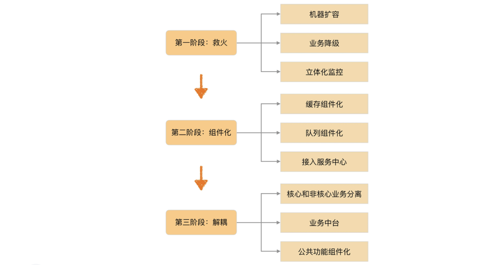

## 架构演进方向

### 架构演进背景

互联网的出现不但改变了普通人的生活方式，同时也促进了技术圈的快速发展和开放。在开源和分享两股力量的推动下，最近 10 多年的技术发展可以说是目不暇接，你方唱罢我登场，大的方面有大数据、云计算、人工智能等，细分的领域有 NoSQL、Node.js、Docker 容器化等。各个大公司也乐于将自己的技术分享出来，以此来提升自己的技术影响力，打造圈内技术口碑，从而形成强大的人才吸引力，典型的有，Google 的大数据论文、淘宝的全链路压测、微信的红包高并发技术等。

对于技术人员来说，技术的快速发展当然是一件大好事，毕竟这意味着技术百宝箱中又多了更多的可选工具，同时也可以通过学习业界先进的技术来提升自己的技术实力。但对于架构师来说，除了这些好处，却也多了“甜蜜的烦恼”：面对层出不穷的新技术，应该采取什么样的策略？

架构师可能经常会面临下面这些诱惑或者挑战：

1）现在 Docker 虚拟化技术很流行，要不要引进，引入 Docker 后可以每年节省几十万元的硬件成本呢？

2）竞争对手用了阿里的云计算技术，听说因为上了云，业务增长了好几倍呢，我们是否也应该尽快上云啊？

3）自己的技术和业界顶尖公司（例如，淘宝、微信）差距很大，应该投入人力和时间追上去，不然招聘的时候没有技术影响力！

4）公司的技术发展现在已经比较成熟了，程序员都觉得在公司学不到东西，可以尝试引入 Golang 来给大家一个学习新技术的机会。

类似的问题还有很多，本质上都可以归纳总结为一个问题：架构师应该如何判断技术演进的方向？关于这个问题的答案，基本上可以分为几个典型的派别：

#### 潮流派

潮流派的典型特征就是对于新技术特别热衷，紧跟技术潮流，当有新的技术出现时，迫切想将新的技术应用到自己的产品中。

例如：

1）NoSQL 很火，咱们要大规模地切换为 NoSQL。

2）大数据好牛呀，将我们的 MySQL 切换为 Hadoop 吧。

3）Node.js 使得 JavaScript 统一前后端，这样非常有助于开展工作。

问题：

首先，新技术需要时间成熟，如果刚出来就用，此时新技术还不怎么成熟，实际应用中很可能遇到各种“坑”，自己成了实验小白鼠。

其次，新技术需要学习，需要花费一定的时间去掌握，这个也是较大的成本；如果等到掌握了技术后又发现不适用，则是一种较大的人力浪费。

#### 保守派

保守派的典型特征和潮流派正好相反，对于新技术抱有很强的戒备心，稳定压倒一切，已经掌握了某种技术，就一直用这种技术打天下。就像有句俗语说的，“如果你手里有一把锤子，那么所有的问题都变成了钉子”，保守派就是拿着一把锤子解决所有的问题。

例如：

1）MySQL 咱们用了这么久了，很熟悉了，业务用 MySQL，数据分析也用 MySQL，报表还用 MySQL 吧。

2）Java 语言我们都很熟，业务用 Java，工具用 Java，平台也用 Java。

问题：

保守派的主要问题是不能享受新技术带来的收益，因为新技术很多都是为了解决以前技术存在的固有缺陷。就像汽车取代马车一样，不是量变而是质变，带来的收益不是线性变化的，而是爆发式变化的。如果无视技术的发展，形象一点说就是有了拖拉机，你还偏偏要用牛车。

#### 跟风派

跟风派与潮流派不同，这里的跟风派不是指跟着技术潮流，而是指跟着竞争对手的步子走。简单来说，判断技术的发展就看竞争对手，竞争对手用了咱们就用，竞争对手没用咱们就等等看。例如：

1）这项技术腾讯用了吗？腾讯用了我们就用。

2）阿里用了 Hadoop，他们都在用，肯定是好东西，咱们也要尽快用起来，以提高咱们的竞争力。

3）Google 都用了 Docker，咱们也用吧。

不同派别的不同做法本质上是价值观的不同：潮流派的价值观是新技术肯定能带来很大收益；稳定派的价值观是稳定压倒一切；跟风派的价值观是别人用了我就用。这些价值观本身都有一定的道理，但如果不考虑实际情况生搬硬套，就会出现“橘生淮南则为橘，生于淮北则为枳”的情况。

问题：

可能很多人都会认为，跟风派与“潮流派”和“保守派”相比，是最有效的策略，既不会承担“潮流派”的风险，也不会遭受“保守派”的损失，花费的资源也少，简直就是一举多得。

看起来很美妙，但跟风派最大的问题在于如果没有风可跟的时候怎么办。如果你是领头羊怎么办，其他人都准备跟你的风呢？另外一种情况就是竞争对手的这些信息并不那么容易获取，即使获取到了一些信息，大部分也是不全面的，一不小心可能就变成邯郸学步了。

即使有风可跟，其实也存在问题。有时候适用于竞争对手的技术，并不一定适用于自己，盲目模仿可能带来相反的效果。

既然潮流派、保守派、跟风派都存在这样或者那样的问题，那架构师究竟如何判断技术演进的方向呢？

### 技术演进的动力

不管是潮流派、保守派，还是跟风派，都是站在技术本身的角度来考虑问题的，正所谓“不识庐山真面，只缘身在此山中”，只有跳出技术的范畴，从一个更广更高的角度来考虑这个问题，这个角度就是企业的业务发展。

无论是代表新兴技术的互联网企业，还是代表传统技术的制造业；无论是通信行业，还是金融行业的发展，归根到底就是业务的发展。而影响一个企业业务的发展主要有 3 个因素：**市场、技术、管理**，这三者构成支撑业务发展的铁三角，任何一个因素的不足，都可能导致企业的业务停滞不前。

在这个铁三角中，业务处于三角形的中心，毫不夸张地说，市场、技术、管理都是为了支撑企业业务的发展。这里主要探讨“技术”和“业务”之间的关系和互相如何影响。

可以简单地将企业的业务分为两类：一类是产品类，一类是服务类。

产品类：360 的杀毒软件、苹果的 iPhone、UC 的浏览器等都属于这个范畴，这些产品本质上和传统的制造业产品类似，都是具备了某种“功能”，单个用户通过购买或者免费使用这些产品来完成自己相关的某些任务，用户对这些产品是独占的。

服务类：百度的搜索、淘宝的购物、新浪的微博、腾讯的 IM 等都属于这个范畴，大量用户使用这些服务来完成需要与其他人交互的任务，单个用户“使用”但不“独占”某个服务。事实上，服务的用户越多，服务的价值就越大。服务类的业务符合互联网的特征和本质：“互联”+“网”。

对于产品类业务，**技术创新推动业务发展**！

为何对于产品类的业务，技术创新能够推动业务发展呢？答案在于用户选择一个产品的根本驱动力在于产品的功能是否能够更好地帮助自己完成任务。用户会自然而然地选择那些功能更加强大、性能更加先进、体验更加顺畅、外观更加漂亮的产品，而功能、性能、体验、外观等都需要强大的技术支撑。例如，iPhone 手机的多点触摸操作、UC 浏览器的 U3 内核等。

对于“服务”类的业务，答案和产品类业务正好相反：**业务发展推动技术的发展**！

截然相反的主要原因是用户选择服务的根本驱动力与选择产品不同。用户选择一个产品的根本驱动力是其“功能”，而用户选择一个服务的根本驱动力不是功能，而是“规模”。

例如，选择 UC 浏览器还是选择 QQ 浏览器，更多的人是根据个人喜好和体验来决定的；而选择微信还是 Whatsapp，就不是根据它们之间的功能差异来选择的，而是根据其规模来选择的，就像我更喜欢 Whatsapp 的简洁，但我的朋友和周边的人都用微信，那我也不得不用微信。

当“规模”成为业务的决定因素后，服务模式的创新就成为了业务发展的核心驱动力，而产品只是为了完成服务而提供给用户使用的一个载体。以淘宝为例，淘宝提供的“网络购物”是一种新的服务，这种业务与传统的到实体店购物是完全不同的，而为了完成这种业务，需要“淘宝网”“支付宝”“一淘”和“菜鸟物流”等多个产品。随便一个软件公司，如果只是模仿开发出类似的产品，只要愿意投入，半年时间就可以将这些产品全部开发出来。但是这样做并没有意义，因为用户选择的是淘宝的整套网络购物服务，并且这个服务已经具备了一定的规模，其他公司不具备这种同等规模服务的能力。即使开发出完全一样的产品，用户也不会因为产品功能更加强大而选择新的类似产品。

以微信为例，同样可以得出类似结论。假如进行技术创新，开发一个耗电量只有微信的 1/10，用户体验比微信好 10 倍的产品，你觉得现在的微信用户都会抛弃微信，而转投我们的这个产品吗？我相信绝大部分人都不会，因为微信不是一个互联网产品，而是一个互联网服务，你一个人换到其他类微信类产品是没有意义的。

因此，服务类的业务发展路径是这样的：提出一种创新的服务模式→吸引了一批用户→业务开始发展→吸引了更多用户→服务模式不断完善和创新→吸引越来越多的用户，如此循环往复。在这个发展路径中，技术并没有成为业务发展的驱动力，反过来由于用户规模的不断扩展，业务的不断创新和改进，对技术会提出越来越高的要求，因此是业务驱动了技术发展。

其实回到产品类业务，如果将观察的时间拉长来看，即使是产品类业务，在技术创新开创了一个新的业务后，后续的业务发展也会反向推动技术的发展。例如，第一代 iPhone 缺少对 3G 的支持，且只能通过 Web 发布应用程序，第二代 iPhone 才开始支持 3G，并且内置 GPS；UC 浏览器随着功能越来越强大，原有的技术无法满足业务发展的需求，浏览器的架构需要进行更新，先后经过 UC 浏览器 7.0 版本、8.0 版本、9.0 版本等几个技术差异很大的版本。

综合这些分析，除非是开创新的技术能够推动或者创造一种新的业务，其他情况下，都是业务的发展推动了技术的发展。

### 技术演进的模式

明确了技术发展主要的驱动力是业务发展后，看看业务发展究竟是如何驱动技术发展的。

业务模式千差万别，有互联网的业务（淘宝、微信等），有金融的业务（中国平安、招商银行等），有传统企业的业务（各色 ERP 对应的业务）等，但无论什么模式的业务，如果业务的发展需要技术同步发展进行支撑，无一例外是因为业务“复杂度”的上升，导致原有的技术无法支撑。

按照前面所介绍的复杂度分类，复杂度要么来源于功能不断叠加，要么来源于规模扩大，从而对性能和可用性有了更高的要求。既然如此，判断到底是什么复杂度发生了变化就显得至关重要了。是任何时候都要同时考虑功能复杂度和规模复杂度吗？还是有时候考虑功能复杂度，有时候考虑规模复杂度？还是随机挑一个复杂度的问题解决就可以了？

对于架构师来说，判断业务当前和接下来一段时间的主要复杂度是什么就非常关键。判断不准确就会导致投入大量的人力和时间做了对业务没有作用的事情，判断准确就能够做到技术推动业务更加快速发展。那架构师具体应该按照什么标准来判断呢？

答案就是基于业务发展阶段进行判断，这也是为什么架构师必须具备业务理解能力的原因。不同的行业业务发展路径、轨迹、模式不一样，架构师必须能够基于行业发展和企业自身情况做出准确判断。

假设是一个银行 IT 系统的架构师：

1）90 年代主要的业务复杂度可能就是银行业务范围逐渐扩大，功能越来越复杂，导致内部系统数量越来越多，单个系统功能越来越复杂。

2）2004 年以后主要的复杂度就是银行业务从柜台转向网上银行，网上银行的稳定性、安全性、易用性是主要的复杂度，这些复杂度主要由银行 IT 系统自己解决。

3）2009 年以后主要的复杂度又变化为移动支付复杂度，尤其是“双 11”这种海量支付请求的情况下，高性能、稳定性、安全性是主要的复杂度，而这些复杂度需要银行和移动支付服务商（支付宝、微信）等一起解决。

而如果是淘宝这种互联网业务的架构师，业务发展又会是另外一种模式：

1）2003 年，业务刚刚创立，主要的复杂度体现为如何才能快速开发各种需求，淘宝团队采取的是买了一个 PHP 写的系统来改。

2）2004 年，上线后业务发展迅速，用户请求数量大大增加，主要的复杂度体现为如何才能保证系统的性能，淘宝的团队采取的是用 Oracle 取代 MySQL。

3）用户数量再次增加，主要的复杂度还是性能和稳定性，淘宝的团队采取的是 Java 替换 PHP。

4）2005 年，用户数量继续增加，主要的复杂度体现为单一的 Oracle 库已经无法满足性能要求，于是进行了分库分表、读写分离、缓存等优化。

5）2008 年，淘宝的商品数量在 1 亿以上，PV2.5 亿以上，主要的复杂度又变成了系统内部耦合，交易和商品耦合在一起，支付的时候又和支付宝强耦合，整个系统逻辑复杂，功能之间跳来跳去，用户体验也不好。淘宝的团队采取的是系统解耦，将交易中心、类目管理、用户中心从原来大一统的系统里面拆分出来。

## 互联网技术演进模式

各行业的业务发展轨迹并不完全相同，无法给出一个统一的模板让所有的架构师拿来就套用，因此以互联网的业务发展为案例，谈谈互联网技术演进的模式，其他行业可以参考分析方法对自己的行业进行分析。

互联网业务千差万别，但由于它们具有“规模决定一切”的相同点，其发展路径也基本上是一致的。互联网业务发展一般分为几个时期：初创期、发展期、竞争期、成熟期。

不同时期的差别主要体现在两个方面：**复杂性、用户规模**。

### 业务复杂性

互联网业务发展第一个主要方向就是“业务越来越复杂”，不同时期业务的复杂性的表现如下。

#### 初创期

互联网业务刚开始一般都是一个创新的业务点，这个业务点的重点不在于“完善”，而在于“创新”，只有创新才能吸引用户；而且因为其“新”的特点，其实一开始是不可能很完善的。只有随着越来越多的用户的使用，通过快速迭代试错、用户的反馈等手段，不断地在实践中去完善，才能继续创新。初创期的业务对技术就一个要求：“快”，但这个时候却又是创业团队最弱小的时期，可能就几个技术人员，所以这个时候十八般武艺都需要用上：能买就买，有开源的就用开源的。

还以淘宝和 QQ 为例。

第一版的淘宝（[https://blog.csdn.net/linlin_juejue/article/details/5959171](https://blog.csdn.net/linlin_juejue/article/details/5959171)）

第一版的 QQ（[http://www.yixieshi.com/20770.html](http://www.yixieshi.com/20770.html)）

可以看到最开始的淘宝和 QQ 与现在相比，几乎看不出是同一个业务了。

#### 发展期

当业务推出后经过市场验证如果是可行的，则吸引的用户就会越来越多，此时原来不完善的业务就进入了一个快速发展的时期。业务快速发展时期的主要目的是将原来不完善的业务逐渐完善，因此会有越来越多的新功能不断地加入到系统中。对于绝大部分技术团队来说，这个阶段技术的核心工作是快速地实现各种需求，只有这样才能满足业务发展的需要。

如何做到“快”，一般会经历下面几个阶段。

1、堆功能期

业务进入快速发展期的初期，此时团队规模也不大，业务需求又很紧，最快实现业务需求的方式是继续在原有的系统里面不断地增加新的功能，重构、优化、架构等方面的工作即使想做，也会受制于人力和业务发展的压力而放在一边。

2、优化期

“堆功能”的方式在刚开始的时候好用，因为系统还比较简单，但随着功能越来越多，系统开始变得越来越复杂，后面继续堆功能会感到越来越吃力，速度越来越慢。一种典型的场景是做一个需求要改好多地方，一不小心就改出了问题。直到有一天，技术团队或者产品人员再也受不了这种慢速的方式，终于下定决定要解决这个问题了。

如何解决这个问题，一般会分为两派：一派是优化派，一派是架构派。

优化派的核心思想是将现有的系统优化。例如，采用重构、分层、优化某个 MySQL 查询语句，将机械硬盘换成 SSD，将数据库从 MySQL 换成 Oracle，增加 Memcache 缓存等。优化派的优势是对系统改动较小，优化可以比较快速地实施；缺点就是可能过不了多久，系统又撑不住了。

架构派的核心思想是调整系统架构，主要是将原来的大系统拆分为多个互相配合的小系统。例如，将购物系统拆分为登录认证子系统、订单系统、查询系统、分析系统等。架构派的优势是一次调整可以支撑比较长期的业务发展，缺点是动作较大、耗时较长，对业务的发展影响也比较大。

相信在很多公司都遇到这种情况，大部分情况下都是“优化派”会赢，主要的原因还是因为此时“优化”是最快的方式。至于说“优化派”支撑不了多久这个问题，其实也不用考虑太多，因为业务能否发展到那个阶段还是个未知数，保证当下的竞争力是最主要的问题。

3、架构期

经过优化期后，如果业务能够继续发展，慢慢就会发现优化也顶不住了，毕竟再怎么优化，系统的能力总是有极限的。Oracle 再强大，也不可能一台 Oracle 顶住 1 亿的交易量；小型机再好，也不可能一台机器支持 100 万在线人数。此时已经没有别的选择，只能进行架构调整。

架构期可以用的手段很多，但归根结底可以总结为一个字“拆”，什么地方都可以拆。

拆功能：例如，将购物系统拆分为登录认证子系统、订单系统、查询系统、分析系统等。

拆数据库：MySQL 一台变两台，2 台变 4 台，增加 DBProxy、分库分表等。

拆服务器：服务器一台变两台，2 台变 4 台，增加负载均衡的系统，如 Nginx、HAProxy 等。

#### 竞争期

当业务继续发展，已经形成一定规模后，一定会有竞争对手开始加入行业来竞争，毕竟谁都想分一块蛋糕，甚至有可能一不小心还会成为下一个 BAT。当竞争对手加入后，大家互相学习和模仿，业务更加完善，也不断有新的业务创新出来，而且由于竞争的压力，对技术的要求是更上一层楼了。

新业务的创新给技术带来的典型压力就是新的系统会更多，同时，原有的系统也会拆得越来越多。两者合力的一个典型后果就是系统数量在原来的基础上又增加了很多。架构拆分后带来的美好时光又开始慢慢消逝，技术工作又开始进入了“慢”的状态，这又是怎么回事呢？

原来系统数量越来越多，到了一个临界点后就产生了质变，即系统数量的量变带来了技术工作的质变。主要体现在下面几个方面：

1、重复造轮子

系统越来越多，各系统相似的工作越来越多。例如，每个系统都有存储，都要用缓存，都要用数据库。新建一个系统，这些工作又要都做一遍，即使其他系统已经做过了一遍，这样怎么能快得起来？

2、系统交互一团乱麻

系统越来越多，各系统的交互关系变成了网状。系统间的交互数量和系统的数量成平方比的关系。例如，4 个系统的交互路径是 6 个，10 个系统的交互路径是 45 个。每实现一个业务需求，都需要几个甚至十几个系统一起改，然后互相调用来调用去，联调成了研发人员的灾难、联测成了测试人员的灾难、部署成了运维的灾难。

针对这个时期业务变化带来的问题，技术工作主要的解决手段有：

1、平台化

目的在于解决“重复造轮子”的问题。

存储平台化：淘宝的 TFS、京东 JFS。

数据库平台化：百度的 DBProxy、淘宝 TDDL。

缓存平台化：Twitter 的 Twemproxy，豆瓣的 BeansDB、腾讯 TTC。

2、服务化

目的在于解决“系统交互”的问题，常见的做法是通过消息队列来完成系统间的异步通知，通过服务框架来完成系统间的同步调用。

消息队列：淘宝的 Notify、MetaQ，开源的 Kafka、ActiveMQ 等。

服务框架：Facebook 的 thrift、当当网的 Dubbox、淘宝的 HSF 等。

#### 成熟期

当企业熬过竞争期，成为了行业的领头羊，或者整个行业整体上已经处于比较成熟的阶段，市场地位已经比较牢固后，业务创新的机会已经不大，竞争压力也没有那么激烈，此时求快求新已经没有很大空间，业务上开始转向为“求精”：响应时间是否比竞争对手快？用户体验是否比竞争对手好？成本是否比竞争对手低……

此时技术上其实也基本进入了成熟期，该拆的也拆了，该平台化的也平台化了，技术上能做的大动作其实也不多了，更多的是进行优化。但有时候也会为了满足某个优化，系统做很大的改变。例如，为了将用户响应时间从 200ms 降低到 50ms，可能就需要从很多方面进行优化：CDN、数据库、网络等。这个时候的技术优化没有固定的套路，只能按照竞争的要求，找出自己的弱项，然后逐项优化。在逐项优化时，可以采取之前各个时期采用的手段。

### 用户规模

互联网业务的发展第二个主要方向就是“用户量越来越大”。互联网业务的发展会经历“初创期、发展期、竞争期、成熟期”几个阶段，不同阶段典型的差别就是用户量的差别，用户量随着业务的发展而越来越大。用户量增大对技术的影响主要体现在两个方面：性能要求越来越高、可用性要求越来越高。

#### 性能

用户量增大给技术带来的第一个挑战就是性能要求越来越高。以互联网企业最常用的 MySQL 为例，再简单的查询，再高的硬件配置，单台 MySQL 机器支撑的 TPS 和 QPS 最高也就是万级，低的可能是几千，高的也不过几万。当用户量增长后，必然要考虑使用多台 MySQL，从一台 MySQL 到多台 MySQL 不是简单的数量的增加，而是本质上的改变，即原来集中式的存储变为了分布式的存储。

稍微有经验的工程师都会知道，分布式将会带来复杂度的大幅度上升。以 MySQL 为例，分布式 MySQL 要考虑分库分表、读写分离、复制、同步等很多问题。

#### 可用性

用户量增大对技术带来的第二个挑战就是可用性要求越来越高。当有 1 万个用户的时候，宕机 1 小时可能也没有很大的影响；但当有了 100 万用户的时候，宕机 10 分钟，投诉电话估计就被打爆了，这些用户再到朋友圈抱怨一下系统有多烂，很可能就不会再有机会发展下一个 100 万用户了。

除了口碑的影响，可用性对收入的影响也会随着用户量增大而增大。1 万用户宕机 1 小时，可能才损失了几千元；100 万用户宕机 10 分钟，损失可能就是几十万元了。

### 量变到质变

通过前面的分析可以看到互联网业务驱动技术发展的两大主要因素是复杂性和用户规模，而这两个因素的本质其实都是“量变带来质变”。

究竟用户规模发展到什么阶段才会由量变带来质变，虽然不同的业务有所差别，但基本上可以按照下面这个模型去衡量。

应对业务质变带来的技术压力，不同时期有不同的处理方式，但不管什么样的方式，其核心目标都是为了满足业务“快”的要求，当发现业务快不起来的时候，其实就是技术的水平已经跟不上业务发展的需要了，技术变革和发展的时候就到了。更好的做法是在问题还没有真正暴露出来就能够根据趋势预测下一个转折点，提前做好技术上的准备，这对技术人员的要求是非常高的。

## 互联网架构模板：存储层技术

很多人对于 BAT 的技术有一种莫名的崇拜感，觉得只有天才才能做出这样的系统，但经过前面对架构的本质、架构的设计原则、架构的设计模式、架构演进等多方位的探讨和阐述，可以看到，其实并没有什么神秘的力量和魔力融合在技术里面，而是业务的不断发展推动了技术的发展，这样一步一个脚印，持续几年甚至十几年的发展，才能达到当前技术复杂度和先进性。

抛开 BAT 各自差异很大的业务，站在技术的角度来看，其实 BAT 的技术架构基本是一样的。再将视角放大，会发现整个互联网行业的技术发展，最后都是殊途同归。

如果自己正处于一个创业公司，或者正在为成为另一个 BAT 拼搏，那么深入理解这种技术模式（或者叫技术结构、技术架构），对于自己和公司的发展都大有裨益。互联网的标准技术架构如下图所示，这张图基本上涵盖了互联网技术公司的大部分技术点，不同的公司只是在具体的技术实现上稍有差异，但不会跳出这个框架的范畴。

这里将逐层介绍每个技术点的产生背景、应用场景、关键技术，有的技术点可能已经在前面的架构模式部分有所涉及，因此就不再详细展开技术细节了，而是将关键技术点分门别类，进而形成一张架构大图，让架构师对一个公司的整体技术架构有一个完整的全貌认知。

### SQL

SQL 即我们通常所说的关系数据。前几年 NoSQL 火了一阵子，很多人都理解为 NoSQL 是完全抛弃关系数据，全部采用非关系型数据。但经过几年的试验后，大家发现关系数据不可能完全被抛弃，NoSQL 不是 No SQL，而是 Not Only SQL，即 NoSQL 是 SQL 的补充。

所以互联网行业也必须依赖关系数据，考虑到 Oracle 太贵，还需要专人维护，一般情况下互联网行业都是用 MySQL、PostgreSQL 这类开源数据库。这类数据库的特点是开源免费，拿来就用；但缺点是性能相比商业数据库要差一些。随着互联网业务的发展，性能要求越来越高，必然要面对一个问题：将数据拆分到多个数据库实例才能满足业务的性能需求（其实 Oracle 也一样，只是时间早晚的问题）。

数据库拆分满足了性能的要求，但带来了复杂度的问题：数据如何拆分、数据如何组合？这个复杂度的问题解决起来并不容易，如果每个业务都去实现一遍，重复造轮子将导致投入浪费、效率降低，业务开发想快都快不起来。

所以互联网公司流行的做法是业务发展到一定阶段后，就会将这部分功能独立成中间件，例如百度的 DBProxy、淘宝的 TDDL。不过这部分的技术要求很高，将分库分表做到自动化和平台化，不是一件容易的事情，所以一般是规模很大的公司才会自己做。中小公司建议使用开源方案，例如 MySQL 官方推荐的 MySQL Router、360 开源的数据库中间件 Atlas。

假如公司业务继续发展，规模继续扩大，SQL 服务器越来越多，如果每个业务都基于统一的数据库中间件独立部署自己的 SQL 集群，就会导致新的复杂度问题，具体表现在：

1）数据库资源使用率不高，比较浪费。

2）各 SQL 集群分开维护，投入的维护成本越来越高。

因此，实力雄厚的大公司此时一般都会在 SQL 集群上构建 SQL 存储平台，以对业务透明的形式提供资源分配、数据备份、迁移、容灾、读写分离、分库分表等一系列服务，例如淘宝的 UMP（Unified MySQL Platform）系统。

### NoSQL

首先 NoSQL 在数据结构上与传统的 SQL 的不同，例如典型的 Memcache 的 key-value 结构、Redis 的复杂数据结构、MongoDB 的文档数据结构；其次，NoSQL 无一例外地都会将性能作为自己的一大卖点。NoSQL 的这两个特点很好地弥补了关系数据库的不足，因此在互联网行业 NoSQL 的应用基本上是基础要求。

由于 NoSQL 方案一般自己本身就提供集群的功能，例如 Memcache 的一致性 Hash 集群、Redis 3.0 的集群，因此 NoSQL 在刚开始应用时很方便，不像 SQL 分库分表那么复杂。一般公司也不会在开始时就考虑将 NoSQL 包装成存储平台，但如果公司发展很快，例如 Memcache 的节点有上千甚至几千时，NoSQL 存储平台就很有意义了。首先是存储平台通过集中管理能够大大提升运维效率；其次是存储平台可以大大提升资源利用效率，2000 台机器，如果利用率能提升 10%，就可以减少 200 台机器，一年几十万元就节省出来了。

所以，NoSQL 发展到一定规模后，通常都会在 NoSQL 集群的基础之上再实现统一**存储平台**，统一存储平台主要实现这几个功能：

1）资源动态按需动态分配：例如同一台 Memcache 服务器，可以根据内存利用率，分配给多个业务使用。

2）资源自动化管理：例如新业务只需要申请多少 Memcache 缓存空间就可以了，无需关注具体是哪些 Memcache 服务器在为自己提供服务。

3）故障自动化处理：例如某台 Memcache 服务器挂掉后，有另外一台备份 Memcache 服务器能立刻接管缓存请求，不会导致丢失很多缓存数据。

当然要发展到这个阶段，一般也是大公司才会这么做，简单来说就是如果只有几十台 NoSQL 服务器，做存储平台收益不大；但如果有几千台 NoSQL 服务器，NoSQL 存储平台就能够产生很大的收益。

### 小文件存储

除了关系型的业务数据，互联网行业还有很多用于展示的数据。例如，淘宝的商品图片、商品描述；Facebook 的用户图片；新浪微博的一条微博内容等。这些数据具有三个典型特征：一是数据小，一般在 1MB 以下；二是数量巨大，Facebook 在 2013 年每天上传的照片就达到了 3.5 亿张；三是访问量巨大，Facebook 每天的访问量超过 10 亿。

由于互联网行业基本上每个业务都会有大量的小数据，如果每个业务都自己去考虑如何设计海量存储和海量访问，效率自然会低，重复造轮子也会投入浪费，所以自然而然就要将小文件存储做成统一的和业务无关的平台。

和 SQL 和 NoSQL 不同的是，小文件存储不一定需要公司或者业务规模很大，基本上认为业务在起步阶段就可以考虑做小文件统一存储。得益于开源运动的发展和最近几年大数据的火爆，在开源方案的基础上封装一个小文件存储平台并不是太难的事情。例如，HBase、Hadoop、Hypertable、FastDFS 等都可以作为小文件存储的底层平台，只需要将这些开源方案再包装一下基本上就可以用了。

典型的小文件存储有：淘宝的 TFS、京东 JFS、Facebook 的 Haystack。

下图是淘宝 TFS 的架构：

### 大文件存储

互联网行业的大文件主要分为两类：一类是业务上的大数据，例如 Youtube 的视频、电影网站的电影；另一类是海量的日志数据，例如各种访问日志、操作日志、用户轨迹日志等。和小文件的特点正好相反，大文件的数量没有小文件那么多，但每个文件都很大，几百 MB、几个 GB 都是常见的，几十 GB、几 TB 也是有可能的，因此在存储上和小文件有较大差别，不能直接将小文件存储系统拿来存储大文件。

说到大文件，特别要提到 Google 和 Yahoo，Google 的 3 篇大数据论文（Bigtable/Map- Reduce/GFS）开启了一个大数据的时代，而 Yahoo 开源的 Hadoop 系列（HDFS、HBase 等），基本上垄断了开源界的大数据处理。当然，江山代有才人出，长江后浪推前浪，Hadoop 后又有更多优秀的开源方案被贡献出来，现在随便走到大街上拉住一个程序员，如果他不知道大数据，那基本上可以确定是“火星程序员”。

对照 Google 的论文构建一套完整的大数据处理方案的难度和成本实在太高，而且开源方案现在也很成熟了，所以大数据存储和处理这块反而是最简单的，因为你没有太多选择，只能用这几个流行的开源方案，例如，Hadoop、HBase、Storm、Hive 等。实力雄厚一些的大公司会基于这些开源方案，结合自己的业务特点，封装成大数据平台，例如淘宝的云梯系统、腾讯的 TDW 系统。

下面是 Hadoop 的生态圈：

## 互联网架构模板：开发层和服务层技术

### 开发层技术

#### 开发框架

前面深入分析了互联网业务发展的一个特点：复杂度越来越高。复杂度增加的典型现象就是系统越来越多，不同的系统由不同的小组开发。如果每个小组用不同的开发框架和技术，则会带来很多问题，典型的问题有：

1）技术人员之间没有共同的技术语言，交流合作少。

2）每类技术都需要投入大量的人力和资源并熟练精通。

3）不同团队之间人员无法快速流动，人力资源不能高效的利用。

所以，互联网公司都会指定一个大的技术方向，然后使用统一的开发框架。例如，Java 相关的开发框架 SSH、SpringMVC、Play，Ruby 的 Ruby on Rails，PHP 的 ThinkPHP，Python 的 Django 等。使用统一的开发框架能够解决上面提到的各种问题，大大提升组织和团队的开发效率。

对于框架的选择，有一个总的原则：**优选成熟的框架，避免盲目追逐新技术**！

原因如下：首先，成熟的框架资料文档齐备，各种坑基本上都有人踩过了，遇到问题很容易通过搜索来解决。其次，成熟的框架受众更广，招聘时更加容易招到合适的人才。第三，成熟的框架更加稳定，不会出现大的变动，适合长期发展。

#### Web 服务器

开发框架只是负责完成业务功能的开发，真正能够运行起来给用户提供服务，还需要服务器配合。

独立开发一个成熟的 Web 服务器，成本非常高，况且业界又有那么多成熟的开源 Web 服务器，所以互联网行业基本上都是“拿来主义”，挑选一个流行的开源服务器即可。大一点的公司，可能会在开源服务器的基础上，结合自己的业务特点做二次开发，例如淘宝的 Tengine，但一般公司基本上只需要将开源服务器摸透，优化一下参数，调整一下配置就差不多了。

选择一个服务器主要和开发语言相关，例如，Java 的有 Tomcat、JBoss、Resin 等，PHP/Python 的用 Nginx，当然最保险的就是用 Apache 了，什么语言都支持。

你可能会担心 Apache 的性能之类的问题，其实不用过早担心这个，等到业务真的发展到 Apache 撑不住的时候再考虑切换也不迟，那时候有的是钱，有的是人，有的是时间。

#### 容器

容器是最近几年才开始火起来的，其中以 Docker 为代表，在 BAT 级别的公司已经有较多的应用。例如，腾讯万台规模的 Docker 应用实践（[http://www.infoq.com/cn/articles/tencent-millions-scale-docker-application-practice](http://www.infoq.com/cn/articles/tencent-millions-scale-docker-application-practice)）、新浪微博红包的大规模 Docker 集群（[http://www.infoq.com/cn/articles/large-scale-docker-cluster-practise-experience-share](http://www.infoq.com/cn/articles/large-scale-docker-cluster-practise-experience-share)）等。

传统的虚拟化技术是虚拟机，解决了跨平台的问题，但由于虚拟机太庞大，启动又慢，运行时太占资源，在互联网行业并没有大规模应用；而 Docker 的容器技术，虽然没有跨平台，但启动快，几乎不占资源，推出后立刻就火起来了，预计 Docker 类的容器技术将是技术发展的主流方向。

千万不要以为 Docker 只是一个虚拟化或者容器技术，它将在很大程度上改变目前的技术形势：

1）运维方式会发生革命性的变化：Docker 启动快，几乎不占资源，随时启动和停止，基于 Docker 打造自动化运维、智能化运维将成为主流方式。

2）设计模式会发生本质上的变化：启动一个新的容器实例代价如此低，将鼓励设计思路朝“微服务”的方向发展。

例如，一个传统的网站包括登录注册、页面访问、搜索等功能，没有用容器的情况下，除非有特别大的访问量，否则这些功能开始时都是集成在一个系统里面的；有了容器技术后，一开始就可以将这些功能按照服务的方式设计，避免后续访问量增大时又要重构系统。

### 服务层技术

互联网业务的不断发展带来了复杂度的不断提升，业务系统也越来越多，系统间相互依赖程度加深。比如说为了完成 A 业务系统，可能需要 B、C、D、E 等十几个其他系统进行合作。从数学的角度进行评估，可以发现系统间的依赖是呈指数级增长的：3 个系统相互关联的路径为 3 条，6 个系统相互关联的路径为 15 条。

服务层的主要目标其实就是为了降低系统间相互关联的复杂度。

#### 配置中心

故名思议，配置中心就是集中管理各个系统的配置。当系统数量不多的时候，一般是各系统自己管理自己的配置，但系统数量多了以后，这样的处理方式会有问题：

1）某个功能上线时，需要多个系统配合一起上线，分散配置时，配置检查、沟通协调需要耗费较多时间。

2）处理线上问题时，需要多个系统配合查询相关信息，分散配置时，操作效率很低，沟通协调也需要耗费较多时间。

3）各系统自己管理配置时，一般是通过文本编辑的方式修改的，没有自动的校验机制，容易配置错误，而且很难发现。

例如，将 IP 地址的数字 0 误敲成了键盘的字母 O，肉眼非常难发现，但程序检查其实就很容易。

实现配置中心主要就是为了解决上面这些问题，将配置中心做成通用的系统的好处有：

1）集中配置多个系统，操作效率高。

2）所有配置都在一个集中的地方，检查方便，协作效率高。

3）配置中心可以实现程序化的规则检查，避免常见的错误。比如说检查最小值、最大值、是否 IP 地址、是否 URL 地址，都可以用正则表达式完成。

4）配置中心相当于备份了系统的配置，当某些情况下需要搭建新的环境时，能够快速搭建环境和恢复业务。

整机磁盘坏掉、机器主板坏掉……遇到这些不可恢复的故障时，基本上只能重新搭建新的环境。程序包肯定是已经有的，加上配置中心的配置，能够很快搭建新的运行环境，恢复业务。否则几十个配置文件重新一个个去 Vim 中修改，耗时很长，还很容易出错。

下面是配置中心简单的设计，其中通过“系统标识 + host + port”来标识唯一一个系统运行实例是常见的设计方法。

#### 服务中心

当系统数量不多的时候，系统间的调用一般都是直接通过配置文件记录在各系统内部的，但当系统数量多了以后，这种方式就存在问题了。

比如说总共有 10 个系统依赖 A 系统的 X 接口，A 系统实现了一个新接口 Y，能够更好地提供原有 X 接口的功能，如果要让已有的 10 个系统都切换到 Y 接口，则这 10 个系统的几十上百台机器的配置都要修改，然后重启，可想而知这个效率是很低的。

除此以外，如果 A 系统总共有 20 台机器，现在其中 5 台出故障了，其他系统如果是通过域名访问 A 系统，则域名缓存失效前，还是可能访问到这 5 台故障机器的；如果其他系统通过 IP 访问 A 系统，那么 A 系统每次增加或者删除机器，其他所有 10 个系统的几十上百台机器都要同步修改，这样的协调工作量也是非常大的。

服务中心就是为了解决上面提到的跨系统依赖的“配置”和“调度”问题。服务中心的实现一般来说有两种方式：服务名字系统和服务总线系统。

1、服务名字系统（Service Name System）

看到这个翻译，会立刻联想到 DNS，即 Domain Name System。两者的性质是基本类似的。DNS 的作用将域名解析为 IP 地址，人工记不住太多的数字 IP，域名就容易记住。服务名字系统是为了将 Service 名称解析为“host + port + 接口名称”，但是和 DNS 一样，真正发起请求的还是请求方。基本的设计如下：

2、服务总线系统（Service Bus System）

可以联想到计算机的总线，两者的本质也是基本类似的。相比服务名字系统，服务总线系统更进一步了：由总线系统完成调用，服务请求方都不需要直接和服务提供方交互了。基本的设计如下：

“服务名字系统”和“服务总线系统”简单对比如下表所示：

#### 消息队列

互联网业务的一个特点是“快”，这就要求很多业务处理采用异步的方式。例如，大 V 发布一条微博后，系统需要发消息给关注的用户，我们不可能等到所有消息都发送给关注用户后再告诉大 V 说微博发布成功了，只能先让大 V 发布微博，然后再发消息给关注用户。

传统的异步通知方式是由消息生产者直接调用消息消费者提供的接口进行通知的，但当业务变得庞大，子系统数量增多时，这样做会导致系统间交互非常复杂和难以管理，因为系统间互相依赖和调用，整个系统的结构就像一张蜘蛛网，如下图所示：

消息队列就是为了实现这种跨系统异步通知的中间件系统。消息队列既可以“一对一”通知，也可以“一对多”广播。以微博为例，可以清晰地看到异步通知的实现和作用，如下图所示。

对比前面的蜘蛛网架构，可以清晰地看出引入消息队列系统后的效果：

1）整体结构从网状结构变为线性结构，结构清晰；

2）消息生产和消息消费解耦，实现简单；

3）增加新的消息消费者，消息生产者完全不需要任何改动，扩展方便；

4）消息队列系统可以做高可用、高性能，避免各业务子系统各自独立做一套，减轻工作量；

5）业务子系统只需要聚焦业务即可，实现简单。

消息队列系统基本功能的实现比较简单，但要做到高性能、高可用、消息时序性、消息事务性则比较难。业界已经有很多成熟的开源实现方案，如果要求不高，基本上拿来用即可，例如，RocketMQ、Kafka、ActiveMQ 等。但如果业务对消息的可靠性、时序、事务性要求较高时，则要深入研究这些开源方案，否则很容易踩坑。

开源的用起来方便，但要改就很麻烦了。由于其相对比较简单，很多公司也会花费人力和时间重复造一个轮子，这样也有好处，因为可以根据自己的业务特点做快速的适配开发。

## 互联网架构模板：网络层技术

除了复杂度，互联网业务发展的另外两个关键特点是“高性能”和“高可用”。通常情况下，在设计高可用和高性能系统的时候，主要关注点在系统本身的复杂度，然后通过各种手段来实现高可用和高性能的要求，例如前面介绍的计算高性能架构模式、存储高可用架构模式等。但是当站在一个公司的的角度来思考架构的时候，单个系统的高可用和高性能并不等于整体业务的高可用和高性能，互联网业务的高性能和高可用需要从更高的角度去设计，这个高点就是“网络”，所以将相关措施统一划归为“网络层”。注意这里的网络层和通常理解的如何搭建一个局域网这种概念不一样，这里强调的是站在网络层的角度整体设计架构，而不是某个具体网络的搭建。

### 负载均衡

顾名思议，负载均衡就是将请求均衡地分配到多个系统上。使用负载均衡的原因也很简单：每个系统的处理能力是有限的，为了应对大容量的访问，必须使用多个系统。例如，一台 32 核 64GB 内存的机器，性能测试数据显示每秒处理 Hello World 的 HTTP 请求不超过 2 万，实际业务机器处理 HTTP 请求每秒可能才几百 QPS，而互联网业务并发超过 1 万是比较常见的，遇到双十一、过年发红包这些极端场景，每秒可以达到几十万的请求。

#### DNS

DNS 是最简单也是最常见的负载均衡方式，一般用来实现地理级别的均衡。例如，北方的用户访问北京的机房，南方的用户访问广州的机房。一般不会使用 DNS 来做机器级别的负载均衡，因为太耗费 IP 资源了。例如，百度搜索可能要 10000 台以上机器，不可能将这么多机器全部配置公网 IP，然后用 DNS 来做负载均衡。有兴趣的读者可以在 Linux 用“dig baidu.com”命令看看实际上用了几个 IP 地址。

DNS 负载均衡的优点是通用（全球通用）、成本低（申请域名，注册 DNS 即可），但缺点也比较明显，主要体现在：

1）DNS 缓存的时间比较长，即使将某台业务机器从 DNS 服务器上删除，由于缓存的原因，还是有很多用户会继续访问已经被删除的机器。

2）DNS 不够灵活。DNS 不能感知后端服务器的状态，只能根据配置策略进行负载均衡，无法做到更加灵活的负载均衡策略。比如说某台机器的配置比其他机器要好很多，理论上来说应该多分配一些请求给它，但 DNS 无法做到这一点。

所以对于时延和故障敏感的业务，有实力的公司可能会尝试实现 HTTP-DNS 的功能，即使用 HTTP 协议实现一个私有的 DNS 系统。HTTP-DNS 主要应用在通过 App 提供服务的业务上，因为在 App 端可以实现灵活的服务器访问策略，如果是 Web 业务，实现起来就比较麻烦一些，因为 URL 的解析是由浏览器来完成的，只有 Javascript 的访问可以像 App 那样实现比较灵活的控制。

HTTP-DNS 的优缺点有：

1）灵活：HTTP-DNS 可以根据业务需求灵活的设置各种策略。

2）可控：HTTP-DNS 是自己开发的系统，IP 更新、策略更新等无需依赖外部服务商。

3）及时：HTTP-DNS 不受传统 DNS 缓存的影响，可以非常快地更新数据、隔离故障。

4）开发成本高：没有通用的解决方案，需要自己开发。

5）侵入性：需要 App 基于 HTTP-DNS 进行改造。

#### Nginx 、LVS 、F5

DNS 用于实现地理级别的负载均衡，而 Nginx、LVS、F5 用于同一地点内机器级别的负载均衡。其中 Nginx 是软件的 7 层负载均衡，LVS 是内核的 4 层负载均衡，F5 是硬件的 4 层负载均衡。

软件和硬件的区别就在于性能，硬件远远高于软件，Ngxin 的性能是万级，一般的 Linux 服务器上装个 Nginx 大概能到 5 万 / 秒；LVS 的性能是十万级，没有具体测试过，据说可达到 80 万 / 秒；F5 性能是百万级，从 200 万 / 秒到 800 万 / 秒都有。硬件虽然性能高，但是单台硬件的成本也很高，一台最便宜的 F5 都是几十万，但是如果按照同等请求量级来计算成本的话，实际上硬件负载均衡设备可能会更便宜，例如假设每秒处理 100 万请求，用一台 F5 就够了，但用 Nginx，可能要 20 台，这样折算下来用 F5 的成本反而低。因此通常情况下，如果性能要求不高，可以用软件负载均衡；如果性能要求很高，推荐用硬件负载均衡。

4 层和 7 层的区别就在于协议和灵活性。Nginx 支持 HTTP、E-mail 协议，而 LVS 和 F5 是 4 层负载均衡，和协议无关，几乎所有应用都可以做，例如聊天、数据库等。

目前很多云服务商都已经提供了负载均衡的产品，例如阿里云的 SLB、UCloud 的 ULB 等，中小公司直接购买即可。

### CDN

CDN 是为了解决用户网络访问时的“最后一公里”效应，本质上是一种“以空间换时间”的加速策略，即将内容缓存在离用户最近的地方，用户访问的是缓存的内容，而不是站点实时的内容。

下面是简单的 CDN 请求流程示意图：

CDN 经过多年的发展，已经变成了一个很庞大的体系：分布式存储、全局负载均衡、网络重定向、流量控制等都属于 CDN 的范畴，尤其是在视频、直播等领域，如果没有 CDN，用户是不可能实现流畅观看内容的。

幸运的是大部分程序员和架构师都不太需要深入理解 CDN 的细节，因为 CDN 作为网络的基础服务，独立搭建的成本巨大，很少有公司自己设计和搭建 CDN 系统，从 CDN 服务商购买 CDN 服务即可，目前有专门的 CDN 服务商，例如网宿和蓝汛；也有云计算厂家提供 CDN 服务，例如阿里云和腾讯云都提供 CDN 的服务。

### 多机房

从架构上来说，单机房就是一个全局的网络单点，在发生比较大的故障或者灾害时，单机房难以保证业务的高可用。例如，停电、机房网络中断、地震、水灾等都有可能导致一个机房完全瘫痪。

多机房设计最核心的因素就是如何处理时延带来的影响，常见的策略有：

#### 同城多机房

同一个城市多个机房，距离不会太远，可以投入重金，搭建私有的高速网络，基本上能够做到和同机房一样的效果。

这种方式对业务影响很小，但投入较大，如果不是大公司，一般是承受不起的；而且遇到极端的地震、水灾等自然灾害，同城多机房也是有很大风险的。

#### 跨城多机房

在不同的城市搭建多个机房，机房间通过网络进行数据复制（例如，MySQL 主备复制），但由于跨城网络时延的问题，业务上需要做一定的妥协和兼容，比如不需要数据的实时强一致性，只是保证最终一致性。

例如，微博类产品，B 用户关注了 A 用户，A 用户在北京机房发布了一条微博，B 在广州机房不需要立刻看到 A 用户发的微博，等 10 分钟看到也可以。

这种方式实现简单，但和业务有很强的相关性，微博可以这样做，支付宝的转账业务就不能这样做，因为用户余额是强一致性的。

#### 跨国多机房

和跨城多机房类似，只是地理上分布更远，时延更大。由于时延太大和用户跨国访问实在太慢，跨国多机房一般仅用于备份和服务本国用户。

### 多中心

多中心必须以多机房为前提，但从设计的角度来看，多中心相比多机房是本质上的飞越，难度也高出一个等级。

简单来说，多机房的主要目标是灾备，当机房故障时，可以比较快速地将业务切换到另外一个机房，这种切换操作允许一定时间的中断（例如，10 分钟、1 个小时），而且业务也可能有损失（例如，某些未同步的数据不能马上恢复，或者要等几天才恢复，甚至永远都不能恢复了）。因此相比多机房来说，多中心的要求就高多了，要求每个中心都同时对外提供服务，且业务能够自动在多中心之间切换，故障后不需人工干预或者很少的人工干预就能自动恢复。

多中心设计的关键就在于“数据一致性”和“数据事务性”如何保证，这两个难点都和业务紧密相关，目前没有很成熟的且通用的解决方案，需要基于业务的特性进行详细的分析和设计。以淘宝为例，淘宝对外宣称自己是多中心的，但是在实际设计过程中，商品浏览的多中心方案、订单的多中心方案、支付的多中心方案都需要独立设计和实现。

正因为多中心设计的复杂性，不一定所有业务都能实现多中心，目前国内的银行、支付宝这类系统就没有完全实现多中心，不然也不会出现挖掘机一铲子下去，支付宝中断 4 小时的故障。

## 互联网架构模板：用户层和业务层

### 用户层技术

#### 用户管理

互联网业务的一个典型特征就是通过互联网将众多分散的用户连接起来，因此用户管理是互联网业务必不可少的一部分。

稍微大一点的互联网业务，肯定会涉及多个子系统，这些子系统不可能每个都管理这么庞大的用户，由此引申出用户管理的第一个目标：单点登录（SSO），又叫统一登录。单点登录的技术实现手段较多，例如 cookie、JSONP、token 等，目前最成熟的开源单点登录方案当属 CAS，其架构如下（[https://apereo.github.io/cas/4.2.x/planning/Architecture.html](https://apereo.github.io/cas/4.2.x/planning/Architecture.html) ）：

除此之外，当业务做大成为了平台后，开放成为了促进业务进一步发展的手段，需要允许第三方应用接入，由此引申出用户管理的第二个目标：授权登录。现在最流行的授权登录就是 OAuth 2.0 协议，基本上已经成为了事实上的标准，如果要做开放平台，则最好用这个协议，私有协议漏洞多，第三方接入也麻烦。

用户管理系统面临的主要问题是用户数巨大，一般至少千万级，QQ、微信、支付宝这种巨无霸应用都是亿级用户。不过也不要被这个数据给吓倒了，用户管理虽然数据量巨大，但实现起来并不难，原因是什么呢？ 因为用户数据量虽然大，但是不同用户之间没有太强的业务关联，A 用户登录和 B 用户登录基本没有关系。因此虽然数据量巨大，但用一个简单的负载均衡架构就能轻松应对。

用户管理的基本架构如下：

#### 消息推送

消息推送根据不同的途径，分为短信、邮件、站内信、App 推送。除了 App，不同的途径基本上调用不同的 API 即可完成，技术上没有什么难度。例如，短信需要依赖运营商的短信接口，邮件需要依赖邮件服务商的邮件接口，站内信是系统提供的消息通知功能。

App 目前主要分为 iOS 和 Android 推送，iOS 系统比较规范和封闭，基本上只能使用苹果的 APNS；但 Android 就不一样了，在国外，用 GCM 和 APNS 差别不大；但是在国内，情况就复杂多了：首先是 GCM 不能用；其次是各个手机厂商都有自己的定制的 Android，消息推送实现也不完全一样。因此 Android 的消息推送就五花八门了，大部分有实力的大厂，都会自己实现一套消息推送机制，例如阿里云移动推送、腾讯信鸽推送、百度云推送；也有第三方公司提供商业推送服务，例如友盟推送、极光推送等。

通常情况下，对于中小公司，如果不涉及敏感数据，Android 系统上推荐使用第三方推送服务，因为毕竟是专业做推送服务的，消息到达率是有一定保证的。

如果涉及敏感数据，需要自己实现消息推送，这时就有一定的技术挑战了。消息推送主要包含 3 个功能：设备管理（唯一标识、注册、注销）、连接管理和消息管理，技术上面临的主要挑战有：

1）海量设备和用户管理  

消息推送的设备数量众多，存储和管理这些设备是比较复杂的；同时，为了针对不同用户进行不同的业务推广，还需要收集用户的一些信息，简单来说就是将用户和设备关联起来，需要提取用户特征对用户进行分类或者打标签等。

2）连接保活  

要想推送消息必须有连接通道，但是应用又不可能一直在前台运行，大部分设备为了省电省流量等原因都会限制应用后台运行，限制应用后台运行后连接通道可能就被中断了，导致消息无法及时的送达。连接保活是整个消息推送设计中细节和黑科技最多的地方，例如应用互相拉起、找手机厂商开白名单等。

3）消息管理  

实际业务运营过程中，并不是每个消息都需要发送给每个用户，而是可能根据用户的特征，选择一些用户进行消息推送。由于用户特征变化很大，各种排列组合都有可能，将消息推送给哪些用户这部分的逻辑要设计得非常灵活，才能支撑花样繁多的业务需求，具体的设计方案可以采取规则引擎之类的微内核架构技术。

#### 存储云、图片云

互联网业务场景中，用户会上传多种类型的文件数据，例如微信用户发朋友圈时上传图片，微博用户发微博时上传图片、视频，优酷用户上传视频，淘宝卖家上传商品图片等，这些文件具备几个典型特点：

1）数据量大：用户基数大，用户上传行为频繁，例如 2016 年的时候微信朋友圈每天上传图片就达到了 10 亿张（[http://mi.techweb.com.cn/tmt/2016-05-25/2338330.shtml](http://mi.techweb.com.cn/tmt/2016-05-25/2338330.shtml)）。

2）文件体积小：大部分图片是几百 KB 到几 MB，短视频播放时间也是在几分钟内。

3）访问有时效性：大部分文件是刚上传的时候访问最多，随着时间的推移访问量越来越小。

为了满足用户的文件上传和存储需求，需要对用户提供文件存储和访问功能，这里就需要用到前面我在专栏第 40 期介绍“存储层”技术时提到的“小文件存储”技术。简单来说，存储云和图片云通常的实现都是“CDN + 小文件存储”，现在有了“云”之后，除非 BAT 级别，一般不建议自己再重复造轮子了，直接买云服务可能是最快也是最经济的方式。

既然存储云和图片云都是基于“CDN + 小文件存储”的技术，为何不统一一套系统，而将其拆分为两个系统呢？这是因为“图片”业务的复杂性导致的，普通的文件基本上提供存储和访问就够了，而图片涉及的业务会更多，包括裁剪、压缩、美化、审核、水印等处理，因此通常情况下图片云会拆分为独立的系统对用户提供服务。

### 业务层技术

互联网的业务千差万别，不同的业务分解下来有不同的系统，所以业务层没有办法提炼一些公共的系统或者组件。抛开业务上的差异，各个互联网业务发展最终面临的问题都是类似的：业务复杂度越来越高。也就是说，业务层面对的主要技术挑战是“复杂度”。

复杂度越来越高的一个主要原因就是系统越来越庞大，业务越来越多。幸运的是，面对业务层的技术挑战，我们有一把“屠龙宝刀”，不管什么业务难题，用上“屠龙宝刀”问题都能迎刃而解。这把“屠龙宝刀”就是“拆”，化整为零、分而治之，将整体复杂性分散到多个子业务或者子系统里面去。具体拆的方式你可以查看专栏前面可扩展架构模式部分的分层架构、微服务、微内核等。

以一个简单的电商系统为例，如下图所示：

这个模拟的电商系统经历了 3 个发展阶段：

1）第一阶段：所有功能都在 1 个系统里面。

2）第二阶段：将商品和订单拆分到 2 个子系统里面。

3）第三阶段：商品子系统和订单子系统分别拆分成了更小的 6 个子系统。

上面只是个样例，实际上随着业务的发展，子系统会越来越多，据说淘宝内部大大小小的已经有成百上千的子系统了。

随着子系统数量越来越多，如果达到几百上千，另外一个复杂度问题又会凸显出来：子系统数量太多，已经没有人能够说清楚业务的调用流程了，出了问题排查也会特别复杂。此时应该怎么处理呢，总不可能又将子系统合成大系统吧？最终答案还是“合”，正所谓“合久必分、分久必合”，但合的方式不一样，此时采取的“合”的方式是按照“高内聚、低耦合”的原则，将职责关联比较强的子系统合成一个虚拟业务域，然后通过网关对外统一呈现，类似于设计模式中的 Facade 模式。同样以电商为样例，采用虚拟业务域后，其架构如下：

## 互联网架构模板：平台技术

当业务规模比较小、系统复杂度不高时，运维、测试、数据分析、管理等支撑功能主要由各系统或者团队独立完成。随着业务规模越来越大，系统复杂度越来越高，子系统数量越来越多，如果继续采取各自为政的方式来实现这些支撑功能，会发现重复工作非常多。因此自然而然就会想到将这些支撑功能做成平台，避免重复造轮子，减少不规范带来的沟通和协作成本。

### 运维平台

运维平台核心的职责分为四大块：配置、部署、监控、应急，每个职责对应系统生命周期的一个阶段，如下图所示：

* 配置：主要负责资源的管理。例如，机器管理、IP 地址管理、虚拟机管理等。
* 部署：主要负责将系统发布到线上。例如，包管理、灰度发布管理、回滚等。
* 监控：主要负责收集系统上线运行后的相关数据并进行监控，以便及时发现问题。
* 应急：主要负责系统出故障后的处理。例如，停止程序、下线故障机器、切换 IP 等。

运维平台的核心设计要素是“四化”：标准化、平台化、自动化、可视化。

#### 标准化

需要制定运维标准，规范配置管理、部署流程、监控指标、应急能力等，各系统按照运维标准来实现，避免不同的系统不同的处理方式。标准化是运维平台的基础，没有标准化就没有运维平台。

如果某个系统就是无法改造自己来满足运维标准，那该怎么办呢？常见的做法是不改造系统，由中间方来完成规范适配。例如，某个系统对外提供了 RESTful 接口的方式来查询当前的性能指标，而运维标准是性能数据通过日志定时上报，那么就可以写一个定时程序访问 RESTful 接口获取性能数据，然后转换为日志上报到运维平台。

#### 平台化

传统的手工运维方式需要投入大量人力，效率低，容易出错，因此需要在运维标准化的基础上，将运维的相关操作都集成到运维平台中，通过运维平台来完成运维工作。

运维平台的好处有：

1）可以将运维标准固化到平台中，无须运维人员死记硬背运维标准。

2）运维平台提供简单方便的操作，相比之下人工操作低效且容易出错。

3）运维平台是可复用的，一套运维平台可以支撑几百上千个业务系统。

#### 自动化

传统手工运维方式效率低下的一个主要原因就是要执行大量重复的操作，运维平台可以将这些重复操作固化下来，由系统自动完成。

例如，一次手工部署需要登录机器、上传包、解压包、备份旧系统、覆盖旧系统、启动新系统，这个过程中需要执行大量的重复或者类似的操作。有了运维平台后，平台需要提供自动化的能力，完成上述操作，部署人员只需要在最开始单击“开始部署”按钮，系统部署完成后通知部署人员即可。

类似的还有监控，有了运维平台后，运维平台可以实时收集数据并进行初步分析，当发现数据异常时自动发出告警，无须运维人员盯着数据看，或者写一大堆“grep + awk + sed”来分析日志才能发现问题。

#### 可视化

运维平台有非常多的数据，如果全部通过人工去查询数据再来判断，则效率很低。尤其是在故障应急时，时间就是生命，处理问题都是争分夺秒，能减少 1 分钟的时间就可能挽回几十万元的损失，可视化的主要目的就是为了提升数据查看效率。

可视化的原理和汽车仪表盘类似，如果只是一连串的数字显示在屏幕上，相信大部分人一看到一连串的数字，第一感觉是眼花，而且也很难将数据与具体的情况联系起来。而有了仪表盘后，通过仪表盘的指针偏离幅度及指针指向的区域颜色，能够一目了然地看出当前的状态是低速、中速还是高速。

可视化相比简单的数据罗列，具备下面这些优点：

1）能够直观地看到数据的相关属性，例如，汽车仪表盘中的数据最小值是 0，最大是 100，单位是 MPH。

2）能够将数据的含义展示出来，例如汽车仪表盘中不同速度的颜色指示。

3）能够将关联数据整合一起展示，例如汽车仪表盘的速度和里程。

### 测试平台

测试平台核心的职责当然就是测试了，包括单元测试、集成测试、接口测试、性能测试等，都可以在测试平台来完成。

测试平台的核心目的是提升测试效率，从而提升产品质量，其设计关键就是自动化。传统的测试方式是测试人员手工执行测试用例，测试效率低，重复的工作多。通过测试平台提供的自动化能力，测试用例能够重复执行，无须人工参与，大大提升了测试效率。

为了达到“自动化”的目标，测试平台的基本架构如下图所示：

#### 用例管理

测试自动化的主要手段就是通过脚本或者代码来进行测试，例如单元测试用例是代码、接口测试用例可以用 Python 来写、可靠性测试用例可以用 Shell 来写。为了能够重复执行这些测试用例，测试平台需要将用例管理起来，管理的维度包括业务、系统、测试类型、用例代码。例如，网购业务的订单系统的接口测试用例。

#### 资源管理

测试用例要放到具体的运行环境中才能真正执行，运行环境包括硬件（服务器、手机、平板电脑等）、软件（操作系统、数据库、Java 虚拟机等）、业务系统（被测试的系统）。

除了性能测试，一般的自动化测试对性能要求不高，所以为了提升资源利用率，大部分的测试平台都会使用虚拟技术来充分利用硬件资源，如虚拟机、Docker 等技术。

#### 任务管理

任务管理的主要职责是将测试用例分配到具体的资源上执行，跟踪任务的执行情况。任务管理是测试平台设计的核心，它将测试平台的各个部分串联起来从而完成自动化测试。

#### 数据管理

测试任务执行完成后，需要记录各种相关的数据（例如，执行时间、执行结果、用例执行期间的 CPU、内存占用情况等），这些数据具备下面这些作用：

1）展现当前用例的执行情况。

2）作为历史数据，方便后续的测试与历史数据进行对比，从而发现明显的变化趋势。例如，某个版本后单元测试覆盖率从 90% 下降到 70%。

3）作为大数据的一部分，可以基于测试的任务数据进行一些数据挖掘。例如，某个业务一年执行了 10000 个用例测试，另外一个业务只执行了 1000 个用例测试，两个业务规模和复杂度差不多，为何差异这么大？

### 数据平台

数据平台的核心职责主要包括三部分：数据管理、数据分析和数据应用。每一部分又包含更多的细分领域，详细的数据平台架构如下图所示：

#### 数据管理

数据管理包含数据采集、数据存储、数据访问和数据安全四个核心职责，是数据平台的基础功能。

1）数据采集：从业务系统搜集各类数据。例如，日志、用户行为、业务数据等，将这些数据传送到数据平台。

2）数据存储：将从业务系统采集的数据存储到数据平台，用于后续数据分析。

3）数据访问：负责对外提供各种协议用于读写数据。例如，SQL、Hive、Key-Value 等读写协议。

4）数据安全：通常情况下数据平台都是多个业务共享的，部分业务敏感数据需要加以保护，防止被其他业务读取甚至修改，因此需要设计数据安全策略来保护数据。

#### 数据分析

数据分析包括数据统计、数据挖掘、机器学习、深度学习等几个细分领域。

1）数据统计：根据原始数据统计出相关的总览数据。例如，PV、UV、交易额等。

2）数据挖掘：数据挖掘这个概念本身含义可以很广，为了与机器学习和深度学习区分开，这里的数据挖掘主要是指传统的数据挖掘方式。例如，有经验的数据分析人员基于数据仓库构建一系列规则来对数据进行分析从而发现一些隐含的规律、现象、问题等，经典的数据挖掘案例就是沃尔玛的啤酒与尿布的关联关系的发现。

3）机器学习、深度学习：机器学习和深度学习属于数据挖掘的一种具体实现方式，由于其实现方式与传统的数据挖掘方式差异较大，因此数据平台在实现机器学习和深度学习时，需要针对机器学习和深度学习独立进行设计。

#### 数据应用

数据应用很广泛，既包括在线业务，也包括离线业务。例如，推荐、广告等属于在线应用，报表、欺诈检测、异常检测等属于离线应用。

数据应用能够发挥价值的前提是需要有“大数据”，只有当数据的规模达到一定程度，基于数据的分析、挖掘才能发现有价值的规律、现象、问题等。如果数据没有达到一定规模，通常情况下做好数据统计就足够了，尤其是很多初创企业，无须一开始就参考 BAT 来构建自己的数据平台。

### 管理平台

管理平台的核心职责就是权限管理，无论是业务系统（例如，淘宝网）、中间件系统（例如，消息队列 Kafka），还是平台系统（例如，运维平台），都需要进行管理。如果每个系统都自己来实现权限管理，效率太低，重复工作很多，因此需要统一的管理平台来管理所有的系统的权限。

权限管理主要分为两部分：身份认证、权限控制，其基本架构如下图所示。

#### 身份认证

确定当前的操作人员身份，防止非法人员进入系统。例如，不允许匿名用户进入系统。为了避免每个系统都自己来管理用户，通常情况下都会使用企业账号来做统一认证和登录。

#### 权限控制

根据操作人员的身份确定操作权限，防止未经授权的人员进行操作。例如，不允许研发人员进入财务系统查看别人的工资。

## 架构重构01：有的放矢

相比全新的架构设计来说，架构重构对架构师的要求更高，主要体现在：

1）业务已经上线，不能停下来架构重构时，业务已经上线运行了，重构既需要尽量保证业务继续往前发展，又要完成架构调整，这就好比“给飞行中的波音 747 换引擎”；而如果是新设计架构，业务还没有上线，则即使做砸了对业务也不会有太大影响。

2）关联方众多，牵一发动全身架构重构涉及的业务关联方很多，不同关联方的资源投入程度、业务发展速度、对架构痛点的敏感度等有很大差异，如何尽量减少对关联方的影响，或者协调关联方统一行动，是一项很大的挑战；而如果是新设计架构，则在新架构上线前，对关联方没有影响。

3）旧架构的约束

架构重构需要在旧的架构基础上进行，这是一个很强的约束，会限制架构师的技术选择范围；而如果是新设计架构，则架构师的技术选择余地大得多。

即使是决定推倒到重来，完全抛弃旧的架构而去设计新的架构，新架构也会受到旧架构的约束和影响，因为业务在旧架构上产生的数据是不能推倒重来的，新架构必须考虑如何将旧架构产生的数据转换过来。

因此，架构重构对架构师的综合能力要求非常高，业务上要求架构师能够说服产品经理暂缓甚至暂停业务来进行架构重构；团队上需要架构师能够与其他团队达成一致的架构重构计划和步骤；技术上需要架构师给出让技术团队认可的架构重构方案。

总之，架构重构需要架构师既要说得动老板，也要镇得住同事；既要技术攻关，又要协调资源；既要保证业务正常发展，又要在指定时间内完成目标……总之就是十八般武艺要样样精通。

说了那么多架构重构的难度，千万不要被困难所吓倒，架构师正是需要在原来一团乱麻中找到线索，然后重新穿针引线，帮助业务进一步腾飞发展。接下来架构重构第一招：有的放矢。

通常情况下，当系统架构不满足业务的发展时，其表现形式是系统不断出现各种问题，轻微一点的如系统响应慢、数据错误、某些用户访问失败等，严重的可能是宕机、数据库瘫痪、数据丢失等，或者系统的开发效率很低。开始的时候，技术团队可能只针对具体的问题去解决，解决一个算一个，但如果持续时间较长，例如持续了半年甚至一年情况都不见好转，此时可能有人想到了系统的架构是否存在问题，讨论是否是因为架构原因导致了各种问题。一旦确定需要进行架构重构，就会由架构师牵头来进行架构重构的分析。

当架构师真正开始进行架构重构分析时，就会发现自己好像进了一个迷雾森林，到处都是问题，每个问题都需要解决，不知道出路在哪里，感觉如果要解决所有这些问题，架构重构其实也无能为力。有的架构师一上来搜集了系统当前存在的问题，然后汇总成一个 100 行的 Excel 表格，看到这样一个表格就懵了：这么多问题，要到猴年马月才能全部解决完啊？

期望通过架构重构来解决所有问题当然是不现实的，所以架构师的首要任务是**从一大堆纷繁复杂的问题中识别出真正要通过架构重构来解决的问题，集中力量快速解决，而不是想着通过架构重构来解决所有的问题**。否则就会陷入人少事多头绪乱的处境，团队累死累活弄个大半年，最后发现好像什么都做了，但每个问题都依然存在。尤其是对于刚接手一个新系统的架构师或者技术主管来说，一定要控制住“新官上任三把火”的冲动，避免摊大饼式或者运动式的重构和优化。

下面看几个重构案例

### 后台系统：不合理的耦合

M 系统是一个后台管理系统，负责管理所有游戏相关的数据，重构的主要原因是因为系统耦合了 P 业务独有的数据和所有业务公用的数据，导致可扩展性比较差。其大概架构如下图所示：

举一个简单的例子：数据库中的某张表，一部分字段是所有业务公用的“游戏数据”，一部分字段是 P 业务系统“独有的数据”，开发时如果要改这张表，代码和逻辑都很复杂，改起来效率很低。

针对 M 系统存在的问题，重构目标就是将游戏数据和业务数据拆分，解开两者的耦合，使得两个系统都能够独立快速发展。重构的方案如下图所示：

重构后的效果非常明显，重构后的 M 系统和 P 业务后台系统每月上线版本数是重构前的 4 倍！

### 游戏接入系统：全局单点的可用性

S 系统是游戏接入的核心系统，一旦 S 系统故障，大量游戏玩家就不能登录游戏。而 S 系统并不具备多中心的能力，一旦主机房宕机，整个 S 系统业务就不可用了。其大概架构如下图所示，可以看出数据库主库是全局单点，一旦数据库主库不可用，两个集群的写业务都不可用了。

针对 S 系统存在的问题，重构目标就是实现双中心，使得任意一个机房都能够提供完整的服务，在某个机房故障时，另外一个机房能够全部接管所有业务。重构方案如下图所示：

重构后系统的可用性从 3 个 9 提升到 4 个 9，重构前最夸张的一个月有 4 次较大的线上故障，重构后虽然也经历了机房交换机宕机、运营商线路故障、机柜断电等问题，但对业务都没有什么大的影响。

### 大系统带来的开发效率

X 系统是创新业务的主系统，之前在业务快速尝试和快速发展期间，怎么方便怎么操作，怎么快速怎么做，系统设计并未投入太多精力和时间，很多东西都“塞”到同一个系统中，导致到了现在已经改不动了。做一个新功能或者新业务，需要花费大量的时间来讨论和梳理各种业务逻辑，一不小心就踩个大坑。X 系统的架构如下图所示：

X 系统的问题看起来和 M 系统比较类似，都是可扩展性存在问题，但其实根本原因不一样：M 系统是因为耦合了不同业务的数据导致系统可扩展性不足，而 X 系统是因为将业务相关的所有功能都放在同一个系统中，导致系统可扩展性不足；同时，所有功能都在一个系统中，也可能导致一个功能出问题，整站不可用。比如说某个功能把数据库拖慢了，整站所有业务跟着都慢了。针对 X 系统存在的问题，重构目标是将各个功能拆分到不同的子系统中，降低单个系统的复杂度。重构后的架构如下图所示（仅仅是示例，实际架构远比下图复杂）：

重构后各个系统之间通过接口交互，虽然看似增加了接口的工作量，但整体来说，各系统的发展和开发速度比原来快了很多，系统也相对更加简单，也不会出现某个子系统有问题，所有业务都有问题。

这三个系统重构的方案，现在回过头来看，感觉是理所当然的，但实际上当时做分析和决策时，远远没有这么简单。以 M 系统为例，当时我们接手后遇到的问题有很多，例如：

1）数据经常出错。M 系统是单机，单机宕机后所有后台操作就不能进行了。

2）性能比较差，有的操作耗时好久。

3）界面比较丑，操作不人性化。

4）历史上经过几手转接，代码比较混乱。

5）业务数据和游戏数据耦合，开发效率很低。

从这么多问题中识别出重构的目标，并不是一目了然的；而如果想一下全部解决所有这些问题，人力和时间又不够！所以架构师需要透过问题表象看到问题本质，找出真正需要通过架构重构解决的核心问题，从而做到有的放矢，既不会耗费大量的人力和时间投入，又能够解决核心问题。这对架构师的分析和判断能力要求非常高，既不能看到问题就想到要架构重构，也不能只是针对问题进行系统优化，判断到底是采取架构重构还是采取系统优化，可能不同的架构师和团队都有不同的看法。这里分享一个简单的做法：假设我们现在需要从 0 开始设计当前系统，新架构和老架构是否类似？如果差异不大，说明采取系统优化即可；如果差异很大，那可能就要进行系统重构了。

那原来发现的那些非架构重构问题怎么办呢？当然不能放任不管。以 M 系统为例，我们在重构完成后，又启动了多个优化的项目去优化这些问题，但此时的优化主要由团队内部完成即可，和其他团队没有太多关联，优化的速度是很快的。如果没有重构就进行优化，则每次优化都要拉一大堆关联业务的团队来讨论方案，效率非常低下！

## 架构重构02：合纵连横

### 合纵

架构重构是大动作，持续时间比较长，而且会占用一定的研发资源，包括开发和测试，因此不可避免地会影响业务功能的开发。因此，要想真正推动一个架构重构项目启动，需要花费大量的精力进行游说和沟通。注意这里不是指办公室政治，而是指要和利益相关方沟通好，让大家对于重构能够达成一致共识，避免重构过程中不必要的反复和争执。

一般的技术人员谈到架构重构时，就会搬出一大堆技术术语：可扩展性、可用性、性能、耦合、代码很乱……但从过往的实际经验来看，如果和非技术人员这样沟通，效果如同鸡同鸭讲，没有技术背景的人员很难理解，甚至有可能担心是在忽悠人。

在沟通协调时，将技术语言转换为通俗语言，以事实说话，以数据说话，是沟通的关键！

### 连横

除了上面讨论的和上下游沟通协调，有的重构还需要和其他相关或者配合的系统的沟通协调。由于大家都是做技术的，有比较多的共同语言，所以这部分的沟通协调其实相对来说要容易一些，但也不是说想推动就能推动的，主要的阻力来自“这对我有什么好处”和“这部分我这边现在不急”。

对于“这对我有什么好处”问题，有的人会简单理解为这是自私的表现，认为对方不顾大局，于是沟通的时候将问题人为拔高。例如“你应该站在部门的角度来考虑这个问题”“这对公司整体利益有帮助”等。这种沟通效果其实很差，首先是这种拔高一般都比较虚，无法明确，不同的人理解也不一样，无法达成共识；其次是如果对公司和部门有利，但对某个小组没用甚至不利，那么可能是因为目前的方案不够好，还可以考虑另外的方案。

那如何才能有效地推动呢？有效的策略是“**换位思考、合作双赢、关注长期**”。简单来说就是站在对方的角度思考，重构对他有什么好处，能够帮他解决什么问题，带来什么收益。

以上一章的 M 系统为例，当时有另外一个 C 系统和 M 系统通过数据库直连共用数据库，我们的重构方案是要去掉两个系统同时在底层操作数据库，改为 C 系统通过调用 M 系统接口来写入数据库。这个方案对 C 系统来说，很明显的一点就是 C 系统短期的改动比较大，要将十几个功能都从直接读写数据库改为跨系统接口调用。刚开始 C 系统也是觉得重构对他们没有什么作用，后来我们经过分析和沟通，了解到 C 系统其实也深受目前这种架构之苦，主要体现在“数据经常出错要排查”（因为 C 系统和 M 系统都在写同一个数据库，逻辑很难保证完全一致）、“要跟着 M 系统同步开发”（因为 M 系统增加表或者字段，C 系统要从数据库自己读取出来，还要理解逻辑）、“C 系统要连两个数据库，出问题不好查”（因为 C 系统自己还有数据库）……这些问题其实在 M 系统重构后都可以解决，虽然短期内 C 系统有一定的开发工作量，但从中长期来看，C 系统肯定可以省很多事情。例如，数据问题排查主要是 M 系统的事情了，通过 M 系统的接口获取数据，无须关注数据相关的业务逻辑等。通过这种方式沟通协调，C 系统很乐意跟我们一起做重构，而且事实也证明重构后对 C 系统和 M 系统都有很大好处。

当然如果真的出现了对公司或者部门有利，对某个小组不利的情况，那可能需要协调更高层级的管理者才能够推动，平级推动是比较难的。

对于“这部分我们现在不急”问题，有的人可能会认为这是在找借口，也不排除这种可能性。但就算真的是找借口，那也是因为大家没有达成一致意见，可能对方不好意思直接拒绝。所以这种情况就可以参考上面“这对我有什么好处”问题的处理方法来处理。

如果对方真的是因为有其他更重要的业务，此时勉为其难也不好，还是那句话：换位思考！因为大部分重构的系统并不是到了火烧眉毛非常紧急的时候才开始启动的，而是有一定前瞻性的规划，如果对方真的有其他更加重要的事情，采取等待的策略也未尝不可，但要明确正式启动的时间。例如，3 个月后开始、6 月份开始，千万不能说“以后”“等不忙的时候”这种无法明确的时间点。

除了计划上灵活一点，方案上也可以灵活一点：我们可以先不做这个系统相关的重构，先把其他需要重构的做完。因为大部分需要重构的系统，需要做的事情很多，分阶段处理，在风险规避、计划安排等方面更加灵活可控。

## 架构重构03：运筹帷幄

通常情况下，需要架构重构的系统，基本上都是因为各种历史原因和历史问题没有及时处理，遗留下来逐渐积累，然后到了一个临界点，各种问题开始互相作用，集中爆发！到了真正要开始重构的时候，架构师识别出系统关键的复杂度问题后，如果只针对这个复杂度问题进行架构重构，可能会发现还是无法落地，因为很多条件不具备或者有的问题没解决的情况下就是不能做架构重构。因此，架构师在识别系统关键的复杂度问题后，还需要识别为了解决这个问题，需要做哪些准备事项，或者还要先解决哪些问题。这就需要架构重构第三招：运筹帷幄。

经过分析和思考，可能从最初的 100 个问题列表，挑选出其中 50 个是需要在架构重构中解决的，其中一些是基础能力建设或者准备工作，而另外一些就是架构重构的核心工作。有了这样一个表格后，那我们应该怎么去把这 50 个问题最终解决呢？

最简单的做法是每次从中挑一个解决，最终总会把所有的问题都解决。这种做法操作起来比较简单，但效果会很差，为什么呢？

第一个原因是**没有区分问题的优先级**，所有问题都一视同仁，没有集中有限资源去解决最重要或者最关键的问题，导致最后做了大半年，回头一看好像做了很多事情，但没取得什么阶段性的成果。

第二个原因是**没有将问题分类**，导致相似问题没有统筹考虑，方案可能出现反复，效率不高。

第三个原因是会**迫于业务版本的压力，专门挑容易做的实施**，到了稍微难一点的问题的时候，就因为复杂度和投入等原因被搁置，达不到重构的真正目的。

以 X 系统为例，之前其实也整理了系统目前存在的问题，大的项包括可用性、性能、安全、用户体验等，每个大项又包括十几二十个子项。但是实施时基本上就是挑软柿子捏，觉得哪个好落地、占用资源不太多，就挑来做，结果做了半年，好像做了很多功能，但整体却没什么进展。

成立了一个“X 项目”后，在原来整理的问题基础上，识别出架构的核心复杂度体现在庞大的系统集成了太多功能，可扩展性不足；但目前系统的可用性也不高，经常出线上问题，耗费大量的人力去处理。因此又识别出如果要做架构重构，就需要系统处于一个比较稳定的状态，不要经常出线上问题。而目前系统的可用性性不高，有的是因为硬件资源不够用了，或者某些系统组件使用不合理，有的是因为架构上存在问题。

基于这些分析，制定了总体的策略，如下图所示：

可以看到，真正的架构重构在第三阶段，第一阶段和第二阶段都是为了第三阶段做准备而已，但如果没有第一阶段和第二阶段的铺垫，直接开始第三阶段的架构重构工作，架构重构方案需要糅合第一阶段和第二阶段的一些事项（例如，业务降级、接入服务中心等），会导致架构重构方案不聚焦，而且异常复杂。

为什么最终采用这样一个策略呢？主要还是为了集中有限的资源，某个阶段集中解决某一类问题。这样做首先是效率高，因为阶段目标比较明确，做决策和方案的时候无须进行太多选择；其次是每个阶段都能看到明显的成果，给团队很大的信心。比如说第一阶段的“救火”，做完之后，系统很少有因为机器过载、缓存响应慢、虚拟机挂死等问题导致的故障了；完成第二阶段的事项后，因为组件、外部系统故障导致系统故障的问题也很少了。完成前两个阶段后，我们就可以安心地做第三阶段的“服务化”工作了。

S 系统的重构做法也是类似，但 S 系统当时面临的主要问题就是可用性不高，并没有系统耦合的问题，所以我们当时的策略是“先救火、后优化、再重构”。“救火”阶段做了扩容（防止资源不足导致系统被压死）和 Nginx 一键切换功能（故障时快速切换）；优化阶段将一些明显的可用性问题解决（包括性能问题等）；重构阶段将原来的单点数据库改为多中心。

总结一下重构的做法，其实就是“分段实施”，**将要解决的问题根据优先级、重要性、实施难度等划分为不同的阶段，每个阶段聚焦于一个整体的目标，集中精力和资源解决一类问题**。这样做有几个好处：

1）每个阶段都有明确目标，做完之后效果明显，团队信心足，后续推进更加容易。

2）每个阶段的工作量不会太大，可以和业务并行。

3）每个阶段的改动不会太大，降低了总体风险。

具体如何制定“分段实施”的策略呢？

1）优先级排序

将明显且又比较紧急的事项优先落地，解决目前遇到的主要问题。例如，扩容在 S 系统和 X 系统中都是最优先实施的，因为如果不扩容，系统隔三差五一会出现响应超时报警，一会来个过载报警，一会来个大面积不可用……这些问题耗费大量的人力和精力，也就没法做其他事情了。

2）问题分类将问题按照性质分类，每个阶段集中解决一类问题。例如，X 系统的第二阶段，我们将多个底层系统切换到公司统一的公共组件，提升整体可用性。

3）先易后难

这点与很多人的直觉不太一样，有的人认为应该先攻克最难的问题，所谓“擒贼先擒王”，解决最难的问题后其他问题就不在话下。这样看起来很美好，但实际上不可行。

首先，一开始就做最难的部分，会发现想要解决这个最难的问题，要先解决其他容易的问题。

其次，最难的问题解决起来耗时都比较长，占用资源比较多，如果一开始做最难的，可能做了一两个月还没有什么进展和成果，会影响相关人员对项目的评价和看法，也可能影响团队士气。

第三，刚开始的分析并不一定全面，所以一开始对最难的或者最关键的事项的判断可能会出错。

采取“先易后难”的策略，能够很大程度上避免“先难后易”策略的问题。

首先，随着项目的推进，一些相对简单的问题逐渐解决，会发现原来看起来很难的问题已经不那么难了，甚至有的问题可能都消失了。

其次，先易后难能够比较快地看到成果，虽然成果可能不大，但至少能看到一些成效了，对后续的项目推进和提升团队士气有很大好处。

第三，随着项目的进行，原来遗漏的一些点，或者分析和判断错误的点，会逐渐显示出来，及时根据实际情况进行调整，能够有效地保证整个重构的效果。

4）循序渐进

按照前 3 个步骤划分了架构重构的实施阶段后，就需要评估每个阶段所需要耗费的时间，很可能会出现有的阶段耗时可能只要 1 个月，而有的却需要 6 个月，虽然这可能确实是客观事实，但通常情况下，按照固定的步骤和节奏，更有利于项目推进。我的经验是每个阶段最少 1 个月，最长不要超过 3 个月，如果评估超过 3 个月的，那就再拆分为更多阶段。就像 X 项目，我们先划分了阶段，每个阶段又分了任务子集，当任务子集比较小的时候，多个任务子集可以并行；当任务子集比较大的时候，就当成一个独立的里程碑推进。

## 开源项目：选择、使用及二次开发

软件开发领域有一个流行的原则：DRY，Don’t repeat yourself。翻译过来更通俗易懂：不要重复造轮子。开源项目的主要目的是共享，其实就是为了让大家不要重复造轮子，尤其是在互联网这样一个快速发展的领域，速度就是生命，引入开源项目可以节省大量的人力和时间，大大加快业务的发展速度，何乐而不为呢？

然而现实往往没有那么美好，开源项目虽然节省了大量的人力和时间，但带来的问题也不少，相信绝大部分技术人员都踩过开源软件的坑，小的影响可能是宕机半小时，大的问题可能是丢失几十万条数据，甚至灾难性的事故是全部数据都丢失。

除此以外，虽然 DRY 原则摆在那里，但实际上开源项目反而是最不遵守 DRY 原则的，重复的轮子好多，你有 MySQL，我有 PostgreSQL；你有 MongoDB，我有 Cassandra；你有 Memcached，我有 Redis；你有 Gson，我有 Jackson；你有 Angular，我有 React……总之放眼望去，其实相似的轮子很多！相似轮子太多，如何选择就成了让人头疼的问题了。

完全不用开源项目几乎是不可能的，架构师需要更加聪明地选择和使用开源项目。形象点说：不要重复发明轮子，但要找到合适的轮子！

### 选：如何选择一个开源项目

#### 聚焦是否满足业务

架构师在选择开源项目时，一个头疼的问题就是相似的开源项目较多，而且后面的总是要宣称比前面的更加优秀。有的架构师在选择时有点无所适从，总是会担心选择了 A 项目而错过了 B 项目。这个问题的解决方式是**聚焦于是否满足业务，而不需要过于关注开源项目是否优秀**。

Tokyo Tyrant 的教训

在开发一个社交类业务时，使用了 TT（Tokyo Tyrant）开源项目，觉得既能够做缓存取代 Memcached，又有持久化存储功能，还可以取代 MySQL，觉得很强大，于是就在业务里面大量使用了。但后来的使用过程让人很郁闷，主要表现为：不能完全取代 MySQL，因此有两份存储，设计时每次都要讨论和决策究竟什么数据放 MySQL，什么数据放 TT。功能上看起来很高大上，但相应的 bug 也不少，而且有的 bug 是致命的。例如所有数据不可读，后来是自己研究源码写了一个工具才恢复了部分数据。功能确实强大，但需要花费较长时间熟悉各种细节，不熟悉随便用很容易踩坑。后来反思和总结，其实当时的业务 Memcached + MySQL 完全能够满足，而且大家都熟悉，其实完全不需要引入 TT。

简单来说：如果业务要求 1000 TPS，那么一个 20000 TPS 和 50000 TPS 的项目是没有区别的。有的架构师可能会担心 TPS 不断上涨怎么办？其实不用过于担心，架构是可以不断演进的，等到真的需要这么高的时候再来架构重构，这里的设计决策遵循架构设计原则中的“合适原则”和”演化原则”。

#### 聚焦是否成熟

很多新的开源项目往往都会声称自己比以前的项目更加优秀：性能更高、功能更强、引入更多新概念……看起来都很诱人，但实际上都有意无意地隐藏了一个负面的问题：更加不成熟！不管多优秀的程序员写出来的项目都会有 bug，千万不要以为作者历害就没有 bug，Windows、Linux、MySQL 的开发者都是顶级的开发者，系统一样有很多 bug。

不成熟的开源项目应用到生产环境，风险极大：轻则宕机，重则宕机后重启都恢复不了，更严重的是数据丢失都找不回来。还是以上面提到的 TT 为例：真的遇到异常断电后，文件被损坏，重启也恢复不了的故障。还好当时每天做了备份，于是只能用 1 天前的数据进行恢复，但当天的数据全部丢失了。花费了大量的时间和人力去看源码，自己写工具恢复了部分数据，好在这些数据不是金融相关的数据，丢失一部分问题也不大，否则就有大麻烦了。所以在选择开源项目时，尽量选择成熟的开源项目，降低风险。

可以从这几个方面考察开源项目是否成熟：

1）版本号：除非特殊情况，否则不要选 0.X 版本的，至少选 1.X 版本的，版本号越高越好。

2）使用的公司数量：一般开源项目都会把采用了自己项目的公司列在主页上，公司越大越好，数量越多越好。

3）社区活跃度：看看社区是否活跃，发帖数、回复数、问题处理速度等。

#### 聚焦运维能力

大部分架构师在选择开源项目时，基本上都是聚焦于技术指标，例如性能、可用性、功能这些评估点，而几乎不会去关注运维方面的能力。但如果要将项目应用到线上生产环境，则**运维能力是必不可少的一环**，否则一旦出问题，运维、研发、测试都只能干瞪眼。

可以从这几个方面去考察运维能力：

1）开源项目日志是否齐全：有的开源项目日志只有寥寥启动停止几行，出了问题根本无法排查。

2）开源项目是否有命令行、管理控制台等维护工具，能够看到系统运行时的情况。

3）开源项目是否有故障检测和恢复的能力，例如告警、切换等。

如果是开源库，例如 Netty 这种网络库，本身是不具备运维能力的，那么就需要在使用库的时候将一些关键信息通过日志记录下来，例如在 Netty 的 Handler 里面打印一些关键日志。

### 用：如何使用开源项目

#### 深入研究，仔细测试

很多人用开源项目，其实是完完全全的“拿来主义”，看了几个 Demo，把程序跑起来就开始部署到线上应用了。这就好像看了一下开车指南，知道了方向盘是转向、油门是加速、刹车是减速，然后就开车上路了，其实是非常危险的。

Elasticsearch 的案例：有团队使用了 Elasticsearch，基本上是拿来就用，倒排索引是什么都不太清楚，配置都是用默认值，跑起来就上线了，结果就遇到节点 ping 时间太长，剔除异常节点太慢，导致整站访问挂掉。

MySQL 的案例：很多团队最初使用 MySQL 时，也没有怎么研究过，经常有业务部门抱怨 MySQL 太慢了。但经过定位，发现最关键的几个参数（例如，innodb_buffer_pool_size、sync_binlog、innodb_log_file_size 等）都没有配置或者配置错误，性能当然会慢。

可以从这几方面进行研究和测试：

1）通读开源项目的设计文档或者白皮书，了解其设计原理。

2）核对每个配置项的作用和影响，识别出关键配置项。

3）进行多种场景的性能测试。

4）进行压力测试，连续跑几天，观察 CPU、内存、磁盘 I/O 等指标波动。

5）进行故障测试：kill、断电、拔网线、重启 100 次以上、切换等。

#### 小心应用，灰度发布

假如做了上面的“深入研究、仔细测试”，发现没什么问题，是否就可以放心大胆地应用到线上了呢？别高兴太早，即使研究再深入，测试再仔细，还是要小心为妙，因为再怎么深入地研究，再怎么仔细地测试，都只能降低风险，但不可能完全覆盖所有线上场景。

#### 做好应急，以防万一

即使前面的工作做得非常完善和充分，也不能认为万事大吉，尤其是刚开始使用一个开源项目，运气不好可能遇到一个之前全世界的使用者从来没遇到的 bug，导致业务都无法恢复，尤其是存储方面，一旦出现问题无法恢复，可能就是致命的打击。

MongoDB 丢失数据

某个业务使用了 MongoDB，结果宕机后部分数据丢失，无法恢复，也没有其他备份，人工恢复都没办法，只能接一个用户投诉处理一个，导致 DBA 和运维从此以后都反对用 MongoDB，即使是尝试性的。虽然因为一次故障就完全反对尝试是有点反应过度了，但确实故障也提了一个醒：对于重要的业务或者数据，使用开源项目时，最好有另外一个比较成熟的方案做备份，尤其是数据存储。例如，如果要用 MongoDB 或者 Redis，可以用 MySQL 做备份存储。这样做虽然复杂度和成本高一些，但关键时刻能够救命！

### 改：基于开源项目二次开发

#### 保持纯洁，加以包装

当发现开源项目有的地方不满足需求时，自然会有一种去改改的冲动，但是怎么改是个大学问。一种方式是投入几个人从内到外全部改一遍，将其改造成完全符合业务需求。但这样做有几个比较严重的问题：

1）投入太大，一般来说，Redis 这种级别的开源项目，真要自己改，至少要投入 2 个人，搞 1 个月以上。

2）失去了跟随原项目演进的能力：改的太多，即使原有开源项目继续演进，也无法合并了，因为差异太大。

所以建议是不要改动原系统，而是要开发辅助系统：监控、报警、负载均衡、管理等。以 Redis 为例，如果想增加集群功能，则不要去改动 Redis 本身的实现，而是增加一个 proxy 层来实现。Twitter 的 Twemproxy 就是这样做的，而 Redis 到了 3.0 后本身提供了集群功能，原有的方案简单切换到 Redis 3.0 即可（详细可参考[这里](https://www.cnblogs.com/gomysql/p/4413922.html)）。

如果实在想改到原有系统，建议是直接给开源项目提需求或者 bug，但弊端就是响应比较缓慢，这个就要看业务紧急程度了，如果实在太急那就只能自己改了；如果不是太急，建议做好备份或者应急手段即可。

#### 发明你要的轮子

这一点估计让你大跌眼镜，怎么讲了半天，最后又回到了“重复发明你要的轮子”呢？其实选与不选开源项目，核心还是一个成本和收益的问题，并不是说选择开源项目就一定是最优的项目，最主要的问题是：**没有完全适合你的轮子！**

软件领域和硬件领域最大的不同就是软件领域没有绝对的工业标准，大家想怎么玩就怎么玩。不像硬件领域，造一个尺寸与众不同的轮子，其他车都用不上，轮子工艺再高，质量再好也是白费；软件领域可以造很多相似的轮子，基本上能到处用。例如，把缓存从 Memcached 换成 Redis，不会有太大的问题。

除此以外，开源项目为了能够大规模应用，考虑的是通用的处理方案，而不同的业务其实差异较大，通用方案并不一定完美适合具体的某个业务。比如说 Memcached，通过一致性 Hash 提供集群功能，但是我们的一些业务，缓存如果有一台宕机，整个业务可能就被拖慢了，这就要求我们提供缓存备份的功能。但 Memcached 又没有，而 Redis 当时又没有集群功能，于是投入 2~4 个人花了大约 2 个月时间基于 LevelDB 的原理，自己做了一套缓存框架支持存储、备份、集群的功能，后来又在这个框架的基础上增加了跨机房同步的功能，很大程度上提升了业务的可用性水平。如果完全采用开源项目，等开源项目来实现，是不可能这么快速的，甚至开源项目完全就不支持需求。

如果有钱有人有时间，投入人力去重复发明完美符合自己业务特点的轮子也是很好的选择！毕竟，很多财大气粗的公司（BAT 等）都是这样做的，否则也就没有那么多好用的开源项目了。

## App 架构的演进

首先，复习一下之前所讲述的架构设计理念，可以提炼为下面几个关键点：

1）架构是系统的顶层结构。

2）架构设计的主要目的是为了解决软件系统复杂度带来的问题。

3）架构设计需要遵循三个主要原则：合适原则、简单原则、演化原则。

4）架构设计首先要掌握业界已经成熟的各种架构模式，然后再进行优化、调整、创新。

### Web App

最早的 App 有很多采用这种架构，大多数尝试性的业务，一开始也是这样的架构。Web App 架构又叫包壳架构，简单来说就是在 Web 的业务上包装一个 App 的壳，业务逻辑完全还是 Web 实现，App 壳完成安装的功能，让用户看起来像是在使用 App，实际上和用浏览器访问 PC 网站没有太大差别。

为何早期的 App 或者尝试新的业务采用这种架构比较多呢？简单来说，就是当时业务面临的复杂度决定的。以早期的 App 为例，大约在 2010 年前后，移动互联网虽然发展很迅速，但受限于用户的设备、移动网络的速度等约束，PC 互联网还是主流，移动互联网还是一个新鲜事物，未来的发展前景和发展趋势，其实当年大家也不一定能完全看得清楚。例如淘宝也是在 2013 年才开始决定“All in 无线”的，在这样的业务背景下，当时的业务重心还是在 PC 互联网上，移动互联网更多是尝试性的。既然是尝试，那就要求快速和低成本，虽然当时的 Android 和 iOS 已经都有了开发 App 的功能，但原生的开发成本太高，因此自然而然，Web App 这种包壳架构就被大家作为首选尝试架构了，其主要解决“快速开发”和“低成本”两个复杂度问题，架构设计遵循“合适原则”和“简单原则”。

### 原生 App

Web App 虽然解决了“快速开发”和“低成本”两个复杂度问题，但随着业务的发展，Web App 的劣势逐渐成为了主要的复杂度问题，主要体现在：

1）移动设备的发展速度远远超过 Web 技术的发展速度，因此 Web App 的体验相比原生 App 的体验，差距越来越明显。

2）移动互联网飞速发展，趋势越来越明显，App 承载的业务逻辑也越来越复杂，进一步加剧了 Web App 的体验问题。

3）移动设备在用户体验方面有很多优化和改进，而 Web App 无法利用这些技术优势，只有原生 App 才能够利用这些技术优势。

因此，随着业务发展和技术演进，移动开发的复杂度从“快速开发”和“低成本”转向了“用户体验”，而要保证用户体验，采用原生 App 的架构是最合适的，这里的架构设计遵循“演化原则”。

原生 App 解决了用户体验问题，大约在 2013 年前后开始快速发展，那个时候的 Android 工程师和 iOS 工程师就像现在的人工智能工程师一样非常抢手，很多同学也是那时候从后端转行到 App 开发的。

### Hybrid App

原生 App 很好的解决了用户体验问题，但业务和技术也在发展，移动互联网此时已经成为明确的大趋势，团队需要考虑的不是要不要转移动互联网的问题，而是要考虑如何在移动互联网更具竞争力的问题，因此各种基于移动互联网特点的功能和体验方式不断被创造出来，大家拼的竞争方式就是看谁更快抓住用户需求和痛点。因此，移动开发的复杂度又回到了“快速开发”，这时就发现了原生 App 开发的痛点：由于 Android、iOS、Windows Phone（当年确实是这三个主流平台）的原生开发完全不能兼容，同样的功能需要三个平台重复开发，每个平台还有一些差异，因此自然快不起来。

为了解决“快速开发”的复杂度问题，大家自然又想到了 Web 的方式，但 Web 的体验还是远远不如原生，怎么解决这个问题呢？其实没有办法完美解决，但可以根据不同的业务要求选取不同的方案，例如对体验要求高的业务采用原生 App 实现，对体验要求不高的可以采用 Web 的方式实现，这就是 Hybrid App 架构的核心设计思想，主要遵循架构设计的“合适原则”。

### 组件化 & 容器化

Hybrid App 能够较好的平衡“用户体验”和“快速开发”两个复杂度问题（注意是“平衡”，不是“同时解决”），但对于一些超级 App 来说，随着业务规模越来越大、业务越来越复杂，虽然在用户看来可能是一个 App，但事实上承载了几十上百个业务。以手机淘宝为例，阿里确认“All in 无线”战略后，手机淘宝定位为阿里集团移动端的“航空母舰”，上面承载了非常多的子业务，淘宝的首页第一屏，相关的子业务初步估计就有 10 个以上。

再以微信为例，作为腾讯在移动互联网的“航空母舰”，其业务也是非常的多，“发现”tab 页就有 7 个子业务。

这么多业务集中在一个 App 上，每个业务又在不断地扩展，后续又可能会扩展新的业务，并且每个业务就是一个独立的团队负责开发，因此整个 App 的可扩展性引入了新的复杂度问题。

前面提到可扩展的基本思想就是“拆”，但是这个思想应用到 App 和后端系统时，具体的做法就明显不同了。简单来说，App 和后端系统存在一个本质的区别，App 是面向用户的，后端系统是不面向用户的，因此 App 再怎么拆，对用户还是只能呈现同一个 App，不可能将一个 App 拆分为几十个独立 App；而后端系统就不一样了，采用微服务架构后，后端系统可以拆分为几百上千个子服务都没有问题。同时，App 的业务再怎么拆分，技术栈是一样的，不然没法集成在一个 App 里面；而后端就不同了，不同的微服务可以用不同的技术栈开发。

在这种业务背景下，组件化和容器化架构应运而生，其基本思想都是将超级 App 拆分为众多组件，这些组件遵循预先制定好的规范，独立开发、独立测试、独立上线。如果某个组件依赖其他组件，组件之间通过消息系统进行通信，通过这种方式来实现组件隔离，从而避免各个团队之间的互相依赖和影响，以提升团队开发效率和整个系统的可扩展性。组件化和容器化的架构出现遵循架构设计的“演化原则”，只有当业务复杂度发展到一定规模后才适应，因此我们会看到大厂应用这个架构的比较多，而中小公司的 App，业务没那么复杂，其实并不一定需要采用组件化和容器化架构。

对于组件化和容器化并没有非常严格的定义，我理解两者在规范、拆分、团队协作方面都是一样的，区别在于发布方式，组件化采用的是静态发布，即所有的组件各自独自开发测试，然后跟随 App 的某个版本统一上线；容器化采用的是动态发布，即容器可以动态加载组件，组件准备好了直接发布，容器会动态更新组件，无需等待某个版本才能上线。

关于手机淘宝 App 更详细的架构演进可以参考[《Atlas：手淘 Native 容器化框架和思考》](http://www.infoq.com/cn/articles/shoutao-atlas)，微信 App 的架构演进可以参考 [《微信 Android 客户端架构演进之路》](https://www.infoq.cn/article/wechat-android-app-architecture)。

### 跨平台 App

前面介绍的各种 App 架构，除了 Web App 外，其他都面临着同一个问题：跨平台需要重复开发。同一个功能和业务，Android 开发一遍，iOS 也要开发一遍，这里其实存在人力投入的问题，违背了架构设计中的“简单原则”。站在企业的角度来讲，当然希望能够减少人力投入成本（虽然我站在程序员的角度来讲是不希望程序员被减少的），因此最近几年各种跨平台方案不断涌现，比较知名的有 Facebook 的 React Native、阿里的 Weex、Google 的 Flutter。虽然也有很多公司在尝试使用，但目前这几个方案都不算很成熟，且在用户体验方面与原生 App 还是有一定差距，例如 Airbnb 就宣布放弃使用 React Native，回归使用原生技术（[https://www.oschina.net/news/97276/airbnb-sunsetting-react-native](https://www.oschina.net/news/97276/airbnb-sunsetting-react-native)）。

前端的情况也是类似的。

## 架构实战：架构设计文档模板

### 备选方案模板

#### 需求介绍

**[需求介绍主要描述需求的背景、目标、范围等]**

随着前浪微博业务的不断发展，业务上拆分的子系统越来越多，目前系统间的调用都是同步调用，由此带来几个明显的系统问题：

1）性能问题：当用户发布了一条微博后，微博发布子系统需要同步调用“统计子系统”“审核子系统”“奖励子系统”等共 8 个子系统，性能很低。

2）耦合问题：当新增一个子系统时，例如如果要增加“广告子系统”，那么广告子系统需要开发新的接口给微博发布子系统调用。

3）效率问题：每个子系统提供的接口参数和实现都有一些细微的差别，导致每次都需要重新设计接口和联调接口，开发团队和测试团队花费了许多重复工作量。

基于以上背景，需要引入消息队列进行系统解耦，将目前的同步调用改为异步通知。

#### 需求分析

**[需求分析主要全方位地描述需求相关的信息]**

**5W**

[5W 指 Who、When、What、Why、Where]

Who：需求利益干系人，包括开发者、使用者、购买者、决策者等。

When：需求使用时间，包括季节、时间、里程碑等。

What：需求的产出是什么，包括系统、数据、文件、开发库、平台等。

Where：需求的应用场景，包括国家、地点、环境等，例如测试平台只会在测试环境使用。

Why：需求需要解决的问题，通常和需求背景相关

消息队列的 5W 分析如下：

Who：消息队列系统主要是业务子系统来使用，子系统发送消息或者接收消息。

When：当子系统需要发送异步通知的时候，需要使用消息队列系统。

What：需要开发消息队列系统。

Where：开发环境、测试环境、生产环境都需要部署。

Why：消息队列系统将子系统解耦，将同步调用改为异步通知。

1H

[这里的 How 不是设计方案也不是架构方案，而是关键业务流程。消息队列系统这部分内容很简单，但有的业务系统 1H 就是具体的用例了，有兴趣的同学可以尝试写写 ATM 机取款的业务流程。如果是复杂的业务系统，这部分也可以独立成“用例文档”]

消息队列有两大核心功能：

1）业务子系统发送消息给消息队列。

2）业务子系统从消息队列获取消息。

8C

[8C 指的是 8 个约束和限制，即 Constraints，包括性能 Performance、成本 Cost、时间 Time、可靠性 Reliability、安全性 Security、合规性 Compliance、技术性 Technology、兼容性 Compatibility]

注：需求中涉及的性能、成本、可靠性等仅仅是利益关联方提出的诉求，不一定准确；如果经过分析有的约束没有必要，或成本太高、难度太大，这些约束是可以调整的。

性能：需要达到 Kafka 的性能水平。

成本：参考 XX 公司的设计方案，不超过 10 台服务器。

时间：期望 3 个月内上线第一个版本，在两个业务尝试使用。

可靠性：按照业务的要求，消息队列系统的可靠性需要达到 99.99%。

安全性：消息队列系统仅在生产环境内网使用，无需考虑网络安全；如消息中有敏感信息，消息发送方需要自行进行加密，消息队列系统本身不考虑通用的加密。

合规性：消息队列系统需要按照公司目前的 DevOps 规范进行开发。

技术性：目前团队主要研发人员是 Java，最好用 Java 开发。

兼容性：之前没有类似系统，无需考虑兼容性。

#### 复杂度分析

[分析需求的复杂度，复杂度常见的有高可用、高性能、可扩展等，具体分析方法请参考专栏前面的内容]

**高可用**

对于微博子系统来说，如果消息丢了，导致没有审核，然后触犯了国家法律法规，则是非常严重的事情；对于等级子系统来说，如果用户达到相应等级后，系统没有给他奖品和专属服务，则 VIP 用户会很不满意，导致用户流失从而损失收入，虽然也比较关键，但没有审核子系统丢消息那么严重。

综合来看，消息队列需要高可用性，包括消息写入、消息存储、消息读取都需要保证高可用性。

**高性能**

前浪微博系统用户每天发送 1000 万条微博，那么微博子系统一天会产生 1000 万条消息，平均一条消息有 10 个子系统读取，那么其他子系统读取的消息大约是 1 亿次。将数据按照秒来计算，一天内平均每秒写入消息数为 115 条，每秒读取的消息数是 1150 条；再考虑系统的读写并不是完全平均的，设计的目标应该以峰值来计算。峰值一般取平均值的 3 倍，那么消息队列系统的 TPS 是 345，QPS 是 3450，考虑一定的性能余量。由于现在的基数较低，为了预留一定的系统容量应对后续业务的发展，将设计目标设定为峰值的 4 倍，因此最终的性能要求是：TPS 为 1380，QPS 为 13800。TPS 为 1380 并不高，但 QPS 为 13800 已经比较高了，因此高性能读取是复杂度之一。

**可扩展**

消息队列的功能很明确，基本无须扩展，因此可扩展性不是这个消息队列的关键复杂度。

#### 备选方案

[备选方案设计，至少 3 个备选方案，每个备选方案需要描述关键的实现，无须描述具体的实现细节。此处省略具体方案描述，详细请参考之前的文章]

#### 备选方案评估

### 架构设计模板

[备选方案评估后会选择一个方案落地实施，架构设计文档就是用来详细描述细化方案的]

#### 1、总体方案

[总体方案需要从整体上描述方案的结构，其核心内容就是架构图，以及针对架构图的描述，包括模块或者子系统的职责描述、核心流程]

#### 2、架构总览

[架构总览给出架构图以及架构的描述]

架构关键设计点：

1）采用数据分散集群的架构，集群中的服务器进行分组，每个分组存储一部分消息数据。

2）每个分组包含一台主 MySQL 和一台备 MySQL，分组内主备数据复制，分组间数据不同步。

3）正常情况下，分组内的主服务器对外提供消息写入和消息读取服务，备服务器不对外提供服务；主服务器宕机的情况下，备服务器对外提供消息读取的服务。

4）客户端采取轮询的策略写入和读取消息。

#### 3、核心流程

消息发送流程

消息读取流程

#### 4、详细设计

**高可用设计**

1）消息发送可靠性

业务服务器中嵌入消息队列系统提供的 SDK，SDK 支持轮询发送消息，当某个分组的主服务器无法发送消息时，SDK 挑选下一个分组主服务器重发消息，依次尝试所有主服务器直到发送成功；如果全部主服务器都无法发送，SDK 可以缓存消息，也可以直接丢弃消息，具体策略可以在启动 SDK 的时候通过配置指定。

如果 SDK 缓存了一些消息未发送，此时恰好业务服务器又重启，则所有缓存的消息将永久丢失，这种情况 SDK 不做处理，业务方需要针对某些非常关键的消息自己实现永久存储的功能。

2）消息存储可靠性

消息存储在 MySQL 中，每个分组有一主一备两台 MySQL 服务器，MySQL 服务器之间复制消息以保证消息存储高可用。如果主备间出现复制延迟，恰好此时 MySQL 主服务器宕机导致数据无法恢复，则部分消息会永久丢失，这种情况不做针对性设计，DBA 需要对主备间的复制延迟进行监控，当复制延迟超过 30 秒的时候需要及时告警并进行处理。

3）消息读取可靠性

每个分组有一主一备两台服务器，主服务器支持发送和读取消息，备服务器只支持读取消息，当主服务器正常的时候备服务器不对外提供服务，只有备服务器判断主服务器故障的时候才对外提供消息读取服务。

主备服务器的角色和分组信息通过配置指定，通过 ZooKeeper 进行状态判断和决策。主备服务器启动的时候分别连接到 ZooKeeper，在 /MQ/Server/[group]目录下建立 EPHEMERAL 节点，假设分组名称为 group1，则主服务器节点为 /MQ/Server/group1/master，备服务器的节点为 /MQ/Server/group1/slave。节点的超时时间可以配置，默认为 10 秒。

**高性能设计**

[此处省略具体设计]

**可扩展设计**

[此处省略具体设计。如果方案不涉及，可以简单写上“无”，表示设计者有考虑但不需要设计；否则如果完全不写的话，方案评审的时候可能会被认为是遗漏了设计点]

**安全设计**

消息队列系统需要提供权限控制功能，权限控制包括两部分：身份识别和队列权限控制。

1）身份识别

消息队列系统给业务子系统分配身份标识和接入 key，SDK 首先需要建立连接并进行身份校验，消息队列服务器会中断校验不通过的连接。因此，任何业务子系统如果想接入消息队列系统，都必须首先申请身份标识和接入 key，通过这种方式来防止恶意系统任意接入。

2）队列权限

某些队列信息可能比较敏感，只允许部分子系统发送或者读取，消息队列系统将队列权限保存在配置文件中，当收到发送或者读取消息的请求时，首先需要根据业务子系统的身份标识以及配置的权限信息来判断业务子系统是否有权限，如果没有权限则拒绝服务。

**其他设计**

[其他设计包括上述以外的其他设计考虑点，例如指定开发语言、符合公司的某些标准等，如果篇幅较长，也可以独立进行描述]

1）消息队列系统需要接入公司已有的运维平台，通过运维平台发布和部署。

2）消息队列系统需要输出日志给公司已有的监控平台，通过监控平台监控消息队列系统的健康状态，包括发送消息的数量、发送消息的大小、积压消息的数量等，详细监控指标在后续设计方案中列出。

**部署方案**

[部署方案主要包括硬件要求、服务器部署方式、组网方式等]

消息队列系统的服务器和数据库服务器采取混布的方式部署，即：一台服务器上，部署同一分组的主服务器和主 MySQL，或者备服务器和备 MySQL。因为消息队列服务器主要是 CPU 密集型，而 MySQL 是磁盘密集型的，所以两者混布互相影响的几率不大。

硬件的基本要求：32 核 48G 内存 512G SSD 硬盘，考虑到消息队列系统动态扩容的需求不高，且对性能要求较高，因此需要使用物理服务器，不采用虚拟机。

#### 5、架构演进规划

[通常情况下，规划和设计的需求比较完善，但如果一次性全部做完，项目周期可能会很长，因此可以采取分阶段实施，即：第一期做什么、第二期做什么，以此类推]整个消息队列系统分三期实现：

第一期：实现消息发送、权限控制功能，预计时间 3 个月。

第二期：实现消息读取功能，预计时间 1 个月。

第三期：实现主备基于 ZooKeeper 切换的功能，预计时间 2 周。
