## 系统架构图

很多同学技术能力很强，架构设计也做得很好，但是在给别人讲解的时候，总感觉像是“茶壶里煮饺子，有货倒不出”。其实，在为新员工培训系统架构、给领导汇报技术规划、上技术大会做演讲或者向晋升评委介绍工作贡献的时候，如果能画出一张优秀的软件系统架构图，就可以大大提升自己的讲解效果，让对方轻松地理解你想表达的关键点。

### 4+1 视图

1995 年，Philippe Kruchten 在 [论文](https://www.researchgate.net/publication/220018231_The_41_View_Model_of_Architecture) 中指出了过去用单一视图描述软件系统架构的问题，并提出了 4+1 视图作为解决方案。

有时，软件架构的问题来源于系统设计者过早地划分软件或者过分地强调软件开发的某一个方面，比如数据工程、运行时效率、开发策略或团队组织。此外，软件架构往往不能解决它的所有“用户”的问题。……作为补救措施，我们建议使用几个并发视图来组织对软件架构的描述，其中每个视图分别解决一组特定的问题。

不同视图之间的关系如下图所示：

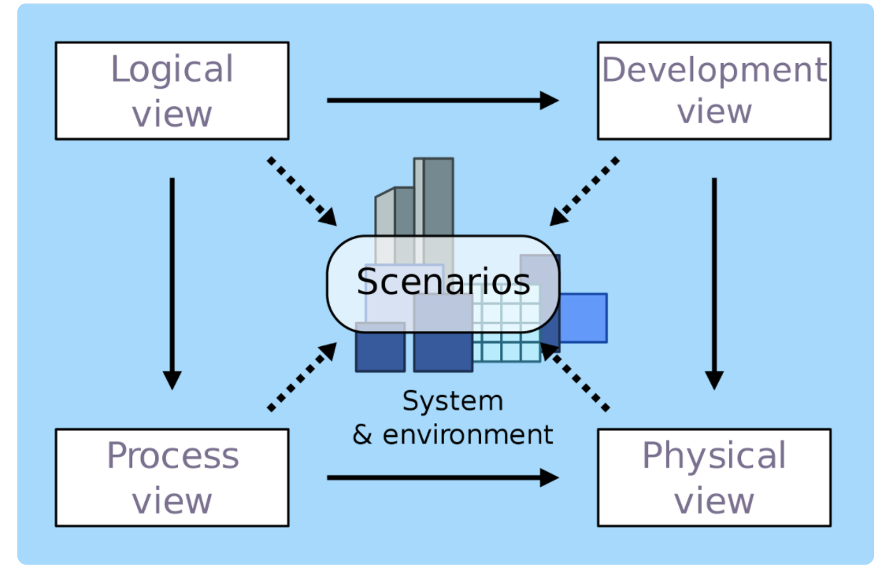

4+1 视图的核心理念是从不同的角度去剖析系统，看看系统的结构是什么样的，具体每个视图的含义是：

1）**逻辑视图**：从终端用户角度看系统提供给用户的功能，对应 UML 的 class 和 state diagrams。

2）**处理视图**：从动态的角度看系统的处理过程，对应 UML 的 sequence 和 activity diagrams。

3）**开发视图**：从程序员角度看系统的逻辑组成，对应 UML 的 package diagrams。

4）**物理视图**：从系统工程师角度看系统的物理组成，对应 UML 的 deployment diagrams。

5）**场景视图**：从用户角度看系统需要实现的需求，对应 UML 的 use case diagrams。

（备注：逻辑视图看到的“功能”和场景视图看到的“需求”不是一回事。一个需求可能涉及多个功能，例如“取款”这个场景涉及“插卡”“密码验证”“出钞”等功能；而多个需求可能涉及同一个功能，例如“取款”和“转账”是两个不同的需求，但是都涉及“密码验证”这个功能。）

可以看到，4+1 视图本身很全面也很规范，但是为什么在实际工作中，真正按照这个标准来画架构图的公司和团队并不多。

原因主要有三点：

1）架构复杂度增加：1995 年的时候，系统大部分还是单体系统，而现在分布式系统越来越多。如果我们用 4+1 视图来表示分布式系统的话，就会遇到困难，比如微服务架构下有那么多的微服务，Development view 就不好表示。

2）绑定 UML 图：UML 图画架构图存在问题，主要问题是不美观，表达能力弱。

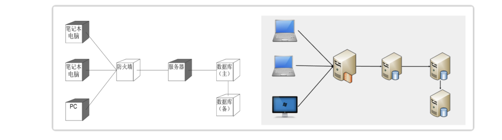

（备注：左图是用 UML 工具画的，右图是用 Visio 画的，对比之下，UML 图的缺点十分明显。）

3）**理解困难**：逻辑视图、开发视图和处理视图比较容易混淆。比如说，有人把逻辑视图理解为软件开发的类结构图，也有人把处理视图和开发视图等同，还有人认为逻辑视图就是开发视图。

这些原因导致 4+1 视图在目前的实际工作中并不是很实用。下面介绍怎么画软件系统架构图。

### 核心指导思想：4R 架构定义

其实，很多人之所以画不好架构图，最大的痛点就是不好把握到底要画哪些内容，画得太少担心没有展现关键信息，画得太多又觉得把握不住重点。所以现在的问题变成了：应该按照什么样的标准来明确架构图要展现的内容呢？

前面提到的 4R 架构定义：软件架构指软件系统的顶层（Rank）结构，它定义了系统由哪些角色（Role）组成，角色之间的关系（Relation）和运作规则（Rule）。

4R 是指 4 个关键词：Rank，Role，Relation 和 Rule。既然可以通过 4R 来定义软件系统的架构，那么按照 4R 架构定义的思路来画架构图也是很合情合理的，具体步骤如下：

1）明确 Rank：也就是说，不要事无巨细地把一个大系统的方方面面都在一张架构图中展现出来，而应该明确你要阐述的系统所属的级别（L0～L4），然后只描述这个级别的架构信息。

2）画出 Role：从不同的角度来分解系统，看看系统包含哪些角色，角色对应架构图中的区块、图标和节点等。

3）画出 Relation：有了角色后，画出角色之间的关系，对应架构图中角色之间的连接线，不同的连接线可以代表不同的关系。

4）最后画出 Rule：挑选核心场景，画出系统角色之间如何协作来完成某项具体的业务功能，对应系统序列图。

描述 Role 和 Relation 的架构图称为静态架构图，描述 Rule 的系统序列图称为动态架构图。

从某一个角度去看，静态架构图的数量跟系统复杂度有关，一般是 1～2 张，如果比较简单，用一张图就够了，如果比较复杂，就要分别用两张图来展现；而动态架构图是一般是多张，因为核心场景数量不止一个，对应的系统序列图有多张。

### 常见架构图

从不同的角度去剖析系统，就会得到不同的视图。其实按照 4R 架构定义来画架构图也是这样，用不同的方式去划分系统，就会得到不同类型的架构，分别对应不同类型的架构图。常见的类型整理如下：

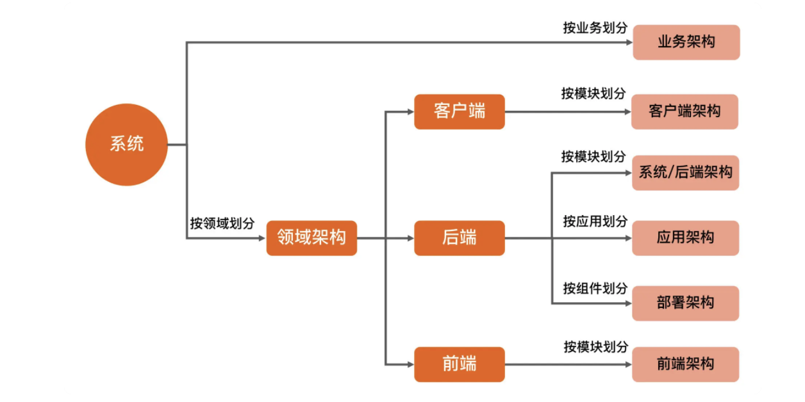

接下来讲解每一类架构图的特点。

#### 业务架构图

【定义】描述系统对用户提供了什么业务功能，类似于 4+1 视图的场景视图。

【使用场景】产品人员规划业务：比如说我们经常在产品规划和汇报会议上看到产品人员会用业务架构图来展现业务全局状态。给高 P 汇报业务：对于 P7+ 以上级别的技术人员，在汇报的时候不能光讲技术，也要讲业务的发展情况，用业务架构图就比较容易的展现业务整体情况。给新员工培训业务。

【画图技巧】

1）通过不同颜色来标识业务状态：比如说哪些业务发展状态好，哪些问题比较多，哪些比较稳定，哪些竞争比较激烈等。

2）业务分组管理：将类似的业务放在一个分组里面展现，用虚线框或者相同背景将其标识出来。

3）区块对齐：为了美观，可以改变不同区块的长短大小进行对齐，让整体看起来更美观。

【参考案例】AlipayHK 的一个业务架构图如下所示：

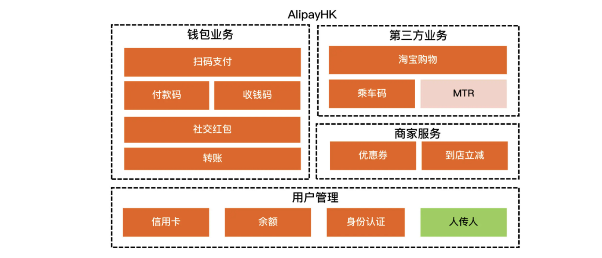

这张业务架构图有三点关键信息：

1）“MTR”区块是浅红色的，“人传人”区块是绿色的，浅红色代表正在进行的，绿色代表明年规划的。

2）分了 4 组：钱包业务、第三方业务、商家服务和用户管理。

3）“转账”和“社交红包”等区块比较长，只是为了对齐后更美观，不代表业务本身的量级或者重要程度，如果要表示这样的信息，那么可以用颜色来表示。

注意，千万不要画得五颜六色，一般一张图的颜色数量控制在 3 种以内是比较好的。所以在画图的时候你要想清楚，到底哪些信息是要放在业务架构图中重点展示的关键信息，哪些信息顺带讲一下就可以了。

#### 客户端和前端架构图

【定义】描述客户端和前端的领域逻辑架构，关注的是从逻辑的角度如何分解客户端或者前端应用。

【使用场景】

1）整体架构设计：由客户端或者前端架构师完成本领域的架构设计。

2）架构培训。

【画图技巧】

1）通过不同颜色来标识不同角色。

2）通过连接线来表示关系，如果有多种关系，例如有的是直接调用，有的是事件通知，那么可以用不同形状的线条来表示。

3）分层或分组：将类似的角色分层或者分组管理。

【参考案例】微信客户端架构 3.x 的架构图如下所示：

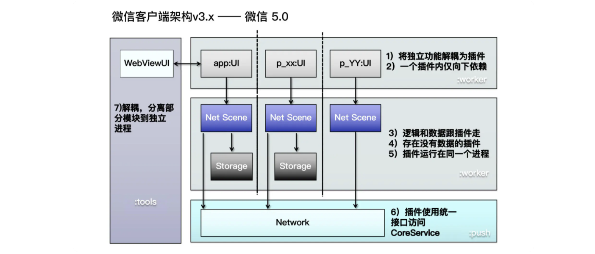

这张客户端架构图有三点关键信息：

1）图中用了灰色（app:UI 等）、蓝色（Net Scene 等）、深灰色（Storage）、浅蓝色（Network）来表示不同类型的模块。

2）图中有两类连接线：双向的（WebViewUI 和 app:UI），单向的（app:UI 和 Net Scene 等）。

3）整体上分为 4 组，对应图中背景色不同的四个大的区块。

#### 系统架构图

【定义】描述后端的逻辑架构，又叫“后端架构”或“技术架构”，不管是业务系统、中间件系统，还是基础的操作系统、数据库系统等，系统架构都是软件系统架构的核心。

【使用场景】整体架构设计。架构培训。

【画图技巧】通过不同颜色来标识不同角色。通过连接线来表示关系。逻辑分组。

【参考案例】如果系统比较简单，可以参考 MongoDB Sharding 的系统架构图，如下所示：

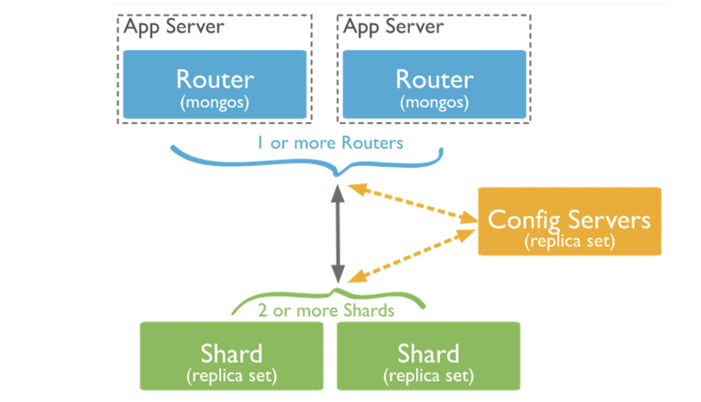

如果系统相对复杂，建议首先用一张图来展示系统架构里面的角色（Role）以及每个角色的核心功能；然后再用一张图来展示角色之间的关系（Relation），可以参考一个支付中台的系统架构图，如下所示：

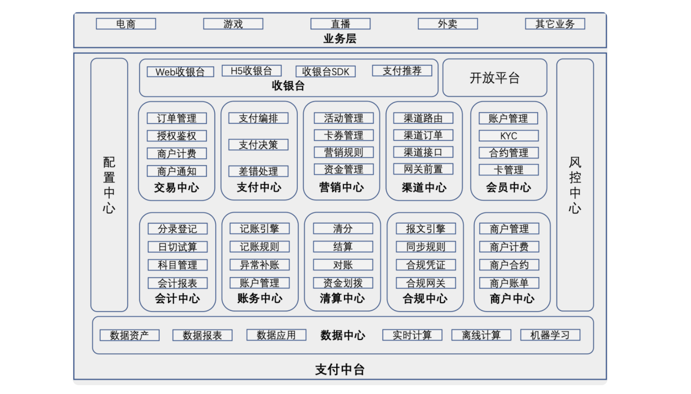

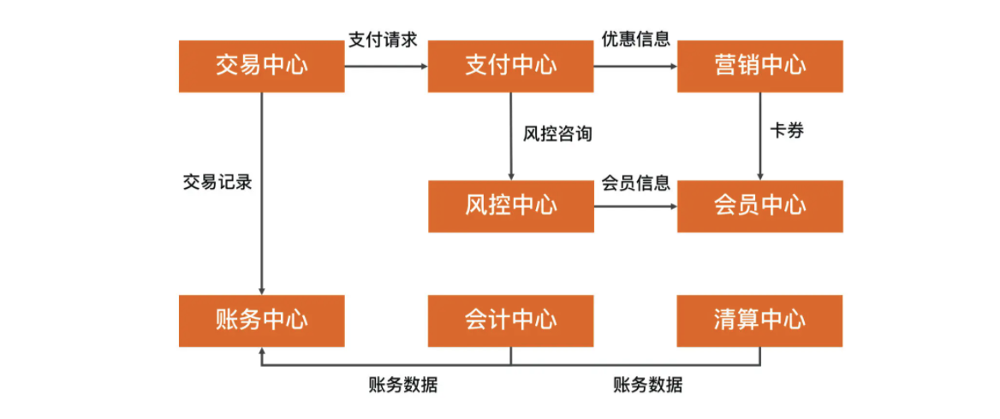

（备注：完整的支付中台关系图太大了，这张关系图只是摘取其中一部分作为示意图，供你参考。）

#### 应用架构图

【定义】描述后端系统由哪些应用组成，一个应用就是一个可部署发布运行的程序，它是项目开发过程中，开发测试运维团队协作的基础。

【使用场景】项目开发、测试。运维部署发布。子域架构设计。

【画图技巧】通过不同颜色来标识不同角色。通过连接线来表示关系。复杂系统分域来画。

【参考案例】如果系统比较简单，那么基本上应用架构和系统架构是等价的，可以参考 MongoDB Sharding 的应用架构图，如下所示：

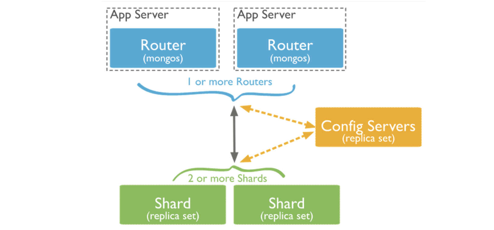

可以看到，这张图中的 Router（mongos）、Config Servers 和 Shard（replica set），既包含了系统架构的角色信息（Router、Config Servers 和 Shard），又包含了应用信息（mongos、Config Servers 和 Shard）。

如果系统比较复杂，按照架构分层的角度来看，应用架构已经到了可执行程序这一层，例如支付中台这一类的系统，包含的应用可能有几百上千个，如果把整个支付中台所有的应用都在一张图里面展示出来，信息太多太密，可能会导致架构图都看不清。

这种情况下，应用架构一般都是按照子域来画应用架构图，可以参考支付中台的会员域的应用架构图，如下所示：

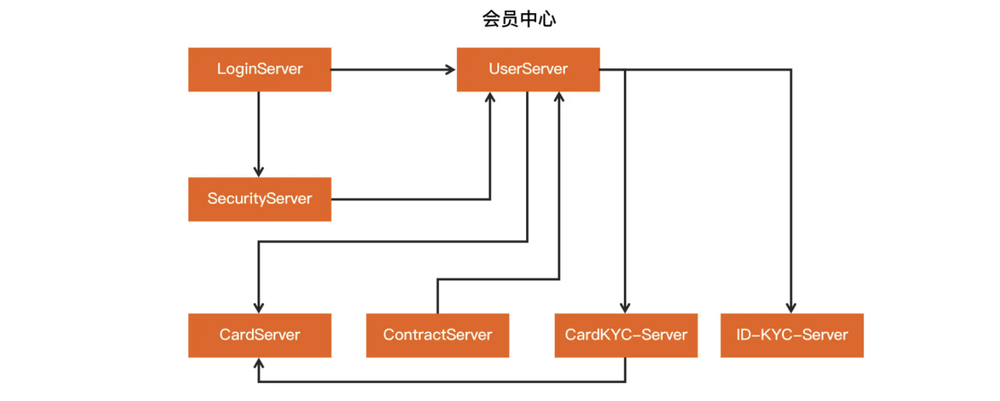

#### 部署架构图

【定义】描述后端系统具体是如何部署的，主要包含机房信息、网络信息和硬件信息等。

【使用场景】总体架构设计。运维规划和优化。

【画图技巧】用图标代替区块，这样看起来更加美观和容易理解。

【参考案例】一个简单的支付系统的部署架构图如下所示：

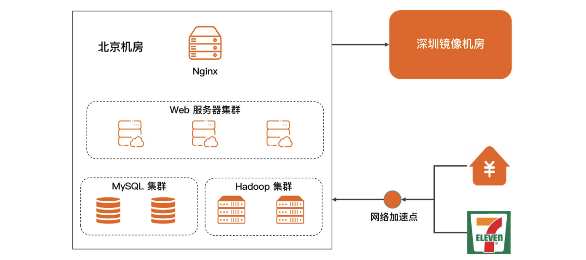

#### 系统序列图

【定义】描述某个业务场景下，系统各个角色如何配合起来完成业务功能。

【使用场景】结合“系统架构、应用架构和部署架构”来使用。

【画图技巧】使用 UML 的序列图来画。

【参考案例】“扫码支付”这个支付核心场景的系统序列图如下所示：

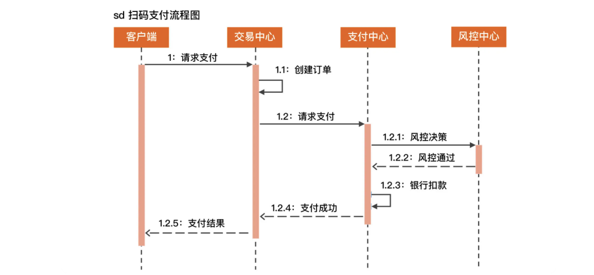

（备注：这张序列图的角色对应前面“系统架构”这一小节的支付中台系统的关系图。）

### 补充说明

如果你曾经研究过架构图的标准，那么除了 4+1 视图以外，你可能还看到过 TOGAF 的“业务架构（跟这一讲的业务架构名字相同，但是意义不同）、数据架构（不是指大数据平台架构，而是指数据资产的架构）、应用架构和技术架构”这种说法，或者还看到过 C4 架构模型（Context、Container、Component 和 Code）等等。

但其实目前业界并没有就架构图标准达成共识，刚才提到的 TOGAF 是企业级的架构，基本上要到 CTO 这个级别才能接触的，而 C4 模型的表达能力又不够。这里并没有直接套用这些内容，而是根据个人经验，将认为最有效果的架构图整理出来。这些架构图，都是在不同类型不同规模不同业务的公司（华为、UC、阿里和蚂蚁等）里面验证过的，可以放心地使用。
